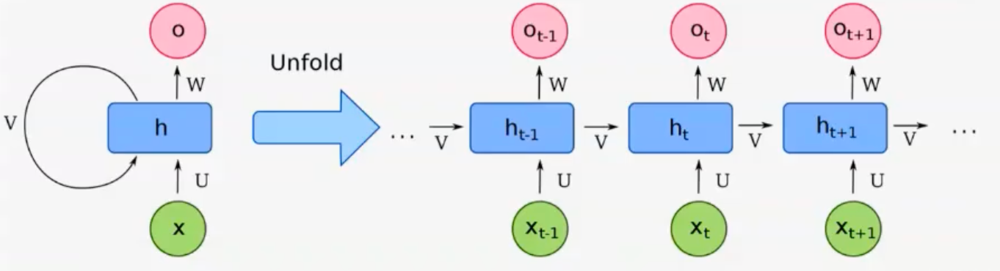
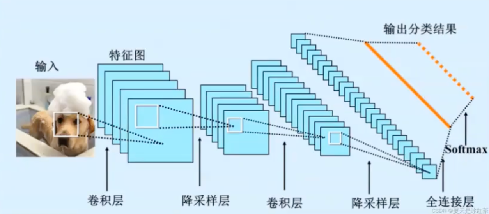
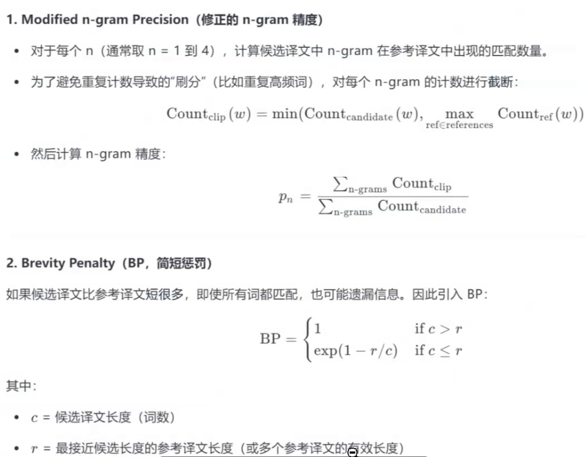
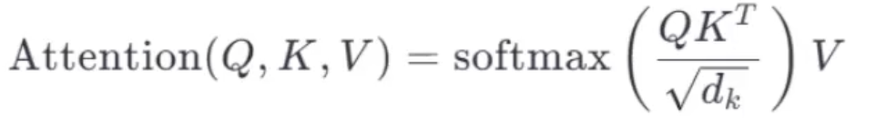
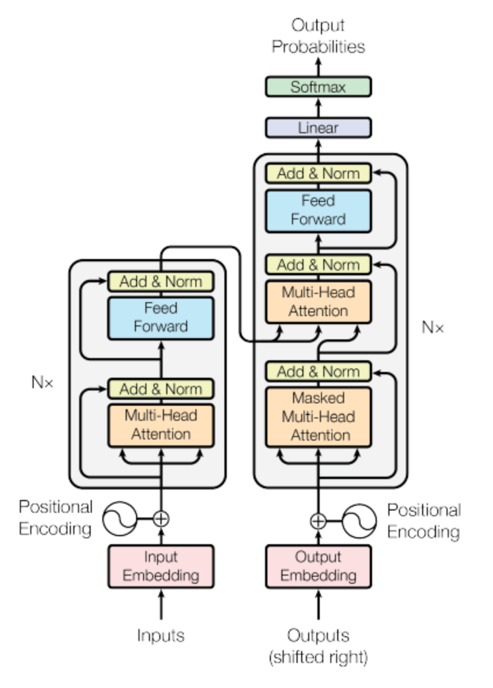
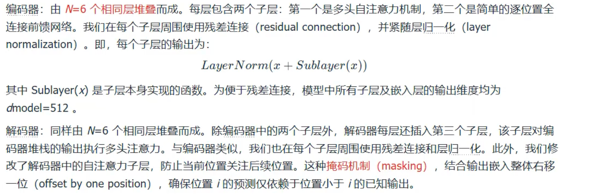

# Transformer论文精读（Attention is all you need）

## 循环神经网络RNN

**解决了什么问题？**

- 处理序列数据，因为这些数据是前后关联的。
- 传统神经网络输入是独立的，无法利用上下文。

**如何工作？**

RNN有一个隐藏状态，可以理解成一个记忆笔记本。

当按照顺序序列读取每一个元素的时候，不仅会处理当前的输入，还会查阅上一个时间的记忆笔记本。

**主要缺陷**

- 短期记忆问题；RNN记忆笔记本容量有限，当序列很长的时候，最早的信息就会被遗忘。好比学了后边忘了前边。
- 并行化困难：必须一个一个按照顺序处理，无法同时进行，计算速度很慢。

## 卷积神经网络CNN

**解决了什么问题？**

- 高效处理具有网格状空间结构的数据（图像、语音、视频等）。
- 传统的全连接神经网络处理图像时，忽略像素之间的空间关系（比如，一只狗耳朵是在上面还是下面），并且参数量很大，容易过拟合。

**如何工作？**

- 核心是三个关键思想：局部感知、权重共享、空间降采样。
- 卷积层：使用一个小的”过滤器“，像手电筒一样对图像进行扫描，局部的提取特征（边缘、纹理）。同一个过滤器共享参数扫描全表，减少了参数量
- 池化层：提取的特征图进行”降采样“，使得特征位置发生了微小变化的话结果不变，压缩了数据量。
- 全连接层：将学习到的高级特征图综合起来，进行最终的分类或预测。

**优势和局限**

- 优势：
  - 参数效率高：权重共享机制是他的参数远远小于全连接网络。
  - 平移不变性：无论特征出现在图像的那一个位置，都可以被识别出来。
- 局限：
  - 空间变换敏感：图像中的内容发生剧烈旋转或者是缩放，识别效果会大大下降。
  - 缺乏全局上下文：只关注局部地区，难以建立相隔很远的像素之间的关系。

## 编码器和解码器

- 编码器：将输入序列编码为语义表示
- 解码器：基于编码表示生成目标

## BLEU

### BLEU概念

BLEU是一种基于n-gram重合度的自动评估指标，通过修正精度和长度惩罚来近似衡量机器生成文本和人类参考文本的相似程度。

主要从两个方面衡量：

1. n-gram精度
2. 长度惩罚

最终的BLEU分数是有以下生成。

举例说明：

- 候选文段："the cat sat on the mat"
- 参考文段："the cat is on the mat"

1-gram匹配：the, cat, on, the, mat ---> 5/6 ≈ 0.83

2-gram匹配：the cat, on the, the mat ---> 3/5 = 0.6

......

再结合BP，此处是1，最终得到BLEU分数。

## 长短期记忆网络（LSTM）

核心创新：引入门控机制（gates）控制信息流动：

- 遗忘门（Forget Gate）：决定丢弃那一些历史信息。
- 输入门（Input Gate）：决定更新哪一些新的信息
- 输出门（Output Gate）：决定输出什么。

缓步减少了梯度消失问题，有效建模数百步甚至是数千部依赖关系。

## 门控循环单元（GRU）

简化了LSTM，将遗忘门和输入门合并成更新门（Update Gate），并引入重置门（Reset Gate）。

- 参数更少，训练更快
- 性能上与LSTM相当甚至更好

## 性能极限探索

RNN架构的理论极限：

- 无法并行计算（按时间顺序处理）
- 长程依赖有瓶颈
- 训练慢、内存占用高

## Transformer：任意两点直接连接，操作数为常数

Transformer使用 **自注意力机制（Self - Attention）**

- 对于序列中的i和j，无论相距多远，都可以在单一层中直接计算关联权重。

- 计算公式

  

- QKV来自所有位置的嵌入。

- 每个位置的新表示是所有位置的加权和。

**代价：降低有效分辨率**

- 自注意力对所有位置的加权平均，输出是一个混合表示
- 如果某个位置需要精确聚焦某一个特性词，而其他词的权重很小但非零，这个焦点就会被模糊化。
- CNN和稀疏注意力可能更加锐利。

**解决：多头注意力（Multi-Head Attention）**

Transformer通过 **多头机制** 弥补这一个分辨率损失。

- 将注意力拆分成多个头，每个头学习不同的表示子空间。
- 某些头可能专注于局部依赖（相邻词），某些头专注于长距离语法关系，某一些头关注语义角色等。
- 最后将所有头的输出拼接并线性转换，得到丰富、多视角的表示。

## Transformer模型架构

## 编码器和解码器的堆栈

