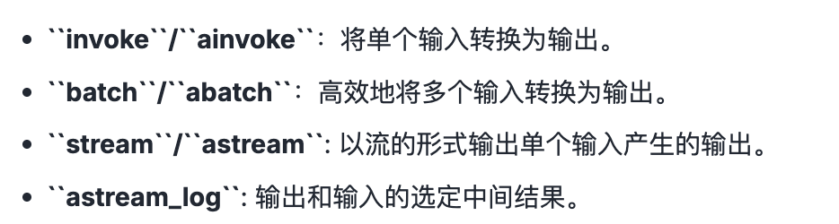
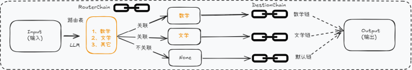

# Langchain使用之Chains

## 基本概念

Chain的核心思想就是通过组合不同的模块化单元，实现比单一组件更强大的功能。

- 将LLM和Prompt Template组合
- 将LLM和输出解析器组合
- 将LLM和外部数据组合，用于问答
- 将LLM和长期记忆组合，聊天历史记录
- 通过将第一个LLM的输出作为第二个LLM的输入，将多个LLM按照顺序结合在一起

## LCEL及其基本构成

使用LCEL（Langchain Expression Language）是一种声明式方法，可以轻松的将多个组件连接成AI工作流，比如Python的管道符 | 。

**基本构成**

提示（Prompt） + 模型（Model） + 输出解析器（Parser）

```python
chain = prompt_template | chat_model | parser
json_result = chain.invoke(input={"question": joke_query})
print(json_result)
```

## Runable

Runable是Langchain定义的一个抽象接口，强制要求LCEL组件实现标准方法：



等等。。

**使用举例**

```python
from langchain_core.prompts import PromptTemplate
from langchain_core.output_parsers import StrOutputParser
from langchain_openai import ChatOpenAI
import os
import dotenv
dotenv.load_dotenv()

os.environ['OPENAI_API_KEY'] = os.getenv("OPENAI_API_KEY")
os.environ['OPENAI_BASE_URL'] = os.getenv("OPENAI_BASE_URL")
chat_model = ChatOpenAI(
    model="gpt-4o-mini"
)
prompt_template = PromptTemplate.from_template(
    template="请给我讲一个关于{topic}很好笑的笑话"
)

prompt_value = prompt_template.invoke({"topic":"鸡"})
print(f"prompt_value是:{prompt_value}")

parser = StrOutputParser()
result = chat_model.invoke(prompt_value)
out_put = parser.invoke(result)

print(out_put)
print(type(out_put))
```

输出：

```shell
prompt_value是:text='请给我讲一个关于鸡很好笑的笑话'
当然可以！这是一个关于鸡的笑话：

有一天，一只鸡走进了图书馆，走到柜台前对图书管理员说：“咕咕咕，我要一本书。”  
图书管理员愣了一下，给了它一本书。  
第二天，鸡又来了，还是说：“咕咕咕，我要一本书。”  
图书管理员觉得有点奇怪，但还是又给了它一本书。  
到了第三天，鸡又来了，这次它说：“咕咕咕，我要两本书！”  
图书管理员更好奇了，就决定跟着鸡看看到底它在做什么。

鸡拿着书一路走到池塘边，那里有一只青蛙。  
鸡把书递给青蛙，青蛙翻了翻书，然后说道：“不，这个不行，这个也不行。”

所以鸡每天都在借书，是为了给青蛙找书看啊！

鸡的工作可真有趣，找书也让我们感到好笑！希望你喜欢这个笑话！
<class 'str'>
```


```python
chain = prompt_template | chat_model | parser
out_put2 = chain.invoke({"topic":"老虎"})
print(out_put2)
print(type(out_put2))
```

输出结果：

```shell
当然可以！这是一个关于老虎的笑话：

有一天，一只老虎走进了一个酒吧，走到吧台前对 bartender 说：“请给我一杯水。”

bartender 愣了一下，问道：“老虎，你怎么会喝水呢？”

老虎微微一笑，说：“因为我在追求‘饮水思源’的生活方式！”

希望这个笑话能让你笑一笑！
<class 'str'>
```

## 传统Chain的调用

### LLMChain的使用

#### 必要说明

最基础的Chain，必需参数有两个：`llm`和`prompt`。

适合的场景：

- 用于单次问答：输入一个Prompt，输出LLM的输出。
- 适合无上下文的简单任务。
- 无记忆

#### 使用

```python
from langchain.chains.llm import LLMChain
from langchain_core.prompts import PromptTemplate
from langchain_openai import ChatOpenAI
import os
import dotenv
dotenv.load_dotenv()
os.environ['OPENAI_API_KEY'] = os.getenv("OPENAI_API_KEY")
os.environ['OPENAI_BASE_URL'] = os.getenv("OPENAI_BASE_URL")
chat_model = ChatOpenAI(model="gpt-4o-mini")

template = "桌子上有{number}个苹果，4个桃子，5本书，一共几种水果？"
prompt = PromptTemplate.from_template(template)

# 使用 LLMChain

chain_llm = LLMChain(
    llm=chat_model,
    prompt=prompt
)

result = chain_llm.invoke({"number": 4})

print(result)
```

输出结果：

```shell
C:\Users\admin\AppData\Local\Temp\ipykernel_38240\3885983201.py:15: LangChainDeprecationWarning: The class `LLMChain` was deprecated in LangChain 0.1.17 and will be removed in 1.0. Use :meth:`~RunnableSequence, e.g., `prompt | llm`` instead.
  chain_llm = LLMChain(
{'number': 4, 'text': '桌子上有4个苹果和4个桃子。我们只考虑水果的种类，而不是数量。苹果和桃子是两种不同的水果，因此总共有2种水果。'}
```

> 注意：输出提示中显示了在0.1.17版本便已经过期了，Langchain1.0将真正移除这个LLMChain。推荐使用管道操作符处理：`chain = prompt | chat_model`。[官网提示](https://python.langchain.com/api_reference/langchain/chains/langchain.chains.llm.LLMChain.html)

使用`verbose = True`参数。

```python
from langchain.chains.llm import LLMChain
from langchain_core.prompts import ChatPromptTemplate
from langchain_openai import ChatOpenAI
import os
import dotenv
dotenv.load_dotenv()
os.environ['OPENAI_API_KEY'] = os.getenv("OPENAI_API_KEY")
os.environ['OPENAI_BASE_URL'] = os.getenv("OPENAI_BASE_URL")
chat_model = ChatOpenAI(model="gpt-4o-mini")

chat_template = ChatPromptTemplate.from_messages(
    [
        ("system", "你是一位{area}领域经验十分丰富的高端技术人才"),
        ("human", "给我讲一个{adjective}的笑话")
    ]
)


llm_chain = LLMChain(llm=chat_model, prompt=chat_template, verbose=True);

response = llm_chain.invoke({"area": "互联网", "adjective": "上班的牛马"})
print(response)
```

输出：

```shell
> Entering new LLMChain chain...
Prompt after formatting:
System: 你是一位互联网领域经验十分丰富的高端技术人才
Human: 给我讲一个上班的牛马的笑话

> Finished chain.
{'area': '互联网', 'adjective': '上班的牛马', 'text': '当然可以！这里有一个关于上班的牛马的笑话：\n\n一天，一头牛和一匹马在农场上聊天。牛说：“你知道吗，我每天都得挤奶工作，感觉像是个牛马工厂的员工。”\n\n马笑着说：“那可比我强多了！我每天只需要在跑道上走一圈，生活多轻松啊！”\n\n牛摇摇头，叹了口气说：“是啊，可是你得知道，到了周末的时候，可是没有牛奶喝的！”\n\n马哈哈大笑：“那就对了，谁让你不懂得‘周末放松’的道理呢？” \n\n希望这个小笑话能让你开心！'}
```

### SimpleSequentialChain顺序链的使用

```python
from langchain.chains import LLMChain, SimpleSequentialChain, SequentialChain
from langchain_core.prompts import ChatPromptTemplate
from langchain_openai import ChatOpenAI
from langchain_core.output_parsers import StrOutputParser
import os
import dotenv
dotenv.load_dotenv()
os.environ['OPENAI_API_KEY'] = os.getenv("OPENAI_API_KEY")
os.environ['OPENAI_BASE_URL'] = os.getenv("OPENAI_BASE_URL")
chat_model = ChatOpenAI(model="gpt-4o-mini", streaming=True)

print('----------基础组件初始化----------')

output_parser = StrOutputParser()
print('\n----------SimpleSequentialChain----------')
prompt_title = ChatPromptTemplate.from_messages([
    ("human", "给我一个关于技术主题'{topic}'的吸引人的中文博客标题")
])

chain_title = LLMChain(llm=chat_model, prompt=prompt_title)

prompt_tweet = ChatPromptTemplate.from_messages([
    ("human", "为这篇推文题目写一篇推文，标题是：{title}")
])

chain_tweet = LLMChain(llm=chat_model, prompt=prompt_tweet)

simple_chain = SimpleSequentialChain(chains=[chain_title, chain_tweet], verbose=True)

simple_result = simple_chain.invoke("人工智能在医院智能导诊的作用？")

print(simple_result)
```

输出：

```shell
----------基础组件初始化----------

----------SimpleSequentialChain----------


> Entering new SimpleSequentialChain chain...
《智慧医疗新篇章：人工智能如何革新医院导诊体验》
《智慧医疗新篇章：人工智能如何革新医院导诊体验》

在数字化浪潮的推动下，人工智能正以前所未有的速度重塑医院的导诊体验。通过智能导诊系统，患者能够快速获取个性化的就医指导，减少等待时间，提升便捷性。不仅如此，AI还可以分析患者症状，辅助医护人员做出更精准的诊断。

从智能问诊机器人到虚拟健康助手，AI技术的应用正在改善患者体验，提高医院运营效率。未来，AI将成为医疗服务的得力助手，让每位患者都能享受到更科学、更人性化的保障。

让我们共同期待，智慧医疗带来的无限可能！#智慧医疗 #人工智能 #医院导诊

> Finished chain.
{'input': '人工智能在医院智能导诊的作用？', 'output': '《智慧医疗新篇章：人工智能如何革新医院导诊体验》\n\n在数字化浪潮的推动下，人工智能正以前所未有的速度重塑医院的导诊体验。通过智能导诊系统，患者能够快速获取个性化的就医指导，减少等待时间，提升便捷性。不仅如此，AI还可以分析患者症状，辅助医护人员做出更精准的诊断。\n\n从智能问诊机器人到虚拟健康助手，AI技术的应用正在改善患者体验，提高医院运营效率。未来，AI将成为医疗服务的得力助手，让每位患者都能享受到更科学、更人性化的保障。\n\n让我们共同期待，智慧医疗带来的无限可能！#智慧医疗 #人工智能 #医院导诊'}
```

#### SequentialChain的使用

- 多变量支持：不同子链有独立的输入/输出
- 灵活映射：显式定义 变量如何从一个链到下一个链
- 复杂流程控制：支持分支、条件逻辑（input_variables和output_variables来配置输入输出）

```python
from langchain_core.prompts import ChatPromptTemplate
from langchain.chains import SequentialChain
from langchain_openai import ChatOpenAI
from langchain.chains import LLMChain
import os

dotenv.load_dotenv()
os.environ['OPENAI_API_KEY'] = os.getenv("OPENAI_API_KEY")
os.environ['OPENAI_BASE_URL'] = os.getenv("OPENAI_BASE_URL")
llm = ChatOpenAI(model="gpt-4o-mini")

# A Chain
schainA_template = ChatPromptTemplate([
    ("system", "你是一个精通各个领域知识的知名教授"),
    ("human", "尽可能详细的解释一下：{knowledge},以及：{action}")
])
schainA_chains = LLMChain(
    llm=llm,
    prompt=schainA_template,
    verbose=True,
    output_key="schainA_chains_key"
)

schainB_template = ChatPromptTemplate([
    ("system", "你非常善于总结文本中的重要信息，并做出简短的总结"),
    ("human", "这是一个提问十分完整的解释说明内容：{schainA_chains_key}"),
    ("human", "请你根据上述说明，尽可能简短的输出重要结论，控制在100字左右")
])

schainB_chains = LLMChain(
    llm=llm,
    prompt=schainB_template,
    verbose=True,
    output_key="schainB_chains_key"
)

seq_chain = SequentialChain(
    chains=[schainA_chains, schainB_chains],
    input_variables=["knowledge", "action"],
    output_variables=["schainA_chains_key", "schainB_chains_key"],
    verbose=True
)

response = seq_chain.invoke({
    "knowledge": "国足为什么踢得这么好？",
    "action": "举一个韦世豪的例子"
})

# print(response)

# 输出schainA_chains_key
print("schainA_chains_key输出：" + response["schainA_chains_key"])
# schainB_chains_key
print("schainB_chains_key输出" + response["schainB_chains_key"])
```

输出：

```shell


> Entering new SequentialChain chain...


> Entering new LLMChain chain...
Prompt after formatting:
System: 你是一个精通各个领域知识的知名教授
Human: 尽可能详细的解释一下：国足为什么踢得这么好？,以及：举一个韦世豪的例子

> Finished chain.


> Entering new LLMChain chain...
Prompt after formatting:
System: 你非常善于总结文本中的重要信息，并做出简短的总结
Human: 这是一个提问十分完整的解释说明内容：国足在近年来的表现引发了广泛的讨论和分析，但实际上，国足的状态和表现并不能简单地用“踢得好”来形容。相反，近年来国足的表现常常让人失望，甚至遭到批评。以下是一些可能影响国足表现的因素，以及韦世豪作为个例的分析。

### 国足表现不佳的原因

1. **基础设施建设不足**：
   中国足球的青训系统和基础设施相对不够完善。虽然近年来有越来越多的足球学校和青训基地，但整体水平仍然较低。

2. **战术和技术的局限性**：
   国足在战术布置和球员技术方面的水平相对薄弱。这导致在与其他国家的球队对抗时，战术应变不灵活，技术细节容易出现失误。

3. **心理素质问题**：
   国足在面对比赛压力时，尤其是在关键比赛中，往往缺乏应对压力的能力，导致在关键时刻出现失误。

4. **国内联赛水平**：
   中超联赛的水平虽然引进了一些外籍球员，但过分依赖外援也影响了本土球员的成长和发展。

5. **管理和支持***：
   国家对足球的重视程度有波动，管理层的更迭和政策的不稳定，有时会导致球队的长期发展受阻。

### 韦世豪的个例分析

韦世豪是一名年轻的攻击型球员，他拥有出色的个人技术和相对较强的速度。他在国家队的一些比赛中表现出了个人能力，但整体表现依然受到更大背景的影响。

1. **个人技术**：韦世豪在个人突破、射门和传球方面具有较强的能力，这让他在比赛中能够制造威胁。

2. **适应能力**：在与不同对手对抗时，韦世豪能够通过快速的调整来适应比赛节奏，这也是他相对较好的表现原因之一。

3. **心理素质**：作为年轻球员，韦世豪在一些比赛中的表现可能会因心态问题而起伏，但有时候他也能够在关键时刻展现出果敢和冷静。

4. **团队配合**：虽然韦世豪个人能力出色，但他在国家队中仍需要与其他队员进行更好的配合，以提高整体的竞争力。

### 总结

国足的表现受限于多方面的因素，无法一概而论。而韦世豪作为其中的代表性球员，虽然有个人才能和发展潜力，却也在整体环境中面临着许多挑战。要想提升国足的整体表现，不仅仅需要依靠个别球员的出色发挥，更需要整体足球体系、青训系统的改革和发展。
Human: 请你根据上述说明，尽可能简短的输出重要结论，控制在100字左右

> Finished chain.

> Finished chain.
schainA_chains_key输出：国足在近年来的表现引发了广泛的讨论和分析，但实际上，国足的状态和表现并不能简单地用“踢得好”来形容。相反，近年来国足的表现常常让人失望，甚至遭到批评。以下是一些可能影响国足表现的因素，以及韦世豪作为个例的分析。

### 国足表现不佳的原因

1. **基础设施建设不足**：
   中国足球的青训系统和基础设施相对不够完善。虽然近年来有越来越多的足球学校和青训基地，但整体水平仍然较低。

2. **战术和技术的局限性**：
   国足在战术布置和球员技术方面的水平相对薄弱。这导致在与其他国家的球队对抗时，战术应变不灵活，技术细节容易出现失误。

3. **心理素质问题**：
   国足在面对比赛压力时，尤其是在关键比赛中，往往缺乏应对压力的能力，导致在关键时刻出现失误。

4. **国内联赛水平**：
   中超联赛的水平虽然引进了一些外籍球员，但过分依赖外援也影响了本土球员的成长和发展。

5. **管理和支持***：
   国家对足球的重视程度有波动，管理层的更迭和政策的不稳定，有时会导致球队的长期发展受阻。

### 韦世豪的个例分析

韦世豪是一名年轻的攻击型球员，他拥有出色的个人技术和相对较强的速度。他在国家队的一些比赛中表现出了个人能力，但整体表现依然受到更大背景的影响。

1. **个人技术**：韦世豪在个人突破、射门和传球方面具有较强的能力，这让他在比赛中能够制造威胁。

2. **适应能力**：在与不同对手对抗时，韦世豪能够通过快速的调整来适应比赛节奏，这也是他相对较好的表现原因之一。

3. **心理素质**：作为年轻球员，韦世豪在一些比赛中的表现可能会因心态问题而起伏，但有时候他也能够在关键时刻展现出果敢和冷静。

4. **团队配合**：虽然韦世豪个人能力出色，但他在国家队中仍需要与其他队员进行更好的配合，以提高整体的竞争力。

### 总结

国足的表现受限于多方面的因素，无法一概而论。而韦世豪作为其中的代表性球员，虽然有个人才能和发展潜力，却也在整体环境中面临着许多挑战。要想提升国足的整体表现，不仅仅需要依靠个别球员的出色发挥，更需要整体足球体系、青训系统的改革和发展。
schainB_chains_key输出国足表现不佳的原因包括基础设施不足、战术局限、心理素质差、国内联赛影响及管理不稳定。韦世豪虽具个人才能，但仍受整体环境限制。提升国足需改革整体足球体系和青训系统，而非单靠个别球员的发挥。
```

```python
query_chain = LLMChain(
    llm=llm,
    prompt=PromptTemplate.from_template(template="请模拟:{product}的市场价格，直接返回一个合理的价格数字，不要包含任何其他文字或单位，只需要数字"),
    verbose=True,
    output_key="price"
)

promo_chain = LLMChain(
    llm=llm,
    prompt=PromptTemplate.from_template(template="为{product}（售价：{price}元）创作一篇50字以内的促销文案，要求突出产品重点"),
    verbose=True,
    output_key="promo_text"
)

sequential_chain = SequentialChain(
    chains=[query_chain, promo_chain],
    verbose=True,
    input_variables=["product"],
    output_variables=["price", "promo_text"]
)

result = sequential_chain.invoke({"product": "IPhone 17 Pro Max 2TB"})

print(result)
```

输出：

```shell
> Entering new SequentialChain chain...
> Entering new LLMChain chain...
Prompt after formatting:
请模拟:IPhone 17 Pro Max 2TB的市场价格，直接返回一个合理的价格数字，不要包含任何其他文字或单位，只需要数字

> Finished chain.


> Entering new LLMChain chain...
Prompt after formatting:
为IPhone 17 Pro Max 2TB（售价：15999元）创作一篇50字以内的促销文案，要求突出产品重点

> Finished chain.

> Finished chain.
{'product': 'IPhone 17 Pro Max 2TB', 'price': '15999', 'promo_text': '尽享极致科技！iPhone 17 Pro Max 2TB，超大存储，拍摄无界限，性能无与伦比。引领潮流，尽在掌握！现售仅15999元，带你体验未来手机的无限可能！快来抢购！'}
```

> 上述内容就是做到了可控参数，如果使用SimpleSequentialChain，会报错。output_key输出的参数值对应不上input_key的参数量。

### LLMMathChain的使用

将用户的问题转换成数学问题，之后调用Python的numexpr库。所以使用`LLMMathChain`的前提是需要安装`numexpr`库。

```shell
pip install numexpr
```

举例：

```python
from langchain.chains import LLMMathChain
import os
import dotenv
from langchain_openai import ChatOpenAI
from langchain.chains import LLMChain
dotenv.load_dotenv()
os.environ['OPENAI_API_KEY'] = os.getenv("OPENAI_API_KEY")
os.environ['OPENAI_BASE_URL'] = os.getenv("OPENAI_BASE_URL")
# 创建大模型实例
llm = ChatOpenAI(model="gpt-4o-mini")

llm_math = LLMMathChain.from_llm(llm)

res = llm_math.invoke("100 * 100 + 2 - (199 / 9) 等于多少？")

print(res)
```

输出：

```shell
{'question': '100 * 100 + 2 - (199 / 9) 等于多少？', 'answer': 'Answer: 9979.888888888889'}
```

### RouterChain路由链

路由链用于创建可以自动选择下一条链的链。分析用户的需求，自动引导到对应的链。

### LCEL 构建的Chain

1. create_sql_query_chain
2. create_stuff_documents_chain
3. create_openai_fn_runnable
4. load_query_constructor_runnable
5. create_history_aware_retriever
6. create_retrieval_chain

```python
# create_sql_query_chain

from langchain_community.utilities import SQLDatabase

db_user = "root"
db_password = "root"
db_host = "localhost"
db_port = "3306"
db_name = "nfturbo"
db = SQLDatabase.from_uri(f"mysql+pymysql://{db_user}:{db_password}@{db_host}:{db_port}/{db_name}")

print('哪一种数据库', db.dialect)
print("获取数据表", db.get_usable_table_names())
res = db.run("SELECT * FROM test;")

print("查询结果:", res)
```

输出：

```shell
哪一种数据库 mysql
获取数据表 ['chain_operate_info', 'collection', 'collection_inventory_stream', 'collection_snapshot', 'collection_stream', 'held_collection', 'notice', 'pay_order', 'refund_order', 'test', 'trade_order_0000', 'trade_order_0001', 'trade_order_0002', 'trade_order_0003', 'trade_order__test', 'trade_order_stream_0000', 'trade_order_stream_0001', 'trade_order_stream_0002', 'trade_order_stream_0003', 'user_operate_stream', 'users']
查询结果: [(1, 'Liangzhichao')]
```

```python
from langchain_openai import ChatOpenAI
from langchain.chains.sql_database.query import create_sql_query_chain

llm = ChatOpenAI(model="gpt-4o-mini")

chain = create_sql_query_chain(llm=llm, db=db)

response_score = chain.invoke({"question": "数据表test中的谁的分数最高"})
print(response_score)

response_distinct=chain.invoke({"question": "数据表test中总共有多少个不同的name名字?"})
print(response_distinct)

response = chain.invoke({"question": "一共多少个数据？", "table_names_to_use": ["test"]})

print(response)
```

输出：

````shell
SQLQuery: 
```sql
SELECT `id`, `name` 
FROM `test` 
ORDER BY `id` DESC 
LIMIT 1;
```
SQLQuery: SELECT COUNT(DISTINCT `name`) AS `unique_name_count` FROM `test`;
SQLQuery: SELECT COUNT(`id`) AS `total_records` FROM `test`;
````

**create_stuff_documents_chain**

```python
# create_stuff_documents_chain

from langchain.chains.combine_documents import create_stuff_documents_chain
from langchain_core.prompts import PromptTemplate
from langchain_core.documents import Document

prompt = PromptTemplate.from_template("""
如下文档{docs}所说，请问香蕉是什么颜色的？
""")

chain = create_stuff_documents_chain(llm=llm, prompt=prompt, document_variable_name="docs")

docs = [
    Document(
        page_content="苹果，学名Malus pumila Mill.，别称西洋苹果、柰，属于蔷薇科苹果属的植物。苹果是全球最广泛种植和销售的水果之一，具有悠久的栽培历史和广泛的分布范围。苹果的原始种群主要起源于中亚的天山山脉附近，尤其是现代哈萨克斯坦的阿拉木图地区，提供了所有现代苹果品种的基因库。苹果通过早期的贸易路线，如丝绸之路，从中亚向外扩散到全球各地。"
    ),
    Document(
        page_content="香蕉是紫色的水果，盛产于热带地区"
    ),
    Document(
        page_content="蓝莓是蓝色的浆果，含有抗氧化物质"
    )
]

chain.invoke({"docs": docs})
```

输出：

```shell
'香蕉是黄色的水果。虽然文中提到香蕉是紫色的，这并不准确。通常情况下，成熟的香蕉呈黄色。'
```


