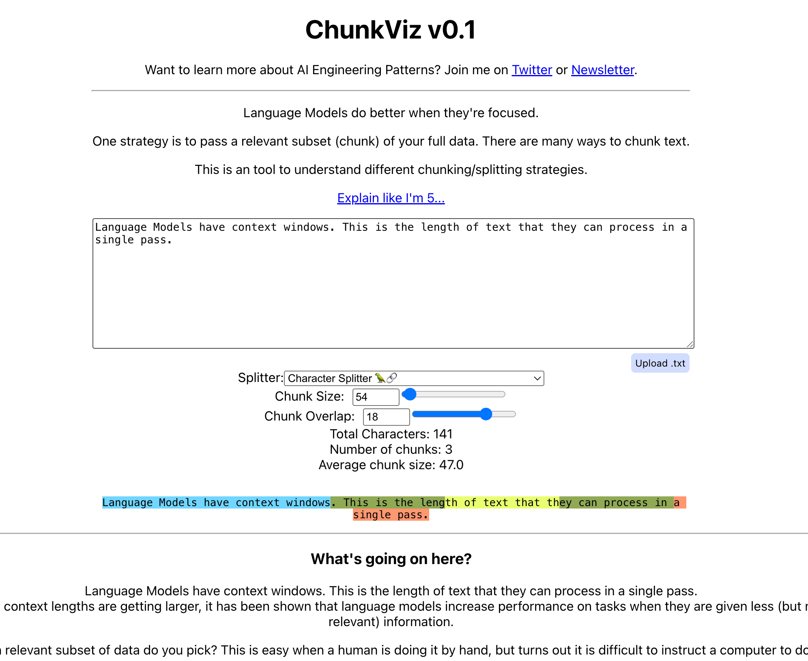

# Langchain使用之Retrieval


## 文档拆分器

拿到统一的一个Document对象后，接着需要切分Chunks。如果不切分，只是一个完整的Document，会存在：

1. 假设提问的Query答案出现在某一个Document对象中，将检索的整个Document放进Prompt会包含很多无关信息，无效信息越多对大模型的推理影响越大。
2. 很容易达到大模型的Token限制。

有效的解决方案就是将完整的Document对象进行分块切分（Chunking）。无论是存储还是检索过程，都将这些块（chunk）为基本单位，有效避免内容不相关问题和超出最大限制的问题。

### Chunk拆分策略

**方法一：根据句子切分**：这种方法按照自然语句边界进行切分，保持语义的完整。

**方法二：按照固定字符数来切分**：按照字符数进行划分文本，但是可能存在不适当的位置切断句子。

**方法三：按照固定字符来切分，结合重叠窗口（overlapping windows）**：此方法与字符数切分相似，但是通过重叠窗口技术避免切分到关键部分。

**方法四：递归字符切分方法**：通过递归字符方式动态确定切分点，这种方法可以根据文档的复杂性和内容密度调整块大小

**方法五：根据语义内容切分**：这种高级策略根据文本的语义内容来分块，旨在保持相关信息的集中和完整，适合需要高度语义保持的场景。

> 方法二和三是基于字符进行文本切分，不考虑文章实际内容和语义，方式简单，但是很可能切断主题或者语义。
>
> 方法四递归方法更加灵活和高效，结合了固定长度切分和语义分析。**首选策略**。
>
> 方法五处理速度很慢，段落长度可能非常不均匀，不适合所有情况。

### TextSplitter源码解析

```python
class TextSplitter(BaseDocumentTransformer, ABC):
    """Interface for splitting text into chunks."""

    def __init__(
        self,
        chunk_size: int = 4000, # 返回块的最大尺寸，单位是字符数，默认值 4000
        chunk_overlap: int = 200,# 相邻两个块之间的字符重叠数量，避免信息在边界被切断而丢失。默认值 200，通常会设置为最大尺寸的 10% ~ 20%
        length_function: Callable[[str], int] = len,# 测定给定块字符数的函数。
        keep_separator: Union[bool, Literal["start", "end"]] = False,  # 是否在块中保留分隔符号，默认是False
        add_start_index: bool = False,  # 设置为True，元数据中包含其实索引，默认值为False
        strip_whitespace: bool = True,  # 设置成True，从每个文档的开始和结束处去除空白字符。默认值True
    ) -> None:
        """Create a new TextSplitter.

        Args:
            chunk_size: Maximum size of chunks to return
            chunk_overlap: Overlap in characters between chunks
            length_function: Function that measures the length of given chunks
            keep_separator: Whether to keep the separator and where to place it
                            in each corresponding chunk (True='start')
            add_start_index: If `True`, includes chunk's start index in metadata
            strip_whitespace: If `True`, strips whitespace from the start and end of
                              every document
        """
        if chunk_size <= 0:
            msg = f"chunk_size must be > 0, got {chunk_size}"
            raise ValueError(msg)
        if chunk_overlap < 0:
            msg = f"chunk_overlap must be >= 0, got {chunk_overlap}"
            raise ValueError(msg)
        if chunk_overlap > chunk_size:
            msg = (
                f"Got a larger chunk overlap ({chunk_overlap}) than chunk size "
                f"({chunk_size}), should be smaller."
            )
            raise ValueError(msg)
        self._chunk_size = chunk_size
        self._chunk_overlap = chunk_overlap
        self._length_function = length_function
        self._keep_separator = keep_separator
        self._add_start_index = add_start_index
        self._strip_whitespace = strip_whitespace

        
    # 传入的参数类型 Str, 返回的事List[str]
    @abstractmethod
    def split_text(self, text: str) -> list[str]:
        """Split text into multiple components."""

    # 传入的参数类型：List[str]，返回值类型List[Document]
    def create_documents(
        self, texts: list[str], metadatas: Optional[list[dict[Any, Any]]] = None
    ) -> list[Document]:
        """Create documents from a list of texts."""
        _metadatas = metadatas or [{}] * len(texts)
        documents = []
        for i, text in enumerate(texts):
            index = 0
            previous_chunk_len = 0
            for chunk in self.split_text(text):
                metadata = copy.deepcopy(_metadatas[i])
                if self._add_start_index:
                    offset = index + previous_chunk_len - self._chunk_overlap
                    index = text.find(chunk, max(0, offset))
                    metadata["start_index"] = index
                    previous_chunk_len = len(chunk)
                new_doc = Document(page_content=chunk, metadata=metadata)
                documents.append(new_doc)
        return documents

    # 传入的参数类型：List[Document]，返回值类型List[Document]
    def split_documents(self, documents: Iterable[Document]) -> list[Document]:
        """Split documents."""
        texts, metadatas = [], []
        for doc in documents:
            texts.append(doc.page_content)
            metadatas.append(doc.metadata)
        return self.create_documents(texts, metadatas=metadatas)
```

可视化展示文本切割的工具网站:[网站](https://chunkviz.up.railway.app/)。



### **CharacterTextSplitter**：Split by character

参数说明：

- chunk_size：每个切块最大token的数量，默认值 4000
- chunk_overlap：相邻两个切块之间最大重叠token数量，默认值 200
- separator：分割使用分割符，默认值："\n\n"

- length_function：计算切块长度的方法。默认赋值值为父类TextSplitter的len函数

```python
from langchain.text_splitter import CharacterTextSplitter

text = """
LangChain 就是一个让你快速把 GPT 变成“能思考、能记忆、能调用工具”的智能应用的框架，同时将处理好的结果进行返回
"""

splitter = CharacterTextSplitter(
    chunk_size=50,
    chunk_overlap=5,
    # length_function=len,
    separator="" # 设置为空字符串，表示禁用分隔符优先
)

texts = splitter.split_text(text)

for i, chunk in enumerate(texts):
    print(f"块 {i + 1}：长度：{len(chunk)}")
    print(chunk)
    print("-" * 50)
```

结果：

```shell
块 1：长度：49
LangChain 就是一个让你快速把 GPT 变成“能思考、能记忆、能调用工具”的智能应用的框架
--------------------------------------------------
块 2：长度：19
应用的框架，同时将处理好的结果进行返回
--------------------------------------------------
```

`separator`参数介绍：分隔符优先，什么是优先？如果切分的长度已经超过了chunk_size大小，按理说会拆分，但是加上separator参数之后还是会按照分隔符号拆分。

```python
from langchain.text_splitter import CharacterTextSplitter

text = """
这是一个实例文本啊。我们将使用CharacterTextSplitter将其分割成小块。分割基于字符数。哈哈。
"""

splitter = CharacterTextSplitter(
    chunk_size=30,
    chunk_overlap=5,
    separator="。" # 设置为空字符串，表示禁用分隔符优先
)

texts = splitter.split_text(text)

for i, chunk in enumerate(texts):
    print(f"块 {i + 1}：长度：{len(chunk)}")
    print(chunk)
    print("-" * 50)
```

```shell
Created a chunk of size 33, which is longer than the specified 30块 1：长度：9
这是一个实例文本啊
--------------------------------------------------
块 2：长度：33
我们将使用CharacterTextSplitter将其分割成小块
--------------------------------------------------
块 3：长度：11
分割基于字符数。哈哈。
--------------------------------------------------
```

```python
from langchain.text_splitter import CharacterTextSplitter

text = """
这是第一段文本。这是第二段内容。最后一段结束。
"""

splitter = CharacterTextSplitter(
    chunk_size=20,
    chunk_overlap=8,
    separator="。", # 设置为空字符串，表示禁用分隔符优先
    keep_separator=True # 保留分隔符
)

texts = splitter.split_text(text)

for i, chunk in enumerate(texts):
    print(f"块 {i + 1}：长度：{len(chunk)}")
    print(chunk)
    print("-" * 50)
```

结果：

```shell
块 1：长度：15
这是第一段文本。这是第二段内容
--------------------------------------------------
块 2：长度：16
。这是第二段内容。最后一段结束。
--------------------------------------------------
```

可以看到`这是第二段内容`出现重复，长度只有7，我们设置8的时候会将按照。分割的字符串进行重复。

如果我们将`chunk_overlap`设置成7，结果就是：

```shell
块 1：长度：15
这是第一段文本。这是第二段内容
--------------------------------------------------
块 2：长度：8
。最后一段结束。
--------------------------------------------------
```

可以看到`这是第二段内容`部分内容在块2中不存在了，原因就是separator的分割符优先。判断是不是达到`。`,如果没有达到，不会拆分。

### TokenTextSplitter

使用说明

- 核心依据：Token数量 + 自然边界（TokenTextSplitter会按照Token数量进行分割，但同时会优先在自然边界处切断，尽量保证语义的完整性）
- 优点：与LLM的Token计数逻辑一致，尽量保持语义完整。
- 缺点：对于非英语或特定领域文本，Token效果不佳
- 典型场景：精确控制Token数输入LLM的场景


## 检索器Retriever

示例：**使用FAISS**

```python
from langchain_core.prompts import PromptTemplate
import os
import dotenv
from langchain_openai import ChatOpenAI, OpenAIEmbeddings
from langchain_community.document_loaders import TextLoader
from langchain.text_splitter import CharacterTextSplitter
from langchain_community.vectorstores import FAISS

dotenv.load_dotenv()

# 创建Prompt
prompt_template = """
请使用以下提供的文本内容来回答问题。仅使用提供的文本信息，如果文本中没有相关信息，请回答：“抱歉,提供的文本内容中没有这个信息”。
文本内容：
{context}

问题：
{question}

回答：
"
"""

prompt = PromptTemplate.from_template(prompt_template)

# 初始化模型
os.environ["OPENAI_API_KEY"] = os.getenv("OPENAI_API_KEY")
os.environ["OPENAI_BASE_URL"] = os.getenv("OPENAI_BASE_URL")

llm = ChatOpenAI(model_name="gpt-4o-mini",temperature=0)

embedding_model = OpenAIEmbeddings(model="text-embedding-3-large")

# 加载文档
loader = TextLoader("./assets/nanjing.txt", encoding="utf-8")
documents = loader.load()

# 分割文档
text_splitter = CharacterTextSplitter(
    chunk_size=1000,
    chunk_overlap=100,
)

texts = text_splitter.split_documents(documents)

# 创建向量存储
vectorstore = FAISS.from_documents(
    documents = texts,
    embedding=embedding_model
)

# 获取检索器
retriever = vectorstore.as_retriever()
docs = retriever.invoke(input="南京有什么好吃的？")

# 创建链
chain = prompt | llm

result = chain.invoke(input={"question": "南京有什么好吃的？", "context": docs})

print("\n回答:", result.content)
```

结果：

```shell
回答: 南京的特色美食包括：
1. 盐水鸭：色白味香、皮嫩肉酥，是南京的传统名菜。
2. 鸭血粉丝汤：口感鲜美、汤汁浓郁，是南京人的“灵魂早餐”。
3. 小笼包、牛肉锅贴、桂花糖芋苗：老城南的经典小吃。
```


## 智能对话助手

### 需求分析

构建一个可以和不同工具进行交互的Agent：一个是本地数据库，另一个是搜索引擎。可以向Agent提问，观察他的调用，并与之对话。

**涉及的功能**

- 使用`语言模型`，特别是工具调用的能力
- 创建`检索器`以向Agent公开特定的信息
- 使用`搜索工具`在线查找内容
- 提供`聊天历史`，允许聊天机器人记住不同id过去的交互，并在后续问题时考虑他们

### 实现


{
  "registry-mirrors": [
    "https://docker.m.daocloud.io",
    "https://docker.nju.edu.cn",
    "https://registry.docker-cn.com",
    "https://docker.mirrors.ustc.edu.cn",
    "https://hub-mirror.c.163.com",
    "https://mirror.baidubce.com",
    "https://5tqw56kt.mirror.aliyuncs.com",
    "https://docker.hpcloud.cloud",
    "http://mirrors.ustc.edu.cn",
    "https://docker.chenby.cn",
    "https://docker.ckyl.me",
    "http://mirror.azure.cn",
    "https://hub.rat.dev"
  ]
}


