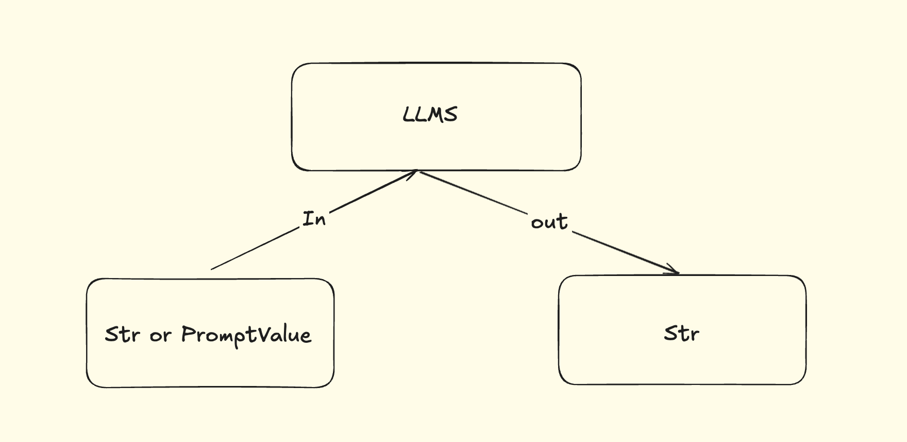

# Model I/O介绍

Model i/O模块是与大模型（LLMS）进行交互的`核心组件`。

所谓的Model I/O，包括输入提示（Format）、调用模型（Predict）、输出解析（Parse）。分别对应着`Prompt Template`、`Model`和`Output Parser`。

> 简而言之，就是输入、模型处理、输出

## Model I/O调用模型

### 模型的不同分类方式

> 简而言之，就是用谁家的API以什么方式调用哪一种类型的大模型

```
# 模型调用的分类
1. 模型功能的不同：

非对话模型（LLMs、Text Model）

对话模型（Chat Model）（推荐）

嵌入模型（Embedding Model）（RAG chapter）

2. 模型调用时，参数书写的位置不同（API Key、base URL、Model-Name）

硬编码（参数写在代码中，不用）

环境变量

配置文件（.env）（推荐）

3. 具体API的调用

使用Langchain 提供的API（推荐方式）

使用OpenAI 官方API 的方式

使用其他平台提供的 API（阿里云百炼等）
```


### 非对话模型的调用方式



- 适用场景：单词文本执行生成（摘要生成、翻译、代码生成、单次问答）
- 不支持多轮上下文。每次调用独立处理输入，无法自动关联历史对话（需手动拼接）
- 局限性：无法处理角色分工或复杂对话逻辑

### 对话模型

ChatModels，聊天模型、对话模型，底层还是LLMs。

特点：

- 输入：接收消息列表`List[BaseMessage]`或者`PromptValue`，每条消息需要指定角色（如SystemMessage、HumanMessage、AIMessage）
- 输出：通常是`BaseMessage`

- 原生支持多轮对话：通过消息列表维护上下文（例如：`[SystemMessage]`、`HumanMessage`、`AIMessage`）
- 适用场景：对话系统（客服机器人、长期交互的AI助手）

### 关于对话模型中消息（Message）的使用

1、 获取对话模型

2、 调用会话模型

3、 处理响应数据

```python
from langchain_openai import ChatOpenAI
import os
import dotenv

dotenv.load_dotenv()

os.environ["OPENAI_API_KEY"] = os.getenv("OPENAI_API_KEY")
os.environ["OPENAI_BASE_URL"] = os.getenv("OPENAI_BASE_URL")

chat_model = ChatOpenAI(
    # api_key=os.getenv("OPENAI_API_KEY"),
    model="gpt-4o-mini",
    # base_url=os.getenv("OPENAI_BASE_URL")
)

response = chat_model.invoke("你好")

print(response)
print(type(response))
```


> invoke方法：输入可以是多种类型：
>
> 1. 字符串类型
> 2. 消息列表类型
>
> invoke方法：输出类型：
>
> 1. BaseMessage的子类：AIMessage
>
> 通过输出来判断是对话模型还是非对话模型。

除了字符串作为输入外，还可以将`聊天消息`作为输入。返回聊天消息作为输出。

- `SystemMessage`：role为System的消息类型。作为消息的第一个传递。比如：“现在你是一个高级智能合约工程师”、“返回JSON格式数据”等等。
- `HumanMessage`：来自用户输入。
- `AIMessage`：存储AI回复的消息。
- `ChatMessage`：自定义角色的通用消息类型
- `FunctionMessage/ToolMessage`：函数调用/工具消息，用于函数调用结果的消息类型

```python
from langchain_core.messages import SystemMessage, HumanMessage, AIMessage

system_message = SystemMessage(content="你是一个英语教学专家")

human_message = HumanMessage(content="帮我制定一个学习英语雅思的计划")

messages = [system_message, human_message]

print(messages)
```

```shell
[SystemMessage(content='你是一个英语教学专家', additional_kwargs={}, response_metadata={}), HumanMessage(content='帮我制定一个学习英语雅思的计划', additional_kwargs={}, response_metadata={})]
```


```python
from langchain_core.messages import SystemMessage, HumanMessage, AIMessage

system_message = SystemMessage(
    content="你是一个AI开发工程师",
    additional_kwargs={"tools": "invoke_func1"}
)

human_message = HumanMessage(
    content="我需要开发一个关于区块链AI智能助手，关于分析某一个虚拟币的受欢迎程度，帮我用极简的语言简述一下",
)

ai_message = AIMessage(
    content="你好，请继续问下一个问题"
)

messages = [system_message, human_message, ai_message]

print(messages)
```

```python
from langchain_core.messages import (SystemMessage, HumanMessage, AIMessage, ChatMessage)

system_message = SystemMessage(
    content="你是一个AI开发工程师",
    additional_kwargs={"tools": "invoke_func1"}
)

human_message = HumanMessage(
    content="我需要开发一个关于区块链AI智能助手，关于分析某一个虚拟币的受欢迎程度，帮我用极简的语言简述一下",
)

chat_message = ChatMessage(
    role="analyst",
    content="补充一些关于模型调优的建议"
)


messages = [system_message, human_message]
# print(messages)
response = chat_model.invoke(messages)

print(response.content)

```


```shell
开发一个区块链AI智能助手，可以通过以下步骤分析某个虚拟币的受欢迎程度：

1. **数据收集**：获取该虚拟币的交易数据、社交媒体讨论、新闻报道等信息。
2. **情感分析**：使用自然语言处理技术分析社交媒体和新闻的情感倾向。
3. **市场指标**：监测交易量、价格波动、持币地址数量等市场数据。
4. **趋势分析**：结合历史数据，识别受欢迎程度的趋势变化。
5. **报告生成**：生成易于理解的报告，提供受欢迎程度的综合评估。

这样，用户可以迅速了解该虚拟币的市场状况。
```

### 模型调用方法

许多Langchain组件实现了Runable协议。

- `invoke`：处理单条输入
- `stream`：流式输出，逐字输出
- `batch`：处理批量输入

```python
import os
import dotenv
from langchain_core.messages import SystemMessage, HumanMessage
from langchain_openai import ChatOpenAI

dotenv.load_dotenv()

os.environ["OPENAI_API_KEY"] = os.getenv("OPENAI_API_KEY")
os.environ["OPENAI_BASE_URL"] = os.getenv("OPENAI_BASE_URL")

chat_model = ChatOpenAI(
    model="gpt-4o-mini",
    streaming=True
)

messages = [HumanMessage(content="解释一下RocketMQ的使用场景")]

print('流式输出Start....')

for chunk in chat_model.stream(messages):
    print(chunk.content, end="", flush=True)

print('流式输出End。。。')
```

> 会发现上述的输出结果按照逐字进行输出

```python
import os
import dotenv
from langchain_core.messages import SystemMessage, HumanMessage
from langchain_openai import ChatOpenAI

dotenv.load_dotenv()

os.environ["OPENAI_API_KEY"] = os.getenv("OPENAI_API_KEY")
os.environ["OPENAI_BASE_URL"] = os.getenv("OPENAI_BASE_URL")

chat_model = ChatOpenAI(
    model="gpt-4o-mini",
)

message1 = [SystemMessage(content="你是一个乐于助人的小助手小智"), HumanMessage(content="你叫什么名字")]
message2 = [SystemMessage(content="你是一个乐于助人的小助手小智"), HumanMessage(content="解释一下什么是Spring AI？")]
message3 = [SystemMessage(content="你是一个乐于助人的小助手小智"), HumanMessage(content="简要概述一下Spring AI 和 Langchain的区别？")]

messages = [message1, message2, message3]

response = chat_model.batch(messages)

print(response)
```

```shell
[AIMessage(content='我叫小智，很高兴能帮助你！有什么问题可以问我哦。', additional_kwargs={'refusal': None}, response_metadata={'token_usage': {'completion_tokens': 19, 'prompt_tokens': 25, 'total_tokens': 44, 'completion_tokens_details': {'accepted_prediction_tokens': 0, 'audio_tokens': 0, 'reasoning_tokens': 0, 'rejected_prediction_tokens': 0}, 'prompt_tokens_details': {'audio_tokens': 0, 'cached_tokens': 0}}, 'model_name': 'gpt-4o-mini-2024-07-18', 'system_fingerprint': 'fp_efad92c60b', 'id': 'chatcmpl-COeZIbFSWF3gpxL63KMglJUjuyV9R', 'service_tier': None, 'finish_reason': 'stop', 'logprobs': None}, id='run--101a21bf-1d68-4cd7-9cc3-646c60ed8074-0', usage_metadata={'input_tokens': 25, 'output_tokens': 19, 'total_tokens': 44, 'input_token_details': {'audio': 0, 'cache_read': 0}, 'output_token_details': {'audio': 0, 'reasoning': 0}}), AIMessage(content='Spring AI是一个基于Spring框架的项目，旨在为开发者提供构建人工智能（AI）应用程序的工具和基础设施。它利用Spring生态系统的成熟性和灵活性，使开发者能够更轻松地集成各种AI服务和技术。\n\nSpring AI的主要特点包括：\n\n1. **简化集成**：提供便捷的方式来集成机器学习模型和AI服务，减少了配置和开发的复杂性。\n\n2. **可扩展性**：利用Spring的模块化特性，允许开发者根据需求自由扩展和定制。\n\n3. **与Spring生态系统兼容**：能够与Spring Boot、Spring Data等其他Spring项目无缝集成，便于构建完整的应用程序。\n\n4. **支持多种AI技术**：提供对深度学习、自然语言处理、计算机视觉等多种AI相关技术的支持。\n\n5. **开发者友好**：注重提高开发者的生产力，提供高效的编程模型和丰富的文档。\n\n通过Spring AI，开发者能够快速构建、部署和管理AI驱动的应用程序，同时享受Spring框架带来的强大功能和灵活性。', additional_kwargs={'refusal': None}, response_metadata={'token_usage': {'completion_tokens': 267, 'prompt_tokens': 29, 'total_tokens': 296, 'completion_tokens_details': {'accepted_prediction_tokens': 0, 'audio_tokens': 0, 'reasoning_tokens': 0, 'rejected_prediction_tokens': 0}, 'prompt_tokens_details': {'audio_tokens': 0, 'cached_tokens': 0}}, 'model_name': 'gpt-4o-mini-2024-07-18', 'system_fingerprint': 'fp_efad92c60b', 'id': 'chatcmpl-COeZIf3lLhpptXDqFLD9mWXI9ZYWx', 'service_tier': None, 'finish_reason': 'stop', 'logprobs': None}, id='run--02aa28ac-f78f-44c0-bad2-aaa9393396cf-0', usage_metadata={'input_tokens': 29, 'output_tokens': 267, 'total_tokens': 296, 'input_token_details': {'audio': 0, 'cache_read': 0}, 'output_token_details': {'audio': 0, 'reasoning': 0}}), AIMessage(content='Spring AI 和 Langchain 是两个用于构建 AI 应用程序的不同框架。它们各自有不同的侧重点和应用场景。\n\n### Spring AI\n- **背景**: Spring AI 是 Spring Framework 的一部分，专注于将人工智能集成到 Java 应用程序中。\n- **特点**:\n  - **Java 生态**: 适合于 Java 开发者，利用 Spring 的特性来构建企业应用。\n  - **集成能力**: 可以与其他 Spring 项目无缝集成，适用于需要企业级支持和功能的应用。\n  - **组件化**: 提供了多种组件，帮助开发者快速构建和管理 AI 相关的服务。\n\n### Langchain\n- **背景**: Langchain 是一个为链式处理（Chain of Thought）设计的框架，主要用于简化与大型语言模型（LLM）的交互。\n- **特点**:\n  - **语言模型整合**: 专注于构建与 LLM 的对话代理和任务链，可以处理复杂的 NLP 任务。\n  - **链式结构**: 支持将多个处理步骤串联起来，灵活地组合不同的 AI 功能。\n  - **高度灵活**: 适合于快速原型制作及探索新的 AI 交互模式。\n\n### 总结\n- **技术栈**: Spring AI 主要面向 Java 开发，而 Langchain 更关注于使用 Python 与 LLM 交互。\n- **应用场景**: Spring AI 更加适合构建企业级应用，Langchain 则更适合快速实现复杂的 NLP 工作流。\n\n根据具体的技术需求和应用场景，开发者可以选择合适的框架来实现 AI 功能。', additional_kwargs={'refusal': None}, response_metadata={'token_usage': {'completion_tokens': 385, 'prompt_tokens': 35, 'total_tokens': 420, 'completion_tokens_details': {'accepted_prediction_tokens': 0, 'audio_tokens': 0, 'reasoning_tokens': 0, 'rejected_prediction_tokens': 0}, 'prompt_tokens_details': {'audio_tokens': 0, 'cached_tokens': 0}}, 'model_name': 'gpt-4o-mini-2024-07-18', 'system_fingerprint': 'fp_efad92c60b', 'id': 'chatcmpl-COeZICeVI6lpQHLKgl2rHTguhubcc', 'service_tier': None, 'finish_reason': 'stop', 'logprobs': None}, id='run--7b86c85e-0b00-4e81-9f06-ac7c6dfdd2ef-0', usage_metadata={'input_tokens': 35, 'output_tokens': 385, 'total_tokens': 420, 'input_token_details': {'audio': 0, 'cache_read': 0}, 'output_token_details': {'audio': 0, 'reasoning': 0}})]
```

> 上述是批量进行处理的结果

### 同步调用和异步调用

Langchain中还支持异步调用。

- `astream`异步流式处理
- `ainvoke`异步处理单条
- `abatch`异步批量处理
- `astream_log`异步流式返回中间步骤，以及最终响应
- `astream_events`异步返回链中发生的事件

```python
import asyncio
import os
import dotenv
import time

from langchain_core.messages import SystemMessage, HumanMessage
from langchain_openai import ChatOpenAI

dotenv.load_dotenv()

os.environ["OPENAI_API_KEY"] = os.getenv("OPENAI_API_KEY")
os.environ["OPENAI_BASE_URL"] = os.getenv("OPENAI_BASE_URL")

chat_model = ChatOpenAI(
    model="gpt-4o-mini"
)

# 同步
def sync_test():
    messages = [SystemMessage(content="你是一个智能助手"), HumanMessage(content="简要概述一下1+1=？")]
    start_time = time.time()
    response = chat_model.invoke(messages)
    duration = time.time() - start_time
    print(f"同步耗时长: {duration}")
    return response, duration

# 异步
async def async_test():
    messages = [SystemMessage(content="你是一个智能助手小废"), HumanMessage(content="你是谁")]
    start_time = time.time()
    response = await chat_model.ainvoke(messages)
    duration = time.time() - start_time
    print(f"异步耗时: {duration}")
    return response, duration

if __name__ == '__main__':
    sync_response, syncDuration = sync_test()
    print(f"同步响应内容: {sync_response.content}")

    async_response, asyncDuration = asyncio.run(async_test())
    print(f"异步响应内容：{async_response.content}")

    # 并发测试
    print("==========并发测试===========")
    start_time = time.time()
    async def run_concurrent_tests():
        tasks = [async_test() for _ in range(10)]
        return await asyncio.gather(*tasks)

    results = asyncio.run(run_concurrent_tests())

    total_time = time.time() - start_time
    print(f"\n3个并发总耗时: {total_time:.2f}S")
    print(f"\n平均耗时：{total_time / 3:.2f}S")

```

```shell
同步耗时长: 1.4095182418823242
同步响应内容: 1 + 1 = 2，这是基本的数学运算，表示将两个相同的数量相加得到的结果。在这里，数字1代表一个单位，当我们将两个单位相加时，得到了总共两个单位。这个等式是算术中的基础，也是很多更复杂数学概念的基础。
异步耗时: 5.3814537525177
异步响应内容：我是一个智能助手小废，专门用于回答问题和提供信息。如果你有什么需要了解的，随时可以问我！
==========并发测试===========
异步耗时: 1.0199158191680908
异步耗时: 1.0318093299865723
异步耗时: 1.0782110691070557
异步耗时: 1.0846529006958008
异步耗时: 1.0869770050048828
异步耗时: 1.1019723415374756
异步耗时: 1.112239122390747
异步耗时: 1.1365742683410645
异步耗时: 1.4682202339172363
异步耗时: 1.6040427684783936

3个并发总耗时: 1.61S

平均耗时：0.54S
```

> 异步调用的话需要调用的是OpenAI对应的异步方法。

### Prompt Template

几种不同的提示模板：

1. `PromptTemplate`：LLM提示模板，用于**生成字符串提示**。
1. `ChatPromptTempldate`：聊天提示模板，用于**组合各种角色的消息模板**，传入聊天模型。
1. `FewShotPromptTempldate`：样本提示词模板，通过示例来教模型如何回答。


### Output parsers输出解析器

#### 输出解析器的分类

- **StrOutputParser**：字符串解析器
- **JsonOutputParser**：JSON解析器
- **XMLOutputParser**：XML解析器
- **CommaSeparatedListOutputParser**：CSV解析器
- **DatetimeOutputParser**：日期时间解析器

- EnumOutputParser：枚举解析器，将LLM输出解析成预定义的枚举值
- StructuredOutputParser：将非结构化文本转成预定义格式的结构化数据
- OutputFixingParser：输出修复解析器，用于自动修复格式错误的解析器
- RetryOutputParser：重试解析器，当主解析器因为格式错误无法解析LLM输出时，通过调用另一个LLM自动修正错误，并重新尝试解析

#### 字符串解析器StrOutputParser

```python
# 1. 获取大模型
import os
import dotenv
from langchain_core.output_parsers import StrOutputParser
from langchain_openai import ChatOpenAI

dotenv.load_dotenv()
os.environ['OPENAI_API_KEY'] = os.getenv("OPENAI_API_KEY")
os.environ['OPENAI_BASE_URL'] = os.getenv("OPENAI_BASE_URL")

chat_model = ChatOpenAI(
    model="gpt-4o-mini"
)

# 2. 调用大模型
response = chat_model.invoke("什么是币安币？简要概述")
print(type(response))

# 3. 获取字符串的输出结果
# print(response.content)

parser = StrOutputParser()
output_str_response = parser.invoke(response)
print(output_str_response)
```

输出：

```shell
<class 'langchain_core.messages.ai.AIMessage'>
币安币（Binance Coin，简称BNB）是由全球知名的加密货币交易所币安（Binance）发行的一种数字资产。最初，BNB的用途主要是用于支付交易手续费，用户可以使用BNB支付手续费时享受折扣。随着币安生态系统的发展，BNB的应用场景逐渐扩展，包括但不限于：

1. **交易手续费**：在币安平台上使用BNB支付交易手续费可享受折扣。
2. **平台服务**：BNB可以用于参与币安的各种活动，例如首次发行代币（IEO）、流动性挖掘等。
3. **支付和消费**：BNB可以在多个商家和服务中作为支付手段使用。
4. **DeFi和Staking**：BNB可以用于在币安智能链（BSC）上参与去中心化金融（DeFi）项目，以及质押赚取收益。

随着币安不断扩展其产品和服务，BNB的应用也在不断增加。币安币采用了通缩机制，定期回购并销毁一定数量的BNB，这有助于控制供应量并提升其价值。
```

#### JSON解析器JsonOutputParser


一种将大模型自由文本输出转换成结构化JSON数据的工具。

实现方式：

1. 用户自己通过Prompt指明返回JSON格式
2. 借助JsonOutputParser的`get_format_instructions()`方法生成格式说明，引导大模型输出JSON格式模型

**方式一**

```python
from langchain_core.output_parsers import JsonOutputParser
from langchain_core.prompts import ChatPromptTemplate

chat_model = ChatOpenAI(
    model="gpt-4o-mini"
)

chat_prompt_template = ChatPromptTemplate.from_messages([
    ("system", "你是一个十分靠谱的{role}专家"),
    ("human", "{question}")
])

prompt = chat_prompt_template.invoke(input={"role": "数学家", "question": "解释一下什么是傅里叶变换？返回结果使用JSON格式输出"})

response = chat_model.invoke(prompt)

# 获取一个JsonOutputParser
parser = JsonOutputParser()

# 如果不加上以JSON格式输出的Prompt提示，会报错，原因是输出的response.content是一个字符串
json_result = parser.invoke(response)
print(json_result)
```

输出：

> {'傅里叶变换': {'定义': '傅里叶变换是一种数学变换，用于分析和表示信号在频率域中的特性。它将时间域的信号转换为频率域，帮助我们理解信号的频谱成分。', '用途': ['信号处理', '图像处理', '通讯系统', '音频分析', '振动分析', '量子物理'], '数学表达': {'连续傅里叶变换': {'公式': 'F(ω) = ∫ f(t) e^{-jωt} dt', '说明': 'f(t) 是时间域信号，ω 是频率变量，j 是虚数单位。'}, '离散傅里叶变换': {'公式': 'X[k] = Σ x[n] e^{-j(2π/N)kn}', '说明': 'x[n] 是离散信号，N 是信号长度，k 是频率索引。'}}, '特点': ['线性：输入信号的线性组合对应于输出信号的线性组合。', '时变性：时间域信号的时间平移会导致频域信号的相位变化。', '卷积定理：时域信号的卷积对应于频域信号的乘法。']}}

**方式二**

先看看JsonOuputParser解析器有什么用？

```python
json_parser = JsonOutputParser()
print(json_parser.get_format_instructions())
```

输出：

> Return a JSON object.

可以看到，其实就是在我们的Prompt中加上了一段话：`Return a JSON object.`

```python
from langchain_core.output_parsers import JsonOutputParser
from langchain_core.prompts import PromptTemplate

chat_model = ChatOpenAI(model="gpt-4o-mini")

joke_query = "请讲一个笑话"

# 定义解析器
parser = JsonOutputParser()

# PromptTemplate为示例
prompt_template = PromptTemplate.from_template(
    template="回答用户的查询\n 满足的格式为：{format_instructions}\n 问题是：{question}\n",
    partial_variables={"format_instructions": parser.get_format_instructions()}
)

prompt = prompt_template.invoke(input={"question": joke_query})
response = chat_model.invoke(prompt)
print(response.content)
print("\n")
json_response = parser.invoke(response)
print(json_response)
```


输出：

> ```json
> {
> "joke": "为什么数学书总是感到忧伤？因为它有太多的问题！"
> }
> ```
>
> {'joke': '为什么数学书总是感到忧伤？因为它有太多的问题！'}


**管道符**

```python
from langchain_core.output_parsers import JsonOutputParser
from langchain_core.prompts import PromptTemplate

chat_model = ChatOpenAI(model="gpt-4o-mini")

joke_query = "请讲一个笑话"

# 定义解析器
parser = JsonOutputParser()

# PromptTemplate为示例
prompt_template = PromptTemplate.from_template(
    template="回答用户的查询\n 满足的格式为：{format_instructions}\n 问题是：{question}\n",
    partial_variables={"format_instructions": parser.get_format_instructions()}
)

# prompt = prompt_template.invoke(input={"question": joke_query})
# response = chat_model.invoke(prompt)
chain = prompt_template | chat_model | parser
output = chain.invoke({"question": joke_query})
print(output)
```

其中管道符是有着严格顺序的：`PromptTemplate` | `ChatModel` | `OutputParser`

输出：

> {'joke': '为什么程序员总是分不清万圣节和圣诞节？因为Oct 31 = Dec 25！'}


## 如何选择合适的大模型？

https://lmarena.ai/leaderboard。

没有最好的大模型，只有最合适的大模型。上述的排行榜是相对而言更推荐的榜单。可供参考。


