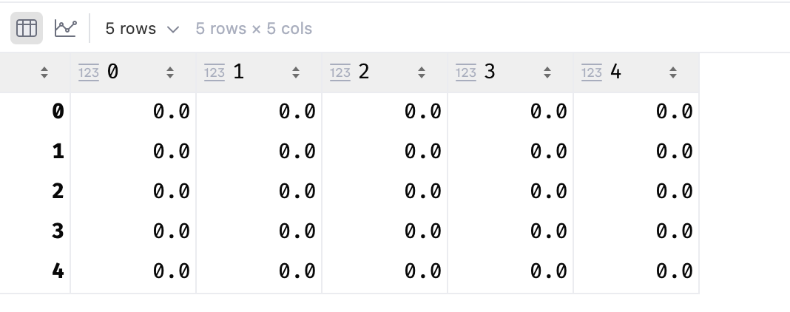

# numpy和Pandas

## Anaconda

### conda

官网地址：https://www.anaconda.com/download。

一个包管理工具（Python + 包和环境管理器 + 常用库 + 集成工具）。

### 常用命令


## Numpy

### 什么是numpy

numpy是一个科学计算的包。提供多维数组对象、各种派生对象（掩码数组和矩阵）以及用于数组快速操作的各种方法。数学、逻辑、形状操作、排序、选择、I/O、离散傅里叶变换、基本线性代数、基本统计运算、随机模拟等等。

部分功能如下：

- ndarray：具有矢量算数运算和复杂广播能力的快速且节省空间的多维数组。
- 对整组数据快速运算
- 读写磁盘数据的工具、操作内存映射的工具
- 线性袋鼠、随机数生成和傅里叶变换功能
- 集成由C++、C、Fortran等语言编写的API

### ndarray的限制

大多数numpy数组都有一些限制：

- 数组的所有元素具有相同的数据类型。
- 一旦创建，数组大小不会改变
- 形状必须是矩形，不是“锯齿形”。二维数组的每一行必须具有相同的列数

### ndarray属性

- shape()： 数组的形状
- dtype()： 数组中元素的类型
- size()： 数组中元素的个数
- ndim()： 数组的维度
- itemSize()： 数组中每一个元素的字节大小
- ....

```python
import numpy as np

arr = np.array([[1,2,3], [4,5,6]])
# print(arr)

print(arr.shape) # 数组的形状
print(arr.dtype) # 数组中元素的类型
print(arr.size) # 数组中元素的个数
print(arr.ndim) # 数组的维度
print(arr.itemsize) # 数组中每一个元素字节大小

print(type(arr))
```

结果：

```shell
(2, 3)
int64
6
2
8
<class 'numpy.ndarray'>
```

### ndarray创建方式

- array()： 不论是基本类型还是ndarray都会进行Copy
- asarray()： 如果ndarray会指向同一个地址，否则会copy

```python
import numpy as np

data = [1,2,3]

# 创建数组对象
arr1 = np.array(data)
print(arr1.shape) # (3,)

# 比较data和arr1内存地址，结果：不同
print(f"data的内存地址为：{id(data)}")
print(f"arr1的内存地址为：{id(arr1)}")

arr2 = np.array(arr1)
print(f"arr2的id为：{id(arr2)}")

arr3 = np.asarray(arr1)
print(f"arr3的id为：{id(arr3)}") # 创建的内容是ndarray的时候地址相同
arr4 = np.asarray(data)
print(f"arr4的id为：{id(arr4)}")# 创建内容不是ndarray的话地址不同
```

结果：

```shell
(3,)
data的内存地址为：4406952576
arr1的内存地址为：4407965328
arr2的id为：4407966384
arr3的id为：4407965328
arr4的id为：4407967632
```

- zeros()： 返回给定形状和类型的新数组，用0填充
- ones()： 返回给定形状和类型的新数组，用1填充
- empty()： 返回给定形状和类型的未初始化的新数组。

​	需要注意：np.empty()不保证数组元素初始化成0，只是分配了内存空间，数组的元素值都是没有初始化的，可能是内存的任意值。

上述都是默认生成的float64。

- zeros_like(ndarray)： 返回给定形状和类型的新数组，用0填充。有参考。
- ones_like(ndarray)： 返回给定形状和类型的新数组，用1填充。有参考。
- empty_like(ndarray)： 返回给定形状和类型的未初始化的新数组，有参考。

```python
arr = np.zeros((5,5))
arr = np.ones((5,5))
arr = np.empty((5,5))
arr

arr1 = np.zeros_like(arr)
arr1 = np.ones_like(arr)
arr1 = np.empty_like(arr)
arr1
```

结果：

- full()： 返回给定形状和类型的新数组，用指定值填充。
- full_like()： 返回给定形状和类型的数组，有参考数组。

```pytohn
arr = np.full((4, 6), 10)
# arr
arr1 = np.full_like(arr, 7)
arr1
```

结果：

- arange()： 一定范围内按照指定步数生成数组

```python
arr = np.arange(0, 10, 2)
print(arr.size)
print(arr.dtype)
arr
```

结果：

```shell
5
int64
array([0, 2, 4, 6, 8])
```

- linspace()： 生成等差数列。endpoint值为True的时候，等差数列是闭区间[]，False的话是开区间[)
- logspace()： 生成等比数列

```python
arr2 = np.linspace(0, 10, 5, endpoint=True)
print(arr2)

arr2_1 = np.linspace(0, 10, 5, endpoint=False)
print(arr2_1)

arr3 = np.logspace(start=2, stop=5, num=4, base=2)
print(arr3)
```

结果：

[ 0.   2.5  5.   7.5 10. ]
[0. 2. 4. 6. 8.]
[ 4.  8. 16. 32.]

- random.rand()： 返回给定形状的数组，用[0,1)均匀分布的随机样本填充。
- random.randint()：返回给定形状的数组，用从低位（包含）到高位（不包含）上均匀分布的随机整数填充。
- random.uniform()： 返回给定形状的数组，从低位（包含）到高位（不包含）均匀分布的随机浮点数填充。
- random.randn()： 返回给定形状的数组，标准正泰分布（均值0，标准差1）随机数填充。

```python
arr1 = np.random.rand(2,3)
arr1 = np.random.randint(low=0, high=10, size=(2,3))
arr1 = np.random.uniform(low=0, high=10, size=(2,3))
arr1 = np.random.randn(2,3)

arr1
```

- matrix()： 转成多维数组

```python
my_arr=  np.matrix("1,2;3,4")

my_arr = np.matrix([[1,2], [3,4]])
my_arr
```

结果：

```shell
matrix([[1, 2],
        [3, 4]])
```


- dtype： 可以指定特定的类型

```python
arr1 = np.array([1,2,3], dtype=np.float64)
# print(arr1.dtype)
# arr1

arr2 = np.array([1.2,2.3,3.4], dtype='i8')
# print(arr2.dtype)
# arr2

arr3 = arr1.astype(dtype=np.int64)
print(arr3.dtype)
arr3
```

结果：

```shell
int64
array([1, 2, 3])
```


