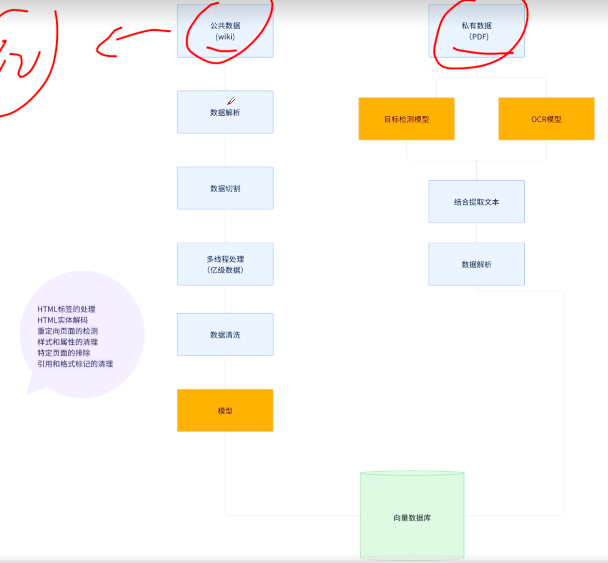
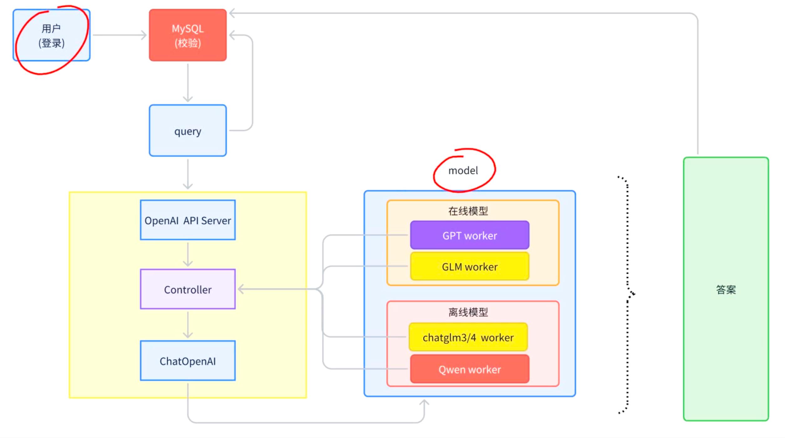
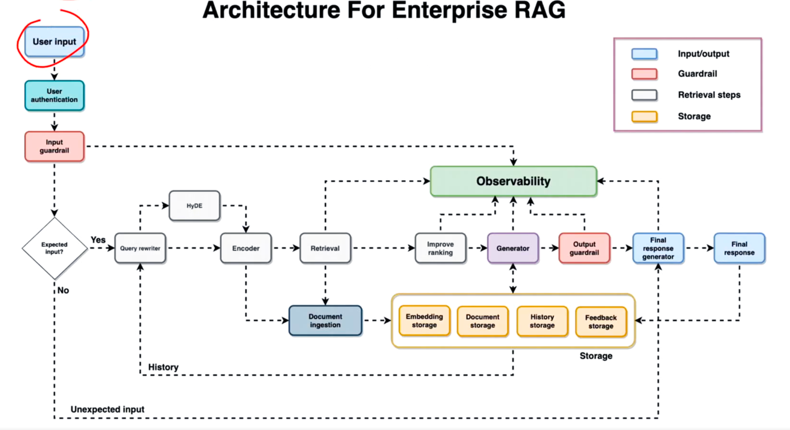
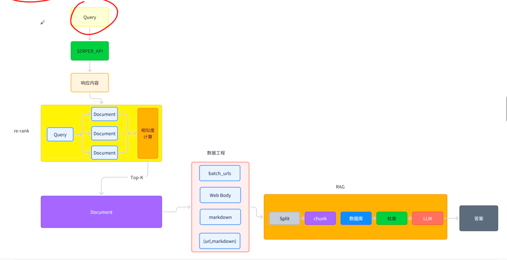
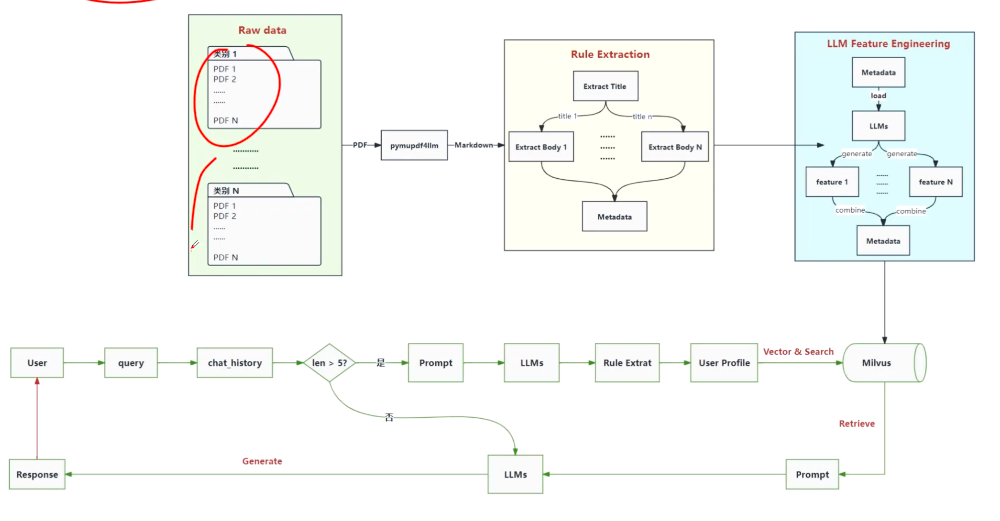
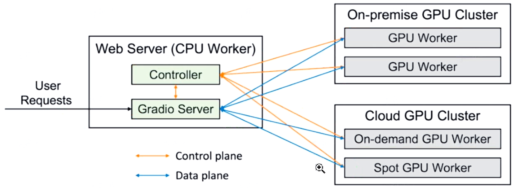
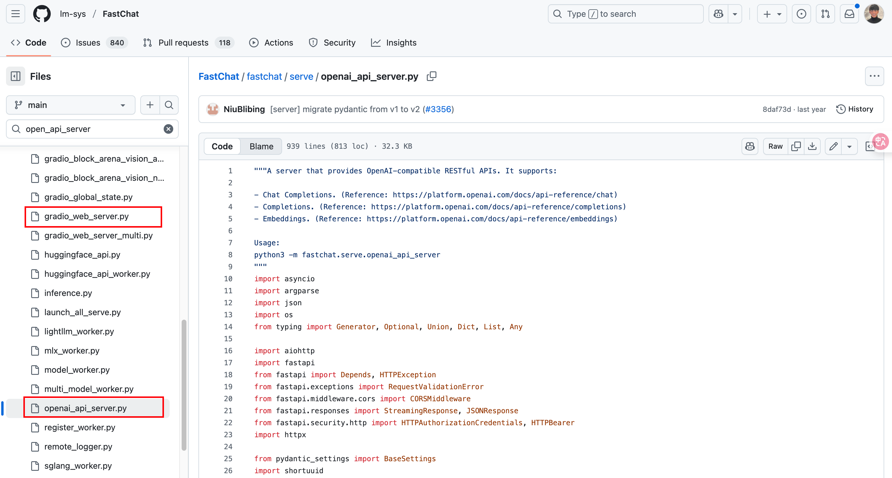
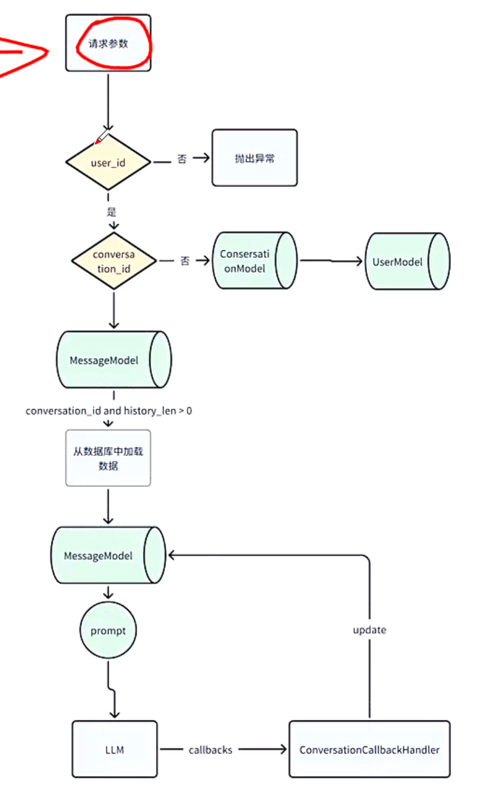

# 百晓知识库

## 知识管理平台




## 智能对话




## 知识库




## 联网搜索




## 智能推荐



## 技术选择性

| 项目     | 作用                                     | 技术栈考虑（考虑数据安全）                                   | 技术栈推荐（不考虑数据安全）                                 |
| -------- | ---------------------------------------- | ------------------------------------------------------------ | ------------------------------------------------------------ |
| 知识管理 | 1. 完成数据工程<br />2. 完成知识增删改查 | 1. PDF文件解析：目标检测模型（YOLOX）和OCR模型<br />2. 开发框架：Langchain、LlamaIndex等等<br />3. embedding模型：尽量适配选用的大模型 | 1. PDF文件解析：基于多模态大模型，如GPT-4o<br />2. 开发框架：Langchain、LlamaIndex等等<br />3. Embedding模型：最好与大模型适配 |
| 知识检索 | 1. 知识检索                              | 1. 大模型：开源模型（Qwen系列、GLM系列等）<br />2. 向量数据库：FAISS、Milvus<br />3. 开发框架：Langchain、LlamaIndex<br />4. re-rank模型：bge-reranker-large<br />5. embedding模型：跟知识管理平台一个模型<br />6. 前后端框架：VUE + FastAPI | 1. 大模型：在线调试（GPT4o、GLM）等<br />2. 向量数据库：FAISS、Milvus、TencentCloud VecrorDB<br />3. 开发框架：Langchain、LlamaIndex，如果需求比较简单可以使用Coze、dify平台<br />4. re-ranker模型：bge-reranker-large<br />5. Embedding模型：跟知识管理平台一个模型<br />6. 前后端框架：VUE + FastAPI |
| 效果评估 | 知识效果评估                             | 1. 人工打分<br />2. 基于开源大模型自研评估逻辑               | 1. 人工打分<br />2. 基于在线大模型自研评估逻辑<br />3. RAG评估开源工具，trulens/ragas |

> 最终选型：
>
> | 技术点        | 选型                                 |
> | ------------- | ------------------------------------ |
> | 大模型        | 开源的：GLM4-9B<br />在线模型：GLM-4 |
> | Embedding模型 | Embedding-2                          |
> | 开发框架      | Langchain                            |
> | 向量数据库    | Milvus                               |
> | re-ranker     | 自研算法                             |
> | 效果评估      | 自研框架                             |
> | 前端框架      | VUE                                  |
> | 后端          | FastAPI                              |
> | PDF解析       | 目标检测模型和OCR模型                |

## 开发：核心技术

| 分类         | 描述                 | 地址                                                   | 知识点                                                      |
| ------------ | -------------------- | ------------------------------------------------------ | ----------------------------------------------------------- |
| 数据库       | Python操作           | https://www.sqlalchemy.org/                            | 基于Sqlalchemy持久化存储会话信息                            |
| FastChat     | 模型管理             | https://github.com/lm-sys/FastChat                     | 1. FastChat的原理<br />2. 集成在线模型<br />3. 集成开源模型 |
| 进程与多线程 | Python实现服务并行   | https://docs.python.org/3/library/multiprocessing.html | 学习如何使用multiprocessing做服务并行                       |
| 异步编程     | Python如何写异步代码 | https://docs.python.org/3.11/library/asyncio.html      | 了解Python异步代码风格                                      |


### 数据库构建

- user

```shell
# 主键id、用户名、密码哈希、聊天对话、知识库相关
id 
username
password_hash
conversations
knowledge_bases
```

- conversation（会话模型，表示用户的一个聊天会话）

```shell
# 主键id、用户id、对话框的名称、聊天类型、创建时间、会话和用户多对一的关系、会话和消息一对多的关系
id
user_id
name
chat_type
create_time
user # 会话和用户关系
messages # 会话和消息对应关系
```

- message（聊天记录模型，会话中的一条消息内容）

```shell
# 主键id、会话id、会话关系、聊天类型、用户问题、模型回答、知识库信息、用户评分、用户评分理由、创建时间
id
conversation_id
conversation # 会话关系
chat_type
query
response
meta_data
feedback_score # 用户评分，用于推荐系统
feedback_reason # 用户评分理由，用于推荐系统
create_time
```

> 与知识库相关的库设计：
>
> - knowledge_file（知识文件）
>
> ```shell
> # 主键id、文件名、文件扩展名、所属知识库名称、文档加载器名称、文本切割器名称、文件版本、文件修改时间、文件大小、是否自定义docs、切分文档数量、创建时间
> id 
> file_name
> file_ext
> kb_name
> document_loader_name
> text_splitter_name
> file_version
> file_mtime
> file_size
> custom_docs
> docs_count
> create_time
> ```
>
> - knowledge_base（知识库模型）
>
> ```shell
> # 知识库id、知识库名称、知识库简介（用于Agent）、向量库类型、嵌入模型名称、文件数量、创建时间、用户id（外键）、用户关系
> id
> kb_name
> kb_info
> vs_type
> embed_model
> file_count
> create_time
> user_id
> user
> ```

### FastChat模型管理

FastChat框架部署一个完整的模型服务主要分成了三个部分：Controller、Server、多个Worker。部署关系如下图所示：



三者的关系是：

- Server部分用于接收请求，并将不同的请求分发到对应的Worker上，对应上图中蓝色的链路Data plane。
- 对于Server，如何知道有哪一些Worker（对应的IP地址），这个时候需要Controller，Controller部分不仅能与Worker通信，同时可以与Server通信：
  - 与Worker部分的通信，是将Worker的信息注册到Controller部分的对应的数据结构中，Controller还需要记录每一个Worker的健康情况；
  - 与Server部分的通信，是让Server查找到对应请求的Worker信息，并将请求转达到具体的Worker。
- Worker是参与真实的模型计算的模块。

**简而言之，Server部分负责接收到用户的请求，并将请求转达到对应的Worker上，在计算完成之后，将Worker返回的结果返回给用户；Worker部分是整个模型计算的核心部分；Controller部分用于保存和更新模型的信息**

**核心概念**

- **Controller**起到了Server和Worker之间的桥梁的作用，一方面是存储模型的相关信息，另一方面是对外提供一些接口。
- **Worker**主要就是加载模型并完成模型的推理任务
- **Server**：在fastChat中提供了两种Server的形式：
  - Web GUI：对应的启动脚本是：`gradio_web_server.py`
  - Web API：对应的启动脚本是：`openai_api_server.py`



> 随便看看：FastChat部署：
>
> 1. git clone https://github.com/lm-sys/FastChat.git
> 2. conda create -n FastChat --clone hw-chat    # 这是复制一份原本的 conda环境
> 3. conda activate FastChat  
> 4. pip install pydantic_settings
> 5. 启动： python -m fastchat.serve.cli --model-path /root/autodl-tmp/data/ZhipuAI/chatglm3-6b --num-gpus 1
>
> 启动方式二：
>
> 1. 启动Controller：
>
> ```python
> python -m fastchat.serve.controller --host 127.0.0.1
> ```
>
> 2. 启动Model_worker，注册到Controller的服务地址
>
> ```python
> python -m fastchat.serve.model_worker --model-path /root/autodl-tmp/data/ZhipuAI/chatglm3-6b --num-gpus 1 --host 127.0.0.1
> ```
>
> 3. OpenAI API Server 服务，需要绑定到COntroller服务
>
> ```python
> python -m fastchat.serve.openai_api_server --host 127.0.0.1
> ```
>
> 4. 将OpenAI的API Server服务作为接收请求的入口进行调用
>
> ```python
> curl -X POST http://localhost:8000/v1/chat/completions \
> -H "Content-Type: application/json" \
> -d '{
> 	"model": "chatglm3-6b",
>   "messages": [{"role": "user", "content": "请介绍一下你自己？"}]
> }'
> ```

## Coding

### 用户请求逻辑



校验user_id跳过，通过conversation_id来判断是否存在会话接口内容，第一次肯定没有，系统会自动创建一个会话，接口位置：`api_router.py`。

```python
    # 新建会话接口
    app.post("/api/conversations",
             tags=["Conversations"],
             summary="新建会话接口",
             )(create_conversation)
```

其中创建会话的方法`create_conversation`也很简单，如下所示：

```python
# API处理函数，用来创建新的会话
async def create_conversation(
    request: CreateConversationRequest = Body(...),
    session: AsyncSession = Depends(get_async_db)
):
    try:
        # 创建新会话对象
        new_conversation = ConversationModel(
            id=str(uuid.uuid4()),  # 生成 UUID 并转换为字符串
            user_id=request.user_id,
            name=request.name,
            chat_type=request.chat_type,
            create_time=datetime.now(),
        )

        # 添加到数据库会话
        session.add(new_conversation)
        # 提交到数据库
        await session.commit()
        # 刷新以获取数据库分配的 ID 等字段
        await session.refresh(new_conversation)

        # 返回带有创建会话 id 的 JSONResponse
        return JSONResponse(
            status_code=201,
            content={"id": new_conversation.id}
        )

    except Exception as e:
        # 处理数据库操作错误或其他异常
        await session.rollback()  # 回滚以避免部分提交
        raise HTTPException(status_code=400, detail=f"Error creating conversation: {str(e)}")
```

接下来就是Chat用户聊天接口，需要的参数较多，query、user_id、conversation_id、conversation_name、history_len、stream、model_name、temperature、max_tokens、prompt_name。

首先进行用户校验`check_user`，主要就是去数据库找对应用户信息，没有信息报错。

之后创建新的message_id的Message记录。向数据库中添加一条message消息。

```python
@with_async_session
async def add_message_to_db(session,
                            user_id: str,
                            conversation_id: str,
                            conversation_name: str,
                            prompt_name: str,
                            query: str,
                            response="",
                            metadata: Dict={},
                            message_id=None,
                            ):
    """
    新增聊天记录
    """

    # 获取会话ID
    conversation = await session.get(ConversationModel, conversation_id)

    # 要判断是新建的会话 还是 历史会话
    if not conversation:
        # 如果不存在当前会话
        conversation = ConversationModel(id=conversation_id, user_id=user_id, name=conversation_name,
                                         chat_type=prompt_name, )
        session.add(conversation)
    # 确保这里的更改被提交
    await session.commit()

    # 要判断是否存在会话的ID
    if not message_id:
        message_id = str(uuid.uuid4())

    # 创建MessageModel实例
    m = MessageModel(id=message_id,
                     conversation_id=conversation_id,
                     chat_type=prompt_name,
                     query=query,
                     response=response,
                     metadata=metadata
                     )

    # 添加到session，注意这里不用await
    session.add(m)

    # 异步提交
    await session.commit()
    return m.id
```

之后定义一个ChatModel返回之后的回调器：`ConversationCallbackHandler`。

```python
class ConversationCallbackHandler(BaseCallbackHandler):
    raise_error: bool = True

    def __init__(self, conversation_id: str, message_id: str, chat_type: str, query: str):
        self.conversation_id = conversation_id
        self.message_id = message_id
        self.chat_type = chat_type
        self.query = query
        self.start_at = None

    @property
    def always_verbose(self) -> bool:
        """Whether to call verbose callbacks even if verbose is False."""
        return True

    def on_llm_start(
            self, serialized: Dict[str, Any], prompts: List[str], **kwargs: Any
    ) -> None:
        # 如果想存更多信息，则prompts 也需要持久化
        pass

    async def on_llm_end(self, response: LLMResult, **kwargs: Any) -> None:
        answer = response.generations[0][0].text
        await update_message(self.message_id, answer)
        
        
# message_repository.py
@with_async_session
async def update_message(session, message_id, response: str = None, metadata: Dict = None):
    # 由于 get_message_by_id 是一个异步函数，确保其调用是在装饰器内正确处理
    m = await get_message_by_id(message_id)

    if m is not None:
        if response is not None:
            m.response = response
        if isinstance(metadata, dict):
            m.meta_data = metadata
        session.add(m)
        # 确保 commit 是异步的
        await session.commit()
        return m.id
    else:
        # 使用适当的异常处理
        raise HTTPException(status_code=404, detail="Message not no found")
```

在`on_llm_end`中可以进行Message的更新。

之后获取大模型：我们可以直接使用ChatOpenAI来调用，为什么要单独封装一个get_ChatOpenAI方法呢？原因是系统是可以选择多种模型的，这也是提供一种动态多样化的方式获取大模型

```python
def get_ChatOpenAI(
        model_name: str,
        temperature: float,
        max_tokens: int = None,
        streaming: bool = True,
        callbacks: List[Callable] = [],
        verbose: bool = True,
        **kwargs: Any,
) -> ChatOpenAI:
    """
    定义了一个用于创建 ChatOpenAI 实例的函数 get_ChatOpenAI，并且在函数参数中指定了一些默认参数和可选参数。
    :param model_name:要使用的模型名称
    :param temperature:采样温度
    :param max_tokens:最大输入限制
    :param verbose:是否打印详细进程
    :param kwargs:
    :return: ChatOpenAI 实例
    """
    # 首先，你要判断当前加载的是哪个模型
    config = get_model_worker_config(model_name)
    ChatOpenAI._get_encoding_model = MinxChatOpenAI.get_encoding_model
    model = ChatOpenAI(
        streaming=streaming,
        verbose=verbose,
        callbacks=callbacks,
        openai_api_key=config.get("api_key", "EMPTY"),
        openai_api_base=config.get("api_base_url", fschat_openai_api_address()),
        model_name=model_name,
        temperature=temperature,
        max_tokens=max_tokens,
        openai_proxy=config.get("openai_proxy"),
        **kwargs
    )
    return model
```

之后需要考虑到用户的历史消息记录，设置对应的prompt模板，对应的内容位置在：`prompt_config.py`中

```python
PROMPT_TEMPLATES = {
    "llm_chat": {
        "default":
            '{{ input }}',

        "with_history":
            '你可以根据用户之前的对话和提出的当前问题，提供专业和详细的技术答案。\n\n'
            '角色：AI技术顾问\n'
            '目标：能够结合历史聊天记录，提供专业、准确、详细的AI技术术语解释，增强回答的相关性和个性化。\n'
            '输出格式：详细的文本解释，包括技术定义、原理和应用案例。\n'
            '工作流程：\n'
            '  2. 分析用户当前问题：提取关键信息。\n'
            '  3. 如果存在历史聊天记录，请结合历史聊天记录和当前问题提供个性化的技术回答。\n'
            '  4. 如果问题与AI技术无关，以正常方式回应。\n\n'
            '历史聊天记录:\n'
            '{history}\n'
            '当前问题：\n'
            '{input}\n'
    }
}

```

从对象数据库中找到当前会话的历史消息放到memory。

之后构建Chain，通过asyncio创建异步任务。

在返回之前还需要做一件事，判断用户的输出是流式输出还是非流式输出。如果是stream流式输出，通过`callback.aiter()`得到每一个Token输出到结果中即可。

```python
            async for token in callback.aiter():
                # Use server-sent-events to stream the response
                yield json.dumps(
                    {"text": token, "message_id": message_id},
                    ensure_ascii=False)
```

如果不是Stream流式输出。

将得到的Token拼接到一起即可。

```python
						answer = ""
            async for token in callback.aiter():
                answer += token
            yield json.dumps(
                {"text": answer, "message_id": message_id},
                ensure_ascii=False)
```

最终通过SSE返回EventSourceResponse(chat_iterator())即可。

> 流式返回：
>
> SSE-Starlette是一FastAPI用来server-send Events的响应类。
>
> ```python
> return EventResourceResponse(chat_iterator())
> ```
>
> EventResourceResponse需要一个AsyncIterale类型，
>
> 自动设置headers:
>
> ```shell
> Content-Type: text/event-stream
> Cache-Control: no-cache
> Connection: keep-alive
> ```
>
> 每一次`await iterator.__anext__()`拿到一个字符串，直接写入到HTTP 响应体。


