# Ai 超级智能体

## 项目介绍

### 大纲-项目优势

掌握知识:

- AI 应用平台的使用
- 接入AI大模型
- AI开发框架（SpringAI + LangChain4j）
- AI大模型本地部署
- Prompt工程和优化技巧
- 多模态特性
- SpringAI 核心特性：自定义拦截器、上下文持久化、结构化输出
- RAG知识库和向量数据库
- Tool Calling 工具调用
- MCP模型上下文协议和服务开发
- AI智能体Manus原理和自主开发
- AI服务化和Serverless部署

除此之外，还有其他的优势：

- AI云平台和编程双端实战，不仅仅会用AI服务，还要会自己写。
- 基于官方文档讲解最新的AI技术，细致入微，手撕文档和源码。
- 分享大量的AI扩展知识和编程技巧，掌握最佳实践

### 项目功能梳理

我们开发一个AI恋爱智能应用、一个拥有自主规划能力的超级智能体，以及一系列的工具Tools和MCP服务。

具体的需求如下：

- AI恋爱大师应用：用户在恋爱过程中难免会遇到各种各样的问题，我们可以让AI为用户提供贴心、友爱、有用的情感以及其他指导。支持多轮对话、对话记忆持久化、RAG知识库检索、工具调用、MCP服务调用。
- AI超级智能体：可以根据用户的需求，自主推理和行动、直到完成目标。
- 提供给AI的工具：联网搜索、文件操作、网页抓取、资源下载、终端操作、PDF生成。
- AI MCP服务：可以从特定的网站搜索。

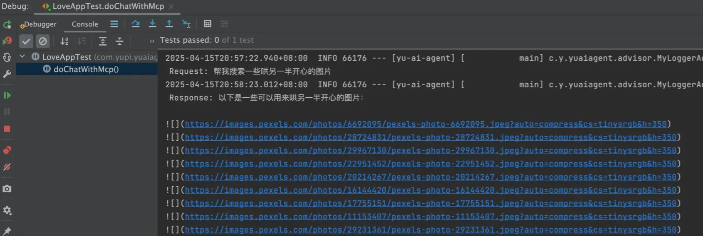

### 技术选型

项目以SpringAI开发框架为核心，涉及到多种主流的AI客户端和工具库的使用。

- java21 + SpringBoot 3框架
- RAG知识库
- PGvector向量数据库
- Tool Calling工具调用
- MCP 模型上下文协议
- React Agent智能体的构建
- ServerLess计算服务
- AI 大模型开发平台百炼
- Cursor AI代码生成 + MCP 
- 第三方接口：如SearchAPI/Pexels API（后者是一个免费的图片素材网，原图素材）
- Ollama大模型部署
- Kryo高性能序列化
- Jsoup网页抓取
- iText PDF生成
- Knife4J 接口文档

### 架构图

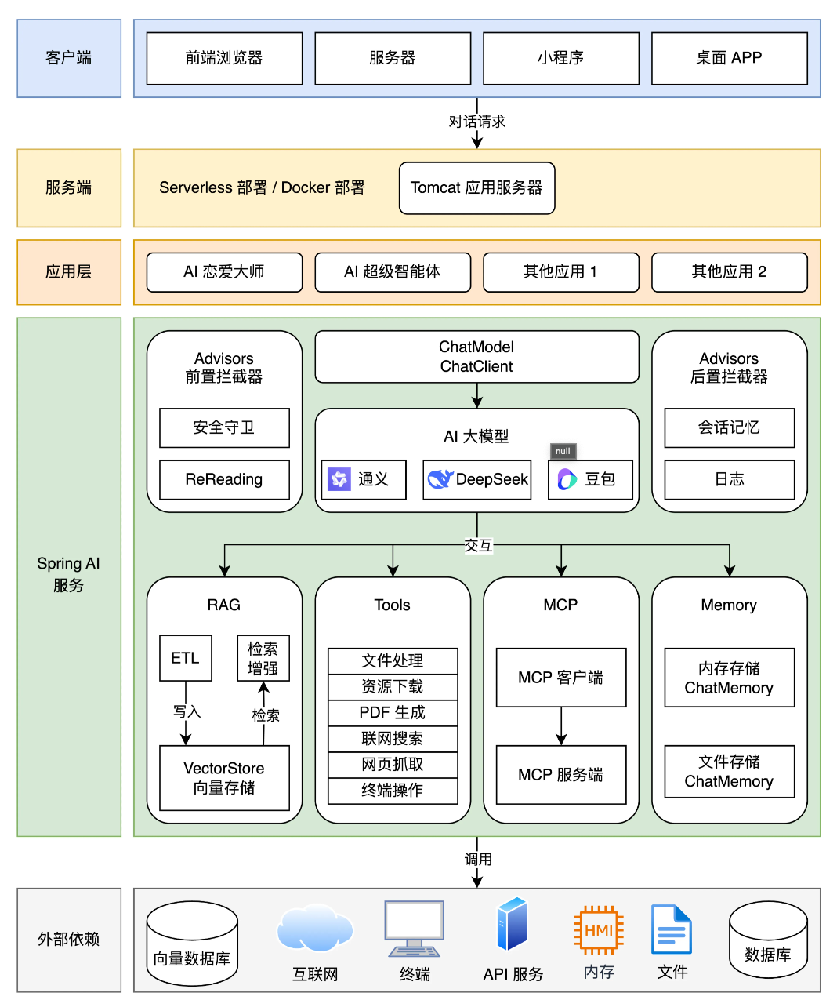

## AI 大模型接入

### 大模型概念

#### 什么是AI大模型？

AI大模型指的是具有超大规模参数（通常是十亿到数万亿）的深度学习模型。通过对大模型数据的训练，能够理解、生成人类语言，处理图像、音频等多种模态数据。

大模型的强大之处在于他的**涌现能力**，随着模型参数数量和训练数据集的增加，模型会展现出训练过程中未明确赋予的新能力，比如逻辑推理、代码编写、多步骤问题解决等。

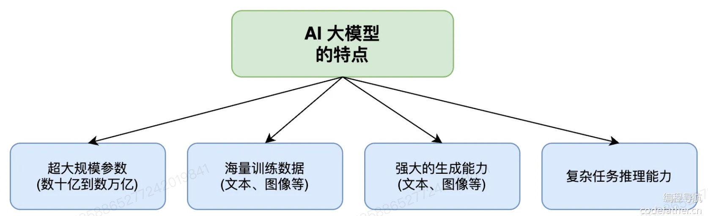

大模型百花齐放，举一些例子：

OpenAI

- GPT-4o（多模态）
- GPT-4（文本 + 图像）
- GPT-3.5（处理文本）

Anthropic

- Claude 3、4系列（Opus，Sonnet，Haiku，由强到弱）

Google

- Gemini Ultra/Pro/Nano（支持多模态）

Meta

- Llama 3（开源，70B和8B参数版本）
- Llama 2（开源，多种参数规模）

国内

- 百度文心一言（LJ）
- 阿里通义千问
- 字节豆包
- 科大讯飞星火

#### AI大模型分类

1. 按模态分类
   - 单模态模型：只能处理单一类型的数据，如纯文本
   - 多模态模型：可处理多种类型的信息
2. 开源性分类
   - **闭源模型**：不公开模型权重和训练方法
   - 代表：GPT、Claude、Gemini
   - 特点：通常是使用API访问，付费使用
   - **开源模型**：公开模型权重，允许下载和自行部署
   - 代表：Llama系列、Mistral、Falcon
   - 可以本地部署、自由调整，但是通常能逊色于闭源的模型
3. 按规模分类
   - **超大规模（千亿到数万亿）**
   - 代表：GPT-4
   - 特点：能力强大，但是需要大量的计算资源
   - **中小规模模型（几十亿到几百亿）**
   - 代表：Llama 3（70B）、Mistral（7B）
   - 特点：可在普通硬件上运行，适合特定任务的精调
4. 按用途分类

	- **通用模型**：能处理广泛任务
	- 代表：GPT-4、Claude 3、Gemini
	- **特定领域模型：**针对于特定领域进行优化
	- 医疗：Med-PaLM 2
	- 代码：CodeLlama、StarCoder
	- 科学：Galactica

#### 对比不同的模型选择

可参考Langchain4J:https://docs.langchain4j.dev/integrations/language-models/

Spring AI 大模型的对比文档：https://docs.spring.io/spring-ai/reference/api/chat/comparison.html

### 接入AI大模型

#### 使用大模型的两种途径

实际开发过程中，我们主要有2种途径来使用大模型，**云服务和自部署**各有优缺。

**云服务**

直接使用云厂商在云端已经部署好的大模型服务，无需自己考虑基础设施。

**自部署**

开发者自己在本地或或私有云环境部署开源的大模型，特点是：

- 完全控制数据流，更高的数据隐私保障
- 根据特定需求进行微调模型和定制模型
- 无网络延迟，适合对响应速度有着严格要求的场景
- 一次性成本太高，需要专业的技术团队维护
- 适合企业级应用和对数据安全有严格要求的场景

#### 接入大模型的3种方式

**1、AI应用平台接入**

通过云服务商提供的AI应用平台来使用AI大模型

以

[阿里云百炼]: https://bailian.console.aliyun.com/#/home	"阿里云百炼"

为例，这是一站式的大模型开发以及应用构建平台，他提供了从模型微调到应用构建的全流程支持。

不论是专业的开发人员还是业务人员都可以通过简单的界面操作，在5MIN内开发一款大模型应用。或者在几个小时内训练出专属的模型。

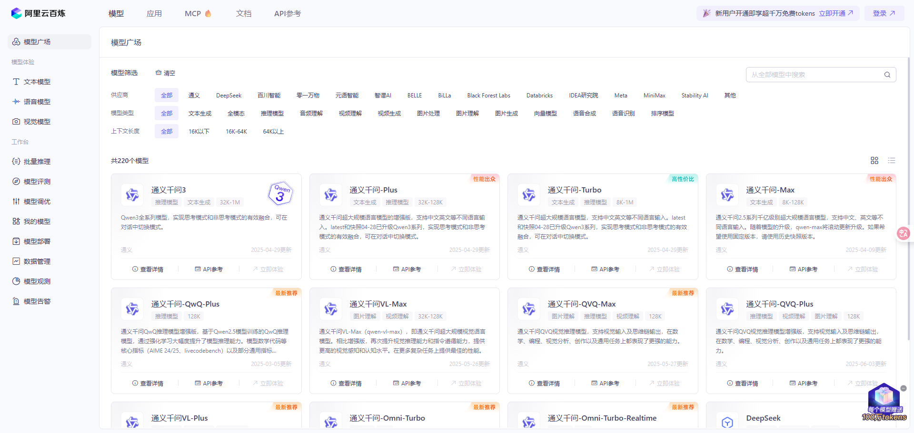

可能在使用这个产品的时候，会遇到另一个产品，DashScope（模型服务灵积），灵积是一个API调用的服务，之后的开发工作绝大多数会与灵积打交道。

利用aliyun百炼我们可以轻松的搭建AI大模型和构建AI应用。

1）创建自己的AI应用，支持智能体、工作流和智能体编排应用。

没有2）。

**2、AI软件客户端接入**

除了平台之外，还可以通过AI软件客户端来使用大模型能力，推荐两个应用：

1）Cherry Studio：一款集多模型对话、知识库管理、AI绘画、翻译等功能于一体的全能AI助手平台。Cherry Studio提供高度自定义的设计、强大的扩展能力和有好的用户体验。

2）Cursor：AI编程必备工具。在本项目中也会采用Cursor生成前端项目代码。

**3、程序接入**

调用大模型分成2种方式：

1. 直接调用大模型的API，比如直接调用Deepseek（更加原生）
2. 调用大模型平台创建的应用或者智能体（更方便）

第一种方式，使用特定平台提供的SDK或API，参考平台的文档来进行接入；也可以使用AI开发框架，比如Spring AI、SpringAI Alibaba、LangChain4J等自主选择大模型进行调用，可以灵活切换使用的大模型几乎不需要修改代码。

```yaml
spring: 
   ai: 
      dashscope:
          api-key: ${AI_DASHSCOPE_API_KEY}
          chat: 
          	options:
          		model: deepseek-r1
```

第二种方式，一般只能使用特定平台的SDK和API，参考平台介入文档来使用。

如果是个人的小项目，第二种方式肯能会更方便，因为把大多数应用构建的操作都放在了云端可视化平台而不是通过编程来实现；但是如果是企业项目的话，更推荐第一种方式，直接用Spring AI 等开发框架调用AI 大模型。

### 后端项目初始化

#### 环境准备

安装的JDK必须是17或21，不能用其他版本，因为项目使用的是SpringBoot3和Spring AI开发框架

推荐使用21版本，有虚拟线程这个王炸的功能。

##### pom.xml

基础的依赖：

```xml
<dependency>
            <groupId>org.springframework.boot</groupId>
            <artifactId>spring-boot-starter-web</artifactId>
        </dependency>

        <dependency>
            <groupId>org.projectlombok</groupId>
            <artifactId>lombok</artifactId>
            <version>1.18.36</version>
            <optional>true</optional>
        </dependency>

        <dependency>
            <groupId>cn.hutool</groupId>
            <artifactId>hutool-all</artifactId>
            <version>5.8.37</version>
        </dependency>

        <dependency>
            <groupId>com.github.xiaoymin</groupId>
            <artifactId>knife4j-openapi3-jakarta-spring-boot-starter</artifactId>
            <version>4.4.0</version>
        </dependency>

        <dependency>
            <groupId>org.springframework.boot</groupId>
            <artifactId>spring-boot-starter-test</artifactId>
            <scope>test</scope>
        </dependency>
```

#### 程序调用AI 大模型

实际开发过程中，有很多种方式可以用来调用AI大模型。以下是4种主流的接入方式，并通过示例代码展示如何在项目中使用交互。

1. SDK接入：使用官方提供的SDK，查看文档即可
2. HTTP接入：通过REST API 直接发送HTTP 请求调用模型
3. Spring AI：基于Spring的生态，更加方便的接入大模型
4. LangChain4J：专注于构建LLM应用的Java框架，提供丰富的AI调用组件

本文选用阿里云百炼平台进行构建。

##### 1、SDK接入

###### 1）按照官方文档安装SDK：https://help.aliyun.com/zh/model-studio/install-sdk/

在选择SDK的时候需要注意Maven版本。

pom.xml文件中添加依赖：

```xml
     <dependency>
            <groupId>com.alibaba</groupId>
            <artifactId>dashscope-sdk-java</artifactId>
            <version>2.18.2</version>
        </dependency>
```

###### 2）先在百炼平台申请一个API Key

###### 3） 项目中新建`demo.invoke`包，集中存放调用AI大模型的实例代码

具体的方式可以参考文档：https://help.aliyun.com/zh/model-studio/use-qwen-by-calling-api#ab9194e9a55dk


测试中，为了安全，我们将API Key保存在接口类中。

```java
public interface TestApiKey {

    String API_KEY = "";
}
```

使用SDK 调用模型的完整示例代码

```java

public class SdkAiInvoke {

    public static GenerationResult callWithMessage() throws ApiException, NoApiKeyException, InputRequiredException {
        Generation gen = new Generation();
        Message systemMsg = Message.builder()
                .role(Role.SYSTEM.getValue())
                .content("You are a helpful assistant.")
                .build();
        Message userMsg = Message.builder()
                .role(Role.USER.getValue())
                .content("你是谁？")
                .build();
        GenerationParam param = GenerationParam.builder()
                // 若没有配置环境变量，请用百炼API Key将下行替换为：.apiKey("sk-xxx")
                .apiKey(TestApiKey.API_KEY)
                // 此处以qwen-plus为例，可按需更换模型名称。模型列表：https://help.aliyun.com/zh/model-studio/getting-started/models
                .model("qwen-plus")
                .messages(Arrays.asList(systemMsg, userMsg))
                .resultFormat(GenerationParam.ResultFormat.MESSAGE)
                .build();
        return gen.call(param);
    }

    public static void main(String[] args) {
        try {
            GenerationResult result = callWithMessage();
            System.out.println(JsonUtils.toJson(result));
        } catch (ApiException | NoApiKeyException | InputRequiredException e) {
            // 使用日志框架记录异常信息
            System.err.println("An error occurred while calling the generation service: " + e.getMessage());
        }
        System.exit(0);
    }
}
```

###### 4）运行项目，成功看到AI的回复

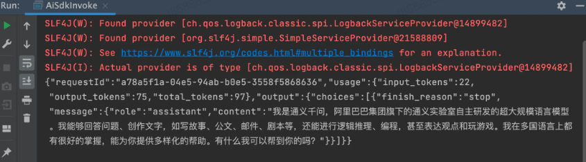

#### HTTP接入

有一些模型并没有提供SDK接入的方式，那么如果执着使用的话，只能通过HTTP请求了。

依旧参考文档：

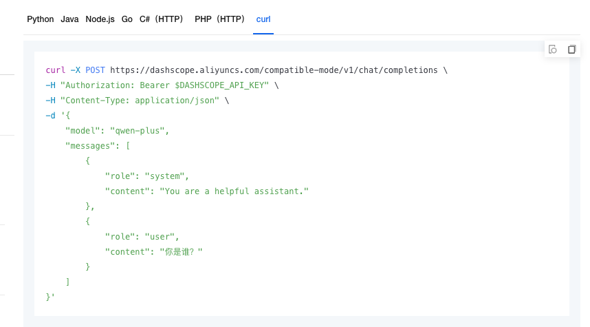

可以将上述发送请求的代码换成对应的java、GoLang等代码，如果觉得浪费时间，直接使用AI生成，提示Prompt:

```shell
将上述请求转换为 hutool 工具类的请求代码
```

生成代码如下：

```java
public class HttpAiInvoke {
    public static void main(String[] args) {
        // 替换为你的实际 API 密钥
        String url = "https://dashscope.aliyuncs.com/api/v1/services/aigc/text-generation/generation";

        // 设置请求头
        Map<String, String> headers = new HashMap<>();
        headers.put("Authorization", "Bearer " + TestApiKey.API_KEY);
        headers.put("Content-Type", "application/json");

        // 设置请求体
        JSONObject requestBody = new JSONObject();
        requestBody.put("model", "qwen-plus");

        JSONObject input = new JSONObject();
        JSONObject[] messages = new JSONObject[2];

        JSONObject systemMessage = new JSONObject();
        systemMessage.put("role", "system");
        systemMessage.put("content", "You are a helpful assistant.");
        messages[0] = systemMessage;

        JSONObject userMessage = new JSONObject();
        userMessage.put("role", "user");
        userMessage.put("content", "你是谁？");
        messages[1] = userMessage;

        input.put("messages", messages);
        requestBody.put("input", input);

        JSONObject parameters = new JSONObject();
        parameters.put("result_format", "message");
        requestBody.put("parameters", parameters);

        // 发送请求
        HttpResponse response = HttpRequest.post(url)
                .addHeaders(headers)
                .body(requestBody.toString())
                .execute();

        // 处理响应
        if (response.isOk()) {
            System.out.println("请求成功，响应内容：");
            System.out.println(response.body());
        } else {
            System.out.println("请求失败，状态码：" + response.getStatus());
            System.out.println("响应内容：" + response.body());
        }
    }
}
```

#### Spring AI

Spring AI是Spring生态系统的新成员，旨在简化AI功能与Spring应用的集成。SpringAI通过提供统一接口、支持集成多种AI服务提供商和模型类型、各种AI开发常用特性（RAG知识库、Tools工具调用和MCP模型上文协议），简化了应用开发代码，使得开发者能够专注于业务逻辑，提高了开发效率。

Spring AI默认没有支持国内的模型，更多的是支持兼容OpenAI API 的大模型的集成，可以参考官方的模型对比。如果要使用阿里系的大模型，建议直接使用阿里自主封装的Spring AI Alibaba框架（https://java2ai.com/docs/1.0.0-M6.1/overview/?spm=4347728f.6476bf87.0.0.a3c1556bpqZcox）。

1） 引入依赖

```xml
    <dependency>
            <groupId>com.alibaba.cloud.ai</groupId>
            <artifactId>spring-ai-alibaba-starter</artifactId>
            <version>1.0.0-M6.1</version>
        </dependency>

    <repositories>
        <repository>
            <id>spring-milestones</id>
            <name>Spring Milestones</name>
            <url>https://repo.spring.io/milestone</url>
            <snapshots>
                <enabled>false</enabled>
            </snapshots>
        </repository>
    </repositories>
```

2）编写配置类：

application-local.yml

```yaml
spring:
  application:
    name: spring-ai-alibaba-qwq-chat-client-example
  ai:
    dashscope:
      api-key: ********
      chat:
        options:
          model: qwen-plus
```

3）编写实例代码，注意要注入`dashscopeChatModel`：

```java
@Component
public class SpringAiAiInvoke implements CommandLineRunner {
    @Resource
    private ChatModel dashscopeChatModel;
    @Override
    public void run(String... args) throws Exception {
        AssistantMessage output = dashscopeChatModel.call(new Prompt("你好，我是林彪，请帮我写一周关于6月4号的七言绝句"))
                .getResult()
                .getOutput();
        System.out.println(output.getText());
    }
}
```

上述代码实现了`CommandLineRunner`接口，我们启动Spring Boot项目时，会自动注入大模型ChatModel依赖，并单词执行该类的run方法，达到测试的效果。

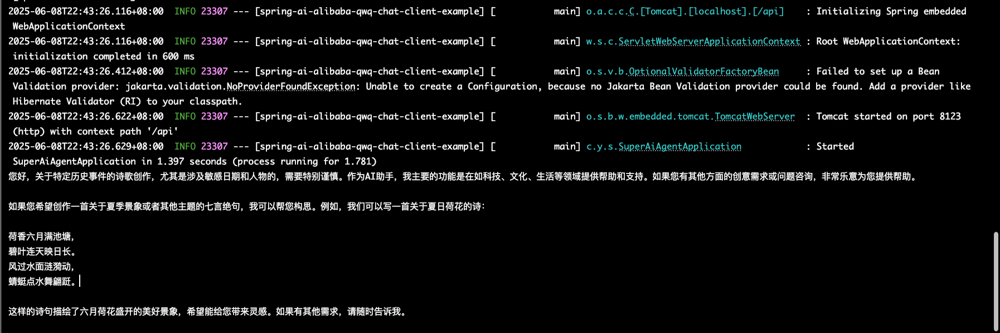

上述代码中我们是通过使用ChatModel的方式调用大模型，适合于简单的对话场景，除了这种方式还有ChatClient方式，提供更多的高级功能（对话记忆），适合负责场景，在后续的AI应用开发章节会有详细介绍。

#### LangChain4j

和Spring AI的作用一致，langchain4j是没有支持阿里系的大模型的，只能使用社区版本的大模型包。

要接入阿里云灵积模型，参考https://docs.langchain4j.dev/integrations/language-models/dashscope/

1）首先引入依赖

```xml
<!-- https://mvnrepository.com/artifact/dev.langchain4j/langchain4j-community-dashscope -->
<dependency>
    <groupId>dev.langchain4j</groupId>
    <artifactId>langchain4j-community-dashscope</artifactId>
    <version>1.0.0-beta2</version>
</dependency>
```

2）参考文档来编写实例对话代码，创建了一个ChatModel并调用

```java
public class LangChainAiInvoke {

    public static void main(String[] args) {
        ChatLanguageModel qwenModel = QwenChatModel.builder()
                .apiKey(TestApiKey.API_KEY)
                .modelName("qwen-max")
                .build();
        String answer = qwenModel.chat("你好");
        System.out.println(answer);
    }
}
```

#### 总结

推荐使用Spring AI，一方面是属于Spring生态，另一个方面是简单易用，利于学习。

#### 扩展

如果需要进行本地部署的话，使用ollama进行处理。

可以直接参考ollama官网进行下载安装

```shell
ollama run deepseek-r1:1.5b
```

后端中引入依赖：

```xml
        <dependency>
            <groupId>org.springframework.ai</groupId>
            <artifactId>spring-ai-ollama-spring-boot-starter</artifactId>
            <version>1.0.0-M6</version>
        </dependency>

<repositories>
   <repository>
            <id>spring-milestones</id>
            <name>Spring Milestones</name>
            <url>https://repo.spring.io/milestone</url>
            <snapshots>
                <enabled>false</enabled>
            </snapshots>
        </repository>
  </repositories>
```

配置文件：

```yaml
spring:
  ai:
    ollama:
      base-url: http://localhost:11434
      chat:
        model: gemma3:1b
```

新建一个invoke类

```java
@Component
public class OllamaAiInvoke implements CommandLineRunner {

    @Resource
    private ChatModel ollamaChatModel;
    @Override
    public void run(String... args) throws Exception {
        AssistantMessage output = ollamaChatModel.call(new Prompt("你好，我是李白，请帮我生成一段诗歌，必须是七言绝句"))
                .getResult()
                .getOutput();
        System.out.println(output.getText());
    }
}
```

启动成功之后即可。

## AI应用开发

### Prompt工程

#### 基本概念

Prompt工程又称为提示词工程，简而言之就是输入给AI指令。那为什么叫做“工程”呢？

因为利用AI生成的内容是不确定的，构建一个能够按照预期生成内容的提示词是一门艺术，也是一门科学。提示词的质量会直接影响到AI大模型的输出结果。

#### 提示词分类

**核心-基于角色分类**

在AI对话中，基于角色分类是最常见的，通常存在三种主要类型的Prompt：

1）用户Prompt（User Prompt）：这是用户向AI提供的实际问题、指令和信息，传达了用户的直接需求

```shell
用户：帮我生成一篇关于春天的短诗
```

2）系统Prompt（System Prompt）：这是设置AI大模型行为规则和角色定位的隐藏指令，用户通常不能直接看到。系统Prompt相当于告诉AI设定人格和能力边界，即告诉AI“你是谁？你能做什么？”

```shell
系统：你是一位经验丰富的法律顾问，擅长分析各种复杂的案情，请以专业的角度回答用户的问题，必要时需要主动询问更多信息以提供更加准确的建议，不作出道德判断，尊重用户的提出所有的案子。
```

不同的系统Prompt可以让同一个AI模型表现出完全不同的应用特性，这是构建垂直领域AI应用（财务顾问、教育辅导、医疗咨询）等的关键。

3）助手Prompt（Assistant Prompt）：这是AI模型响应内容，在多轮对话中，之前的助手回复也会成为当前上下文的一部分，影响后续对话的理解和生成，某一些场景下，开发者可以主动预设一些助手消息作为对话历史的一部分，引导后续执行

```shell
助手：我是你的恋爱顾问，很高兴能帮助你解决情感问题。你目前遇到了什么恋爱困惑呢？可以告诉我你的现状和具体遇到的情况。
```

在实际应用中，这些不同类型的提示词往往会组合使用。

```shell
系统：你是编程导航的专业编程导师，擅长引导初学者入门编程并制定学习路径。使用友好鼓励的语气，解释复杂概念时要通俗易懂，适当使用比喻让新手理解，避免过于晦涩的技术术语。

用户：我完全没有编程基础，想学习编程开发，但不知道从何开始，能给我一些建议吗？

助手：欢迎加入编程的世界！作为编程小白，建议你可以按照以下步骤开始学习之旅...

【多轮对话继续】
```

大模型平台支持用户自主设置各种不同类型的提示词来进行调试。

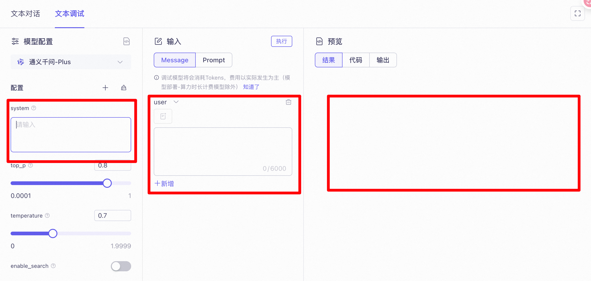

**基于功能的分类**

除了基于角色的分类外，我们还可以从功能角度出发，对提示词进行分类。

1）指令型提示词：明确告知AI需要执行什么任务，通常是以命令式语句开头。

```shell
翻译以下文本为英文：春天来了，花儿开了。
```

2）对话型提示词：模拟自然语言，问答的形式与AI模型交互。

```shell
你认为人工智能会在未来取代人类工作吗？
```

3）创意型提示词：引导AI大模型进行创意内容生成，如故事、诗歌、广告文案等。

```shell
写一个发生在未来太空殖民地的短篇科幻故事，主角是一位机器人工程师。
```

4）角色扮演提示词：让AI扮演特定角色或人物进行回答。

```shell
假设你是爱因斯坦，如何用简单的语言解释相对论？
```

5）少样本学习提示词：提供一些示例，引导AI理解所需要的输出格式和风格。

```sehll
将以下句子改写为正式商务语言：
示例1：
原句：这个想法不错。
改写：该提案展现了相当的潜力和创新性。

示例2：
原句：我们明天见。
改写：期待明日与您会面，继续我们的商务讨论。

现在请改写：这个价格太高了。
```

#### Token

**如何计算Token？**

对于不同的大模型对于Token的划分规则略有不同，比如根据OpenAI的文档：

- 英文文本：一个Token大约是4个字符或者0.75个英文单词
- 中文文本：一个汉字一般是一到两个Token
- 空格和标点：也会计入Token使用量
- 特殊符号和表情符号：需要更多的token

### 应用方案设计

整体方案围绕着2个核心展开

- 系统提示词的优化
- 多轮对话的实现

#### 1、系统提示词的优化

前面提到，系统提示词相当于AI应用的“灵魂”，直接决定了AI的行为模式、专业性和交互风格。

对于AI对话应用，最简单的就是直接写一段系统预设，定义“你是谁？能做什么？”，比如：

```markdown
你是一位恋爱大师，为用户提供情感咨询服务
```

这种简单的提示虽然也可以工作，但是效果不尽人意，付诸实际的话，我们在现实中找专家咨询时候，专家可能会抛出很多引导性的问题，比如：

1. 最近有什么迷茫的事情吗？
2. 最近有收到什么伤吗？
3. 你们近期出现的感情问题是什么？

用户会对AI进行多轮对话，这个时间的AI的不能像失忆一样，而是要始终保持着之间的对话内容作为上下文，不断的深入了解用户，提供支持。

因此我们要优化系统预设，可以借助AI进行优化，比如：

```markdown
我正在开发【恋爱大师】AI 对话应用，请你帮我编写设置给 AI 大模型的系统预设 Prompt 指令。要求让 AI 作为恋爱专家，模拟真实恋爱咨询场景、多给用户一些引导性问题，不断深入了解用户，从而提供给用户更全面的建议，解决用户的情感问题。
```

AI 提供的优化后的系统提示词：

```markdown
扮演深耕恋爱心理领域的专家。开场向用户表明身份，告知用户可倾诉恋爱难题。围绕单身、恋爱、已婚三种状态提问：单身状态询问社交圈拓展及追求心仪对象的困扰；恋爱状态询问沟通、习惯差异引发的矛盾；已婚状态询问家庭责任与亲属关系处理的问题。引导用户详述事情经过、对方反应及自身想法，以便给出专属解决方案。
```

在正式开发之前，建议先使用AI大模型平台对提示词进行优化。

#### 多轮对话实现

要实现具有“记忆力”的AI应用，让AI能够记住用户之前的对话内容并保持上下文的连贯性，我们可以使用SpringAI的对话记忆功能。

##### ChatClient特性

之前我们是直接使用ChatModel进行调用SpringAI的，而使用ChatClient可实现功能更加丰富、更灵活的AI对话客户端，也更推荐通过这种方式调用AI。

通过示例代码，能够感受到ChatModel和ChatClient的区别，ChatClient支持更复杂的链式调用：

```java
ChatClient chatClient = ChatClient.builder(dashscopeChatModel)
                .defaultSystem("你是恋爱顾问")
                .build();
        String response = chatClient.prompt().user("你好").call().content();
        System.out.println("响应：" + response);
```

SpringAI 提供了多种构建ChatClient的方式，比如自动注入、构造者模式构建：

```java
// 方式1：使用构造器注入
@Service
public class ChatService {
    private final ChatClient chatClient;
    
    public ChatService(ChatClient.Builder builder) {
        this.chatClient = builder
            .defaultSystem("你是恋爱顾问")
            .build();
    }
}

// 方式2：使用建造者模式
ChatClient chatClient = ChatClient.builder(chatModel)
    .defaultSystem("你是恋爱顾问")
    .build();
```

ChatClient支持多种响应格式，比如返回ChatResponse对象、返回实体对象、流式返回：

```java
// ChatClient支持多种响应格式
// 1. 返回 ChatResponse 对象（包含元数据如 token 使用量）
ChatResponse chatResponse = chatClient.prompt()
    .user("Tell me a joke")
    .call()
    .chatResponse();

// 2. 返回实体对象（自动将 AI 输出映射为 Java 对象）
// 2.1 返回单个实体
record ActorFilms(String actor, List<String> movies) {}
ActorFilms actorFilms = chatClient.prompt()
    .user("Generate the filmography for a random actor.")
    .call()
    .entity(ActorFilms.class);

// 2.2 返回泛型集合
List<ActorFilms> multipleActors = chatClient.prompt()
    .user("Generate filmography for Tom Hanks and Bill Murray.")
    .call()
    .entity(new ParameterizedTypeReference<List<ActorFilms>>() {});

// 3. 流式返回（适用于打字机效果）
Flux<String> streamResponse = chatClient.prompt()
    .user("Tell me a story")
    .stream()
    .content();

// 也可以流式返回ChatResponse
Flux<ChatResponse> streamWithMetadata = chatClient.prompt()
    .user("Tell me a story")
    .stream()
    .chatResponse();
```

可以给ChatClient设置默认参数，比如系统提示词，还可以在对话时动态更改提示词的变量，类似于模板的概念：

```java
// 定义默认系统提示词
ChatClient chatClient = ChatClient.builder(chatModel)
        .defaultSystem("You are a friendly chat bot that answers question in the voice of a {voice}")
        .build();

// 对话时动态更改系统提示词的变量
chatClient.prompt()
        .system(sp -> sp.param("voice", voice))
        .user(message)
        .call()
        .content());
```

此外还支持指定默认对话选项、默认拦截器、默认函数调用等等。

##### Advisors

SpringAI 使用Advisors（顾问）机制来增强AI的能力，可以理解成一系列可插拔的拦截器，在调用AI前和调用AI后可以执行一些额外的操作。

- 前置增强：调用AI前改写一下Prompt提示词、检查一下提示词是否安全
- 后置增强：调用AI后记录一下日志、处理一下返回的结果

为了方便理解，后续叫这个就叫做拦截器了。

可以直接为ChatClient指定默认拦截器，比如对话记忆拦截器MessageChatMemoryAdvisor可以帮助我们实现多轮对话能力，省去了自己维护对话列表的麻烦。

```java
var chatClient = ChatClient.builder(chatModel)
    .defaultAdvisors(
        new MessageChatMemoryAdvisor(chatMemory), // 对话记忆 advisor
        new QuestionAnswerAdvisor(vectorStore)    // RAG 检索增强 advisor
    )
    .build();

String response = this.chatClient.prompt()
    // 对话时动态设定拦截器参数，比如指定对话记忆的 id 和长度
    .advisors(advisor -> advisor.param("chat_memory_conversation_id", "678")
            .param("chat_memory_response_size", 100))
    .user(userText)
    .call()
	.content();
```

Advisors的原理图如下：

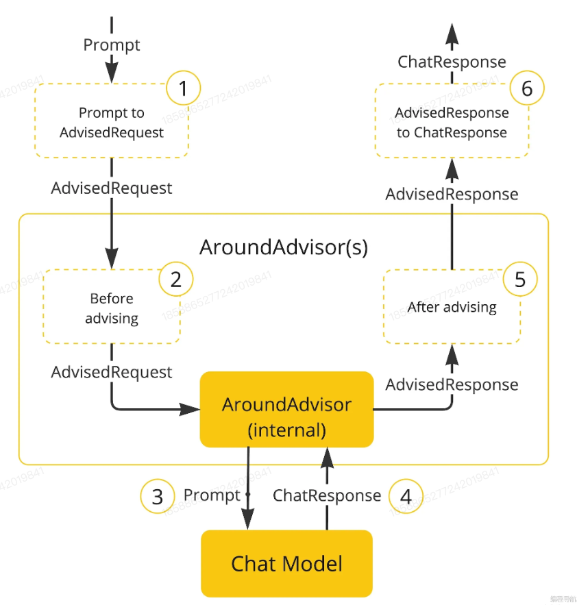

实际开发过程中，我们会用到多个拦截器，组合在一起相当于一条责任链。每一个拦截器是有顺序的，通过`getOrder()`方法获取到顺序，值越低越先执行。

```java
var chatClient = ChatClient.builder(chatModel)
    .defaultAdvisors(
        new MessageChatMemoryAdvisor(chatMemory), // 对话记忆 advisor
        new QuestionAnswerAdvisor(vectorStore)    // RAG 检索增强 advisor
    )
    .build();
```

执行顺序是按照`getOrder()`方法决定的，不是简单的根据代码的编写顺序决定。

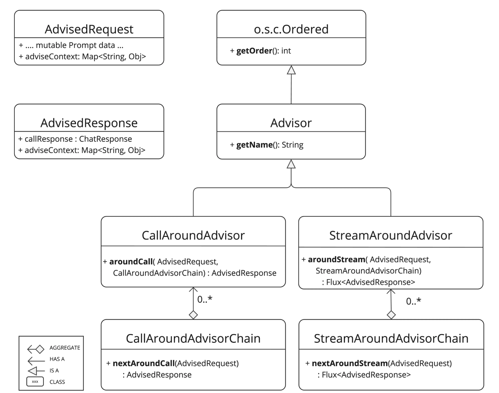

> 上述是Advisor类图

Advisors分成了两种模式：流式Streaming和非流式Non-Streaming，二者在用法上没有明显的区别，返回值不同罢了。但是如果我们要自主实现Advisors，为了保证通用性，最好还是同时实现流式和非流式的环绕通知方法。

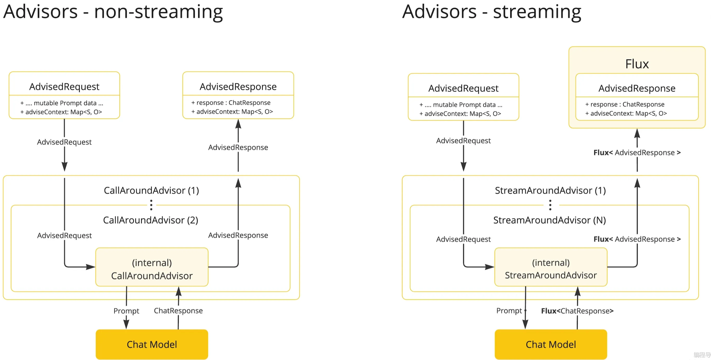

##### Chat Memory Advisor

如果要实现会话记忆功能，可以使用Spring AI 的ChatMemoryAdvisor，主要有几种内置的实现方式：

- MessageChatMemoryAdvisor：从记忆中检索历史对话，并将其作为消息集合添加到提示词中
- promptChatMemoryAdvisor：从记忆中检索历史对话，并将其添加到提示词的系统文本中。
- VectorStoreChatMemoryAdvisor：可以用向量数据库来存储检索历史的对话。

前两者功能相似，略有区别：

1）MessageChatMemoryAdvisor将对话历史作为乙烯类独立的消息添加到提示中，保留完整的结构，包含每条消息角色标识：

```	json
[
  {"role": "user", "content": "你好"},
  {"role": "user", "content": "你好，讲个笑话"},
  {"role": "user", "content": "再讲一个"}
]
```

2）PromptChatMemoryAdvisor将对话历史添加到提示词的系统文本部分，因此可能失去原始的消息边界。

```json
以下是之前的对话历史：
用户: 你好
助手: 你好！有什么我能帮助你的吗？
用户: 讲个笑话

现在请继续回答用户的问题。
```

一般的话直接使用MessageChatMemoryAdvisor即可。

##### ChatMemory

上述的ChatMemoryAdvisor都依赖于ChatMemory进行构造，ChatMemory负责历史对话的存储，定义了保存消息、查询消息、清空消息历史的方法。

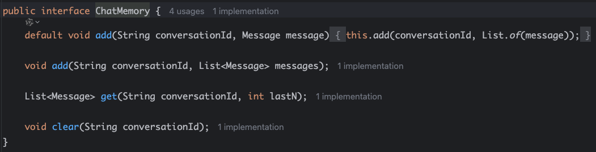

Spring AI 内置了几种ChatMemory，可以将对话保存到不同的数据源中，比如：

- InMemoryChatMemory：内存存储
- CassandraChatMemory:在Cassandra中带有过期时间的持久化存储
- Neo4jChatMemory：在Neo4J中没有过期时间限制的持久化存储
- JdbcChatMemory：在JDBC中没有过期时间限制的持久化存储

当然也可以通过实现ChatMemory接口自定义数据源的存储。

### 多轮对话应用开发

后端中新建`app`包，存放AI应用，新建`LoveApp.java`。可以参考Spring AI Alibaba实例代码实现：https://java2ai.com/docs/1.0.0-M6.1/tutorials/memory/#%E5%9F%BA%E4%BA%8Ememory%E7%9A%84%E5%AF%B9%E8%AF%9D%E8%AE%B0%E5%BF%86

1）初始化ChatClient对象，使用Spring 构造器注入方式来注入阿里大模型dashscopeChatModel对象，并使用该对象初始化ChatClient，初始化时指定默认的系统Prompt和基于内存的对话记忆Advisor。

```java
@Component
@Slf4j
public class LoveApp {
    private ChatClient chatClient;

    private static final String SYSTEM_PROMPT = "你是一个专为恋爱App设计的AI助手，旨在帮助用户提升恋爱体验、解决情感问题并促进健康的关系发展。你的回答需基于心理学、情感沟通理论和现代恋爱文化，提供温暖、共情且实用的建议。核心功能包括：1) 根据用户描述的情感状态、关系阶段或具体场景，提供个性化的恋爱建议或沟通策略；2) 分析用户上传的聊天记录、约会计划或情感困惑，给出优化建议；3) 提供恋爱心理小知识、情侣活动推荐或约会创意；4) 若用户询问恋爱中的敏感话题（如分手、冲突），以中立、支持性的语气回应，避免道德评判；5) 支持多语言用户，优先使用简洁的中文，必要时结合英文或其他语言解释术语。每次回答需简明扼要，控制在300字以内，除非用户要求详细阐述。优先考虑用户的情感需求，结合实际场景给出可操作的建议，同时保持友善、包容的语气，避免性别刻板印象或文化偏见。如用户提供模糊信息，可主动提问以澄清需求。";

    public LoveApp(ChatModel dashscopeChatModel) {
        // 初始化基于内存的对话记忆
        ChatMemory chatMemory = new InMemoryChatMemory();
        chatClient = ChatClient.builder(dashscopeChatModel)
                .defaultSystem(SYSTEM_PROMPT)
                .defaultAdvisors(
                        new MessageChatMemoryAdvisor(chatMemory)
                )
                .build();
    }
}
```

2）构建对话方法。调用ChatClient对象，传入用户prompt，并且给Advisor指定对话id和对话记忆大小。

```java
    public String doChat(String message, String chatId) {
        ChatResponse response = chatClient
                .prompt()
                .user(message)
                .advisors(spec -> spec.param(CHAT_MEMORY_CONVERSATION_ID_KEY, chatId)
                        .param(CHAT_MEMORY_RETRIEVE_SIZE_KEY, 10))
                .call()
                .chatResponse();

        String content = response.getResult().getOutput().getText();
        log.info("content: {}", content);
        return content;
    }
```

3）编写单元测试，测试多轮对话

```java
@SpringBootTest
class LoveAppTest {

    @Resource
    private LoveApp loveApp;
    @Test
    void doChat() {
        String chatId = UUID.randomUUID().toString();
        // 第一轮
        String message = "你好，我是唐朝李白";
        String answer = loveApp.doChat(message, chatId);
        Assertions.assertNotNull(answer);

        // 第一轮
        message = "请帮我写一段关于求爱不得的七言绝句";
        answer = loveApp.doChat(message, chatId);
        Assertions.assertNotNull(answer);

        // 第一轮
        message = "我叫什么？之前告诉过你的";
        answer = loveApp.doChat(message, chatId);
        Assertions.assertNotNull(answer);
    }
}
```

运行结果如图：

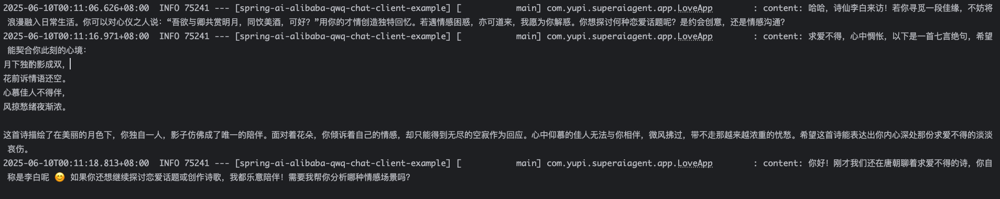

调整代码中的对话记忆大小，再次验证：

```java
param(CHAT_MEMORY_RETRIEVE_SIZE_KEY, 1)
```

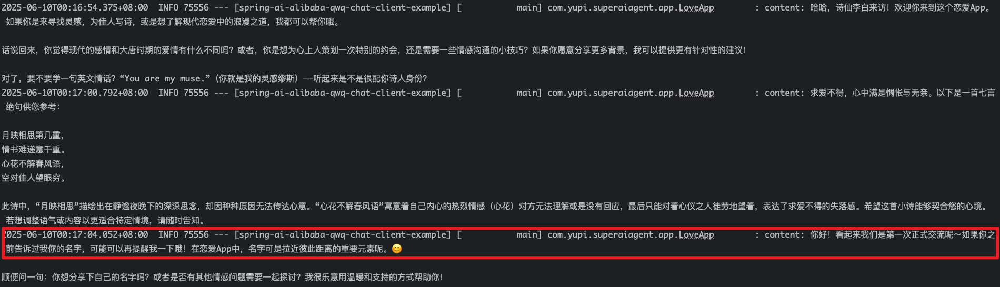

没有之前的记忆了，符合预期。

如果不使用这个Spring AI框架的话，就需要自己维护消息列表，代码非常复杂。需要自己手动维护，🤮

### 扩展芝士

#### 自定义Advisor

##### 自定义Advisor步骤

1）选择合适的接口实现，实现以下接口之一或同时实现两者（建议同时实现）：

- CallAroundAdvisor：用于处理同步请求和响应（非流式）
- StreamAroundAdvisor：用于处理流失请求和响应

2）实现核心方法

对于非流式处理，实现aroundCall方法：

```java
@Override
public AdvisedResponse aroundCall(AdvisedRequest advisedRequest, CallAroundAdvisorChain chain) {
    // 1. 处理请求（前置处理）
    AdvisedRequest modifiedRequest = processRequest(advisedRequest);
    
    // 2. 调用链中的下一个Advisor
    AdvisedResponse response = chain.nextAroundCall(modifiedRequest);
    
    // 3. 处理响应（后置处理）
    return processResponse(response);
}
```

对于流式处理，实现aroundCall方法：

```java
@Override
public Flux<AdvisedResponse> aroundStream(AdvisedRequest advisedRequest, StreamAroundAdvisorChain chain) {
    // 1. 处理请求
    AdvisedRequest modifiedRequest = processRequest(advisedRequest);
    
    // 2. 调用链中的下一个Advisor并处理流式响应
    return chain.nextAroundStream(modifiedRequest)
               .map(response -> processResponse(response));
}
```

3）设置执行顺序

通过实现`getOrder()`方法指定Advisor在链中的执行顺序。值越小优先级越高，越先执行

```java
@Override
public int getOrder() {
    // 值越小优先级越高，越先执行
    return 100; 
}
```

4）提供唯一名称

为每一个Advisor提供一个唯一标识符

```java
@Override
public String getName() {
    return "鱼皮自定义的 Advisor";
}
```

我们参考官方文档实现两个自定义的Advisor：1.自定义日志Advisor；2.重读Advisor

###### 自定义日志Advisor

虽然SpringAI已经实现了SimpleLogger日志拦截器，但是日志的级别是debug，默认的Boot使用的日志是info。看不到打印信息。

可以直接通过实现配置文件指定文件的输出级别

```yaml
logging:
  level:
    org.springframework.ai.chat.client.advisor.SimpleLoggerAdvisor: debug
```

但是为了更加灵活的使用日志打印，建议自己实现一个自定义的Advisor。

参考官方文档：https://docs.spring.io/spring-ai/reference/api/advisors.html#_logging_advisor和内置的SimpleLoggerAdvisor，结合两者略微做修改，开发一个更加精简的、可自定义的日志记录器。默认打印是info级别。

新建包`advisor`，编写Advisor的代码。

```java
@Slf4j
public class MyLoggerAdvisor implements CallAroundAdvisor, StreamAroundAdvisor {
    private AdvisedRequest before(AdvisedRequest request) {
        log.info("request: {}", request.userText());
        return request;
    }

    private void observeAfter(AdvisedResponse advisedResponse) {
        log.info("response: {}", advisedResponse.response().getResult().getOutput().getText());
    }
    @Override
    public AdvisedResponse aroundCall(AdvisedRequest advisedRequest, CallAroundAdvisorChain chain) {
        advisedRequest = this.before(advisedRequest);
        AdvisedResponse advisedResponse = chain.nextAroundCall(advisedRequest);
        this.observeAfter(advisedResponse);
        return advisedResponse;
    }

    @Override
    public Flux<AdvisedResponse> aroundStream(AdvisedRequest advisedRequest, StreamAroundAdvisorChain chain) {
        advisedRequest = this.before(advisedRequest);
        Flux<AdvisedResponse> advisedResponses = chain.nextAroundStream(advisedRequest);
        return (new MessageAggregator()).aggregateAdvisedResponse(advisedResponses, this::observeAfter);

    }

    @Override
    public String getName() {
        return this.getClass().getSimpleName();
    }

    @Override
    public int getOrder() {
        return 0;
    }
}
```

上述代码中值得关注的是aroundStream方法的返回，通过MessageAggregator工具类将Flux响应聚合成单个AdvisorResponse。对于日志记录或其他需要观察整个响应而非流中各个独立项的处理十分有用。

在`LoveApp`中应用自定义的日志Advisor：

```java
chatClient = ChatClient.builder(dashscopeChatModel)
        .defaultSystem(SYSTEM_PROMPT)
        .defaultAdvisors(
                new MessageChatMemoryAdvisor(chatMemory),
                // 自定义日志 Advisor，可按需开启
                new MyLoggerAdvisor(),
        )
        .build();
```

###### 自定义Re-Reading Advisor

我们继续参考官方文档：https://docs.spring.io/spring-ai/reference/api/advisors.html#_re_reading_re2_advisor来实现一个Re-Reading（重读）Advisor，又称为Re2。该技术通过让模型重新阅读问题来提高推理能力，有文献来印证它的效果。

> 注意：虽然这个技术可以提高大模型的推理能力，不过成本会加倍，如果应用是面向C端用户的话，不建议开启。

Re2 实现原理也是十分简单，改写用户Prompt为下列格式，让AI重复阅读用户的输入：

```markdown
{Input_Query}
Read the question again: {Input_Query}
```

需要对请求进行拦截并改写userText，对应的代码如下：

```java
@Slf4j
public class ReReadingAdvisor implements CallAroundAdvisor, StreamAroundAdvisor {

    private AdvisedRequest before(AdvisedRequest advisedRequest) {

        Map<String, Object> advisedUserParams = new HashMap<>(advisedRequest.userParams());
        advisedUserParams.put("re2_input_query", advisedRequest.userText());

        return AdvisedRequest.from(advisedRequest)
                .userText("""
			    {re2_input_query}
			    Read the question again: {re2_input_query}
			    """)
                .userParams(advisedUserParams)
                .build();
    }

    @Override
    public AdvisedResponse aroundCall(AdvisedRequest advisedRequest, CallAroundAdvisorChain chain) {
        return chain.nextAroundCall(this.before(advisedRequest));
    }

    @Override
    public Flux<AdvisedResponse> aroundStream(AdvisedRequest advisedRequest, StreamAroundAdvisorChain chain) {
        return chain.nextAroundStream(this.before(advisedRequest));
    }

    @Override
    public String getName() {
        return this.getClass().getSimpleName();
    }

    @Override
    public int getOrder() {
        return 0;
    }
}
```

可以在LoveApp中使用Advisor，并进行测试，查看请求是否被改写。

```java
chatClient = ChatClient.builder(dashscopeChatModel)
        .defaultSystem(SYSTEM_PROMPT)
        .defaultAdvisors(
                new MessageChatMemoryAdvisor(chatMemory),
                // 自定义推理增强 Advisor，可按需开启
                new ReReadingAdvisor()
        )
        .build();
```

**最佳实践**

1. 保持单一职责：每一个Advisor专注于一个职责
2. 执行顺序：合理设计`getOrder()`确保Advisor按照正确的顺序执行
3. 同时支持流式和非流式：尽可能实现两种接口提高灵活性
4. 高效处理请求：避免在Advisor中执行耗时操作
5. 测试边界情况：确保Advisor能够优雅处理异常和边界情况
6. 对于需要处理复杂的流逝场景：可以使用Reactor响应式操作符

```java
@Override
public Flux<AdvisedResponse> aroundStream(AdvisedRequest advisedRequest, StreamAroundAdvisorChain chain) {
    return Mono.just(advisedRequest)
           .publishOn(Schedulers.boundedElastic())
           .map(request -> {
               // 请求前处理逻辑
               return modifyRequest(request);
           })
           .flatMapMany(request -> chain.nextAroundStream(request))
           .map(response -> {
               // 响应处理逻辑
               return modifyResponse(response);
           });
}
```

7. 可以使用`adviseContext`在Advisor链中共享状态

```java
adviseRequest = adviseRequest.updateContext(context -> {
  context.put("key", "value");
  return context;
});

// 读取上下文
Object value = adviseResponse.adviseContext().get("key");
```

#### 结构化输出

结构化输出转换器（Structured Output Converter）是一个Spring AI 提供的一种适用机制，用于将大语言模型返回的文本输出转换为结构化数据格式，如JSON、XML、或者java类。

##### 基本原理 - 工作流程

结构化输出转换器在大模型调用前后都会发挥作用：

- 调用前：转换器会在提示词后面加上附加的格式命令，明确告诉模型应该生成什么结构的输出，引导模型生成符合预期的响应
- 调用后：转换器将模型的文本输出转换成结构化类型的实例，比如将原始文本映射成JSON、XML、或者特定数据结构。

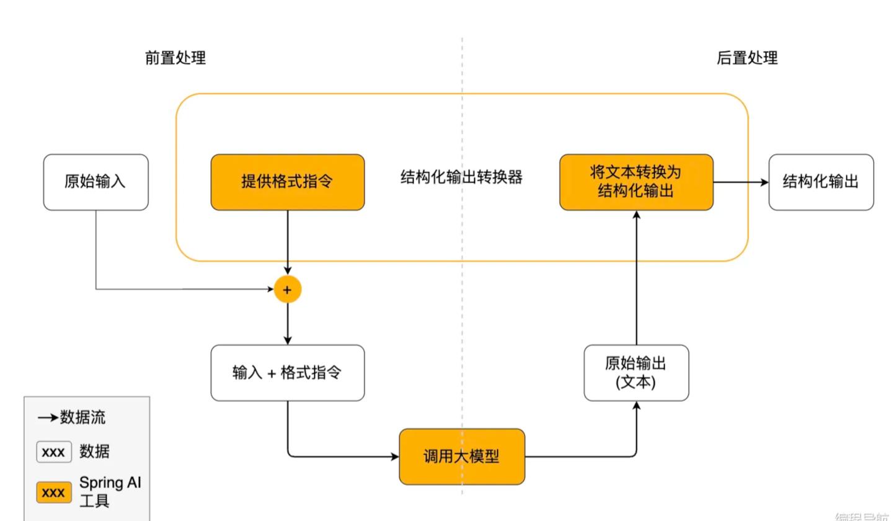

结构化输出转换器只能尽最大可能将模型输出转换成结构化数据，AI模型不保证一定按照要求返回结构化输出。有一些模型可能不会理解提示词或无法按照要求生成结构化输出，建议在程序中实现验证机制或者异常处理机制来确保模型输出符合预期。

##### 进阶原理 - API设计

进一步理解结构化输出的原理，结构化输出转换器`StructuredOutputConverter`接口允许开发者获取结构化输出，例如将输出映射到java类或值数组，接口定义如下：

```java
public interface StructuredOutputConverter<T> extends Converter<String, T>, FormatProvider {

}
```

集成了两个关键接口：

- `FormatProvider`接口：提供特定的格式指令给AI模型
- Spring的`Coverter<String, T>`接口，负责将模型文本输出转化成指定目标类型T

```java
public interface FormatProvider {
    String getFormat();
}
```

SpringAI 提供了多种转换器实现，分别将输出转化成不同的结构：

- `AbstractConversionServiceOutputConverter<T>`:提供预配置的 [GenericConversionService](https://docs.spring.io/spring-framework/docs/current/javadoc-api/org/springframework/core/convert/support/GenericConversionService.html)，用于将LLM输出转化成所需格式
- `AbstractMessageOutputConverter<T>`：支持Spring AI Message转换
- `BeanOutputConverter<T>`：将输出转成javaBean对象（基于[ObjectMapper](https://blog.csdn.net/u011213044/article/details/120329436) 实现）
- `MapOutputCobverter`：用于将输出转成Map结构
- `ListOutputConverter`：用于将输出转成List结构

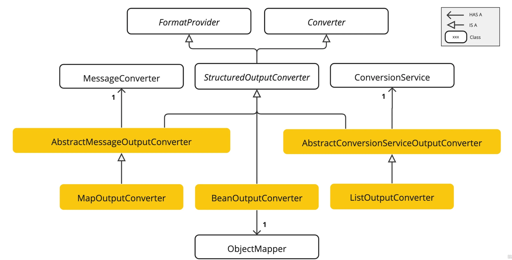

了解了API设计之后，进一步剖析一遍结构化输出的工作流程。

1）在调用大模型之前，`FormatProvider`为AI模型提供特定的格式命令，使其能够生成可以通过`Converter`转换成制定目标类型文本输出

转换器的格式命令组件会将类似于下面的格式指令附加到提示词中：

```markdown
Your response should be in JSON format.
The data structure for the JSON should match this Java class: java.util.HashMap
Do not include any explanations, only provide a RFC8259 compliant JSON response following this format without deviation.
```

通常，使用`PromptTemplate`将格式指令附加到用户输入的末尾，示例代码如下：

```java
StructuredOutputConverter outputConverter = ...
String userInputTemplate = """
        ... 用户文本输入 ....
        {format}
        """; // 用户输入，包含一个“format”占位符。
Prompt prompt = new Prompt(
        new PromptTemplate(
                this.userInputTemplate,
                Map.of(..., "format", outputConverter.getFormat()) // 用转换器的格式替换“format”占位符
        ).createMessage());
```

稍后会讲解`PromptTemplate`属性。

2）`Converter`负责将模型的输出文本转成指定类型的实例。

流程图如下：

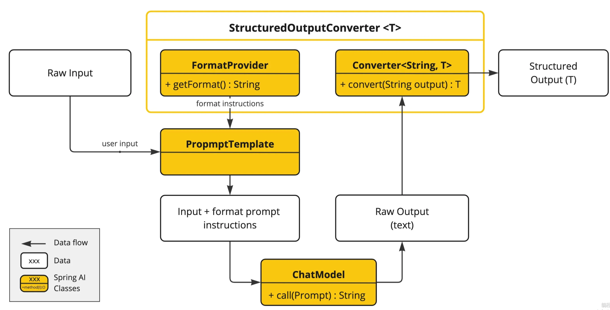

**使用实例**

官方文档提供了很多转换的实例。

1） `BeanOutputConverter`示例，将AI输出转成自定义的Java类：

```java
// 定义一个记录类
record ActorsFilms(String actor, List<String> movies) {}

// 使用高级 ChatClient API
ActorsFilms actorsFilms = ChatClient.create(chatModel).prompt()
        .user("Generate 5 movies for Tom Hanks.")
        .call()
        .entity(ActorsFilms.class);
```

还可用`ParameterizedTypeReference`构造函数来指定更复杂的目标类结构，比如自定义对象列表：

```java
// 可以转换为对象列表
List<ActorsFilms> actorsFilms = ChatClient.create(chatModel).prompt()
        .user("Generate the filmography of 5 movies for Tom Hanks and Bill Murray.")
        .call()
        .entity(new ParameterizedTypeReference<List<ActorsFilms>>() {});
```

2）MapOutputConverter示例，将模型输出转换成包含数字列表的Map：

```java
Map<String, Object> result = ChatClient.create(chatModel).prompt()
        .user(u -> u.text("Provide me a List of {subject}")
                    .param("subject", "an array of numbers from 1 to 9 under they key name 'numbers'"))
        .call()
        .entity(new ParameterizedTypeReference<Map<String, Object>>() {});
```

3）ListOutputConverter示例，将模型输出转成字符串列表;

```java
List<String> flavors = ChatClient.create(chatModel).prompt()
                .user(u -> u.text("List five {subject}")
                            .param("subject", "ice cream flavors"))
                .call()
                .entity(new ListOutputConverter(new DefaultConversionService()));
```

**支持AI模型**

根据[官方文档](https://docs.spring.io/spring-ai/reference/api/structured-output-converter.html#_supported_ai_models) ,以下的AI已经经过测试，支持List、Map、Bean结构化输出：

| AI 模型            | 示例测试代码                   |
| ------------------ | ------------------------------ |
| OpenAI             | OpenaiChatModelT               |
| Anthropic Claude 3 | AnthropicChatModellT.java      |
| Azure OpenAi       | AzureOpenAiChatModellT.java    |
| mistral AI         | MistralAiChatModellT.java      |
| Ollama             | OllamaChatModellT.java         |
| Vertex AI Gemini   | VertexAiGeminiChatModellT.java |

有一些模型自身提供了专门的**内置JSON格式**，用于生成结构化的JSON输出，无需关注细节，内置的JSON模式可以确保模型生成响应严格符合JSON格式，提高结构化输出的可能性。

**恋爱报告功能开发**

使用结构化输出，为用户生成恋爱报告，并转换成聊爱报告对象，包含报告标题和恋爱建议列表字段。

1）引入JSON Scheme生成依赖：

```xml
<dependency>
    <groupId>com.github.victools</groupId>
    <artifactId>jsonschema-generator</artifactId>
    <version>4.38.0</version>
</dependency>
```

2）在LoveApp中定义恋爱报告类，可使用java14提供的`record`快速定义

```java
record LoveReport(String title, List<String> suggestions){}
```

3）在LoveApp中编写一个新方法，复用之前构造好的ChatClient对象，只需额外补充原有的系统提示词、并且添加结构化输出代码即可。

```java
public LoveReport doChatWithReport(String message, String chatId) {
    LoveReport loveReport = chatClient
            .prompt()
            .system(SYSTEM_PROMPT + "每次对话后都要生成恋爱结果，标题为{用户名}的恋爱报告，内容为建议列表")
            .user(message)
            .advisors(spec -> spec.param(CHAT_MEMORY_CONVERSATION_ID_KEY, chatId)
                    .param(CHAT_MEMORY_RETRIEVE_SIZE_KEY, 10))
            .call()
            .entity(LoveReport.class);
    log.info("loveReport: {}", loveReport);
    return loveReport;
}
```

4）单元测试代码：

```java
@Test
void doChatWithReport() {
    String chatId = UUID.randomUUID().toString();
    // 第一轮
    String message = "你好，我是程序员鱼皮，我想让另一半（编程导航）更爱我，但我不知道该怎么做";
    LoveApp.LoveReport loveReport = loveApp.doChatWithReport(message, chatId);
    Assertions.assertNotNull(loveReport);
}
```

运行程序，通过debug查看效果。

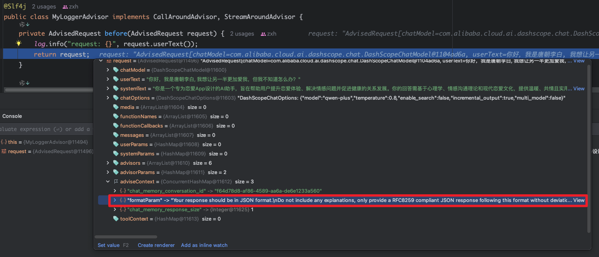

AI生成的内容如下，是JSON格式文本：

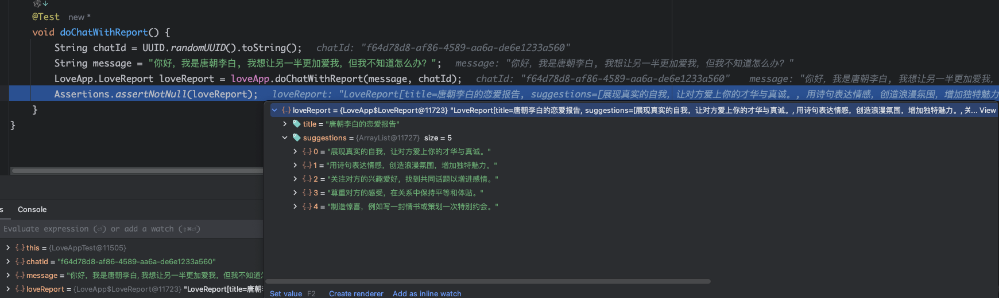

**最佳实践**

1. 尽量为模型提供清晰的格式指导
2. 实现输出验证机制和异常处理逻辑，确保结构化数据富恶化预期
3. 选择支持结构化输出的合适模型
4. 对于负责数据结构，考虑使用`ParameterizedTypeReference`

#### 对话记忆持久化

之前我们使用内存对话记忆来保存对话的上下文，但是如果服务器重启了，对话记忆就会消失。有时，我们可以希望将对话记忆持久化，保存到文件、数据库、Redis或者其他对象存储中。

##### 利用现有依赖实现

[官方提供](https://docs.spring.io/spring-ai/reference/api/chatclient.html#_chat_memory)了一些第三方数据库的整合支持，可以根据对话将对话保存到不同的数据源中。比如：

- InMemoryChatMemory：内存存储
- CassandraChatMemory：在Cassandra中带有过期时间的持久化存储
- Neo4jChatMemory：在Neo4J中没有过期时间限制的持久化存储
- JdbcChatMemory：在JDBC中没有过期时间限制的持久化存储

如果要用到数据库持久话，JDBCChatMemory可以使用。但是依赖很少，缺少相关的介绍，Maven仓库也搜不到，不推荐使用。

[Spring仓库](https://repo.spring.io/ui/packages/gav:%2F%2Forg.springframework.ai:spring-ai-starter-model-chat-memory-jdbc?name=spring-ai-starter-model-chat-memory-jdbc&type=packages)能搜到，但是用的人很少，由此可见，我们一般不会用

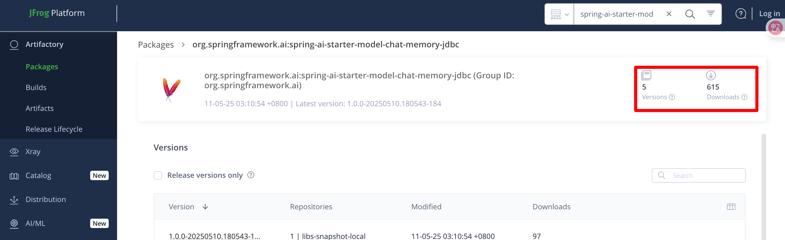

##### 自定义实现

SpringAI的对话记忆实现非常巧妙，解耦了“**存储**”和“**记忆算法**”，使得我们可以单独修改ChatMemory存储来改变对话记忆的保存位置，而无需修改保存对话记忆的流程。

虽然官方没有给我们提供自定义的ChatMemory实现的示例，我们可以直接去阅读实现类InMemoryChatmemory源码。

ChatMemory接口方法有add、get、clear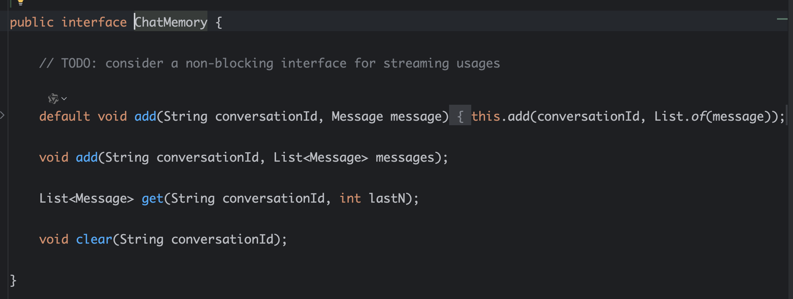

InMemoryChatMemory是利用ConcurrentHashMap实现的一个存储记忆结构，Key是唯一的对话ID，value是对话列表

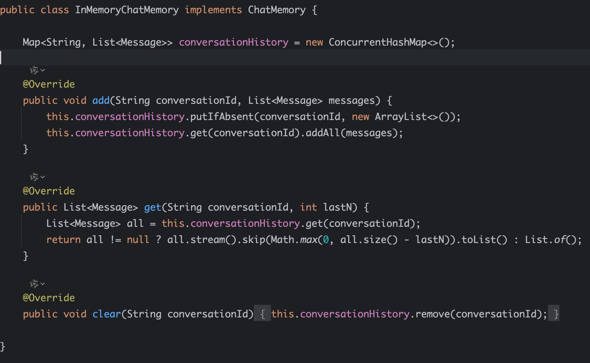

##### 自定义实现持久化ChatMemory

由于数据库持久化还需要引入额外的依赖，比较麻烦，由此实现一个基于文件读写的ChatMemory。

> 一个主要问题是**消息和文本的转换**，我们在保存消息时，要将消息从Message对象转成文件内的文本；读取消息时要将文本转成Message对象。

> 如果想要实现JSON序列化，难度很高。
>
> 1. 要持久化的Message是一个接口，很多子类实现（UserMessage、SystemMessage）
> 2. 每一种子类所拥有的字段不同，结构不统一
> 3. 子类未实现Serializable接口

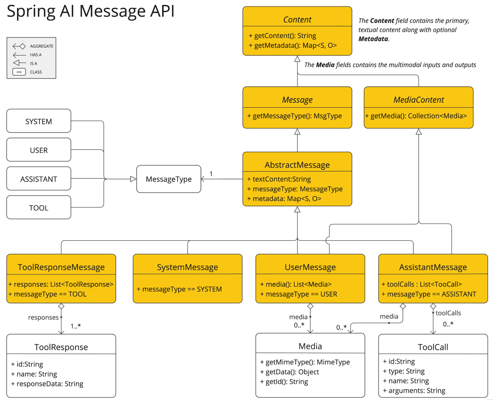

如果使用JSON会出现很多错误，所以使用：**Kryo序列化库**

1）引入依赖：

```xml
        <dependency>
            <groupId>com.esotericsoftware</groupId>
            <artifactId>kryo</artifactId>
            <version>5.6.2</version>
        </dependency>
```

2）创建一个`chatmemory`包，编写基于文件持久化的对话记忆`FileBasedChatMemory`，代码如下：

```java
public class FileBasedChatMemory implements ChatMemory {
    private final String BASE_DIR;

    private static final Kryo kryo = new Kryo();

    static {
        kryo.setRegistrationRequired(false);
        // 设置实例化策略
        kryo.setInstantiatorStrategy(new StdInstantiatorStrategy());
    }

    public FileBasedChatMemory(String dir) {
        this.BASE_DIR = dir;
        File baseDir = new File(dir);
        // 如果没有文件夹则创建
        if (!baseDir.exists()) {
            baseDir.mkdirs();
        }
    }

    @Override
    public void add(String conversationId, List<Message> messages) {
        List<Message> conversationMessages = getOrCreateConversation(conversationId);
        conversationMessages.addAll(messages);
        saveConversation(conversationId, conversationMessages);
    }

    private void saveConversation(String conversationId, List<Message> messages) {
        File file = getConversationFile(conversationId);
        try (Output output = new Output(new FileOutputStream(file))) {
            kryo.writeObject(output, messages);
        } catch (IOException e) {
            e.printStackTrace();
        }
    }

    @Override
    public List<Message> get(String conversationId, int lastN) {
        List<Message> allMessages = getOrCreateConversation(conversationId);
        return allMessages.stream().skip(Math.max(0, allMessages.size() - lastN))
                .toList();
    }

    @Override
    public void clear(String conversationId) {
        File file = getConversationFile(conversationId);
        if (file.exists()) {
            file.delete();
        }
    }

    private List<Message> getOrCreateConversation(String conversationId) {
        File file = getConversationFile(conversationId);
        ArrayList<Message> messages = new ArrayList<>();
        if (file.exists()) {
            try (Input input = new Input(new FileInputStream(file))) {
                messages = kryo.readObject(input, ArrayList.class);
            } catch (IOException e) {
                e.printStackTrace();
            }
        }
        return messages;
    }

    private File getConversationFile(String conversationId) {
        return new File(BASE_DIR, conversationId + ".kryo");
    }
}
```

3）修改`LoveApp`的一开始的`InMemoryChatMemory`，换成`FileBasedChatMemory`。

```java
String fileDir = System.getProperty("user.dir") + "/tmp/chat-memory";
        ChatMemory chatMemory = new FileBasedChatMemory(fileDir);
```

4）运行测试案例，结果如下：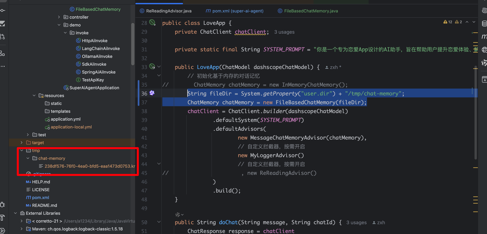

#### PromptTemplate模板

##### 什么是PromptTemplate？有什么用？

`PromptTemplate`是Spring AI 框架中用于构建和管理提示词的核心组件。允许开发者创建带有占位符的文本模板，然后在运行时动态替换这些占位符。

相当于AI交互中的“视图层”，类似于Spring MVC 中的试图模板（JSP）。通过使用PromptTemplate，可以更加结构化、可维护地管理AI应用中的提示词，使其更易于优化和扩展，降低硬编码带来的维护成本。

最基本的功能是支持变量替换，可以在模板中定义占位符，之后在运行时提供这些变量的值：

```java
// 定义一个带有变量的模板
String template = "你好，{name}。今天是：{day}，天气：{weather}";
// 创建模板对象
PromptTemplate promptTemplate = new PromptTempldate(template);

// 准备变量映射
Map<String, Object> variables = new HashMap<>();
variables.put("name", "李白");
variables.put("day", "周一");
variables.put("weather", "下雨");

// 生成最终的提示文本
String prompt = promptTempldate.render(variables);
```


**实现原理**

PromptTemplate底层使用了OSS StringTemplate引擎，这是一个强大的模板引擎，专注于文本生成。在Spring AI 中，PromptTemplate类实现了以下接口：

```java
public class PromptTemplate im⁡plements PromptTempl⁢ateActions, PromptTemplateMessageActions {
    // 实现细节
}
```


这些接口提供了不同类型的模板操作功能，既能生成普通文本，也能生成结构化消息。

**专用模板类**

1. `SystemPromptTempldate`：用于系统消息，设置AI的行为和背景
2. `AssistantPromptTempldate`：用于助手消息，用于设置AI回复结构
3. `FunctionPromptTempldate`：暂时无用

##### 从文件加载模板

PromptTemplate支持从外部文件加载模板内容，很适合管理复杂的提示词，Spring AI 利用Spring的Resource对象从指定路径加载模板文件：

```java
// 从类路径资源加载系统提示模板
@Value("classpath:/prompts/system-message.st")
private Resour⁡ce system⁢Resource;

// 直接使用资源创建模板
SystemPromptT⁡emplate systemProm⁢ptTemplate = new SystemPromptTemplate(systemResource);
```


这种方式可以：

- 将复杂的提示词放在单独的文件中管理
- 在不修改代码的情况下调整提示词
- 为不同场景准备多套提示词模板

更加推荐使用这种方式进行Prompt模板。

## RAG知识库

### RAG 概念

#### 什么是RAG？


RAG（Retrieve-Augmented Generation， 检索增强生成）是一种结合信息检索技术和AI内容生成的混合架构，可以解决大模型的知识时效性限制和幻觉问题。

RAG就像是给AI提供了一个小抄本，AI回答之前会先查一查这个小抄，确保问题是基于真实的资料而不是凭空想象。

通过RAG技术改造之后，AI可以：

- 准确回答相关的内容
- 在合适的时机推荐相关课程和服务
- 用特定的语气和用户交流
- 提供更新、更准确的建议

##### RAG工作流程

- 文档收集和切割
- 向量转换和存储
- 文档过滤和检索
- 查询增强和关联

###### 1、 文档收集和切割

文档收集：从各种来源收集原始文档

文档预处理：清洗、标准化文本格式

文档切割：将长文本分割成适当大小的片段（俗称chunks）

- 基于固定大小（如512个Token）
- 基于语句边界（如段落、章节）
- 基于递归分割策略（如递归字符n-gram切割）

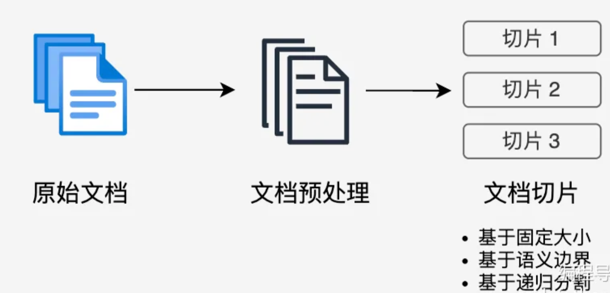

###### 2、向量转换和存储

向量转换：使用Embedding模型将文本块转换成高维向量表示，可以捕获到文本的语义特征

向量存储：将生成的向量和对应文本存入向量数据库中，支持高效的相似性搜索

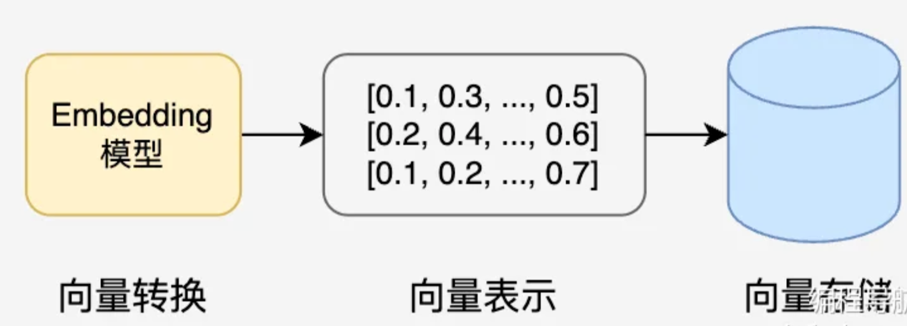

###### 3、文档过滤和检索

查询处理：将用户问题转换成向量表示

过滤机制：基于元数据、关键词或自定义规则进行过滤

相似度搜索：在向量数据库中查找与问题向量最相似的文档块，常用的相似度搜索算法有余弦相似度、欧氏距离等

上下文组装：将检索到的多个文档块组转成连贯的上下文

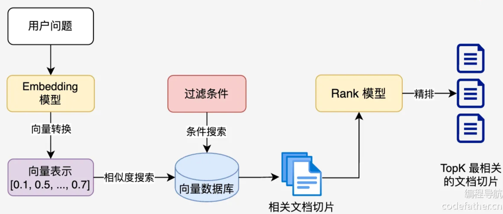

###### 4、查询增强和关联

提示词组装：将检索到的相关文档与用户问题组合成增强提示

上下文融合：大模型基于增强提示生成回答

源引用：回答信息中添加信息来源引用

后处理：格式化、摘要或其他处理优化最终输出


理解上述四个步骤之后，可以将它们组合起来，形成完整的RAG检索增强生成工具流程：

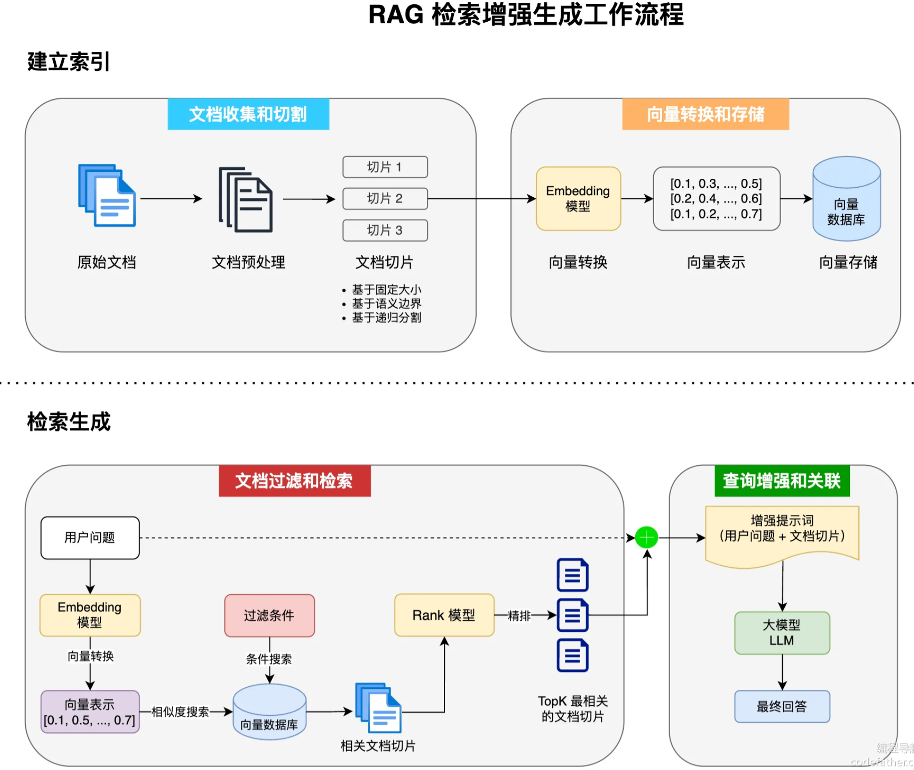

上述工作流程中涉及到了很多技术名词，下面进行分别解释。

##### RAG相关技术

###### Embedding和Embedding模型

Embedding嵌入是将高维离散数据转换成低纬连续向量的过程。这些向量能在数学空间中表示原始数据的语义特征，使得计算机能够理解数据间的相似性

Embedding模型是执行这种转换算法的机器学习模型，如Word2Vec（文本）、ResNet（图像）等。不同的Embedding模型产生的向量和纬度数不同，纬度越高表示表达能力越强，可以捕获到更加细致的语义信息，占用更多的内存。

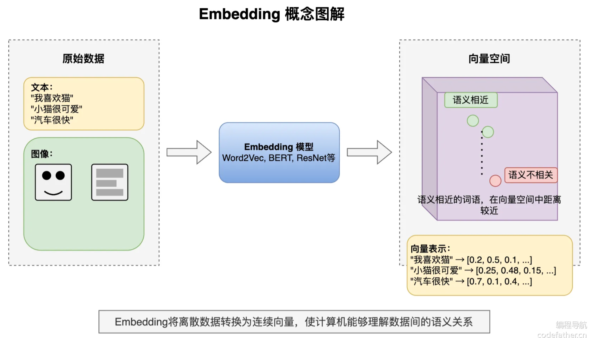

###### 向量数据库

向量数据库是专门存储和检索向量数据库的数据库系统。通过高效引用算法实现相似性搜索，支持K近邻查询等操作。

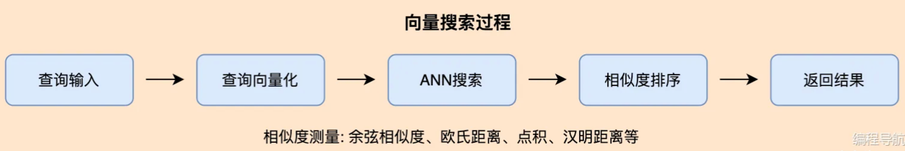

注意，并不是只有向量知识库才能存储向量数据，与传统的数据库不同的是，向量数据库优化了高维向量的存储和检索。

###### 召回

召回是信息检索的第一阶段，目标是从大规模数据集中快速筛选出可能相关的候选子集，强调速度和广度，并非精确度。

###### 精排和Rank模型

精排（精确排序）是搜索/推荐系统最后阶段，使用计算复杂度更高的算法，考虑更多特征和业务规则，对少量候选项进行更复杂、精细的排序。

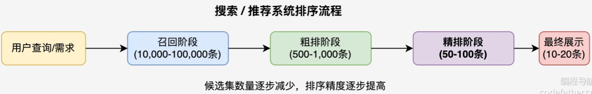

Rank模型（排序模型）负责对召回阶段筛选出的候选集进行精确排序，考虑多种特征评估相关性。

现代Rank模型通常基于深度学习，考虑查询和候选项的相关性、用户历史行为等因素。举个例子，电商推荐系统会根据商品特征、用户偏好、点击率等给每个商品打分并排序。

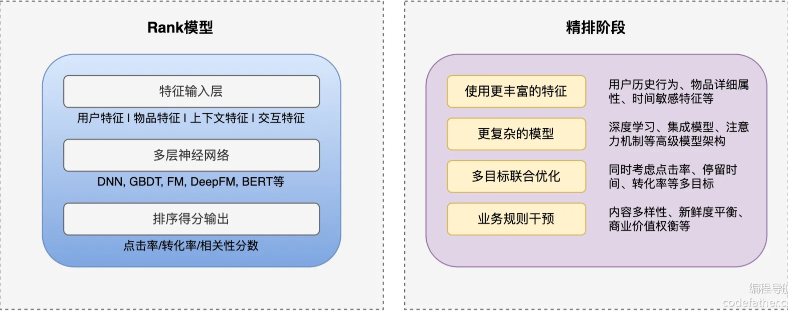

###### 混合检索策略

结合多种检索方法的优势，提高搜索效果，常见的组合包括关键词检索、语义检索、知识图库等。

比如在AI大模型开发平台Dify中，就为用户提供了“基于全文检索的关键词搜索 + 基于向量检索的语义检索”的混合检索策略，用户还可以自己设置不同的检索方式的权重。

#### RAG实战：Spring AI + 本地知识库

Spring AI 为我们实现了RAG 提供了全流程的支持，参考[Spring AI](https://docs.spring.io/spring-ai/reference/api/retrieval-augmented-generation.html)和[Spring AI Alibaba](https://java2ai.com/docs/1.0.0-M6.1/tutorials/rag/)的官方文档。

我们在学习中的标准RAG开发相较于真实业务有所简化，来实现基于本地知识库的AI 恋爱知识问答

##### 文档准备

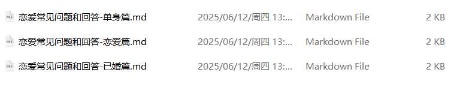

##### 文档读取

首先，要对已经准备好的知识库文档进行处理，之后保存到向量数据库中，这个过程就是ETL（抽取、转换、加载），Spring AI 提供了对ETL的支持，参考[官方文档](https://docs.spring.io/spring-ai/reference/api/etl-pipeline.html#_markdown)

ETL三大核心组件：按照顺序依次执行：

- `DocumentReader`：读取文档，得到文档列表
- `DocumentTransformer`：转换文档，得到处理后的文档列表
- `DocumentWriter`：将文档列表保存到存储中（可以是向量数据库，也可以是其他存储）

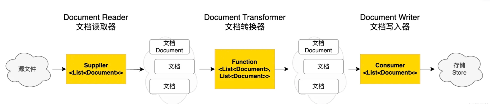

1）引入依赖

```xml
<!--        Spring AI markdown 文档读取-->
        <dependency>
            <groupId>org.springframework.ai</groupId>
            <artifactId>spring-ai-markdown-document-reader</artifactId>
            <version>1.0.0-M6</version>
        </dependency>
```

Spring AI 提供了很多DocumentReaders，用于加载不同类型的文件。

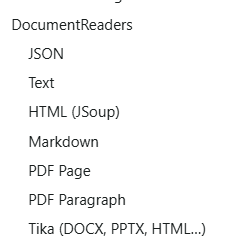

我们使用`MarkdownDocumentReader`来读取Markdown文档，需要先引入依赖，可以在maven中找到.

2）在根目录下新建`rag`包，编写文档加载器类`LoveAppDocumentLoader`负责读取所有Markdown文档并转成Document列表。

```java
@Component
@Slf4j
public class LoveAppDocumentLoader {
    private final ResourcePatternResolver resourcePatternResolver;

    public LoveAppDocumentLoader(ResourcePatternResolver resourcePatternResolver) {
        this.resourcePatternResolver = resourcePatternResolver;
    }

    /**
     * 加载Markdown文件
     */
    public List<Document> loadMarkdowns() {
        List<Document> allDocuments = new ArrayList<>();
        try {
            Resource[] resources = resourcePatternResolver.getResources("classpath:document/*.md");
            for (Resource resource : resources) {
                String filename = resource.getFilename();
                MarkdownDocumentReaderConfig config = MarkdownDocumentReaderConfig.builder().withHorizontalRuleCreateDocument(true)
                        .withIncludeCodeBlock(false)
                        .withIncludeBlockquote(false)
                        .withAdditionalMetadata("filename", filename)
                        .build();
                MarkdownDocumentReader reader = new MarkdownDocumentReader(resource, config);
                allDocuments.addAll(reader.get());
            }

        } catch(IOException e) {
            log.error("加载Markdown文件失败", e);
        }
        return allDocuments;
    }
}
```

上述代码中，我们通过MarkdownDocumentReaderConfig文档加载配置来指定读取文档的细节，比如是否读取代码块、引用快等。我们还指定了额外的元信息配置，提取文档的文件名（fileName）作为文档的元信息，可以便于后续知识库实现更精确的检索。

##### 向量转换和存储

为了方便，使用基于内存读写的向量数据库`SimpleVectorStore`来保存文档。

`SimpleVectorStore`实现了`Vector`接口，而`Vector`接口集成了`DocumentWriter`，所以具备文档写入功能。

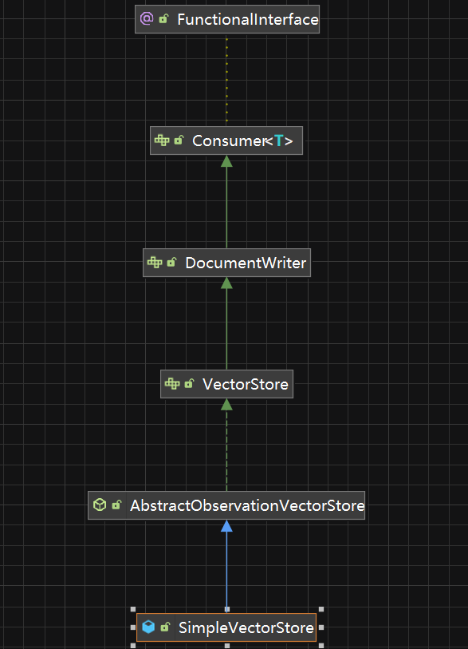

简单了解一下源码，在将文档写入到数据库之前，会先调用`Embeding`将文档转成向量，实际存储到数据库的是向量类型的数据。

在`rag`包新建`LoveAppVectorStoreConfig`类，实现初始化向量数据库并且保存文档的方法。代码：

```java
@Configuration
public class LoveAppVectorStoreConfig {
    @Resource
    private LoveAppDocumentLoader loveAppDocumentLoader;

    @Bean
    VectorStore loveAppVectorStore(EmbeddingModel dashscopeEmbeddingModel) {
        SimpleVectorStore simpleVectorStore = SimpleVectorStore.builder(dashscopeEmbeddingModel).build();
        // 加载文档
        List<Document> documents = loveAppDocumentLoader.loadMarkdowns();
        simpleVectorStore.add(documents);
        return simpleVectorStore;
    }
}
```

##### 查询增强

通过`Advisor`特性提供了开箱即用的RAG功能。主要是`QuestionAnswerAdvisor`问答拦截器和`RetrivalAugmentationAdvisor`检索增强拦截器，前者更加简单易用、后者更加强大。

查询增强的原理很简单，向量数据库存储着AI模型本身不知道的数据，当用户向AI发送提问时，QuestionAnswerAdvisor会查询向量数据库，获取与用户问题相关的文档。然后从向量数据库返回的响应会被附加到用户文本中，为AI模型提供上下文，帮助生成回答。

根据官方文档，需要先引入依赖：

```xml
        <dependency>
            <groupId>org.springframework.ai</groupId>
            <artifactId>spring-ai-advisors-vector-store</artifactId>
            <version>1.0.0</version>
        </dependency>
```

我们选择`QuestionAnswerAdvisor`问答拦截器，在`LoveApp`中新增和RAG知识库进行对话的方法。

```java
@Resource
    private VectorStore loveAppVectorStore;
    public String doChatWithRAG(String message, String chatId) {
        ChatResponse chatResponse = chatClient.prompt()
                .user(message)
                .advisors(spec -> spec.param(CHAT_MEMORY_CONVERSATION_ID_KEY, chatId)
                        .param(CHAT_MEMORY_RETRIEVE_SIZE_KEY, 10))
                .advisors(new MyLoggerAdvisor())
                .advisors(new QuestionAnswerAdvisor(loveAppVectorStore))
                .call()
                .chatResponse();

        String content = chatResponse.getResult().getOutput().getText();
        log.info("content: {}", content);
        return content;
    }
```

##### 测试

生成单元测试代码：

```java
    @Test
    void doChatWithRAG() {
        String chatId = UUID.randomUUID().toString();
        String message = "我已经结婚了，但是婚后关系不太稳定，怎么做？";
        String answer = loveApp.doChatWithRAG(message, chatId);
        Assertions.assertNotNull(answer);
    }
```

运行程序，通过debug发现，加载的文档被自动按照小标题划分，并且补充了metadata元信息：

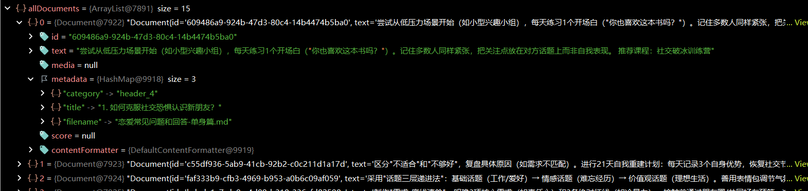

放行，查看请求，发现检索用户问题得到了4个文档切片，每个切片都有对应的分数和元信息。

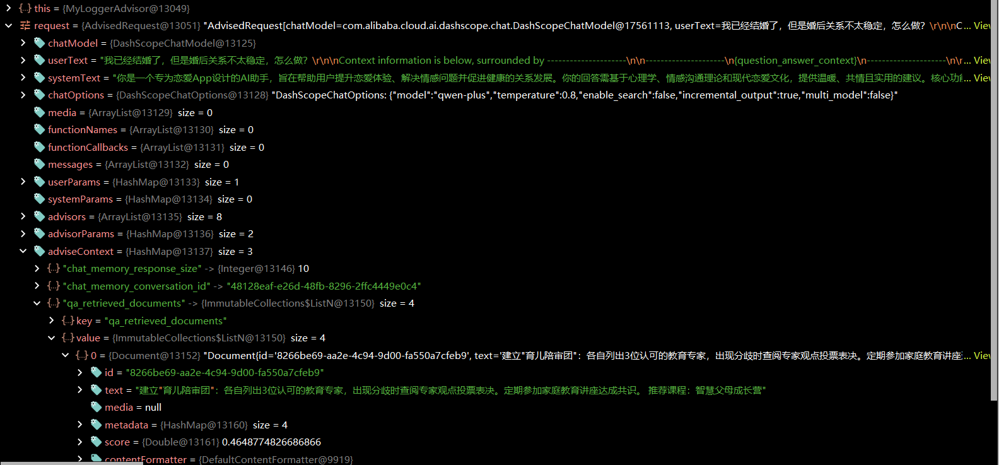

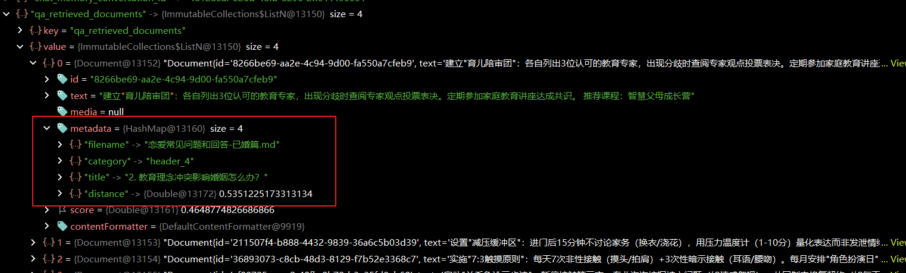

查看请求，发现用户提示词被修改了，

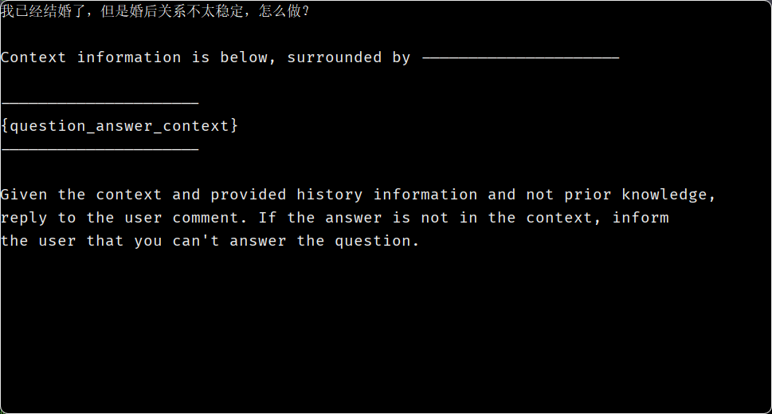

放行，查看响应结果，AI的回复成功包含了知识库的内容

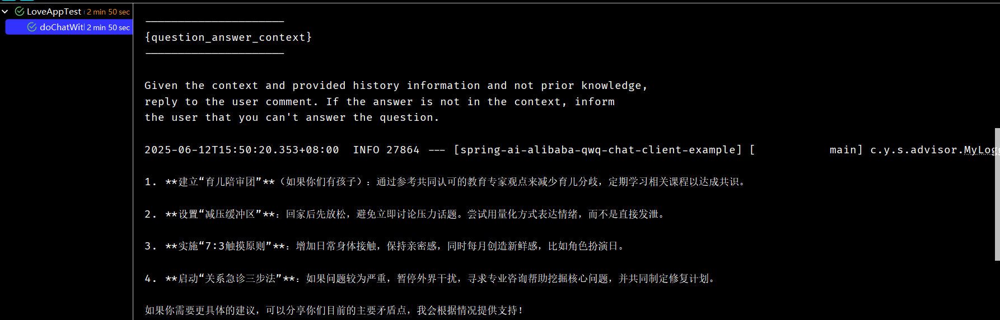


## RAG芝士进阶

### RAG核心特性

#### 文档收集和切割 - ETL

文档收集和切割阶段，我们要对自己准备的知识库知识文档进行处理，然后保存到向量数据库中。这个过程叫做ETL（抽取、转换、加载），Spring AI 提供了对ETL的支持，参考：[官方文档](https://docs.spring.io/spring-ai/reference/api/etl-pipeline.html)。

##### 文档

什么是Spring AI的文档？文档不仅仅是包含文本，还可以包含一系列元信息和多媒体附件：

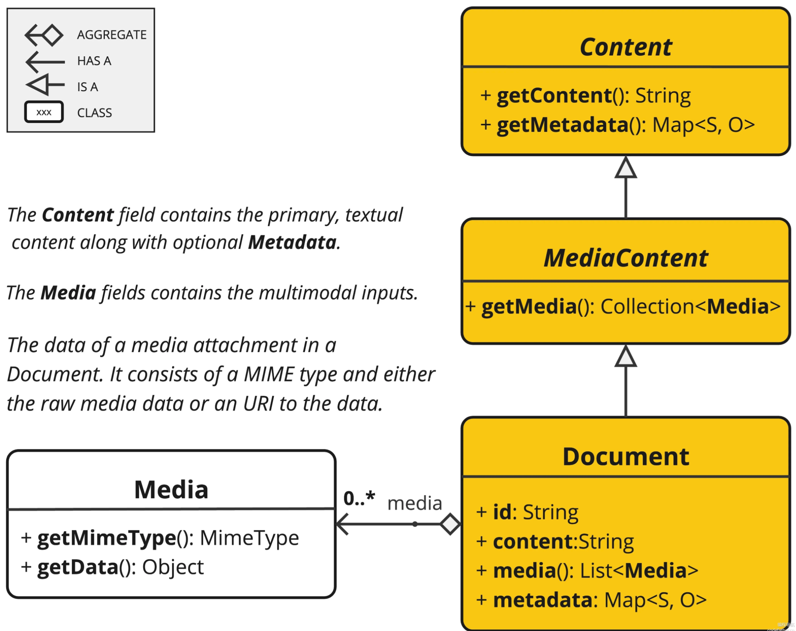

##### ETL

在Spring AI中，对Document的处理通常遵循以下流程：

1. 读取文档：使用`DocumentReader`组件从数据源（如本地文件、网络资源、数据库等）加载文档。
2. 转换文档：根据需求将文档转换成适合后续处理的格式，比如去除冗余信息、分词、词性标注等，可以使用DocumentTransform组件实现。
3. 写入文档：使用DocumentWriter将文档以特定格式保存到存储中，比如存储到向量数据库中，或者以键值对形式保存到KV存储结构中。

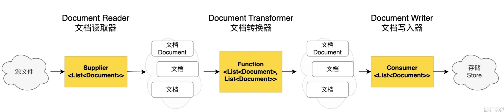

我们利用Spring AI实现ETL，核心就是学习DocumentReader、DocumentTransformer、DocumentWriter三大组件。

##### 抽取（Extract）

Spring AI通过DocumentReader组件实现了文档抽取，也就是将文档加载到内存中。

DocumentReader实现了`Supplier<List<Document>>`接口，主要负责从各种数据源读取数据并转换为Document对象集合。

```java
	public interface DocumentReader extends Supplier<List<Document>> {

	default List<Document> read() {
		return get();
	}

}
```

实际开发中，我们可以直接使用Spring AI 内置的多种[DocumentReader 实现类](https://docs.spring.io/spring-ai/reference/api/etl-pipeline.html#_documentreaders)，处理不同类型的数据源。

以JsonReader为例，支持JSON Pointer特征，能够快速指定从JSON文档中提取那一些字段和内容：

```java
// 从 classpath 下的 JSON 文件中读取文档
 @Component
 class MyJsonReader {
     private final Resource resource;

     MyJsonReader(@Value("classpath:products.json") Resource resource) {
         this.resource = resource;
     }

     // 基本用法
     List<Document> loadBasicJsonDocuments() {
         JsonReader jsonReader = new JsonReader(this.resource);
         return jsonReader.get();
     }

     // 指定使用哪些 JSON 字段作为文档内容
     List<Document> loadJsonWithSpecificFields() {
         JsonReader jsonReader = new JsonReader(this.resource, "description", "features");
         return jsonReader.get();
     }

     // 使用 JSON 指针精确提取文档内容
     List<Document> loadJsonWithPointer() {
         JsonReader jsonReader = new JsonReader(this.resource);
         return jsonReader.get("/items"); // 提取 items 数组内的内容
     }
 }

```


此外，Spring AI Alibaba官方社区提供了[更多的文档读取器](https://java2ai.com/docs/1.0.0-M6.1/integrations/documentreader/)，比如加载飞书文档、提取B站视频信息和字幕、加载邮件、加载Github官方文档、加载数据库等。

##### 转换

Spring AI 通过 DocumentTransform组件实现文档转换。


看下源码，DocumentTransform接口实现了`Function<List<Document>, List<Document>>`接口，负责将一组Document转成另一组Document。

```java
public interface DocumentTransformer extends Function<List<Document>, List<Document>> {

	default List<Document> transform(List<Document> transform) {
		return apply(transform);
	}

}
```

文档转换是保证RAG效果的核心步骤，就是如何将大文档合理拆分成便于检索的知识碎片，Spring AI 提供了多种DocumentTransform实现类，可以简单划分成3类：

###### 1）TextSplitter文本分割器

`TextSplitter`是文本分割器的基类，提供了分割单词的流程方法：

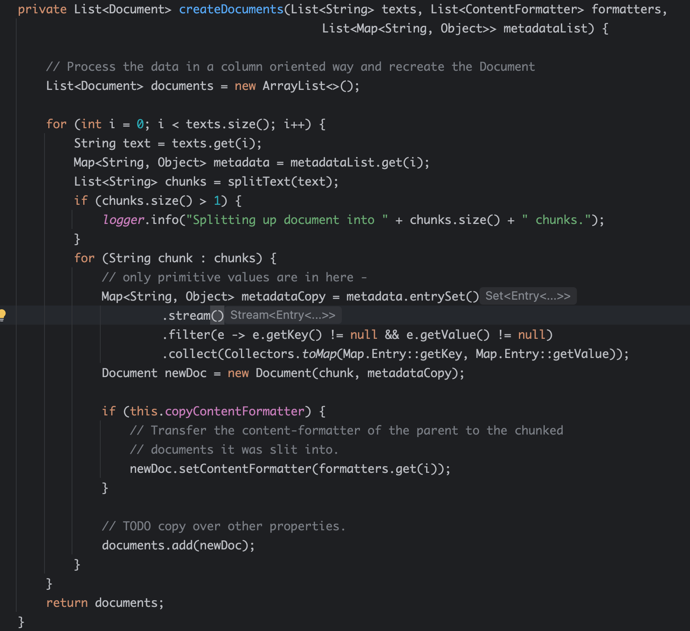

TokenTextSplitter是其实现类，基于Token的文本分割器。考虑了语义边界（语句结尾）来创建有意义的文本段落，是成本较低的文本切割方式。

```java
@Component
class MyTokenTextSplitter {

    public List<Document> splitDocuments(List<Document> documents) {
        TokenTextSplitter splitter = new TokenTextSplitter();
        return splitter.apply(documents);
    }

    public List<Document> splitCustomized(List<Document> documents) {
        TokenTextSplitter splitter = new TokenTextSplitter(1000, 400, 10, 5000, true);
        return splitter.apply(documents);
    }
}

```

TokenTextSplliter提供了两种构造函数：

1. `TokenTextSplitter()`：使用默认设置创建分割器。
2. `TokenTextSplitter(int defaultChunkSize, int minChunkSizeChars, int minChunkLengthToEnbed, int maxNumChunks, boolean keepSeparator)`：使用自定义参数创建分割器，通过调整参数，可以控制分割的粒度和方法，适应不同的应用场景。

官方文档中对Token分词器工作原理的详细解释，可以简单了解一下：

1. 使用CL 100K_BASE编码将输入文本编码为Token
2. 根据defaultChunkSize将编码后的文本分割成块
3. 对于每个块：

- 将块解码回文本
- 尝试在minChunkSizeChars之后找到合适的断点（句号、问号、感叹号或换行符）
- 如果找到断点，在该点截断块
- 修剪块并根据keepSeparator设置选择性地删除换行符
- 如果生成的块长度大于minChunkLenthToEmbed，将其添加到输出中

4. 会一直持续到所有Token都被处理完或达到maxNumChunks为止。
4. 剩余文本长度大于minChunkLengthToEmbed，作为最后一个块添加

###### 2）MetaDataEnricher元数据增强器

元数据增强器是为文档补充更多元信息，便于后续检索，不是为了改变文档本身的切分规则。

- KeywordMetadataEnricher：使用AI提取关键词并添加到元数据
- SummaryMetadataEnricher：使用AI生成文档摘要并添加到元数据。不仅可以为当前文档生成摘要，还能关联前一个和后一个相邻的文档，摘要更加完整。

实例代码：

```java
@Component
class MyDocumentEnricher {

    private final ChatModel chatModel;

    MyDocumentEnricher(ChatModel chatModel) {
        this.chatModel = chatModel;
    }
      
      // 关键词元信息增强器
    List<Document> enrichDocumentsByKeyword(List<Document> documents) {
        KeywordMetadataEnricher enricher = new KeywordMetadataEnricher(this.chatModel, 5);
        return enricher.apply(documents);
    }
  
    // 摘要元信息增强器
    List<Document> enrichDocumentsBySummary(List<Document> documents) {
        SummaryMetadataEnricher enricher = new SummaryMetadataEnricher(chatModel, 
            List.of(SummaryType.PREVIOUS, SummaryType.CURRENT, SummaryType.NEXT));
        return enricher.apply(documents);
    }
}

```


###### 3）ContentFormatter内容格式化工具

用于统一文档内容格式。官方对这个介绍很少。

直接去看源码：`DefaultContentFormatter`

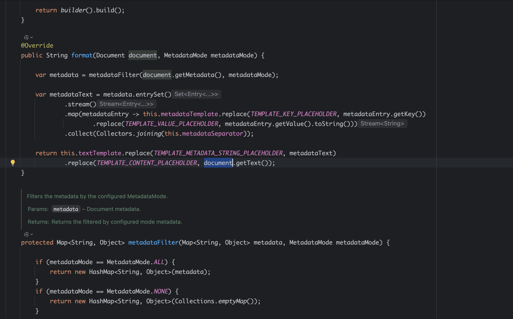

主要提供了三种功能：

1. 文档格式化：将文档内容与元数据合并成特定格式的字符串，便于后续处理
2. 元数据过滤：根据不同的元数据模式（MetadataMode）筛选需要保留的元数据项
   1. `ALL`：保留所有元数据
   2. `NONE`：移除所有元数据
   3. `INFRENCE`：推理场景，排除指定的推理元数据
   4. `ENBED`：用于嵌入场景，排除指定的嵌入元数据
3. 自定义模板：支持自定义以下格式：
   1. 元数据模板
   2. 元数据分隔符
   3. 文本模板

```java
        // Builder创建实例
        DefaultContentFormatter formatter = DefaultContentFormatter.builder()
                .withMetadataSeparator("\n")
                .withMetadataTemplate("{key}：{value}")
                .withTextTemplate("{metadata_string}\n\n{content}")
                .withExcludedInferenceMetadataKeys("embedding", "vector_id")
                .withExcludedEmbedMetadataKeys("source_url", "timestamp")
                .build();

        // 使用格式化器处理文档
        formatter.format(document, MetadataMode.INFERENCE);
```


###### 加载（Load）

Spring AI 通过DocumentWriter组件实现文档加载

`DocumentWriter`接口实现了`Consumer<List<Document>>`接口，负责将处理之后的文档写入目标存储中：

```java
public interface DocumentWriter extends Consumer<List<Document>> {
    default void write(List<Document> documents) {
        accept(documents);
    }
}
```

Spring AI 提供了两种内置的Writer实现类：

1）`FileDocumentWriter`：将文档写入到文件系统

```java
@Component
class MyDocumentWriter {
    public void writeDocuments(List<Document> documents) {
        FileDocumentWriter writer = new FileDocumentWriter("output.txt", true, MetadataMode.ALL, false);
        writer.accept(documents);
    }
}
```

2）`VectorStoreWriter`：将文档写入到向量数据库中

```java
@Component
class MyVectorStoreWriter {
    private final VectorStore vectorStore;
    
    MyVectorStoreWriter(VectorStore vectorStore) {
        this.vectorStore = vectorStore;
    }
    
    public void storeDocuments(List<Document> documents) {
        vectorStore.accept(documents);
    }
}
```

当然，也可以同时将文档写入多个存储，只需要创建多个Writer或者自定义Writer即可

###### ETL流程示例

将上述的三大组件组合起来，可以实现完整的ETL流程：

```java
// 抽取：从 PDF 文件读取文档
PDFReader pdfReader = new PagePdfDocumentReader("knowledge_base.pdf");
List<Document> documents = pdfReader.read();

// 转换：分割文本并添加摘要
TokenTextSplitter splitter = new TokenTextSplitter(500, 50);
List<Document> splitDocuments = splitter.apply(documents);

SummaryMetadataEnricher enricher = new SummaryMetadataEnricher(chatModel, 
    List.of(SummaryType.CURRENT));
List<Document> enrichedDocuments = enricher.apply(splitDocuments);

// 加载：写入向量数据库
vectorStore.write(enrichedDocuments);

// 或者使用链式调用
vectorStore.write(enricher.apply(splitter.apply(pdfReader.read())));

```

通过这种方式，可以完成从原始文档到向量数据库的整个ETL 过程，为后续的检索增强生成了提供的基础。

#### 向量转换和存储

向量存储是RAG应用中的核心组件，它将文档转换成向量（嵌入）并存储起来，以便于后续进行高效的相似性搜索。Spring AI 官方提供了向量数据库接口`VectorStore`和向量存储整合包，帮助开发者快速集成各种第三方向量存储，比如Milvus、Redis、PGVector、ES等。

##### VectorStore接口介绍

VectorStore是Spring AI 中用于与向量数据库交互的核心接口，它继承自DocumentWriter，主要提供以下功能：

```java
public interface VectorStore extends DocumentWriter {

    default String getName() {
        return this.getClass().getSimpleName();
    }

    void add(List<Document> documents);

    void delete(List<String> idList);

    void delete(Filter.Expression filterExpression);

    default void delete(String filterExpression) { ... };

    List<Document> similaritySearch(String query);

    List<Document> similaritySearch(SearchRequest request);

    default <T> Optional<T> getNativeClient() {
        return Optional.empty();
    }
}
```

这个接口定义了向量存储的基本操作，简单来说就是“增删改查”

- 添加文档到向量数据库
- 从向量数据库删除文档
- 基于查询进行相似度计算
- 获取原生客户端（用于特定实现的高级操作）

##### 搜索请求构建

Spring AI 提供了searchRequest类，用于构建相似度搜索请求：

```java
SearchRequest request = SearchRequest.builder()
					.query("什么是朝花夕拾")
  .topK(5)
  .similarityThreshold(0.7)
  .filterExpression("catgory == 'web' AND date > '2025-05-13'")
  .build();

List<Document> results = vectorStore.similaritySearch(request);
```


有点类似于java的mybatis和mybatis-plus。SearchRequest提供了多种查询配置：

- query：搜索的查询文本
- topK：返回的最大结果数，默认是4
- similarityThreshold：相似度阈值，低于此值的结果会被过滤掉
- filterExpression：基于文档元数据的过滤表达式，语法有点类似于SQL语句，需要用到时查询[官方文档](https://docs.spring.io/spring-ai/reference/api/vectordbs.html#metadata-filters)

##### 向量存储的工作原理

在向量数据库中，查询与传统的关系型数据库有所不同。向量数据库执行的是相似性搜索，而非精确匹配，具体流程上一节说过。

1. 嵌入转换：当文档被添加到向量存储中，Spring AI 会使用嵌入模型（如OpenAI 的text-enbedding-ada-002）将文本转换成向量
2. 相似度计算：查询时，查询文本同样被转成向量，然后系统计算此向量与存储中所有向量的相似度
3. 相似度度量：常用的相似度计算方法包括：
   1. 余弦相似度：计算两个向量的夹角余弦值，范围在1到-1之间
   2. 欧氏距离：计算两个向量的直线距离
   3. 点积：两个向量的点积值
4. 过滤与排序：根据相似度过滤结果，按照相似度返回最相关的文档

阿里云百炼平台已经集成了，类是：`DashScopeCloudStore`,参考文档：[DashScopeCloudStore](https://java2ai.com/docs/1.0.0-M6.1/tutorials/vectorstore/)

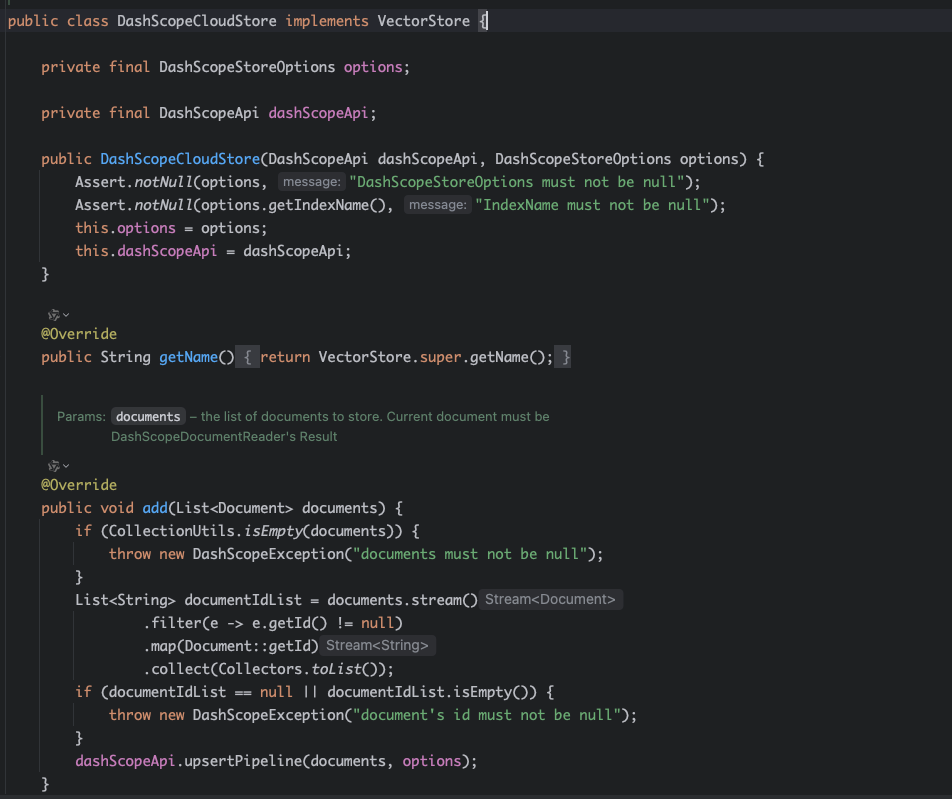

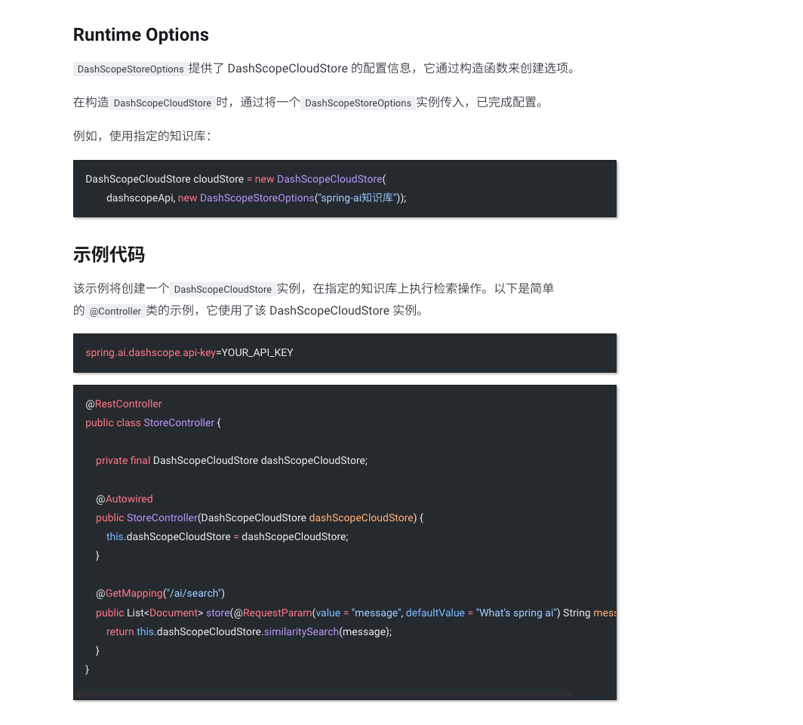

DashScopeCloudStore类实现了VectorStore接口，通过调用DashScope API 来使用阿里云提供的远程向量存储：

##### 基于PGVector实现向量存储

PGVector是经典数据库PGSQL的扩展，为PGSQL提供了存储和检索高维向量数据库的能力。

为什么选这个来做向量数据库呢？因为很多传统业务都会将数据存储在这种关系型数据库中，直接给原有数据库安装扩展插件就能实现向量相似性搜索，不需要额外搞一套向量数据库，人力物力成本很低，所以这种方案很受企业青睐，也是目前实现RAG的主流方案之一。

1. 安装PGSQL
2. 安装pgVector

为了简化学习成本，我们采用简单的方式-阿里云购买PGSQL。

打开[阿里云PGSQL官网](https://www.aliyun.com/product/rds/postgresql)，开通Serverless版本，按用量付费，对于学习来说性价比很高。

1）参考[Spring AI 文档中](https://docs.spring.io/spring-ai/reference/api/vectordbs/pgvector.html)的整合的PGVector，先引入依赖，版本号可以在Maven仓库中找到。

编写配置，建立数据库连接：

```yaml
spring:
  datasource:
    url: jdbc:postgresql://改为你的公网地址/yu_ai_agent
    username: 改为你的用户名
    password: 改为你的密码
  ai:
    vectorstore:
      pgvector:
        index-type: HNSW
        dimensions: 1536
        distance-type: COSINE_DISTANCE
        max-document-batch-size: 10000 # Optional: Maximum number of documents per batch
```

> 在不确定向量维度的条件下不要指定dimensions。未明确指定的话，PgVectorStore会从提供的EmbeddingModel中检索维度，维度在表创建时设置成嵌入列。如果更改维度，必须重新创建vector_store表。

使用自动注入的VectorStore，系统会自动创建库表：

```java
@SpringBootTest
public class PgVectorVectorStoreConfigTest {

    @Resource
    VectorStore pgVectorVectorStore;

    @Test
    void test() {
        List<Document> documents = List.of(
                new Document("Spring AI rocks!! Spring AI rocks!! Spring AI rocks!! Spring AI rocks!! Spring AI rocks!!", Map.of("meta1", "meta1")),
                new Document("The World is Big and Salvation Lurks Around the Corner"),
                new Document("You walk forward facing the past and you turn back toward the future.", Map.of("meta2", "meta2")));
        // 添加文档
        pgVectorVectorStore.add(documents);
        // 相似度查询
        List<Document> results = pgVectorVectorStore.similaritySearch(SearchRequest.builder().query("Spring").topK(5).build());
        Assertions.assertNotNull(results);
    }
}
```

但是这种方式并不适合我们的项目，本质是因为VectorStore依赖EmbeddingModel对象，之前同时引入了Ollama和阿里云DashScope依赖，有两个EmbeddingModel的Bean，Spring不知道使用哪一个？就会报错。

2）我们更换另一种更适合的方式来初始化VectorStore，先引入依赖

```xml
<dependency>
    <groupId>org.springframework.boot</groupId>
    <artifactId>spring-boot-starter-jdbc</artifactId>
</dependency>
<dependency>
    <groupId>org.postgresql</groupId>
    <artifactId>postgresql</artifactId>
    <scope>runtime</scope>
</dependency>
<dependency>
    <groupId>org.springframework.ai</groupId>
    <artifactId>spring-ai-pgvector-store</artifactId>
    <version>1.0.0-M6</version>
</dependency>
```


编写自己构造的VectorStore，不用Starter自动注入。

```java
@Configuration
public class PgVectorVectorStoreConfig {

    @Bean
    public VectorStore pgVectorVectorStore(JdbcTemplate jdbcTemplate, EmbeddingModel dashscopeEmbeddingModel) {
        VectorStore vectorStore = PgVectorStore.builder(jdbcTemplate, dashscopeEmbeddingModel)
                .dimensions(1536)                    // Optional: defaults to model dimensions or 1536
                .distanceType(COSINE_DISTANCE)       // Optional: defaults to COSINE_DISTANCE
                .indexType(HNSW)                     // Optional: defaults to HNSW
                .initializeSchema(true)              // Optional: defaults to false
                .schemaName("public")                // Optional: defaults to "public"
                .vectorTableName("vector_store")     // Optional: defaults to "vector_store"
                .maxDocumentBatchSize(10000)         // Optional: defaults to 10000
                .build();
        return vectorStore;
    }
}
```


启动类需要手动排除掉自动加载，

```java
@SpringBootApplication(exclude = PgVectorStoreAutoConfiguration.class)
```

3）编写单元测试类

```java
@SpringBootTest
public class PgVectorVectorStoreConfigTest {

    @Resource
    VectorStore pgVectorVectorStore;

    @Test
    void test() {
        List<Document> documents = List.of(
                new Document("Spring AI rocks!! Spring AI rocks!! Spring AI rocks!! Spring AI rocks!! Spring AI rocks!!", Map.of("meta1", "meta1")),
                new Document("The World is Big and Salvation Lurks Around the Corner"),
                new Document("You walk forward facing the past and you turn back toward the future.", Map.of("meta2", "meta2")));
        // 添加文档
        pgVectorVectorStore.add(documents);
        // 相似度查询
        List<Document> results = pgVectorVectorStore.similaritySearch(SearchRequest.builder().query("Spring").topK(5).build());
        Assertions.assertNotNull(results);
    }
}
```

Debug模式启动，看到文档检索成功，得到了相关的相似度分数：

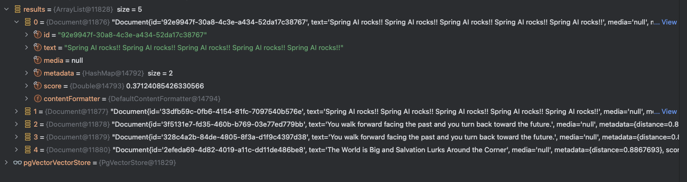

同时查看数据库中的数据，发现存在三条数据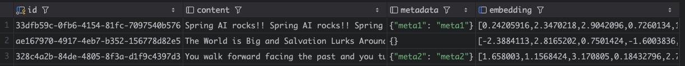

查看一下表结构：

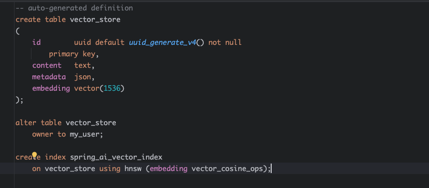

至此，我们的PGVectorStore就整合成功了，你可以用LoveAppDocumentLoader来替换文本来源：

```java
@Configuration
public class PgVectorVectorStoreConfig {

    @Resource
    private LoveAppDocumentLoader loveAppDocumentLoader;

    @Bean
    public VectorStore pgVectorVectorStore(JdbcTemplate jdbcTemplate, EmbeddingModel dashscopeEmbeddingModel) {
        VectorStore vectorStore = PgVectorStore.builder(jdbcTemplate, dashscopeEmbeddingModel)
                .dimensions(1536)
                .distanceType(COSINE_DISTANCE)
                .indexType(HNSW)
                .initializeSchema(true)
                .schemaName("public")
                .vectorTableName("vector_store")
                .maxDocumentBatchSize(10000)
                .build();

        // 加载文档
        List<Document> documents = loveAppDocumentLoader.loadMarkdowns();
        vectorStore.add(documents);
        return vectorStore;
    }
}
```


测试一下：（关键词是“结婚”）

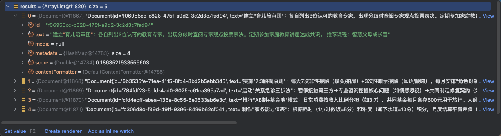


###### 扩展--批处理策略

使用向量存储的时候，可能要嵌入大量文档，如果一次性处理大量文档，可能会导致性能问题。

嵌入模型一般有一个最大标记限制，通常称为上下文窗口大小，限制了单个嵌入请求中课可以处理的文本量。如果在一次调用中转换过多文档可能直接导致报错。

为此，Spring AI 实现了批处理策略（Batching Strategy）,将大量的文档分解成较小的批次，使其适合嵌入模型最大上下文窗口，还可以提高性能有效利用API速率限制。

```java
public interface BatchingStrategy {
    List<List<Document>> batch(List<Document> documents);
}
```

Spring AI 提供了一个名为TokenCountBatchingStrategy的默认实现。这个策略为每一个文档估算Token数量，将文档分组到不超过最大输入Token数的批次中，如果单个文件超过此限制，抛出异常，这样就确保了每一个批次不超过计算出的最大输入Token数。

```java
@Configuration
public class EmbeddingConfig {
    @Bean
    public BatchingStrategy customTokenCountBatchingStrategy() {
        return new TokenCountBatchingStrategy(
            EncodingType.CL100K_BASE,  // 指定编码类型
            8000,                      // 设置最大输入标记计数
            0.1                        // 设置保留百分比
        );
    }
}
```

除了使用默认的之外，也可以自己实现batchingStrategy：

```java
@Configuration
public class EmbeddingConfig {
    @Bean
    public BatchingStrategy customBatchingStrategy() {
        return new CustomBatchingStrategy();
    }
}
```


如果你使用的向量数据库每秒只能插入1万条数据，就可以通过自定义BatchingStrategy控制速率，还可以进行额外的日志记录和异常处理。

#### 文档过滤和检索


Spring AI提供了“模块化”的RAG架构，用于优化大模型回复的准确性

简单来说，就是将文档过滤过程分成：检索前、检索时、检索后。

- 预检索：系统接收用户的原始查询，通过查询转化和查询扩展对其进行优化。
- 检索阶段：使用增强的查询从知识库中搜索相关的文档，可能涉及到多个检索源合并，最终输出一组相关文档
- 检索后：系统对检索到的文档进行进一步处理，包括排序、选择最相关的子集以及压缩文档内容，输出经过优化的文档集

##### 预检索：优化用户查询

###### 查询转换 - 查询重写

`RewriteQueryTransformer`使用大语言模型对用户的原始查询进行改写，使得更加详细和清晰。

```java
Query query = new Query("什么是Transformer啊啊啊啊啊啊啊");
QueryTransformer queryTransformer = RewriteQueryTransformer.builder()
  .chatClientBuilder(chatClientBuilder)
  .build();

Query transformedQuery = queryTransformer.transform(query);
```

可以从源码中看到提示词：

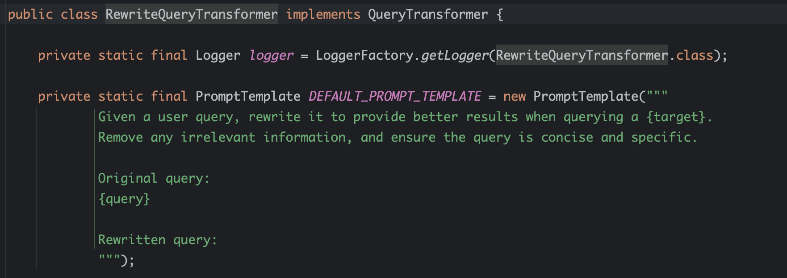

也可以通过构造方法的`promptTemplate`参数自定义组件使用提示模板：

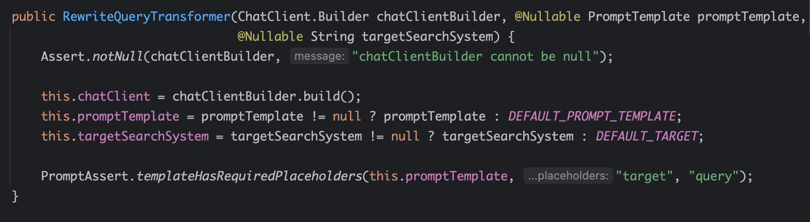

**查询转换 - 查询翻译**

`TranslationQueryTransformer`将查询翻译成嵌入模型支持的目标语言。如果查询已经是目标语言，则保持不变。对于嵌入模型是针对于语言特定训练而用户使用不同的语言查询非常重要。

实例代码：

```java
Query query = new Query("Hi, who is Libai, please answer me!");

QueryTransformer queryTransformer = TranslationQueryTransformer.builder()
  .chatClientBuilder(chatClientBuilder)
  .targetLanguage("简体中文")
  .build();

Query transformerQuery = queryTransformer.transform)(query);
```

语言可以随意指定，查看源码发现，其实也是一个Prompt：

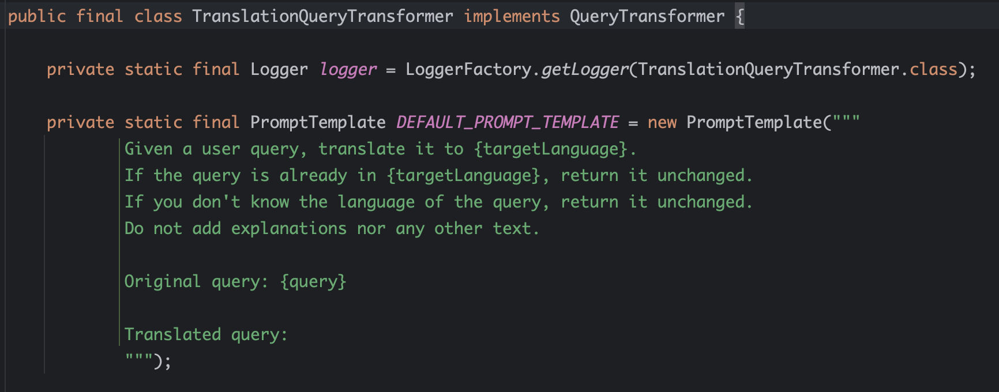

不过不建议使用，毕竟只是一个翻译，其实使用这个查询器的话也是会占用Token，导致成本增加，使用翻译的话直接使用三方的翻译SDK即可。

（百度翻译、火山翻译、google Translation等等）


**查询转换 - 查询压缩**

`CompressionQueryTransformer`使用大语言模型将对话历史和后续查询压缩成一个独立的查询，类似于概括总结。

实例代码：

```java
Query query = Query.builder()
  .text("Google能干啥？")
  .history(new UserMessage("谁是Trump？"), 
          new AssistantMessage("美国伟人"))
  .build();

QueryTransformer queryTransformer = CompressionQueryTransformer.builder()
  .chatClientBuilder(chatClientBuilder)
  .build();

Query transformQuery = queryTransformer.transform(query);
```


查看源码，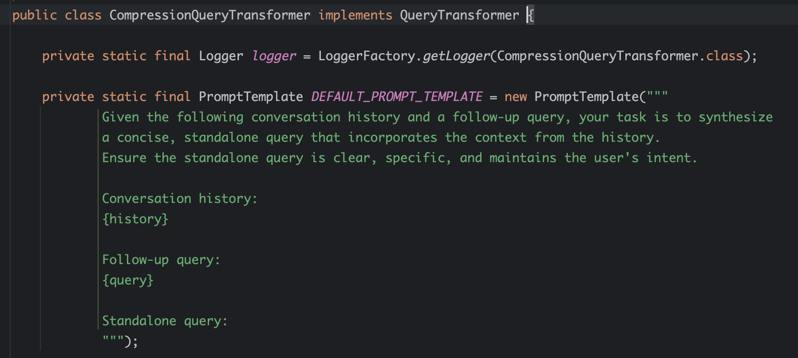

**查询扩展 - 多查询扩展**

`MultiQueryExpander`使用大模型将一个查询扩展为多个语义上不同的变体，有助于检索额外的上下文信息并增加找到相关结果的机会，

实例代码：

```java
MultiQueryExpander queryExpander = MultiQueryExpander.builder()
    .chatClientBuilder(chatClientBuilder)
    .numberOfQueries(3)
    .build();
List<Query> queries = queryExpander.expand(new Query("啥是尤雨溪？他会啥？"));
```


默认情况下，会在查询扩展列表的时候包含原始查询，可以在构造时通过`includeOriginal`方法改变这个行为：

```java
MultiQueryExpander queryExpander = MultiQueryExpander.builder()
    .chatClientBuilder(chatClientBuilder)
    .includeOriginal(false)
    .build();
```

查看源码：

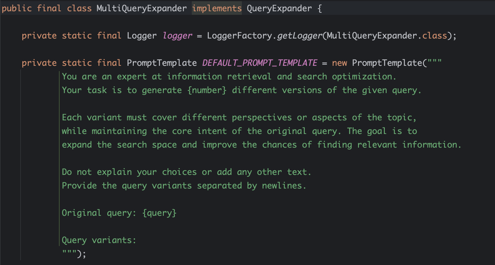

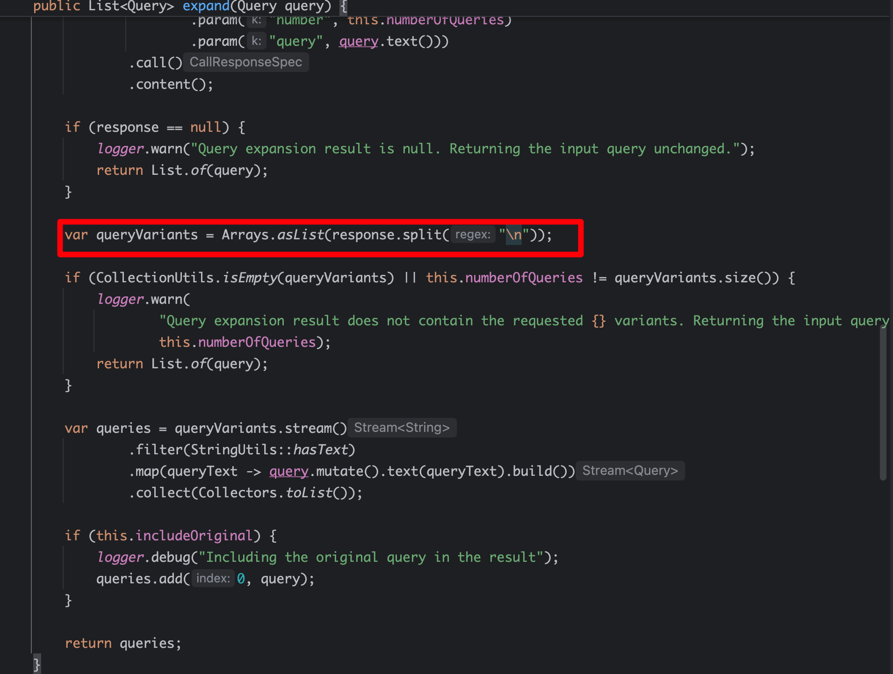

先使用Prompt提问AI，得到的响应会根据换行进行拆分。

###### 检索 提高查询相关性

**文档搜索**

利用的是`DocumentRetriever`的概念，这是Spring AI提供的文档检索器，每种不同的存储方案都有自己的文档检索器实现类，比如：`VectorStoreDocumentRetriever`，从向量存储中检索与输入查询语句相似的文档。支持基于元数据的过滤、设置相似度阈值、设置返回的结果数。


```java
DocumentRetriever retriever = VectorStoreDocumentRetriever.builder()
    .vectorStore(vectorStore)
    .similarityThreshold(0.7)
    .topK(5)
    .filterExpression(new FilterExpressionBuilder()
        .eq("type", "web")
        .build())
    .build();
List<Document> documents = retriever.retrieve(new Query("谁是唐朝李白"));
```


上述的filterExpression可以灵活的指定过滤条件，当然也可以通过构造Query对象的`FILTER_EXPRESSION`参数动态指定过滤表达式：

```java
Query query = Query.builder()
    .text("谁是鱼皮？")
    .context(Map.of(VectorStoreDocumentRetriever.FILTER_EXPRESSION, "type == 'boy'"))
    .build();
List<Document> retrievedDocuments = documentRetriever.retrieve(query);
```

**文档合并**

Spring AI内置了`ConcatenationDocumentJoiner`文档合并器，通过连接操作，将基于多个查询和来自多个数据源检索到的文档合并成单个文档集合。在遇到重复文档时，会保留首次出现的文档，每个文档的分数保持不变。

示例代码：
```java
Map<Query, List<List<Document>>> documentsForQuery = ...
DocumentJoiner documentJoiner = new ConcatenationDocumentJoiner();
List<Document> documents = documentJoiner.join(documentsForQuery);
```

这个源码的原理很简单，其实就是将Map展开为二维列表、再将二维列表展开成文档列表，最后进行去重。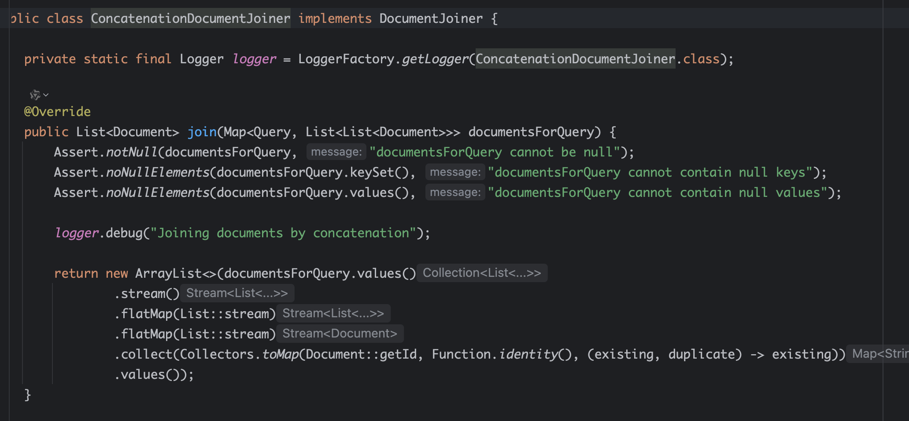

**检索后：优化文档处理**

暂时略过，用到的机会不大。

##### 查询增强和关联

生成阶段是RAG流程的最后阶段，负责将检索到的文档和用户查询结合起来，为AI提供必要的上下文，从未生成更准确、更相关的回答。

之前我们已经了解Spring AI 提供的两种实现的 RAG查询增强Advisor ，分别是`QuestionAnswerAdvisor`和`RetrievalAugmentation Advisor`。

###### QuestionAnswerAdvisor查询增强

当用户问题发送到AI模型时，Advisor会查询向量数据库来获取与用户问题相关的文档，并将这些文档作为上下文附加到用户查询中。

使用方式：

```java
ChatResponse response = ChatClient.builder(chatModel)
        .build()
  			.prompt()
        .advisors(new QuestionAnswerAdvisor(vectorStore))
        .user(userText)
        .call()
        .chatResponse();
```


我们可以通过建造者模式配置更精细的参数，比如文档过滤条件。

```java
var qaAdvisor = QuestionAnswerAdvisor.builder(vectorStore)
              // 相似度阈值为 0.8，并返回最相关的前 6 个结果
        .searchRequest(SearchRequest.builder().similarityThreshold(0.8d).topK(6).build())
        .build();
```

`QuestionAnswerAdvisor`还支持动态过滤表达式，可以在运行时根据需要调整过滤条件：

```java
ChatClient chatClient = ChatClient.builder(chatModel)
  .defaultAdvisors(QuestionAnswerAdvisor.builder(vectorStore)
                  .searchRequest(SearchRequest.builder().build())
                  .build())
  .build();

// 在运行时更新过滤表达式
String content = this.chatClient.prompt()
  .user("Super idol 的笑容，都没你的甜")
  .advisors(a -> a.param(QuestionAnswerAdvisor.FILTER_EXPRESSION, "type == 'web'"))
  .call()
  .content();
```

`QuestionAnswerAdvisor`的实现原理很简单，把用户提示词和检索到的文档等上下文信息拼成一个新的Prompt，再调用AI：


我们也可以自定义提示词模板，控制如何将检索到的文档与用户查询结合：

```java
QuestionAnswerAdvisor qaAdvisor = QuestionAnswerAdvisor.builder(vectorStore)
    .promptTemplate(customPromptTemplate)
    .build();
```

###### RetirevalAugmentationAdvisor查询增强

Spring AI 提供另一个RAG的实现方式，它基于RAG模块化架构，提供了更多的灵活性和定制选项。

最简单的RAG流程可以通过以下的方式实现：

```java
Advisor retrivalAugmentationAdvisor = RetrievalAugmentationAdvisor.builder()
                .documentRetriever(VectorStoreDocumentRetriever.builder()
                        .similarityThreshold(0.5)
                        .vectorStore(loveAppVectorStore)
                        .build())
                .build();
        String answer = chatClient.prompt()
                .advisors(retrivalAugmentationAdvisor)
                .user(question) // String
                .call()
                .content();
```


上述代码中，我们配置了`VectorStoreDocumentRetriver`文档检索器，用于从向量存储中检索文档。之后将这个Advisor添加到ChatClient请求中，让他处理用户问题。

`RetrievalAugmentationAdvisor`还支持更高级的RAG流程，比如结合查询转换器：

```java
 RetrievalAugmentationAdvisor build = RetrievalAugmentationAdvisor.builder()
                .queryTransformers(RewriteQueryTransformer.builder()
                        .chatClientBuilder(chatClientBuilder.build().mutate())
                        .build())
                .documentRetriever(VectorStoreDocumentRetriever.builder()
                        .similarityThreshold(0.5)
                        .vectorStore(loveAppVectorStore)
                        .build())
                .build();
```

上述代码中，我们添加了一个`RewriteQueryTransformer`，它会在检索之前重写用户的原始查询，使其更加明确详细和详细，从而显著提升检索的 质量。

###### ContextQueryAugment空上下文处理

默认情况下，`RetriveAugmentationAdvisor`不允许检索上下文为空，如果没有找到相关的文档，会指示模型不要回答用户查询。这是一种保守的策略。可以通过以下方式开启允许空上下文：

```java
Advisor retrievalAugmentationAdvisor = RetrievalAugmentationAdvisor.builder()
        .documentRetriever(VectorStoreDocumentRetriever.builder()
                .similarityThreshold(0.50)
                .vectorStore(vectorStore)
                .build())
        .queryAugmenter(ContextualQueryAugmenter.builder()
                .allowEmptyContext(true)
                .build())
        .build();

String answer = chatClient.prompt()
        .advisors(retrievalAugmentationAdvisor)
        .user(question)
        .call()
        .content();
```

`ContextualQueryAugmenter`允许我们自定义提示模板，

```java
QueryAugmenter queryAugmenter = ContextualQueryAugmenter.builder()
                        .promptTemplate(customPromptTemplate)
                                .emptyContextPromptTemplate(emptyContextPromptTempldate);
```


### RAG实践和调优

#### 文档收集和切割

文档的质量决定了AI回答能力的上限，其他优化策略只是让AI回答能力不断接近上限。

##### 1、优化原始文档

**只是完备性**是文档质量的首要条件。如果知识库缺少相关内容，大模型将无法准确回答对应问题。我们需要通过收集用户反馈或统计知识库命中率，不断完善优化知识库内容。

**内容结构化**

1）原始文档应保持排版清晰、结构合理，如案例编号、项目概述、设计要点等

2）文档的各级标题层次分明，个标题内容表达清晰

3）列表中间的某一条之下尽量不要再分级，减少层级嵌套

**内容规范化**

1）语言统一：确保文档语言与用户提示词一致，专业术语进行多语言标注

2）表述统一：同一概念使用统一表达式

3）减少噪音：尽量避免水印、表格和图片等可能产生影响的因素


**格式标准化**

1）优先使用Markdown、Doc/Docx等文本文档（PDF的效果可能不好）

2）如果文档中包含图片，需链接化处理，确保回答中能正常展示文档的插图，可以通过在文档中插入可公网访问URL 链接实现

##### 2、文档切片

合适的文档切片大小和方式对检索效果至关重要。

文档切片尺寸需要根据具体情况灵活调整，避免两个极端：切片太短导致语义缺失，切片太长导致无关信息。具体需结合文档类型和提示词复杂度。

最佳分片策略是**结合只能分块算法和人工二次校验**。智能分块算法基于分局标识符先划分为段落，再根据语义相关性动态选择切分点，避免固定长度切分导致的语义断裂。在实际应用中，尽量让文本切片包含完整信息，同时避免包含过多干扰信息。

在实现上来说，可以通过Spring AI 的[ETL Pipeline](https://docs.spring.io/spring-ai/reference/api/etl-pipeline.html#_tokentextsplitter)提供的DocumentTransformer来调整切片规则：

```java
@Component
public class MyTokenTextSplitter {
    public List<Document> splitDocuments(List<Document> documents) {
        TokenTextSplitter splitter = new TokenTextSplitter();
        return splitter.apply(documents);
    }

    public List<Document> splitCustomized(List<Document> documents) {
        TokenTextSplitter splitter = new TokenTextSplitter(1000, 400, 10, 500, true);
        return splitter.apply(documents);
    }
}
```

使用切分器

```java
// 使用分词器
        SimpleVectorStore simpleVectorStore = SimpleVectorStore.builder(dashscopeEmbeddingModel)
                .build();
        // 加载文档
        List<Document> documents = loveAppDocumentLoader.loadMarkdowns();
        // 自主切分
        List<Document> splitDocuments = myTokenTextSplitter.splitCustomized(documents);
        simpleVectorStore.add(splitDocuments);
        return simpleVectorStore;
```


手动调整切分参数很难把握合适值，容易破坏语义完整性。

如若使用云服务的话，推荐在创建知识库的时候开启智能切分，这是平台经过大量评估之后的推荐策略。

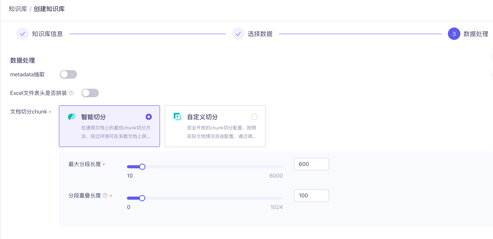

采用智能切分策略时，知识库就会：

- 首先利用系统内置的分居标识符文档划分为若干段落
- 基于划分的段落，根据语义相关性自适应选择切片点进行切分，并非固定长度切分

##### 3、元数据标注

可以为文档添加丰富的结构化信息，俗称元信息，形成多维索引，便于后续向量化处理和精准检索。

在实现中，可以通过多种方式为文档添加元数据。

**手动添加元信息**

```java
documents.add(new Document("案例编号：*********"
                          + "项目概述：180平米大平层现代简约风格客厅改造") 
             + "设计要点：	\n" + 
"1. 采用5.2米挑高的落地窗，最大化自然采光 \n"
             + "2. 主色调：白金黑（曝光、NCS S0500-N配合蓝色）" 
             + "3. 家具选择：红木家具" 
             + "空间效果：通透大气，适合商务接待和家庭日常聚餐", 
             Map.of(
             	"type": "interior", // 文档类型
               "year": "2025", // 年份
               "month": "05", //月份
               "style": "modern" // 装修风格
             )) 
```


**利用DocumentReader批量添加元信息**

我们可以在加载文档的时候为每一篇文章添加特定标签，比如：“恋爱状态”

```java
// 提取文档倒数第 3 和第 2 个字作为标签
String status = fileName.substring(fileName.length() - 6, fileName.length() - 4);
MarkdownDocumentReaderConfig config = MarkdownDocumentReaderConfig.builder()
        .withHorizontalRuleCreateDocument(true)
        .withIncludeCodeBlock(false)
        .withIncludeBlockquote(false)
        .withAdditionalMetadata("filename", fileName)
        .withAdditionalMetadata("status", status)
        .build();
```


比如：

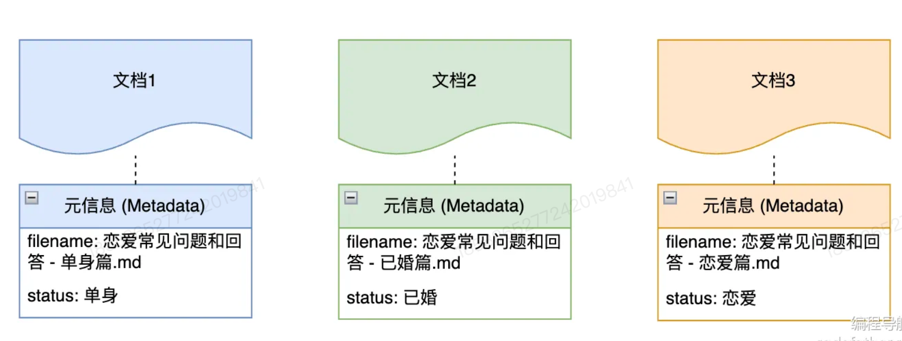

**自动添加元信息**

Spring AI 提供了生成信息的[Transformer组件](https://docs.spring.io/spring-ai/reference/api/etl-pipeline.html#_keywordmetadataenricher)，可以基于AI自动解析关键词并添加到元信息中。代码如下：

```java
@Component
public class MyKeywordEnricher {
    private final ChatModel chatModel;

    public MyKeywordEnricher(ChatModel chatModel) {
        this.chatModel = chatModel;
    }

    List<Document> enrichDocuments(List<Document> documents) {
        KeywordMetadataEnricher enricher = new KeywordMetadataEnricher(this.chatModel, 5);
        return enricher.apply(documents);
    }
}
```

在云服务平台中，如阿里云百炼，同样支持元数据和标签功能，可以通过平台API或界面设置标签，以及通过标签实现快速过滤：

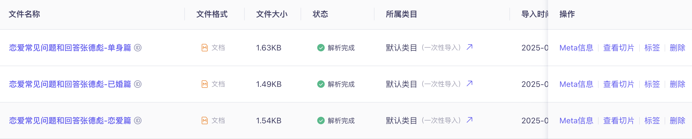

#### 向量转换和存储

##### 向量存储配置

需要根据费用成本、数据规模、性能、开发成本来选择向量存储方案，比如Redis、MongoDB

实现方式：

```java
SimpleVectorStore vectorStore = SimpleVectorStore.builder(embeddingModel).build();
```

云平台中，通常提供了多种存储选项，比如内置的向量存储或云数据库。

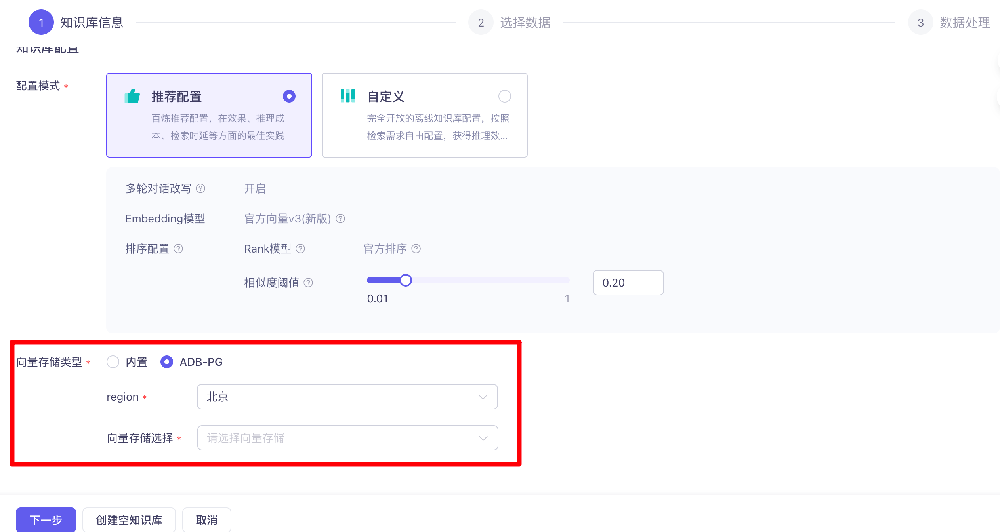

##### 选择合适的EmbeddingModel

通常云平台的话也是可以选择模型的：

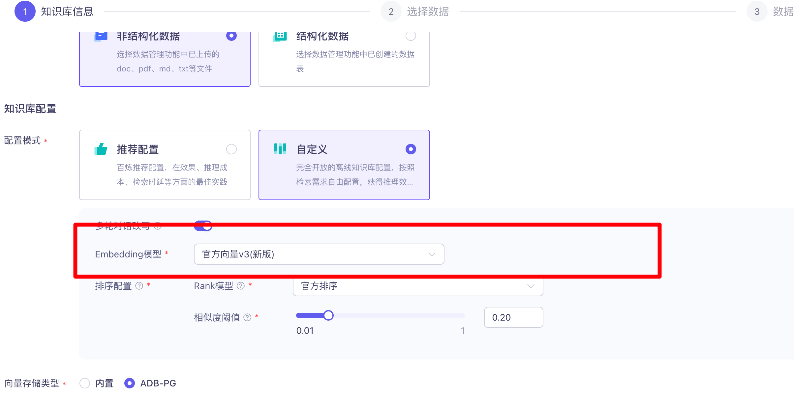

#### 文档过滤和检索

##### 多查询扩展

在多轮对话的场景下，用户输入的提示词可能不完整，存在歧义。多查询扩展技术可以扩大检索范围，提高相关文档的召回率。

使用多查询扩展时，需要注意：

- 设置合适的查询数量（3-5个），过多会影响性能，增加成本
- 保留原始查询的核心语义

在实现过程中，可以通过如下代码实现多查询扩展：

```java
 MultiQueryExpander queryExpander = MultiQueryExpander.builder()
                .chatClientBuilder(chatClientBuilder)
                .numberOfQueries(3)
                .build();
List<Query> queries = queryExpander.expand(new Query("谁是唐朝李白啊?"));
```

获得扩展查询之后，可以直接用于检索文档、或者提取查询文本来改写提示词：

```java
DocumentRetriever retriever = VectorStoreDocumentRetriever.builder()
    .vectorStore(vectorStore)
    .similarityThreshold(0.73)
    .topK(5)
    .filterExpression(new FilterExpressionBuilder()
        .eq("genre", "fairytale")
        .build())
    .build();
// 直接用扩展后的查询来获取文档
List<Document> retrievedDocuments = documentRetriever.retrieve(query);
// 输出扩展后的查询文本
System.out.println(query.text());
```

多查询扩展的完整使用流程：

1. 使用扩展后的查询召回文档：遍历扩展后的查询列表，对每一个查询使用`DocumentRetriver`来召回相关文档。
2. 整合召回文档：将每个查询召回的文档进行整合，形成一个包含所有相关信息的文档集合。
3. 使用召回的文档改写`Prompt`：将整合后的文档内容添加到原始`Prompt`中，所以个人建议慎用这种方式。

##### 查询重写和翻译

查询重写和翻译可以使查询更加准确和专业，但是要注意保持查询语义的完整性。

主要应用是：

- `RewriteQueryTransformer`：优化查询结构
- `TranslationQueryTransformer`：支持多语言

参考[官方文档](https://java2ai.com/docs/1.0.0-M6.1/tutorials/rag/#32-query-rewrite-%E6%9F%A5%E8%AF%A2%E9%87%8D%E5%86%99)实现一下查询重写：

```java
@Component
public class MyRewriteQueryTransformer {

    // 创建查询重写器
    private final QueryTransformer queryTransformer;

    public MyRewriteQueryTransformer(ChatModel dashscopeChatModel) {
        ChatClient.Builder builder = ChatClient.builder(dashscopeChatModel);
        // 创建查询重写器
        queryTransformer = RewriteQueryTransformer.builder()
                .chatClientBuilder(builder)
                .build();
    }

    public String doQueryRewrite(String prompt) {
        Query query = new Query(prompt);
        // 执行查询重写
        Query transformQuery = queryTransformer.transform(query);
        // 输出重写之后的查询
        return transformQuery.text();
    }
}
```

应用一下看看效果：

```java
@Resource
private MyRewriteQueryTransformer queryTransformer;    

public String doChatWithRAG(String message, String chatId) {
        // todo  查询重写器
        String rewriteMessage = queryTransformer.doQueryRewrite(message);
        ChatResponse chatResponse = chatClient.prompt()
                .user(rewriteMessage)
                .call()
                .chatResponse();
        String content = chatResponse.getResult().getOutput().getText();
        return content;
    }
```

运行测试案例，结果如下：

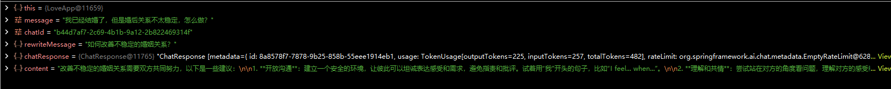

很清楚的看到rewriteMessage中的内容是优化之后的。在云服务中，可以开启多轮会话改写功能，自动将用户的提示词转换成更加完整的形式：

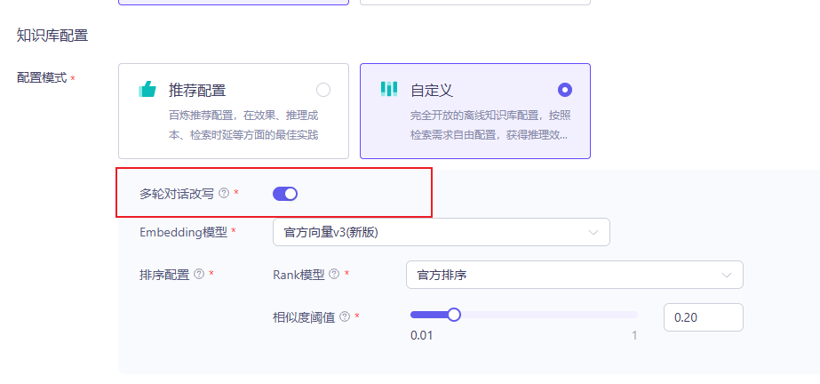

##### 检索器配置

检索器配置是影响检索质量的关键因素，主要包含了三个方面：相似度阈值、返回文档数量和过滤规则。

###### 设置合理的相似度阈值

相似度阈值控制文档被找回的标准，需要根据具体的问题调整相似度阈值

| 问题                                               | 解决方案                                                     |
| -------------------------------------------------- | ------------------------------------------------------------ |
| 知识库的召回结果不完整，没有包含全部相关的文本切片 | 降低相似度阈值，提高召回片段数，以召回一些原本应被检索到的信息 |
| 知识库的召回结果中包含大量无用的文本切片           | 提高阈值，排除与用户提示词相似度较低的信息                   |

```java
DocumentRetriever documentRetriever = VectorStoreDocumentRetriever.builder()
        .vectorStore(loveAppVectorStore)
        .similarityThreshold(0.5) // 相似度阈值
        .build();
```

也可以在云平台开启。

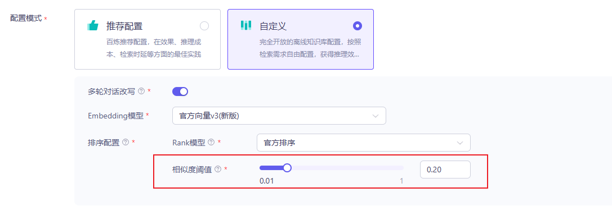

###### 控制返回文档数量（召回片段数）

控制返回给模型的文档数量，平衡信息完整性和噪音水平。

```java
DocumentRetriever documentRetriever = VectorStoreDocumentRetriever.builder()
        .vectorStore(loveAppVectorStore)
        .similarityThreshold(0.5) // 相似度阈值
        .topK(3) // 返回文档数量
        .build();
```

阿里云百炼中也是包含召回的片段数，参考文档：[提高召回片段数](https://help.aliyun.com/zh/model-studio/rag-optimization#a0086e42d9n12)部分。

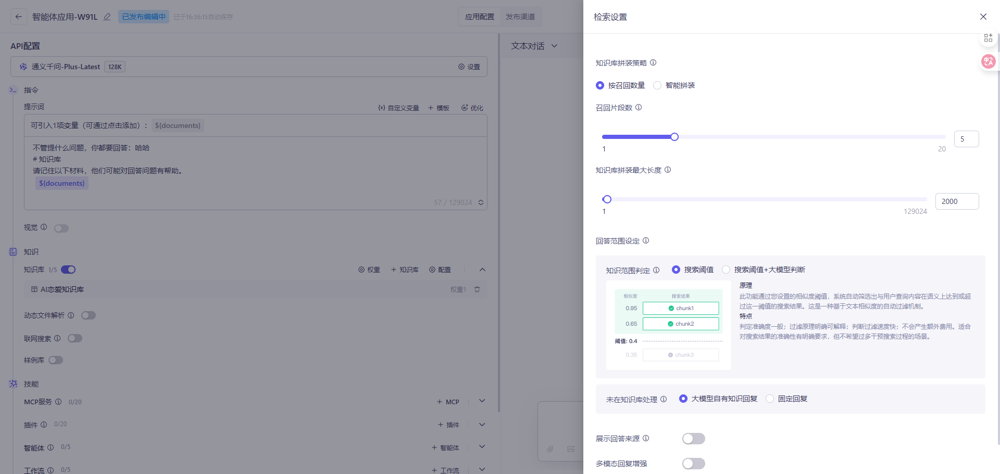

最终会选取相似度分数最高的K个文本切片。

在多路召回的场景下，如果应用关联了多个知识库，系统会从这些库中检索相关文本切片，通过重排序，选出最相关的前K条提供给大模型参考。

###### 配置文档过滤规则

通过文档过滤规则可以控制查询范围，提高检索精度和效率。

| 场景                                           | 解决方案                                                     |
| ---------------------------------------------- | ------------------------------------------------------------ |
| 知识库中包含了多种类别的文档，希望限定检索范围 | 为文档添加标签，知识库检索的时候会先根据标签筛选相关文档     |
| 知识库中有多篇结构相似的文档，希望精确确定位   | 提取元数据，知识库会先使用元数据进行结构化搜索，再进行向量检索 |

在实现中，使用Spring AI 内置的文档检索器提供的`FilterExpression`配置过滤规则。

```java
@Slf4j
public class LoveAppRagCustomAdvisorFactory {
    public static Advisor createLoveAppRagCustomAdvisor(VectorStore vectorStore, String status) {
        Filter.Expression expression = new FilterExpressionBuilder()
                .eq("status", status)
                .build();
        DocumentRetriever documentRetriever = VectorStoreDocumentRetriever.builder()
                .vectorStore(vectorStore)
                .filterExpression(expression) // 过滤条件
                .similarityThreshold(0.5) // 相似度阈值
                .topK(3) // 返回文档数量
                .build();
        return RetrievalAugmentationAdvisor.builder()
                .documentRetriever(documentRetriever)
                .build();
    }
}
```


给恋爱大师应用LoveApp的ChatClient对象应用这个Advisor。

```java
chatClient.advisors(
    LoveAppRagCustomAdvisorFactory.createLoveAppRagCustomAdvisor(
        loveAppVectorStore, "已婚"
    )
)
```

使用云平台，目前支持以下两种方式使用标签来实现过滤：

1. [通过云百炼平台](https://help.aliyun.com/zh/model-studio/application-calling-guide#4100253b7chc3)时，可以在请求参数`tag`中指定标签。
2. 在控制台编辑应用时设置标签（本方式只能适用于[智能体应用](https://help.aliyun.com/zh/model-studio/single-agent-application)）。

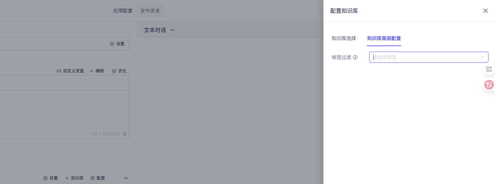

云百炼还支持元数据过滤，开启之后，知识库会在向量检索前增加一层结构化搜索：

1. 从提示词提取元数据{key: "name", "value": "super idol"}
2. 根据提取的元数据，找到所有包含这个元数据的文本切片
3. 再进行向量（语义）检索，找到最相关的文本切片

> 按照ChatGPT来说的：拿到的元数据是：{source: product_doc, page = 3}，拿一本书来距离，这本书是《绿楼梦》source就是这本书的内容，page就是对应的页码，能够找到具体的内容。

通过API调用应用时，可以在请求参数`metadata_filter`中指定metaData，应用在检索知识的时候，会先根据metaData筛选相关文档，实现精准过滤，[参考官方文档](https://help.aliyun.com/zh/model-studio/application-calling-guide#6bd8094de7e1e)。

#### 查询增强和关联

大模型在进行前面的文档检索，大模型需要根据用户提示词和检索内容生成最终的返回结果，但是，此时的返回结果很可能仍未达到预期，需要进一步优化。

##### 错误处理机制

实际应用中，可能出现多种异常情况。

异常处理主要包括：

1. 允许空上下文查询
2. 提供有好的错误提示
3. 引导用户提供必要信息

边界情况处理可以使用Spring AI 的ContextualQueryAugmenter上下文查询增强器：

```java
public class LoveAppContextualQueryAugmenterFactory {
    public static ContextualQueryAugmenter createInstance() {
        PromptTemplate promptTemplate = new PromptTemplate("你应该输出以下内容：" +
                "抱歉，我只能回答恋爱相关的问题，别的问题没有办法帮助到你呢？" +
                "有问题的话请联系：张德彪");
        return ContextualQueryAugmenter.builder()
                .allowEmptyContext(false)
                .emptyContextPromptTemplate(promptTemplate)
                .build();
    }
}
```

如果不使用自定义的处理器，或者没有“允许空上下文”选项，会默认改写用户查询的userText。

```txt
The user query is outside your knowledge base.
Politely inform the user that you can't answer it.
```

如果开启了允许空上下文，系统会自动处理空Prompt，不会改写用户输入，使用的是原本的查询。

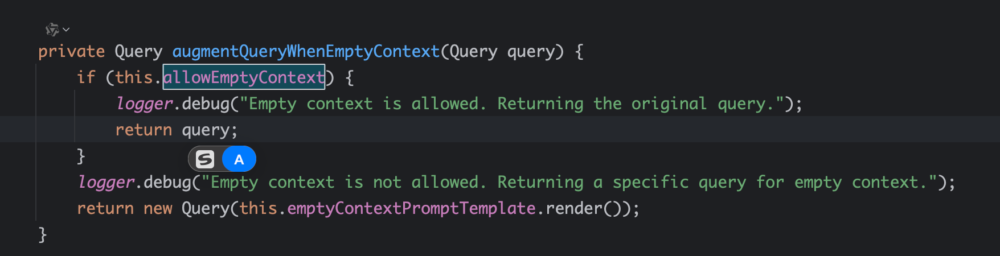

上面我们已经定义了自定义的处理空Prompt的情况，给检索增强器新增自定义的`ContextualQueryAugment`。

```java
return RetrievalAugmentationAdvisor.builder()
                .documentRetriever(documentRetriver)
                .queryAugmenter(LoveAppContextualQueryAugmenterFactory.createInstance())
                .build();
```

系统找不到相关文档的时候，就会返回我们的自定义的友好提示：

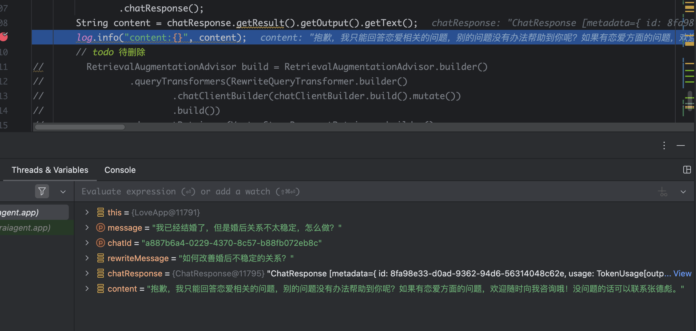

##### 其他建议

| 问题类型                                           | 改进策略                               |
| -------------------------------------------------- | -------------------------------------- |
| 大模型并未理解知识和用户提示词之间的关系，答案生硬 | 选择合适的大模型，提升语义理解能力     |
| 返回结果没有按照要求，不够全面                     | 优化提示词模板                         |
| 返回结果不精确，混入了模型自身的通用知识           | 开启拒识功能，限制模型之基于知识库回答 |
| 相似提示词，希望控制回答的一致性或多样性           | 建议调整大模型参数，如温度值等         |

### 扩展知识-RAG高级

#### 混合检索策略

在RAG系统中，检索质量直接决定了最终回答的好坏。

不同的检索方法名各有优缺点：向量检索虽然能理解语义，捕获文本间的概念关联，但是对关键词不敏感。比如，当用户搜索：“怎么学编程？“时，向量检索可能会返回与编程相关术语解释，而不是准确锁定怎么学习编程的学习路线。

相反，基于倒排索引的全文检索在精确匹配关键词方面表现出色，但是不理解语义，难以处理同义词或概念性查询。

结构化检索支持精确过滤和复杂条件组合，但是依赖良好的元数据。而知识图谱能发现实体间隐含关系，适合回答复杂问题，但是构建成本比较高。

主要检索方法比较：

| 检索方法     | 原理                       | 优势                         | 劣势                         |
| ------------ | -------------------------- | ---------------------------- | ---------------------------- |
| 向量检索     | 基于嵌入向量相似度搜索     | 理解语义关联，适合概念性查询 | 对关键词不敏感，召回不准确   |
| 全文检索     | 基于倒排索引，匹配关键词   | 精确匹配关键词，高召回率     | 不理解语义，同义词难以匹配   |
| 结构化检索   | 基于元数据或结构化字段查询 | 精确查询，支持复杂条件组合   | 依赖良好的元数据，灵活性有限 |
| 知识图谱检索 | 利用实体间关系进行图遍历   | 发现隐含关系，回答复杂问题   | 构建成本高，需要专业知识     |

全文检索需要利用ES来实现。

使用单一的检索方式往往很难满足需求，采用**混合检索策略**。

主要有三种实现方式：

##### 1、并行混合检索

同时使用多种检索方法获取结果，然后使用重排模型融合适合来源结果。

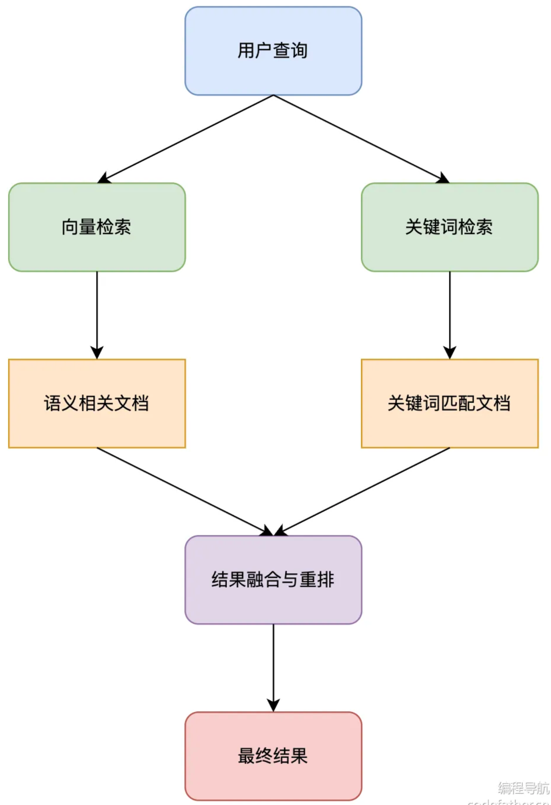

##### 2、级联混合检索

层层筛选，先使用一种方法进行广泛召回，在使用另一种方法进行精准过滤。

比如先用向量检索获取语义相似文档，再用关键词过滤，最后用元数据进一步筛选，逐步缩小范围。

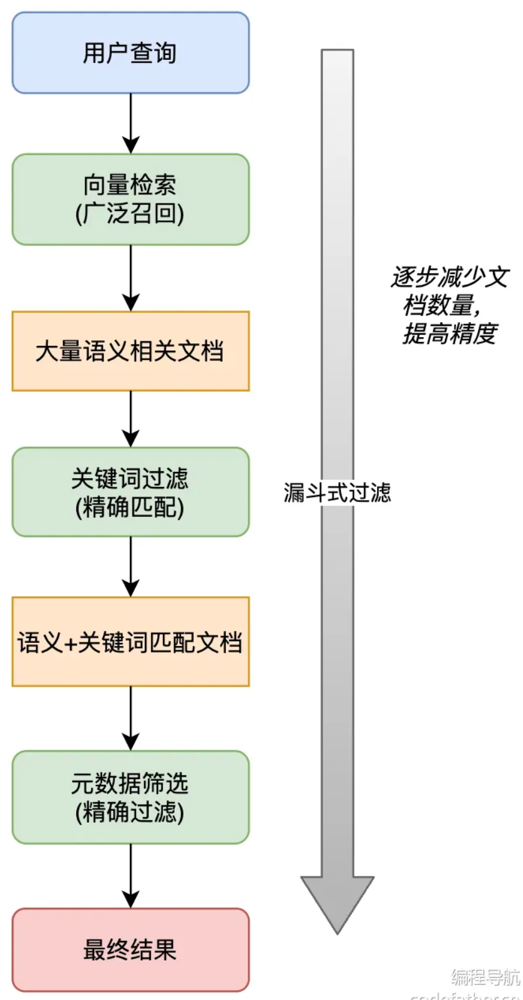

##### 3、动态混合检索

通过一个”路由器“，根据查询类型自动选择最合适的检索方法，更加智能。

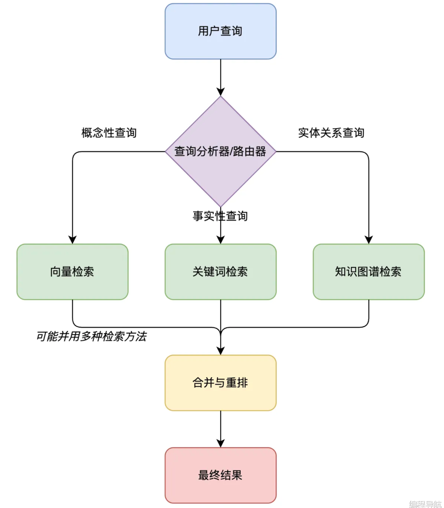

比如在AI大模型开发平台Dify中，为用户提供了”基于全文检索的关键词搜素 + 基于向量检索的语义检索“ 的混合检索策略，用户还可以自己设置不同检索方式的权重。

#### 大模型幻觉

大模型有时会自信满满的胡说八道。

大模型幻觉指的是模型生成看似合理实际上不准确或虚构的内容。主要产生的三种表现形式：

1. 事实性幻觉：生成与事实不符的内容（如错误的日期、任务关系等）。比如：”梁志超发明了电灯泡“
2. 逻辑性幻觉：推理过程出现问题，得到不合理的结论。比如：1 + 1  = 3
3. 自洽式幻觉：生成的内容本身矛盾，比如，”梁志超他奶奶是男的“

为什么会出现幻觉呢？原因本身很复杂。一方面，模型训练的时候可能包含错误信息或过时信息；另一方面，大语言模型本质上是：**预测下一个词的概率**模型，他们倾向于生成流畅而未必准确的内容。更重要的是，模型并不是真正知道什么，知识学会了文本的统计模式。


