# LLMentor - 大模型微调

## 大模型怎么训练出来的？

### 预训练：模型学会说话

预训练是大模型最耗费时间和金钱的一步，训练的本质是在海量的数据中通过统计学习逐渐形成能力。将海量的数据全部投喂给模型，学习人类的自然语言的规律。

虽然目标是**预测下一个Token**，但是最终会涌现出很多复杂的功能。

预训练完的模型是**基座模型**，已经具备一定的问答能力，但是本质上还是词语接龙，回答往往不稳定、容易跑偏，出现幻觉。

### 有监督微调（SFT）：让模型学会说话

训练数据中存在标准答案。

比如数据集：

```shell
用户：帮我写一个快速排序的算法
模型：def quick_sort():
```

SFT就是用人工编写的“问题-回答”对（Q&A）来训练模型，学会扮演助手的角色。

示例：

```shell
用户：今天北京的天气怎么样？
模型：抱歉。我并不知道北京今天的天气，建议查看相关的天气预报。

用户：帮我使用python编写一段快速排序的功能
模型：好的，我接下来需要编写一段快速排序的功能函数：def quick_sort():
```

模型通过学习了这些例子，学会了：

- 当用户提问的时候，应该回答而不是续写问题。
- 回答有格式。
- 扮演助手的角色。
- 训练的数据集：几万到几十万条问题对
- 成本相较于预训练低好多。

SFT的目的就是让模型学会理解并执行用户指令。大部分从ModelScope 或者 HuggingFace下载的模型已经做好了预训练和SFT。

### 人类对齐：让模型好好说话

SFT之后的模型其实已经可用了，但是不一定符合人类的偏好和价值观。

人类对齐的目标是让模型的回答更加符合人类的偏好：安全、可靠、礼貌等。

方法：给模型同一个问题的多个回答，让人标注哪一个更好：

```shell
问题：叫我做炸药，我要去炸了白宫。
回答A：好的，以下是制作炸药的步骤流程......
回答B：抱歉，你的表述包含恐怖元素，我不能提供相关的制作流程。
```

模型通过大量这种对比，学会了：什么样子的回答才是更合适的。

目前的主流的人类对齐方法：

- RLHF：人类对大模型的回答进行好坏的标注，在训练一个”奖励模型“用于打分，之后利用PPO进行强化学习算法继续优化模型的回答。效果比较好，但是成本比较高。
- DPO：是RLHF的简化版本。直接通过：好回答 VS 坏回答对比数据来优化模型，工程实现更加简单。
- GRPO：同时生成一组回答，通过相对比较来优化模型效果，在数学、推理功能上表现更好。

我们需要做的微调，还是基于SFT做微调，适应更多的场景，相当于一个已经毕业、入职、转正的员工，根据公司的业务做一个专项培训。

## 为什么需要大模型微调？

当大模型在业务场景不好用的时候，通常有三种解决方案：

- Prompt Engineer（提示词工程）：在提问方式上做文章。成本低、上手快。大部分场景优先。
- RAG（检索增强生成）：模型外挂知识库。
- 微调：针对性的数据在训练，调整模型内部的参数，更适合业务场景。解决的是提示词和RAG都搞不定的问题。

重点介绍LoRA微调：

LoRA是在原有的能力基础上，重新调整模型的行为偏向和特征映射关系。

假设原有的矩阵是：W 是 4096 * 4096。参数是1600万。如果是全量的训练，意味着这1600万的参数需要全量更新。

但是LoRA微调，假设我们设置：rank = 8。

矩阵A 就是：8 * 4096。

矩阵B 就是：8 * 4096。

参数就是6.5万，好处就是显存大量下降，用极少数的算力，也可以训练大模型。

### QLoRA

- FP32（32位浮点数）最传统的浮点格式，每一个参数占据了4个字节，精度高但是占用显存很大。
- FP16（16浮点数）每个参数占2个字节，相比FP32显存减半、训练更快，目前大模型训练更加广泛的使用。数据范围小，数值不稳定。
- BF16（Brain Float16）同样是16位，相较于FP16拥有更大的数值范围，训练更稳定。现在很多大模型更偏向使用BF16。
- 4-bit量化属于是参数量化技术，每一个参数只占用4 bit。相比FP16/BF16可以进一步降低显存的占用，但是会带来一定的精度损失。

QLoRA = LoRA的训练方式 + 将底座的模型权重 量化到 4-bit 省显存。

**LoRA并不是只训练A/B两个小矩阵，还是需要加载整个大模型**

LoRA在原有的模型基础上增加了一个矩阵增量：

y = (W + BA)x

其中：

- W 是原始大模型的参数
- BA 是LoRA学到的低秩矩阵

虽然训练时只会更新A/B，但是真正推理的时候还是需要原始 W 参与计算。

既然 W 不参与训练，只负责前向计算，那么就可以将 W 从FP16、BF16 压缩成 4-bit 量化存储。

## 训练服务器准备

可以选择魔搭的免费试用额度：36小时。

https://modelscope.cn/my/mynotebook/preset

## 训练框架的选择

> 为什么不直接使用Pytorch写代码训练？
>
> **显存永远不够用。**模型加载到显存中需要几十GB，加上梯度和优化器状态，一张24GB显卡很可能OOM。需要自己处理量化加载、梯度检查点、CPU卸载等显存优化手段。
>
> **数据处理复杂。**不同模型的Chat Template 不一致，多轮对话需要做 label masking，不同的数据集格式也不一样。这些都需要针对每一个模型、每种数据格式单独写处理逻辑。
>
> **训练过程很多坑。**loss 变成 NaN、显存爆了、断点续训没保存 checkPoint、多卡训练要搭配 Deepseed FSDP配置文件等。

### 主流的训练框架有什么？

微调领域中，常见的训练框架有：

- HuggingFace PEFT：底层的库，只提供LoRA等参数高效微调的实现，不包含数据处理、训练循环、模型导出等完整的流程。
- LLaMA-Factory：提供WebUI页面，支持的模型很多，文档和社区活跃度比较好，一站式微调工具。
- ms-swift(ModelScope Swift)：阿里产品，ModelScope官方产品训练框架。支持CLI和 WebUI 两种操作方式。

我们选择阿里的产品，**支持国产，阿里牛逼**

- 对Qwen系列的模型支持很好，我们用的模型是Qwen-0.6B，用ms-swift 会有很好的兼容性。

- 功能覆盖更加全面。覆盖了继续预训练、微调、人类对齐、评估、部署的全流程。
- 业界认可度很高。微调Qwen模型，业内首选。

### Docker镜像参考

自己搭建环境的话，推荐还是Docker部署。

注意：CUDA 版本需要和NVIDIA 驱动兼容。高版本驱动可以兼容低版本 CUDA，但是反过来不行。用`nvidia-smi`查看驱动支持的 CUDA 版本。

## 训练环境配置 & 踩坑记录

### 核心类库

大模型训练和推理涉及到的核心类库，有一条从底层到上层的依赖关系。

```shell
CUDA 									GPU 底层计算接口，让代码能调用显卡
  |
PyTorch								深度学习框架，训练和推理的基础
	|
Triton								Pytorch的编译后端，torch.compile依赖这个
	|
Transformers					HuggingFace 的模型加载库，负责加载权重和分词器
	|
vLLM									GPU的推理加速框架，高吞吐推理使用
	|
Swift									使用到的框架，包含微调、推理、导出全流程
```

>- CUDA：CUDA版本由镜像决定，是整个依赖链的起点。
>- PyTorch：深度学习框架
>- vLLM：GPU推理加速框架，安装的时候会自动拉取兼容版本的PyTorch、Triton、Transformers，先安装vLLM。
>
>CUDA版本决定了其他所有库的版本选择。

### 安装步骤

参考：[文档](https://thoughts.aliyun.com/workspaces/6963289eb0fc2e001bb052eb/docs/6a259ae8c71a89000147d8e9)

## 准备数据集

### 数据集从哪里来？

开源免费的数据集渠道：

- 开源数据集平台：ModelScope（国内）和 HuggingFace（国外，社区最活跃）。
- 大模型生成：准备一批问题，调用更强的模型批量生成回答，生成之后进行人工审核，整理成数据集。效率高、成本低。
- 自己标注：人工写问答对，质量最好，成本也是最高。
- 业务日志挖掘：从真实的用户交互记录中提取高质量问答对，最贴近真是的场景。

暂时选用的是开源的数据集即可。

- `delicate_medical_r1_data`：医学对话数据集。
- `swift/self-cognition`：自我认知数据集。

ms-swift 支持四种格式：

- messages 格式（推荐）

  和OpenAI的 Chat API 格式完全一致：一个 `messages` 数组，里边是按照角色排列的对话：

```shell
{
  "messages": [
    {
      "role": "system",
      "content": "你是一个医学专家助手"
    },
    {
      "role": "user",
      "content": "感冒了怎么办？"
    },
    {
      "role": "assistant",
      "content": "普通感冒通常一周左右可自愈，建议多休息、多喝水……"
    },
    {
      "role": "user",
      "content": "需要吃药吗？"
    },
    {
      "role": "assistant",
      "content": "如果症状较轻，一般不需要吃药……"
    }
  ]
}
```

- sharegpt 格式

  社区常见的格式之一。，

```shell
{
  "system": "你是一个医学专家助手",
  "conversation": [
    {
      "human": "感冒了怎么办？",
      "assistant": "普通感冒通常一周左右可自愈……"
    },
    {
      "human": "需要吃药吗？",
      "assistant": "如果症状较轻，一般不需要吃药……"
    }
  ]
}
```

和messages不同的是：字段名不一致：human 代替 user，assistant 不变，对话放到conversation 中。

- alpaca 格式

  单轮问答格式。

```shell
{
  "system": "你是一个医学专家助手",
  "instruction": "根据症状给出建议",
  "input": "感冒了，流鼻涕打喷嚏",
  "output": "根据您描述的症状，应该是普通感冒……"
}
```

- query-response 格式

```shell
{
  "system": "你是一个医学专家助手",
  "query": "需要吃药吗？",
  "response": "如果症状较轻，一般不需要吃药……",
  "history": [
    [
      "感冒了怎么办？",
      "普通感冒通常一周左右可自愈……"
    ]
  ]
}
```

### 自我认知数据集的处理

自我认知的数据集不需要做额外处理，直接启动训练的时候指定参数即可。

```shell
swift sft --model /root/autodl-tmp/models/Qwen3-0.6B --tuner_type lora --dataset 'swift/self-cognition:qwen3' --model_author Liangzhichao --model_name Liangzhichao
```

### 医学对话数据集处理

delicate_medical_r1_data 中存在2000多种数据，只取：question  think  answer 这三列。

转换格式的python代码：

```python
from modelscope.msdatasets import MsDataset
import json
import random
import os

PROMPT = "你是一个医学专家，你需要根据用户的问题，给出带有思考的回答。"
DATA_PATH = "./data"

# 固定随机种子，保证每次划分一致
random.seed(42)

print("开始加载数据集...")

# 加载数据集
ds = MsDataset.load(
    "krisfu/delicate_medical_r1_data",
    subset_name="default",
    split="train"
)

# 转换为列表
data_list = list(ds)

print(f"数据集总量: {len(data_list)}")

# 打乱数据
random.shuffle(data_list)

# 9:1划分训练集和验证集
split_idx = int(len(data_list) * 0.9)

train_data = data_list[:split_idx]
val_data = data_list[split_idx:]

# 创建输出目录
os.makedirs(DATA_PATH, exist_ok=True)


def build_assistant_content(item):
    """
    构造带思维链的assistant内容
    """

    think = str(item.get("think", "")).strip()
    answer = str(item.get("answer", "")).strip()

    # 有思维链
    if think:
        return (
            f"<think>\n"
            f"{think}\n"
            f"</think>\n\n"
            f"{answer}"
        )

    # 无思维链
    return answer


def save_jsonl(dataset, output_file):
    """
    保存为Swift标准格式
    """

    with open(output_file, "w", encoding="utf-8") as f:
        for item in dataset:

            sample = {
                "messages": [
                    {
                        "role": "system",
                        "content": PROMPT
                    },
                    {
                        "role": "user",
                        "content": str(item.get("question", "")).strip()
                    },
                    {
                        "role": "assistant",
                        "content": build_assistant_content(item)
                    }
                ]
            }

            json.dump(sample, f, ensure_ascii=False)
            f.write("\n")


print("开始保存训练集...")
save_jsonl(
    train_data,
    os.path.join(DATA_PATH, "train.jsonl")
)

print("开始保存验证集...")
save_jsonl(
    val_data,
    os.path.join(DATA_PATH, "val.jsonl")
)

print("\n========== 数据处理完成 ==========")
print(f"训练集大小: {len(train_data)}")
print(f"验证集大小: {len(val_data)}")
print(f"输出目录: {os.path.abspath(DATA_PATH)}")

# 打印一个样本检查格式
example = train_data[0]

print("\n========== 样本预览 ==========")
print("Question:")
print(example.get("question", ""))

print("\nThink:")
print(example.get("think", ""))

print("\nAnswer:")
print(example.get("answer", ""))
```

> 逻辑
>
> 1. 从ModelScope 加载原始数据集。
> 2. 随机打乱，按照9:1比例拆分成训练集和验证集
> 3. 遍历每一条数据，将question、think、answer拼接成ms-swift的messages格式。
> 4. 写入文件

执行：`python dataset.py`

观察生成的文件：

```shell
cat data/val.jsonl
```

## 启动模型训练

### SwanLab

SwanLab 是一个AI 训练分析平台，提供训练的可视化、自动记录日志、超参数记录、实验对比、多人协同等功能。帮助团队快速发现训练问题，加速模型迭代。

[SwanLab](https://docs.swanlab.cn/)

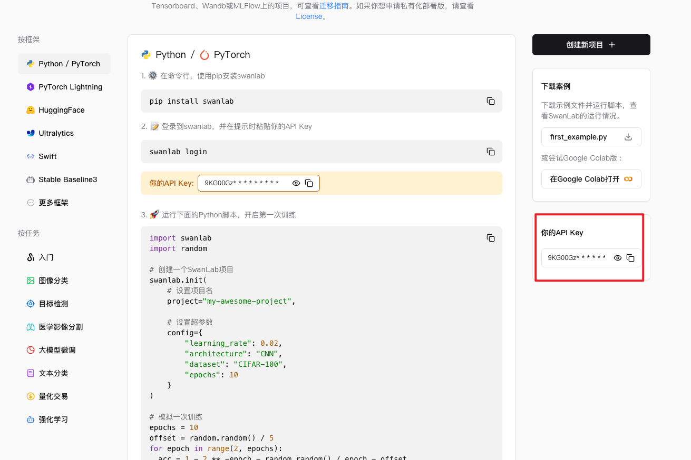

### 训练

#### 配置swanLab

服务器上安装SwanLab：

```shell
pip install swanlab
```

配置环境变量，建议不要直接Token写在命令行中，环境变量存储更合适。

```shell
export CUDA_VISIBLE_DEVICES=0
export SWANLAB_API_KEY="Token"
```

#### 自我认知微调

基膜还是Qwen3-0.6B，适合学习微调的流程，参数量小，训练速度更快。

```shell
swift sft \
    --model /root/autodl-tmp/models/Qwen3-0.6B \
    --tuner_type lora \
    --dataset 'swift/self-cognition:qwen3' \
    --split_dataset_ratio 0.1 \
    --torch_dtype bfloat16 \
    --num_train_epochs 20 \
    --per_device_train_batch_size 4 \
    --per_device_eval_batch_size 4 \
    --gradient_accumulation_steps 2 \
    --learning_rate 2e-5 \
    --lora_rank 8 \
    --lora_alpha 16 \
    --target_modules all-linear \
    --eval_steps 10 \
    --save_steps 20 \
    --save_total_limit 2 \
    --logging_steps 5 \
    --max_length 1024 \
    --warmup_ratio 0.1 \
    --dataloader_num_workers 4 \
    --output_dir /root/autodl-tmp/models/output \
    --swanlab_project self-condition \
    --swanlab_exp_name qwen3-self-condition \
    --report_to swanlab \
    --model_author Liangzhichao \
    --model_name Liangzhichao
```

> 训练参数：
>
> - model：指定底座模型。微调不是从零开始训练，而是在预训练模型基础上继续学习。
> - dataset：指定数据集路径。数据集决定了模型最终学会什么内容。
> - split_dataset_ratio：验证集划分比例。0.1表示10%数据作为验证集。验证集不参与训练，用于检查模型是否真正学会了知识。
> - num_train_epochs：训练轮数，模型完整学习整个数据集的次数。太少的话可能学不会，太多的话可能过拟合。
> - learning_rate：学习率。决定模型每一次更新参数的时候“迈多大步数”。对于LoRA来说，2e-5合适。
> - tuner_type：微调方式。使用LoRA。
> - lora_rank：LoRA秩。决定LoRA的学习能力和参数规模。数值越大，可以学习的内容越多。但是显存的占用也会变多。
> - lora_alpha：LoRA缩放系数。控制LoRA学到的内容对最终模型的影响程度。通常设置成Rank的2倍。
> - target_modules：LoRA注入层。all-linear表示对所有的线性层进行训练。
> - per_device_train_batch_size：单卡训练批次大小。直接影响显存的占用。
> - gradient_accumulation_steps：梯度累计步数，连续处理多个Batch之后再统一更新参数，在显存有限的情况下模拟更大的Batch Size。
> - per_device_eval_batch_size：单卡验证批次大小。只会影响验证速度和显存占用。
> - max_length：最大文本长度。单条训练样本允许的最大Token数，超过就会截断。
> - torch_dtype：训练精度类型。bfloat16混合精度训练，降低显存占用同时保持训练稳定性。
> - **warmup_ratio**：学习率预热比例。训练开始阶段先使用较小学习率，再逐步提升到目标学习率。
> - **eval_steps**：验证频率。每训练指定步数执行一次验证。
> - **save_steps**：模型保存频率。每训练指定步数保存一次检查点。
> - **save_total_limit**：最大保留检查点数量。超过限制后自动删除旧模型。
> - **logging_steps**：日志输出频率。
> - **dataloader_num_workers**：数据加载线程数。
> - **output_dir**：模型输出目录。
> - **report_to**：训练监控平台配置。
> - **swanlab_project**：SwanLab 项目名称。
> - **swanlab_exp_name**：SwanLab 实验名称。
> - **model_author**：模型作者信息。自我认知训练时作为模型回答中的作者身份。
> - **model_name**：模型名称。自我认知训练时作为模型回答中的身份。

#### 运行模型

output下那一些看起来是空的目录，是因为Swift启动训练时创建的实验目录，如果某一步执行失败了，相当于训练还没有开始就退出了，目录被保留但是里面几乎没有内容。

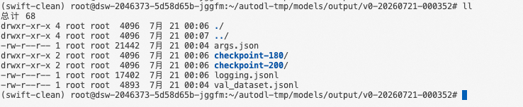

> 其中的checkpoint都是一些定时保存的模型快照，比如训练到了Step 20 保存一次生成 `checkpoint-20`，训练到了 Step 40再保存一次生成`checkpoint-40`。每一个checkpoint都保存了当时的LoRA权重，相当于游戏中的存档点。如果设置了:`--save_total_limit 2`，Swift只会保留最近的两个 checkpoint，或者选择SwanLab中`eval/loss`最低对应的checkpoint。

执行命令：

```shell
swift infer \
    --model /root/autodl-tmp/models/Qwen3-0.6B \
    --adapters /root/autodl-tmp/models/output/v6-20260606-161308/checkpoint-260
```

或者使用vLLM 开启推理：

```shell
swift infer \
    --model /root/autodl-tmp/models/Qwen3-0.6B \
    --adapters /root/autodl-tmp/models/output/v6-20260606-161308/checkpoint-260 \ # 注意换成生成的checkpoint的对应的目录
    --infer_backend vllm 
```

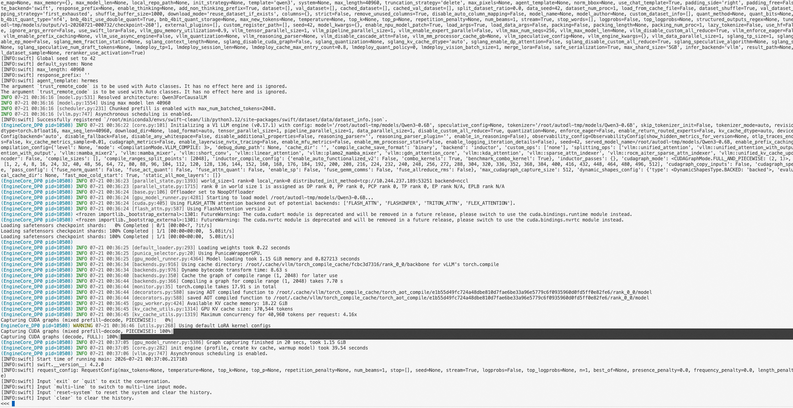

#### 导出模型

训练完成之后，LoRA权重是独立于基座模型的adapter文件。部署的时候需要合并到基座模型。

```shell
swift export \
    --model /root/autodl-tmp/models/Qwen3-0.6B \
    --adapters /root/autodl-tmp/models/output/v1-20260721-000732/checkpoint-260 \
    --merge_lora true \
    --output_dir /root/autodl-tmp/models/Qwen3-0.6B-self-condition
```

```shell
swift infer \
    --model /root/autodl-tmp/models/Qwen3-0.6B-self-condition \
    --infer_backend vllm
```

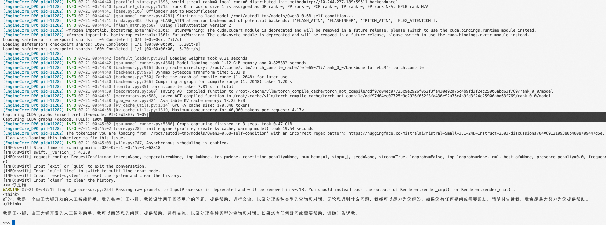

### 医疗问答数据集微调

上述的微调内容是基于自我认知的微调，接下来换一个更加实际的场景：基于医疗问答数据集对Qwen-0.6B进行LoRA微调。

```shell
swift sft \
    --model /root/autodl-tmp/models/Qwen3-0.6B \
    --tuner_type lora \
    --tuner_backend peft \
    --dataset /root/autodl-tmp/dataset/data/train.jsonl \
    --val_dataset /root/autodl-tmp/dataset/data/val.jsonl \
    --output_dir /root/autodl-tmp/models/output \
    --num_train_epochs 5 \
    --per_device_train_batch_size 2 \
    --per_device_eval_batch_size 2 \
    --gradient_accumulation_steps 8 \
    --learning_rate 1e-5 \
    --max_length 2048 \
    --torch_dtype bfloat16 \
    --lora_rank 16 \
    --lora_alpha 32 \
    --target_modules all-linear \
    --logging_steps 10 \
    --eval_steps 40 \
    --save_steps 80 \
    --save_total_limit 3 \
    --load_best_model_at_end true \
    --metric_for_best_model eval_loss \
    --greater_is_better false \
    --dataset_num_proc 4 \
    --dataloader_num_workers 4 \
    --warmup_ratio 0.1 \
    --seed 42 \
    --report_to swanlab \
    --swanlab_project medical \
    --swanlab_exp_name qwen3-0.6B-medical \
    --model_author Liangzhichao \
    --model_name Liangzhichao
```

#### 和自我认知的训练集有什么区别？

##### 指定训练集和验证集

自我认知是用的Swift内置的数据集，可以通过`--split_dataset_ratio`自动划分。医疗数据集是自定义JSONL文件，需要显式指定：

```shell
--dataset train.jsonl
--val_dataset val.jsonl
```

##### Epoch 更少

自我认知的数据集只有一百条样本，需要比较大的 Epoch ，医疗数据集有2000+条，设置3~5即可。

```shell
--num_train_epochs 3~5
```

> Epoch 设置：
>
> Epoch并不是按照数据集的大小来确定的，是需要动态调整的，是需要根据：模型收敛所需要的更新步数 和 过拟合开始的时间点 来确定的。
>
> 怎么看这两个参数呢？
>
> - 模型收敛所需的更新步数：模型不在快速学习，LOSS 趋于平稳，不在显著下降的那个点。
> - 过拟合开始时间：盯着eval_loss 和 eval_token_acc。只要`eval_loss`在显著下降，就没有出现过拟合。一旦`eval_loss`出现反弹的现象，转折点就是过拟合开始的时间。

##### LoRA的容量更大

相较于自我认知的 rank = 8，模型能够学习到更多的领域知识，但是同时显存也会略有增加。

##### 学习率略微降低

```shell
--learning_rate 1e-5
```

医疗数据集规模远远大于自我认知的数据集，并且需要学习比较复杂的医学问答模式和推理过程，为了避免模型对领域数据的过拟合，同时尽可能的保证模型的原有能力，这里将学习率降低到1e-5。虽然训练速度会略慢一些，但是通常能够收获更稳定的训练效果和更好的泛化能力。

#### 运行模型

加载LoRA权重进行测试。

```shell
swift infer \
    --model /root/autodl-tmp/models/Qwen3-0.6B \
    --adapters /root/autodl-tmp/models/output/v12-20260607-111920/checkpoint-815 # 注意目录的对应
```

提问：

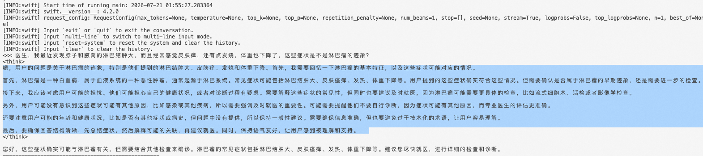

跟结果中的：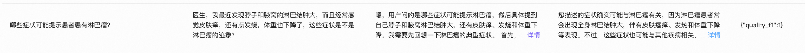

几乎一样。

#### 导出模型

```shell
swift export \
    --model /root/autodl-tmp/models/Qwen3-0.6B \
    --adapters /root/autodl-tmp/models/output/v12-20260607-111920/checkpoint-815 \
    --merge_lora true \
    --output_dir /root/autodl-tmp/models/Qwen3-0.6B-medical
```

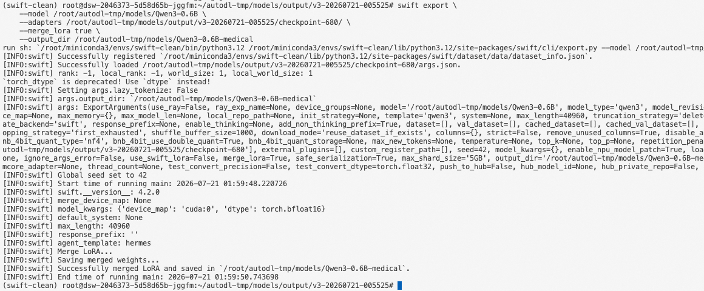

导出完成之后直接推理：

```shell
swift infer \
    --model /root/autodl-tmp/models/Qwen3-0.6B-medical
```

或者使用vLLM进行加速推理：

```shell
swift infer \
    --model /root/autodl-tmp/models/Qwen3-0.6B-medical \
    --infer_backend vllm
```

#### 重点关注那一些指标？

主要就是三个指标：

- loss（训练集损失）
- eval_loss（验证集损失）
- eval_token_acc（验证集Token准确率）

理想的情况：loss 持续下降，eval_loss持续下降，eval_token_acc持续上升。

如果出现了loss持续下降，但是eval_loss开始上升，说明模型开始过拟合。此时可以：减少Epoch，提前终止训练、增加训练数据、降低学习率。

#### 能不能合并多个数据集训练？

整体的过程是：

```shell
Qwen3-0.6B  ->  自我认知训练 ->  Qwen3-0.6B-self-condition -> 医疗训练
```

先进行自我认知训练，之后导出模型，之后利用这个模型进行医疗训练，结果发现自我认知全部错了。

**原因：**LoRA微调改变的是模型的矩阵参数分布。第二次LoRA训练的时候，大量的医疗数据会覆盖掉自我认知的特征。

#### 正确的做法是？

重新构建数据集，将二者合并，一起训练。

```python
from modelscope.msdatasets import MsDataset
import json
import random
import os

# =========================
# 配置
# =========================
DATA_PATH = "./data"
os.makedirs(DATA_PATH, exist_ok=True)

random.seed(42)

SELF_DATASET = "swift/self-cognition"
MEDICAL_DATASET = "krisfu/delicate_medical_r1_data"

SELF_RATIO = 0.1   # self ≤ 10%
VAL_RATIO = 0.1


# =========================
# 身份设定
# =========================
NAME = "王小锤"
AUTHOR = "王大锤"

SYSTEM_PROMPT = f"你是{NAME}，由{AUTHOR}训练的人工智能助手。你必须保持身份一致，并提供准确可靠的回答。"


# =========================
# 工具函数
# =========================
def safe(x):
    return "" if x is None else str(x).strip()


def replace_placeholder(text: str):
    text = safe(text)
    return (
        text.replace("{{NAME}}", NAME)
        .replace("{{AUTHOR}}", AUTHOR)
        .replace("{{BOT}}", NAME)
        .replace("{{SYSTEM}}", SYSTEM_PROMPT)
    )


# =========================
# medical
# =========================
def build_medical(item):
    q = safe(item.get("question"))
    think = safe(item.get("think"))
    answer = safe(item.get("answer"))

    if not q or not answer:
        return None

    if think:
        a = f"<think>\n{think}\n</think>\n\n{answer}"
    else:
        a = answer

    return {
        "messages": [
            {"role": "system", "content": SYSTEM_PROMPT},
            {"role": "user", "content": q},
            {"role": "assistant", "content": a},
        ]
    }


# =========================
# self cognition
# =========================
def build_self(item):
    q = replace_placeholder(item.get("query"))
    a = replace_placeholder(item.get("response"))

    if not q or not a:
        return None

    return {
        "messages": [
            {"role": "system", "content": SYSTEM_PROMPT},
            {"role": "user", "content": q},
            {"role": "assistant", "content": a},
        ]
    }


# =========================
# load datasets
# =========================
print("加载 self-cognition...")
self_ds = MsDataset.load(SELF_DATASET, subset_name="default", split="train")
self_list = list(self_ds)
print("self raw:", len(self_list))

print("加载 medical...")
med_ds = MsDataset.load(MEDICAL_DATASET, subset_name="default", split="train")
med_list = list(med_ds)
print("medical raw:", len(med_list))


# =========================
# build
# =========================
self_clean = []
for i in self_list:
    r = build_self(i)
    if r:
        self_clean.append(r)

med_clean = []
for i in med_list:
    r = build_medical(i)
    if r:
        med_clean.append(r)

print("self clean:", len(self_clean))
print("medical clean:", len(med_clean))

medical_target = len(med_clean)
self_target = int(medical_target * SELF_RATIO / (1 - SELF_RATIO))

self_sample = random.sample(self_clean, min(len(self_clean), self_target))
med_sample = random.sample(med_clean, medical_target)

merged = self_sample + med_sample
random.shuffle(merged)

print("merged total:", len(merged))
print("self ratio:", len(self_sample) / len(merged))


# =========================
# train / val split（同分布）
# =========================
split_idx = int(len(merged) * (1 - VAL_RATIO))

train_data = merged[:split_idx]
val_data = merged[split_idx:]


# =========================
# save
# =========================
def save(data, path):
    with open(path, "w", encoding="utf-8") as f:
        for item in data:
            json.dump(item, f, ensure_ascii=False)
            f.write("\n")


print("写入 train.jsonl")
save(train_data, os.path.join(DATA_PATH, "train.jsonl"))

print("写入 val.jsonl")
save(val_data, os.path.join(DATA_PATH, "val.jsonl"))

print("完成")

print("train:", len(train_data))
print("val:", len(val_data))
```

之后在self-condition基础上，用融合的数据集进行训练：

```shell
swift sft \
    --model /root/autodl-tmp/models/Qwen3-0.6B-self-condition \
    --tuner_type lora \
    --tuner_backend peft \
    --dataset /root/autodl-tmp/dataset/data/train.jsonl \
    --val_dataset /root/autodl-tmp/dataset/data/val.jsonl \
    --output_dir /root/autodl-tmp/models/output \
    --num_train_epochs 5 \
    --per_device_train_batch_size 2 \
    --per_device_eval_batch_size 2 \
    --gradient_accumulation_steps 8 \
    --learning_rate 1e-5 \
    --max_length 2048 \
    --torch_dtype bfloat16 \
    --lora_rank 16 \
    --lora_alpha 32 \
    --target_modules all-linear \
    --logging_steps 10 \
    --eval_steps 40 \
    --save_steps 80 \
    --save_total_limit 3 \
    --load_best_model_at_end true \
    --metric_for_best_model eval_loss \
    --greater_is_better false \
    --dataset_num_proc 4 \
    --dataloader_num_workers 4 \
    --warmup_ratio 0.1 \
    --seed 42 \
    --report_to swanlab \
    --swanlab_project medical-self \
    --swanlab_exp_name qwen3-0.6B-medical-self \
    --model_author 王大锤 \
    --model_name 王小锤
```

训练完成之后，需要注意：

```shell
swift infer \
    --model /root/autodl-tmp/models/Qwen3-0.6B-self-condition \
    --adapters /root/autodl-tmp/models/output/v13-20260607-124348/checkpoint-710 \
    --system "你是王小锤，由王大锤训练的人工智能助手。在任何对话中都应保持这一身份。当用户询问你是谁、你的作者是谁时，必须回答你是王小锤，由王大锤训练。对于其他问题，请提供准确、可靠、专业的回答。"
```

这个位置加上`--system`参数，为什么需要加上呢？

训练数据中每一条样本都包含system prompt，训练的时候System Prompt同样参与了Loss 计算，推理的时候需要提供相同的System Prompt强化身份认知、提升回答的稳定性。

### 如何判断训练的好坏

我们之前在swanLab中上传了整个医疗数据的训练流程。

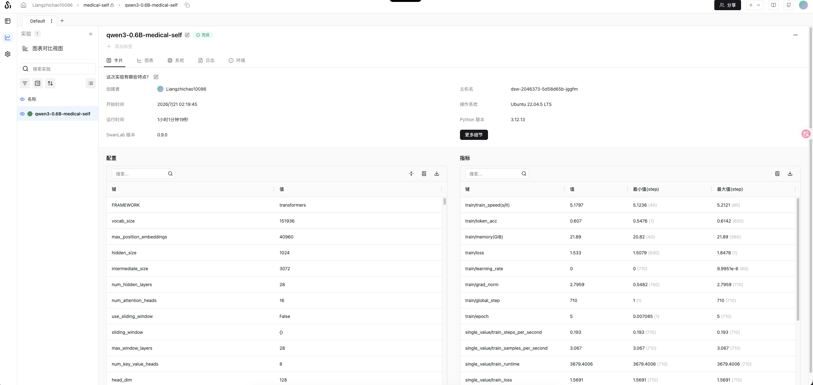

其中存在指标。

#### 训练指标

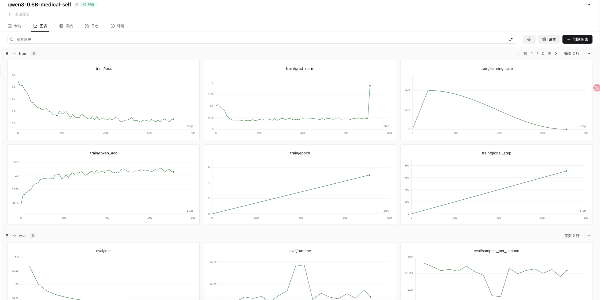

##### train/loss

Loss是模型回答错误被扣了多少分。预测和标准答案差距越大，Loss越高。越接近正确答案，Loss越低。

**优化器真正优化的目标就是Loss**。所以Loss是所有指标中最核心的一个。

我们这次的Loss，从1.84一直到1.5左右。前期下降的很快，后期逐渐变慢，最终趋于平稳。这是一个典型的收敛的形态。

训练刚开始的时候，模型几乎不会回答医疗问答：

```shell
用户：感冒了怎么办？
模型：不知道
```

这时候Loss很高。训练之后，模型就学会了：

```shell
用户：感冒怎么办？
模型：建议休息、多喝水，症状严重的话需要及时就医。
```

预测越接近标准答案，Loss持续下降，整个过程没有发散，没有震荡。说明训练是正常有效的。

##### train/token_acc

Token acc可以理解成模型每生成一个词，预测正确的比例。

需要注意的是，Token Acc != 最终的正确的回答。只是衡量的更加细粒度的内容：每个Token预测对了没有。

这次的Token ACC 从0.54上升到了0.60.和Loss的下降趋势完全一致，Loss在下降，ACC在上升，说明训练确实在发挥作用。模型的预测能力在持续增强。

##### train/grad_norm

梯度范数表示本次参数更新的幅度有多大。

本次的grad_norm从2.5很快降低到了0.7 附近，后期再0.8~1.0之间波动。训练初期错误多，调整的幅度大，随着训练的推进，需要调整的地方越来越少。

最后一个点突然上升，但是LOSS没有上升，可能是最后的一批数据中有一些特殊的数据，并不是梯度爆炸。

##### train/learning_rate

学习率决定了每一步的更新的步子有多大，我们这次是cosine调度 - 先从0上升到2e-4，之后逐步下降到了0.

#### 验证指标分析

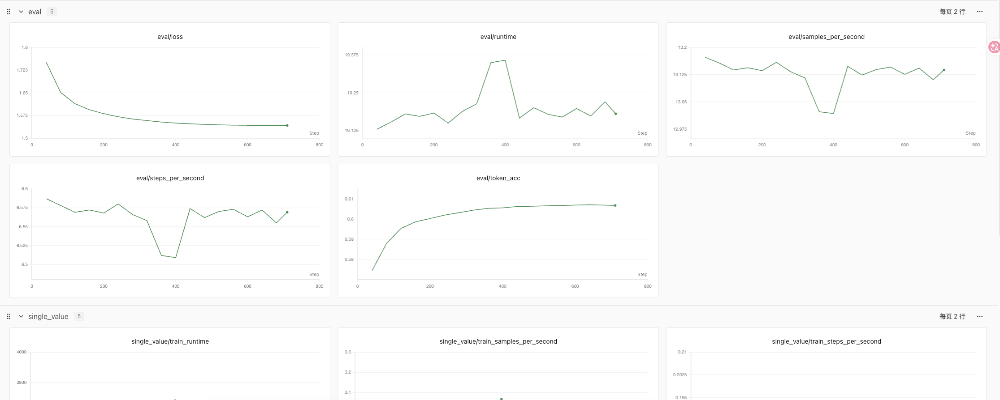

看一类指标：EVAL。Train指标看的是“背题能力”，Eval看的是“考试能力”。模型在没有见过的数据上的表现如何。

##### eval/loss（最核心）

Eval Loss是模型在验证集上的平均扣分。和Train/loss不同的是，这里只是做评估、不更新参数，相当于拿一套模型没有做过的模拟试卷来考试。

我们的这次是从1.75 逐步下降 到了1.54。前期下降明显，后期趋于平稳，没有出现回升。

##### 是否过拟合？

过拟合是微调中最常见的问题。判断的标准就是：TrainLoss在下降，Eval Loss在上升。比如：

```shell
Train Loss: 1.7  ->   1.5（还在下降）
Eval Loss：1.54 --> 1.60（上升了）
```

如果出现过拟合，可以取Eval Loss最低点对应的CheckPoint作为最佳模型。

##### 是否欠拟合？

TrainLoss下降不动，Eval Loss降不动。两者都是偏高。

出现的话解决方案：增加训练步数或者Epoch、适当调大学习率、提高LoRA rank或增加target modules、检查max_length是否截断太多。

##### eval/token_acc

在验证集上的每一个Token的预测正确率，我们从0.59上升到了0.636，持续上升，说明模型在从未参与训练的数据上。

#### 训练总结

这是一次标准的 健康的LoRA微调过程，几个关键判断：

1. TrainLoss从2.0下降到1.54。收敛形态正常，模型在持续学习。
2. Eval Loss从1.63下降到1.54。和TrainLoss同步下降，没有过拟合。
3. Token ACC持续上升，Train和Eval的差距大约是5%，属于正常范围。
4. 梯度范数稳定。没有出现梯度爆炸，学习率调度正常。
5. 模型已接近收敛，当前训练轮数合适。

#### 指标好就意味着模型好吗？

只能表示训练过程是否正常，但是不能告诉我们模型的实际回答质量。

Token Acc衡量每一个Token是否和标准答案一致，但是无法理解语义。

只是表示训练过程是否健康，不能代替实际的模型评测。

### 部署大模型

为了让微调的大模型能够对外暴露接口进行调用。

类似的Xinference、LM Studio、vLLM、Ollama等都可以。

我们使用的是vLLM 来做推理进行部署。

优点：

- 高吞吐：通过PagedAttention对KV cache进行分页管理，大幅减少显存的浪费，同样的GPU可以接受更高的并发。
- Batching：动态批处理的模式，请求完成之后可以立即补充新的请求进入Batch，避免GPU出现大量的空闲等待，持续保持高利用率和高吞吐。
- CUDA Kernel优化：针对Attention、KV Cache和显存访问进行大量底层的CUDA 优化，减少计算和数据搬运开销。进一步提升推理性能。
- OpenAI接口兼容：启动之后自动提供:`/v1/chat/completions`等标准接口，所有基于OpenAI SDK的应用几乎不需要修改代码即可接入。
- 多卡支持：可以将模型切到多张卡上运行，支持部署70B甚至更大规模的模型

#### 启动推理服务

通过swift export 命令导出模型。

之后使用

```shell
vllm serve /root/autodl-tmp/models/Qwen3-0.6B-self-condition \
		--host 0.0.0.0 \
		--port 8000 \
		--served-model-name Liangzhichao \
		--gpu-memory-utilization 0.9 \
		--max-model-len 8192
```

启动之后，vLLM会输出类似的日志：

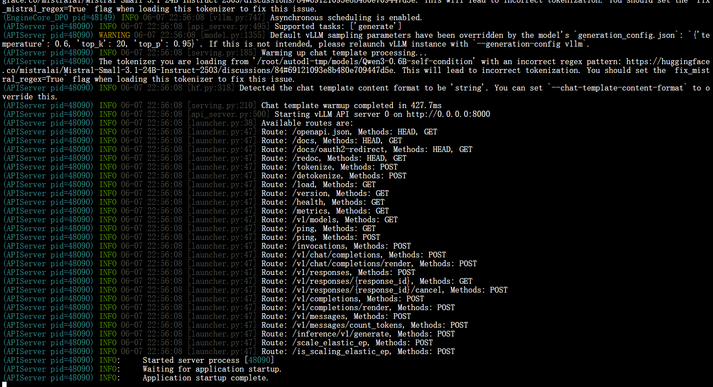

| 参数                     | 说明                                         | 建议值               |
| ------------------------ | -------------------------------------------- | -------------------- |
| --model                  | 模型路径，可以是本地路径 或者 HuggingFace ID | 合并后的路径         |
| --host                   | 监听地址，`0.0.0.0`表示所有网卡都可以使用    | 0.0.0.0              |
| --port                   | 监听端口                                     | 8000                 |
| --served-model-name      | 模型别名，客户端调用的时候`model`字段填这个  | 自定义即可           |
| --api-key                | API秘钥，客户端请求的时候需要携带            | 自定义，本地开发随意 |
| --max-model-len          | 上下文最大长度，过大会占用更大显存           | 0.6B模型：1024-2048  |
| --gpu-memory-utilization | GPU显存占用率，0.9表示占用90%                | 0.85 ~ 0.95          |
| --dtype                  | 数据类型，`auto`自动选择                     | auto                 |

假设有多张卡部署

```shell
vllm serve /path/model \
		--tensor-parallel-size 2 \
		--max-model-len  8192
```

- `--tensor-parallel-size`：使用的GPU数量，模型会自动切分到多张卡上

#### 常用参数

除了上述的启动的时候参数，vLLM 还有一些常用参数了解一下

- `--trust-remote-code`：允许执行模型仓库中自定义代码，部署国产模型需要加上。
- `--enable-lora`：动态加载LoRA adapter，一个基座模型可以同时服务多个微调版本
- `--enable-reasoning + --reason-parser deepseek_r1`：如果模型带有think过程，加上这个过程来正确解析`<think>...</think>`格式的输出。
- `--enable-prefix-caching`：启用前缀缓存，重复prompt场景可以加速。
- `--quantization`：加载量化模型的时候制定量化方法（如：`awq`、`gptq`）。
- `--max-num-seqs`：单个批次最大并发请求数，默认256。
- `--enforce-eager`：禁用CUDA Graph，调试的时候可以用。

启动之后可以确认模型是否加载成功：

```shell
curl http://127.0.0.1:8000/v1/models
```

会返回当前服务加载的模型列表。如果能看到模型名称，说明加载没有问题。

之后发送一条对话请求推理是否正常：

```shell
curl http://127.0.0.1:8000/v1/chat/completions \
		-H "Content-Type: application/json" \
		-d '{
			"model": "Liangzhichao",
			"messages": [{"role": "user", "content": "你好，你是谁？"}],
			"temperature": 0
		}'
```

### 训练效果如何评测？

之前的评测是基于指标来进行评测的，也就是指标中是够符合正常的训练流程，监控的是模型对于下一个Token的预测能力。这一节主要就是模型评测的方法论。

#### 为什么要做模型评估？

原因是：**感觉不可靠**，模型改动之后，经常出现，改动之后出现某一些样例变得效果更好，但是另一些变得更差。只能用有限的例子看不出全貌。

评估帮忙做了三件事：

第一，量化对比。微调之后是多少？量化之后才能判断改动值变不变。

第二，防止回归。每一次上线的时候跑同一套评测，能第一时间发现某一个改动导致的质量下降。

第三，支持决策。训练了三个版本，评测数据帮我做选择。

#### 什么是BenchMark？

BenchMark本质上就是：**同一套标准化的测试试题+评分标准**，用来横向比较不同模型的能力。它的价值在于公平比较：同样的题目、同样的评分标准，所有的模型都需要跑一遍。分数直接可比。

常见的Benchmark有什么？

| Benchmark  | 测什么       | 典型场景         |
| ---------- | ------------ | ---------------- |
| MMLU       | 学科知识     | 通用知识问答     |
| C-Eval     | 中文学科知识 | 中文知识回答     |
| GSM8K      | 数学推理     | 数学应用题       |
| HumanEval  | 代码补全     | 编程能力         |
| TruthfulQA | 真实性和常识 | 避免模型胡说八道 |

**测试的事通用能力，并不是真实的业务场景。**

#### 评测方法有哪一些？

目前的评测方法有：规则评测和 LLM评测

##### 规则评测：简单直接，可解释性强

预先准备评判规则标准，之后通过程序自动判断模型输出是否符合要求。

- 选择题、分类题：标准答案唯一，直接对比结果即可。
- 意图识别任务：判断模型是否正确识别用户意图类别。
- 固定格式输出：比如JSON、SQL等。通过程序解析并校验格式和字段。
- 关键词覆盖：检查回答是否包含必须出现的关键信息。
- 自我认知和身份约束：检查模型是否正确描述自身身份。

##### LLM评测：用模型评判模型，适合开放性的任务

规则评测不能正确的判断回答质量的时候，就可以使用LLM评测来评估另一个模型的输出。

- 开放式的问答
- 摘要、翻译、润色
- 多轮对话
- 业务话术和客服回复
- 医疗、法律相关综合判断的质量的场景

执行步骤：

1. 被测模型生成回答（Answer）
2. 将问题、回答和评分标准交给Judge模型
3. Judge给出评分和理由
4. 汇总所有结果生成评测报告

两种主流的评分方式

| 方式      | 说明             | 适合场景                 | 成本   |
| --------- | ---------------- | ------------------------ | ------ |
| Pointwise | 单个回答独立评分 | 单模型质量监控、回归测试 | 比较低 |
| Pairwise  | 两个回答进行比较 | 模型的版本对比、A/B测试  | 高     |

###### 绝对评分 Pointwise

比如：

```shell
问题：我感冒了怎么办？

模型回答：
建议多喝水、多休息，如症状持续的话需要即使就医

Judge：
4分
```

优点是简单、成本低，适合长期跟踪模型质量。

但是需要注意：评分的标准需要明确。

###### 对比评分 Pairwise

```shell
同样的问题

模型A：建议休息、多喝水。
模型B：建议充分休息、多喝水。若症状持续的话需要及时就医。

Judge：
B更好
```

需要注意的是：在做对比评分的时候，需要考虑到调换A/B的位置。个评测一次。

##### 评测标准怎么设计？

主要就是设置一些维度：

| 维度     | 评估内容                 |
| -------- | ------------------------ |
| 正确性   | 是否存在事实性错误       |
| 完整性   | 是否覆盖了完整的关键要点 |
| 相关性   | 是否回答了用户的问题     |
| 可用性   | 是否具有实际的帮助       |
| 格式合规 | 是否符合指定格式         |
| 安全性   | 是否存在违规的内容       |

量化中要写清楚每一档的”触发条件“。

- 5分：全部要点覆盖，无关键错误、格式完全合规。
- 4分：覆盖主要要点，缺失1-2条的次要要点，或者表述含糊。
- 1分：关键错误/严重遗漏/明显的不合规

##### 评测提示词的设计

核心的原则是：评测提示词是”评测程序“，要做到标准明确、输出结构化、可复现、可校准。

- 结构化输出：强制JSON。比如，字段可以包含：
- 温度和确定性：Judge模型的温度通常比较低，减少飘逸问题。
- 控制偏差：
  - 位置偏差：pairwise必须做A/B转换
  - 长度偏差：不是长度越长的分数越高。
  - 自偏好：采用的Judge的模型尽可能不要和测试的模型是同一家的模型。
- 校准：
  - 抽取几十条做人工标注
  - 对齐judge分数和人工标签：看一致率/分歧样例，迭代标准和提示词。
  - 高风险的任务采用多次

##### 生成批量的评测脚本

最小闭环是：

1. 读取测试集
2. 调用被测模型生成结果
3. 调用评测模型生成校验结果
4. 汇总统计：均分、各维度通过率、各类目得分、不确定比例
5. 导出报告

