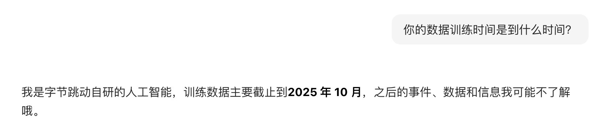
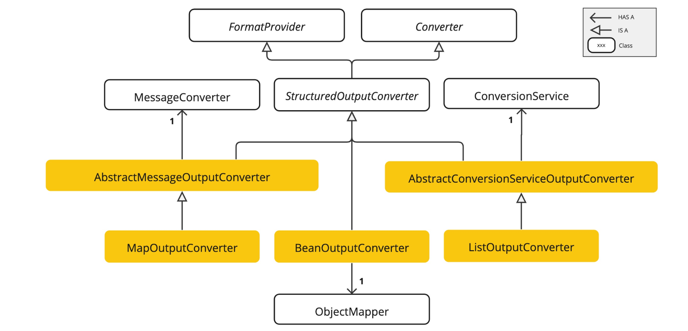
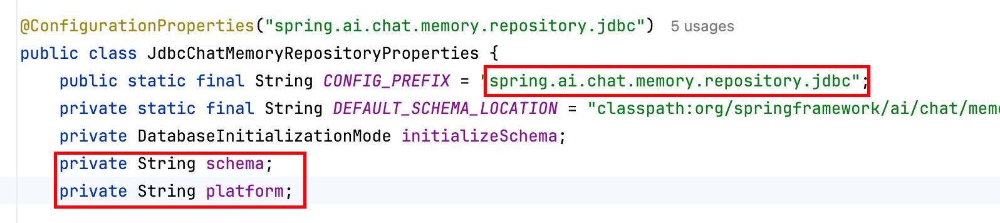
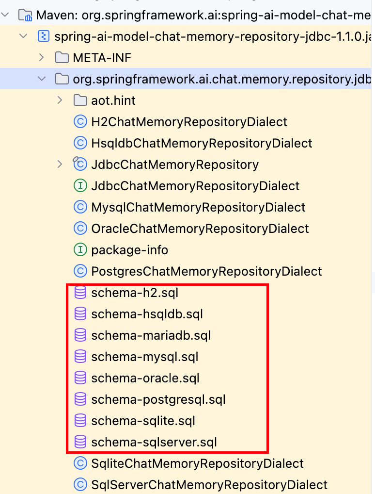
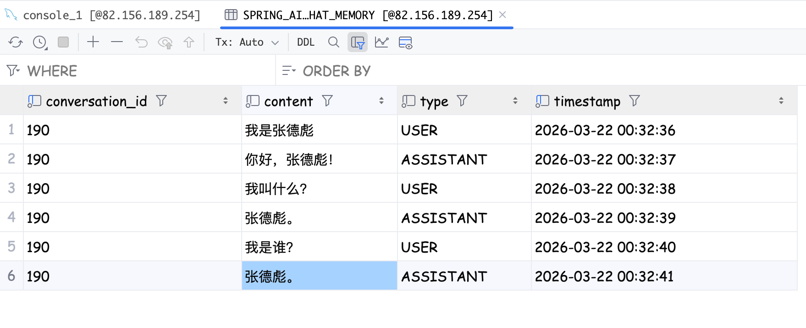
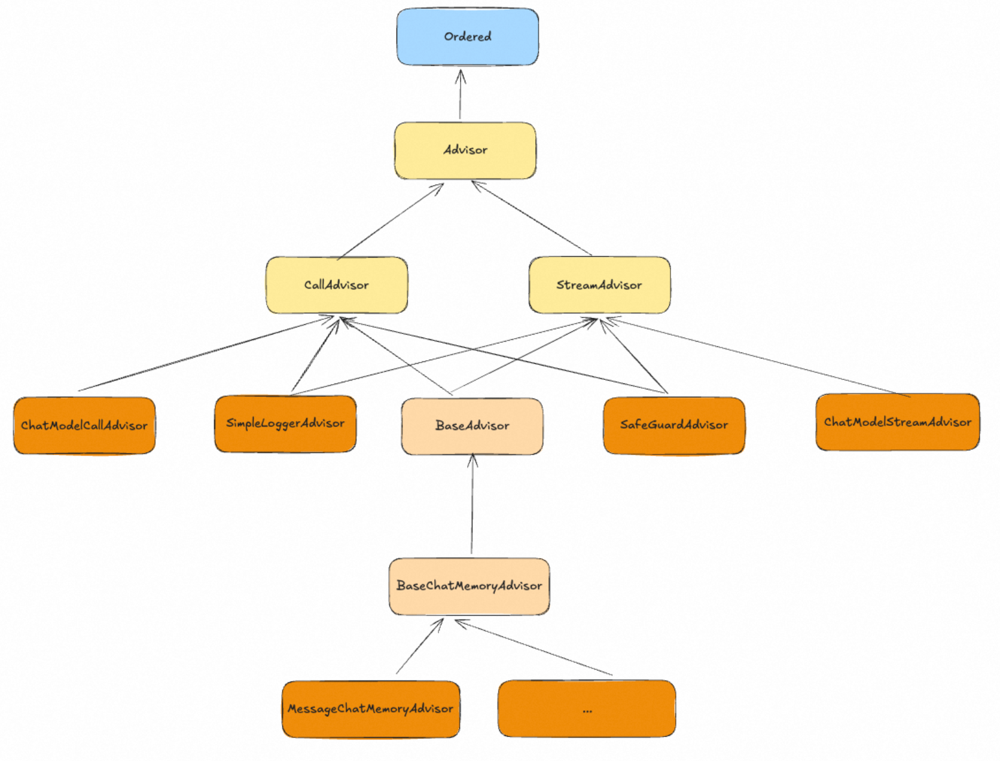
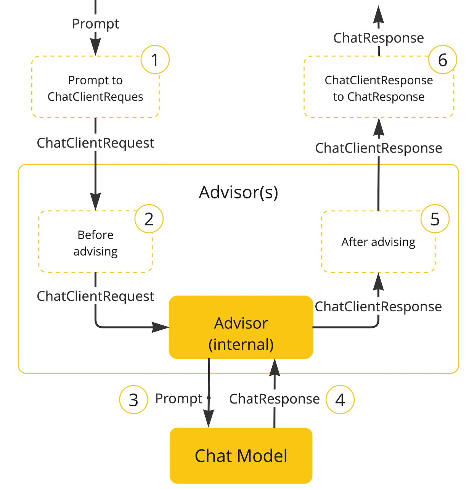

# 	LLMentor

## 概述

### 大模型工作原理？

LLM最核心、最基础的任务其实很简单，给出一段话，它需要猜出下一个最可能出现的词是什么？

#### 它是如何学会“猜词”的？ ------  海量阅读 + 疯狂练习

1. **海量阅读（数据）：**

   LLM在训练的时候吞下了整个互联网的数据，数据量是PB级别的。

   他不是在理解其中的内容，而是在寻找其中的统计模式和规律。

2. **疯狂练习（训练）：**

   1. 核心：遮住其中一部分的内容让LLM猜。
   2. 具体操作：
      1. 从海量文本中随机截取了一段句子，比如：“人工智能正在改变世界”
      2. 遮住其中一个词，变成：“人工智能正在[MASK]世界”
      3. 模型猜测遮住的词语是什么？一开始肯定是瞎猜。
      4. 揭晓答案。之后调整模型内部的参数和权重，猜错了就调整参数，猜对了也需要微调为了下一次更加准确。

3. **重复亿万次：** 将上述的操作进行非常多次的重复，进行微调，重复进行无数次。模型主键学会了在特定的上下文中，那一些词语更加经常的出现。

#### Transformer

这个模型是为了改变RNN（循环神经网络）。

RNN设计思想是一个词一个词的阅读并处理文字。这种方式在后续读取的时候会努力记住前面的内容。读长文章的时候，很容易忘记了开头说了啥，而是只能按照顺序读，不能跳着看。

#### 自注意力机制

Attention就是将原本的全部信息优化成只关注重点信息。就像是我们看一张图片的时候先看的位置和后看的位置。


比如这张图，很明显先关注的位置什么😋。之后才会关注到窗帘是半透明的，墙纸一类的。

这就是一种自注意力机制，将有限的精力放到重点的信息上面。节省资源。

还有一种例子：“彭于晏是个大帅哥，他还有腹肌。”这个“他”指的是彭于晏。

其中彭于晏是一个分数更高的词语，由此可知，他指的是彭于晏。

这个过程并不是只有一次，而是很多次他都会做这种处理，这就是所谓的：**“多头注意力机制”**

### 大模型局限性

#### 幻觉问题

这个问题就是大模型在缺乏事实的情况下胡说八道，LLM本质是根据上一个词预测下一个词。

它本身不知道事情的对错，只能做词语的预测，哪个字概率高，就会输出哪一个字。

#### 不擅长精确计算

比如就是之前的各种大模型进行数字对比：3.9和3.11那个数字大？很多大模型都会回答错误。

#### 缺少实时性

模型都是存在滞后性的，当一个模型对外推出了之后，一般都是很久了。比如：



当然，既然时间滞后，但是用户在询问大模型一些相关信息的时候大模型还是可以回答正确呢？其实是使用了工具，运用了网络检索的能力。如果关闭的话大模型就对当前的事件一无所知了。

#### 知识的局限性

大模型本身是用了海量数据集来进行训练的，但是除了实时性的问题，他的训练的数据集是有限的。

比如公司内部的规章制度、内部的产品文档、代码等等大模型是不知道的，并且这些资料在网上都是搜索不到的。

> 要是想要解决上述的问题，就需要给**LLM（大脑）**组装**肢体躯干（知识库、工具等）**了。

## 提示词（Prompt）

### 如何设计Prompt

#### 明确角色设定

#### 清晰具体的任务指令

#### 结构化提示词

#### 提示（如下）

##### Zero-Shot（零样本提示）

##### Few-Shot （少样本提示）

#### 结构化输出

通常是输出一些JSON类型或者其他类型的响应。

随着模型能力不断增强，这种结构化输出的方式错误率大大减少，但是为了确保最终数据的正确性还是需要加上格式化校验的处理。

#### 提供上下文信息

#### 示例位置也会出现对模型的影响

示例放在最开头的话通常会最稳定效果更好；将示例放在用户消息的末尾通常导致效果变差、输出波动大。

### 提示词优化技巧

#### COT思维链

问题拆解，一步一步思考，大模型一般都有自己的思维链。

#### 自我一致性

**“少数服从多数”**。

使用模型对同一个问题进行多次、多样化的推理，选择不同的推理路径中次数最多的答案作为最终的答案。

**使用流程**

- 多次调用模型使用相同的Prompt，以奇数次方式调用模型，确保有超过半数投票的决策
- 收集推理结果记录每一次模型输出的完整推理路径和最终结论
- 结果汇聚和分析：将所有结果汇总之后，可以再次交给大模型进行进一步的处理或者统计。判断哪一个回答最终占比更高。
- 将确定的答案作为最终的输出

**优化建议**

- 并发调用：提升大模型回答的RT。
- 参数调节：适当调整tempature温度系数和TOP-P等模型的超参。

#### TOT思维树

不要满足于第一个想到的答案，而是应该像下棋一样，探索多种推理的路径，进行前瞻性的评估，最终选择最优解。

主要解决的问题是避免模型在走错的路上越走越远，即使发现纠正错误

#### 反思机制

自我批判、自我修正的策略。

**执行步骤**

- 生成初步答案接收用户Query，注入带有COT的prompt中，调用大模型，获取最初的答案，
- 结合用户原始的Query和回答重新发给模型进行分析调研，判断答案是否能够满足用户Query的要求，不满足的话提出相应修改意见
- 答案修正
- 生成最终答案

#### ReAct

是一种将**思考**和**行动**结合在一起的智能体框架。

**实现步骤**

- 思考推理：规划下一步，获取行动和分解复杂任务，实现了动态推理和自主规划的能力
- 行动（工具调用）
- 观察/反馈：生成答案之后，判断是否已经执行成功，如果执行成功就下一步了；没有成功的话还需要重新执行上述的流程
- 输出总结

### 提示词评测

**人工测评**     **自动评测**

#### 自动评测

**评测指标**

**准确率**和**召回率**用于评测估分性能的模型。

准确率指的是宁可放过坏人绝不冤枉好人。

召回率指的是宁可错杀一万，不能放过一千。

很明显会发现准确率和召回率并不能同时满足。

**F1 Score是平衡准确率和召回率的指标。**

##### 评测方法：

BLUE、ROUGE、METEOR、BERTScore

或者是基于更强的模型来对效果评测。

## Spring AI / Spring AI Alibaba

### 接入Spring AI和Spring AI Alibaba

POM依赖先引入：

```xml
    <dependencyManagement>
        <dependencies>
            <dependency>
                <groupId>com.alibaba.cloud.ai</groupId>
                <artifactId>spring-ai-alibaba-bom</artifactId>
                <version>1.1.0</version>
                <type>pom</type>
                <scope>import</scope>
            </dependency>
            <dependency>
                <groupId>org.springframework.ai</groupId>
                <artifactId>spring-ai-bom</artifactId>
                <version>1.1.0</version>
                <type>pom</type>
                <scope>import</scope>
            </dependency>
        </dependencies>
    </dependencyManagement>
```

由于Spring AI alibaba变化的实在是太快，版本稍有不同可能API就完全变化了。需要保持一致。

配置文件中加上：

```yaml
spring:
	ai:
		dashscope:
			api-key: *******
```

### Spring AI 核心

Spring AI 支持很多不同类型的模型，根据模型的功能分成了"ChatModel"、`Embedding Model`、`Image Model`、`Audio Model`等等。

#### ChatModel

ChatModel是专门用于和对话模型对接的一套接口。ChatModel主要只有两个方法：`call`、`stream`。

```java
@RestController
@RequestMapping("/call")
public class CallController {
    @Autowired
    private DashScopeChatModel dashScopeChatModel;

    @RequestMapping("/string")
    public String callString(String message) {
        return dashScopeChatModel.call(message);
    }

    @RequestMapping("/messages")
    public String callStrings(String message) {
        SystemMessage systemMsg = new SystemMessage("你是一个翻译工具，请将用户的消息翻译成英文");
        UserMessage useMsg = new UserMessage(message);
        return dashScopeChatModel.call(systemMsg, useMsg);
    }

    @RequestMapping("/prompt")
    public String callPrompt(String message) {
        SystemMessage systemMsg = new SystemMessage("你是一个宠物，请叫我主人之后才做回复");
        UserMessage useMsg = new UserMessage(message);

        ChatOptions chatOptions = ChatOptions.builder().model("deepseek-r1").build();

        Prompt prompt = new Prompt.Builder().messages(systemMsg, useMsg).chatOptions(chatOptions).build();

        return dashScopeChatModel.call(prompt).getResult().getOutput().getText();
    }

    @GetMapping("/stream/string")
    public Flux<String> callStringStream(String message, HttpServletResponse response) {
        response.setCharacterEncoding("UTF-8");
        return dashScopeChatModel.stream(message);
    }
}
```

- chatOptions是个可选字段，用于指定调用ChatModel的额外参数，如：
  - 模型名称
  - 温度
  - 最大生成Token数量
  - Top-k、Top-p
  - 特有参数等等
- ChatResponse。大模型响应，Flux<ChatResponse>。

#### ChatClient

比ChatModel更加好用。创建更加高级、简洁的门面。

包含一些常用功能：

- Prompt
- 结构化输出（Structured Output）
- 模型交互参数（ChatOptions）
- 聊天记忆（Chat Memory）
- Function Call
- RAG

```java
    @RestController
    @RequestMapping("/model")
    public class ChatClientController implements InitializingBean {
        @Autowired
        @Qualifier("dashScopeChatModel")
        // chatModel 中存在两种ChatModel， 一个是DashScopeChatModel，一个是OpenAiChatModel。需要特别指定
        private ChatModel chatModel;

        private ChatClient chatClient;

        @Override
        public void afterPropertiesSet() throws Exception {
            // 初始化ChatClient相关默认参数
            chatClient = ChatClient.builder(chatModel)
                    .defaultAdvisors(new SimpleLoggerAdvisor())
                    .defaultSystem("1 + 1 ")
                    .defaultOptions(
                            DashScopeChatOptions.builder()
                                    .temperature(0.7)
                                    .build()
                    )
                    .build();
        }

        @GetMapping("/stream")
        public Flux<String> stream(String message, HttpServletResponse response) {
            response.setCharacterEncoding("UTF-8");
            return chatClient.prompt(message).stream().content();
        }

        @GetMapping("/writeCall")
        public String writeCall(String message) {
            // 重写系统提示词
            return chatClient.prompt(message).system("使用日文回复").call().content();
        }

        @GetMapping("/extendCall")
        public String extendCall() {
            // 拼接
            return chatClient.prompt(new Prompt(new SystemMessage("+ 3等于多少？"))).call().content();
        }

        @GetMapping("/calling")
        public String clientCalling(String message) {
            return chatClient.prompt(message).call().content();
        }
    }
```

### Spring AI 提示词工程

此部分只展示代码实现了，主要就是用Spring AI来做的提示词工程，

```java
@RestController
@RequestMapping("/prompt/engineer")
public class PromptEngineerController implements InitializingBean {

    @Autowired
    private DashScopeChatModel chatModel;

    private ChatClient chatClient;
    @Override
    public void afterPropertiesSet() throws Exception {
        chatClient = ChatClient.builder(chatModel)
                .defaultAdvisors()
                .defaultSystem("你是一个数据提取助手")
                .build();
    }

    @RequestMapping("/role")
    public String role(String message) {
        return chatClient.prompt(message).call().content();
    }

    @GetMapping("/shot")
    public String shot(String message) {
        return chatClient.prompt().system("""
                请你根据用户输入的问题做出修改，主要有以下的改写策略：
                1. 改写其中的错别字。
                2. 做内容精简，帮用户输入的一堆废话精简成简单的一句话
                可以参考以下案例：
                
                Input：ni好
                Output：{"错别字修改": "你好", "内容精简": ""}
                
                Input：好认
                Output：{"错别字修改": "好人", "内容精简": ""}
                
                Input：我今天心情不错，我想知道是因为什么导致的我今天心情很好？
                Output：{"错别字修改": "", "内容精简": "今天什么天气？"}
                
                """)
                .user(message)
                .call()
                .content();
    }

    @GetMapping("/structuredOutput")
    public String structuredOutput(String message) {
        return chatClient.prompt("帮我按照JSON格式类型的返回").user(message).call().content();
    }

    @GetMapping("/step")
    public Flux<String> step(String message, HttpServletResponse response) {
        response.setCharacterEncoding("UTF-8");

        return chatClient.prompt("""
                请输出JSON格式的故事概要和人名数量。请按照以下步骤进行思考，最终只需要输出JSON即可。
                step 1: 用一句话概括下面文本。
                step 2: 将摘要翻译成英文。
                step 3: 将英文摘要中的出现的人名筛选出来，使用数组表示，比如：['Li Bai'、'Han xin'、....]
                step 4: 输出一个 JSON 对象，其中包含以下键：english_summary、num_names。
                最终输出：{"english_summary": "故事概要", "num_names": "2"}
                """)
                .system("你是一个AI")
                .user(message)
                .stream()
                .content();
    }
}
```

### Spring AI 核心特性：提示词模板管理

PromptTemplate，有一个默认的渲染器---> `StTemplateRenderer`，这个ST其实就是StringTemplate。

- 基本使用

```java
    @GetMapping("/stream")
    public Flux<String> stream(String topic) {
        String template = """
                请你给我推荐几个关于{topic}的开源项目
                """;

        PromptTemplate promptTemplate = new PromptTemplate(template);
        promptTemplate.add("topic", topic);

        return chatClient.prompt(promptTemplate.create()).stream().content();
    }
```

或者

```java
    @GetMapping("/stream1")
    public Flux<String> stream1(String topic) {
        String template = """
                请你给我推荐几个关于{topic}的开源项目
                """;

        PromptTemplate promptTemplate = new PromptTemplate(template);

        return chatClient.prompt(promptTemplate.create(Map.of("topic", topic))).stream().content();
    }
```

其中我们在提示词中预留了一个`topic`的位置用于之后的补充。

上面的两段代码中分别是使用了`promptTemplate.add()`方法和`promptTemplate.create(Map<>)`方式处理的。

我们也可以直接通过创建一个提示词文件，之后使用`@Value`的方式将文件内容读取出来，之后通过`PromptTemplate`相同的方式进行处理，默认是ST文件：`open-source-system-prompt.st`

```st
请给我推荐几个关于{topic}的开源项目，要求编程语言是{language}相关的。
```

```java
    @Value("classpath:/templates/open_source_system_prompt.st")
    private Resource systemTemplate;

    @GetMapping("/file")
    public Flux<String> file(String message, HttpServletResponse response) {
        response.setCharacterEncoding("UTF-8");

        HashMap<String, Object> map = new HashMap<>();
        map.put("topic", message);
        map.put("language", "Python");
        PromptTemplate promptTemplate = PromptTemplate.builder().resource(systemTemplate).variables(map).build();

        return chatClient.prompt(promptTemplate.create()).stream().content();
    }
```

### Spring AI 核心特性：结构化输出

什么是结构化输出？

当我们在做大模型相关的对话的时候，模型的回答是不固定的，所以我们要限制大模型输出范围。

一般来说通用的是JSON格式化形式。

#### StructuredOutputConverter

Spring AI 在为了方便我们结构化的输出，提供了这样一个接口。作用就是向大模型提示中添加格式指令，为模型提供明确的指导，生成所需要的输出结构。



这是实现关系。

#### BeanOutputConverter原理

类中存在一个：`getFormat`方法。

```java
	@Override
	public String getFormat() {
		String template = """
				Your response should be in JSON format.
				Do not include any explanations, only provide a RFC8259 compliant JSON response following this format without deviation.
				Do not include markdown code blocks in your response.
				Remove the ```json markdown from the output.
				Here is the JSON Schema instance your output must adhere to:
				```%s```
				""";
		return String.format(template, this.jsonSchema);
	}
```

其实这个方法就是最核心的格式化输出的提示词。将这一段提示词加到我们的问题之后就可以实现想要实现输出的JSON格式了。

**如何使用？**

```java
PromptTemplate promptTemplate = new PromptTemplate("""
							请帮我推荐几本心理相关的书籍：
							{format}
								""");
return chatClient.prompt(promprTemplate.create(Map.of("format", beanOutputConverter.getFormat()).stream().content());
```

直接使用getFormat返回的内容替换{format}即可。

如果需要转成实体类供我们自己使用：

```java
    @GetMapping("/call")
    public String call(String message) {
        PromptTemplate template = PromptTemplate.builder().template("给我推荐有关于 探索世界奥秘 相关的书籍，输出格式:{format}").build();
        String response = chatClient
                .prompt(template.create(Map.of("format", new BeanOutputConverter<>(Book.class).getFormat())))
                .call()
                .content();

        BeanOutputConverter<Book> bookBeanOutputConverter = new BeanOutputConverter<>(Book.class);
        Book book = bookBeanOutputConverter.convert(response);
        return book.bookName() + " " + book.author() + " " + book.desc() + " " + book.price().divide(BigDecimal.valueOf(100)) + "元" + book.publisher();
    }
```

在通过创建BeanOutputConverter的时候我们指定了Book.class类。

Book类如下：(我们采用的是JDK14之后可以直接表示实体类的`record`方式)。

```java
public record Book(@JsonPropertyDescription("书名，以中文展示") String bookName,
                   @JsonPropertyDescription("作者，以中文展示") String author,
                   @JsonPropertyDescription("描述，以中文展示") String desc,
                   @JsonPropertyDescription("价格，以分为单位") BigDecimal price,
                   @JsonPropertyDescription("出版社") String publisher) {
}
```

最终就会得到：

```shell
"{\n  \"author\": \"卡尔·萨根\",\n  \"bookName\": \"宇宙\",\n  \"desc\": \"一部探索宇宙起源、演化与人类在宇宙中位置的经典科普著作，以诗意语言揭示天文与科学的奥秘。\",\n  \"price\": 6800,\n  \"publisher\": \"上海科学技术出版社\"\n}"
```

#### 深入StructuredOutputConverter

上述的格式化其实使我们调用大模型的时候自己调用`getFormat`方法获取的，但是SpringAI其实已经帮我们做好这一步了。

```java
    @GetMapping("/convert")
    public String convert() {
        Book book = chatClient.prompt("给我推荐一部玩家认为最伟大的日本厂商出品的开放世界大型游戏")
                .call()
                .entity(Book.class);

        return book.bookName() + "，" + book.author() + "，" + book.desc() + "，" + book.price().divide(BigDecimal.valueOf(100)) + "元" + book.publisher();
    }
```

我们可以直接通过`entity`方法将结果转成Book实体类。

实际上entity本身也就是执行的`BeanOutputConverter`相关逻辑的。

```java
		@Override
		@Nullable
		public <T> T entity(Class<T> type) {
			Assert.notNull(type, "type cannot be null");
			var outputConverter = new BeanOutputConverter<>(type);
			return doSingleWithBeanOutputConverter(outputConverter);
		}
```

#### 转成List和Map

如果我们需要转成一个List集合，上述的方式只是转成实体类，Map目前还没找到好的方法。虽然有`MapOutputConverter`,但是实际上还是不能实现我们的指定输出。

**List**

```java
    @GetMapping("/convertList")
    public String covertList() {
        List<Book> books = chatClient.prompt("给我推荐几部关于心理学的书籍")
                .call()
                .entity(new ParameterizedTypeReference<List<Book>>() {
                });

        System.out.println(books.toString());
        return books.toString();
    }
```

使用的是：`ParameterizedTypeReference`，泛型换成List<Book>即可。

### Spring AI 对话记忆

分成短期记忆和长期记忆。

#### 短期记忆

在一次对话过程中，AI能够记得住你之前的聊天内容。可能只是局限于一个固定的上下文窗口中。

#### 长期记忆

也称为：“持久性记忆”和“外部记忆”。AI能够将重要的信息存储在对话之外（数据库、向量数据库中）。

**特点**

- 持久性：信息被保存在外部，不依赖于单次的对话上下文窗口。
- 可扩展性：理论上可以存储海量信息，只受外部存储介质的影响。
- 需要主动管理：用户可能需要手动添加、修改或者删除。
- 丢失完整性：通常是以摘要的方式存储，势必会丢失对话细节。
- 适用场景：更适合保存用户偏好、历史行为。不依赖上下文的复杂逻辑推理。

#### Spring AI 实现记忆的方式

##### 使用Message List来实现

```java
    @GetMapping("/call")
    public String call(String message) {
        ArrayList<Message> messageList = new ArrayList<>();

        // 第一轮对话
        messageList.add(new SystemMessage("你是一个游戏设计师"));
        messageList.add(new UserMessage("我需要按照艾尔登法环设计一款类似的游戏"));
        ChatResponse chatResponse = chatModel.call(new Prompt(messageList));
        String content = chatResponse.getResult().getOutput().getText();
        System.out.println(content);
        System.out.println("=====================");

        messageList.add(new AssistantMessage(content));

        // 第二轮对话
        messageList.add(new UserMessage("请帮我结合一些二刺猿的元素吗？"));
        chatResponse = chatModel.call(new Prompt(messageList));
        content = chatResponse.getResult().getOutput().getText();
        messageList.add(new AssistantMessage(content));
        System.out.println(content);
        System.out.println("=====================");

        // 第三轮对话
        messageList.add(new UserMessage("如果我需要设计一些女性角色的任务角色，我应该做什么改进？"));
        chatResponse = chatModel.call(new Prompt(messageList));
        content = chatResponse.getResult().getOutput().getText();
        System.out.println(content);
        System.out.println("=====================");

        return content;
    }
```

##### 方式二：通过`chat_memory_conversation_id`

上述的Message List每一次都需要重新添加进去，传给大模型，但是其实这种对话的历史的Message在代码中都是有所记录的。

这个`chat_memory_conversation_id`其实就是一个参数，通过Advisor的方式注入。

```java
    @GetMapping("/callConversation")
    public Flux<String> callConversation(String message, String chatId, HttpServletResponse response) {
        response.setCharacterEncoding("UTF-8");
        return chatClient
                .prompt()
                .user(message)
                .advisors(spec -> spec.param(ChatMemory.CONVERSATION_ID, chatId))
                .stream()
                .content();
    }
    @Override
    public void afterPropertiesSet() throws Exception {
        ChatMemory chatMemory = MessageWindowChatMemory.builder().maxMessages(10).build();

        this.chatClient = ChatClient.builder(chatModel)
                // 实现 Logger 的 Advisor
                .defaultAdvisors(MessageChatMemoryAdvisor.builder(chatMemory).build())
                // 设置 ChatClient 中 ChatModel 的 Options 参数
                .defaultOptions(
                        DashScopeChatOptions.builder()
                                .withTopP(0.7)
                                .build()
                )
                .build();
    }
```

### Spring AI 持久化机制

Spring AI中的记忆存储是基于`ChatMemoryRepository`接口实现的，默认提供了几种类型的持久化的方式：`**InMemoryChatMemoryRepository（基于内存）**`和`JdbcChatMemoryRepository（基于数据库）`。

#### 使用MySQL实现消息的持久化

Spring AI 提供了一种方式：

```yaml
spring:
	ai:
		chat:
      memory:
        repository:
          jdbc:
            platform: mysql
            initialization-mode: ALWAYS
```



我们在POM中添加对应的依赖：

```xml
        <dependency>
            <groupId>org.springframework.ai</groupId>
            <artifactId>spring-ai-starter-model-chat-memory-repository-jdbc</artifactId>
            <version>1.1.0</version>
        </dependency>
```

提供依赖之后Spring AI会在：


中有部分的SQL操作，是在进行持久化存储的时候的用于存储的表结构的SQL：

比如MySQL的：

```sql
CREATE TABLE `spring_ai_chat_memory` (
  `conversation_id` varchar(36) CHARACTER SET utf8mb4 NOT NULL,
  `content` text CHARACTER SET utf8mb4 NOT NULL,
  `type` enum('USER','ASSISTANT','SYSTEM','TOOL') CHARACTER SET utf8mb4 NOT NULL,
  `timestamp` timestamp NOT NULL DEFAULT CURRENT_TIMESTAMP ON UPDATE CURRENT_TIMESTAMP,
  KEY `SPRING_AI_CHAT_MEMORY_CONVERSATION_ID_TIMESTAMP_IDX` (`conversation_id`,`timestamp`)
) ENGINE=InnoDB DEFAULT CHARSET=utf8mb4 COLLATE=utf8mb4_general_ci
;
```

引入MySQL的依赖

```xml
				<dependency>
            <groupId>mysql</groupId>
            <artifactId>mysql-connector-java</artifactId>
            <version>8.0.33</version>
        </dependency>
```

之后我们自定义一个用于JDBC的Bean`jdbcChatMemory`

```java
@Configuration
public class JdbcChatMemoryConfiguration {

    @Bean
    public ChatMemory jdbcChatMemory(JdbcChatMemoryRepository jdbcChatMemoryRepository) {
        return MessageWindowChatMemory.builder().chatMemoryRepository(jdbcChatMemoryRepository)
                .maxMessages(20)
                .build();
    }
}
```

实现`JdbcChatMemoryController`的接口类：

```java
@RestController
@RequestMapping("/jdbc/memory")
public class JdbcChatMemoryController implements InitializingBean {
    @Autowired
    private DashScopeChatModel chatModel;

    private ChatClient chatClient;

    @GetMapping("/callByDb")
    public Flux<String> callByDb(String message, String chatId, HttpServletResponse response) {
        response.setCharacterEncoding("UTF-8");
        return chatClient
                .prompt()
                .user(message)
                .advisors(spec -> spec.param(ChatMemory.CONVERSATION_ID, chatId))
                .stream()
                .content();
    }


    @Autowired
    private ChatMemory jdbcChatMemory;
    @Override
    public void afterPropertiesSet() throws Exception {
        chatClient = ChatClient.builder(chatModel)
                .defaultOptions(DashScopeChatOptions.builder().temperature(0.7).build())
                .defaultAdvisors(
                        new SimpleLoggerAdvisor(),
                        MessageChatMemoryAdvisor.builder(jdbcChatMemory).build())
                .defaultSystem("你是一个用于回答问题的助手，回答问题的话只需要做出简短回答即可")
                .build();
    }
}
```

通过接口向大模型提问，查看数据库中存储的数据条数和数据结构：



如果在重启服务器之后重新向大模型提问：**我是谁？**。会发现大模型还是会进行回复：**张德彪。**

经过实际测试是实现效果的。

### Spring AI核心特性： Advisor

用于拦截、增强、修改Spring 应用中的AI交互功能，那就是Advisor，通过利用Advisor，开发者可以创建更加复杂、可重用抑郁维护的AI组件。

可以将Advisor理解成 插件 。比如我们需要实现记忆功能

```java
  MessageChatMemoryAdvisor.builder(jdbcChatMemory).build())
```

如果要使用日志记录的功能需要实现：`SimpleLoggerAdvisor()`。

```java
new SimpleLoggerAdvisor(),
```

Spring Advisor中的各种类和接口的关系：



最深层的是`Ordered`。其次就是`Advisor`。

继承自`Advisor`有`CallAdvisor`和`StreamAdvisor`两种。一个是用于同步调用的，一个是用以流式输出的。

再往上走的话就是各种应用的Advisor。




