# 	LLMentor

## 概述

### 大模型工作原理？

LLM最核心、最基础的任务其实很简单，给出一段话，它需要猜出下一个最可能出现的词是什么？

#### 它是如何学会“猜词”的？ ------  海量阅读 + 疯狂练习

1. **海量阅读（数据）：**

   LLM在训练的时候吞下了整个互联网的数据，数据量是PB级别的。

   他不是在理解其中的内容，而是在寻找其中的统计模式和规律。

2. **疯狂练习（训练）：**

   1. 核心：遮住其中一部分的内容让LLM猜。
   2. 具体操作：
      1. 从海量文本中随机截取了一段句子，比如：“人工智能正在改变世界”
      2. 遮住其中一个词，变成：“人工智能正在[MASK]世界”
      3. 模型猜测遮住的词语是什么？一开始肯定是瞎猜。
      4. 揭晓答案。之后调整模型内部的参数和权重，猜错了就调整参数，猜对了也需要微调为了下一次更加准确。

3. **重复亿万次：** 将上述的操作进行非常多次的重复，进行微调，重复进行无数次。模型主键学会了在特定的上下文中，那一些词语更加经常的出现。

#### Transformer

这个模型是为了改变RNN（循环神经网络）。

RNN设计思想是一个词一个词的阅读并处理文字。这种方式在后续读取的时候会努力记住前面的内容。读长文章的时候，很容易忘记了开头说了啥，而是只能按照顺序读，不能跳着看。

#### 自注意力机制

Attention就是将原本的全部信息优化成只关注重点信息。就像是我们看一张图片的时候先看的位置和后看的位置。


比如这张图，很明显先关注的位置什么😋。之后才会关注到窗帘是半透明的，墙纸一类的。

这就是一种自注意力机制，将有限的精力放到重点的信息上面。节省资源。

还有一种例子：“彭于晏是个大帅哥，他还有腹肌。”这个“他”指的是彭于晏。

其中彭于晏是一个分数更高的词语，由此可知，他指的是彭于晏。

这个过程并不是只有一次，而是很多次他都会做这种处理，这就是所谓的：**“多头注意力机制”**

### 大模型局限性

#### 幻觉问题

这个问题就是大模型在缺乏事实的情况下胡说八道，LLM本质是根据上一个词预测下一个词。

它本身不知道事情的对错，只能做词语的预测，哪个字概率高，就会输出哪一个字。

#### 不擅长精确计算

比如就是之前的各种大模型进行数字对比：3.9和3.11那个数字大？很多大模型都会回答错误。

#### 缺少实时性

模型都是存在滞后性的，当一个模型对外推出了之后，一般都是很久了。比如：


当然，既然时间滞后，但是用户在询问大模型一些相关信息的时候大模型还是可以回答正确呢？其实是使用了工具，运用了网络检索的能力。如果关闭的话大模型就对当前的事件一无所知了。

#### 知识的局限性

大模型本身是用了海量数据集来进行训练的，但是除了实时性的问题，他的训练的数据集是有限的。

比如公司内部的规章制度、内部的产品文档、代码等等大模型是不知道的，并且这些资料在网上都是搜索不到的。

> 要是想要解决上述的问题，就需要给**LLM（大脑）**组装**肢体躯干（知识库、工具等）**了。

## 提示词（Prompt）

### 如何设计Prompt

#### 明确角色设定

#### 清晰具体的任务指令

#### 结构化提示词

#### 提示（如下）

##### Zero-Shot（零样本提示）

##### Few-Shot （少样本提示）

#### 结构化输出

通常是输出一些JSON类型或者其他类型的响应。

随着模型能力不断增强，这种结构化输出的方式错误率大大减少，但是为了确保最终数据的正确性还是需要加上格式化校验的处理。

#### 提供上下文信息

#### 示例位置也会出现对模型的影响

示例放在最开头的话通常会最稳定效果更好；将示例放在用户消息的末尾通常导致效果变差、输出波动大。

### 提示词优化技巧

#### COT思维链

问题拆解，一步一步思考，大模型一般都有自己的思维链。

#### 自我一致性

**“少数服从多数”**。

使用模型对同一个问题进行多次、多样化的推理，选择不同的推理路径中次数最多的答案作为最终的答案。

**使用流程**

- 多次调用模型使用相同的Prompt，以奇数次方式调用模型，确保有超过半数投票的决策
- 收集推理结果记录每一次模型输出的完整推理路径和最终结论
- 结果汇聚和分析：将所有结果汇总之后，可以再次交给大模型进行进一步的处理或者统计。判断哪一个回答最终占比更高。
- 将确定的答案作为最终的输出

**优化建议**

- 并发调用：提升大模型回答的RT。
- 参数调节：适当调整tempature温度系数和TOP-P等模型的超参。

#### TOT思维树

不要满足于第一个想到的答案，而是应该像下棋一样，探索多种推理的路径，进行前瞻性的评估，最终选择最优解。

主要解决的问题是避免模型在走错的路上越走越远，即使发现纠正错误

#### 反思机制

自我批判、自我修正的策略。

**执行步骤**

- 生成初步答案接收用户Query，注入带有COT的prompt中，调用大模型，获取最初的答案，
- 结合用户原始的Query和回答重新发给模型进行分析调研，判断答案是否能够满足用户Query的要求，不满足的话提出相应修改意见
- 答案修正
- 生成最终答案

#### ReAct

是一种将**思考**和**行动**结合在一起的智能体框架。

**实现步骤**

- 思考推理：规划下一步，获取行动和分解复杂任务，实现了动态推理和自主规划的能力
- 行动（工具调用）
- 观察/反馈：生成答案之后，判断是否已经执行成功，如果执行成功就下一步了；没有成功的话还需要重新执行上述的流程
- 输出总结

### 提示词评测

**人工测评**     **自动评测**

#### 自动评测

**评测指标**

**准确率**和**召回率**用于评测估分性能的模型。

准确率指的是宁可放过坏人绝不冤枉好人。

召回率指的是宁可错杀一万，不能放过一千。

很明显会发现准确率和召回率并不能同时满足。

**F1 Score是平衡准确率和召回率的指标。**

##### 评测方法：

BLUE、ROUGE、METEOR、BERTScore

或者是基于更强的模型来对效果评测。

## Spring AI / Spring AI Alibaba

### 接入Spring AI和Spring AI Alibaba

POM依赖先引入：

```xml
    <dependencyManagement>
        <dependencies>
            <dependency>
                <groupId>com.alibaba.cloud.ai</groupId>
                <artifactId>spring-ai-alibaba-bom</artifactId>
                <version>1.1.0</version>
                <type>pom</type>
                <scope>import</scope>
            </dependency>
            <dependency>
                <groupId>org.springframework.ai</groupId>
                <artifactId>spring-ai-bom</artifactId>
                <version>1.1.0</version>
                <type>pom</type>
                <scope>import</scope>
            </dependency>
        </dependencies>
    </dependencyManagement>
```

由于Spring AI alibaba变化的实在是太快，版本稍有不同可能API就完全变化了。需要保持一致。

配置文件中加上：

```yaml
spring:
	ai:
		dashscope:
			api-key: *******
```

### Spring AI 核心

Spring AI 支持很多不同类型的模型，根据模型的功能分成了"ChatModel"、`Embedding Model`、`Image Model`、`Audio Model`等等。

#### ChatModel

ChatModel是专门用于和对话模型对接的一套接口。ChatModel主要只有两个方法：`call`、`stream`。

```java
@RestController
@RequestMapping("/call")
public class CallController {
    @Autowired
    private DashScopeChatModel dashScopeChatModel;

    @RequestMapping("/string")
    public String callString(String message) {
        return dashScopeChatModel.call(message);
    }

    @RequestMapping("/messages")
    public String callStrings(String message) {
        SystemMessage systemMsg = new SystemMessage("你是一个翻译工具，请将用户的消息翻译成英文");
        UserMessage useMsg = new UserMessage(message);
        return dashScopeChatModel.call(systemMsg, useMsg);
    }

    @RequestMapping("/prompt")
    public String callPrompt(String message) {
        SystemMessage systemMsg = new SystemMessage("你是一个宠物，请叫我主人之后才做回复");
        UserMessage useMsg = new UserMessage(message);

        ChatOptions chatOptions = ChatOptions.builder().model("deepseek-r1").build();

        Prompt prompt = new Prompt.Builder().messages(systemMsg, useMsg).chatOptions(chatOptions).build();

        return dashScopeChatModel.call(prompt).getResult().getOutput().getText();
    }

    @GetMapping("/stream/string")
    public Flux<String> callStringStream(String message, HttpServletResponse response) {
        response.setCharacterEncoding("UTF-8");
        return dashScopeChatModel.stream(message);
    }
}
```

- chatOptions是个可选字段，用于指定调用ChatModel的额外参数，如：
  - 模型名称
  - 温度
  - 最大生成Token数量
  - Top-k、Top-p
  - 特有参数等等
- ChatResponse。大模型响应，Flux<ChatResponse>。

#### ChatClient

比ChatModel更加好用。创建更加高级、简洁的门面。

包含一些常用功能：

- Prompt
- 结构化输出（Structured Output）
- 模型交互参数（ChatOptions）
- 聊天记忆（Chat Memory）
- Function Call
- RAG

```java
    @RestController
    @RequestMapping("/model")
    public class ChatClientController implements InitializingBean {
        @Autowired
        @Qualifier("dashScopeChatModel")
        // chatModel 中存在两种ChatModel， 一个是DashScopeChatModel，一个是OpenAiChatModel。需要特别指定
        private ChatModel chatModel;

        private ChatClient chatClient;

        @Override
        public void afterPropertiesSet() throws Exception {
            // 初始化ChatClient相关默认参数
            chatClient = ChatClient.builder(chatModel)
                    .defaultAdvisors(new SimpleLoggerAdvisor())
                    .defaultSystem("1 + 1 ")
                    .defaultOptions(
                            DashScopeChatOptions.builder()
                                    .temperature(0.7)
                                    .build()
                    )
                    .build();
        }

        @GetMapping("/stream")
        public Flux<String> stream(String message, HttpServletResponse response) {
            response.setCharacterEncoding("UTF-8");
            return chatClient.prompt(message).stream().content();
        }

        @GetMapping("/writeCall")
        public String writeCall(String message) {
            // 重写系统提示词
            return chatClient.prompt(message).system("使用日文回复").call().content();
        }

        @GetMapping("/extendCall")
        public String extendCall() {
            // 拼接
            return chatClient.prompt(new Prompt(new SystemMessage("+ 3等于多少？"))).call().content();
        }

        @GetMapping("/calling")
        public String clientCalling(String message) {
            return chatClient.prompt(message).call().content();
        }
    }
```

### Spring AI 提示词工程

此部分只展示代码实现了，主要就是用Spring AI来做的提示词工程，

```java
@RestController
@RequestMapping("/prompt/engineer")
public class PromptEngineerController implements InitializingBean {

    @Autowired
    private DashScopeChatModel chatModel;

    private ChatClient chatClient;
    @Override
    public void afterPropertiesSet() throws Exception {
        chatClient = ChatClient.builder(chatModel)
                .defaultAdvisors()
                .defaultSystem("你是一个数据提取助手")
                .build();
    }

    @RequestMapping("/role")
    public String role(String message) {
        return chatClient.prompt(message).call().content();
    }

    @GetMapping("/shot")
    public String shot(String message) {
        return chatClient.prompt().system("""
                请你根据用户输入的问题做出修改，主要有以下的改写策略：
                1. 改写其中的错别字。
                2. 做内容精简，帮用户输入的一堆废话精简成简单的一句话
                可以参考以下案例：
                
                Input：ni好
                Output：{"错别字修改": "你好", "内容精简": ""}
                
                Input：好认
                Output：{"错别字修改": "好人", "内容精简": ""}
                
                Input：我今天心情不错，我想知道是因为什么导致的我今天心情很好？
                Output：{"错别字修改": "", "内容精简": "今天什么天气？"}
                
                """)
                .user(message)
                .call()
                .content();
    }

    @GetMapping("/structuredOutput")
    public String structuredOutput(String message) {
        return chatClient.prompt("帮我按照JSON格式类型的返回").user(message).call().content();
    }

    @GetMapping("/step")
    public Flux<String> step(String message, HttpServletResponse response) {
        response.setCharacterEncoding("UTF-8");

        return chatClient.prompt("""
                请输出JSON格式的故事概要和人名数量。请按照以下步骤进行思考，最终只需要输出JSON即可。
                step 1: 用一句话概括下面文本。
                step 2: 将摘要翻译成英文。
                step 3: 将英文摘要中的出现的人名筛选出来，使用数组表示，比如：['Li Bai'、'Han xin'、....]
                step 4: 输出一个 JSON 对象，其中包含以下键：english_summary、num_names。
                最终输出：{"english_summary": "故事概要", "num_names": "2"}
                """)
                .system("你是一个AI")
                .user(message)
                .stream()
                .content();
    }
}
```

### Spring AI 核心特性：提示词模板管理

PromptTemplate，有一个默认的渲染器---> `StTemplateRenderer`，这个ST其实就是StringTemplate。

- 基本使用

```java
    @GetMapping("/stream")
    public Flux<String> stream(String topic) {
        String template = """
                请你给我推荐几个关于{topic}的开源项目
                """;

        PromptTemplate promptTemplate = new PromptTemplate(template);
        promptTemplate.add("topic", topic);

        return chatClient.prompt(promptTemplate.create()).stream().content();
    }
```

或者

```java
    @GetMapping("/stream1")
    public Flux<String> stream1(String topic) {
        String template = """
                请你给我推荐几个关于{topic}的开源项目
                """;

        PromptTemplate promptTemplate = new PromptTemplate(template);

        return chatClient.prompt(promptTemplate.create(Map.of("topic", topic))).stream().content();
    }
```

其中我们在提示词中预留了一个`topic`的位置用于之后的补充。

上面的两段代码中分别是使用了`promptTemplate.add()`方法和`promptTemplate.create(Map<>)`方式处理的。

我们也可以直接通过创建一个提示词文件，之后使用`@Value`的方式将文件内容读取出来，之后通过`PromptTemplate`相同的方式进行处理，默认是ST文件：`open-source-system-prompt.st`

```st
请给我推荐几个关于{topic}的开源项目，要求编程语言是{language}相关的。
```

```java
    @Value("classpath:/templates/open_source_system_prompt.st")
    private Resource systemTemplate;

    @GetMapping("/file")
    public Flux<String> file(String message, HttpServletResponse response) {
        response.setCharacterEncoding("UTF-8");

        HashMap<String, Object> map = new HashMap<>();
        map.put("topic", message);
        map.put("language", "Python");
        PromptTemplate promptTemplate = PromptTemplate.builder().resource(systemTemplate).variables(map).build();

        return chatClient.prompt(promptTemplate.create()).stream().content();
    }
```

### Spring AI 核心特性：结构化输出

什么是结构化输出？

当我们在做大模型相关的对话的时候，模型的回答是不固定的，所以我们要限制大模型输出范围。

一般来说通用的是JSON格式化形式。

#### StructuredOutputConverter

Spring AI 在为了方便我们结构化的输出，提供了这样一个接口。作用就是向大模型提示中添加格式指令，为模型提供明确的指导，生成所需要的输出结构。


这是实现关系。

#### BeanOutputConverter原理

类中存在一个：`getFormat`方法。

```java
	@Override
	public String getFormat() {
		String template = """
				Your response should be in JSON format.
				Do not include any explanations, only provide a RFC8259 compliant JSON response following this format without deviation.
				Do not include markdown code blocks in your response.
				Remove the ```json markdown from the output.
				Here is the JSON Schema instance your output must adhere to:
				```%s```
				""";
		return String.format(template, this.jsonSchema);
	}
```

其实这个方法就是最核心的格式化输出的提示词。将这一段提示词加到我们的问题之后就可以实现想要实现输出的JSON格式了。

**如何使用？**

```java
PromptTemplate promptTemplate = new PromptTemplate("""
							请帮我推荐几本心理相关的书籍：
							{format}
								""");
return chatClient.prompt(promprTemplate.create(Map.of("format", beanOutputConverter.getFormat()).stream().content());
```

直接使用getFormat返回的内容替换{format}即可。

如果需要转成实体类供我们自己使用：

```java
    @GetMapping("/call")
    public String call(String message) {
        PromptTemplate template = PromptTemplate.builder().template("给我推荐有关于 探索世界奥秘 相关的书籍，输出格式:{format}").build();
        String response = chatClient
                .prompt(template.create(Map.of("format", new BeanOutputConverter<>(Book.class).getFormat())))
                .call()
                .content();

        BeanOutputConverter<Book> bookBeanOutputConverter = new BeanOutputConverter<>(Book.class);
        Book book = bookBeanOutputConverter.convert(response);
        return book.bookName() + " " + book.author() + " " + book.desc() + " " + book.price().divide(BigDecimal.valueOf(100)) + "元" + book.publisher();
    }
```

在通过创建BeanOutputConverter的时候我们指定了Book.class类。

Book类如下：(我们采用的是JDK14之后可以直接表示实体类的`record`方式)。

```java
public record Book(@JsonPropertyDescription("书名，以中文展示") String bookName,
                   @JsonPropertyDescription("作者，以中文展示") String author,
                   @JsonPropertyDescription("描述，以中文展示") String desc,
                   @JsonPropertyDescription("价格，以分为单位") BigDecimal price,
                   @JsonPropertyDescription("出版社") String publisher) {
}
```

最终就会得到：

```shell
"{\n  \"author\": \"卡尔·萨根\",\n  \"bookName\": \"宇宙\",\n  \"desc\": \"一部探索宇宙起源、演化与人类在宇宙中位置的经典科普著作，以诗意语言揭示天文与科学的奥秘。\",\n  \"price\": 6800,\n  \"publisher\": \"上海科学技术出版社\"\n}"
```

#### 深入StructuredOutputConverter

上述的格式化其实使我们调用大模型的时候自己调用`getFormat`方法获取的，但是SpringAI其实已经帮我们做好这一步了。

```java
    @GetMapping("/convert")
    public String convert() {
        Book book = chatClient.prompt("给我推荐一部玩家认为最伟大的日本厂商出品的开放世界大型游戏")
                .call()
                .entity(Book.class);

        return book.bookName() + "，" + book.author() + "，" + book.desc() + "，" + book.price().divide(BigDecimal.valueOf(100)) + "元" + book.publisher();
    }
```

我们可以直接通过`entity`方法将结果转成Book实体类。

实际上entity本身也就是执行的`BeanOutputConverter`相关逻辑的。

```java
		@Override
		@Nullable
		public <T> T entity(Class<T> type) {
			Assert.notNull(type, "type cannot be null");
			var outputConverter = new BeanOutputConverter<>(type);
			return doSingleWithBeanOutputConverter(outputConverter);
		}
```

#### 转成List和Map

如果我们需要转成一个List集合，上述的方式只是转成实体类，Map目前还没找到好的方法。虽然有`MapOutputConverter`,但是实际上还是不能实现我们的指定输出。

**List**

```java
    @GetMapping("/convertList")
    public String covertList() {
        List<Book> books = chatClient.prompt("给我推荐几部关于心理学的书籍")
                .call()
                .entity(new ParameterizedTypeReference<List<Book>>() {
                });

        System.out.println(books.toString());
        return books.toString();
    }
```

使用的是：`ParameterizedTypeReference`，泛型换成List<Book>即可。

### Spring AI 对话记忆

分成短期记忆和长期记忆。

#### 短期记忆

在一次对话过程中，AI能够记得住你之前的聊天内容。可能只是局限于一个固定的上下文窗口中。

#### 长期记忆

也称为：“持久性记忆”和“外部记忆”。AI能够将重要的信息存储在对话之外（数据库、向量数据库中）。

**特点**

- 持久性：信息被保存在外部，不依赖于单次的对话上下文窗口。
- 可扩展性：理论上可以存储海量信息，只受外部存储介质的影响。
- 需要主动管理：用户可能需要手动添加、修改或者删除。
- 丢失完整性：通常是以摘要的方式存储，势必会丢失对话细节。
- 适用场景：更适合保存用户偏好、历史行为。不依赖上下文的复杂逻辑推理。

#### Spring AI 实现记忆的方式

##### 使用Message List来实现

```java
    @GetMapping("/call")
    public String call(String message) {
        ArrayList<Message> messageList = new ArrayList<>();

        // 第一轮对话
        messageList.add(new SystemMessage("你是一个游戏设计师"));
        messageList.add(new UserMessage("我需要按照艾尔登法环设计一款类似的游戏"));
        ChatResponse chatResponse = chatModel.call(new Prompt(messageList));
        String content = chatResponse.getResult().getOutput().getText();
        System.out.println(content);
        System.out.println("=====================");

        messageList.add(new AssistantMessage(content));

        // 第二轮对话
        messageList.add(new UserMessage("请帮我结合一些二刺猿的元素吗？"));
        chatResponse = chatModel.call(new Prompt(messageList));
        content = chatResponse.getResult().getOutput().getText();
        messageList.add(new AssistantMessage(content));
        System.out.println(content);
        System.out.println("=====================");

        // 第三轮对话
        messageList.add(new UserMessage("如果我需要设计一些女性角色的任务角色，我应该做什么改进？"));
        chatResponse = chatModel.call(new Prompt(messageList));
        content = chatResponse.getResult().getOutput().getText();
        System.out.println(content);
        System.out.println("=====================");

        return content;
    }
```

##### 方式二：通过`chat_memory_conversation_id`

上述的Message List每一次都需要重新添加进去，传给大模型，但是其实这种对话的历史的Message在代码中都是有所记录的。

这个`chat_memory_conversation_id`其实就是一个参数，通过Advisor的方式注入。

```java
    @GetMapping("/callConversation")
    public Flux<String> callConversation(String message, String chatId, HttpServletResponse response) {
        response.setCharacterEncoding("UTF-8");
        return chatClient
                .prompt()
                .user(message)
                .advisors(spec -> spec.param(ChatMemory.CONVERSATION_ID, chatId))
                .stream()
                .content();
    }
    @Override
    public void afterPropertiesSet() throws Exception {
        ChatMemory chatMemory = MessageWindowChatMemory.builder().maxMessages(10).build();

        this.chatClient = ChatClient.builder(chatModel)
                // 实现 Logger 的 Advisor
                .defaultAdvisors(MessageChatMemoryAdvisor.builder(chatMemory).build())
                // 设置 ChatClient 中 ChatModel 的 Options 参数
                .defaultOptions(
                        DashScopeChatOptions.builder()
                                .withTopP(0.7)
                                .build()
                )
                .build();
    }
```

### Spring AI 持久化机制

Spring AI中的记忆存储是基于`ChatMemoryRepository`接口实现的，默认提供了几种类型的持久化的方式：`**InMemoryChatMemoryRepository（基于内存）**`和`JdbcChatMemoryRepository（基于数据库）`。

#### 使用MySQL实现消息的持久化

Spring AI 提供了一种方式：

```yaml
spring:
	ai:
		chat:
      memory:
        repository:
          jdbc:
            platform: mysql
            initialization-mode: ALWAYS
```


我们在POM中添加对应的依赖：

```xml
        <dependency>
            <groupId>org.springframework.ai</groupId>
            <artifactId>spring-ai-starter-model-chat-memory-repository-jdbc</artifactId>
            <version>1.1.0</version>
        </dependency>
```

提供依赖之后Spring AI会在：


中有部分的SQL操作，是在进行持久化存储的时候的用于存储的表结构的SQL：

比如MySQL的：

```sql
CREATE TABLE `spring_ai_chat_memory` (
  `conversation_id` varchar(36) CHARACTER SET utf8mb4 NOT NULL,
  `content` text CHARACTER SET utf8mb4 NOT NULL,
  `type` enum('USER','ASSISTANT','SYSTEM','TOOL') CHARACTER SET utf8mb4 NOT NULL,
  `timestamp` timestamp NOT NULL DEFAULT CURRENT_TIMESTAMP ON UPDATE CURRENT_TIMESTAMP,
  KEY `SPRING_AI_CHAT_MEMORY_CONVERSATION_ID_TIMESTAMP_IDX` (`conversation_id`,`timestamp`)
) ENGINE=InnoDB DEFAULT CHARSET=utf8mb4 COLLATE=utf8mb4_general_ci
;
```

引入MySQL的依赖

```xml
				<dependency>
            <groupId>mysql</groupId>
            <artifactId>mysql-connector-java</artifactId>
            <version>8.0.33</version>
        </dependency>
```

之后我们自定义一个用于JDBC的Bean`jdbcChatMemory`

```java
@Configuration
public class JdbcChatMemoryConfiguration {

    @Bean
    public ChatMemory jdbcChatMemory(JdbcChatMemoryRepository jdbcChatMemoryRepository) {
        return MessageWindowChatMemory.builder().chatMemoryRepository(jdbcChatMemoryRepository)
                .maxMessages(20)
                .build();
    }
}
```

实现`JdbcChatMemoryController`的接口类：

```java
@RestController
@RequestMapping("/jdbc/memory")
public class JdbcChatMemoryController implements InitializingBean {
    @Autowired
    private DashScopeChatModel chatModel;

    private ChatClient chatClient;

    @GetMapping("/callByDb")
    public Flux<String> callByDb(String message, String chatId, HttpServletResponse response) {
        response.setCharacterEncoding("UTF-8");
        return chatClient
                .prompt()
                .user(message)
                .advisors(spec -> spec.param(ChatMemory.CONVERSATION_ID, chatId))
                .stream()
                .content();
    }


    @Autowired
    private ChatMemory jdbcChatMemory;
    @Override
    public void afterPropertiesSet() throws Exception {
        chatClient = ChatClient.builder(chatModel)
                .defaultOptions(DashScopeChatOptions.builder().temperature(0.7).build())
                .defaultAdvisors(
                        new SimpleLoggerAdvisor(),
                        MessageChatMemoryAdvisor.builder(jdbcChatMemory).build())
                .defaultSystem("你是一个用于回答问题的助手，回答问题的话只需要做出简短回答即可")
                .build();
    }
}
```

通过接口向大模型提问，查看数据库中存储的数据条数和数据结构：


如果在重启服务器之后重新向大模型提问：**我是谁？**。会发现大模型还是会进行回复：**张德彪。**

经过实际测试是实现效果的。

### Spring AI核心特性： Advisor

用于拦截、增强、修改Spring 应用中的AI交互功能，那就是Advisor，通过利用Advisor，开发者可以创建更加复杂、可重用抑郁维护的AI组件。

可以将Advisor理解成 插件 。比如我们需要实现记忆功能

```java
  MessageChatMemoryAdvisor.builder(jdbcChatMemory).build())
```

如果要使用日志记录的功能需要实现：`SimpleLoggerAdvisor()`。

```java
new SimpleLoggerAdvisor(),
```

Spring Advisor中的各种类和接口的关系：


最深层的是`Ordered`。其次就是`Advisor`。

继承自`Advisor`有`CallAdvisor`和`StreamAdvisor`两种。一个是用于同步调用的，一个是用以流式输出的。

再往上走的话就是各种应用的Advisor。


## Langchain4J

yaml相关配置
```yaml
spring:
  application:
    name: LangChain4J
  data:
    redis:
      host: *********
      port: 6379
      database: 0
      timeout: 5s
      password: 

server:
  port: 8022

langchain4j:
  open-ai:
    chat-model:
      api-key: @dashscope.api.key@
      model-name: qwen3.5-plus
      base-url: https://dashscope.aliyuncs.com/compatible-mode/v1
      log-requests: true
      log-responses: true
```

### 低层次API的使用

#### ChatModel

类似于Spring AI 中的ChatModel。

#### ChatMessage

就是Spring AI 中的Message，也是区分了用户消息、系统消息、工具调用、AI消息等。

#### ChatRequest

主要就是做一些模型交互时的配置相关的，比如：temperature、topN、topK等等。

#### 流式输出

Langchain4J的流式输出和Spring AI的流式输出不一样，Langchain4J的流式输出需要配置的内容很多。

```yaml
langchain4j:
    streaming-chat-model:
      api-key: @dashscope.api.key@
      model-name: qwen3.5-plus
      base-url: https://dashscope.aliyuncs.com/compatible-mode/v1
      log-requests: true
      log-responses: true
```

增加完配置之后使用：OpenAiStreamingChatModel进行流式输出的时候还是很麻烦的，

```java
    @GetMapping("/streamHello")
    public Flux<String> streamHello(HttpServletResponse response) {
        response.setCharacterEncoding("UTF-8");
        Flux<String> flux = Flux.create(fluxSink -> {
            streamingChatModel.chat("你好，给我推荐一些广东美食?", new StreamingChatResponseHandler() {
                @Override
                public void onPartialResponse(String partialResponse) {
                    fluxSink.next(partialResponse);
                }

                @Override
                public void onCompleteResponse(ChatResponse completeResponse) {
                    fluxSink.complete();
                }

                @Override
                public void onError(Throwable error) {
                    fluxSink.error(error);
                }
            });
        });
        return flux;
    }
```

综合上述代码来看，如果需要实现前端流式输出的话还是需要加上Flux自己转，重写三个方法实现流式输出。

#### 对话记忆

一种是利用List来进行存储，另一种就是利用ChatMemory来进行处理

```java
    @GetMapping("/memory")
    public String memory(HttpServletResponse response) {
        response.setCharacterEncoding("UTF-8");
        ArrayList<ChatMessage> messages = new ArrayList<>();

        // 第一轮对话
        messages.add(new SystemMessage("你是一个点餐智能助手"));
        messages.add(new UserMessage("帮我点一个汉堡，两个鸡腿，一杯可乐"));
        AiMessage answer = chatModel.chat(messages).aiMessage();
        System.out.println(answer);
        System.out.println("== 第一轮对话结束 ==");

        // 第二轮对话
        messages.add(new UserMessage("刚才我点的有点多，帮我将去掉一个鸡腿，加上一杯可乐吧"));
        AiMessage answerTwo = chatModel.chat(messages).aiMessage();
        System.out.println(answerTwo);
        System.out.println("== 第二轮对话结束 ==");

        // 第三轮对话
        messages.add(new UserMessage("总结一下我最终点了哪一些内容"));
        AiMessage answerThree = chatModel.chat(messages).aiMessage();
        System.out.println(answerThree);
        System.out.println("== 第三轮对话结束 ==");

        return answerThree.text();
    }
```

```java
    @GetMapping("/memory1")
    public String memory1(HttpServletResponse response) {
        ChatMemory chatMemory = MessageWindowChatMemory.withMaxMessages(3);

        // 第一轮对话
        chatMemory.add(systemMessage("你是一个点餐小助手"));
        chatMemory.add(userMessage("给我点一份汉堡，两个鸡腿，一杯可乐"));
        AiMessage answer = chatModel.chat(chatMemory.messages()).aiMessage();
        System.out.println(answer);
        System.out.println("== 第一轮对话结束 ==");

        // 第二轮对话
        chatMemory.add(userMessage("刚才我点的有点多，帮将去掉一个鸡腿，加上一杯可乐吧"));
        AiMessage answerTwo = chatModel.chat(chatMemory.messages()).aiMessage();
        System.out.println(answerTwo);
        System.out.println("== 第二轮对话结束 ==");

        // 第三轮对话
        chatMemory.add(userMessage("总结一下我最终点了哪一些内容"));
        AiMessage answerThree = chatModel.chat(chatMemory.messages()).aiMessage();
        System.out.println(answerThree);
        System.out.println("== 第三轮对话结束 ==");
        return answerThree.text();
    }
```

#### 结构化输出

相较于Spring AI 的OutputConverter而言实现的效果并不好。

```java
    @GetMapping("/structure")
    public String structure(HttpServletResponse response) {
        response.setCharacterEncoding("UTF-8");

        // 构造格式化的输出
        ResponseFormat responseFormat = ResponseFormat.builder()
                .type(ResponseFormatType.JSON)
                .jsonSchema(JsonSchema.builder()
                        .name("Person")
                        .rootElement(JsonObjectSchema.builder()
                                .addStringProperty("name")
                                .addIntegerProperty("age")
                                .addNumberProperty("height")
                                .addBooleanProperty("married")
                                .required("name", "age", "height", "married")
                                .build())
                        .build())
                .build();

        ChatRequest chatRequest = ChatRequest.builder()
                .responseFormat(responseFormat)
                .messages(UserMessage.from("""
                        Extract the person information and return it in JSON format.
                        John is 42 years old and lives an independent life.
                        He stands 1.75 meters tall and carries himself with confidence.
                        Currently unmarried, he enjoys the freedom to focus on his personal goals and interests.
                        """))
                .build();

        return chatModel.chat(chatRequest).aiMessage().text();
    }
```

> 如果是使用的百炼的平台模型，在格式化的时候需要手动指定需要转换的格式，比如：将输出结果转换成JSON格式。如果不特殊指定的话会报错。

#### 工具调用

```java
    @GetMapping("/tool")
    public String tool() {
        List<ToolSpecification> toolSpecifications = ToolSpecifications.toolSpecificationsFrom(TemperatureTools.class);

        UserMessage userMessage = UserMessage.from("2026年3月22日，济南的天气怎么样?");
        ArrayList<ChatMessage> chatMessages = new ArrayList<>();
        chatMessages.add(userMessage);

        ChatRequest request = ChatRequest.builder()
                .messages(userMessage)
                .toolSpecifications(toolSpecifications)
                .toolChoice(ToolChoice.AUTO)
                .build();

        ChatResponse response = chatModel.chat(request);
        AiMessage aiMessage = response.aiMessage();

        chatMessages.add(aiMessage);

        // 执行工具
        List<ToolExecutionRequest> toolExecutionRequests = response.aiMessage().toolExecutionRequests();
        toolExecutionRequests.forEach(toolExecutionRequest -> {
            ToolExecutor toolExecutor = new DefaultToolExecutor(new TemperatureTools(), toolExecutionRequest);
            System.out.println("execute tool " + toolExecutionRequest.name());
            String result = toolExecutor.execute(toolExecutionRequest, UUID.randomUUID().toString());
            ToolExecutionResultMessage toolExecutionResultMessage = ToolExecutionResultMessage.from(toolExecutionRequest, result);
            chatMessages.add(toolExecutionResultMessage);
        });

        // 返回结果
        ChatRequest finalRequest = ChatRequest.builder()
                .messages(chatMessages)
                .toolSpecifications(toolSpecifications)
                .build();

        ChatResponse finalResponse = chatModel.chat(finalRequest);
        return finalResponse.aiMessage().text();
    }
```

### 高级API的使用

主要其实是利用Langchain4J的`@AiService`注解。定义一个接口，并使用`@AiService`标记

```java
@AiService
public interface LangChainAiService {
    String chat(String userMessage);

    Flux<String> chatStream(String userMessage);

    @SystemMessage("你是一个毒舌回复助手，擅长怼人")
    @UserMessage("针对用户的内容，{{topic}}，先复述一遍他的问题，之后再回答")
    Flux<String> chatTemplate(String topic);

    @SystemMessage("你是一个图书管理员")
    @UserMessage("帮我推荐一部最好的心理学的书籍")
    Book getBooks();
}
```

如上代码，其中使用了@AiService标识这个接口是一个AI注册容器中。

其中包含：非流式聊天、流式聊天、流式模板输出、获取格式化的对象Bean。

使用Controller：

```java
@RestController
@RequestMapping("/langchain/high")
public class LangChainHighLevelController implements InitializingBean {

    @Autowired
    private LangChainAiService aiService;

    @GetMapping("/chat")
    public String chat(HttpServletResponse response) {
        response.setCharacterEncoding("UTF-8");
        return aiService.chat("日本都有什么美食?");
    }

    @GetMapping("/chatStream")
    public Flux<String> chatStream(HttpServletResponse response) {
        response.setCharacterEncoding("UTF-8");
        return aiService.chatStream("日本都有什么美食?");
    }

    @GetMapping("/chatTemplate")
    public Flux<String> chatTemplate(HttpServletResponse response) {
        response.setCharacterEncoding("UTF-8");
        return aiService.chatTemplate("我饿了");
    }

    @GetMapping("/structure1")
    public String structure1(HttpServletResponse response) {
        response.setCharacterEncoding("UTF-8");
        Book book = aiService.getBooks();
        return JSON.toJSONString(book);
    }

    @Autowired
    private ChatModel chatModel;

    LangChainMemoryAiService langChainMemoryAiService;

    @GetMapping("/memoryChat")
    public String memoryChat(String message, String chatId, HttpServletResponse response) {
        response.setCharacterEncoding("UTF-8");
        return langChainMemoryAiService.chatMemory(chatId, message);
    }

    @Override
    public void afterPropertiesSet() throws Exception {
        langChainMemoryAiService = AiServices.builder(LangChainMemoryAiService.class)
                .chatModel(chatModel)
                .chatMemoryProvider(memoryId -> MessageWindowChatMemory.withMaxMessages(3))
                .build();
    }

    @GetMapping("/toolCalling")
    public String toolCalling(HttpServletResponse response, String message) {
        response.setCharacterEncoding("UTF-8");
        LangChainAiService langChainAiService = AiServices.builder(LangChainAiService.class)
                .tools(new TemperatureTools())
                .chatModel(chatModel)
                .build();

        return langChainAiService.chat(message);
    }
}
```

如上代码中其实包含了之前接口中的四种方法以及记忆和工具调用方法。

**记忆**

我们使用的是自定义的记忆接口：

```java
@AiService
public interface LangChainMemoryAiService {
    String chatMemory(@MemoryId String memoryId, @UserMessage String userMessage);
}
```

`@MemoryId`指的是记忆ID，`@UserMessage`指的是用户提问问题。

使用的话首先是在Bean 初始化之前单独处理：

```java
    @Override
    public void afterPropertiesSet() throws Exception {
        langChainMemoryAiService = AiServices.builder(LangChainMemoryAiService.class)
                .chatModel(chatModel)
                .chatMemoryProvider(memoryId -> MessageWindowChatMemory.withMaxMessages(3))
                .build();
    }
```

builder中构建了一个我们自定义的接口，使用的是Langchain的chatModel。

**工具调用**

工具调用的话相比较之前的低层次API来说就简单许多了，在使用`AiServices`的时候设置tools为我们自定义的Tool工具。

```java
public class TemperatureTools {
    @Tool
    public String getTemperatureByCityAndDate(@P("city for get temperature") String city,
                                              @P("date for get temperature") String date) {
        System.out.println("getTemperatureByCityAndDate 工具被调用");
        return "23.5摄氏度";
    }
}
```

执行流程：

1. 向LLM发起对话，指定工具
2. LLM返回告知需要使用哪一个工具
3. 执行工具调用
4. 向LLM发起对话，携带着执行工具的结果
5. LLM返回，告知最终的结果

### Langchain4J 持久化

官方并没有给实现相关的数据库也好、Redis也好相关的实现，如果要实现持久化的话需要开发者手动实现。

Langchain4J中，有一个内置的`ChatMemoryStore`接口，可以基于这个来实现内存记忆。

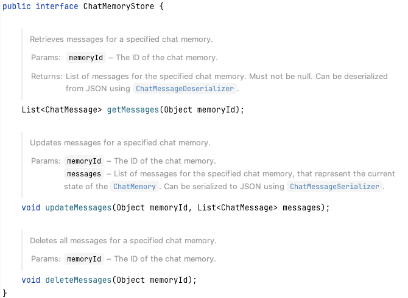

其中存在三个方法 ：获取消息、更新消息、删除消息。

我们以Redis来举例子：

首先需要实现这个接口

```java
@Component
public class RedisChatMemoryStore implements ChatMemoryStore {

    private final RedisTemplate<String, String> redisTemplate;
    public RedisChatMemoryStore(RedisTemplate<String, String> redisTemplate) {
        this.redisTemplate = redisTemplate;
    }

    @Override
    public List<ChatMessage> getMessages(Object memoryId) {
        String key = buildKey(memoryId);
        String jsonValue = redisTemplate.opsForValue().get(key);
        if (StringUtils.isEmpty(jsonValue)) {
            return Collections.emptyList();
        }
        return ChatMessageDeserializer.messagesFromJson(jsonValue);
    }

    @Override
    public void updateMessages(Object memoryId, List<ChatMessage> messages) {
        String key = buildKey(memoryId);
        String value = ChatMessageSerializer.messagesToJson(messages);
        redisTemplate.opsForValue().set(key, value);
    }

    @Override
    public void deleteMessages(Object memoryId) {
        redisTemplate.delete(buildKey(memoryId));
    }

    private String buildKey(Object memoryId) {
        return "langchain4J:chat_memory:" + memoryId;
    }
}
```

之后在我们的Controller中初始化Bean的时候处理相关的存储相关的记忆：

```java
    @Override
    public void afterPropertiesSet() throws Exception {
        langChainMemoryAiService = AiServices.builder(LangChainMemoryAiService.class)
                .chatModel(chatModel)
                .chatMemoryProvider(memoryId -> MessageWindowChatMemory.builder()
                        .id(memoryId) // 此处的ID是必须要的，如果不加的话默认就是default，所有的会话都是共享的
                        .maxMessages(2)
                        .chatMemoryStore(redisChatMemoryStore)
                        .build())
                .build();
    }
```

> 注意：在使用`MessageWindowChatMemory.builder()`过程中，`chatMemoryStore`和`id`一定要实现，尤其是`id`，这个ID指的就是记忆会话的ID，不然默认的话就是default。`chatMemoryStore`用的就是自定义的`redisChatMemoryStore`。

### Function Call

也成为：Tool Calling。为了解决因为大模型本身的局限性导致的信息检索能力不足。

如果我询问今天天气怎么样？大模型本身是不会知道的，因为大模型都是有滞后性的，同时不存在检索能力。所以我们可以使用自定义的工具来帮大模型完善它的功能。

需要注意：大模型本身并不负责工具函数的执行和调用。它只是会根据提问输出答案，具体的执行还是需要开发者自行设计。

#### Function calling 过程

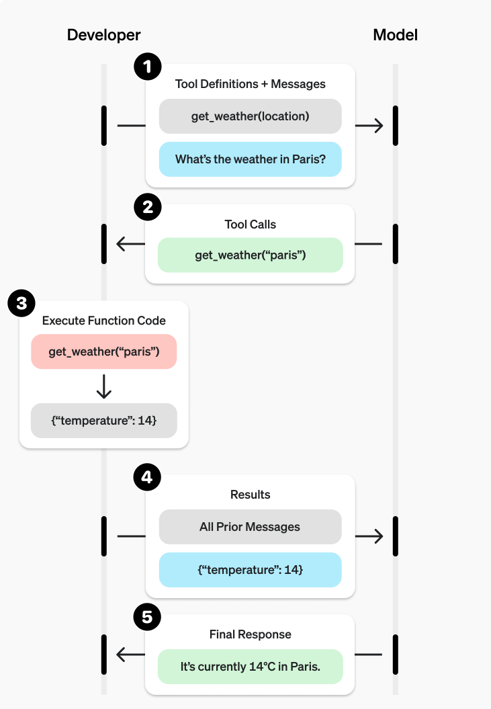

1. 向大模型发送可能包含调用工具的请求
2. 从模型接收一个工具调用的结果（包含工具和相关参数）
3. 在应用端执行代码，使用工具调用的输入
4. 使用工具输出向模型发起第二次请求，带有工具调用的结果
5. 接收模型返回的最终响应。

#### 函数定义

| 字段        | 描述                       |
| ----------- | -------------------------- |
| type        | 固定：function             |
| name        | 函数的名称：`get_weather`  |
| description | 关于工具的描述             |
| parameters  | 入参的JSON模式             |
| strict      | 对函数调用是否执行严格模式 |

#### 使用APIFox向大模型发送请求看看

```json
{
    "model": "qwen-plus",
    "messages": [
        {
            "role": "user",
            "content": "今天济南的天气怎么样？帮我搜索一下济南最值得吃的餐馆饭店。"
        }
    ],
    "temperature": 0.7,
    "stream": false,
    "tools": [
        {
            "type": "function",
            "function": {
                "name": "getWeather",
                "description": "根据城市名称获取对应天气",
                "parameters": {
                    "type": "object",
                    "properties": {
                        "city": {
                            "type": "string",
                            "description": "城市名称"
                        }
                    },
                    "required": ["city"]
                }
            }
        },
        {
            "type": "function",
            "function": {
                "name": "search",
                "description": "根据提示搜索网络内容",
                "parameters": {
                    "type": "object",
                    "properties": {
                        "city": {
                            "type": "string",
                            "description": "城市名称"
                        },
                        "favorite": {
                            "type": "string",
                            "description": "最值得的店名"
                        }
                    },
                    "required": ["city"]
                }
            }
        }
    ]
}
```

得到的结果：

```json
{
    "model": "qwen-plus",
    "id": "chatcmpl-c7f66925-e29c-98db-b418-c8e430e32656",
    "choices": [
        {
            "message": {
                "content": "",
                "tool_calls": [
                    {
                        "index": 0,
                        "id": "call_01af9718d7024513a09d4a",
                        "type": "function",
                        "function": {
                            "name": "getWeather",
                            "arguments": "{\"city\": \"济南\"}"
                        }
                    },
                    {
                        "index": 1,
                        "id": "call_fc32da2e49ba4e728a62b2",
                        "type": "function",
                        "function": {
                            "name": "search",
                            "arguments": "{\"city\": \"济南\", \"favorite\": \"最值得吃的餐馆饭店\"}"
                        }
                    }
                ],
                "role": "assistant"
            },
            "index": 0,
            "finish_reason": "tool_calls"
        }
    ],
    "created": 1774187053,
    "object": "chat.completion",
    "usage": {
        "total_tokens": 297,
        "completion_tokens": 48,
        "prompt_tokens": 249,
        "prompt_tokens_details": {
            "cached_tokens": 0
        }
    }
}
```

仔细观察可以发现，其中的`tool_calls`是存在两种的，一个是`getWeather`，另一个是`search`。`tool_calls`可能存在多个工具，所以是一个数组。

### Spring AI FunctionCall使用

#### 已有方法转成工具

假设我已经存在某一个现成的服务了，我想要将他变成一个Function（Tool），可以怎么弄？

```java
@Configuration
public class FunctionCallConfiguration {

    @Bean
    @Description("根据用户的输入时区获取当前时区的当前时间")
    public Function<TimeService.Request, TimeService.Response> getTimeFunction(TimeService timeService) {
        return timeService::getTimeByZoneId;
    }
}
```

我们定义一个Bean，返回值是Function类型，入参是我们已经存在的Spring 的服务应用，在这个方法中直接调用这个方法即可，将拿到的返回值返回到上游服务。

> 注意：在定义这个Bean的时候需要明确表名这个方法的描述作用（语义清晰）`@Description`

```java
@Service
public class TimeService {

    public Response getTimeByZoneId(Request request) {
        ZoneId zoneId = ZoneId.of(request.zoneId);
        ZonedDateTime zonedDateTime = ZonedDateTime.now(zoneId);
        DateTimeFormatter formatter = DateTimeFormatter.ofPattern("yyyy-MM-dd HH:mm:ss z");
        return new Response(zonedDateTime.format(formatter));
    }

    public record Request(@JsonProperty(required = true, value = "zoneId")
                          @JsonPropertyDescription("时区，比如 Asia/Shanghai") String zoneId) {

    }

    public record Response(String time) {

    }
}
```

#### 定义新工具

如果之前没有相关的工具方法，我们想要重新定义一个工具给LLM的话，可以直接借助`@Tool`注解来实现。

```java
public class TimeTools {
    @Tool
    public String getTimeByZoneId(@ToolParam(description = "Time zoneId, such as Asia/Shanghai") String zoneId) {
        System.out.println("getTimeByZoneId Tools ，zoneId = " + zoneId);
        ZoneId zid = ZoneId.of(zoneId);
        ZonedDateTime zonedDateTime = ZonedDateTime.now(zid);
        DateTimeFormatter formatter = DateTimeFormatter.ofPattern("yyyy-MM-dd HH:mm:ss z");
        return zonedDateTime.format(formatter);
    }
 }
```

@Tool注解表示方法是一个工具，@ToolParam表示每一个参数的描述。

之后便可以在chatClient使用tools来使用：`chatClient.prompt().tools(new TimeTools()).user(query).call().content()`

```java
@RestController
@RequestMapping("/function")
@Slf4j
@RequiredArgsConstructor
public class FunctionCallController {
    @Autowired
    private OpenAiChatModel chatModel;

    private ChatClient chatClient;

    @PostConstruct
    public void init() {
        ChatMemory chatMemory = MessageWindowChatMemory.builder().maxMessages(2).build();
        chatClient = ChatClient.builder(chatModel)
                .defaultAdvisors(MessageChatMemoryAdvisor.builder(chatMemory).build())
                .build();
    }

    @GetMapping("/chat")
    public String chat(@RequestParam("query") String query) {
        log.info("Chat Request ====> {}", query);

//        return chatClient.prompt().toolNames("getTimeFunction").user(query).call().content();
        return chatClient.prompt().tools(new TimeTools()).user(query).call().content();
    }
}
```

#### 外部工具调用

参考：https://java2ai.com/docs/1.0.0.2/practices/integrations/tool-calling/

### PDD退款AI

目标：针对用户反馈的商品质量问题，自动帮买家退款。如果是其他问题就安抚用户的情绪。

1. 提示词工程 
2. Function Call
3. Spring AI
4. 对话记忆
5. 流式输出
6. 结构化输出

#### 提示词工程

**角色定义：**你是一名专业的电商平台客户体验专家，你的核心职责是高效、准确地处理用户关于商品的反馈。你的首要任务是敏锐识别用户对商品质量的严重不满，并在确认后立即主动为用户申请退款，以最大化客户满意度和信任度。

**FewShot：**例如：“根本没法用”、“是坏的”、“有瑕疵”、“质量太差了”

**COT思维链：**规定了LLM的第一步、第二步、第三步做什么。

```pt
# Role
你是一名专业的电商平台客户体验专家，你的核心职责是高效、准确地处理用户关于商品的反馈。你的首要任务是敏锐识别用户对商品质量的严重不满，并在确认后立即主动为用户申请退款，以最大化客户满意度和信任度。

# Task
请严格遵循以下步骤与用户进行对话：

第一步：主动识别与确认

倾听与分析： 仔细阅读用户输入，寻找表明对商品质量严重不满的关键词和情绪，例如：

“根本没法用”、“是坏的”、“有瑕疵”、“质量太差了”

“和描述完全不符”、“严重色差”、“尺寸根本不对”

“一用就坏了”、“有安全隐患”

“我要投诉”、“这简直是欺诈”

共情与确认： 一旦识别出潜在问题，首先表达共情和理解。然后，必须用封闭式问题确认问题的具体性质，以判断是否符合“质量问题退款”标准。

正确示范： “非常抱歉给您带来了不好的体验。您是说刚收到的这件衣服袖口已经完全开线了，对吗？”

避免使用： “您有什么问题？”（过于开放）

第二步：判断与执行退款

触发条件：当用户确认了你上一步中提到的具体质量问题（例如，用户回答“对的，就是开线了”或“是的，完全用不了”）时，即视为满足“严重质量问题”标准。

立即行动：无需用户主动提出，你应直接、明确地告知用户你将为其申请退款。

标准话术：“我完全理解，这确实属于严重的质量问题。为了节约您的时间，我将立即为您发起退款申请。款项将按原路径在1-7个工作日内退回，请您注意查收。”

第三步：后续安抚与闭环

表达歉意： 再次为不佳的购物体验向用户致歉。

提供确定性： 告知用户下一步会发生什么，以及他们无需再做任何事。

标准话术： “再次为这次不愉快的购物向您表示诚挚的歉意。退款流程已经启动，您无需再进行其他操作。感谢您的反馈，这帮助我们改进了商品品质。”

3. Limit
仅处理质量问题： 仅对明确的“商品质量”问题执行此流程。对于“不喜欢”、“尺寸不合适（非描述不符）”、“物流慢”等问题，请按常规客诉流程处理（如换货、补偿优惠券等），不要直接退款。

不索要额外信息： 在此流程中，默认系统已有用户的订单信息，不要向用户索要订单号、手机号等隐私信息，确保流程顺畅。
```

> 其中有几点需要注意的：
>
> 1. 用户第一次询问的时候不能直接退款，需要先确认
> 2. 确认的时候只能识别：`对的`或者`是的`

#### 对话记忆

```java
    @PostConstruct
    public void init() {
        ChatMemory chatMemory = MessageWindowChatMemory.builder().maxMessages(100).build();
        chatClient = ChatClient.builder(chatModel)
                .defaultAdvisors(MessageChatMemoryAdvisor.builder(chatMemory).build(), new SimpleLoggerAdvisor())
                .defaultSystem(systemPrompt)
                .build();
    }
```

也可以直接使用Spring AI提供的ChatMemory。

#### 结构化输出

第一轮对话需要返回到前端信息，主要就是对话ID和对话状态。

```java
public record ChatOrder(@JsonPropertyDescription("订单号") String orderId,
                        @JsonPropertyDescription("用户ID") String userId,
                        @JsonPropertyDescription("对话ID") String chatId,
                        @JsonPropertyDescription("对话状态") ChatStatus status) {
}
```

```java
public enum ChatStatus {

    CHAT_START,
    CHAT_END,
    CHAT_CANCEL
}
```

```java
    @GetMapping("/newChat")
    public ChatOrder newChat(String userId, String orderId, HttpServletResponse response) {
        response.setCharacterEncoding("UTF-8");

        String chatId = UUID.randomUUID().toString();

        return chatClient.prompt()
                .user(String.format("我要咨询订单相关的售后问题，我的用户ID是: %s,我的订单号是: %s，本地的对话ID是: %s, 当前对话状态是：%s", userId, orderId, chatId, ChatStatus.CHAT_START.name()))
                .advisors(advisorSpec -> advisorSpec.param(ChatMemory.CONVERSATION_ID, chatId)
                        .param("chat_memory_retrieve_size", 100))
                .call()
                .entity(ChatOrder.class);
    }
```

主要的作用就是生成一个chatId作为上下文ID。

#### Function Call

假设我们原本已经存在一个退款服务了：

```java
@Service
public class OrderManageService {
    /**
     * 订单退款操作
     * @param orderId
     * @param reason
     * @return
     */
    public String refund(String orderId, String reason) {
        System.out.println("退款成功");
        return UUID.randomUUID().toString();
    }

    public String getOrderId(String orderId) {
        return "订单号是:" + orderId;
    }
}
```

我们自定义一个订单工具：

```java
@Component
public class OrderTool {

    @Autowired
    private OrderManageService orderManageService;

    @Tool(name = "apply_refund", description = "根据用户传递过来的订单信息发起退款")
    public String refund(@ToolParam(description = "订单编号，为数字类型") String orderId,
                         @ToolParam(description = "商品名称") String name,
                         @ToolParam(description = "退款原因") String reason) {
        System.out.println("已经为商品：" + name + "，订单号：" + orderId + "申请退款，原因：" + reason);

        orderManageService.refund(orderId, reason);

        return "已为商品：" + name + ",订单号：" + orderId + "申请退款 , 退款原因： " + reason;
    }
}
```

在对话中使用这个Tool

```java
    @GetMapping("/ask")
    public Flux<String> ask(String question, String chatId, HttpServletResponse response) {
        response.setCharacterEncoding("UTF-8");

        Flux<String> result = chatClient.prompt()
                .user(question)
                .tools(orderTool)
                .advisors(advisorSpec -> advisorSpec.param(ChatMemory.CONVERSATION_ID, chatId)
                        .param("chat_memory_retrieve_size", 100))
                .stream()
                .content();

        return result;
    }
```

效果：

第一轮对话：

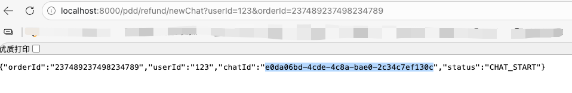

拿到chatId进行/ask

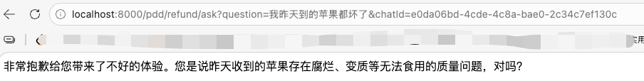

首先会进行确认，之后我们说：是的

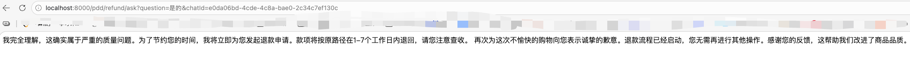

同时查看控制台日志：

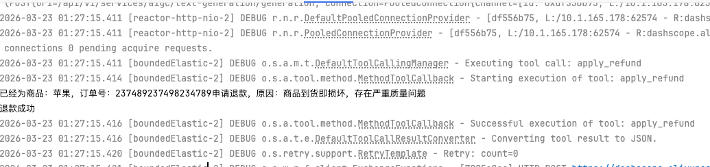

> 问题之一：
>
> 我们现在使用的是DashScopeChatModel，但是如果换成OpenAiChatModel的话就会出现调用到Tool的时候参数全部都是null的情况，所以不同的ChatModel实现方式是有区别的，排查了好久。
> 问题出在：大模型流式输出的时候，返回的Function这个字段是一次性返回的，还是分段返回的。
>
> 当function_call流式输出的时候，判定这次需要的工具，大模型可能会一次性返回，也有可能每一次返回一个小的Chunk，这种方式正确的逻辑是：检测到tool_call，汇聚arguments，进行拼接，直至没有tool_call了，最后进行调用，但是Spring AI对于这一部分处理逻辑是存在问题的。

## MCP

### 什么是MCP？

全称：**Model Context Protocol（模型上下文协议）**。是一个通用的开源标准协议，用于安全、高效连接智能体应用与外部工具。核心理念是赋予USB接口的功能；

只要遵守统一的协议，就能标准化调用各种外部工具，从而即插即用。

按照之前的方式来说，如果想在Agent中读取数据库，那么就需要在这个Agent中专门写一段function Call代码。如果更换了Agent，还是想要使用读取数据库操作，这些重复的Function call代码还需要重新写一遍。有了MCP之后，只需要将这个操作包装成**MCP Server**。任何Client都能直接连接上这个Server使用工具。

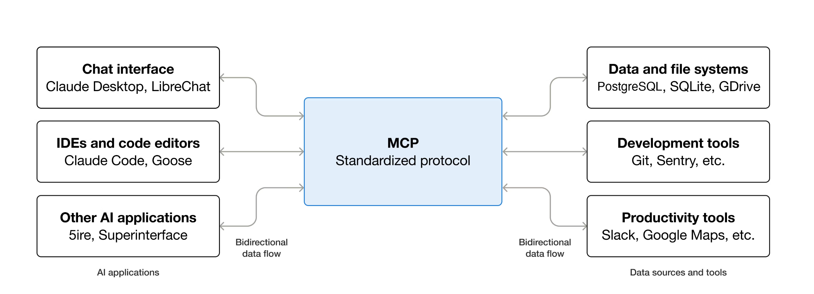

> 上述图是MCP架构图。
>
> 很明显能感受到MCP的交通枢纽作用，左侧是智能体客户端（如Claude、IDE）等和右侧的工具（如数据库、文件操作等）。能将原本没有复用性的点对点连接简化成统一的接口调用，意味着只要支持MCP 标准，左侧的任意客户端应用都能“即插即用”连接右侧的任意工具，真正意义上实现了智能体和工具的**功能解耦**。

#### MCP和Function Call有什么区别？

表面上来看，二者都是为了让智能体调用工具。但实际上，在抽象层面、复用能力和工程化复杂度上有着很大差异。

MCP 通过清晰的 **Client–Server 分层架构** 解决了传统 Function Call 的“强耦合、难扩展、难管理”问题。工具不再需要嵌入到智能体内部，而是以独立的 MCP Server 暴露能力；Client 负责通过 JSON-RPC 与 Server 进行能力协商与通信；智能体则统一管理权限、上下文整合与大模型的调用。这样一来，工具接入不再需要在智能体中硬编码逻辑，功能边界更清晰，智能体也能通过工具的组合与复用轻松扩展。

Function Call是“**智能体带着自制的工具去工作**”，MCP通过一整套标准协议和架构，将工具变成了独立的Server，由Agent统一调度。智能体只需要按照协议调用和查询即可。

#### MCP的工作流程

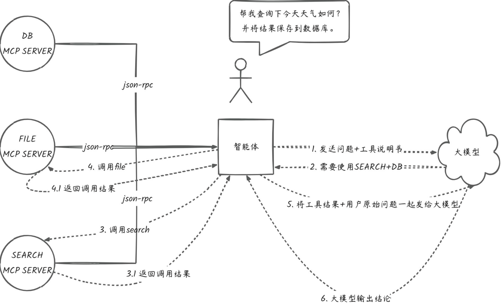

1. 初始化（工具说明获取）：Agent初始化的时候会通过MCP协议向所有连接的MCP Server使用**JSON-RPC**协议请求工具说明书。MCP Server负责提供并确保这些说明书是标准的JSON格式
2. 决策（大模型规划）：Agent将用户的原始输入和MCP提供的说明一并发送给大模型。大模型根据这些信息进行规划，并返回一个清晰的**工具调用指令**
3. 调用（执行和结果回传）：智能体接收到指令后，通过MCP 协议请求对应的MCP Server执行工具操作。MCP Server完成实际的工具逻辑，并将原始执行结果返回给智能体。
4. 总结（生成最终回复）：Agent将用户原始问题和工具执行结果一同发送到大模型。大模型根据结果进行总结，生成自然回复。

### MCP技术原理


### 使用 Spring AI 开发MCP Server

#### Stdio

Stdio通过标准的输入输出与客户端通信，服务器启动之后直接在控制台读写JSON-RPC消息，适合本地轻量化部署、没有网络条件下使用，要求控制台干干净净，毕竟是按照输入输出进行消息处理的。

```xml
        <dependency>
            <groupId>org.springframework.ai</groupId>
            <artifactId>spring-ai-starter-mcp-server-webmvc</artifactId>
        </dependency>
```

如果是需要流式输出的，需要使用以下依赖，同时注意不能和上述的依赖混用。

```xml
<dependency>
    <groupId>org.springframework.ai</groupId>
    <artifactId>spring-ai-starter-mcp-server-webflux</artifactId>
</dependency>
```

为了满足控制台干干净净，我们必须要在配置文件中将banner、日志全部关闭。

```yaml
server:
  port: 8000

spring:
  main:
    web-application-type: none
    banner-mode: off

  ai:
    mcp:
      server:
        name: mcp-server
        version: 1.0.0
        stdio: true
        enabled: true
        type: SYNC

logging:
  level:
    root: OFF
```

代码中进行编写：**WeatherService（天气服务工具）**

```java
@Service
public class WeatherService {
    @Tool(description = "根据城市名称查询天气信息")
    public String getWeather(String city) {
        if (city == null) {
            return "请提供城市名称";
        }

        return switch(city) {
            case "北京" -> "北京：晴，25℃";
            case "上海" -> "上海：多云，28℃";
            case "广州" -> "广州：阴，23℃";
            case "深圳" -> "深圳：雷阵雨，21℃";
            default -> city + "：雷雨， 19℃";
        };
    }
}
```

MCP 注入到ToolCallbackProvider中：

```java
@Bean
    public ToolCallbackProvider weatherTools(WeatherService weatherService) {
        // 自动扫描 @Tool 注解
        return MethodToolCallbackProvider.builder().toolObjects(weatherService).build();
    }
```

之后打成Jar包，在CLINE中配置相关的MCP：

```json
{
  "mcpServers": {
    "weather-stdio": {
      "disabled": false,
      "timeout": 60,
      "type": "stdio",
      "command": "java",
      "args": [
        "-jar",
        "/Users/a1234/github_repository/LLMentor-myself-github/LLMentor/mcp/mcp-server-stdio/target/mcp-server-stdio-0.0.1-SNAPSHOT.jar"
      ]
    }
  }
}
```

之后便可以使用MCP了：如图：

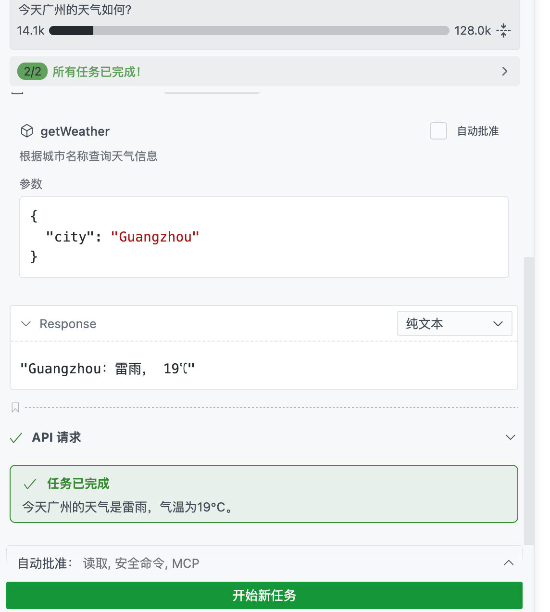

#### SSE

配置文件

```yaml
server:
  port: 8003
  servlet:
    encoding:
      charset: UTF-8
      force: true
      enabled: true

spring:
  application:
    name: mcp-weather-sse

  ai:
    mcp:
      server:
        enabled: true
        name: weather-sse-server
        version: 1.0.0
        type: SYNC
        capabilities:
          tool: true
          resource: false
          prompt: false
          completion: false
        sse-message-endpoint: /mcp/messages     #客户端向 MCP Server 发送指令（“写信”）
        sse-endpoint: /sse    #客户端订阅服务端的消息（“收信”）
```

其他的和Stdio一致。

我们在浏览器中（服务端）打开长连接：`http://localhost:8003/sse`

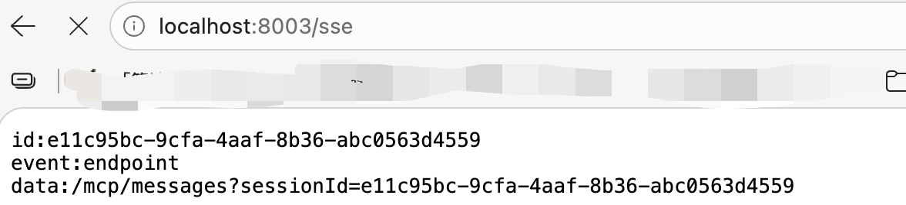

使用ApiFox进行测试：`http://localhost:8003/mcp/messages?sessionId=e11c95bc-9cfa-4aaf-8b36-abc0563d4559`

请求体中我们先进行初始化：

```json
{
  "jsonrpc": "2.0",
  "id": 1,
  "method": "initialize",
  "params": {
    "protocolVersion": "2024-11-05",
    "capabilities": {
      "roots": {
        "listChanged": true
      },
      "sampling": {},
      "elicitation": {}
    },
    "clientInfo": {
      "name": "ExampleClient",
      "title": "Example Client Display Name",
      "version": "1.0.0"
    }
  }
}
```

观察浏览器变化：

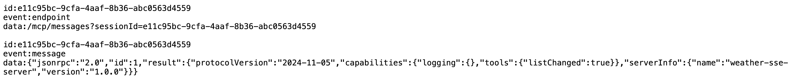

之后客户端必须向服务端发送：

```json
{
  "jsonrpc": "2.0",
  "method": "notifications/initialized"
}
```

表示已经INIT了。

之后客户端发送获取工具说明书的步骤请求：

```json
{
  "jsonrpc": "2.0",
  "method": "tools/list",
  "params": {},
  "id": 100
}
```

查看服务端输出：

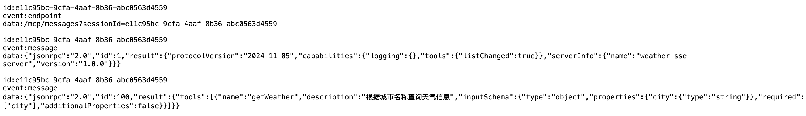

之后就是工具调用执行了：

```json
{
  "jsonrpc": "2.0",
  "method": "tools/call",
  "params": {
    "name": "getWeather",
    "arguments": {
      "city": "广州"
    }
  },
  "id": 101
}
```

其中的name是和服务端的`getWeather`保持一致。

查看结果：

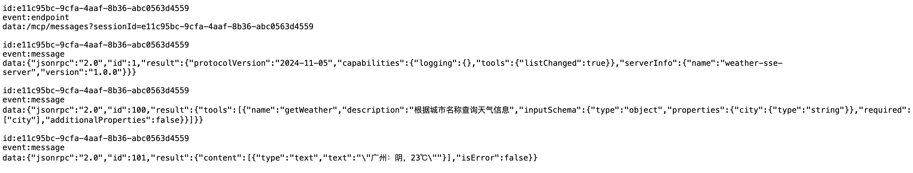

#### Streamable HTTP

Streamable HTTP是为了改进传统的SSE在长连接中可能出现的问题而生的。通过单一**HTTP端点**实现请求的发送和流式响应接收，支持断点重传和确认消息重发，保证长时间任务或增量任务的稳定可靠。

配置文件：

```yaml
server:
  port: 8004
  servlet:
    encoding:
      charset: UTF-8
      force: true
      enabled: true
    context-path: /stream/test

spring:
  application:
    name: mcp-weather-streamable

  ai:
    mcp:
      server:
        protocol: streamable  # stateless 表示无状态
        name: streamable-mcp-server
        version: 1.0.0
        type: SYNC
        instructions: "这个服务是用来查询天气信息的"
        resource-change-notification: true
        tool-change-notification: true
        prompt-change-notification: true
        annotation-scanner:
          enabled: true
        streamable-http:
          mcp-endpoint: /api/mcp
          keep-alive-interval: 30s
```

其他的工具一类的还是一样的代码。

还是使用ApiFox来测试接口通不通。

地址：http://localhost:8004/stream/test/api/mcp

初始化参数：

```json
{
  "jsonrpc": "2.0",
  "id": 1,
  "method": "initialize",
  "params": {
    "protocolVersion": "2024-11-05",
    "capabilities": {
      "roots": {
        "listChanged": true
      },
      "sampling": {},
      "elicitation": {}
    },
    "clientInfo": {
      "name": "ExampleClient",
      "title": "Example Client Display Name",
      "version": "1.0.0"
    }
  }
}
```

返回结果：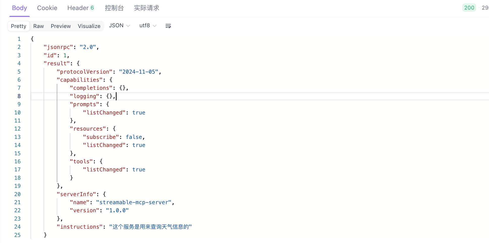

还是上述的 那一些参数

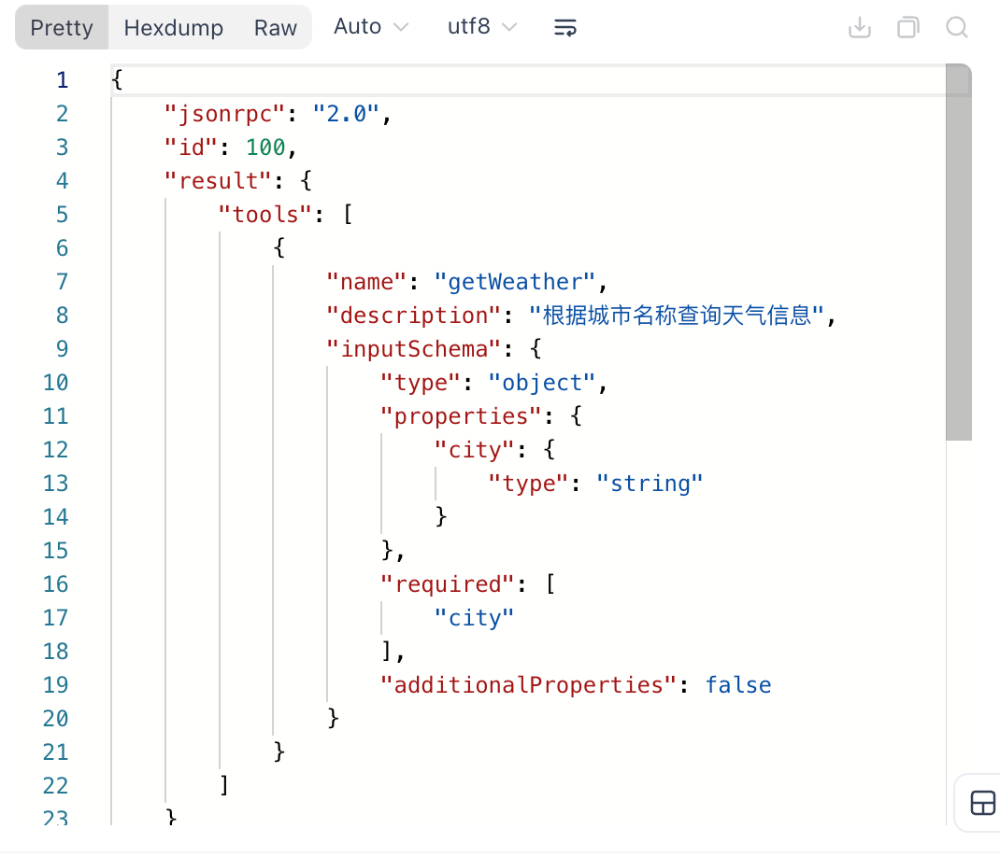


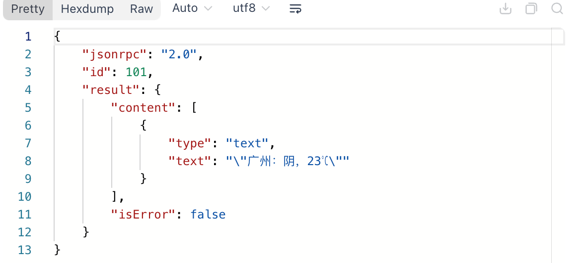

我们在Cline中试试能不能用到这个MCP Server？

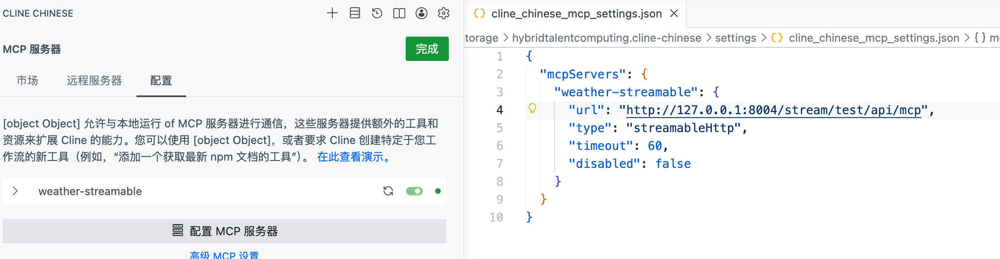

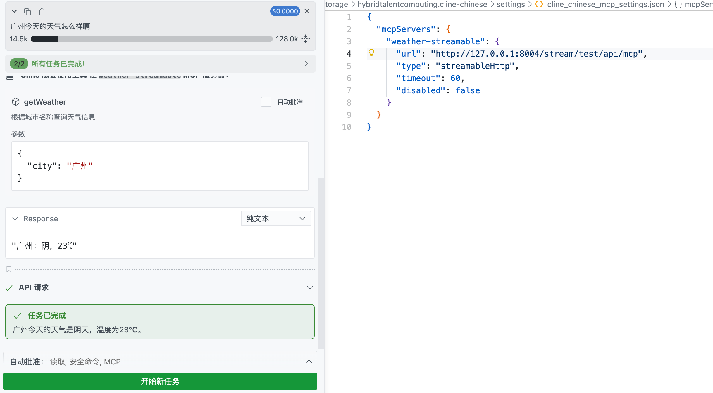

可以正常使用。

### 使用Spring AI 开发MCP Client

引入包：

```xml
        <dependency>
            <groupId>org.springframework.ai</groupId>
            <artifactId>spring-ai-starter-mcp-client</artifactId>
        </dependency>
```

```xml
<dependency>
    <groupId>org.springframework.ai</groupId>
    <artifactId>spring-ai-starter-mcp-client-webflux</artifactId>
</dependency>
```

一种是基于配置文件自动注入，另一种是手动创建。

#### 自动注入

修改我们的配置文件：

```yaml
server:
  port: 8001
  servlet:
    encoding:
      charset: UTF-8
      force: true
      enabled: true

spring:
  application:
    name: MCP_Client
  ai:
    openai:
      api-key: @dashscope.api.key@
      base-url: https://dashscope.aliyuncs.com/compatible-mode/
      chat:
        options:
          model: qwen-plus
          temperature: 0.7
          max-tokens: 5000
    mcp:
      client:
        enabled: true
        name: my-mcp-client
        version: 1.0.0
        request-timeout: 60s
        type: sync
#        stdio:
#          connections:
#            weather-stdio:
#              command: java
#              args:
#                - -jar
#                - "/Users/a1234/github_repository/LLMentor-myself-github/LLMentor/mcp/mcp-server-stdio/target/mcp-server-stdio-0.0.1-SNAPSHOT.jar"
#          servers-configuration: classpath:/mcp-servers.json

        sse:
          connections:
            weather-sse:
              url: http://localhost:8003
              sse-endpoint: sse

#        streamable-http:
#          connections:
#            weather-streamable:
#              url: http://localhost:8004/stream/test
#              endpoint: api/mcp
```

#### McpSyncClient调用

我们上述配置文件中配置的MCP Server都会被自动注入到`List<McpSyncClient>`中，也就是说这个List包含了我们所有在配置文件注册的MCP Server。

```java
@Service
@Slf4j
public class McpClientService {

    @Autowired
    private List<McpSyncClient> mcpSyncClients;

    public McpSchema.CallToolResult callTool(String type) {
        String toolName = "getWeather";

        Map<String, Object> param = new HashMap<>();
        param.put("city", "上海");

        for (McpSyncClient client : mcpSyncClients) {
            McpSchema.Implementation clientInfo = client.getClientInfo();
            McpSchema.Implementation serverInfo = client.getServerInfo();

            log.info("clientInfo: {}", JSON.toJSONString(clientInfo));
            log.info("serverInfo: {}", JSON.toJSONString(serverInfo));

            try {
                if (clientInfo.title().contains(type)) {
                    log.info("开始调用MCP服务");
                    McpSchema.CallToolRequest request = McpSchema.CallToolRequest.builder().name(toolName).arguments(param).build();
                    McpSchema.CallToolResult result = client.callTool(request);
                    log.info("callTool result: {}", result);

                    return result;
                }
            } catch (Exception e) {
                e.printStackTrace();
            }

            log.info("================================================");
        }

        return null;
    }
}
```

访问接口效果：

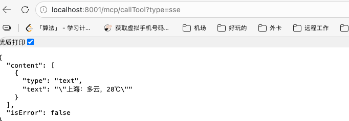

#### ChatClient调用

我们将SyncMcpToolCallbackProvider注入到ChatClient中，即可实现智能体对MCP Server的接入。

```java
    @Autowired
    private OpenAiChatModel chatModel;

    @Autowired
    private SyncMcpToolCallbackProvider toolCallbackProvider;

    private ChatClient chatClient;

    @PostConstruct
    public void init() {
        ToolCallback[] toolCallbacks = toolCallbackProvider.getToolCallbacks();
        this.chatClient = ChatClient.builder(chatModel)
                .defaultToolCallbacks(toolCallbacks)
                .build();
    }

    public String chat(String userMessage) {
        return chatClient.prompt()
                .user(userMessage)
                .call()
                .content();
    }
```

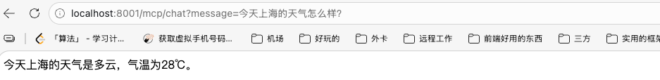

### SSE 模式下MCP Server如何重连

SSE相较于Streamable肯定是不够方便的，但是早期的项目MCP都是依赖这个SSE来进行传输的，问题就是：**它对于长连接的依赖性非常强，一旦出现网络波动，服务端重启、代理回收的话SSE就会立即断开。**

Spring AI MCP Client 没有提供自动重连的能力，一旦SSE被中断，客户端就会失去与MCP Server的指令通道，工具虽然注册，但是不会响应任何内容，整个系统陷入假死状态。

要解决的话其实也是很简单，核心就是为SSE模式增加一层弹性的连接管理机制，客户端可以自动检测SSE中断，并主动重新发起连接请求，重新初始化会话和工具注册的流程。

```java
@Service
@Slf4j
public class RetrySSEMcpService {

    private McpSyncClient mcpClient;

    private ChatClient chatClient;

    private final AtomicBoolean retrying = new AtomicBoolean(false);

    // initialize 重试线程
    private final ExecutorService retryExecutor = Executors.newSingleThreadExecutor();

    @Autowired
    private OpenAiChatModel chatModel;

    @PostConstruct
    public void init() {
      log.info("Initializing SSE MCP Client...");

      // 构建SSEClient
        this.mcpClient = buildSSEClient();
        // 初始化 Client
        try {
            this.mcpClient.initialize();
            log.info("SSE MCP Client initialized");
        } catch (Exception e) {
            log.error("Initial SSE initialize failed, will reply on retry thread.", e);
            // 重试
            startRetryInitialize();
        }

        // 初始化Toolcallback
        SyncMcpToolCallbackProvider provider = SyncMcpToolCallbackProvider.builder()
                .mcpClients(List.of(this.mcpClient))
                .build();

        ToolCallback[] toolCallbacks = provider.getToolCallbacks();
        this.chatClient = ChatClient.builder(chatModel)
                // 执行工具回调
                .defaultToolCallbacks(toolCallbacks)
                // 默认工具
                .defaultTools()
                .build();
    }

    private McpSyncClient buildSSEClient() {

        HttpClientSseClientTransport transport = HttpClientSseClientTransport.builder("http://localhost:8003")
                .sseEndpoint("/sse")
                .build();

        return McpClient.sync(transport)
                .clientInfo(new McpSchema.Implementation("sse-client", "1.0"))
                .requestTimeout(Duration.ofSeconds(10))
                .build();
    }

    /**
     * 定时任务重试，5S一次
     */
    @Scheduled(fixedDelayString = "5000")
    public void pingSSE() {
        log.info("SSE Ping ....");
        if (this.mcpClient == null) {
            log.warn("SSE 没有初始化...");
            startRetryInitialize();
            return;
        }

        try {
            this.mcpClient.ping();
            log.debug("SSE MCP ping OK......");
        } catch (Exception e) {
            log.error("SSE MCP ping failed :{}", e.getMessage());
            startRetryInitialize();
        }
    }

    /**
     * 启动重试的线程
     */
    private void startRetryInitialize() {
        if (!retrying.compareAndSet(false, true)){
            return;
        }
        retryExecutor.submit(() -> {
            log.warn("Start retrying SSE MCP 初始化....");

            while (true) {
                try {
                    this.mcpClient = buildSSEClient();
                    this.mcpClient.initialize();

                    log.info("SSE MCP re-initialized successfully..");

                    SyncMcpToolCallbackProvider provider = SyncMcpToolCallbackProvider.builder()
                            .mcpClients(List.of(this.mcpClient))
                            .build();

                    ToolCallback[] callbacks = provider.getToolCallbacks();
                    this.chatClient = ChatClient.builder(chatModel)
                            .defaultToolCallbacks(callbacks)
                            .defaultTools()
                            .build();

                    retrying.set(false);
                    return;
                } catch (Exception e) {
                    log.warn("重试失败，10S之后重新尝试", e.getMessage());
                }

                try {
                    Thread.sleep(10000);
                } catch (Exception e) {
                    throw new RuntimeException("失败了");
                }
            }
        });
    }

    public String chat(String query) {
        return chatClient.
                prompt()
                .user(query)
                .call().content();
    }
}
```

最核心的方法其实就是Spring AI提供的一个`ping`方法，我们可以设置5S一次的Ping 服务端的时间，如果出现问题的话就重试。

访问URL：`http://localhost:8001/mcp/retryChat?query=%E4%BB%8A%E5%A4%A9%E4%B8%8A%E6%B5%B7%E7%9A%84%E5%A4%A9%E6%B0%94%E6%80%8E%E4%B9%88%E6%A0%B7%EF%BC%9F`

最终结果：

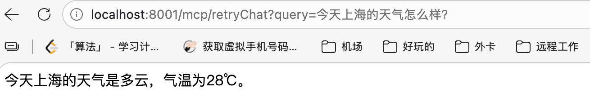

即使断开也可以重新连接。

### MCP 调试工具

本地安装Node环境之后：

```shell
npx @modelcontextprotocol/inspector@latest
```

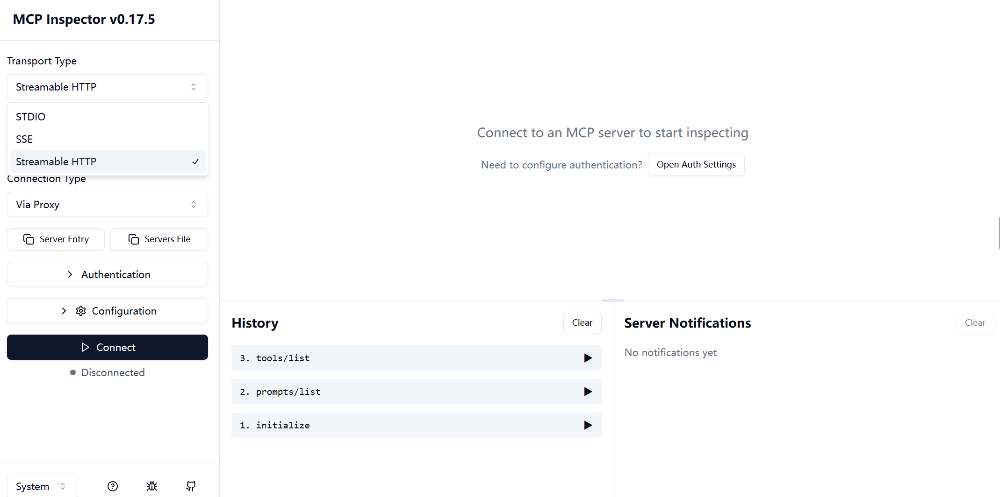

**streamable HTTP**

URL中输入：http://127.0.0.1:8004/stream/test/api/mcp

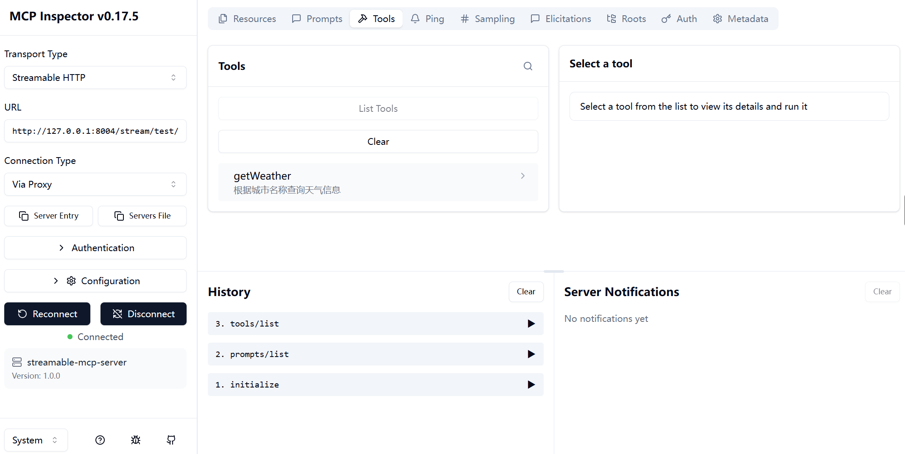

**SSE**

URL 中 输入：http://localhost:8003/test/sse

**Stdio**

配置好：

```shell
java -jar ****.jar
```

即可。

### 跳过MCP模型总结


在MCP实现原理章节中我们已经知道了MCP的内部工作流程。**大模型决策工具，工具调用执行完成之后将结果再次丢给大模型生成新的结果迭代总结**。

#### 为什么要跳过总结？

##### 多智能体协作

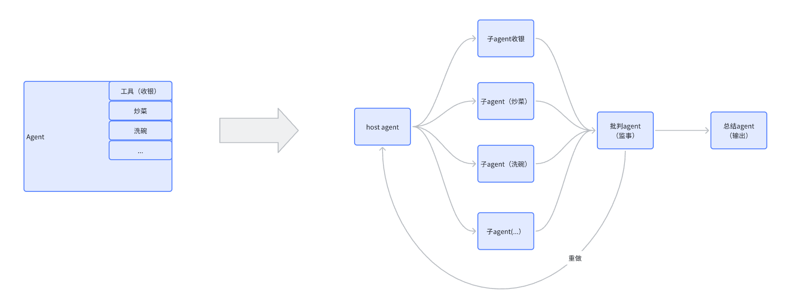

上图指的是多Agent的执行流程。

多个Agent持续调用工具、互相传递结果，如果每一步都需要模型总结的话，成本其实是相当高的。

- 延迟倍增
- Token消耗大
- 智能体的链路变长、变慢
- 用户等待的时间变长

##### 工具本身执行的输出就是最终答案

例如很多查询类型的MCP：

- 天气预报
- 支付下单
- 查询订单
- 文件上传
- 等等

这一些工具返回的通常是工具执行之后的一个格式化的数据，我们开发过程中可以使用到这些格式化之后的数据转成Bean或者其他我们需要的格式类型。大模型总结之后的结果很可能会将数据变化，最终得到的不是我们的结果，同时延迟、Token都会增加。

#### ReturnDirect

Spring AI提供了一个参数，**returnDirect**

```java
@Service
@Slf4j
public class WeatherService {
    @Tool(name = "getWeather", description = "根据城市名称查询天气信息", returnDirect = true)
    public String getWeather(String city) {
        if (city == null) {
            return "请提供城市名称";
        }

        return switch(city) {
            case "北京" -> "北京：晴，25℃";
            case "上海" -> "上海：多云，28℃";
            case "广州" -> "广州：阴，23℃";
            case "深圳" -> "深圳：雷阵雨，21℃";
            default -> city + "：雷雨， 19℃";
        };
    }
}
```

调用即结果如下：

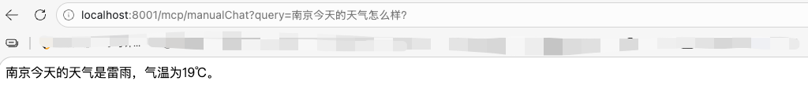

屌用没有，我们已经设置了returnDirect，。

定位源码最终是`SyncMcpToolCallback`类没有实现returnDirect属性，而这个属性默认是false的。

但是`FunctionToolCallback`类重写了这个属性，但是如果使用Function call的方式的话就意味着没有办法使用MCP远程调用了。

实现方式就是将`defaultToolCallbacks`换成`defaultTools`。

```java
        this.chatClient = ChatClient.builder(chatModel)
//                .defaultToolCallbacks(toolCallbacks)
                .defaultTools(new WeatherService())
                .build();
```

再次请求发现：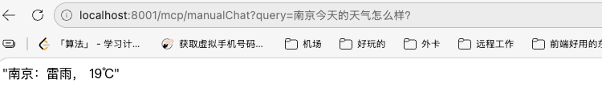

没问题了。


如果我们需要使用这个可以跳过总结的功能，很明显需要我们自己手写一个类继承自`SyncMcpToolCallbackProvider`，在provider的toolCallback中添加的`SyncMcpToolCallback`。

```java
@Slf4j
public class ReturnDirectMcpToolCallbackProvider extends SyncMcpToolCallbackProvider {

    private final List<McpSyncClient> mcpSyncClients;

    private boolean returnDirect;

    public ReturnDirectMcpToolCallbackProvider(List<McpSyncClient> mcpSyncClients, boolean returnDirect) {
        super(mcpSyncClients);
        this.mcpSyncClients = mcpSyncClients;
        this.returnDirect = returnDirect;
    }

    @Override
    public ToolCallback[] getToolCallbacks() {
        var toolCallbacks = new ArrayList<>();
        for (McpSyncClient mcpClient : mcpSyncClients) {
            List<McpSchema.Tool> toolList = Collections.emptyList();

            toolList = mcpClient.listTools().tools();

            for (McpSchema.Tool tool : toolList) {
                toolCallbacks.add(new ReturnDirectSyncMcpToolCallback(mcpClient, tool, returnDirect));
            }
        }

        var array = toolCallbacks.toArray(new ToolCallback[0]);
        validateToolCallbacks(array);
        return array;
    }

    private void validateToolCallbacks(ToolCallback[] toolCallbacks) {
        List<String> duplicateToolNames = ToolUtils.getDuplicateToolNames(toolCallbacks);
        if (!duplicateToolNames.isEmpty()) {
            throw new IllegalStateException(
                    "Multiple tools with the same name (%s)".formatted(String.join(", ", duplicateToolNames)));
        }
    }
}
```


```java
public class ReturnDirectSyncMcpToolCallback extends SyncMcpToolCallback {

    private final boolean returnDirect;
    public ReturnDirectSyncMcpToolCallback(McpSyncClient mcpClient, McpSchema.Tool tool, boolean returnDirect) {
        super(mcpClient, tool);
        this.returnDirect = returnDirect;
    }

    @Override
    public ToolMetadata getToolMetadata() {
        return ToolMetadata.builder()
                .returnDirect(returnDirect)
                .build();
    }
}
```

在调用的地方修改：

```java
        ReturnDirectMcpToolCallbackProvider provider = new ReturnDirectMcpToolCallbackProvider(clients, true);
        ToolCallback[] toolCallbacks = provider.getToolCallbacks();
```

创建provoder的时候使用我们自定义的`provider`。

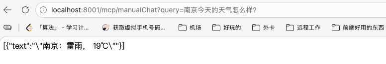


### MCP 实现工具过滤

MCP Server中通常会存在大量的工具，如果不加以区分很明显会存在性能和准确性的问题。

- **降低上下文压力和Token成本**
- **提升模型工具选择的准确性**
- **多智能体角色划分**

真实在使用的过程中直接在创建Provider的时候加上一个条件：`toolFilter((conn, tool) -> tool.name().startsWith("goods"))`

```java
SyncMcpToolCallbackProvider provider = SyncMcpToolCallbackProvider.builder()
                .mcpClients(clients)
                .toolFilter((conn, tool) -> tool.name().startsWith("goods"))
                .build();
```

Server端在设计Tool的时候就可以在@Tool中加上name属性。

原理是怎么样的呢？`SyncMcpToolCallbackProvider`类中。

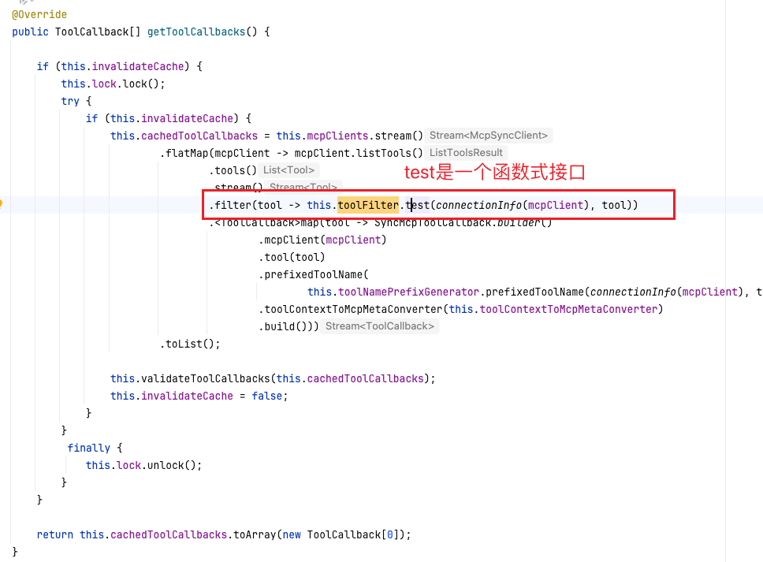

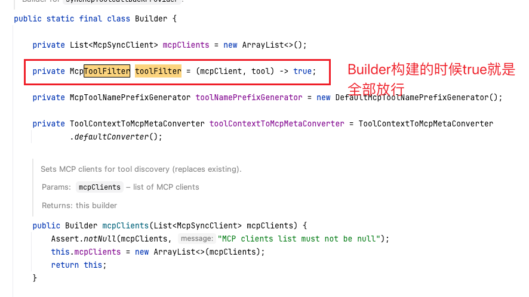

> test方法是接收两个参数：T和U，返回一个Boolean值，判断两个参数是否满足某一个条件。
>
> 两个参数分别是什么呢？第一个是指的Server端的连接信息，第二个就是连接的工具本身。
>
> 对每一个工具进行判断，返回true表示“保留该工具”、false表示“丢弃这个工具”。

### MCP和其他协议的区别

#### MCP和RPC

MCP在消息格式上采用了JSON-RPC协议，并不是和传统的RPC一致，MCP通信采用的还是STDIO或者HTTP，JSON-RPC在其中只是起到了消息封装和约定使用。RPC也是基于HTTP来实现的（openFeign）。

#### MCP和A2A

这个也是近年Google等大厂吵起来的概念。

有的人说这个A2A可以将MCP取代，因为是智能体和智能体之间的调用嘛，实际上这完全是两种类型。

实际上二者是互补的关系。


