# LLMentor（2）RAG

## RAG

### 主要流程

主要分成了两步，一步是构建索引，第二步是检索生成。

第一步索引构建步骤是：在处理索引构建的时候需要注意一个原则：Garbage in, Garbage out（GIGO）。垃圾进垃圾出。由此可见原始数据准确度的正确性。

**原始数据** --预处理--> **文本块** --向量化--> **向量模型** --存储--> **向量数据库**

第二步是检索生成，步骤是：

**用户提问** ----> **提示词** ----> **向量模型** ----> **向量数据库**

​                |

​                |

​				大模型 -----> 生成相关回答

用户提问的时候，根据用户的提示词实时处理用户的问题。首先需要从知识库中匹配出与用户问题相关的**最相似文本块(chunk)**。

## RAG-索引构建

索引构建的开始是：文档

索引构建的结束是：索引

### 文档预处理

文档预处理主要就是将原始文档进行加载、解析，并转成能够统一处理的标准化格式。

首先要做的就是按照不同的文档类型进行加载并转成统一格式的Document，之后还需要去除文档中存在的大量的无效的内容。比如多余的空格、换行符、无意义的特殊符号、重复的内容等等；最后还需要规范化文本格式，例如统一的编码格式、统一大小写等等。

**预处理的目标就是让后续的“分片”和“向量化”能够在干净的数据上进行操作，从源头保证知识库的索引的质量**

### 文档的分片

分片指的就是将文档拆分成多个片段。我们的大模型是存在上下文限制的。需要按照一定的规则切分成较小的文本片段（chunk）。

#### 有哪一些分片的方式

常规的方式有：固定大小分片、递归分片（按照特殊的符号分片）、文档分片、语义分片、智能分片等等。不管是哪一种方式，最终的结果都是将文档切分成多个文本块（Chunk）。

如果Chunk太长了会产生什么问题呢？

1. 一个chunk包含多个内容，与查询相关的内容的部分被无关的内容“淹没”，降低检索的相关性得分。
2. 生成阶段将整个chunk输入到LLM，但是其中的大部分内容无用，挤兑有效的上下文空间。

如果chunk太短会产生什么问题呢？

1. 关键的信息被切断，导致单个chunk语义不完整。
2. LLM缺少足够的上下文，可能误解片段的含义，产生幻觉。

### 向量化

文档切分 + 分片完成之后，每一个分片块都需要被转换成一个高维的数值的向量，这个过程就是向量化。向量化的目的就是：**让文本的语义可以被“机器理解”和“相似度比较”**。

#### 文本块如何变成向量

这个过程叫做**Embedding**，简单来说就是将一个文本投影到高维向量空间里。每一个方向都是代表了文本在某一个“语义方向”的权重，比如：

- 一维：是否包含人物。
- 二维：是否涉及到动作。
- 三维：是否包含时间。
- .....

最终，每一段文字被转成一个高维坐标点，然后就可以进行数学上的比较了。

#### 向量的相似度比较

三种方法：

- **余弦相似度**：计算夹角，查看两个夹角的方向是否接近。夹角越小，向量同方向，语义越相似。

- **欧氏距离**：空间中两点的直线距离。距离越小，相似度越高，主要应用于具有几何意义的场景。
- **点积**：两个向量在同一个方向的重叠程度。值越大，向量越相似，**transformer**注意力机制就是使用了点积来计算权重值。

用的最多的就是**余弦相似度**

### 生成索引

当我们完成了向量化之后，每一个Chunk都对应了一个高维向量，但是如果这些向量只是存储在内存中的话，并不能快速的查找和比较。所以需要将恩本内容和高维向量**持久化存储**下来。利用我们的**向量数据库构建索引结构**。并为后续的检索生成提供相似度查询的功能。

#### 向量数据库

向量数据库是一类专门用于存储、管理和检索**高维向量数据**的数据库。与传统数据库不同，并不是基于精确匹配进行查询，而是通过计算向量之间的相似度进行**”语义检索“**。

**存储了哪一些信息？**
以PGVector为例子。

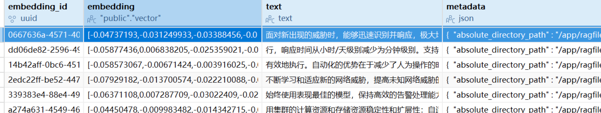

主要就是：**embedding_id、embedding、text、metadata**几个字段。

高维向量embedding：表示存储的向量数据。

text：表示原始的文本信息。

matadata：元数据。检索的时候可以进行精确的过滤、分组或追溯来源。如文件名过滤、时间戳过滤等，在某一些条件下检索更加精准。

## RAG-检索生成

### 用户提问

起点。用户提出了一个问题或者请求。这个查询将作为后续检索和生成的起点。

### 内容召回

如何从知识库中找到与用户提问最相关的Chunk。

检索的方式有很多，如：

- 向量相似度检索：将用户的问题进行向量化（Embedding），得到用户问题的向量语义表示，之后在向量数据库中通过余弦相似度或点积进行相似度查询，找到一系列最相似的文本块。检索的结果通常是:**top-k**个。
- 混合检索：将关键词检索和相似度检索进行整合：
  - BM25/ES（关键词检索，保证精确匹配，获取核心关键内容）；
  - 向量相似度检索（语义检索，保证相似度，捕捉语义相似内容）。

**通过混合检索**：可以让系统在”查的广“和”查的准“之间取得平衡，让系统既能理解语义，又能保证检索的准确性和可靠性。

**重排序**：之前的操作都是”**粗召回**“，这时候可以再使用一个轻量模型（cross-encoder）对这些粗召回的文本块重新打分排序，理解成”**精筛选**“。将最相关的文本块挑选出来，去除排名靠后的文本块，这样的操作，可以让最终进入提示词的文档更加精准。

### 上下文融合

内容召回指的是找到与用户问题最相关的一些资料，真正让大模型生成回答的关键在于：**如何让大模型正确使用这些资料生成答案**。这一步一般是通过Promt来实现。

```markdown
根据以下的信息回答问题：
[检索结果1]： ...
[检索结果2]： ...

问题：2025年总预约人数是多少？
```

这个增强之后的提示将作为生成模型的输入。


### 内容的生成

拿到上下文融合的提示词之后，就可以让大模型回答问题了。因为大模型能够借助这个**”知识外挂“**回答问题了，有效的减少大模型的输出幻觉。

除此之外，RAG中的Metadata也可以在此处体现真正的作用，比如我们在metadata中设计了文件名、参考链接等，那么这边的大模型在生成答案的时候，在回答中就可以附带引用来源和参考链接，提升回答的可信度。

## LlamaIndex 构建 RAG

- 数据索引的构建：支持各种格式的数据（PDF、word等）转成LLM可理解的索引结构。
- 高效检索：
- 与LLM无缝集成
- 支持多种数据源格式
- 模块化可扩展

解决了LLM的幻觉问题、打通了私有数据与通用LLM、简化RAg的架构开发。

### 使用UV构建一个简单的RAG

```shell
uv init llamaindex_test
cd llamaindex_test
uv venv
source .venv/bin/activate
```

```python
from  llama_index.core import VectorStoreIndex, SimpleDirectoryReader
from llama_index.embeddings.dashscope import DashScopeEmbedding
from llama_index.llms.dashscope import DashScope
import os

DASHSCOPE_API_KEY = "sk-*****"

# 1. 加载文档（）
documents = SimpleDirectoryReader("data").load_data()

# 2. 设置向量模型
embedding_model = DashScopeEmbedding(model_name="text-embedding-v2",api_key=DASHSCOPE_API_KEY)

# 3. 设置LLM
llm = DashScope(model_name="qwen-max", temperature=0.1, api_key=DASHSCOPE_API_KEY)

# 4 构建索引
index = VectorStoreIndex.from_documents(documents, embed_model=embedding_model)

# 5 创建查询引擎
query_engine = index.as_query_engine(llm=llm)

response = query_engine.query("请分析一下这篇文档的主要内容")
print(response)

def main():
    print("Hello from llamaindex-test!")


if __name__ == "__main__":
    main()
```

需要添加uv相关依赖。

```shell
uv add llama-index llama-index-llms-dashscope llama-index-embeddings-dashscope
```

执行代码：

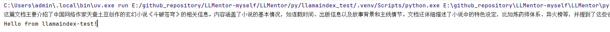

### 问题

尽管实现了一个简单的RAG，但是如果想要在生产环境中使用的话还需要考虑更多的因素：

- chunking 分块的策略优化
- 使用持久化向量数据库
- 查询优化
- 文件检索优化
- 对话记忆
- 重排序
- 混合检索
- 多模态
- RAG效果评估

## 文档预处理

预处理的目标是让后续的分片和向量化能够在干净的数据上进行，从源头保证知识库索引的质量。

主要包含了两个步骤：**文档读取**和**数据清洗**。

文档读取就是将不同格式的文档处理成统一的标准化的可供解析的格式。Spring AI已经存在了一个DocumentReader接口。统一的接口，其中存在多种实现。

- TextReader（TXT）
- JsonReader（JSON）
- PagePdfDocumentReader/ ParagraphPdfDocumentReader（PDF格式）
- MarkdownDocumentReader（Markdown）
- JsoupDocumentReader（HTML）
- TikaDocumentReader（几乎通用）

代码文件参考：[github](https://github.com/wanlinainai/LLMentor/tree/main/rag/src/main/java/com/zxh/llm/llmentor/rag/reader)

上述的方式已经能够成功读取到文件，但是数据可能存在干扰，需要数据清洗。将多余的空格、换行符号、无意义的特殊符号和重复内容进行处理。

```java
    public List<Document> cleanDocuments(List<Document> documents) {
        if (CollectionUtils.isEmpty(documents)) {
            return documents;
        }
        return documents.stream().map(doc -> {
            if (doc == null || doc.getText() == null) {
                return doc;
            }
            String text = doc.getText();
            text = text.replaceAll("\\s+"," ").trim();

            // 去除无意义的乱码
            text = text.replaceAll("[^\\p{L}\\p{N}\\p{P}\\p{Z}\\n]", "");
            
            text = text.toLowerCase();

            String[] paragraphs = text.split("\\n+");
            HashSet<String> seen = new LinkedHashSet<>();
            for (String paragraph : paragraphs) {
                String trimmed = paragraph.trim();
                if (!seen.isEmpty()) {
                    seen.add(trimmed);
                }
            }
            
            text = String.join("\n", seen);
            return new Document(text);
        })
                .collect(Collectors.toList());
    }
```

## 常见的文档分片方式

由于大语言模型的上下文窗口限制，意味着我们不能将整篇文章送入到大模型进行解析处理。在**RAG**中，我们需要将文档拆分成很多的小文本块，到检索生成的环节的时候，检索的就是与用户问题最相似的一部分小文本块。

主要就是几种方式：（只是参考方式）

- 固定大小分片
- 递归分片
- 基于文档的分片
- 语义分片
- 基于LLM分片

具体的分割出来的语义是如何的，可以参考网站：https://www.chunkviz.com/

### 代码实现

我们基于本地的一个PDF文件来做文档的分片：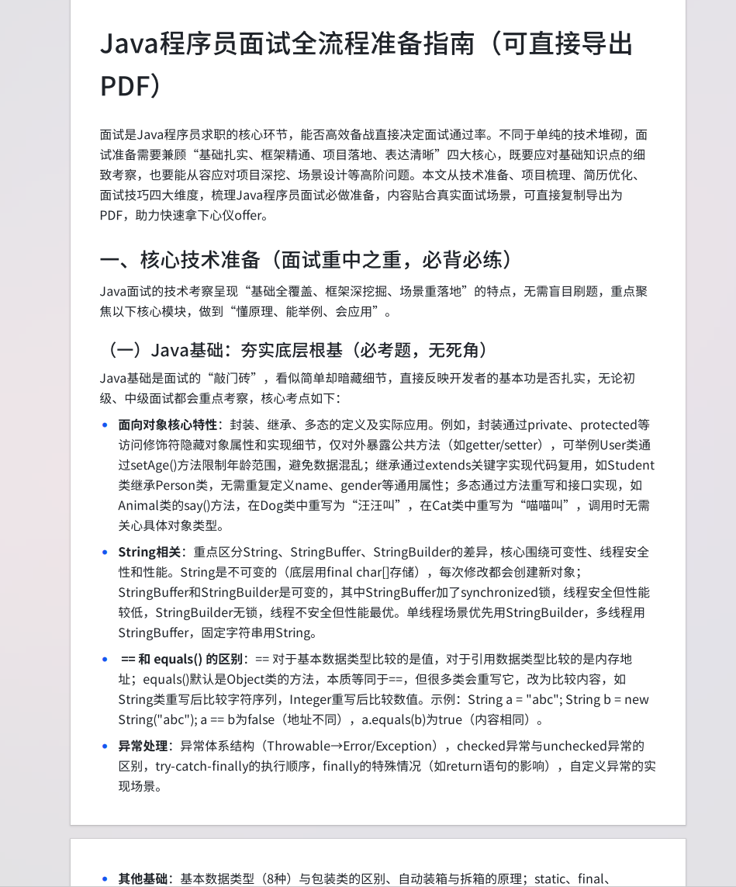

#### 基于Overlap的文档的切割

Spring AI 中的文档切割是不带有 overlap 属性的。也就意味着所有的语句没有重叠。我们基于overlap来自定义实现一个文档的切割器。

```java
public class OverlapParagraphTextSplitter extends TextSplitter {
    
    protected final int chunkSize;
    
    protected final int overlap;
    
    public OverlapParagraphTextSplitter(int chunkSize, int overlap) {
        if (chunkSize < 0) {
            throw new IllegalArgumentException("Chunk size not allowed null");
        }
        if (overlap < 0) {
            throw new IllegalArgumentException("overlap not allowed negative number");
        }
        
        if (overlap > chunkSize) {
            throw new IllegalArgumentException("overlap not allowed gt chunkSize");
        }
        this.chunkSize = chunkSize;
        this.overlap = overlap;
    }
    
    @Override
    protected List<String> splitText(String text) {
        if (StringUtils.isBlank(text)) return Collections.emptyList();

        // 遇到换行 1个或者多个就拆开
        String[] paragraphs = text.split("\\n+");
        List<String> allChunks = new ArrayList<>();
        StringBuilder currentChunk = new StringBuilder();

        for (String paragraph : paragraphs) {
            if (StringUtils.isBlank(paragraph)) continue;
            int start = 0;
            while (start < paragraph.length()) {
                int remainingSpace = chunkSize - currentChunk.length();
                int end = Math.min(start + remainingSpace, paragraph.length());
                
                currentChunk.append(paragraph, start, end);
                
                if (currentChunk.length() >= chunkSize) {
                    allChunks.add(currentChunk.toString());
                    
                    // 计算重叠的值
                    String overlapText = "";
                    if (overlap > 0) {
                        int overlapStart = Math.max(0, currentChunk.length() - overlap);
                        overlapText = currentChunk.substring(overlapStart);
                    }
                    
                    currentChunk = new StringBuilder();
                    if (!overlapText.isEmpty()) {
                        currentChunk.append(overlapText);
                    }
                }
                
                start = end;
            }
        }
        if (currentChunk.length() > 0) {
            allChunks.add(currentChunk.toString());
        }
        return allChunks;
    }
}
```

之后在设置chunkSize和overlap的时候传入100、5.看看效果。

```java
    @RequestMapping("/split")
    public String split(String filePath) {
        List<Document> documents;
        try {
            List<Document> read = documentReaderFactory.read(new File(filePath));
            documents = DocumentCleaner.cleanDocuments(read);
        } catch (IOException e) {
            throw new RuntimeException(e);
        }

        for (Document document : documents) {
            System.out.println("before splitter:" + document.getText());
            System.out.println("");
            OverlapParagraphTextSplitter splitter = new OverlapParagraphTextSplitter(100, 5);

            List<Document> chunkedDocuments = splitter.split(document);
            for (Document chunkedDocument : chunkedDocuments) {
                System.out.println("after chunk:" + chunkedDocument.getText());
                System.out.println("");
            }

            System.out.println("==============================");
        }
        return "success";
    }
```

使用postman来测试这个接口。

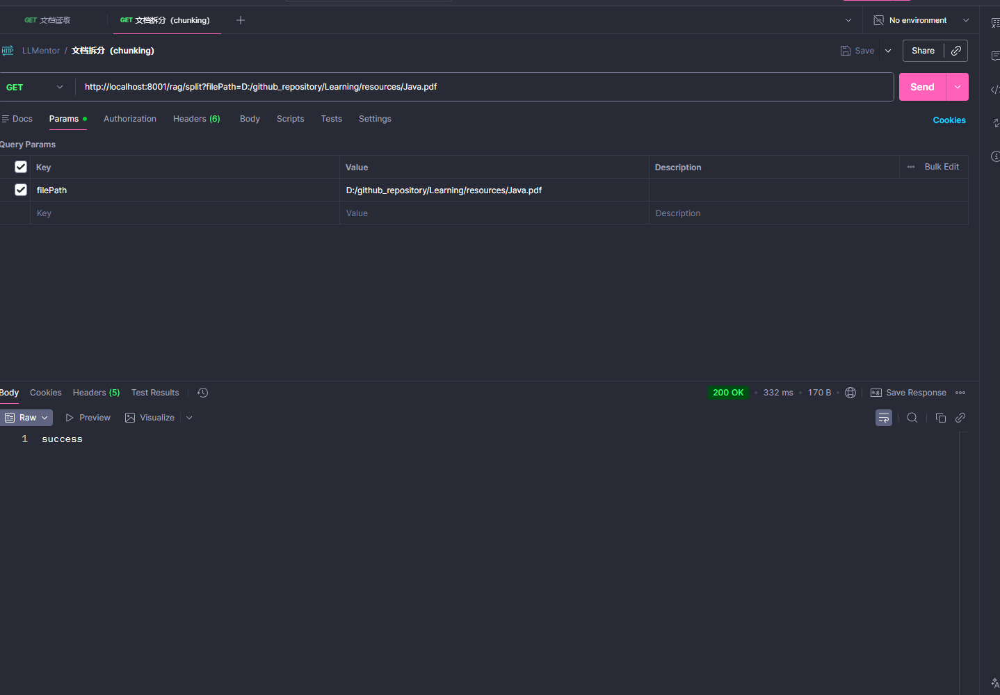

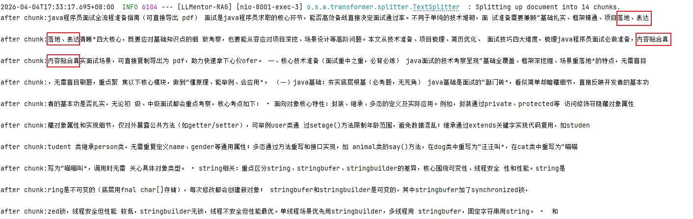

看到文本中的拆分是存在公共部分的。

#### 基于递归进行拆分

```java
    @RequestMapping("/splitRecursive")
    public String splitRecursive(String filePath) { 
        List<Document> documents;
        try {
            documents = documentReaderFactory.read(new File(filePath));
        } catch (IOException e) {
            throw new RuntimeException(e);
        }

        for (Document document : documents) {
            System.out.println("before chunk:" + document.getText());
            System.out.println("");
            // 此处我们将分割的字符设置成换行符号，所以每一行就是一个chunk
            RecursiveCharacterTextSplitter splitter = new RecursiveCharacterTextSplitter(300);
//            RecursiveCharacterTextSplitter splitter = new RecursiveCharacterTextSplitter(300, new String[]{"\n\n", "\n"});

            List<Document> chunkedDocuments = splitter.split(document);

            for (Document chunkedDocument : chunkedDocuments) {
                System.out.println("after chunk:" + chunkedDocument.getText());
                System.out.println("");
            }

            System.out.println("==============");
        }
        
        return "success";
    }
```

使用postman进行接口测试。查看 **after chunk**  结果。

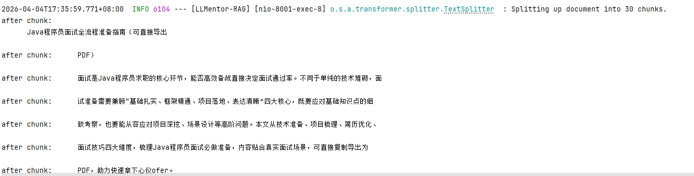

> 需要注意的是：如果你使用的是这个方式的话，文档是不能将空格、换行等符号删除的，否则的话就会出现意想不到的效果，因为是需要基于这些符号来进行分段的。

#### 基于语义拆分

```java
    @RequestMapping("/splitSentence")
    public String splitSentence(String filePath) {
        SentenceSplitter splitter = new SentenceSplitter(100);
        for (Document textSegment : splitter.split(new Document("""
                   Harry Potter is a series of seven fantasy novels written by British author J. K. Rowling. The novels chronicle the lives of a young wizard, Harry Potter, and his friends, Ron Weasley and Hermione Granger, all of whom are students at Hogwarts School of Witchcraft and Wizardry. The main story arc concerns Harry's conflict with Lord Voldemort, a dark wizard who intends to become immortal, overthrow the wizard governing body known as the Ministry of Magic, and subjugate all wizards and non-magical people, known in-universe as Muggles.  \s
                
                   The series was originally published in English by Bloomsbury in the United Kingdom and Scholastic Press in the United States. A series of many genres, including fantasy, drama, coming-of-age fiction, and the British school story (which includes elements of mystery, thriller, adventure, horror, and romance), the world of Harry Potter explores numerous themes and includes many cultural meanings and references.[1] Major themes in the series include prejudice, corruption, madness, love, and death.[2] \s
                
                   Since the release of the first novel, Harry Potter and the Philosopher's Stone, on 26 June 1997, the books have found immense popularity and commercial success worldwide. They have attracted a wide adult audience as well as younger readers and are widely considered cornerstones of modern literature,[3][4] though the books have received mixed reviews from critics and literary scholars. As of February 2023, the books have sold more than 600 million copies worldwide, making them the best-selling book series in history, available in dozens of languages. The last four books all set records as the fastest-selling books in history, with the final instalment selling roughly 2.7 million copies in the United Kingdom and 8.3 million copies in the United States within twenty-four hours of its release. It holds the Guinness World Record for "Best-selling book series for children."[5] \s
                """))) {
            System.out.println(textSegment.getText());
            System.out.println("===========================");
        }
        return "success";
    }
```

上述是一段关于哈利波特的英文的介绍。

我们使用`SentenceSplitter`进行拆分。

使用postman进行接口测试：

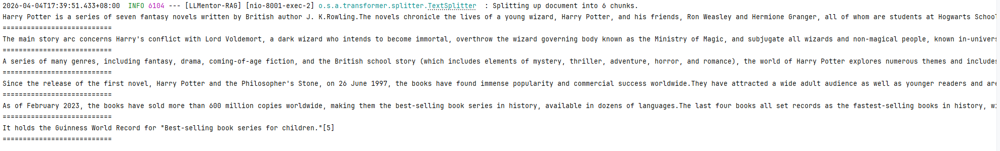

发现分成了6段chunk。

### 父子分片

父子分片通过将大块文本作为父文本保留上下文，切分成多个子块用来检索，兼顾两者的优势。

- 小分片：句子或者段落，语义粒度细，精确匹配用户查询，缺少足够的上下文，导致生成的时候信息不够完整。
- 大分片：整段或者整个章节。生成高质量回答，但是可能导致“信号稀释”的问题。

检索阶段使用**子块**进行向量匹配，提高与用户查询的语义对齐度。生成阶段返回对应的**父块**作为LLM的输入，确保模型拥有足够背景信息生成准确、连贯的回答。


- embedding模型是有token限制的。如text-embedding-v4这个模型的限制大小是8192

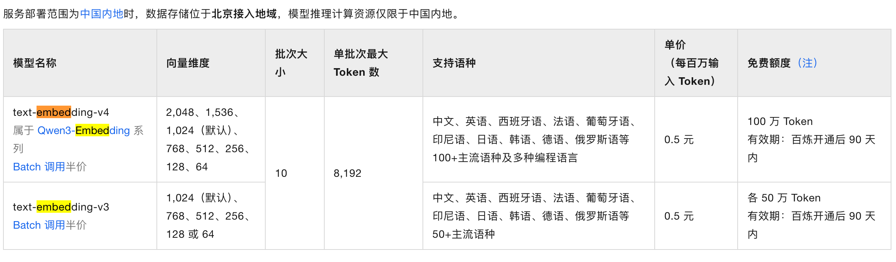

如果一个分片长度超过这个Token数量的话会出现没有办法存储到向量库的。也就意味着不管是什么方式的embedding，都需要支持一个chunkSize字段，保证模型本身不支持处理的情况。

- 切分之后语义会丢失

按照上述的方法的话一定会出现语义拆开的问题。同一句话出现在两个分片中。

有一种方式的话就是通过overlap，做点冗余和重叠。

但是这种的话对于图片和表格一类的是有问题的，没有办法做overlap。

为了满足小文本块的嵌入和检索，又能满足大文本块的完整性召回。那就是父子分块了。

**文档分片阶段**

将原始的文本存到对象数据库中，有一个句子：`我是一个完整的句子`。按照overlap = 5来拆分的话，就会出现`我是一个完`、`整的句子`。

按照上述的说法来看：

- `我是一个完整的句子`， id = 5   ----> MySQL
- `我是一个完`，parentChunkId = 5 ---->  pgvector（代指PG的向量库）
- `整的句子`，parentChunkId = 5  ---->  pgvector

我们需要在两个子chunk中的metadata记录一下(parentChunkId = 5)。当前分片是一个分片，以及它对应的分片的ID。

只有子分片做了索引构建，保存到了向量数据库中，所以在语义相似度召回的时候只通过子分片召回。

召回之后，我们判断这个分片是不是子分片，如果是的话取出父分片id，去关系型数据库中查询父分片，替换成子分片的内容，交给LLM做资料参考。

## 向量模型

### 向量模型

Spring AI 提供了EmbeddingModel接口，用于提供给各个厂商的离线向量模型快速接入。同时也可以使用一些在线的向量模型。

#### DashScopeEmbeddingModel

DashScopeEmbeddingModel是阿里云百炼平台的一个embeddingModel的实现方式，在我们的Spring 中会默认有这个Bean，可以直接用。

```yaml
spring:
  ai:
    dashscope:
      embedding:
        options:
          model: text-embedding-v4
          dimensions: 768
```

#### 定义EmbeddingService

```java
@Service
public class EmbeddingService {

    @Autowired
    private EmbeddingModel embeddingModel;

    @Autowired
    private VectorStore vectorStore;

    /**
     * 向量化
     */
    public List<float[]> embed(List<Document> documents) {
        return documents.stream().map(document -> embeddingModel.embed(document.getText()))
                .collect(Collectors.toList());
    }

    /**
     * 向量化并存储向量库
     */
    public void embedAndStore(List<Document> documents) {
        List<List<Document>> batches = new ArrayList<>();
        for (int i = 0; i < documents.size(); i += 9) {
            batches.add(documents.subList(i, Math.min(i + 9, documents.size())));
        }

        for (List<Document> batch : batches) {
            vectorStore.add(batch);
        }
    }
}
```

两个方法：`embed`和`embedAndStore`。

使用的PGVectorStore。

不同的embedding模型都会有批次大小的限制。

所以我们在做`embedAndStore`操作的时候，一次处理9个Document。

如果在yml中设置`max-document-batch-size`的话控制不了大小的。

#### 向量存储

```java
    @RequestMapping("/embed")
    public String embed(String filePath) {
        List<Document> documents;
        try {
            documents = documentReaderFactory.read(new File(filePath));
        } catch (IOException e) {
            throw new RuntimeException(e);
        }
        List<Document> allChunkedDocuments = documents.stream()
                .flatMap(document -> {
                    RecursiveCharacterTextSplitter splitter = new RecursiveCharacterTextSplitter(300, new String[]{"\n\n", "\n"});
                    return splitter.split(document).stream();
                })
                .collect(Collectors.toList());

        embeddingService.embedAndStore(allChunkedDocuments);
        return "success";
    }
```

经过VectorStore向量化 + 存储这两个步骤，我们可以打开向量数据库查看一下，就会发现：

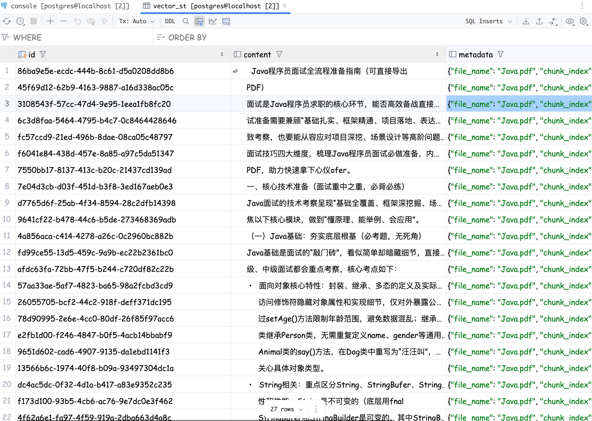

其中存在几个字段：`id`、`content`、`metadata`和`embedding`四个字段。

### 向量模型怎么选择呢

一般就是从部署复杂度、检索性能、可扩展、方便集成、社区活跃度几个方面来评估。

- PGVector：是一个PGSQL的扩展，只需要在PGSQL上执行CREATE EXTENSION vector。
- Chroma：轻量向量数据库。
- Milvus：数据量大、分布式系统需要部署。
- ES：关键词 + 混合检索

没有最好的只有最合适的。

## 检索增强生成

首先通过向量相似度检索，能够从数据库中筛选出与用户问题最接近的内容。实现增强生成的效果。

### 相似度检索

```java
    @RequestMapping("/query")
    public String query(String query) {
        List<Document> documents = embeddingService.similaritySearch(query);

        StringBuilder sb = new StringBuilder();
        for (Document document : documents) {
            System.out.println(document.getText());
            sb.append(document.getText()).append("\n");
            sb.append("======================");
        }

        return sb.toString();
    }
```

```java
@Service
public class EmbeddingService {

    @Autowired
    private EmbeddingModel embeddingModel;

    @Autowired
    private VectorStore vectorStore;

    /**
     * 向量化
     */
    public List<float[]> embed(List<Document> documents) {
        return documents.stream().map(document -> embeddingModel.embed(document.getText()))
                .collect(Collectors.toList());
    }

    /**
     * 向量化并存储向量库
     */
    public void embedAndStore(List<Document> documents) {
        List<List<Document>> batches = new ArrayList<>();
        for (int i = 0; i < documents.size(); i += 9) {
            batches.add(documents.subList(i, Math.min(i + 9, documents.size())));
        }

        for (List<Document> batch : batches) {
            vectorStore.add(batch);
        }
    }

    private static final int TOP_K = 5;
    private static final double DEFAULT_SIMILARITY_THRESHOLD = 0.5;
    public List<Document> similaritySearch(String query) {
        return vectorStore.similaritySearch(SearchRequest.builder()
                        .query(query)
                        .topK(TOP_K)
                        .similarityThreshold(DEFAULT_SIMILARITY_THRESHOLD)
                .build());
    }

    public List<Document> similaritySearch(SearchRequest searchRequest) {
        return vectorStore.similaritySearch(searchRequest);
    }
}
```

- query ： 用于检索的查询语句。这个Query会自动与向量库中的存储的向量进行比对
- topK：返回结果条数，最相近的
- similarityThreshold：相似度阈值（0 ~ 1）

### 增强生成

```java
    @Autowired
    private ChatModel chatModel;
    @GetMapping("/retrieve")
    public String retrieve(String query, Double threshold) {
        List<Document> documents = embeddingService.similaritySearch(SearchRequest.builder()
                .query(query)
                .similarityThreshold(threshold)
                .build());

        String documentContent = documents.stream()
                .map(Document::getText)
                .collect(Collectors.joining("\n\n==========文档分割线=========\n\n"));


        // 构建提示词模板
        String promptTemplate = """
                请基于以下提供的参考文档内容，回答用户的问题。
                如果参考文档中不存在筛选的内容的话，直接提示用户“没有找到对应信息”，不要编造内容。
                
                参考文档：
                {documents}
                
                用户问题：
                {question}
                """;

        PromptTemplate template = new PromptTemplate(promptTemplate);
        Prompt prompt = template.create(Map.of("documents", documentContent, "question", query));

        return chatModel.call(prompt).getResult().getOutput().getText();
    }
```

看看效果：

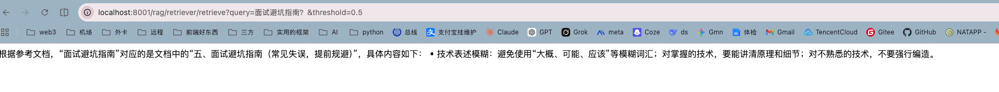

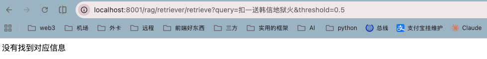

上面两个分别是能检索到和检索不到的情况，我们的文档内容如下：

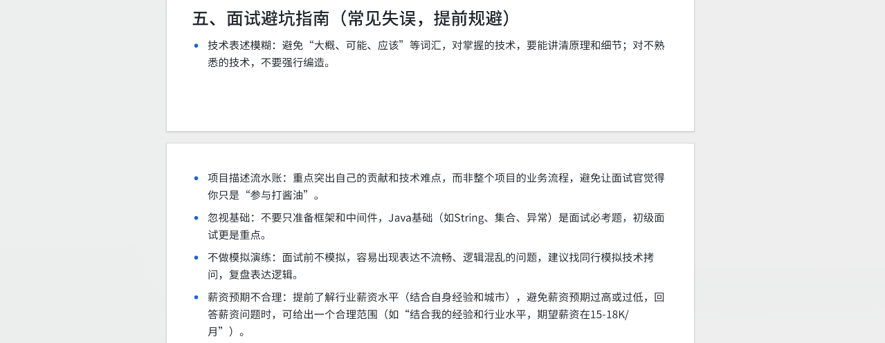

可以看到内容输出的还是比较精准的。

### 上述的代码还是有点冗余了，我们可不可以换一种方法来实现呢？QuestionAnswerAdvisor

导入依赖：

```xml
<dependency>
  <groupId>org.springframework.ai</groupId>
  <artifactId>spring-ai-advisors-vector-store</artifactId>
  <version>1.1.0</version>
</dependency>
```

```java
    @GetMapping("/retrieveAdvisor")
    public Flux<String> retrieveAdvisor(String query, HttpServletResponse response) {
        response.setCharacterEncoding("UTF-8");
        return chatClient.prompt(query).stream().content();
    }

    @Override
    public void afterPropertiesSet() throws Exception {

        String promptTemplate = """
                请基于以下提供的参考文档内容，回答用户的问题。
                如果参考文档中不存在筛选的内容的话，直接提示用户“没有找到对应信息”，不要编造内容。
                
                参考文档：
                {question_answer_context}
                
                用户问题：
                {query}
                """;

        PromptTemplate template = new PromptTemplate(promptTemplate);

        QuestionAnswerAdvisor advisor = QuestionAnswerAdvisor.builder(vectorStore)
                .searchRequest(SearchRequest.builder().similarityThreshold(0.5).topK(5).build())
                .promptTemplate(template)
                .build();

        chatClient = ChatClient.builder(chatModel)
                .defaultAdvisors(advisor)
                .defaultOptions(
                        DashScopeChatOptions.builder()
                                .withTopP(0.5)
                                .build()
                )
                .build();
    }
```

> 实现bean 初始化的流程接口：`InitializingBean`。重写方法：**afterPropertiesSet**。在其中我们设置好`QuestionAnswerAdvisor`和相关的`promptTemplate`提示词。
>
> 需要注意：在提示词模板中的占位符必须是：`question_answer_context`和`query`。这是QuestionAnswerAdvisor中需要去进行匹配的。

查看效果：

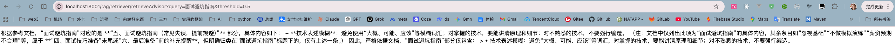

这个`QuestionAnswerAdvisor`中已经帮我们做好了相关的RAG流程。

我们只需要在初始化的时候设置到advisor即可。

大大简化了开发。

#### QuestionAnswerAdvisor原理

**初始化**

将向量库、检索请求（TopK）、提示词模板等等提供默认值，也是允许我们自定义。

**前置处理**

before方法就是前置处理。很简单，就是先进行相似度检索；文档内容拼接到上下文；注入到Prompt；最终是生成调用LLM大模型回复

**后置处理**

after方法就是在模型回答之后执行，做一些收尾的动作。将检索到的文档信息（包括元数据）加载到响应元数据中，但是不修改模型的回答。

## 元数据过滤

RAG中，元数据（Metadata）就是附加到文本块（chunk）上的结构化信息，描述了该文本块的数据。主要就是一些附件信息，比如文件名、用户id、页码等等，可以用来区分权限。

### 使用场景

- 精确过滤：如果在向量化的时候将元数据存入到数据库中，之后可以根据这个metadata来做筛选
- 提供参考源：比如文档名称、页码或者章节位置、文档类型或者版本号
- 访问权限：比如按照部门ID/角色id/用户id；生效时间或者版本状态

我们有三个文档：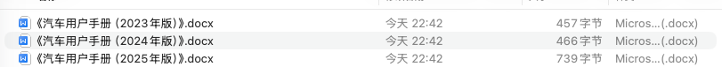

不同版本的三个使用手册

#### 向量构建

首先先构建Embedding向量索引。

```java
    @GetMapping("/embedding")
    public String embedding(String filePath, String fileName) {
        List<Document> documents;
        try {
            // File文件的后缀是.docx，默认走的是Tika的解析器
            documents = documentReaderFactory.read(new File(filePath));
        } catch (IOException e) {
            throw new RuntimeException(e);
        }

        for (Document document : documents) {
            document.getMetadata().put("fileName", fileName);
        }

        // embedding
        embeddingService.embedAndStore(documents);

        return "success";
    }
```

#### 检索过滤

主要就是`filterExpression`属性

```java
    @GetMapping("/retrieveMetadata")
    public String retrieveMetadata(String query, String fileName) {
        SearchRequest searchRequest = SearchRequest.builder().query(query).topK(5).similarityThreshold(0.5).filterExpression("fileName =='" + fileName + "'").build();
        return embeddingService.similaritySearch(searchRequest).toString();
    }
```

这个地方的similarityThreshold阈值调的低一点，可以检索到更多的内容。具体业务的话需要按照不同的业务来做具体的设置。

如果是需要利用Advisor的话怎么做呢？

```java
    @GetMapping("/retrieveAdvisorWithMetadata")
    public String retrieveAdvisorWithMetadata(String query, String fileName) {
        return chatClient.prompt(query)
                .advisors(advisorSpec -> advisorSpec.param("qa_filter_expression", "fileName =='" + fileName + "'"))
                .call()
                .content();
    }
```

主要就是将advisors中设置上param属性的`qa_filter_expression`。这个是QuestionAnswerAdvisor规定的。

测试一下看看：

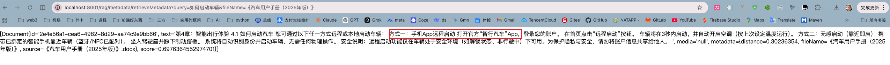

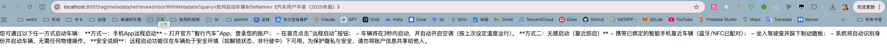

## 问题改写

主要原因是用户的问题不可控，往往存在语义模糊、信息缺失、上下文依赖等问题。很难匹配到高效的文档块。需要对用户的输入查询进行优化提高检索的准确率和生成答案的质量。

主要是以下四种方式：**富化、分解、多样化、回溯提示**。

### 分解

将复杂、多步骤、包含多个子问题的查询拆分成若干个相互独立、更简单、更具体的子问题。

比如用户提问：IPhone 15 发布的时候，苹果的CEO是谁？

这就可以拆分成多个问题：

Q1:IPhone15 什么时间发布的？

Q2:23年的时候苹果CEO是谁？

Prompt提示词：

```shell
# 角色
你是一名专业的查询逻辑分析专家。
 
# 任务
将给定的“用户原始问题”分解为一系列**相互独立、逻辑清晰**，且可单独用于检索的子查询列表。
你的输出必须是一个标准的JSON数组格式。
 
# 用户原始问题
{QUESTION}
 
# 输出格式要求 (JSON Array)
[
  "子查询1",
  "子查询2",
  "子查询3",
  "..."
]

（不强制要求数组元素个数，可根据真实情况输出，至少保留1个）
 
# 输出
请直接输出JSON数组，不要包含解释或多余的文字。
```

### 富化

指的是在原始查询中添加上下文信息、背景知识或必要的限制条件。用来消除歧义、补充确实的信息。

比如，在对话中问：他有什么特点？这个他具体指的是什么需要补充，。

Prompt提示词：

```shell
# 角色
你是一个专业的问题重写优化器。

# 任务
根据提供的“对话历史”和“用户原始问题”，重写为一个独立、完整、且包含所有必要背景信息的新查询，用于RAG检索。

## 对话历史： 
{CHAT_HISTORY}

## 原始问题： 
{QUESTION}

# 输出
输出富化过后的新问题，不要包含多余的解释性内容
```

### 多样化

是指对用户查询生成多个语义相近或相关的变体，提升知识库内容的描述多样性覆盖，增强召回率。

1. 描述风格不一致：文档的表述方式不同，有的是“接口性能优化”，有的是“提升接口响应速度”
2. 用户表述差异化：不同用户表达方式不同。

Prompt提示词

```shell
# 角色
你是一名专业的语义扩展专家。
 
# 任务
为给定的“原始问题”生成**3个**语义相同但**措辞完全不同、且利于检索**的查询变体，以提高检索的召回率。
你的输出必须是一个标准的JSON数组格式。
 
# 原始问题
{QUESTION}

# 输出格式要求 (JSON Array)
[
  "变体1",
  "变体2",
  "变体3"
]
 
# 输出
输出富化过后的新问题，不要包含多余的解释性内容
```

### 回溯提示

核心思想是先引导模型“后退一步”，从具体问题中抽象出来一般的原理、概念或者背景知识；之后基于这些进行推理或者检索，最终回答原始问题。

比如：`我奶奶结婚，我可以请几天的假期？`。这种的话不同的公司有不同的规定，需要将问题拆分成：`探亲假政策是什么样子的？`、`结婚的请假可以请几天？`、`已经请了几天假？还剩下多少天可以请？`等等。

Prompt提示词：

```shell
# 角色
你是一个擅长抽象思维和原理推理的专家。
            
# 任务
请根据用户提出的具体问题，先“后退一步”，将其转化为一个更通用、更本质的问题，聚焦于背后的原理、规律、概念或一般性知识，而不是具体细节。
            
# 原始问题

{QUESTION}

# 输出         
请只输出改写后的“后退问题”，不要解释，不要包含原始问题，也不要回答它。
```


