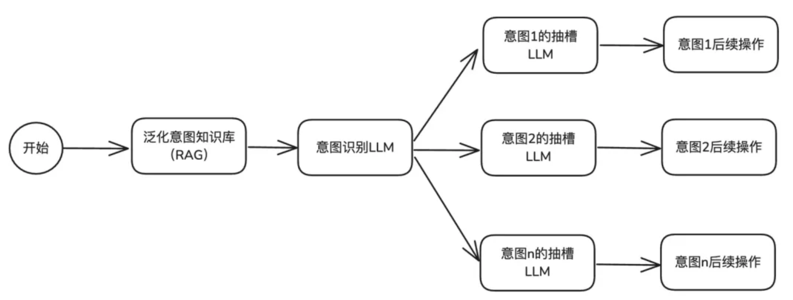

# 智能客服项目（RAG）

## Java中解析PDF的局限

### 使用Spring AI解析

```java
public void read() {
        PdfReaderStrategy pdfReaderStrategy = new PdfReaderStrategy();
        try {
            List<Document> documents = pdfReaderStrategy.read(new File("D:\\github_repository\\Learning\\resources\\r7-product-manual-20250123.pdf"));
            for (Document document : documents) {
                System.out.println(document.getText());
                System.out.println("=======================");
            }

        } catch (IOException e) {
            throw new RuntimeException(e);
        }
    }
```

最终的结果：


可以发现，解析出来的位置完全不可控。

同时图片信息完全没有办法解析出来。

同时存在大量的空白字符。

表格解析出来的内容乱七八糟。

对比：

### 多模态解析

```java
    @Test
    public void readByMultipleFiles() throws Exception {
        String content = pdfMultimodalProcessor.processPdf(new File("D:\\github_repository\\Learning\\resources\\r7-product-manual-20250123.pdf"));
        System.out.println(content);
    }
```

最终解析出来的结果：

可以看出来能够解析出来图片的内容，但是表格的解析存在问题：


很明显不知道什么对应什么。

同时还是存在空白字符的问题。

### Langchain4J

使用Langchain4J的时候问题其实依旧，但是结构的问题其实解决了：


但是空白字符一类的问题依旧。需要解决。

## 使用MinerU解析PDF文档


## chunkSize和overlap设置多少合适？

### 通用起点推荐

RAG系统中没有黄金比例，我们采用的还是和线程池参数类似的方法，先设置一个通用的值，之后从推荐值开始一点一点调整。

chunkSize和overlap指的是字符数量，并不是Token数量。

`chunk_size`一般设置512或者1024个Token，部分模型的Token数量是512 的限制，比如：bge-small-zh，百炼上的text-embeding-v3、v4都是8092个Token的大小。

>一个Token大概是在1.5 - 2 个汉字之间，在3 - 4个英文字符之间。如果是纯中文文本的话，大概初始值设置成500-1000左右的chunkSize，英文的话是2000-3000左右的chunkSize

overlap的话大概按照chunkSize的10%-20%比例。

- `chunk_size`太小，容易导致语义的碎片化，丢失关键上下文。（虽然说用了父子分片能够缓解这个现象，但是可能出现上下文太长的问题）
- `chunk_size`太大，会包含太多的无关信息，稀释核心的语义，降低检索的精准度，增加成本。
- `overlap`为0，极易出现在切分边界丢失信息，导致相邻的语义块断裂。

### 按照文档类型调整


### 项目中的分段方式


## 向量维度的构建


上述是我们项目中配置的关于向量维度的设计，比如现在配置的是1536维度。那么这个维度有什么考究呢？

**核心原则就是：向量模型必须和选择的Embedding模型的输出维度完全一致。**

每一个Embedding模型在将文本转成向量的时候，都会生成一个固定长度的浮点型数组，这个数组长度就是向量的维度。

- 如果使用的`OpenAI`的`text-embedding-ada-002`，输出维度就是1536.
- 如果使用的是`bge-small-zh-v1.5`模型的话，输出向量维度就是384维。

当然，我们使用的是`text-embedding-v1`模型，这个是支持1536维度的，所以我们设置的就是1536位维。但是阿里云百炼中有其他的Embedding模型支持的是多维度向量的，比如：`text-embedding-v4`是支持：`2048 1536 1024（默认） 768 512 256 128 64`的。

更高的维度意味着能够保留更加丰富的语义信息，但是也会相应增加存储和计算的成本。比如：`text-embedding-v4`：

- 通用场景（推荐）: 1024维度是性能和成本的平衡点，适用于绝大多数语义检索的场景。
- 追求精度：对于高精度的场景，可以选择1536或者2048，这会产生一定的精度提升，但是存储和计算开销会大大增加。
- 资源受限：对于成本敏感的场景，可以选择768以下的维度。但是会损失部分语义信息。

## 处理Excel文件

我们之前的处理PDF文件的方式是通过Mineru实现的，市面上也是存在一些处理Excel的方案，首先会通过`LibreOffice`将文件转成PDF格式，之后使用minerU进行表格区域识别。

但是这种方式的话纯属脱裤子放屁了。

Excel本身就是表格结构，大体上存在两种方式：一种是存储到向量数据库中，另一种是存储到向量数据库中。

如果是关系型数据库的话，检索的时候直接通过SQL即可。如果是向量数据库的话，就使用语义相似度查询。

### ragflow的实现方式

核心代码位置：https://github.com/infiniflow/ragflow/blob/main/deepdoc/parser/excel_parser.py

**键值对文本输出（默认）**

假设存在一个表格（销售报表.xsl）：

| 姓名 | 部门     | 销售额 |
| ---- | -------- | ------ |
| 张三 | 销售一部 | 200万  |
| 李四 | 销售二部 | 250万  |

经过ragflow处理之后：

> 姓名：张三；部门：销售一部；销售额：200万 ---- 销售报表
>
> 姓名：李四；部门：销售二部；销售额：250万 ---- 销售报表

**HTML表格输出**

当html4excel=true的时候，输出HTML格式的表格

输出示例：

```html
<table>
  <thead>
    <tr>
      <th>ID</th>
      <th>名称</th>
      <th>描述</th>
    </tr>
  </thead>
  <tbody>
    <tr>
      <td>1</td>
      <td>项目1</td>
      <td>这是第1个项目的描述</td>
    </tr>
    <tr>
      <td>2</td>
      <td>项目2</td>
      <td>这是第2个项目的描述</td>
    </tr>
</table>
```

html格式的参数中存在一个增加的参数：`chunk_rows=256`。为什么需要这个参数呢?主要还是因为担心大模型的上下文太长的问题。

### Java实现的ragflow方式

参考项目中的ExcelSplitter代码。

### Excel To DB

Excel的数据并不适合放在向量数据库中，原因是本身表格的数据就已经是结构化的数据了。更适合直接放在关系型数据库中。

### 项目中的实现方式

在Excel文件上传的时候不需要做什么其他操作，上传成功之后将Document状态变成STORED（不需要CONVRETED）。

针对于Excel的分词器我们是通过新建一个ExcelSplitter来实现的。

所以在Split的时候需要进行判断，如果是Excel的话单独处理，走ExcelSplitter。

不需要走ES的向量化。

upload的时候：

我们会现在动态创建一个表用于存储数据，并将数据放入到新创建的表中。在tableMeta表中记录元数据处理情况。

在split的时候：

我们是按照数据条数来进行分片的。每一条数据都是一个chunk。

## 意图识别

主要目的就是判断用户输入的信息准确路由到背后的语义目标（如“查询订单”、“订机票”等等）。主要就是将请求路由到不同的子Agent中来进行处理。

### 提示词工程实现

这是最简单的实现方式，主要就是会用到角色的定义、few-shot以及结构化输出

```shell
# 角色定义

你是一个专业的客服意图识别专家。请分析用户的输入，判断是否与汽车相关，并识别其意图和关键信息。为了确保高准确率，请在输出最终结果前，先进行逻辑推理和分析。

# 相关性判断
  首先判断用户输入是否与“汽车”相关（如买车、用车、修车、投诉等）。
  如果不相关，直接输出：{"related": false}
  如果相关，继续执行以下步骤。
# 意图分类体系

1.  **售前咨询与购买**
    - 涵盖：车型配置询问、价格/优惠/购车政策、试驾预约、经销商/门店查询、库存查询。
    - 特征：用户处于“看车/买车”阶段。
2.  **售后维修与保养**
    - 涵盖：进店维修预约、故障报修（明确要求去店里）、保养服务、维修进度查询、配件价格询问。
    - 特征：用户处于“修车/养车”阶段，有明确的进店或人工服务需求。
3.  **车辆使用与技术指导**
    - 涵盖：车辆功能操作（如“怎么开天窗”）、仪表盘/故障灯解读、用车技巧、零部件更换教程（DIY）、技术原理咨询。
    - 特征：用户处于“用车”阶段，需求是“学习如何操作”或“了解原理”，而非直接要求进店维修。
    - *辨析：* “雨刮器怎么换”属于此类（教程）；“雨刮器坏了去换一下”属于售后维修。
4.  **投诉与维权**
    - 涵盖：产品质量投诉（异响、死机等）、服务态度投诉、维修争议、法律/安全诉求。
    - 特征：用户带有负面情绪，表达不满或追责意愿。
5.  **客户关怀与运营**
    - 涵盖：会员权益、活动邀约、满意度回访、积分兑换。
6.  **闲聊与通用问答**
    - 涵盖：打招呼、无意义字符、与汽车无关的闲聊（如天气、育儿）。
    - 注意：此类 `related` 字段应为 `false`。
7.  **其他**
    - 涵盖：无法归类到以上任何一项的汽车相关模糊意图。


# 输出格式示例

{
  "related": true,
  "intent": "技术支持与使用"
}
```

上述就是一个最基本的示例。

优点就是比较简单高效。不需要复杂的算法实现。缺点的话也是比较明显的，当意图识别的内容增多的时候，需要对每一个意图进行重写提示词，不仅会导致提示词膨胀，还会出现模型发散的问题导致意图识别失败。

### 提示词工程 + 槽位

槽位的抽取就是让LLM从用户的问题中抽取特定信息（槽位），比如“订机票”就需要意图识别出：“出发地”、“目的地”、“时间”等信息。

还是上述的提示词，我们做出以下优化：

```shell
# 角色定义

你是一个专业的客服意图识别专家。请分析用户的输入，判断是否与汽车相关，并识别其意图和关键信息。为了确保高准确率，请在输出最终结果前，先进行逻辑推理和分析。

# 相关性判断
  首先判断用户输入是否与“汽车”相关（如买车、用车、修车、投诉等）。
  如果不相关，直接输出：{"related": false}
  如果相关，继续执行以下步骤。

# 意图分类体系

1.  **售前咨询与购买**
    - 涵盖：车型配置询问、价格/优惠/购车政策、试驾预约、经销商/门店查询、库存查询。
    - 特征：用户处于“看车/买车”阶段。
2.  **售后维修与保养**
    - 涵盖：进店维修预约、故障报修（明确要求去店里）、保养服务、维修进度查询、配件价格询问。
    - 特征：用户处于“修车/养车”阶段，有明确的进店或人工服务需求。
3.  **车辆使用与技术指导**
    - 涵盖：车辆功能操作（如“怎么开天窗”）、仪表盘/故障灯解读、用车技巧、零部件更换教程（DIY）、技术原理咨询。
    - 特征：用户处于“用车”阶段，需求是“学习如何操作”或“了解原理”，而非直接要求进店维修。
    - *辨析：* “雨刮器怎么换”属于此类（教程）；“雨刮器坏了去换一下”属于售后维修。
4.  **投诉与维权**
    - 涵盖：产品质量投诉（异响、死机等）、服务态度投诉、维修争议、法律/安全诉求。
    - 特征：用户带有负面情绪，表达不满或追责意愿。
5.  **客户关怀与运营**
    - 涵盖：会员权益、活动邀约、满意度回访、积分兑换。
6.  **闲聊与通用问答**
    - 涵盖：打招呼、无意义字符、与汽车无关的闲聊（如天气、育儿）。
    - 注意：此类 `related` 字段应为 `false`。
7.  **其他**
    - 涵盖：无法归类到以上任何一项的汽车相关模糊意图。


# 关键信息提取

  提取以下信息，如果没有提到则填 null：
  car_model：车型（如 "A6L"）
  order_id：订单号/合同号
  dealer：经销商/门店名称
  fault_description：故障现象描述
  appointment_time：预约时间
  part_name：配件名称（如 "轮胎"）
  function_name：功能名称（如 "自动泊车"）
  warning_light：故障灯名称（如 "发动机灯"）

# 输出格式示例

{
  "related": true,
  "intent": "用户意图",
  "entities": {
    "car_model": "...",
    "order_id": "...",
    "dealer": "...",
    "fault_description": "...",
    "appointment_time": "...",
    "part_name": "...",
    "function_name": "...",
    "warning_light": "..."
  }
}
```

优点是后续的处理会更加简单，关键信息都已经存在了，完全可以直接使用。缺点是如果意图很多，或者槽位很多，仍然需要不断调整提示词也会影响输出效果。

### 提示词、槽位分离

将意图识别拆分成两个类型：意图识别、槽位提取。

1. **意图识别**：提示词只包含简要的意图识别。
2. **槽位提取**：路由到不同的意图节点处理关键信息。

优点是架构清晰，易于维护，如果要新增意图的话加一个节点即可。如果要修改的话只需要对涉及到的节点处理即可。缺点是需要调用两次LLM，响应时间会有所增加。

### 前置RAG召回

基本上述的几种情况已经可以覆盖绝大多数的问题了，如果业务逻辑更加复杂的话，比如可能涉及到方言、口语化的非常规的表达的时候。

这种的话可以利用前置RAG做处理。



1. **构建语料知识库**：提前为每一个意图收集大量的用户问法（Query），包括一些标准问法、同义化、口语化表达等。
2. **检索辅助识别**：拿到用户提问的问题进行相似度检索，找到几个最相似的问法以及其中的意图。
3. **LLM辅助决策**：将检索到的问法作为示例（Few-Shot），连同用户的原始问题一起提交给LLM。

优点就是无需调整提示词，成本和准确率更好。

缺点就是太复杂了。

一般适用于大量特异化表达的垂直领域场景。比如地铁公交查询、地域化客服系统等。

> 说到数据库，还有一种简单的方法，不需要RAG流程，但是只适合一开始的简单的场景。
>
> 我们将意图收集到对象存储中，之后在使用的时候从数据库中取出来拼接到提示词中，如此一来，我们就不需要调整代码中的提示词，修改数据库中的数据即可。更方便。

### 多轮对话上下文关联

做意图识别的时候需要考虑到将用户的历史对话、近期操作的文档或数据作为辅助信息输入给模型，帮助模型理解当前请求的完整的上下文。

### 问题澄清

当用户提问比较模糊的时候预期猜测不如抛出问题让用户补充。再结合上下文进行总体的结构输出。


