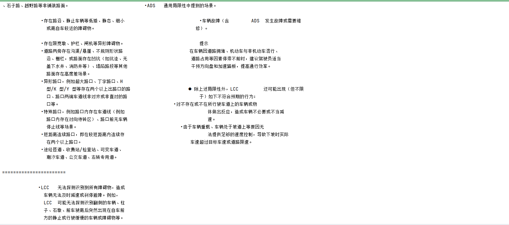
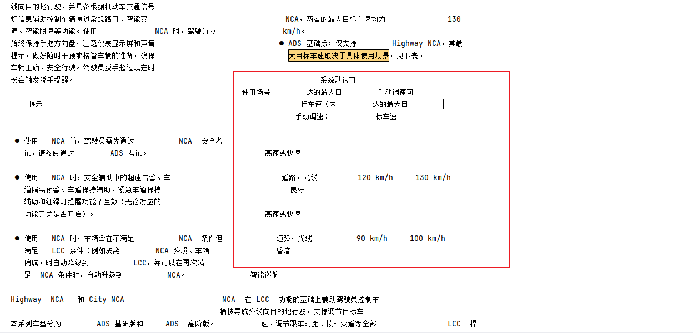
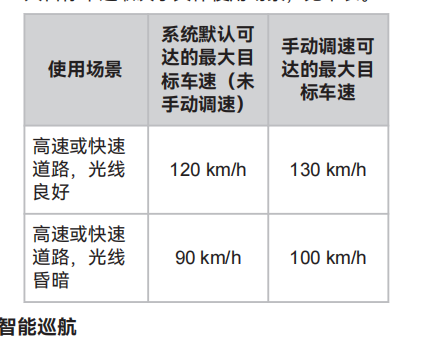
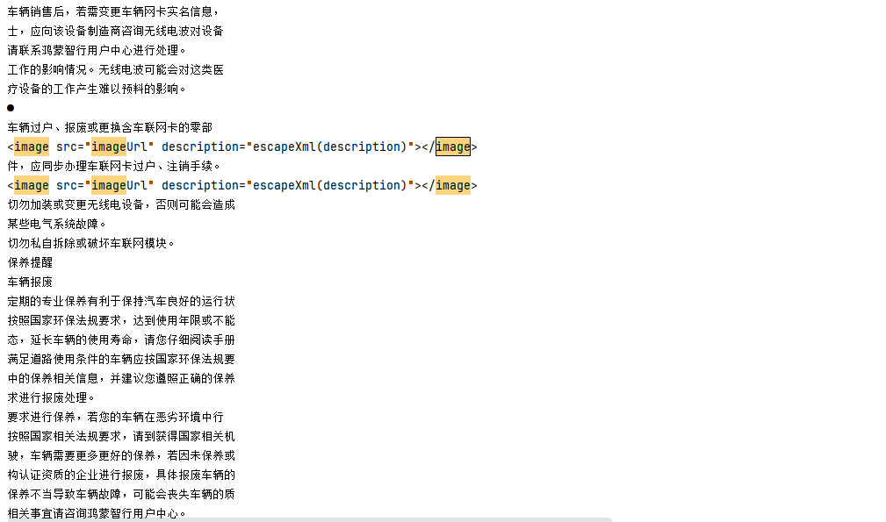
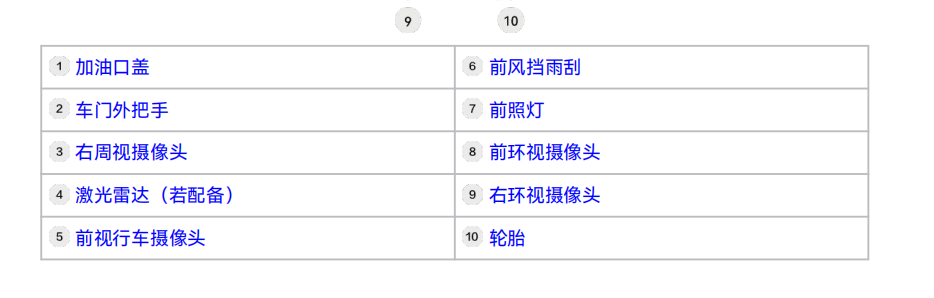
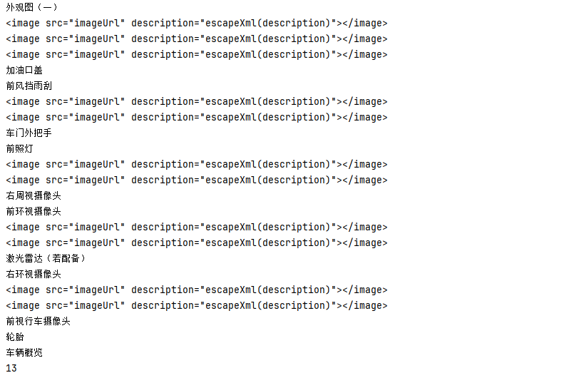
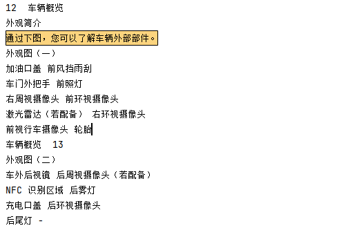
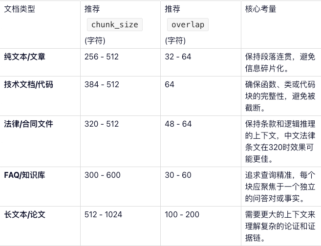
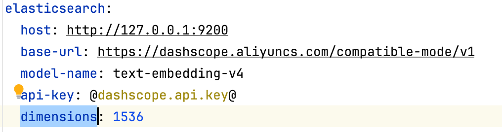

# 智能客服项目（RAG）

## Java中解析PDF的局限

### 使用Spring AI解析

```java
public void read() {
        PdfReaderStrategy pdfReaderStrategy = new PdfReaderStrategy();
        try {
            List<Document> documents = pdfReaderStrategy.read(new File("D:\\github_repository\\Learning\\resources\\r7-product-manual-20250123.pdf"));
            for (Document document : documents) {
                System.out.println(document.getText());
                System.out.println("=======================");
            }

        } catch (IOException e) {
            throw new RuntimeException(e);
        }
    }
```

最终的结果：



可以发现，解析出来的位置完全不可控。

同时图片信息完全没有办法解析出来。

同时存在大量的空白字符。

表格解析出来的内容乱七八糟。

对比：

### 多模态解析

```java
    @Test
    public void readByMultipleFiles() throws Exception {
        String content = pdfMultimodalProcessor.processPdf(new File("D:\\github_repository\\Learning\\resources\\r7-product-manual-20250123.pdf"));
        System.out.println(content);
    }
```

最终解析出来的结果：

可以看出来能够解析出来图片的内容，但是表格的解析存在问题：





很明显不知道什么对应什么。

同时还是存在空白字符的问题。

### Langchain4J

使用Langchain4J的时候问题其实依旧，但是结构的问题其实解决了：



但是空白字符一类的问题依旧。需要解决。

## 使用MinerU解析PDF文档


## chunkSize和overlap设置多少合适？

### 通用起点推荐

RAG系统中没有黄金比例，我们采用的还是和线程池参数类似的方法，先设置一个通用的值，之后从推荐值开始一点一点调整。

chunkSize和overlap指的是字符数量，并不是Token数量。

`chunk_size`一般设置512或者1024个Token，部分模型的Token数量是512 的限制，比如：bge-small-zh，百炼上的text-embeding-v3、v4都是8092个Token的大小。

>一个Token大概是在1.5 - 2 个汉字之间，在3 - 4个英文字符之间。如果是纯中文文本的话，大概初始值设置成500-1000左右的chunkSize，英文的话是2000-3000左右的chunkSize

overlap的话大概按照chunkSize的10%-20%比例。

- `chunk_size`太小，容易导致语义的碎片化，丢失关键上下文。（虽然说用了父子分片能够缓解这个现象，但是可能出现上下文太长的问题）
- `chunk_size`太大，会包含太多的无关信息，稀释核心的语义，降低检索的精准度，增加成本。
- `overlap`为0，极易出现在切分边界丢失信息，导致相邻的语义块断裂。

### 按照文档类型调整



### 项目中的分段方式


## 向量维度的构建



上述是我们项目中配置的关于向量维度的设计，比如现在配置的是1536维度。那么这个维度有什么考究呢？

**核心原则就是：向量模型必须和选择的Embedding模型的输出维度完全一致。**

每一个Embedding模型在将文本转成向量的时候，都会生成一个固定长度的浮点型数组，这个数组长度就是向量的维度。

- 如果使用的`OpenAI`的`text-embedding-ada-002`，输出维度就是1536.
- 如果使用的是`bge-small-zh-v1.5`模型的话，输出向量维度就是384维。

当然，我们使用的是`text-embedding-v1`模型，这个是支持1536维度的，所以我们设置的就是1536位维。但是阿里云百炼中有其他的Embedding模型支持的是多维度向量的，比如：`text-embedding-v4`是支持：`2048 1536 1024（默认） 768 512 256 128 64`的。

更高的维度意味着能够保留更加丰富的语义信息，但是也会相应增加存储和计算的成本。比如：`text-embedding-v4`：

- 通用场景（推荐）: 1024维度是性能和成本的平衡点，适用于绝大多数语义检索的场景。
- 追求精度：对于高精度的场景，可以选择1536或者2048，这会产生一定的精度提升，但是存储和计算开销会大大增加。
- 资源受限：对于成本敏感的场景，可以选择768以下的维度。但是会损失部分语义信息。

## 处理Excel文件

我们之前的处理PDF文件的方式是通过Mineru实现的，市面上也是存在一些处理Excel的方案，首先会通过`LibreOffice`将文件转成PDF格式，之后使用minerU进行表格区域识别。

但是这种方式的话纯属脱裤子放屁了。

Excel本身就是表格结构，大体上存在两种方式：一种是存储到向量数据库中，另一种是存储到向量数据库中。

如果是关系型数据库的话，检索的时候直接通过SQL即可。如果是向量数据库的话，就使用语义相似度查询。

### ragflow的实现方式

核心代码位置：https://github.com/infiniflow/ragflow/blob/main/deepdoc/parser/excel_parser.py

**键值对文本输出（默认）**

假设存在一个表格（销售报表.xsl）：

| 姓名 | 部门     | 销售额 |
| ---- | -------- | ------ |
| 张三 | 销售一部 | 200万  |
| 李四 | 销售二部 | 250万  |

经过ragflow处理之后：

> 姓名：张三；部门：销售一部；销售额：200万 ---- 销售报表
>
> 姓名：李四；部门：销售二部；销售额：250万 ---- 销售报表

**HTML表格输出**

当html4excel=true的时候，输出HTML格式的表格

输出示例：

```html
<table>
  <thead>
    <tr>
      <th>ID</th>
      <th>名称</th>
      <th>描述</th>
    </tr>
  </thead>
  <tbody>
    <tr>
      <td>1</td>
      <td>项目1</td>
      <td>这是第1个项目的描述</td>
    </tr>
    <tr>
      <td>2</td>
      <td>项目2</td>
      <td>这是第2个项目的描述</td>
    </tr>
</table>
```

html格式的参数中存在一个增加的参数：`chunk_rows=256`。为什么需要这个参数呢?主要还是因为担心大模型的上下文太长的问题。

### Java实现的ragflow方式

参考项目中的ExcelSplitter代码。

### Excel To DB

Excel的数据并不适合放在向量数据库中，原因是本身表格的数据就已经是结构化的数据了。更适合直接放在关系型数据库中。

### 项目中的实现方式

在Excel文件上传的时候不需要做什么其他操作，上传成功之后将Document状态变成STORED（不需要CONVRETED）。

针对于Excel的分词器我们是通过新建一个ExcelSplitter来实现的。

所以在Split的时候需要进行判断，如果是Excel的话单独处理，走ExcelSplitter。

不需要走ES的向量化。

upload的时候：

我们会现在动态创建一个表用于存储数据，并将数据放入到新创建的表中。在tableMeta表中记录元数据处理情况。

在split的时候：

我们是按照数据条数来进行分片的。每一条数据都是一个chunk。


