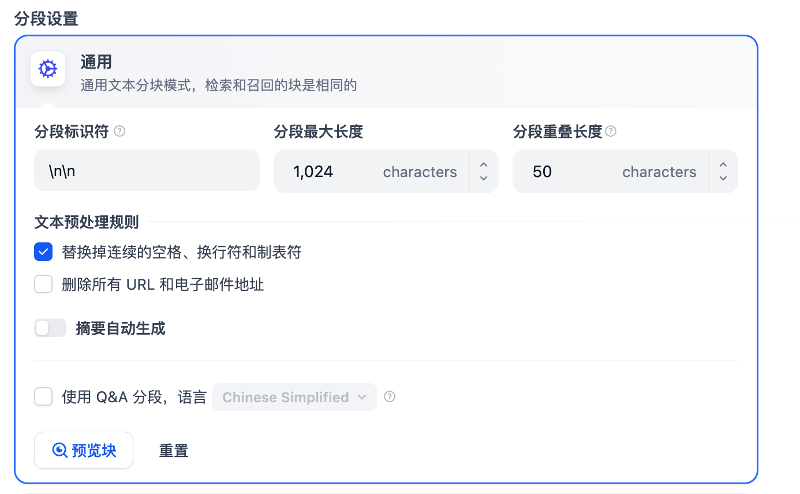
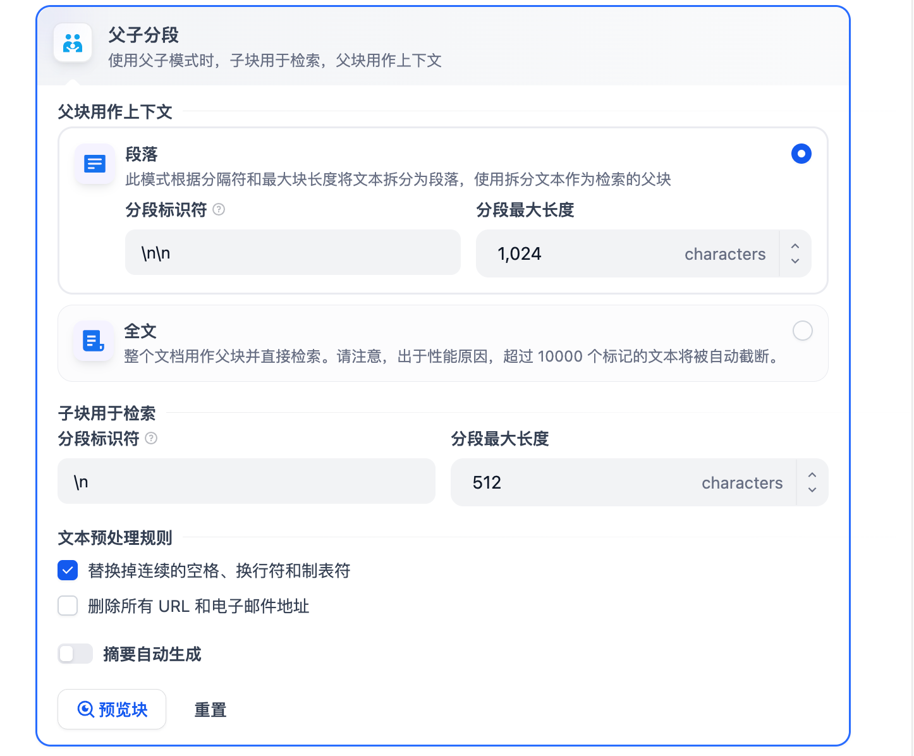
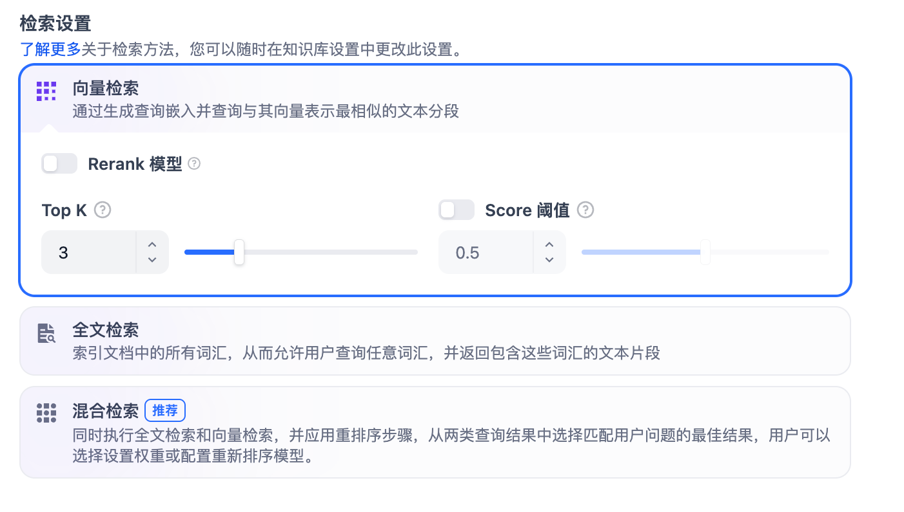
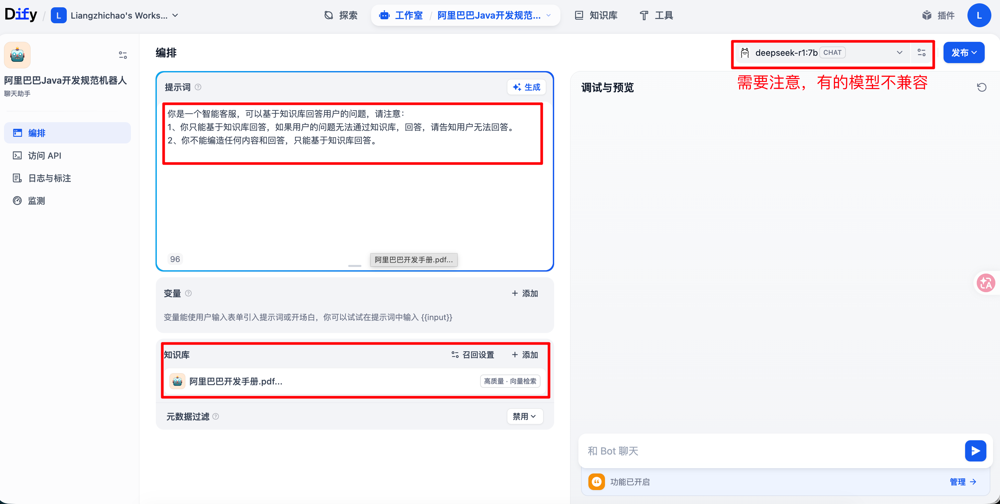
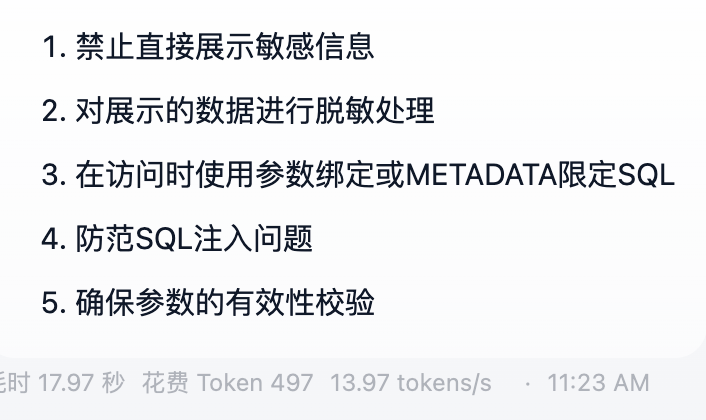

# WorkFlow

## 使用Dify搭建本地知识库

### Dify中构建知识库

**分段设置**

目前dify支持的有两种：`通用模式`和`父子模式`。





- 通用模式：按照用户自定义的规则拆分独立的分段
- 父子模式：与通用模式相比，父子模式采用双层分段结构来平衡检索的精准度和上下文信息，精准匹配和上下文信息二者兼得。

建议使用父子模式。

**索引方式**

分成`高质量`和`经济`两种索引方式。

- 高质量：使用Embedding嵌入模型将已分段的文本块转换成数字向量，帮助更加有效压缩和压缩大量的文本信息。
- 经济：每一个区块内使用10个关键字进行索引，降低了准确度但是无需费用。对于检索到的区块，仅仅提供倒排索引方式选择最相关的区块。

**检索设置**

分成了三种：`向量检索`、`全文检索`、`混合检索`



一般推荐使用向量检索和混合检索。

### 知识库使用

创建一个简单的对话机器人，设置如下：



提示词：

```shell
你是一个智能客服，可以基于知识库回答用户的问题，请注意：
1、你只能基于知识库回答，如果用户的问题无法通过知识库，回答，请告知用户无法回答。
2、你不能编造任何内容和回答，只能基于知识库回答。
```

我是基于`父子分片 + 高质量 + 向量检索`实现的。

问题：用户敏感数据应该怎么处理？

Dify回答：



### Dify的局限性

1. 灵活性受限：知识库功能是已经封装好的模块，对分块策略、嵌入模型、检索逻辑等定制能力有限，如果要修改的话需要爆改源码，还是很费劲的。
2. 检索精度和召回率难以优化：默认使用固定的向量数据库；早期的版本是不能实现多路召回、混合检索、重排序等高级RAG技术的，虽然之后也支持了，但是部分需要付费。
3. Dify默认模式只支持 15MB 的文档大小，虽然可以通过修改.env的方式调整，有一部分人也会发现当知识库比较大的时候会出现无法检索的问题。对于大规模的文档，Dify内置的向量存储可能面临着扩展和性能的问题
4. 安全和合规问题：企业级的应用需要私有化部署、细粒度划分、审计日志等等，Dify在这些方面支持有限。
5. Dify难以查看检索命中了哪一些chunk、相似度分数、上下文拼接效果，不利于迭代优化；自建系统可以手动集成日志、监控、A/B测试等工具，提升RAG的质量。

