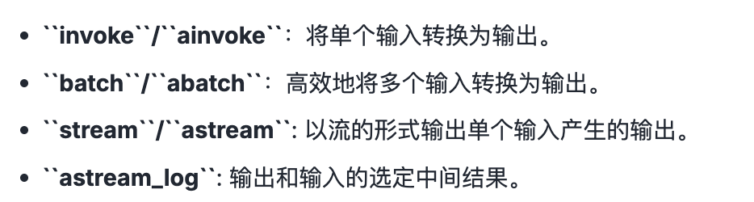

# Langchain使用之Chains

## 基本概念

Chain的核心思想就是通过组合不同的模块化单元，实现比单一组件更强大的功能。

- 将LLM和Prompt Template组合
- 将LLM和输出解析器组合
- 将LLM和外部数据组合，用于问答
- 将LLM和长期记忆组合，聊天历史记录
- 通过将第一个LLM的输出作为第二个LLM的输入，将多个LLM按照顺序结合在一起

## LCEL及其基本构成

使用LCEL（Langchain Expression Language）是一种声明式方法，可以轻松的将多个组件连接成AI工作流，比如Python的管道符 | 。

**基本构成**

提示（Prompt） + 模型（Model） + 输出解析器（Parser）

```python
chain = prompt_template | chat_model | parser
json_result = chain.invoke(input={"question": joke_query})
print(json_result)
```

## Runable

Runable是Langchain定义的一个抽象接口，强制要求LCEL组件实现标准方法：



等等。。

**使用举例**

```python
from langchain_core.prompts import PromptTemplate
from langchain_core.output_parsers import StrOutputParser
from langchain_openai import ChatOpenAI
import os
import dotenv
dotenv.load_dotenv()

os.environ['OPENAI_API_KEY'] = os.getenv("OPENAI_API_KEY")
os.environ['OPENAI_BASE_URL'] = os.getenv("OPENAI_BASE_URL")
chat_model = ChatOpenAI(
    model="gpt-4o-mini"
)
prompt_template = PromptTemplate.from_template(
    template="请给我讲一个关于{topic}很好笑的笑话"
)

prompt_value = prompt_template.invoke({"topic":"鸡"})
print(f"prompt_value是:{prompt_value}")

parser = StrOutputParser()
result = chat_model.invoke(prompt_value)
out_put = parser.invoke(result)

print(out_put)
print(type(out_put))
```

输出：

```shell
prompt_value是:text='请给我讲一个关于鸡很好笑的笑话'
当然可以！这是一个关于鸡的笑话：

有一天，一只鸡走进了图书馆，走到柜台前对图书管理员说：“咕咕咕，我要一本书。”  
图书管理员愣了一下，给了它一本书。  
第二天，鸡又来了，还是说：“咕咕咕，我要一本书。”  
图书管理员觉得有点奇怪，但还是又给了它一本书。  
到了第三天，鸡又来了，这次它说：“咕咕咕，我要两本书！”  
图书管理员更好奇了，就决定跟着鸡看看到底它在做什么。

鸡拿着书一路走到池塘边，那里有一只青蛙。  
鸡把书递给青蛙，青蛙翻了翻书，然后说道：“不，这个不行，这个也不行。”

所以鸡每天都在借书，是为了给青蛙找书看啊！

鸡的工作可真有趣，找书也让我们感到好笑！希望你喜欢这个笑话！
<class 'str'>
```


```python
chain = prompt_template | chat_model | parser
out_put2 = chain.invoke({"topic":"老虎"})
print(out_put2)
print(type(out_put2))
```

输出结果：

```shell
当然可以！这是一个关于老虎的笑话：

有一天，一只老虎走进了一个酒吧，走到吧台前对 bartender 说：“请给我一杯水。”

bartender 愣了一下，问道：“老虎，你怎么会喝水呢？”

老虎微微一笑，说：“因为我在追求‘饮水思源’的生活方式！”

希望这个笑话能让你笑一笑！
<class 'str'>
```


