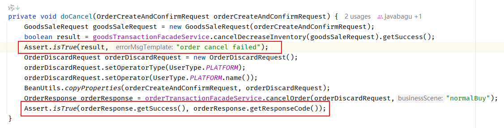
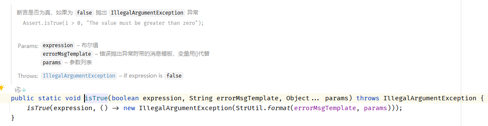
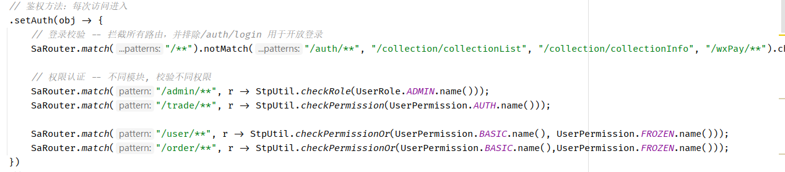
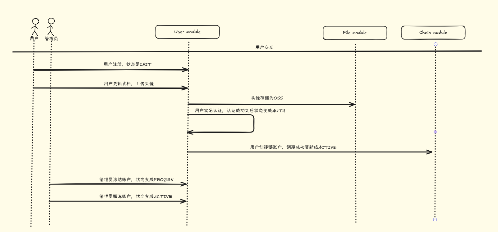
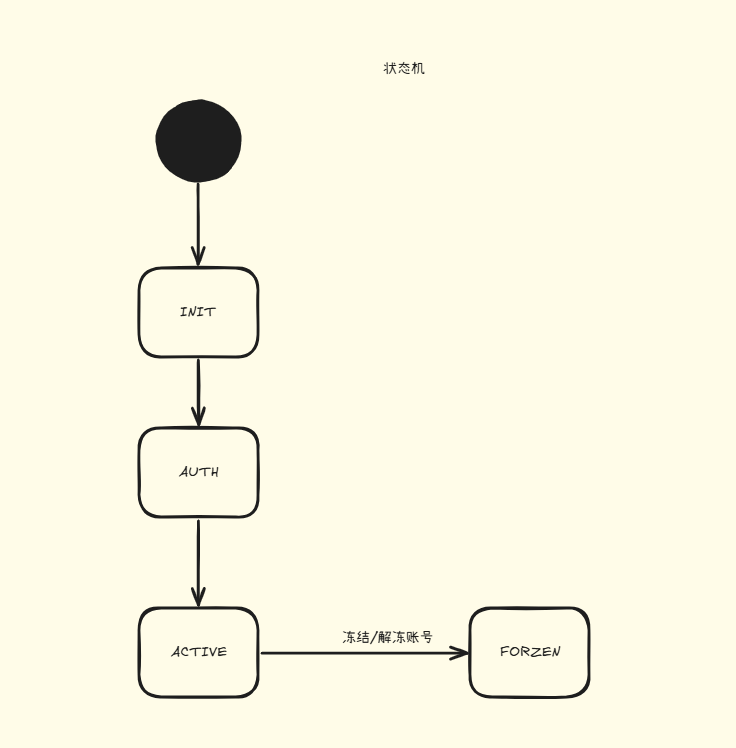
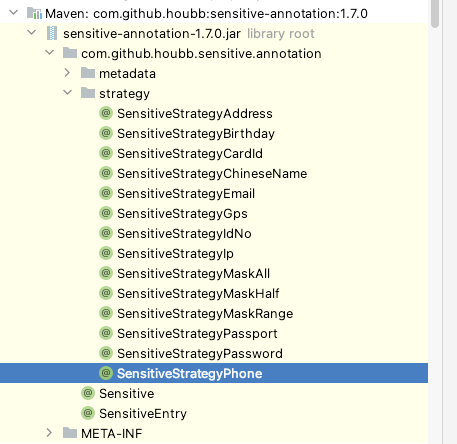
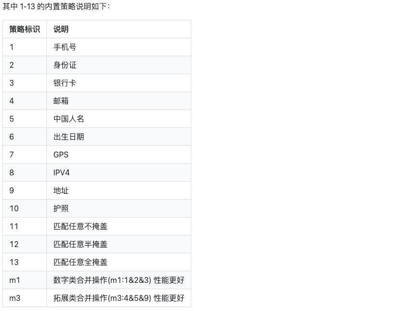
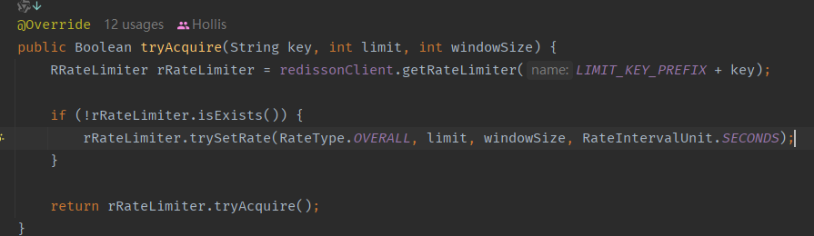

# NFTurbo

## 记录问题

### 统一状态机

一个状态机包含了几个要素：

1. 状态（state）：代表系统可能处于的各种状态，比如：“已下单”、“已支付”、“已发货”、“取消”等
2. 事件（event）：触发状态转换的事件，比如：“下单”、“支付”、“发货”等
3. 转换（transitions）：定义状态之间的转换规则，也就是在某一个事件发生的时候，系统从一个状态转换到另一个状态的规则
4. 动作（Actions）：在状态转换发生的时候执行的操作或行为。

代码实现（简易实现）：

**interface  StateMachine**

```java
public interface StateMachine<STATE, EVENT> {

    /**
     * 状态机转移
     *
     * @param state
     * @param event
     * @return
     */
    public STATE transition(STATE state, EVENT event);
}
```

**BaseStateMachine**

```java
public class BaseStateMachine<STATE, EVENT> implements StateMachine<STATE, EVENT> {
    private Map<String, STATE> stateTransitions = Maps.newHashMap();

    protected void putTransition(STATE origin, EVENT event, STATE target) {
        stateTransitions.put(Joiner.on("_").join(origin, event), target);
    }

    @Override
    public STATE transition(STATE state, EVENT event) {
        STATE target = stateTransitions.get(Joiner.on("_").join(state, event));
        if (target == null) {
            throw new BizException("state = " + state + " , event = " + event, STATE_MACHINE_TRANSITION_FAILED);
        }
        return target;
    }
}
```

**OrderStateMachine**

```java
public class OrderStateMachine extends BaseStateMachine<TradeOrderState, TradeOrderEvent> {

    public static final OrderStateMachine INSTANCE = new OrderStateMachine();

    {
        putTransition(TradeOrderState.CREATE, TradeOrderEvent.CONFIRM, TradeOrderState.CONFIRM);
        putTransition(TradeOrderState.CONFIRM, TradeOrderEvent.PAY, TradeOrderState.PAID);
        //库存预扣减成功，但是未真正扣减成功，也能支付/取消，不能因为延迟导致用户无法支付/取消。
        putTransition(TradeOrderState.CREATE, TradeOrderEvent.PAY, TradeOrderState.PAID);
        putTransition(TradeOrderState.CREATE, TradeOrderEvent.CANCEL, TradeOrderState.CLOSED);
        putTransition(TradeOrderState.CREATE, TradeOrderEvent.TIME_OUT, TradeOrderState.CLOSED);

        //订单创建过程中失败，推进到废弃态，这种状态用户看不到订单
        putTransition(TradeOrderState.CREATE, TradeOrderEvent.DISCARD, TradeOrderState.DISCARD);
        putTransition(TradeOrderState.CONFIRM, TradeOrderEvent.DISCARD, TradeOrderState.DISCARD);

        //已支付后，再确认，状态不变
        putTransition(TradeOrderState.PAID, TradeOrderEvent.CONFIRM, TradeOrderState.PAID);

        putTransition(TradeOrderState.CONFIRM, TradeOrderEvent.CANCEL, TradeOrderState.CLOSED);
        putTransition(TradeOrderState.CONFIRM, TradeOrderEvent.TIME_OUT, TradeOrderState.CLOSED);

        putTransition(TradeOrderState.PAID, TradeOrderEvent.FINISH, TradeOrderState.FINISH);
    }
}
```

拿着订单状态机举例：

订单的不同状态都是有着详细的执行逻辑的，状态机就是将状态的流转的过程封装在一起，可以执行`已下单` ----> `支付`事件。

我们做的设计的状态机是用的HashMap来进行存储具体的状态，`初始状态 + 事件`作为key，`目标状态`是value。在使用的时候只需要在类加载的时候将提前设计的状态流转部分存入到Key中，之后在进行订单状态流转的时候会判断这个Map中是否存在真正的Key值，存在就可以进行操作，进行写库操作。没有这个状态流转的话会自动失败，拒绝写库，抛出错误。

```java
public TradeOrder confirm(OrderConfirmRequest request) {
        this.setOrderConfirmedTime(request.getOperateTime());
        TradeOrderState orderState = OrderStateMachine.INSTANCE.transition(this.getOrderState(), request.getOrderEvent());
        this.setOrderState(orderState);
        return this;
    }
```

### 自定义Starter

步骤：

1. 添加Starter依赖
2. 实现Starter自动配置

​	如果starter需要配置属性，可以通过一个配置属性类来实现，使用`@ConfigurationProperties`注解。

```java
import org.springframework.boot.context.properties.ConfigurationProperties;

@ConfigurationProperties(prefix = XxlJobProperties.PREFIX)
public class XxlJobProperties {

    public static final String PREFIX = "spring.xxl.job";

    private boolean enabled;

    private String adminAddresses;

    private String accessToken;

    private String appName;

    private String ip;

    private int port;

    private String logPath;

    private int logRetentionDays = 30;

    public boolean isEnabled() {
        return enabled;
    }
	...
}
```

3. 定义configuration，在其中创建需要的Bean。

```java
@Configuration
@EnableConfigurationProperties(XxlJobProperties.class)
public class XxlJobConfiguration {

    private static final Logger logger = LoggerFactory.getLogger(XxlJobConfiguration.class);

    @Autowired
    private XxlJobProperties properties;

    @Bean
    @ConditionalOnMissingBean
    @ConditionalOnProperty(prefix = XxlJobProperties.PREFIX, value = "enabled", havingValue = "true", matchIfMissing = true)
    public XxlJobSpringExecutor xxlJobExecutor() {
        logger.info(">>>>>>>>>>> xxl-job config init.");
        XxlJobSpringExecutor xxlJobSpringExecutor = new XxlJobSpringExecutor();
        xxlJobSpringExecutor.setAdminAddresses(properties.getAdminAddresses());
        xxlJobSpringExecutor.setAppname(properties.getAppName());
        xxlJobSpringExecutor.setIp(properties.getIp());
        xxlJobSpringExecutor.setPort(properties.getPort());
        xxlJobSpringExecutor.setAccessToken(properties.getAccessToken());
        xxlJobSpringExecutor.setLogPath(properties.getLogPath());
        xxlJobSpringExecutor.setLogRetentionDays(properties.getLogRetentionDays());
        return xxlJobSpringExecutor;
    }
}
```

> `@Bean`注解声明了一个bean，并且使用`@ConditionOnMissingBean`指定这个Bean的创建条件，在缺失的时候创建。

> `@ConditionOnProperty(prefix = XxlJobProperties.PERFIX, value = "enabled", havingValue = "true")`约定了我们配置`spring.xxl.job.enabled=true`的时候才会生效。

4. 创建配置类入口文件

Spring3.0之后需要创建：`org.springframework.boot.autoconfigure.AutoConfiguration.imports`。

文件内写上具体的Configuration即可。

> 题外话：为什么Spring Boot 3 之后移除了spring.factories？
>
> Java如何提升启动速度？AOT编译 + 云原生镜像。
>
> SpringBoot3支持基于GraalVM 将Spring应用程序编译成原生镜像。重点是编译，所以这个动作需要在编译期进行。
>
> 传统的Spring.factories是依赖于运行时扫描加载自动配置类，这么做的话效率不是很高。使用SpringBoot 3 的话，可以在编译时确定自动配置类，减少了运行时的开销，并使得像GraalVM这种工具更容易分析和编译Spring Boot应用到原生镜像。这种方式的话可以带来更快的启动时间和更低的内存消耗，对于可扩展性来说非常重要。

### 限流

#### 令牌桶进行限流（令牌桶 + 时间窗口）

**LUA脚本**

```lua

-- 速率
local rate = redis.call("hget", KEYS[1], "rate")
-- 时间区间(ms)
local interval = redis.call("hget", KEYS[1], "interval")
local type = redis.call("hget", KEYS[1], "type")
assert(rate ~= false and interval ~= false and type ~= false, "RateLimiter is not initialized")

-- {name}:value 分析后面的代码，这个key记录的是当前令牌桶中的令牌数
local valueName = KEYS[2]

-- {name}:permits 这个key是一个zset，记录了请求的令牌数，score则为请求的时间戳
local permitsName = KEYS[4]

-- 单机限流才会用到，集群模式不用关注
if type == "1" then
    valueName = KEYS[3]
    permitsName = KEYS[5]
end

-- 原版本有bug(https://github.com/redisson/redisson/issues/3197)，最新版将这行代码提前了
-- rate为1 arg1这里是 请求的令牌数量(默认是1)。rate必须比请求的令牌数大
assert(tonumber(rate) >= tonumber(ARGV[1]), "Requested permits amount could not exceed defined rate")

-- 第一次执行这里应该是null，会进到else分支
-- 第二次执行到这里由于else分支中已经放了valueName的值进去，所以第二次会进if分支
local currentValue = redis.call("get", valueName)
if currentValue ~= false then
    -- 从第一次设的zset中取数据，范围是0 ~ (第二次请求时间戳 - 令牌生产的时间)
    -- 可以看到，如果第二次请求时间距离第一次请求时间很短(小于令牌产生的时间)，那么这个差值将小于上一次请求的时间，取出来的将会是空列表。反之，能取出之前的请求信息
    -- 这里作者将这个取出来的数据命名为expiredValues，可认为指的是过期的数据
    local expiredValues = redis.call("zrangebyscore", permitsName, 0, tonumber(ARGV[2]) - interval)
    local released = 0
    -- lua迭代器，遍历expiredValues，如果有值，那么released等于之前所有请求的令牌数之和，表示应该释放多少令牌
    for i, v in ipairs(expiredValues) do
        local random, permits = struct.unpack("fI", v)
        released = released + permits
    end

    -- 没有过期请求的话，released还是0，这个if不会进，有过期请求才会进
    if released > 0 then
        -- 移除zset中所有元素，重置周期
        redis.call("zrem", permitsName, unpack(expiredValues))
        currentValue = tonumber(currentValue) + released
        redis.call("set", valueName, currentValue)
    end

    -- 这里简单分析下上面这段代码:
    -- 1. 只有超过了1个令牌生产周期后的请求，expiredValues才会有值。
    -- 2. 以rate为3举例，如果之前发生了两个请求那么现在released为2，currentValue为1 + 2 = 3
    -- 以此可以看到，redisson的令牌桶放令牌操作是通过请求时间窗来做的，如果距离上一个请求的时间已经超过了一个令牌生产周期时间，那么令牌桶中的令牌应该得到重置，表示生产rate数量的令牌。

    -- 如果当前令牌数 ＜ 请求的令牌数
    if tonumber(currentValue) < tonumber(ARGV[1]) then
        -- 从zset中找到距离当前时间最近的那个请求，也就是上一次放进去的请求信息
        local nearest = redis.call('zrangebyscore', permitsName, '(' .. (tonumber(ARGV[2]) - interval), tonumber(ARGV[2]), 'withscores', 'limit', 0, 1);
        local random, permits = struct.unpack("fI", nearest[1])
        -- 返回 上一次请求的时间戳 - (当前时间戳 - 令牌生成的时间间隔) 这个值表示还需要多久才能生产出足够的令牌
        return tonumber(nearest[2]) - (tonumber(ARGV[2]) - interval)
    else
        -- 如果当前令牌数 ≥ 请求的令牌数，表示令牌够多，更新zset
        redis.call("zadd", permitsName, ARGV[2], struct.pack("fI", ARGV[3], ARGV[1]))
        -- valueName存的是当前总令牌数，-1表示取走一个
        redis.call("decrby", valueName, ARGV[1])
        return nil
    end
else
    -- set一个key-value数据 记录当前限流器的令牌数
    redis.call("set", valueName, rate)
    -- 建了一个以当前限流器名称相关的zset，并存入 以score为当前时间戳，以lua格式化字符串{当前时间戳为种子的随机数、请求的令牌数}为value的值。
    -- struct.pack第一个参数表示格式字符串，f是浮点数、I是长整数。所以这个格式字符串表示的是把一个浮点数和长整数拼起来的结构体。我的理解就是往zset里记录了最后一次请求的时间戳和请求的令牌数
    redis.call("zadd", permitsName, ARGV[2], struct.pack("fI", ARGV[3], ARGV[1]))
    -- 从总共的令牌数 减去 请求的令牌数。
    redis.call("decrby", valueName, ARGV[1])
    return nil
end
```

> 解释：
>
> 假设做一个接口限流，规则如下：
>
> - rate = 3（桶里最多3个令牌）
> - interval = 1000ms（每一秒产生3个令牌）
> - 请求的令牌数 = 1（一次请求消耗一个令牌）
>
> **第一次请求**
>
> 1. 读取valueName， 是nil。
> 2. 到else分支：
>    1. 设置valueName = rate = 3
>    2. zset 中新增一条数据，一次请求消耗一个令牌
>    3. 删除一个令牌，剩余令牌变成2
>
> 放行！！！
>
> **第二次请求（时间1200ms）**
>
> 1. 读取到valueName = 2，走到if分支
> 2. 计算剩余时间expiredValues = 200
>    1. 查找200ms之前的请求
>    2. 第一次请求的时间戳是1000ms，小于200ms的没有，expiredValues = []
> 3. released = 0，不恢复令牌
> 4. 当前的value是2，请求需要1个，够。
>    1. zset中增加一条1200ms的记录
>    2. 删除一个令牌，剩余1
> 5. 返回nil，成功通过
>
> 放行！！！
>
> **第三次请求（1400ms）**
>
> 1. valueNames = 1
> 2. 查询过期值 = 400ms
>    1. 第一次请求大于400，expiredValues = []
> 3. released = 0，令牌书还是1
> 4. 依旧操作，新增一个1400ms的记录，删除一个令牌
> 5. 返回nil,通过
>
> 放行！！！
>
> **第四次请求（1500ms）**
>
> 1. valueNames = 0
> 2. 查询zset中的过期key，发现没有
> 3. 当前令牌数：0 < 1，已经不够用了
> 4. 找到最近的请求：(1400, 1]
> 5. 计算等待时间：
>
> ```lua
> nearest[2] - (当前时间戳 - interval)
> = 1400 - (1500 - 1000)
> = 1400 - 500
> = 900
> ```
>
> 还需要900ms才能有令牌，返回900。
>
> 拒绝！！！
>
> **第五次请求（2001ms）**
>
> 1. valueNames = 0
> 2. 查询expiredValues = zrangebyscore 0, 1001
>    1. 第一次请求1000，<=1001，过期
>    2. 第二次请求1200，>1001，跳过
>    3. expiredValues = [1000]
> 3. 遍历过期请求：released = 1
> 4. zrem 过期请求
> 5. currentValue  = 0 + 1 = 1,恢复一个令牌
> 6. 当前令牌数 = 1
>    1. zset中增加一个2001,1
>    2. 删除令牌 -1 ，剩余0 
> 7. 返回nil
>
> 结果：通过
>
> 放行！！！

### fail-fast实践

所谓fail-fast，就是快速失败，他是一种非常关键的代码思想，针对一些错误情况，快速失败。

```java
if (xxx) {
    return false;
}
....
```

在代码实现中，很多地方用到了Assert实现快速失败。比如：



Java中的assert是用于程序调试的，但是Assert这个类是一种快速做结果检查的方式。

断言是否为真，如果是false，抛出指定的异常。其实就是一个简单的if判断。



### 分布式锁

项目中使用分布式锁注解进行处理各种锁处理。

注解：`@DistributeLock`（分布式锁）

```java
@Target(ElementType.METHOD)
@Retention(RetentionPolicy.RUNTIME)
public @interface DistributeLock {

    /**
     * 锁的场景
     *
     * @return
     */
    public String scene();

    /**
     * 加锁的key，优先取key()，如果没有，则取keyExpression()
     *
     * @return
     */
    public String key() default DistributeLockConstant.NONE_KEY;

    /**
     * SPEL表达式:
     * <pre>
     *     #id
     *     #insertResult.id
     * </pre>
     *
     * @return
     */
    public String keyExpression() default DistributeLockConstant.NONE_KEY;

    /**
     * 超时时间，毫秒
     * 默认情况下不设置超时时间，会自动续期
     *
     * @return
     */
    public int expireTime() default DistributeLockConstant.DEFAULT_EXPIRE_TIME;

    /**
     * 加锁等待时长，毫秒
     * 默认情况下不设置等待时长，会一直等待直到获取到锁
     * @return
     */
    public int waitTime() default DistributeLockConstant.DEFAULT_WAIT_TIME;
}
```

切面类：`DistributeLockAspect`

```java
@Aspect
@Component
@Order(Integer.MIN_VALUE + 1)
public class DistributeLockAspect {

    private RedissonClient redissonClient;

    public DistributeLockAspect(RedissonClient redissonClient) {
        this.redissonClient = redissonClient;
    }

    private static final Logger LOG = LoggerFactory.getLogger(DistributeLockAspect.class);

    @Around("@annotation(cn.hollis.nft.turbo.lock.DistributeLock)")
    public Object process(ProceedingJoinPoint pjp) throws Exception {
        Object response = null;
        Method method = ((MethodSignature) pjp.getSignature()).getMethod();
        DistributeLock distributeLock = method.getAnnotation(DistributeLock.class);

        String key = distributeLock.key();
        // Key值为空
        if (DistributeLockConstant.NONE_KEY.equals(key)) {
            if (DistributeLockConstant.NONE_KEY.equals(distributeLock.keyExpression())) {
                throw new DistributeLockException("no lock key found...");
            }
            SpelExpressionParser parser = new SpelExpressionParser();
            Expression expression = parser.parseExpression(distributeLock.keyExpression());

            EvaluationContext context = new StandardEvaluationContext();
            // 获取参数值
            Object[] args = pjp.getArgs();

            // 获取运行时参数的名称
            StandardReflectionParameterNameDiscoverer discoverer
                    = new StandardReflectionParameterNameDiscoverer();
            String[] parameterNames = discoverer.getParameterNames(method);

            // 将参数绑定到context中
            if (parameterNames != null) {
                for (int i = 0; i < parameterNames.length; i++) {
                    context.setVariable(parameterNames[i], args[i]);
                }
            }

            // 解析表达式，获取结果
            key = String.valueOf(expression.getValue(context));
        }

        String scene = distributeLock.scene();

        String lockKey = scene + "#" + key;

        int expireTime = distributeLock.expireTime();
        int waitTime = distributeLock.waitTime();
        RLock rLock= redissonClient.getLock(lockKey);
        try {
            boolean lockResult = false;
            // 如果没有设置waitTime：
            // 1. 过期时间是默认值，使用RLock.lock()无限续期，类似于watchdog机制
            // 2. 设置了过期时间，RLock.lock(expireTime, TimeUnit.MILLISECONDS)，锁会在过期时间之后自动释放

            // 如果设置了waitTime：
            // 1. 过期时间是默认值，使用RLock.tryLock(waitTime, TimeUnit.MILLISECONDS)，锁会在waitTime内尝试获取锁，如果获取锁失败，则返回false
            // 2. 设置了过期时间，使用RLock.tryLock(waitTime, expireTime, TimeUnit.MILLISECONDS)，锁会在waitTime内尝试获取锁，如果获取锁失败，则返回false
            if (waitTime == DistributeLockConstant.DEFAULT_WAIT_TIME) {
                if (expireTime == DistributeLockConstant.DEFAULT_EXPIRE_TIME) {
                    LOG.info(String.format("lock for key : %s", lockKey));
                    rLock.lock();
                } else {
                    LOG.info(String.format("lock for key : %s , expire : %s", lockKey, expireTime));
                    rLock.lock(expireTime, TimeUnit.MILLISECONDS);
                }
                lockResult = true;
            } else {
                if (expireTime == DistributeLockConstant.DEFAULT_EXPIRE_TIME) {
                    LOG.info(String.format("try lock for key : %s , wait : %s", lockKey, waitTime));
                    lockResult = rLock.tryLock(waitTime, TimeUnit.MILLISECONDS);
                } else {
                    LOG.info(String.format("try lock for key : %s , expire : %s , wait : %s", lockKey, expireTime, waitTime));
                    lockResult = rLock.tryLock(waitTime, expireTime, TimeUnit.MILLISECONDS);
                }
            }

            if (!lockResult) {
                LOG.warn(String.format("lock failed for key : %s , expire : %s", lockKey, expireTime));
                throw new DistributeLockException("acquire lock failed... key : " + lockKey);
            }


            LOG.info(String.format("lock success for key : %s , expire : %s", lockKey, expireTime));
            response = pjp.proceed();
        } catch (Throwable e) {
            throw new Exception(e);
        } finally {
            if (rLock.isHeldByCurrentThread()) {
                rLock.unlock();
                LOG.info(String.format("unlock for key : %s , expire : %s", lockKey, expireTime));
            }
        }
        return response;
    }
}
```

### Gateway网关

微服务中用于**路由请求、转发、过滤等功能**

一般来说，会单独创建一个模块，gateway-module。这个模块包含了：

- config
  - 配置中心组件，用于服务的发现，可以实现路由和负载均衡
- 鉴权
  - 在网关中进行同意鉴权，我们引入的是Sa-Token
- 负载均衡
  - LoadBalancer。起到负载均衡的作用
- 日志
  - 用于记录日志和日志脱敏

#### 路由转发

Gateway允许我们定义路由规则，将进入的请求根据不同的路径转发到下游的服务。


我们可以根据用户的不同请求，将用户路由到对应的服务中，比如，用户要访问订单服务，将请求转发到订单服务的集群，用户要访问商品服务，将请求路由转发到商品服务的集群。

```yaml
spring:
	cloud: 
		gateway:
			default-filters:
				- DedupeResponseHeader=Access-Control-Allow-Origin, RETAIN_UNIQUE
			globalcors:
				cors-configurations:
                   '[/**]':
                    allowedHeaders: '*'
                    allowedMethods: '*'
                    allowedOrigins: '*'
            routes: 
            	- id: nfturbo-auth
            	  uri: lb: //nfturbo-auth
            	  predicates: 
            	  	- Path=/auth/**,/token/**
                - id: nfturbo-business
                  uri: lb://nfturbo-business
                  predicates:
                    - Path=/trade/**,/order/**,/user/**,/collection/**,/wxPay/**,/box/**
```

> 上述的配置意思就是：如果匹配到`/auth/**`或者`/token/**`，会将服务转发到nfturbo-auth模块。并且使用lb: // 会使用负载均衡来访问auth服务。
>
> predicate就是路由匹配规则。

#### 统一鉴权

在Gateway服务中，我们集成了OAuth2，进行统一的登录和鉴权。以Sa-Token为例：

```java
@Configuration
@Slf4j
public class SaTokenConfigure {
    @Bean
    public SaReactorFilter getSaReactorFilter() {
        return new SaReactorFilter()
                // 拦截地址
                .addInclude("/**")
                // 开放地址
                .addExclude("/favicon.ico")
                // 鉴权方法：每次访问进入
                .setAuth(obj -> {
                    // 登录校验 -- 拦截所有路由，并排除/auth/login 用于开放登录
                    SaRouter.match("/**").notMatch("/auth/**", "/collection/collectionList", "/collection/collectionInfo", "/wxPay/**").check(r -> StpUtil.checkLogin());

                    // 权限认证 -- 不同模块, 校验不同权限
                    SaRouter.match("/admin/**", r -> StpUtil.checkRole(UserRole.ADMIN.name()));
                    SaRouter.match("/trade/**", r -> StpUtil.checkPermission(UserPermission.AUTH.name()));

                    SaRouter.match("/user/**", r -> StpUtil.checkPermissionOr(UserPermission.BASIC.name(), UserPermission.FROZEN.name()));
                    SaRouter.match("/order/**", r -> StpUtil.checkPermissionOr(UserPermission.BASIC.name(),UserPermission.FROZEN.name()));
                })
                // 异常处理方法：每次setAuth函数出现异常时进入
                .setError(this::getSaResult);
    }
}

```

> 基于Cloud + SaToken实现统一鉴权。
>
> 我们的系统的角色和权限只有以下几种：
>
> 角色：
>
> - ADMIN：管理员
> - CUSTOMER：普通用户
>
> 权限：
>
> - BASIC：基本权限
> - AUTH：已实名认证权限
> - FROZEN：被冻结用户权限
> - NONE：无权限
>
> 我们在其中加上了对应获取角色和权限的类：`StpInterfaceImpl`
>
> ```java
> @Component
> public class StpInterfaceImpl implements StpInterface {
>     @Override
>     public List<String> getPermissionList(Object loginId, String loginType) {
>         UserInfo userInfo = (UserInfo) StpUtil.getSessionByLoginId(loginId).get((String) loginId);
> 
>         if (userInfo.getUserRole() == UserRole.ADMIN || userInfo.getState().equals(UserStateEnum.ACTIVE.name()) || userInfo.getState().equals(UserStateEnum.AUTH.name()) ) {
>             return List.of(UserPermission.BASIC.name(), UserPermission.AUTH.name());
>         }
> 
>         if (userInfo.getState().equals(UserStateEnum.INIT.name())) {
>             return List.of(UserPermission.BASIC.name());
>         }
> 
>         if (userInfo.getState().equals(UserStateEnum.FROZEN.name())) {
>             return List.of(UserPermission.FROZEN.name());
>         }
> 
>         return List.of(UserPermission.NONE.name());
>     }
> 
>     @Override
>     public List<String> getRoleList(Object loginId, String loginType) {
>         UserInfo userInfo = (UserInfo) StpUtil.getSessionByLoginId(loginId).get((String) loginId);
>         if (userInfo.getUserRole() == UserRole.ADMIN) {
>             return List.of(UserRole.ADMIN.name());
>         }
>         return List.of(UserRole.CUSTOMER.name());
>     }
> }
> ```
>
> 我们定义了一个Sa-Token的全局配置：`SaTokenConfigure`
>
> ```java
> @Configuration
> @Slf4j
> public class SaTokenConfigure {
>     @Bean
>     public SaReactorFilter getSaReactorFilter() {
>         return new SaReactorFilter()
>                 // 拦截地址
>                 .addInclude("/**")
>                 // 开放地址
>                 .addExclude("/favicon.ico")
>                 // 鉴权方法：每次访问进入
>                 .setAuth(obj -> {
>                     // 登录校验 -- 拦截所有路由，并排除/auth/login 用于开放登录
>                     SaRouter.match("/**").notMatch("/auth/**", "/collection/collectionList", "/collection/collectionInfo", "/wxPay/**").check(r -> StpUtil.checkLogin());
> 
>                     // 权限认证 -- 不同模块, 校验不同权限
>                     SaRouter.match("/admin/**", r -> StpUtil.checkRole(UserRole.ADMIN.name()));
>                     SaRouter.match("/trade/**", r -> StpUtil.checkPermission(UserPermission.AUTH.name()));
> 
>                     SaRouter.match("/user/**", r -> StpUtil.checkPermissionOr(UserPermission.BASIC.name(), UserPermission.FROZEN.name()));
>                     SaRouter.match("/order/**", r -> StpUtil.checkPermissionOr(UserPermission.BASIC.name(),UserPermission.FROZEN.name()));
>                 })
>                 // 异常处理方法：每次setAuth函数出现异常时进入
>                 .setError(this::getSaResult);
>     }
> 
>     private SaResult getSaResult(Throwable throwable) {
>         switch (throwable) {
>             case NotLoginException notLoginException:
>                 log.error("请先登录");
>                 return SaResult.error("请先登录");
>             case NotRoleException notRoleException:
>                 if (UserRole.ADMIN.name().equals(notRoleException.getRole())) {
>                     log.error("请勿越权使用！");
>                     return SaResult.error("请勿越权使用！");
>                 }
>                 log.error("您无权限进行此操作！");
>                 return SaResult.error("您无权限进行此操作！");
>             case NotPermissionException notPermissionException:
>                 if (UserPermission.AUTH.name().equals(notPermissionException.getPermission())) {
>                     log.error("请先完成实名认证！");
>                     return SaResult.error("请先完成实名认证！");
>                 }
>                 log.error("您无权限进行此操作！");
>                 return SaResult.error("您无权限进行此操作！");
>             default:
>                 return SaResult.error(throwable.getMessage());
>         }
>     }
> }
> ```
>
> 主要的权限认证功能：
> 
>
> 根据用户访问到的不同路径，判断不同的权限即可。
>
> 为了得到一个友好的错误提示，不用全局拦截的原因是gateway是一个webFlux应用。不是传统的MVC的web应用。
>
> 触发错误之后，反参如下：
>
> ```json
> {
>     "code": 500,
>     "msg": "请先完成实名认证！",
>     "data":null
> }
> ```

#### 限流熔断

结合sentinal

## 功能模块

### 用户模块设计



#### 状态机



### 用户信息的缓存

用户信息是一个非常基本的信息，许多地方用到了用户信息，同时用户信息的变更是不太频繁的，为了提升性能，对用户信息做缓存。我们用的是JetCache。

#### 缓存的写入 - 查询时

通过Id去查询用户信息时，我们会去将用户信息保存到缓存中，Key是`${keyPrefix}:user:cache:id:EL表达式解析出来的userId`。

```java
    @Cached(name = ":user:cache:id:", cacheType = CacheType.BOTH, key = "#userId", cacheNullValue = true)
    public User findById(Long userId) {
        return userMapper.findById(userId);
    }
```

JetCache的配置文件在：cache模块中：

```yaml
jetcache:
  statIntervalMinutes: 1
  areaInCacheName: false
  local:
    default:
      type: caffeine
      keyConvertor: fastjson2
  remote:
    default:
      type: redisson
      keyConvertor: fastjson2
      broadcastChannel: ${spring.application.name}
      keyPrefix: ${spring.application.name}
      valueEncoder: java
      valueDecoder: java
      defaultExpireInMillis: 5000
```

> 上述的@Cached注解就是JetCache提供的，通过AOP的方式拦截这个方法，方法执行完成之后，将结果保存在缓存中。
>
> - name：缓存Key的前缀
> - cacheType：缓存类型，REMOTE（分布式缓存）、LOCAL（本地缓存）、BOTH（开启二级缓存）
> - key：表示缓存的Key值，通过EL表达式解析出userId的值。
> - cacheNullValue：表示是否缓存空值，避免缓存穿透

#### 缓存的写入 - 注册时

用户注册的时候也需要加上写缓存操作，缓存的还是userId。

缓存的初始化：

```java
    @PostConstruct
    public void init() {
        QuickConfig idQc = QuickConfig.newBuilder(":user:cache:id:")
                .cacheType(CacheType.BOTH)
                .expire(Duration.ofHours(2))
                .syncLocal(true)
                .build();
        idUserCache = cacheManager.getOrCreateCache(idQc);
    }
```

具体的调用，在注册方法中如下：

```java
    private void updateUserCache(String userId, User user) {
        idUserCache.put(userId, user);
    }
```

没有使用注解式的，使用的是官方写的案例。

#### 缓存更新

设置的缓存自动更新策略。

```java
@CacheRefresh(refresh = 60, timeUnit = TimeUnit.MINUTES)
```

表示60分钟进行缓存刷新，会自动起一个后台线程执行方法，将结果保存到缓存中。

#### 缓存失效

我们做的缓存的失效功能也是很简单，直接使用@CacheInvalidate注解即可。

```java
@CacheInvalidate(name = ":user:cache:id:", key = "#userActiveRequest.userId")
```

> 缓存和数据库一致性方案：
>
> 1. 先更新数据库，再删除缓存（YES）
> 2. 延时双删（YES）
> 3. binlog监听实现缓存更新/删除（大项目用的比较多）

针对1：

我们是在用户激活的时候进行处理的，也就是在判断更新用户状态的数据库成功之后进行删除缓存的操作。之后如果用户在查询的话还是会缓存的。同时为了保证在删除缓存失败的时候导致数据不一致，我们还有之前说的刷新缓存的策略。60MIN会自动刷新缓存，做60MIN 的原因是每一个用户对自己个人信息的变更周期其实没有那么多，并发量不高。所以暂时的脏数据是可以理解的。

针对2：

为了减少先更新数据库再删除缓存的这个方法出现的一致性问题，其实将删除移到更新数据库之前即可。但是这个问题出现的原因就是万一另一个线程在数据库读取到了旧的值，又会将缓存重新刷新到缓存中，导致数据不一致。解决的方法就是删除第一遍缓存的时候，之后在更新数据库之后再删除一遍缓存。

总体的步骤是：

1. **第一次删除**：更新数据库前，删除缓存。
2. **更新数据库**：执行数据库的写操作。
3. **延迟等待**：等待一段时间（主从同步延迟时间 + 少量缓冲时间）
4. **第二次删除**：再次删除缓存。

第一次删除缓存是为了清除缓存的旧值，强制后续请求直接请求数据库；第二次删除是为了清除在数据库更新期间被其他线程请求写入的旧缓存值。

**我们在冻结、解冻接口中，对于冻结、解冻部分，并发量虽然不高，但是接受不一致数据的程度比较低，我们希望可以快速更新缓存，避免不一致，所以引入了延迟双删。**

冻结的接口：

```java
    @Transactional(rollbackFor = Exception.class)
    public UserOperatorResponse freeze(Long userId) {
        UserOperatorResponse userOperatorResponse = new UserOperatorResponse();
        User user = userMapper.findById(userId);
        Assert.notNull(user, () -> new UserException(USER_NOT_EXIST));
        Assert.isTrue(user.getState() == UserStateEnum.ACTIVE, () -> new UserException(USER_STATUS_IS_NOT_ACTIVE));

        //第一次删除缓存
        idUserCache.remove(user.getId().toString());

        if (user.getState() == UserStateEnum.FROZEN) {
            userOperatorResponse.setSuccess(true);
            return userOperatorResponse;
        }
        user.setState(UserStateEnum.FROZEN);
        boolean updateResult = updateById(user);
        Assert.isTrue(updateResult, () -> new BizException(RepoErrorCode.UPDATE_FAILED));
        //加入流水
        long result = userOperateStreamService.insertStream(user, UserOperateTypeEnum.FREEZE);
        Assert.notNull(result, () -> new BizException(RepoErrorCode.UPDATE_FAILED));

        //第二次删除缓存
        userCacheDelayDeleteService.delayedCacheDelete(idUserCache, user);

        userOperatorResponse.setSuccess(true);
        return userOperatorResponse;
    }
```

其中的`userCacheDelayDeleteService.delayedCacheDelete(idUserCache, user);`代码如下：

```java
@Service
@Slf4j
public class UserCacheDelayDeleteService {

    private static ThreadFactory userCacheDelayProcessFactory = new ThreadFactoryBuilder()
            .setNameFormat("user-cache-delay-delete-pool-%d").build();

    private ScheduledExecutorService scheduler = new ScheduledThreadPoolExecutor(10, userCacheDelayProcessFactory);

    public void delayedCacheDelete(Cache idUserCache, User user) {
        scheduler.schedule(() -> {
            boolean idDeleteResult = idUserCache.remove(user.getId().toString());
            log.info("idUserCache removed, key = {} , result  = {}", user.getId(), idDeleteResult);
        }, 2, TimeUnit.SECONDS);
    }
}
```

拿到Cache和User，之后延迟两秒执行Runable接口移除缓存。

### 用户模块功能

#### 获取用户信息


#### 修改昵称


> 布隆过滤器的概念以及使用：
>
> - 概念：简单来说，布隆过滤器就是一个快速检索数据是否存在的数据结构。原理就是利用多个哈希函数，讲一个元素映射成多个位，之后将这些位置设置成1，当查询一个元素的时候，如果这些位置被设置成1，认为元素可能存在于集合中。只是可能不是一定。原因其实还是因为Hash函数的冲突问题。
>   1. 初始化布隆过滤器：指定集合的大小和误判率，BloomFilter内部包含一个bit数组和多个哈希函数，每一个哈希函数都会生成一个索引值。
>   2. 添加元素到布隆过滤器：首先需要将该元素通过多个Hash函数生成多个索引值，将这些索引值的位设置成1。如果这些索引值已经被设置成了1，无需再次设置。
>   3. 查询元素是否存在于BloomFilter中：通过多哈Hash函数生成多个索引值，并判断这些索引值对应的位是否都被设置成了1，如果都是的话，判断存在，否则不存在。
> - 应用
>
> 1. 在类初始化之后进行布隆过滤器的初始化：
>
> ```java
> public void afterPropertiesSet() throws Exception {
>   this.nickNameBloomFilter = redissonClient.getBloomFilter("nickName");
>   if (nickNameBloomFilter != null && !nickNameBloomFilter.isExists()) {
>     this.nickNameBloomFilter = tryInit(100000L, 0.01); // 设置数据量大小和误判率
>   }
> }
> ```
>
> 2. 添加到BloomFilter：
>
> ```java
> private boolean addNickName(String nickName) {
>   return this.nickNameBloomFilter != null && this.nickNameBloomFilter.add(nickName);
> }
> ```
>
> 3. 查询布隆过滤器中是否存在元素：
>
> ```java
> public boolean nickNameExist(String nickName) {
>   // 如果BloomFilter中存在。需要进行数据库的二次判断
>   if(this.nickNameBloomFilter != null && this.nickNameBloomFilter.contains(nickName)) {
>     return userMapper.findByNickName() != null;
>   }
>   return false;
> }
> ```

#### 用户认证

接口：`user/auth`

- 实名认证

​	拿到用户的信息，为了满足幂等的特性，提前做用户认证的操作，用户已经认证的话直接返回true。否则调用三方实名认证，更新用户的状态为AUTH。之后加入到流水操作表中。

- 进行上链操作进行上链，调用文昌链进行上链之后，如果成功，激活账户。

> 我们在数据库中会发现为什么我们在实名认证的时候真实姓名和身份证号是加密的呢？关键是我们在updateById()的时候并没有进行加密操作啊？
>
> **AesEncryptTypeHandler.java**
>
> ```java
> package cn.hollis.nft.turbo.user.domain.entity;
> 
> import cn.hollis.nft.turbo.api.user.constant.UserRole;
> import cn.hollis.nft.turbo.api.user.constant.UserStateEnum;
> import cn.hollis.nft.turbo.datasource.domain.entity.BaseEntity;
> import cn.hollis.nft.turbo.user.infrastructure.mapper.AesEncryptTypeHandler;
> import cn.hutool.crypto.digest.DigestUtil;
> import com.baomidou.mybatisplus.annotation.TableField;
> import com.baomidou.mybatisplus.annotation.TableName;
> import com.github.houbb.sensitive.annotation.strategy.SensitiveStrategyPhone;
> import lombok.Getter;
> import lombok.Setter;
> 
> import java.util.Date;
> 
> /**
>  * 用户
>  *
>  * @author hollis
>  */
> @Setter
> @Getter
> @TableName("users")
> public class User extends BaseEntity {
>     /**
>      * 昵称
>      */
>     private String nickName;
> 
>     /**
>      * 密码
>      */
>     private String passwordHash;
> 
>     /**
>      * 状态
>      */
>     private UserStateEnum state;
> 
>     /**
>      * 邀请码
>      */
>     private String inviteCode;
> 
>     /**
>      * 邀请人用户ID
>      */
>     private String inviterId;
> 
>     /**
>      * 手机号
>      */
>     @SensitiveStrategyPhone
>     private String telephone;
> 
>     /**
>      * 最后登录时间
>      */
>     private Date lastLoginTime;
> 
>     /**
>      * 头像地址
>      */
>     private String profilePhotoUrl;
> 
>     /**
>      * 区块链地址
>      */
>     private String blockChainUrl;
> 
>     /**
>      * 区块链平台
>      */
>     private String blockChainPlatform;
> 
>     /**
>      * 实名认证
>      */
>     private Boolean certification;
> 
>     /**
>      * 真实姓名
>      */
>     @TableField(typeHandler = AesEncryptTypeHandler.class)
>     private String realName;
> 
>     /**
>      * 身份证hash
>      */
>     @TableField(typeHandler = AesEncryptTypeHandler.class)
>     private String idCardNo;
> 
>     /**
>      * 用户角色
>      */
>     private UserRole userRole;
> 
>     public User register(String telephone, String nickName, String password,String inviteCode,String inviterId) {
>         this.setTelephone(telephone);
>         this.setNickName(nickName);
>         this.setPasswordHash(DigestUtil.md5Hex(password));
>         this.setState(UserStateEnum.INIT);
>         this.setUserRole(UserRole.CUSTOMER);
>         this.setInviteCode(inviteCode);
>         this.setInviterId(inviterId);
>         return this;
>     }
> 
>     public User registerAdmin(String telephone, String nickName, String password) {
>         this.setTelephone(telephone);
>         this.setNickName(nickName);
>         this.setPasswordHash(DigestUtil.md5Hex(password));
>         this.setState(UserStateEnum.ACTIVE);
>         this.setUserRole(UserRole.ADMIN);
>         return this;
>     }
> 
>     public User auth(String realName, String idCard) {
>         this.setRealName(realName);
>         this.setIdCardNo(idCard);
>         this.setCertification(true);
>         this.setState(UserStateEnum.AUTH);
>         return this;
>     }
> 
>     public User active(String blockChainUrl, String blockChainPlatform) {
>         this.setBlockChainUrl(blockChainUrl);
>         this.setBlockChainPlatform(blockChainPlatform);
>         this.setState(UserStateEnum.ACTIVE);
>         return this;
>     }
> 
>     public boolean canModifyInfo() {
>         return state == UserStateEnum.INIT || state == UserStateEnum.AUTH || state == UserStateEnum.ACTIVE;
>     }
> }
> ```
>
> 
>
> 解释：
>
> 我们是利用了mybatis中的`BaseTypeHandler<>`来实现的。我们自定义了一个AES加密的TypeHandler。其实就是用的AES加密解密。重写方法之后设置加密。之后在mapper.xml中的resultMap中typeHandler中设置这个类。
>
> ```xml
> <resultMap id="BaseResultMap" type="cn.hollis.nft.turbo.user.domain.entity.User">
>         <result property="id" column="ID"/>
>         <result property="gmtCreate" column="GMT_CREATE"/>
>         <result property="gmtModified" column="GMT_MODIFIED"/>
>         <result property="nickName" column="NICK_NAME"/>
>         <result property="passwordHash" column="PASSWORD_HASH"/>
>         <result property="state" column="STATE"/>
>         <result property="inviteCode" column="INVITE_CODE"/>
>         <result property="telephone" column="TELEPHONE"/>
>         <result property="inviterId" column="INVITER_ID"/>
>         <result property="lastLoginTime" column="LAST_LOGIN_TIME"/>
>         <result property="profilePhotoUrl" column="PROFILE_PHOTO_URL"/>
>         <result property="blockChainUrl" column="BLOCK_CHAIN_URL"/>
>         <result property="blockChainPlatform" column="BLOCK_CHAIN_PLATFORM"/>
>         <result property="certification" column="CERTIFICATION"/>
>         <result property="realName" column="REAL_NAME" typeHandler="cn.hollis.nft.turbo.user.infrastructure.mapper.AesEncryptTypeHandler"/>
>         <result property="idCardNo" column="ID_CARD_NO" typeHandler="cn.hollis.nft.turbo.user.infrastructure.mapper.AesEncryptTypeHandler"/>
>         <result property="userRole" column="USER_ROLE"/>
>         <result property="deleted" column="DELETED"/>
>         <result property="lockVersion" column="LOCK_VERSION"/>
>     </resultMap>
> ```
>
> 如果是mybatis-plus呢？
>
> 可以在`@TableField`注解进行设置
>
> ```java
> @TableField(typeHandler = AesEncryptTypeHandler.class)
> private String idCardNo;
> ```
>
> 原理其实很简单，就是利用mybatis的类的抽象方法将数据库的字段进行JDBC的转换。
>
> 调用的JDBC的`parameterize(Statement statement)`方法。调用`DefaultParameterHandler.setParameters()`方法，比如上述AesEncryptTypeHandler我们设置的**ps.setString(i, encrypt(parameter))**，就可以将输入加密，输出解密。实现数据库层面加密同时代码层面无需显示加密但可以进行数据加密的操作。

#### 用户敏感信息脱敏（日志脱敏）

引用了github的一个sensitive的包，github链接：[sensitive-github](https://github.com/houbb/sensitive)

```xml
<dependency>
  <groupId>com.github.houbb</groupId>
  <artifactId>sensitive-logback</artifactId>
  <version>1.7.0</version>
</dependency>
```

引入`logback`依赖包

```xml
<dependency>
  <groupId>ch.qos.logback</groupId>
  <artifactId>logback-classic</artifactId>
  <version>${logback.version}</version>
</dependency>
```

在logback中设置用户信息脱敏：

```xml
<!-- 基于 converter -->
    <conversionRule conversionWord="sensitive" converterClass="com.github.houbb.sensitive.logback.converter.SensitiveLogbackConverter" />
```

日志格式的配置：

```xml
<property name="FILE_LOG_PATTERN" value="%d{yyyy-MM-dd HH:mm:ss.SSS} [%tid] %-5level [%thread] %logger{36} - %sensitive%n"/>
```

```xml
    <appender name="APPLICATION" class="ch.qos.logback.core.rolling.RollingFileAppender">
        <file>${LOG_FILE}</file>
        <encoder class="ch.qos.logback.core.encoder.LayoutWrappingEncoder">
            <layout class="org.apache.skywalking.apm.toolkit.log.logback.v1.x.TraceIdPatternLogbackLayout">
                <Pattern>${FILE_LOG_PATTERN}</Pattern>
            </layout>
        </encoder>
        <rollingPolicy class="ch.qos.logback.core.rolling.SizeAndTimeBasedRollingPolicy">
            <fileNamePattern>${LOG_FILE}.%d{yyyy-MM-dd}.%i.log</fileNamePattern>
            <maxHistory>7</maxHistory>
            <maxFileSize>50MB</maxFileSize>
            <totalSizeCap>20GB</totalSizeCap>
        </rollingPolicy>
    </appender>

    <appender name="CONSOLE" class="ch.qos.logback.core.ConsoleAppender">
        <encoder class="ch.qos.logback.core.encoder.LayoutWrappingEncoder">
            <layout class="org.apache.skywalking.apm.toolkit.log.logback.v1.x.TraceIdPatternLogbackLayout">
                <Pattern>${FILE_LOG_PATTERN}</Pattern>
            </layout>
        </encoder>
    </appender>
```

脱敏展示的字段：

```java
@Setter
@Getter
@TableName("users")
public class User extends BaseEntity {
    /**
     * 昵称
     */
    private String nickName;

    /**
     * 密码
     */
    private String passwordHash;

    /**
     * 状态
     */
    private UserStateEnum state;

    /**
     * 邀请码
     */
    private String inviteCode;

    /**
     * 邀请人用户ID
     */
    private String inviterId;

    /**
     * 手机号
     */
    @SensitiveStrategyPhone
    private String telephone;

    /**
     * 最后登录时间
     */
    private Date lastLoginTime;

    /**
     * 头像地址
     */
    private String profilePhotoUrl;

    /**
     * 区块链地址
     */
    private String blockChainUrl;

    /**
     * 区块链平台
     */
    private String blockChainPlatform;

    /**
     * 实名认证
     */
    private Boolean certification;

    /**
     * 真实姓名
     */
    @TableField(typeHandler = AesEncryptTypeHandler.class)
    private String realName;

    /**
     * 身份证hash
     */
    @TableField(typeHandler = AesEncryptTypeHandler.class)
    private String idCardNo;

    /**
     * 用户角色
     */
    private UserRole userRole;
}
```



上述的图片展示的是这个注解的不同使用注解，地址、生日、卡号、中文名、Email等。

使用实例：

```java
    @GetMapping("/getUserInfo")
    public Result<UserInfo> getUserInfo() {
        String userId = (String) StpUtil.getLoginId();
        User user = userService.findById(Long.valueOf(userId));

        if (user == null) {
            throw new UserException(USER_NOT_EXIST);
        }
        return Result.success(UserConvertor.INSTANCE.mapToVo(user));
    }
```

响应到前端时进行拦截：

```java
@ControllerAdvice
public class SensitiveResponseBodyAdvice implements ResponseBodyAdvice<Object> {

    @Override
    public boolean supports(MethodParameter returnType, Class<? extends HttpMessageConverter<?>> converterType) {
        // 只对特定类型的返回值执行处理逻辑，这里可以根据需要调整判断条件
        return Result.class.isAssignableFrom(returnType.getParameterType());
    }

    @Override
    public Object beforeBodyWrite(Object body, MethodParameter returnType, MediaType selectedContentType, Class<? extends HttpMessageConverter<?>> selectedConverterType, ServerHttpRequest request, ServerHttpResponse response) {
        // 如果返回的对象是UserInfo/InviteRankInfo，进行脱敏处理
        if (body != null && body instanceof Result) {

            if (((Result<?>) body).getData() == null) {
                return body;
            }

            if (((Result<?>) body).getData() instanceof Collection<?>) {
                ((Result<Collection>) body).setData(SensitiveUtil.desCopyCollection((Collection) ((Result<?>) body).getData()));
                return body;
            }

            switch (((Result<?>) body).getData()) {
                case UserInfo userInfo:
                    ((Result<UserInfo>) body).setData(SensitiveUtil.desCopy(userInfo));
                    return body;
                case InviteRankInfo inviteRankInfo:
                    ((Result<InviteRankInfo>) body).setData(SensitiveUtil.desCopy(inviteRankInfo));
                    return body;
                default:
                    return body;
            }
        }
        return body;
    }
}
```

> 首先判断返回的值是否是Result，是Result的话判断body是否为空，空的话就跳过；如果返回的时候一个Collection，那么对这个Collection的每一个元素进行脱敏处理，如果返回的是一个对象（目前是只会对用户信息进行脱敏，涉及到的类有UserInfo、InviteRankInfo）分别处理。之后返回。

> 拓展：个性化配置
>
> 在resources通过chars-scan-config.properties文件配置指定：
>
> ```properties
> # log4j默认配置如下：
> chars.scan.prefix=:：,，'"‘“=| +()（）
> chars.scan.scanList=1,2,3,4,9
> chars.scan.replaceList=1,2,3,4,9
> chars.scan.defaultReplace=12
> chars.scan.replaceHash=md5
> chars.scan.whiteList=""
> ```
>
> SensitivePatternLayout 策略的属性说明。
>
> 
>
> 

### 短信服务

在用户模块中有一个接口用于发送短信，我们的短信是一个单独的短信服务。SMS服务，同时还有一个Notice服务，用于作为中间层，用户服务调用Notice服务，通知服务调用SMS服务。

1. 为了防止出现盗刷接口的情况，第一步就是要做接口限制，使用redission作为限流的条件，



使用手机号作为Key值，一分钟只能发送一条短信。

2. 生成验证码，将验证码存入到缓存中，设置5min的过期时间。
3. 将验证码保存到数据库中。
4. 使用虚拟线程发送SMS短信，提前向用户响应，体验友好，因为其中的操作都是可以拆理出来的，不需要和用户操作反应串行。

```java
    @Facade
    @Override
    public NoticeResponse generateAndSendSmsCaptcha(String telephone) {
        Boolean access = slidingWindowRateLimiter.tryAcquire(telephone, 1, 60);

        if (!access) {
            throw new SystemException(SEND_NOTICE_DUPLICATED);
        }

        // 生成验证码
        String captcha = RandomUtil.randomNumbers(4);

        // 验证码存入Redis
        redisTemplate.opsForValue().set(CAPTCHA_KEY_PREFIX + telephone, captcha, 5, TimeUnit.MINUTES);

        Notice notice = noticeService.saveCaptcha(telephone, captcha);

        Thread.ofVirtual().start(() -> {
            SmsSendResponse result = smsService.sendMsg(notice.getTargetAddress(), notice.getNoticeContent());
            if (result.getSuccess()) {
                notice.setState(NoticeState.SUCCESS);
                notice.setSendSuccessTime(new Date());
                noticeService.updateById(notice);
            } else {
                notice.setState(NoticeState.FAILED);
                notice.addExtendInfo("executeResult", JSON.toJSONString(result));
                noticeService.updateById(notice);
            }
        });

        return new NoticeResponse.Builder().setSuccess(true).build();
    }
```

### 排行榜

用户邀请其他用户会有一定的积分，提供了一个排行榜的功能，可以基于这个积分进行排名。

排名的功能很简单，基于Redis的Zset即可。将积分做成score，用户id作为member，放到zset中，zset会按照score进行排序的。

以下是通过邀请注册用户的部分代码：

```java
@DistributeLock(keyExpression = "#telephone", scene = "USER_REGISTER")
public UserOperatorResponse register(String telephone, String inviteCode) {
	//用户名生成
    String inviterId = null;
    if (StringUtils.isNotBlank(inviteCode)) {
        User inviter = userMapper.findByInviteCode(inviteCode);
        if (inviter != null) {
            inviterId = inviter.getId().toString();
        }
    }
    //用户注册
    //更新排名
    updateInviteRank(inviterId);
	//其他逻辑
}

// ZSet的redisson集合
private RScoredSortedSet<String> inviteRank;

private void updateInviteRank(String inviterId) {
  if (inviterId == null) {
    return ;
  }
  RLock rLock = redissionClient.getLock(inviterId);
  rLock.lock();
  try {
    Double score = inviteRank.getScore(inviterId);
    if (score == null) {
      score = 0.0;
    }
     Long currentTimeStamp = System.currentTimeMillis();
    double timePartScore = 1 - (double) currentTimeStamp / 10000000000000L;
    
    inviteRank.add(score.intValue() + 100.0 + timePartScore, inviterId);
  } finally {
    rLock.unLock();
  }
}
```

此处用到了Redisson的RLock进行加锁处理，用到的是getLock()加悲观锁。加锁失败会一直尝试，主要就是为了避免多个用户同时被邀请的时更新分数导致分数累加错误。

用到的列表是：RScoredSortedSet，提供了一些开箱即用的方法：

- getScore：获取指定成员的分数
- add：向有序集合中添加一个成员，指定该成员的分数
- rank：获取指定成员在有序集合中的排名（从小到大排序，排名从0开始）
- revRank：获取指定成员在有序集合中的排名（从大到小排序，排名从0开始）
- entryRange：获取分数在指定范围内的成员以及分数的集合

我们的获取前N个用户排名信息接口方法：

```java
    @GetMapping("/getTopN")
    public MultiResult<InviteRankInfo> getTopN(@Max(100) Integer topN) {
        if (topN == null) {
            topN = 100;
        }

        List<InviteRankInfo> inviteRankInfos = userService.getTopN(topN);
        return MultiResult.successMulti(inviteRankInfos, topN, 1, 10);
    }
```

```java
    public List<InviteRankInfo> getTopN(Integer topN) {
        Collection<ScoredEntry<String>> rankInfos = inviteRank.entryRangeReversed(0, topN - 1);

        List<InviteRankInfo> inviteRankInfos = new ArrayList<>();

        if (rankInfos != null) {
            for (ScoredEntry<String> rankInfo : rankInfos) {
                InviteRankInfo inviteRankInfo = new InviteRankInfo();
                String userId = rankInfo.getValue();
                if (StringUtils.isNotBlank(userId)) {
                    User user = findById(Long.valueOf(userId));
                    if (user != null) {
                        inviteRankInfo.setNickName(user.getNickName());
                        inviteRankInfo.setInviteCode(user.getInviteCode());
                        inviteRankInfo.setInviteScore(rankInfo.getScore().intValue());
                        inviteRankInfos.add(inviteRankInfo);
                    }
                }
            }
        }

        return inviteRankInfos;
    }
```

除此之外，还做了多维度排行榜实现（如果分数相同，按照先后时间进行排列，更先注册的分数更高）

我们可以将score设置成浮点数，比如：`200.17923479837`这种的。实现方式如下：`score + 分数 + 时间戳/1e13`。如果是这种的话，注册时间在后边的分数会更高，怎么将注册时间更早的排名靠前呢？

`score = 分数 + 1 - 时间戳/1e13`

代码还是如上：`updateInviteRank`
