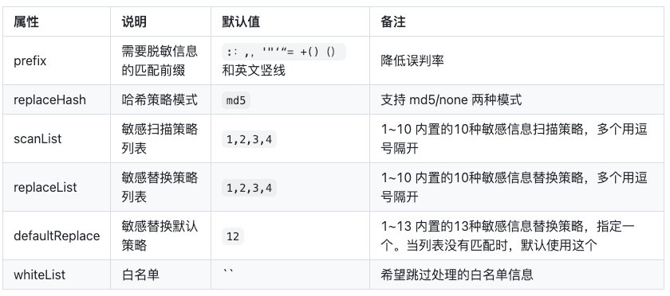

# NFTurbo

## 记录问题

### 统一状态机

一个状态机包含了几个要素：

1. 状态（state）：代表系统可能处于的各种状态，比如：“已下单”、“已支付”、“已发货”、“取消”等
2. 事件（event）：触发状态转换的事件，比如：“下单”、“支付”、“发货”等
3. 转换（transitions）：定义状态之间的转换规则，也就是在某一个事件发生的时候，系统从一个状态转换到另一个状态的规则
4. 动作（Actions）：在状态转换发生的时候执行的操作或行为。

代码实现（简易实现）：

**interface  StateMachine**

```java
public interface StateMachine<STATE, EVENT> {

    /**
     * 状态机转移
     *
     * @param state
     * @param event
     * @return
     */
    public STATE transition(STATE state, EVENT event);
}
```

**BaseStateMachine**

```java
public class BaseStateMachine<STATE, EVENT> implements StateMachine<STATE, EVENT> {
    private Map<String, STATE> stateTransitions = Maps.newHashMap();

    protected void putTransition(STATE origin, EVENT event, STATE target) {
        stateTransitions.put(Joiner.on("_").join(origin, event), target);
    }

    @Override
    public STATE transition(STATE state, EVENT event) {
        STATE target = stateTransitions.get(Joiner.on("_").join(state, event));
        if (target == null) {
            throw new BizException("state = " + state + " , event = " + event, STATE_MACHINE_TRANSITION_FAILED);
        }
        return target;
    }
}
```

**OrderStateMachine**

```java
public class OrderStateMachine extends BaseStateMachine<TradeOrderState, TradeOrderEvent> {

    public static final OrderStateMachine INSTANCE = new OrderStateMachine();

    {
        putTransition(TradeOrderState.CREATE, TradeOrderEvent.CONFIRM, TradeOrderState.CONFIRM);
        putTransition(TradeOrderState.CONFIRM, TradeOrderEvent.PAY, TradeOrderState.PAID);
        //库存预扣减成功，但是未真正扣减成功，也能支付/取消，不能因为延迟导致用户无法支付/取消。
        putTransition(TradeOrderState.CREATE, TradeOrderEvent.PAY, TradeOrderState.PAID);
        putTransition(TradeOrderState.CREATE, TradeOrderEvent.CANCEL, TradeOrderState.CLOSED);
        putTransition(TradeOrderState.CREATE, TradeOrderEvent.TIME_OUT, TradeOrderState.CLOSED);

        //订单创建过程中失败，推进到废弃态，这种状态用户看不到订单
        putTransition(TradeOrderState.CREATE, TradeOrderEvent.DISCARD, TradeOrderState.DISCARD);
        putTransition(TradeOrderState.CONFIRM, TradeOrderEvent.DISCARD, TradeOrderState.DISCARD);

        //已支付后，再确认，状态不变
        putTransition(TradeOrderState.PAID, TradeOrderEvent.CONFIRM, TradeOrderState.PAID);

        putTransition(TradeOrderState.CONFIRM, TradeOrderEvent.CANCEL, TradeOrderState.CLOSED);
        putTransition(TradeOrderState.CONFIRM, TradeOrderEvent.TIME_OUT, TradeOrderState.CLOSED);

        putTransition(TradeOrderState.PAID, TradeOrderEvent.FINISH, TradeOrderState.FINISH);
    }
}
```

拿着订单状态机举例：

订单的不同状态都是有着详细的执行逻辑的，状态机就是将状态的流转的过程封装在一起，可以执行`已下单` ----> `支付`事件。

我们做的设计的状态机是用的HashMap来进行存储具体的状态，`初始状态 + 事件`作为key，`目标状态`是value。在使用的时候只需要在类加载的时候将提前设计的状态流转部分存入到Key中，之后在进行订单状态流转的时候会判断这个Map中是否存在真正的Key值，存在就可以进行操作，进行写库操作。没有这个状态流转的话会自动失败，拒绝写库，抛出错误。

```java
public TradeOrder confirm(OrderConfirmRequest request) {
        this.setOrderConfirmedTime(request.getOperateTime());
        TradeOrderState orderState = OrderStateMachine.INSTANCE.transition(this.getOrderState(), request.getOrderEvent());
        this.setOrderState(orderState);
        return this;
    }
```

### 自定义Starter

步骤：

1. 添加Starter依赖
2. 实现Starter自动配置

​	如果starter需要配置属性，可以通过一个配置属性类来实现，使用`@ConfigurationProperties`注解。

```java
import org.springframework.boot.context.properties.ConfigurationProperties;

@ConfigurationProperties(prefix = XxlJobProperties.PREFIX)
public class XxlJobProperties {

    public static final String PREFIX = "spring.xxl.job";

    private boolean enabled;

    private String adminAddresses;

    private String accessToken;

    private String appName;

    private String ip;

    private int port;

    private String logPath;

    private int logRetentionDays = 30;

    public boolean isEnabled() {
        return enabled;
    }
	...
}
```

3. 定义configuration，在其中创建需要的Bean。

```java
@Configuration
@EnableConfigurationProperties(XxlJobProperties.class)
public class XxlJobConfiguration {

    private static final Logger logger = LoggerFactory.getLogger(XxlJobConfiguration.class);

    @Autowired
    private XxlJobProperties properties;

    @Bean
    @ConditionalOnMissingBean
    @ConditionalOnProperty(prefix = XxlJobProperties.PREFIX, value = "enabled", havingValue = "true", matchIfMissing = true)
    public XxlJobSpringExecutor xxlJobExecutor() {
        logger.info(">>>>>>>>>>> xxl-job config init.");
        XxlJobSpringExecutor xxlJobSpringExecutor = new XxlJobSpringExecutor();
        xxlJobSpringExecutor.setAdminAddresses(properties.getAdminAddresses());
        xxlJobSpringExecutor.setAppname(properties.getAppName());
        xxlJobSpringExecutor.setIp(properties.getIp());
        xxlJobSpringExecutor.setPort(properties.getPort());
        xxlJobSpringExecutor.setAccessToken(properties.getAccessToken());
        xxlJobSpringExecutor.setLogPath(properties.getLogPath());
        xxlJobSpringExecutor.setLogRetentionDays(properties.getLogRetentionDays());
        return xxlJobSpringExecutor;
    }
}
```

> `@Bean`注解声明了一个bean，并且使用`@ConditionOnMissingBean`指定这个Bean的创建条件，在缺失的时候创建。

> `@ConditionOnProperty(prefix = XxlJobProperties.PERFIX, value = "enabled", havingValue = "true")`约定了我们配置`spring.xxl.job.enabled=true`的时候才会生效。

4. 创建配置类入口文件

Spring3.0之后需要创建：`org.springframework.boot.autoconfigure.AutoConfiguration.imports`。

文件内写上具体的Configuration即可。

> 题外话：为什么Spring Boot 3 之后移除了spring.factories？
>
> Java如何提升启动速度？AOT编译 + 云原生镜像。
>
> SpringBoot3支持基于GraalVM 将Spring应用程序编译成原生镜像。重点是编译，所以这个动作需要在编译期进行。
>
> 传统的Spring.factories是依赖于运行时扫描加载自动配置类，这么做的话效率不是很高。使用SpringBoot 3 的话，可以在编译时确定自动配置类，减少了运行时的开销，并使得像GraalVM这种工具更容易分析和编译Spring Boot应用到原生镜像。这种方式的话可以带来更快的启动时间和更低的内存消耗，对于可扩展性来说非常重要。

### 限流

#### 令牌桶进行限流（令牌桶 + 时间窗口）

**LUA脚本**

```lua

-- 速率
local rate = redis.call("hget", KEYS[1], "rate")
-- 时间区间(ms)
local interval = redis.call("hget", KEYS[1], "interval")
local type = redis.call("hget", KEYS[1], "type")
assert(rate ~= false and interval ~= false and type ~= false, "RateLimiter is not initialized")

-- {name}:value 分析后面的代码，这个key记录的是当前令牌桶中的令牌数
local valueName = KEYS[2]

-- {name}:permits 这个key是一个zset，记录了请求的令牌数，score则为请求的时间戳
local permitsName = KEYS[4]

-- 单机限流才会用到，集群模式不用关注
if type == "1" then
    valueName = KEYS[3]
    permitsName = KEYS[5]
end

-- 原版本有bug(https://github.com/redisson/redisson/issues/3197)，最新版将这行代码提前了
-- rate为1 arg1这里是 请求的令牌数量(默认是1)。rate必须比请求的令牌数大
assert(tonumber(rate) >= tonumber(ARGV[1]), "Requested permits amount could not exceed defined rate")

-- 第一次执行这里应该是null，会进到else分支
-- 第二次执行到这里由于else分支中已经放了valueName的值进去，所以第二次会进if分支
local currentValue = redis.call("get", valueName)
if currentValue ~= false then
    -- 从第一次设的zset中取数据，范围是0 ~ (第二次请求时间戳 - 令牌生产的时间)
    -- 可以看到，如果第二次请求时间距离第一次请求时间很短(小于令牌产生的时间)，那么这个差值将小于上一次请求的时间，取出来的将会是空列表。反之，能取出之前的请求信息
    -- 这里作者将这个取出来的数据命名为expiredValues，可认为指的是过期的数据
    local expiredValues = redis.call("zrangebyscore", permitsName, 0, tonumber(ARGV[2]) - interval)
    local released = 0
    -- lua迭代器，遍历expiredValues，如果有值，那么released等于之前所有请求的令牌数之和，表示应该释放多少令牌
    for i, v in ipairs(expiredValues) do
        local random, permits = struct.unpack("fI", v)
        released = released + permits
    end

    -- 没有过期请求的话，released还是0，这个if不会进，有过期请求才会进
    if released > 0 then
        -- 移除zset中所有元素，重置周期
        redis.call("zrem", permitsName, unpack(expiredValues))
        currentValue = tonumber(currentValue) + released
        redis.call("set", valueName, currentValue)
    end

    -- 这里简单分析下上面这段代码:
    -- 1. 只有超过了1个令牌生产周期后的请求，expiredValues才会有值。
    -- 2. 以rate为3举例，如果之前发生了两个请求那么现在released为2，currentValue为1 + 2 = 3
    -- 以此可以看到，redisson的令牌桶放令牌操作是通过请求时间窗来做的，如果距离上一个请求的时间已经超过了一个令牌生产周期时间，那么令牌桶中的令牌应该得到重置，表示生产rate数量的令牌。

    -- 如果当前令牌数 ＜ 请求的令牌数
    if tonumber(currentValue) < tonumber(ARGV[1]) then
        -- 从zset中找到距离当前时间最近的那个请求，也就是上一次放进去的请求信息
        local nearest = redis.call('zrangebyscore', permitsName, '(' .. (tonumber(ARGV[2]) - interval), tonumber(ARGV[2]), 'withscores', 'limit', 0, 1);
        local random, permits = struct.unpack("fI", nearest[1])
        -- 返回 上一次请求的时间戳 - (当前时间戳 - 令牌生成的时间间隔) 这个值表示还需要多久才能生产出足够的令牌
        return tonumber(nearest[2]) - (tonumber(ARGV[2]) - interval)
    else
        -- 如果当前令牌数 ≥ 请求的令牌数，表示令牌够多，更新zset
        redis.call("zadd", permitsName, ARGV[2], struct.pack("fI", ARGV[3], ARGV[1]))
        -- valueName存的是当前总令牌数，-1表示取走一个
        redis.call("decrby", valueName, ARGV[1])
        return nil
    end
else
    -- set一个key-value数据 记录当前限流器的令牌数
    redis.call("set", valueName, rate)
    -- 建了一个以当前限流器名称相关的zset，并存入 以score为当前时间戳，以lua格式化字符串{当前时间戳为种子的随机数、请求的令牌数}为value的值。
    -- struct.pack第一个参数表示格式字符串，f是浮点数、I是长整数。所以这个格式字符串表示的是把一个浮点数和长整数拼起来的结构体。我的理解就是往zset里记录了最后一次请求的时间戳和请求的令牌数
    redis.call("zadd", permitsName, ARGV[2], struct.pack("fI", ARGV[3], ARGV[1]))
    -- 从总共的令牌数 减去 请求的令牌数。
    redis.call("decrby", valueName, ARGV[1])
    return nil
end
```

> 解释：
>
> 假设做一个接口限流，规则如下：
>
> - rate = 3（桶里最多3个令牌）
> - interval = 1000ms（每一秒产生3个令牌）
> - 请求的令牌数 = 1（一次请求消耗一个令牌）
>
> **第一次请求**
>
> 1. 读取valueName， 是nil。
> 2. 到else分支：
>    1. 设置valueName = rate = 3
>    2. zset 中新增一条数据，一次请求消耗一个令牌
>    3. 删除一个令牌，剩余令牌变成2
>
> 放行！！！
>
> **第二次请求（时间1200ms）**
>
> 1. 读取到valueName = 2，走到if分支
> 2. 计算剩余时间expiredValues = 200
>    1. 查找200ms之前的请求
>    2. 第一次请求的时间戳是1000ms，小于200ms的没有，expiredValues = []
> 3. released = 0，不恢复令牌
> 4. 当前的value是2，请求需要1个，够。
>    1. zset中增加一条1200ms的记录
>    2. 删除一个令牌，剩余1
> 5. 返回nil，成功通过
>
> 放行！！！
>
> **第三次请求（1400ms）**
>
> 1. valueNames = 1
> 2. 查询过期值 = 400ms
>    1. 第一次请求大于400，expiredValues = []
> 3. released = 0，令牌书还是1
> 4. 依旧操作，新增一个1400ms的记录，删除一个令牌
> 5. 返回nil,通过
>
> 放行！！！
>
> **第四次请求（1500ms）**
>
> 1. valueNames = 0
> 2. 查询zset中的过期key，发现没有
> 3. 当前令牌数：0 < 1，已经不够用了
> 4. 找到最近的请求：(1400, 1]
> 5. 计算等待时间：
>
> ```lua
> nearest[2] - (当前时间戳 - interval)
> = 1400 - (1500 - 1000)
> = 1400 - 500
> = 900
> ```
>
> 还需要900ms才能有令牌，返回900。
>
> 拒绝！！！
>
> **第五次请求（2001ms）**
>
> 1. valueNames = 0
> 2. 查询expiredValues = zrangebyscore 0, 1001
>    1. 第一次请求1000，<=1001，过期
>    2. 第二次请求1200，>1001，跳过
>    3. expiredValues = [1000]
> 3. 遍历过期请求：released = 1
> 4. zrem 过期请求
> 5. currentValue  = 0 + 1 = 1,恢复一个令牌
> 6. 当前令牌数 = 1
>    1. zset中增加一个2001,1
>    2. 删除令牌 -1 ，剩余0 
> 7. 返回nil
>
> 结果：通过
>
> 放行！！！

### fail-fast实践

所谓fail-fast，就是快速失败，他是一种非常关键的代码思想，针对一些错误情况，快速失败。

```java
if (xxx) {
    return false;
}
....
```

在代码实现中，很多地方用到了Assert实现快速失败。比如：


Java中的assert是用于程序调试的，但是Assert这个类是一种快速做结果检查的方式。

断言是否为真，如果是false，抛出指定的异常。其实就是一个简单的if判断。


### 接口幂等

接口幂等的方案主要就是三种：`数据库唯一索引约束`、`加互斥锁`、`基于唯一Token做限制`

如果并发量比较低，直接用数据库的唯一约束来做判断即可。捕捉DuplicateKeyException异常来做具体处理。

主要问题是什么呢？

1. 依赖insert，以上操作是需要在insert执行的时候才可以进行操作，比如在创建订单的时候用户连续点击，触发数据库层面的唯一键异常。
2. 依赖异常处理，在业务代码中需要通过Try catch来进行处理数据库层面的异常，这个异常是Spring 给我们封装提供的应对数据库唯一键约束的异常，但是如果用原生的JDBC，抛出的 异常就是：SQLIntegrityConstraintViolationException。
3. 依靠数据库做兜底，并发请求全部都是数据库在抗并发，类似于MySQL、postgresql等数据库TPS只有几百到几千，超过的话会出现过载。

并发量较高的情况下需要用到：一锁、二判、三更新。

**一锁：可以加分布式锁，或者悲观锁，但是一定是互斥锁**

**二判：幂等性判断，可以基于状态机、流水表、唯一性索引进行重复操作判断**

**三更新：数据更新**

> 扩展：锁和事务的粒度要处理好
>
> 简单来说就是，比如我们使用声明式事务来处理数据库操作请求，但是在事务还没有提交的时候加的锁就已经关闭了，此时就会出现脏数据，处理的方式也很简单，将事务的粒度减少或者将锁的粒度增大。
>
> 推荐的方式就是使用编程式事务操作：
>
> ```java
> @Autowired
> private TransactionTemplate transactionTemplate;
> 
> public boolean order(Request request) {
>     RLock lock = redisson.getLock(request.getIdentifier());
>     try{
>       	lock.lock();
>     
>         // 执行事务
>         transactionTemplate.execute(new TransactionCallbackWithoutResult() {
>             @Override
>             protected void doInTransactionWithoutResult(TransactionStatus status) {
>                 // 更新操作
>                 orderMapper.insert();
>                 orderStreamMapper.insert();
>                 //.....
>             }
>         })
>     } finally {
>         lock.unLock();
>     }
> }
> ```

基于Token的方式也是和上述的解决方案一样，比如在用户下单的时候会先去获取一个Token，之后在真正创建订单的时候需要携带这个Token，按照这个Token进行比对，如果已经重复的话需要直接返回。只需要确保这个Token是唯一的即可。

### 分布式锁

项目中使用分布式锁注解进行处理各种锁处理。

注解：`@DistributeLock`（分布式锁）

```java
@Target(ElementType.METHOD)
@Retention(RetentionPolicy.RUNTIME)
public @interface DistributeLock {

    /**
     * 锁的场景
     *
     * @return
     */
    public String scene();

    /**
     * 加锁的key，优先取key()，如果没有，则取keyExpression()
     *
     * @return
     */
    public String key() default DistributeLockConstant.NONE_KEY;

    /**
     * SPEL表达式:
     * <pre>
     *     #id
     *     #insertResult.id
     * </pre>
     *
     * @return
     */
    public String keyExpression() default DistributeLockConstant.NONE_KEY;

    /**
     * 超时时间，毫秒
     * 默认情况下不设置超时时间，会自动续期
     *
     * @return
     */
    public int expireTime() default DistributeLockConstant.DEFAULT_EXPIRE_TIME;

    /**
     * 加锁等待时长，毫秒
     * 默认情况下不设置等待时长，会一直等待直到获取到锁
     * @return
     */
    public int waitTime() default DistributeLockConstant.DEFAULT_WAIT_TIME;
}
```

切面类：`DistributeLockAspect`

```java
@Aspect
@Component
@Order(Integer.MIN_VALUE + 1)
public class DistributeLockAspect {

    private RedissonClient redissonClient;

    public DistributeLockAspect(RedissonClient redissonClient) {
        this.redissonClient = redissonClient;
    }

    private static final Logger LOG = LoggerFactory.getLogger(DistributeLockAspect.class);

    @Around("@annotation(cn.hollis.nft.turbo.lock.DistributeLock)")
    public Object process(ProceedingJoinPoint pjp) throws Exception {
        Object response = null;
        Method method = ((MethodSignature) pjp.getSignature()).getMethod();
        DistributeLock distributeLock = method.getAnnotation(DistributeLock.class);

        String key = distributeLock.key();
        // Key值为空
        if (DistributeLockConstant.NONE_KEY.equals(key)) {
            if (DistributeLockConstant.NONE_KEY.equals(distributeLock.keyExpression())) {
                throw new DistributeLockException("no lock key found...");
            }
            SpelExpressionParser parser = new SpelExpressionParser();
            Expression expression = parser.parseExpression(distributeLock.keyExpression());

            EvaluationContext context = new StandardEvaluationContext();
            // 获取参数值
            Object[] args = pjp.getArgs();

            // 获取运行时参数的名称
            StandardReflectionParameterNameDiscoverer discoverer
                    = new StandardReflectionParameterNameDiscoverer();
            String[] parameterNames = discoverer.getParameterNames(method);

            // 将参数绑定到context中
            if (parameterNames != null) {
                for (int i = 0; i < parameterNames.length; i++) {
                    context.setVariable(parameterNames[i], args[i]);
                }
            }

            // 解析表达式，获取结果
            key = String.valueOf(expression.getValue(context));
        }

        String scene = distributeLock.scene();

        String lockKey = scene + "#" + key;

        int expireTime = distributeLock.expireTime();
        int waitTime = distributeLock.waitTime();
        RLock rLock= redissonClient.getLock(lockKey);
        try {
            boolean lockResult = false;
            // 如果没有设置waitTime：
            // 1. 过期时间是默认值，使用RLock.lock()无限续期，类似于watchdog机制
            // 2. 设置了过期时间，RLock.lock(expireTime, TimeUnit.MILLISECONDS)，锁会在过期时间之后自动释放

            // 如果设置了waitTime：
            // 1. 过期时间是默认值，使用RLock.tryLock(waitTime, TimeUnit.MILLISECONDS)，锁会在waitTime内尝试获取锁，如果获取锁失败，则返回false
            // 2. 设置了过期时间，使用RLock.tryLock(waitTime, expireTime, TimeUnit.MILLISECONDS)，锁会在waitTime内尝试获取锁，如果获取锁失败，则返回false
            if (waitTime == DistributeLockConstant.DEFAULT_WAIT_TIME) {
                if (expireTime == DistributeLockConstant.DEFAULT_EXPIRE_TIME) {
                    LOG.info(String.format("lock for key : %s", lockKey));
                    rLock.lock();
                } else {
                    LOG.info(String.format("lock for key : %s , expire : %s", lockKey, expireTime));
                    rLock.lock(expireTime, TimeUnit.MILLISECONDS);
                }
                lockResult = true;
            } else {
                if (expireTime == DistributeLockConstant.DEFAULT_EXPIRE_TIME) {
                    LOG.info(String.format("try lock for key : %s , wait : %s", lockKey, waitTime));
                    lockResult = rLock.tryLock(waitTime, TimeUnit.MILLISECONDS);
                } else {
                    LOG.info(String.format("try lock for key : %s , expire : %s , wait : %s", lockKey, expireTime, waitTime));
                    lockResult = rLock.tryLock(waitTime, expireTime, TimeUnit.MILLISECONDS);
                }
            }

            if (!lockResult) {
                LOG.warn(String.format("lock failed for key : %s , expire : %s", lockKey, expireTime));
                throw new DistributeLockException("acquire lock failed... key : " + lockKey);
            }


            LOG.info(String.format("lock success for key : %s , expire : %s", lockKey, expireTime));
            response = pjp.proceed();
        } catch (Throwable e) {
            throw new Exception(e);
        } finally {
            if (rLock.isHeldByCurrentThread()) {
                rLock.unlock();
                LOG.info(String.format("unlock for key : %s , expire : %s", lockKey, expireTime));
            }
        }
        return response;
    }
}
```

### Gateway网关

微服务中用于**路由请求、转发、过滤等功能**

一般来说，会单独创建一个模块，gateway-module。这个模块包含了：

- config
  - 配置中心组件，用于服务的发现，可以实现路由和负载均衡
- 鉴权
  - 在网关中进行同意鉴权，我们引入的是Sa-Token
- 负载均衡
  - LoadBalancer。起到负载均衡的作用
- 日志
  - 用于记录日志和日志脱敏

#### 路由转发

Gateway允许我们定义路由规则，将进入的请求根据不同的路径转发到下游的服务。


我们可以根据用户的不同请求，将用户路由到对应的服务中，比如，用户要访问订单服务，将请求转发到订单服务的集群，用户要访问商品服务，将请求路由转发到商品服务的集群。

```yaml
spring:
	cloud: 
		gateway:
			default-filters:
				- DedupeResponseHeader=Access-Control-Allow-Origin, RETAIN_UNIQUE
			globalcors:
				cors-configurations:
                   '[/**]':
                    allowedHeaders: '*'
                    allowedMethods: '*'
                    allowedOrigins: '*'
            routes: 
            	- id: nfturbo-auth
            	  uri: lb: //nfturbo-auth
            	  predicates: 
            	  	- Path=/auth/**,/token/**
                - id: nfturbo-business
                  uri: lb://nfturbo-business
                  predicates:
                    - Path=/trade/**,/order/**,/user/**,/collection/**,/wxPay/**,/box/**
```

> 上述的配置意思就是：如果匹配到`/auth/**`或者`/token/**`，会将服务转发到nfturbo-auth模块。并且使用lb: // 会使用负载均衡来访问auth服务。
>
> predicate就是路由匹配规则。

#### 统一鉴权

在Gateway服务中，我们集成了OAuth2，进行统一的登录和鉴权。以Sa-Token为例：

```java
@Configuration
@Slf4j
public class SaTokenConfigure {
    @Bean
    public SaReactorFilter getSaReactorFilter() {
        return new SaReactorFilter()
                // 拦截地址
                .addInclude("/**")
                // 开放地址
                .addExclude("/favicon.ico")
                // 鉴权方法：每次访问进入
                .setAuth(obj -> {
                    // 登录校验 -- 拦截所有路由，并排除/auth/login 用于开放登录
                    SaRouter.match("/**").notMatch("/auth/**", "/collection/collectionList", "/collection/collectionInfo", "/wxPay/**").check(r -> StpUtil.checkLogin());

                    // 权限认证 -- 不同模块, 校验不同权限
                    SaRouter.match("/admin/**", r -> StpUtil.checkRole(UserRole.ADMIN.name()));
                    SaRouter.match("/trade/**", r -> StpUtil.checkPermission(UserPermission.AUTH.name()));

                    SaRouter.match("/user/**", r -> StpUtil.checkPermissionOr(UserPermission.BASIC.name(), UserPermission.FROZEN.name()));
                    SaRouter.match("/order/**", r -> StpUtil.checkPermissionOr(UserPermission.BASIC.name(),UserPermission.FROZEN.name()));
                })
                // 异常处理方法：每次setAuth函数出现异常时进入
                .setError(this::getSaResult);
    }
}

```

> 基于Cloud + SaToken实现统一鉴权。
>
> 我们的系统的角色和权限只有以下几种：
>
> 角色：
>
> - ADMIN：管理员
> - CUSTOMER：普通用户
>
> 权限：
>
> - BASIC：基本权限
> - AUTH：已实名认证权限
> - FROZEN：被冻结用户权限
> - NONE：无权限
>
> 我们在其中加上了对应获取角色和权限的类：`StpInterfaceImpl`
>
> ```java
> @Component
> public class StpInterfaceImpl implements StpInterface {
>     @Override
>     public List<String> getPermissionList(Object loginId, String loginType) {
>         UserInfo userInfo = (UserInfo) StpUtil.getSessionByLoginId(loginId).get((String) loginId);
> 
>         if (userInfo.getUserRole() == UserRole.ADMIN || userInfo.getState().equals(UserStateEnum.ACTIVE.name()) || userInfo.getState().equals(UserStateEnum.AUTH.name()) ) {
>             return List.of(UserPermission.BASIC.name(), UserPermission.AUTH.name());
>         }
> 
>         if (userInfo.getState().equals(UserStateEnum.INIT.name())) {
>             return List.of(UserPermission.BASIC.name());
>         }
> 
>         if (userInfo.getState().equals(UserStateEnum.FROZEN.name())) {
>             return List.of(UserPermission.FROZEN.name());
>         }
> 
>         return List.of(UserPermission.NONE.name());
>     }
> 
>     @Override
>     public List<String> getRoleList(Object loginId, String loginType) {
>         UserInfo userInfo = (UserInfo) StpUtil.getSessionByLoginId(loginId).get((String) loginId);
>         if (userInfo.getUserRole() == UserRole.ADMIN) {
>             return List.of(UserRole.ADMIN.name());
>         }
>         return List.of(UserRole.CUSTOMER.name());
>     }
> }
> ```
>
> 我们定义了一个Sa-Token的全局配置：`SaTokenConfigure`
>
> ```java
> @Configuration
> @Slf4j
> public class SaTokenConfigure {
>     @Bean
>     public SaReactorFilter getSaReactorFilter() {
>         return new SaReactorFilter()
>                 // 拦截地址
>                 .addInclude("/**")
>                 // 开放地址
>                 .addExclude("/favicon.ico")
>                 // 鉴权方法：每次访问进入
>                 .setAuth(obj -> {
>                     // 登录校验 -- 拦截所有路由，并排除/auth/login 用于开放登录
>                     SaRouter.match("/**").notMatch("/auth/**", "/collection/collectionList", "/collection/collectionInfo", "/wxPay/**").check(r -> StpUtil.checkLogin());
> 
>                     // 权限认证 -- 不同模块, 校验不同权限
>                     SaRouter.match("/admin/**", r -> StpUtil.checkRole(UserRole.ADMIN.name()));
>                     SaRouter.match("/trade/**", r -> StpUtil.checkPermission(UserPermission.AUTH.name()));
> 
>                     SaRouter.match("/user/**", r -> StpUtil.checkPermissionOr(UserPermission.BASIC.name(), UserPermission.FROZEN.name()));
>                     SaRouter.match("/order/**", r -> StpUtil.checkPermissionOr(UserPermission.BASIC.name(),UserPermission.FROZEN.name()));
>                 })
>                 // 异常处理方法：每次setAuth函数出现异常时进入
>                 .setError(this::getSaResult);
>     }
> 
>     private SaResult getSaResult(Throwable throwable) {
>         switch (throwable) {
>             case NotLoginException notLoginException:
>                 log.error("请先登录");
>                 return SaResult.error("请先登录");
>             case NotRoleException notRoleException:
>                 if (UserRole.ADMIN.name().equals(notRoleException.getRole())) {
>                     log.error("请勿越权使用！");
>                     return SaResult.error("请勿越权使用！");
>                 }
>                 log.error("您无权限进行此操作！");
>                 return SaResult.error("您无权限进行此操作！");
>             case NotPermissionException notPermissionException:
>                 if (UserPermission.AUTH.name().equals(notPermissionException.getPermission())) {
>                     log.error("请先完成实名认证！");
>                     return SaResult.error("请先完成实名认证！");
>                 }
>                 log.error("您无权限进行此操作！");
>                 return SaResult.error("您无权限进行此操作！");
>             default:
>                 return SaResult.error(throwable.getMessage());
>         }
>     }
> }
> ```
>
> 主要的权限认证功能：
> 
>
> 根据用户访问到的不同路径，判断不同的权限即可。
>
> 为了得到一个友好的错误提示，不用全局拦截的原因是gateway是一个webFlux应用。不是传统的MVC的web应用。
>
> 触发错误之后，反参如下：
>
> ```json
> {
>     "code": 500,
>     "msg": "请先完成实名认证！",
>     "data":null
> }
> ```

#### 限流熔断

结合sentinal


### MQ削峰填谷

有几点是必须要注意的：

- RocketMQ 的 Consumer获取消息是通过像Broker发送拉取请求获取的，不是有Broker发送Consumer接收的方式
- Consumer每次拉取消息时消息都会被均匀分发到消息队列再进行传输

```java
public class MessageController {
    @Resource
    private RocketMQTemplate rocketMQTemplate;
    
    @PostMapping("/praise")
    public ServerResponse praise(@RequestBody PraiseRecordVo vo) {
        rocketMQTemplate.sendOneWay(RocketConstant.Topic.PRAISE_TOPIC, MessageBuilder.withPayload(vo).build());
        return ServerResponse.success();
    }
}
```

对于消息处理上，如果要求比较宽松，追求性能，可以选用`sendOnWay()`进行消息发送。

> RocketMQ消息发送方式主要含syncSend()同步发送、asyncSend()异步发送、sendOneWay()三种方式，sendOneWay()也是异步发送， 区别在于不需要等到Broker返回确认，所以可能存在消息丢失的状况，但是吞吐量会更高，RocketMQTemplate 的send()方法默认是同步的。

消息消费上，

```java
public class PraiseListener implements RocketMQListener<PraiseRecordVo>, RocketMQPushConsumerLifecycleListener {
    @Resource
    private PraiseRecordService service;
    
    @Override
    public void onMessage(PraiseRecordVo vo) {
        service.insert(vo.copyProperties(PraiseRecord::new));
    }
    
    @Override
    public void prepareStart(DefaultMQPushConsumer consumer) {
        // 每一次拉取的间隔，单位是毫秒
        consumer.setPullInterval(2000);
        // 设置每一次从队列中拉取的消息
        consumer.setPullBatchSize(16);
    }
}
```

> 单次Pull消息的最大数受到了broker的`MessageStoreConfig.maxTransferCountOnMessageInMemory`（默认32）值的限制，想要消费者从队列拉取消息数大于32有效（pullBatchSize > 32）需要更改Broker启动参数`maxTransferCountOnMessageInMemory`值。
>
> - pullInterval：每一次从Broker拉取消息的时间间隔，单位是ms
> - pullBatchSize：每一次从Broker队列中拉取到的消息数，不是总数，是从每一个队列中拉取的数量，总数是队列数 * batchSize
> - consumerMessageBatchMaxSize：每次消费（将多条消息合并成List消费）的最小消息数量，默认值是1
>
> 消费者会在第一次消费时从各个队列中各自拉取一条消息进行消费，如果成功之后再拿batchSize数目拉取。

## 功能模块

### 用户模块设计


#### 状态机


### 用户信息的缓存

用户信息是一个非常基本的信息，许多地方用到了用户信息，同时用户信息的变更是不太频繁的，为了提升性能，对用户信息做缓存。我们用的是JetCache。

#### 缓存的写入 - 查询时

通过Id去查询用户信息时，我们会去将用户信息保存到缓存中，Key是`${keyPrefix}:user:cache:id:EL表达式解析出来的userId`。

```java
    @Cached(name = ":user:cache:id:", cacheType = CacheType.BOTH, key = "#userId", cacheNullValue = true)
    public User findById(Long userId) {
        return userMapper.findById(userId);
    }
```

JetCache的配置文件在：cache模块中：

```yaml
jetcache:
  statIntervalMinutes: 1
  areaInCacheName: false
  local:
    default:
      type: caffeine
      keyConvertor: fastjson2
  remote:
    default:
      type: redisson
      keyConvertor: fastjson2
      broadcastChannel: ${spring.application.name}
      keyPrefix: ${spring.application.name}
      valueEncoder: java
      valueDecoder: java
      defaultExpireInMillis: 5000
```

> 上述的@Cached注解就是JetCache提供的，通过AOP的方式拦截这个方法，方法执行完成之后，将结果保存在缓存中。
>
> - name：缓存Key的前缀
> - cacheType：缓存类型，REMOTE（分布式缓存）、LOCAL（本地缓存）、BOTH（开启二级缓存）
> - key：表示缓存的Key值，通过EL表达式解析出userId的值。
> - cacheNullValue：表示是否缓存空值，避免缓存穿透

#### 缓存的写入 - 注册时

用户注册的时候也需要加上写缓存操作，缓存的还是userId。

缓存的初始化：

```java
    @PostConstruct
    public void init() {
        QuickConfig idQc = QuickConfig.newBuilder(":user:cache:id:")
                .cacheType(CacheType.BOTH)
                .expire(Duration.ofHours(2))
                .syncLocal(true)
                .build();
        idUserCache = cacheManager.getOrCreateCache(idQc);
    }
```

具体的调用，在注册方法中如下：

```java
    private void updateUserCache(String userId, User user) {
        idUserCache.put(userId, user);
    }
```

没有使用注解式的，使用的是官方写的案例。

#### 缓存更新

设置的缓存自动更新策略。

```java
@CacheRefresh(refresh = 60, timeUnit = TimeUnit.MINUTES)
```

表示60分钟进行缓存刷新，会自动起一个后台线程执行方法，将结果保存到缓存中。

#### 缓存失效

我们做的缓存的失效功能也是很简单，直接使用@CacheInvalidate注解即可。

```java
@CacheInvalidate(name = ":user:cache:id:", key = "#userActiveRequest.userId")
```

> 缓存和数据库一致性方案：
>
> 1. 先更新数据库，再删除缓存（YES）
> 2. 延时双删（YES）
> 3. binlog监听实现缓存更新/删除（大项目用的比较多）

针对1：

我们是在用户激活的时候进行处理的，也就是在判断更新用户状态的数据库成功之后进行删除缓存的操作。之后如果用户在查询的话还是会缓存的。同时为了保证在删除缓存失败的时候导致数据不一致，我们还有之前说的刷新缓存的策略。60MIN会自动刷新缓存，做60MIN 的原因是每一个用户对自己个人信息的变更周期其实没有那么多，并发量不高。所以暂时的脏数据是可以理解的。

针对2：

为了减少先更新数据库再删除缓存的这个方法出现的一致性问题，其实将删除移到更新数据库之前即可。但是这个问题出现的原因就是万一另一个线程在数据库读取到了旧的值，又会将缓存重新刷新到缓存中，导致数据不一致。解决的方法就是删除第一遍缓存的时候，之后在更新数据库之后再删除一遍缓存。

总体的步骤是：

1. **第一次删除**：更新数据库前，删除缓存。
2. **更新数据库**：执行数据库的写操作。
3. **延迟等待**：等待一段时间（主从同步延迟时间 + 少量缓冲时间）
4. **第二次删除**：再次删除缓存。

第一次删除缓存是为了清除缓存的旧值，强制后续请求直接请求数据库；第二次删除是为了清除在数据库更新期间被其他线程请求写入的旧缓存值。

**我们在冻结、解冻接口中，对于冻结、解冻部分，并发量虽然不高，但是接受不一致数据的程度比较低，我们希望可以快速更新缓存，避免不一致，所以引入了延迟双删。**

冻结的接口：

```java
    @Transactional(rollbackFor = Exception.class)
    public UserOperatorResponse freeze(Long userId) {
        UserOperatorResponse userOperatorResponse = new UserOperatorResponse();
        User user = userMapper.findById(userId);
        Assert.notNull(user, () -> new UserException(USER_NOT_EXIST));
        Assert.isTrue(user.getState() == UserStateEnum.ACTIVE, () -> new UserException(USER_STATUS_IS_NOT_ACTIVE));

        //第一次删除缓存
        idUserCache.remove(user.getId().toString());

        if (user.getState() == UserStateEnum.FROZEN) {
            userOperatorResponse.setSuccess(true);
            return userOperatorResponse;
        }
        user.setState(UserStateEnum.FROZEN);
        boolean updateResult = updateById(user);
        Assert.isTrue(updateResult, () -> new BizException(RepoErrorCode.UPDATE_FAILED));
        //加入流水
        long result = userOperateStreamService.insertStream(user, UserOperateTypeEnum.FREEZE);
        Assert.notNull(result, () -> new BizException(RepoErrorCode.UPDATE_FAILED));

        //第二次删除缓存
        userCacheDelayDeleteService.delayedCacheDelete(idUserCache, user);

        userOperatorResponse.setSuccess(true);
        return userOperatorResponse;
    }
```

其中的`userCacheDelayDeleteService.delayedCacheDelete(idUserCache, user);`代码如下：

```java
@Service
@Slf4j
public class UserCacheDelayDeleteService {

    private static ThreadFactory userCacheDelayProcessFactory = new ThreadFactoryBuilder()
            .setNameFormat("user-cache-delay-delete-pool-%d").build();

    private ScheduledExecutorService scheduler = new ScheduledThreadPoolExecutor(10, userCacheDelayProcessFactory);

    public void delayedCacheDelete(Cache idUserCache, User user) {
        scheduler.schedule(() -> {
            boolean idDeleteResult = idUserCache.remove(user.getId().toString());
            log.info("idUserCache removed, key = {} , result  = {}", user.getId(), idDeleteResult);
        }, 2, TimeUnit.SECONDS);
    }
}
```

拿到Cache和User，之后延迟两秒执行Runable接口移除缓存。

### 用户模块功能

#### 获取用户信息


#### 修改昵称


> 布隆过滤器的概念以及使用：
>
> - 概念：简单来说，布隆过滤器就是一个快速检索数据是否存在的数据结构。原理就是利用多个哈希函数，讲一个元素映射成多个位，之后将这些位置设置成1，当查询一个元素的时候，如果这些位置被设置成1，认为元素可能存在于集合中。只是可能不是一定。原因其实还是因为Hash函数的冲突问题。
>   1. 初始化布隆过滤器：指定集合的大小和误判率，BloomFilter内部包含一个bit数组和多个哈希函数，每一个哈希函数都会生成一个索引值。
>   2. 添加元素到布隆过滤器：首先需要将该元素通过多个Hash函数生成多个索引值，将这些索引值的位设置成1。如果这些索引值已经被设置成了1，无需再次设置。
>   3. 查询元素是否存在于BloomFilter中：通过多哈Hash函数生成多个索引值，并判断这些索引值对应的位是否都被设置成了1，如果都是的话，判断存在，否则不存在。
> - 应用
>
> 1. 在类初始化之后进行布隆过滤器的初始化：
>
> ```java
> public void afterPropertiesSet() throws Exception {
>   this.nickNameBloomFilter = redissonClient.getBloomFilter("nickName");
>   if (nickNameBloomFilter != null && !nickNameBloomFilter.isExists()) {
>     this.nickNameBloomFilter = tryInit(100000L, 0.01); // 设置数据量大小和误判率
>   }
> }
> ```
>
> 2. 添加到BloomFilter：
>
> ```java
> private boolean addNickName(String nickName) {
>   return this.nickNameBloomFilter != null && this.nickNameBloomFilter.add(nickName);
> }
> ```
>
> 3. 查询布隆过滤器中是否存在元素：
>
> ```java
> public boolean nickNameExist(String nickName) {
>   // 如果BloomFilter中存在。需要进行数据库的二次判断
>   if(this.nickNameBloomFilter != null && this.nickNameBloomFilter.contains(nickName)) {
>     return userMapper.findByNickName() != null;
>   }
>   return false;
> }
> ```

#### 用户认证

接口：`user/auth`

- 实名认证

​	拿到用户的信息，为了满足幂等的特性，提前做用户认证的操作，用户已经认证的话直接返回true。否则调用三方实名认证，更新用户的状态为AUTH。之后加入到流水操作表中。

- 进行上链操作进行上链，调用文昌链进行上链之后，如果成功，激活账户。

> 我们在数据库中会发现为什么我们在实名认证的时候真实姓名和身份证号是加密的呢？关键是我们在updateById()的时候并没有进行加密操作啊？
>
> **AesEncryptTypeHandler.java**
>
> ```java
> package cn.hollis.nft.turbo.user.domain.entity;
> 
> import cn.hollis.nft.turbo.api.user.constant.UserRole;
> import cn.hollis.nft.turbo.api.user.constant.UserStateEnum;
> import cn.hollis.nft.turbo.datasource.domain.entity.BaseEntity;
> import cn.hollis.nft.turbo.user.infrastructure.mapper.AesEncryptTypeHandler;
> import cn.hutool.crypto.digest.DigestUtil;
> import com.baomidou.mybatisplus.annotation.TableField;
> import com.baomidou.mybatisplus.annotation.TableName;
> import com.github.houbb.sensitive.annotation.strategy.SensitiveStrategyPhone;
> import lombok.Getter;
> import lombok.Setter;
> 
> import java.util.Date;
> 
> /**
>  * 用户
>  *
>  * @author hollis
>  */
> @Setter
> @Getter
> @TableName("users")
> public class User extends BaseEntity {
>     /**
>      * 昵称
>      */
>     private String nickName;
> 
>     /**
>      * 密码
>      */
>     private String passwordHash;
> 
>     /**
>      * 状态
>      */
>     private UserStateEnum state;
> 
>     /**
>      * 邀请码
>      */
>     private String inviteCode;
> 
>     /**
>      * 邀请人用户ID
>      */
>     private String inviterId;
> 
>     /**
>      * 手机号
>      */
>     @SensitiveStrategyPhone
>     private String telephone;
> 
>     /**
>      * 最后登录时间
>      */
>     private Date lastLoginTime;
> 
>     /**
>      * 头像地址
>      */
>     private String profilePhotoUrl;
> 
>     /**
>      * 区块链地址
>      */
>     private String blockChainUrl;
> 
>     /**
>      * 区块链平台
>      */
>     private String blockChainPlatform;
> 
>     /**
>      * 实名认证
>      */
>     private Boolean certification;
> 
>     /**
>      * 真实姓名
>      */
>     @TableField(typeHandler = AesEncryptTypeHandler.class)
>     private String realName;
> 
>     /**
>      * 身份证hash
>      */
>     @TableField(typeHandler = AesEncryptTypeHandler.class)
>     private String idCardNo;
> 
>     /**
>      * 用户角色
>      */
>     private UserRole userRole;
> 
>     public User register(String telephone, String nickName, String password,String inviteCode,String inviterId) {
>         this.setTelephone(telephone);
>         this.setNickName(nickName);
>         this.setPasswordHash(DigestUtil.md5Hex(password));
>         this.setState(UserStateEnum.INIT);
>         this.setUserRole(UserRole.CUSTOMER);
>         this.setInviteCode(inviteCode);
>         this.setInviterId(inviterId);
>         return this;
>     }
> 
>     public User registerAdmin(String telephone, String nickName, String password) {
>         this.setTelephone(telephone);
>         this.setNickName(nickName);
>         this.setPasswordHash(DigestUtil.md5Hex(password));
>         this.setState(UserStateEnum.ACTIVE);
>         this.setUserRole(UserRole.ADMIN);
>         return this;
>     }
> 
>     public User auth(String realName, String idCard) {
>         this.setRealName(realName);
>         this.setIdCardNo(idCard);
>         this.setCertification(true);
>         this.setState(UserStateEnum.AUTH);
>         return this;
>     }
> 
>     public User active(String blockChainUrl, String blockChainPlatform) {
>         this.setBlockChainUrl(blockChainUrl);
>         this.setBlockChainPlatform(blockChainPlatform);
>         this.setState(UserStateEnum.ACTIVE);
>         return this;
>     }
> 
>     public boolean canModifyInfo() {
>         return state == UserStateEnum.INIT || state == UserStateEnum.AUTH || state == UserStateEnum.ACTIVE;
>     }
> }
> ```
>
> 
>
> 解释：
>
> 我们是利用了mybatis中的`BaseTypeHandler<>`来实现的。我们自定义了一个AES加密的TypeHandler。其实就是用的AES加密解密。重写方法之后设置加密。之后在mapper.xml中的resultMap中typeHandler中设置这个类。
>
> ```xml
> <resultMap id="BaseResultMap" type="cn.hollis.nft.turbo.user.domain.entity.User">
>         <result property="id" column="ID"/>
>         <result property="gmtCreate" column="GMT_CREATE"/>
>         <result property="gmtModified" column="GMT_MODIFIED"/>
>         <result property="nickName" column="NICK_NAME"/>
>         <result property="passwordHash" column="PASSWORD_HASH"/>
>         <result property="state" column="STATE"/>
>         <result property="inviteCode" column="INVITE_CODE"/>
>         <result property="telephone" column="TELEPHONE"/>
>         <result property="inviterId" column="INVITER_ID"/>
>         <result property="lastLoginTime" column="LAST_LOGIN_TIME"/>
>         <result property="profilePhotoUrl" column="PROFILE_PHOTO_URL"/>
>         <result property="blockChainUrl" column="BLOCK_CHAIN_URL"/>
>         <result property="blockChainPlatform" column="BLOCK_CHAIN_PLATFORM"/>
>         <result property="certification" column="CERTIFICATION"/>
>         <result property="realName" column="REAL_NAME" typeHandler="cn.hollis.nft.turbo.user.infrastructure.mapper.AesEncryptTypeHandler"/>
>         <result property="idCardNo" column="ID_CARD_NO" typeHandler="cn.hollis.nft.turbo.user.infrastructure.mapper.AesEncryptTypeHandler"/>
>         <result property="userRole" column="USER_ROLE"/>
>         <result property="deleted" column="DELETED"/>
>         <result property="lockVersion" column="LOCK_VERSION"/>
>     </resultMap>
> ```
>
> 如果是mybatis-plus呢？
>
> 可以在`@TableField`注解进行设置
>
> ```java
> @TableField(typeHandler = AesEncryptTypeHandler.class)
> private String idCardNo;
> ```
>
> 原理其实很简单，就是利用mybatis的类的抽象方法将数据库的字段进行JDBC的转换。
>
> 调用的JDBC的`parameterize(Statement statement)`方法。调用`DefaultParameterHandler.setParameters()`方法，比如上述AesEncryptTypeHandler我们设置的**ps.setString(i, encrypt(parameter))**，就可以将输入加密，输出解密。实现数据库层面加密同时代码层面无需显示加密但可以进行数据加密的操作。

#### 用户敏感信息脱敏（日志脱敏）

引用了github的一个sensitive的包，github链接：[sensitive-github](https://github.com/houbb/sensitive)

```xml
<dependency>
  <groupId>com.github.houbb</groupId>
  <artifactId>sensitive-logback</artifactId>
  <version>1.7.0</version>
</dependency>
```

引入`logback`依赖包

```xml
<dependency>
  <groupId>ch.qos.logback</groupId>
  <artifactId>logback-classic</artifactId>
  <version>${logback.version}</version>
</dependency>
```

在logback中设置用户信息脱敏：

```xml
<!-- 基于 converter -->
    <conversionRule conversionWord="sensitive" converterClass="com.github.houbb.sensitive.logback.converter.SensitiveLogbackConverter" />
```

日志格式的配置：

```xml
<property name="FILE_LOG_PATTERN" value="%d{yyyy-MM-dd HH:mm:ss.SSS} [%tid] %-5level [%thread] %logger{36} - %sensitive%n"/>
```

```xml
    <appender name="APPLICATION" class="ch.qos.logback.core.rolling.RollingFileAppender">
        <file>${LOG_FILE}</file>
        <encoder class="ch.qos.logback.core.encoder.LayoutWrappingEncoder">
            <layout class="org.apache.skywalking.apm.toolkit.log.logback.v1.x.TraceIdPatternLogbackLayout">
                <Pattern>${FILE_LOG_PATTERN}</Pattern>
            </layout>
        </encoder>
        <rollingPolicy class="ch.qos.logback.core.rolling.SizeAndTimeBasedRollingPolicy">
            <fileNamePattern>${LOG_FILE}.%d{yyyy-MM-dd}.%i.log</fileNamePattern>
            <maxHistory>7</maxHistory>
            <maxFileSize>50MB</maxFileSize>
            <totalSizeCap>20GB</totalSizeCap>
        </rollingPolicy>
    </appender>

    <appender name="CONSOLE" class="ch.qos.logback.core.ConsoleAppender">
        <encoder class="ch.qos.logback.core.encoder.LayoutWrappingEncoder">
            <layout class="org.apache.skywalking.apm.toolkit.log.logback.v1.x.TraceIdPatternLogbackLayout">
                <Pattern>${FILE_LOG_PATTERN}</Pattern>
            </layout>
        </encoder>
    </appender>
```

脱敏展示的字段：

```java
@Setter
@Getter
@TableName("users")
public class User extends BaseEntity {
    /**
     * 昵称
     */
    private String nickName;

    /**
     * 密码
     */
    private String passwordHash;

    /**
     * 状态
     */
    private UserStateEnum state;

    /**
     * 邀请码
     */
    private String inviteCode;

    /**
     * 邀请人用户ID
     */
    private String inviterId;

    /**
     * 手机号
     */
    @SensitiveStrategyPhone
    private String telephone;

    /**
     * 最后登录时间
     */
    private Date lastLoginTime;

    /**
     * 头像地址
     */
    private String profilePhotoUrl;

    /**
     * 区块链地址
     */
    private String blockChainUrl;

    /**
     * 区块链平台
     */
    private String blockChainPlatform;

    /**
     * 实名认证
     */
    private Boolean certification;

    /**
     * 真实姓名
     */
    @TableField(typeHandler = AesEncryptTypeHandler.class)
    private String realName;

    /**
     * 身份证hash
     */
    @TableField(typeHandler = AesEncryptTypeHandler.class)
    private String idCardNo;

    /**
     * 用户角色
     */
    private UserRole userRole;
}
```


上述的图片展示的是这个注解的不同使用注解，地址、生日、卡号、中文名、Email等。

使用实例：

```java
    @GetMapping("/getUserInfo")
    public Result<UserInfo> getUserInfo() {
        String userId = (String) StpUtil.getLoginId();
        User user = userService.findById(Long.valueOf(userId));

        if (user == null) {
            throw new UserException(USER_NOT_EXIST);
        }
        return Result.success(UserConvertor.INSTANCE.mapToVo(user));
    }
```

响应到前端时进行拦截：

```java
@ControllerAdvice
public class SensitiveResponseBodyAdvice implements ResponseBodyAdvice<Object> {

    @Override
    public boolean supports(MethodParameter returnType, Class<? extends HttpMessageConverter<?>> converterType) {
        // 只对特定类型的返回值执行处理逻辑，这里可以根据需要调整判断条件
        return Result.class.isAssignableFrom(returnType.getParameterType());
    }

    @Override
    public Object beforeBodyWrite(Object body, MethodParameter returnType, MediaType selectedContentType, Class<? extends HttpMessageConverter<?>> selectedConverterType, ServerHttpRequest request, ServerHttpResponse response) {
        // 如果返回的对象是UserInfo/InviteRankInfo，进行脱敏处理
        if (body != null && body instanceof Result) {

            if (((Result<?>) body).getData() == null) {
                return body;
            }

            if (((Result<?>) body).getData() instanceof Collection<?>) {
                ((Result<Collection>) body).setData(SensitiveUtil.desCopyCollection((Collection) ((Result<?>) body).getData()));
                return body;
            }

            switch (((Result<?>) body).getData()) {
                case UserInfo userInfo:
                    ((Result<UserInfo>) body).setData(SensitiveUtil.desCopy(userInfo));
                    return body;
                case InviteRankInfo inviteRankInfo:
                    ((Result<InviteRankInfo>) body).setData(SensitiveUtil.desCopy(inviteRankInfo));
                    return body;
                default:
                    return body;
            }
        }
        return body;
    }
}
```

> 首先判断返回的值是否是Result，是Result的话判断body是否为空，空的话就跳过；如果返回的时候一个Collection，那么对这个Collection的每一个元素进行脱敏处理，如果返回的是一个对象（目前是只会对用户信息进行脱敏，涉及到的类有UserInfo、InviteRankInfo）分别处理。之后返回。

> 拓展：个性化配置
>
> 在resources通过chars-scan-config.properties文件配置指定：
>
> ```properties
> # log4j默认配置如下：
> chars.scan.prefix=:：,，'"‘“=| +()（）
> chars.scan.scanList=1,2,3,4,9
> chars.scan.replaceList=1,2,3,4,9
> chars.scan.defaultReplace=12
> chars.scan.replaceHash=md5
> chars.scan.whiteList=""
> ```
>
> SensitivePatternLayout 策略的属性说明。
>
> 
>
> 

### 短信服务

在用户模块中有一个接口用于发送短信，我们的短信是一个单独的短信服务。SMS服务，同时还有一个Notice服务，用于作为中间层，用户服务调用Notice服务，通知服务调用SMS服务。

1. 为了防止出现盗刷接口的情况，第一步就是要做接口限制，使用redission作为限流的条件，


使用手机号作为Key值，一分钟只能发送一条短信。

2. 生成验证码，将验证码存入到缓存中，设置5min的过期时间。
3. 将验证码保存到数据库中。
4. 使用虚拟线程发送SMS短信，提前向用户响应，体验友好，因为其中的操作都是可以拆理出来的，不需要和用户操作反应串行。

```java
    @Facade
    @Override
    public NoticeResponse generateAndSendSmsCaptcha(String telephone) {
        Boolean access = slidingWindowRateLimiter.tryAcquire(telephone, 1, 60);

        if (!access) {
            throw new SystemException(SEND_NOTICE_DUPLICATED);
        }

        // 生成验证码
        String captcha = RandomUtil.randomNumbers(4);

        // 验证码存入Redis
        redisTemplate.opsForValue().set(CAPTCHA_KEY_PREFIX + telephone, captcha, 5, TimeUnit.MINUTES);

        Notice notice = noticeService.saveCaptcha(telephone, captcha);

        Thread.ofVirtual().start(() -> {
            SmsSendResponse result = smsService.sendMsg(notice.getTargetAddress(), notice.getNoticeContent());
            if (result.getSuccess()) {
                notice.setState(NoticeState.SUCCESS);
                notice.setSendSuccessTime(new Date());
                noticeService.updateById(notice);
            } else {
                notice.setState(NoticeState.FAILED);
                notice.addExtendInfo("executeResult", JSON.toJSONString(result));
                noticeService.updateById(notice);
            }
        });

        return new NoticeResponse.Builder().setSuccess(true).build();
    }
```

### 排行榜

用户邀请其他用户会有一定的积分，提供了一个排行榜的功能，可以基于这个积分进行排名。

排名的功能很简单，基于Redis的Zset即可。将积分做成score，用户id作为member，放到zset中，zset会按照score进行排序的。

以下是通过邀请注册用户的部分代码：

```java
@DistributeLock(keyExpression = "#telephone", scene = "USER_REGISTER")
public UserOperatorResponse register(String telephone, String inviteCode) {
	//用户名生成
    String inviterId = null;
    if (StringUtils.isNotBlank(inviteCode)) {
        User inviter = userMapper.findByInviteCode(inviteCode);
        if (inviter != null) {
            inviterId = inviter.getId().toString();
        }
    }
    //用户注册
    //更新排名
    updateInviteRank(inviterId);
	//其他逻辑
}

// ZSet的redisson集合
private RScoredSortedSet<String> inviteRank;

private void updateInviteRank(String inviterId) {
  if (inviterId == null) {
    return ;
  }
  RLock rLock = redissionClient.getLock(inviterId);
  rLock.lock();
  try {
    Double score = inviteRank.getScore(inviterId);
    if (score == null) {
      score = 0.0;
    }
     Long currentTimeStamp = System.currentTimeMillis();
    double timePartScore = 1 - (double) currentTimeStamp / 10000000000000L;
    
    inviteRank.add(score.intValue() + 100.0 + timePartScore, inviterId);
  } finally {
    rLock.unLock();
  }
}
```

此处用到了Redisson的RLock进行加锁处理，用到的是getLock()加悲观锁。加锁失败会一直尝试，主要就是为了避免多个用户同时被邀请的时更新分数导致分数累加错误。

用到的列表是：RScoredSortedSet，提供了一些开箱即用的方法：

- getScore：获取指定成员的分数
- add：向有序集合中添加一个成员，指定该成员的分数
- rank：获取指定成员在有序集合中的排名（从小到大排序，排名从0开始）
- revRank：获取指定成员在有序集合中的排名（从大到小排序，排名从0开始）
- entryRange：获取分数在指定范围内的成员以及分数的集合

我们的获取前N个用户排名信息接口方法：

```java
    @GetMapping("/getTopN")
    public MultiResult<InviteRankInfo> getTopN(@Max(100) Integer topN) {
        if (topN == null) {
            topN = 100;
        }

        List<InviteRankInfo> inviteRankInfos = userService.getTopN(topN);
        return MultiResult.successMulti(inviteRankInfos, topN, 1, 10);
    }
```

```java
    public List<InviteRankInfo> getTopN(Integer topN) {
        Collection<ScoredEntry<String>> rankInfos = inviteRank.entryRangeReversed(0, topN - 1);

        List<InviteRankInfo> inviteRankInfos = new ArrayList<>();

        if (rankInfos != null) {
            for (ScoredEntry<String> rankInfo : rankInfos) {
                InviteRankInfo inviteRankInfo = new InviteRankInfo();
                String userId = rankInfo.getValue();
                if (StringUtils.isNotBlank(userId)) {
                    User user = findById(Long.valueOf(userId));
                    if (user != null) {
                        inviteRankInfo.setNickName(user.getNickName());
                        inviteRankInfo.setInviteCode(user.getInviteCode());
                        inviteRankInfo.setInviteScore(rankInfo.getScore().intValue());
                        inviteRankInfos.add(inviteRankInfo);
                    }
                }
            }
        }

        return inviteRankInfos;
    }
```

除此之外，还做了多维度排行榜实现（如果分数相同，按照先后时间进行排列，更先注册的分数更高）

我们可以将score设置成浮点数，比如：`200.17923479837`这种的。实现方式如下：`score + 分数 + 时间戳/1e13`。如果是这种的话，注册时间在后边的分数会更高，怎么将注册时间更早的排名靠前呢？

`score = 分数 + 1 - 时间戳/1e13`

代码还是如上：`updateInviteRank`

### 藏品模块

主要表结构：`collection`、`held_collection`、`collection_stream`、`collection_snapshot`、`collection_inventory_stream`。

- `collection`：藏品表，保存的是一个商品的主要信息，库存、价格等。
- `held_collection`：持有藏品表，当一个藏品被购买之后，会转换成持有藏品，包含了持有者信息、藏品序列号等信息。可以进行售卖、合成、转赠等操作。
- `collection_snapshot`：藏品快照表，每一个藏品的核心信息的修改，如价格修改，图片修改等，会生成一个新的版本，并记录一个快照，用于订单记录快照版本号，方便回溯当时下单时的藏品等信息。
- `collection_inventory_stream`：藏品库存流水表，记录每一次藏品的库存有关的流水，主要用于幂等控制以及数据对账。


#### ES 和DB快速切换

主要还是使用`@ConditionalOnProperty()`注解实现。

我们的项目中使用到了这个注解来实现

```java
@ConditionalOnProperty(name = "spring.elasticsearch.enable", havingValue = "true")
```

这个注解会从配置文件中读取相应的配置，如果是true会实例化类。但是如果我们在本地执行的话可以添加VM虚拟机参数：

```shell
-Dspring.elasticsearch.enable=true
```

会优先执行虚拟机配置的参数，同时我们的项目中使用到了nacos，可以用到nacos中的配置中心功能，动态设置具体的 配置。

执行顺序的话：

1. 虚拟机参数
2. nacos配置参数
3. 本地yml文件配置

如果想要项目中的配置文件优先级超过nacos，需要在设置nacos的配置地方加上：

```yaml
spring:
  cloud:
    nacos:
      config:
        override-none: true
```

同时如果我们使用nacos的好处还有一点：如果ES连接出现失败，比如ES挂掉了，或者是其他原因导致的ES不可用，可以在nacos中设置可用为false，如此一来实现了快速的失败响应，之后ES服务恢复之后重新设置成true即可。

#### 藏品搜索两级缓存

我们的藏品变化是不明显的，库存是明显的，所以我们对藏品加缓存提升检索速率。

但是我们同时对库存也做了缓存处理。原因是我们的库存是现在缓存中做的预扣减，所以变化Redis都是可以感知到的，可以走缓存查询。

缓存实现过程中，我们使用的是Redis + Caffine做两级缓存，使用Ali的JetCache做二级缓存的管理。

第一步就是根据藏品id查询藏品信息：

```java
Collection collection = collectionService.queryById(collectionId);
```

```java
    @Override
    @Cached(name = ":collection:cache:id:", expire = 60, localExpire = 10, timeUnit = TimeUnit.MINUTES, cacheType = CacheType.BOTH, key = "#collectionId", cacheNullValue = true)
    @CacheRefresh(refresh = 50, timeUnit = TimeUnit.MINUTES)
    public Collection queryById(Long collectionId) {
        return getById(collectionId);
    }
```

将查询到的缓存加入到本地缓存和Redis缓存中，方便下一次查询的高效。

第二步是查询库存，先去本地缓存中查询售完的藏品，如果藏品已经售完，直接返回库存量为0。如果本地缓存中未售完，Redis中查询具体的库存，（去Redis中查询的原因是在用户下单之后我们优先在Redis中扣减库存）。

```java
    @Override
    public SingleResponse<Integer> queryInventory(InventoryRequest inventoryRequest) {

        GoodsType goodsType = inventoryRequest.getGoodsType();

        // 查询本地缓存中售完的藏品
        if (soldOutGoodsLocalCache.getIfPresent(goodsType + SEPARATOR + inventoryRequest.getGoodsId()) != null) {
            return SingleResponse.of(0);
        }

        // 没有售完，去Redis中查询具体的库存
        Integer inventory = switch (goodsType) {
            case COLLECTION -> collectionInventoryRedisService.getInventory(inventoryRequest);
            case BLIND_BOX -> blindBoxInventoryRedisService.getInventory(inventoryRequest);
            default -> throw new UnsupportedOperationException(ERROR_CODE_UNSUPPORTED_GOODS_TYPE);
        };

        return SingleResponse.of(inventory);
    }
```

```java
    @Override
    public Integer getInventory(InventoryRequest request) {
        Integer stock = (Integer) redissonClient.getBucket(getCacheKey(request), IntegerCodec.INSTANCE).get();
        return stock;
    }
```

第三步设置藏品状态。（**CollectionVO.java**）

```java
    public static GoodsState getState(CollectionStateEnum state, Date saleTime, Long saleableInventory) {
        if (state.equals(CollectionStateEnum.INIT) || state.equals(CollectionStateEnum.REMOVED)) {
            return GoodsState.NOT_FOR_SALE;
        }

        Instant now = Instant.now();

        // 如果当前时间 > 藏品销售时间，判断库存，如果库存大于0 ，返回 SELLING；否则返回 SOLD_OUT
        if (now.compareTo(saleTime.toInstant()) >= 0) {
            if (saleableInventory > 0) {
                return GoodsState.SELLING;
            } else {
                return GoodsState.SOLD_OUT;
            }
        } else {
            if (ChronoUnit.MINUTES.between(now, saleTime.toInstant()) > DEFAULT_MIN_SALE_TIME) {
                return GoodsState.WAIT_FOR_SALE;
            } else {
                return GoodsState.COMING_SOON;
            }
        }
    }

    public void setState(CollectionStateEnum state, Date saleTime, Long saleableInventory) {
        super.setState(getState(state, saleTime, saleableInventory));
    }
```

之后将得到的数据返回。

```java
    @Override
    public SingleResponse<CollectionVO> queryById(Long collectionId) {
        Collection collection = collectionService.queryById(collectionId);
        if (collection == null) {
            return SingleResponse.fail(COLLECTION_NOT_EXIST.getCode(), COLLECTION_NOT_EXIST.getMessage());
        }

        InventoryRequest request = new InventoryRequest();
        request.setGoodsId(collectionId.toString());
        request.setGoodsType(GoodsType.COLLECTION);
        SingleResponse<Integer> response = inventoryFacadeService.queryInventory(request);

        //没查到的情况下，默认用数据库里面的库存做兜底
        Integer inventory = collection.getSaleableInventory().intValue();
        if (response.getSuccess()) {
            inventory = response.getData();
        }

        CollectionVO collectionVO = CollectionConvertor.INSTANCE.mapToVo(collection);
        collectionVO.setInventory(inventory.longValue());
        collectionVO.setState(collection.getState(), collection.getSaleTime(), inventory.longValue());

        return SingleResponse.of(collectionVO);
    }
```

#### 库存相关（秒杀）

做库存扣减的时候，一般有两种方式：

1. 下单扣减
2. 支付扣减

下单扣减的好处：实时性比较强；简单直接；可以避免超卖（可以直接在Redis中做库存扣减失败，单线程）。

支付扣减的好处：避免少卖；避免了取消订单的问题；并发量低。

但是后者存在超卖问题。为了避免超卖问题，没有选择在支付扣减，因为虚拟商品本身恶意占用库存的情况比较少。

##### 模型设计

在库存的模型设计上，我们通过了三个字段表示库存相关信息：

```java
/**
 * '藏品数量'
 */
private Long quantity;

/**
 * '可售库存'
 */
private Long saleableInventory;

/**
 * '已占库存'
 * @deprecated 这个字段不再使用，详见 CollecitonSerivce.confirmSale
*/
@Deprecated
private Long occupiedInventory;
```

> 藏品数量：藏品的总销售数量，这个数据从创建之后就不会再变化了，表示了这个藏品最多可以被卖多少份
>
> 可售库存：表示当前可以被用户下单购买的剩余库存数量，这个字段会随着用户每一次下单开始递减
>
> 已占用库存：随着用户下单之后并且完成支付的库存总量，随着用户每一次下单递增

##### 流程设计


我们会在用户创建订单之后进行库存的预扣减，一开始是在Redis中进行库存的预扣减，扣减成功后通过Spring Event事件发送一个异步事件，在数据库中进行预扣减，此时可以进行的额外操作是进行削峰填谷。

**Redis库存预扣减**

利用的是LUA脚本进行控制原子性，总共是有四个参数：

- KEYS2[1]：库存的key =====>  clc:inventory:10000
- KEYS2[2]：流水的key =====>  clc:inventory:stream:10000
- ARGV[1]：本次要扣减的库存数：1
- ARGV[2]：本次扣减的唯一编号：id_1892328347893247

```lua
-- 检查操作是否已经操作过，通过的是hash表[KEYS[2]]标识	（ARGV[2]）							
if redis.call('hexists', KEYS[2], ARGV[2]) == 1 then
  -- 如果已经存在，说明已经扣减过了，返回错误
                    return redis.error_reply('OPERATION_ALREADY_EXECUTED')
                end
-- 以下主要是校验异常，fail-fast
                -- 获取当前的库存值        
                local current = redis.call('get', KEYS[1])
-- Key都没有，返回错误
                if current == false then
                    return redis.error_reply('KEY_NOT_FOUND')
                end
-- 不是数字，返回错误
                if tonumber(current) == nil then
                    return redis.error_reply('current value is not a number')
                end
-- 库存是0，返回错误
                if tonumber(current) == 0 then
                    return redis.error_reply('INVENTORY_IS_ZERO')
                end
-- 库存值小于要扣减的库存数，也就是不够了，返回错误
                if tonumber(current) < tonumber(ARGV[1]) then
                    return redis.error_reply('INVENTORY_NOT_ENOUGH')
                end
                                
-- 计算新的库存值，设置到Key中
                local new = tonumber(current) - tonumber(ARGV[1])
                redis.call('set', KEYS[1], tostring(new))
                                
                -- 获取Redis服务器的当前时间（秒和微秒）
                local time = redis.call("time")
                -- 转换为毫秒级时间戳
                local currentTimeMillis = (time[1] * 1000) + math.floor(time[2] / 1000)
                                
                -- 使用哈希结构存储日志
                redis.call('hset', KEYS[2], ARGV[2], cjson.encode({
                    action = "decrease",
                    from = current,
                    to = new,
                    change = ARGV[1],
                    by = ARGV[2],
                    timestamp = currentTimeMillis
                }))
                                
                return new
```

> 为啥要在Redis扣减的时候记录流水？
>
> 我们的数据格式是：
>
> ```shell
> DECREASE_1019584138876096593920003
> 
> value：	
> {"change":"1","action":"decrease","from":"99","timestamp":1755757231223,"by":"DECREASE_1019584138876096593920003","to":98}
> ```
>
> Key是通过订单号拼接出来的，value中记录了详细的操作，action：增加还是扣减，原库存，时间戳，订单号等。
>
> 有两个作用：
>
> 1. 幂等：
>
>    执行LUA脚本的时候，会先去查询是否存在对应的流水，如果存在的话说明是一个重复请求，幂等掉
>
> 2. 对账：
>
>    Redis的库存扣减之后，数据库还是需要扣减的，为了发现不一致的情况，就可以利用这个来做对照了。
>
> 同时，这个流水也不是一直存在的，有两种情况进行删除：
>
> 1. 主动删除：当某一条流水已经完成对账，删除；
> 2. 惰性删除：商品下架之后，24小时，会根据Redis的删除策略进行删除

**数据库扣减预库存**

1. 流水检查，检查是否已经存在流水记录，存在的话说明已经操作了，直接返回。
2. 查询Collection表最新的库存数据。
3. 新增Collection库存流水数据。
4. 修改Collection表数据

其中第四步：

```xml
    <update id="sale">
        UPDATE /*+ COMMIT_ON_SUCCESS ROLLBACK_ON_FAIL TARGET_AFFECT_ROW 1 */ collection
        SET saleable_inventory = saleable_inventory - #{quantity}, lock_version = lock_version + 1,gmt_modified = now()
        WHERE id = #{id} and <![CDATA[saleable_inventory - frozen_inventory >= #{quantity}]]>
    </update>
```

> **/*+ COMMIT_ON_SUCCESS ROLLBACK_ON_FAIL TARGET_AFFECT_ROW 1 */**指的是用的阿里的DMS的话使用Hint。如果使用的话会自动提交事务。
>
> 之后更新可售库存 - 1，乐观锁版本号 + 1。

> **八股文**：数据库乐观锁、悲观锁：
>
> `乐观锁`：假设绝大多数事务在同一时间不会同时修改同一个数据，通常是通过版本号或时间戳来实现。我们就是使用的版本号。每一次更新的时候需要检查版本号是否发生变化，如果没有发生变化，就进行更新；发生变化的话放弃更新或重试。
>
> 使用场景主要是：
>
> - 数据竞争比较小，冲突不频繁，乐观锁能够提升系统的整体性能。
> - 读多写少的场景
>
> `悲观锁`：假设在处理业务的过程中，总是发生冲突，因此在数据处理之前先加锁。通常是由数据库提供，比如：select for update。
>
> 使用场景主要是：
>
> - 数据竞争比较多，冲突比较频繁。
> - 写操作较多
>
<<<<<<< Updated upstream
> Redis分布式锁：
>
> 分布式锁本质上就是为了控制分布式系统中多个进程的执行顺序，用于保护多个系统共享资源，因为Redis有更好的性能，适合用来做分布式锁。
>
> 分布式锁主要使用场景：
>
> - 在多个应用或服务需要共同访问同一个资源使用，微服务架构中保护共享资源。
> - 适用于处理多个节点的业务流程，保证数据的一致性和系统的稳定性。

### Chain模块

#### Mock服务（Mock掉链服务）

我们的链服务拥有的功能：

1. 用户创建链账户（createAddr）
2. 上链操作（chain）
3. 铸造操作（mint）
4. 转账操作（transfer）
5. 销毁操作（destory）

整体流程：


#### 接口设计

```java
    // 创建链账户
		@Override
    @Facade
    public ChainProcessResponse<ChainCreateData> createAddr(ChainProcessRequest request) {
        return getChainService().createAddr(request);
    }

		// 上链
    @Override
    @Facade
    public ChainProcessResponse<ChainOperationData> chain(ChainProcessRequest request) {
        return getChainService().chain(request);
    }

		// 铸造
    @Override
    @Facade
    public ChainProcessResponse<ChainOperationData> mint(ChainProcessRequest request) {
        return getChainService().mint(request);
    }

		// 转账
    @Override
    @Facade
    public ChainProcessResponse<ChainOperationData> transfer(ChainProcessRequest request) {
        return getChainService().transfer(request);
    }

		// 销毁操作
    @Override
    @Facade
    public ChainProcessResponse<ChainOperationData> destroy(ChainProcessRequest request) {
        return getChainService().destroy(request);
    }

		private ChainService getChainService() {
      if (PROFILE_DEV.equals(profile)) {
        return chainServiceFactory.get(ChainType.MOCK);
      }
      
      ChainService chainService = chainServiceFactory.get(ChainType.valueOf(chainType));
      return chainService;
    }
```

数据库设计：

链操作表：


> 设计亮点：
>
> 我们为了在开发的时候快速的进行测试，同时不用支付高额的链账户金币，采用的是Mock。通过工厂模式支持地纬链和Mock场景。
>
> ```java
> @Service
> public class ChainServiceFactory {
>     @Autowired
>     private final Map<String, ChainService> chainServiceMap = new ConcurrentHashMap<>();
> 
>     public ChainService get(ChainType chainType) {
>         // 获取BeanName
>         String beanName = BeanNameUtils.getBeanName(chainType.name(), "ChainService");
>         // 组装出对应的Bean
>         ChainService service = chainServiceMap.get(beanName);
> 
>         if (service != null) {
>             return service;
>         } else  {
>             throw new UnsupportedOperationException("暂无此链服务");
>         }
>     }
> }
> ```
>
> ```java
> public class BeanNameUtils {
> 
>     /**
>      * 把一个策略名称转换成beanName
>      * <pre>
>      *     如 WEN_CHANG ，ChainService -> wenChangChainService
>      * </pre>
>      *
>      * @param strategyName
>      * @param serviceName
>      * @return
>      */
>     public static String getBeanName(String strategyName, String serviceName) {
>         //将服务转换成小写字母开头的驼峰形式，如A_BCD 转成 aBcd
>         return CaseFormat.UPPER_UNDERSCORE.converterTo(CaseFormat.LOWER_CAMEL).convert(strategyName) + serviceName;
>     }
> }
> ```
>
> 上述的beanNameUtil是可以将传入的chainType.name() + ChainService转成驼峰命名的。我们的bean 是存在两个的。
> 
>
> MockChainServiceImpl是Mock的Bean，WenChang是地纬链的Bean。
>
> **有一个很好玩的用法：我们在使用`@Autowired
>     private final Map<String, ChainService> chainServiceMap = new ConcurrentHashMap<>();`进行了HashMap的初始化，我们的两个Bean都会被自动注入，同时这个是我们可以直接利用这个beanName直接获取bean 的原因。**

##### 创建链账户（createAddr）

```java
    public ChainProcessResponse<ChainCreateData> createAddr(ChainProcessRequest chainProcessRequest) {
        chainProcessRequest.setBizId(chainProcessRequest.getUserId());
        chainProcessRequest.setBizType(ChainOperateBizTypeEnum.USER.name());
        WenChangCreateBody body = new WenChangCreateBody();
        body.setName(APP_NAME_UPPER + SEPARATOR + ChainOperateBizTypeEnum.USER + SEPARATOR + chainProcessRequest.getUserId());
        body.setOperationId(chainProcessRequest.getIdentifier());
        String path = "/v3/account";

        Long currentTime = System.currentTimeMillis();
        String signature = WenChangChainUtils.signRequest(path, body, currentTime, wenChangChainConfiguration.apiSecret());
        ChainProcessResponse response = doPostExecute(chainProcessRequest, ChainOperateTypeEnum.USER_CREATE, chainRequest -> chainRequest.build(body, path, signature, wenChangChainConfiguration.host(), currentTime));

        if (response.getSuccess() && response.getData() != null) {
            ChainOperateInfo chainOperateInfo = chainOperateInfoService.queryByOutBizId(chainProcessRequest.getBizId(), chainProcessRequest.getBizType(),
                    chainProcessRequest.getIdentifier());
            boolean updateResult = chainOperateInfoService.updateResult(chainOperateInfo.getId(),
                    ChainOperateStateEnum.SUCCEED,
                    null);
        }
        return response;
    }
```

最重要的就是`doPostExecute`方法，在这个方法中执行的顺序内容是：

1. 首先做限流，防止盗刷。
2. 查看操作记录表，做幂等操作。
3. 新增操作记录表，记录这个记录。
4. 之后组装参数，按照不同的接口传入的lambda表达式内容进行不同的逻辑处理。
5. 发送链请求，得到结果。
6. 更新操作记录。
7. 最后返回，最后的返回操作为什么需要单独拿一个方法来处理呢？原因是链中的创建链账户是同步操作，但是其他的类似于转账、上链、销毁都是异步操作，创建链账户直接拿到结果设置成succeed即可，但是其他异步操作需要先设置成Processing，之后定时任务轮询进行处理。

```java
   protected ChainProcessResponse doPostExecute(ChainProcessRequest chainProcessRequest, ChainOperateTypeEnum chainOperateTypeEnum,
                                                 Consumer<ChainRequest> consumer) {
        return handle(chainProcessRequest, request -> {
            // 避免过渡消耗接口，限流
            Boolean rateLimitResult = slidingWindowRateLimiter.tryAcquire(
                    "limit#" + chainProcessRequest.getBizType() + chainProcessRequest.getIdentifier(), 1, 60);
            if (!rateLimitResult) {
                return new ChainProcessResponse.Builder().responseCode(ChainCodeEnum.PROCESSING.name()).data(
                        new ChainOperationData(chainProcessRequest.getIdentifier())).buildSuccess();
            }
            // 查看操作记录表，如果存在操作记录，说明已经发送过请求
            ChainOperateInfo chainOperateInfo = chainOperateInfoService.queryByOutBizId(chainProcessRequest.getBizId(), chainProcessRequest.getBizType(),
                    chainProcessRequest.getIdentifier());
            if (null != chainOperateInfo) {
                // 如果是创建用户，就去结果中查询native_address，返回成功。如果是其他类型，需要将这个状态设置成PROCESSING
                return duplicateResponse(chainProcessRequest, chainOperateTypeEnum, chainOperateInfo);
            }

            ChainRequest chainRequest = new ChainRequest();

            // 新增操作记录
            var operateInfoId = chainOperateInfoService.insertInfo(chainType(),
                    chainProcessRequest.getBizId(), chainProcessRequest.getBizType(), chainOperateTypeEnum.name(),
                    JSON.toJSONString(chainProcessRequest), chainProcessRequest.getIdentifier());
            //核心逻辑执行
            // 主要就是组装参数，因为很多接口都调用了这个接口，所以我们需要在这个地方做不同传入的lambda表达式处理方式
            consumer.accept(chainRequest);

            // 发送请求，获取得到的结果
            ChainResponse result = doPost(chainRequest);
            log.info("wen chang post result:{}", JSON.toJSONString(result));

            // 重新更新操作记录，记录操作结果
            boolean updateResult = chainOperateInfoService.updateResult(operateInfoId, null,
                    result.getSuccess() ? result.getData().toString() : result.getError().toString());

            if (!updateResult) {
                throw new SystemException(RepoErrorCode.UPDATE_FAILED);
            }

            ChainProcessResponse response = buildResult(result, chainProcessRequest, chainOperateTypeEnum);
            if (response.getSuccess() && chainOperateTypeEnum != ChainOperateTypeEnum.USER_CREATE) {
                //延迟5秒钟之后查询状态并发送 MQ 消息通知上游
                scheduler.schedule(() -> {
                    try {
                        ChainOperateInfo operateInfo = chainOperateInfoService.queryByOutBizId(chainProcessRequest.getBizId(), chainProcessRequest.getBizType(),
                                chainProcessRequest.getIdentifier());
                        ChainProcessResponse<ChainResultData> queryChainResult = queryChainResult(
                                new ChainQueryRequest(chainProcessRequest.getIdentifier(), operateInfoId.toString()));
                        if (queryChainResult.getSuccess() && queryChainResult.getData() != null) {
                            if (StringUtils.equals(queryChainResult.getData().getState(), ChainOperateStateEnum.SUCCEED.name())) {
                                this.sendMsg(operateInfo, queryChainResult.getData());

                                chainOperateInfoService.updateResult(operateInfoId,
                                        ChainOperateStateEnum.SUCCEED, null);
                            }
                        }
                    } catch (Exception e) {
                        log.error("query chain result failed,", e);
                    }
                }, 5, TimeUnit.SECONDS);
            }

            return response;
        });
    }
```

```java
    private ChainProcessResponse duplicateResponse(ChainProcessRequest chainProcessRequest, ChainOperateTypeEnum chainOperateTypeEnum, ChainOperateInfo chainOperateInfo) {
        if (chainOperateTypeEnum == ChainOperateTypeEnum.USER_CREATE) {
            JSONObject jsonObject = JSON.parseObject(chainOperateInfo.getResult(), JSONObject.class);
            String blockChainAddr = (String) jsonObject.get("native_address");
            String blockChainName = chainProcessRequest.getUserId();
            return new ChainProcessResponse.Builder().responseCode(ChainCodeEnum.SUCCESS.name()).data(
                    new ChainCreateData(chainProcessRequest.getIdentifier(), blockChainAddr, blockChainName,
                            chainType())).buildSuccess();
        } else {
            return new ChainProcessResponse.Builder().responseCode(ChainCodeEnum.PROCESSING.name()).data(
                    new ChainOperationData(chainProcessRequest.getIdentifier())).buildSuccess();
        }
    }
```

```java
    private ChainProcessResponse buildResult(ChainResponse result, ChainProcessRequest chainProcessRequest, ChainOperateTypeEnum chainOperateTypeEnum) {

        if (result.getSuccess()) {
            if (chainOperateTypeEnum == ChainOperateTypeEnum.USER_CREATE) {
                JSONObject dataJsonObject = result.getData();
                String blockChainAddr = (String) dataJsonObject.get("native_address");
                String blockChainName = chainProcessRequest.getUserId();
                return new ChainProcessResponse.Builder().data(
                        new ChainCreateData(chainProcessRequest.getIdentifier(), blockChainAddr, blockChainName,
                                chainType())).buildSuccess();
            } else {
                return new ChainProcessResponse.Builder().responseCode(ChainCodeEnum.PROCESSING.name()).data(
                        new ChainOperationData(chainProcessRequest.getIdentifier())).buildSuccess();
            }

        }
        return new ChainProcessResponse.Builder().responseCode(result.getResponseCode()).responseMessage(
                result.getResponseMessage()).buildFailed();
    }
```

在createAddr方法中为什么拿到了这个结果之后还需要再查询一遍之后再设置成功状态呢？原因就是我们的`doPostExecute`方法是一个抽象方法，很多接口都在使用，为了解耦以及可用，只能在拿到具体结果之后再设置更新操作功能。

##### 上链（chain）

接口：`/admin/collection/createCollection`

1. 获取对应的ChainService Bean 

```java
    @Override
    @Facade
    public ChainProcessResponse<ChainCreateData> createAddr(ChainProcessRequest request) {
        return getChainService().createAddr(request);
    }
```

2. 调用地纬链，组装对应的参数

```java
WenChangChainBody body = new WenChangChainBody();
        body.setName(chainProcessRequest.getClassName());
        body.setOperationId(chainProcessRequest.getIdentifier());
        body.setClassId("nft" + chainProcessRequest.getClassId());
        body.setOwner(wenChangChainConfiguration.chainAddrSuper());
```

之后还是调用发送请求的方法：

```java
    @Override
    public ChainProcessResponse<ChainOperationData> chain(ChainProcessRequest chainProcessRequest) {
        WenChangChainBody body = new WenChangChainBody();
        body.setName(chainProcessRequest.getClassName());
        body.setOperationId(chainProcessRequest.getIdentifier());
        body.setClassId("nft" + chainProcessRequest.getClassId());
        body.setOwner(wenChangChainConfiguration.chainAddrSuper());
        String path = "/v3/native/nft/classes";

        Long currentTime = System.currentTimeMillis();
        String signature = WenChangChainUtils.signRequest(path, body, currentTime,
                wenChangChainConfiguration.apiSecret());
        ChainOperateTypeEnum chainOperateTypeEnum;
        if (StringUtils.equals(ChainOperateBizTypeEnum.BLIND_BOX.name(), chainProcessRequest.getBizType())) {
            chainOperateTypeEnum = ChainOperateTypeEnum.BLIND_BOX_CHAIN;
        } else {
            chainOperateTypeEnum = ChainOperateTypeEnum.COLLECTION_CHAIN;

        }
        return doPostExecute(chainProcessRequest, chainOperateTypeEnum, chainRequest -> chainRequest.build(body, path, signature, wenChangChainConfiguration.host(), currentTime));
    }
```

3. 调用的这个`doPostExecute`方法还是之前创建链账户的同一个抽象方法，但是这次会走到定时线程池中

```java
// 定时线程池
ScheduledExecutorService scheduler = new ScheduledThreadPoolExecutor(10, chainResultProcessFactory);      

if (response.getSuccess() && chainOperateTypeEnum != ChainOperateTypeEnum.USER_CREATE) {
                //延迟5秒钟之后查询状态并发送 MQ 消息通知上游
                scheduler.schedule(() -> {
                    try {
                        ChainOperateInfo operateInfo = chainOperateInfoService.queryByOutBizId(chainProcessRequest.getBizId(), chainProcessRequest.getBizType(),
                                chainProcessRequest.getIdentifier());
                        ChainProcessResponse<ChainResultData> queryChainResult = queryChainResult(
                                new ChainQueryRequest(chainProcessRequest.getIdentifier(), operateInfoId.toString()));
                        if (queryChainResult.getSuccess() && queryChainResult.getData() != null) {
                            if (StringUtils.equals(queryChainResult.getData().getState(), ChainOperateStateEnum.SUCCEED.name())) {
                                this.sendMsg(operateInfo, queryChainResult.getData());

                                chainOperateInfoService.updateResult(operateInfoId,
                                        ChainOperateStateEnum.SUCCEED, null);
                            }
                        }
                    } catch (Exception e) {
                        log.error("query chain result failed,", e);
                    }
                }, 5, TimeUnit.SECONDS);
            }

```

其中的执行逻辑是：等待5S进行请求 + 发送MQ消息到上游，

```java
    @Override
    public ChainProcessResponse<ChainResultData> queryChainResult(ChainQueryRequest chainQueryRequest) {

        var operateInfoId = chainOperateInfoService.insertInfo(ChainType.WEN_CHANG.name(),
                chainQueryRequest.getOperationInfoId(), ChainOperateBizTypeEnum.CHAIN_OPERATION.name(), ChainOperateTypeEnum.COLLECTION_QUERY.name(),
                JSON.toJSONString(chainQueryRequest), chainQueryRequest.getOperationId());

        String path = "/v3/native/tx/" + chainQueryRequest.getOperationId();
        Long currentTime = System.currentTimeMillis();
        String signature = WenChangChainUtils.signRequest(path, null, currentTime,
                wenChangChainConfiguration.apiSecret());

        ChainRequest chainRequest = new ChainRequest();
        chainRequest.build(null, path, signature, wenChangChainConfiguration.host(), currentTime);

        ChainResponse result = doGetQuery(chainRequest);
        log.info("wen chang query result:{}", result);

        // 执行结果一定是成功的，就算三方平台返回的是错误的 ，我们需要将错误信息保存下来，同时设置的依旧是成功的。之后做补偿机制即可。
        boolean updateResult = chainOperateInfoService.updateResult(operateInfoId,
                ChainOperateStateEnum.SUCCEED,
                result.getSuccess() ? result.getData().toString() : result.getError().toString());

        if (!updateResult) {
            throw new SystemException(RepoErrorCode.UPDATE_FAILED);
        }

        ChainProcessResponse<ChainResultData> response = new ChainProcessResponse<>();
        response.setSuccess(result.getSuccess());
        response.setResponseCode(result.getResponseCode());
        response.setResponseMessage(result.getResponseMessage());
        if (result.getSuccess()) {
            String txHash = result.getData().getString("tx_hash");
            String status = result.getData().getString("status");
            var nft = (HashMap) result.getData().get("nft");
            String nftId = (String) nft.get("id");

            ChainResultData data = new ChainResultData();
            data.setTxHash(txHash);
            data.setNftId(nftId);
            switch (status) {
                case "0":
                    data.setState(ChainOperateStateEnum.PROCESSING.name());
                    break;
                case "1":
                    data.setState(ChainOperateStateEnum.SUCCEED.name());
                    break;
                case "2":
                    data.setState(ChainOperateStateEnum.FAILED.name());
                    break;
                case "3":
                    data.setState(ChainOperateStateEnum.INIT.name());
                    break;
                default:
                    throw new IllegalStateException("Unexpected value: " + status);
            }
            response.setData(data);
        }
        return response;

    }
```

1. 因为上链操作是异步的，先查询chainOperateInfo，将operateId记录下来一并发送到地纬链，可以发现我们在这个方法中一开始就加了操作记录的插入，这个是调用链的操作，不是我们系统的操作，之后做一些参数组装，发送请求；更新操作表数据，将地纬链的返回结果进行组装返回。如果成功的话，MQ发送消息，，更新系统操作记录。

**定时任务轮询查询**

在做定时任务轮询的时候，需要考虑到数据量比较大的情况下，我们不能直接全表扫描，采用的还是分页扫描，`PAGE_SIZE = 5`，同时需要考虑到一种情况，就是如果一直轮询5个数据一直不成功，不能一直在前5个一直查询，需要设计一个`minId`表示每一个扫描的最小值。每一次扫描拿到上一次的最小值，将这个最小值作为这一次的最小值进行扫描，之后进行重新调用查询地纬链的结果接口（还是上面的部分代码），调用成功之后同上进行MQ的消息发送。

因为我们的Chain模块属于系统模块，比较底层的模块。像其他的管理模块、订单模块都是属于应用模块，我们只需要在Chain模块将成功的消息发送到上游即可。代码详情：`ChainProcessJob.java`


##### 铸造（mint）、交易（transfer）、销毁（destory）

这几个方法跟上述的上链几乎完全相同，除了构造的参数、Path路径之外，我们doPostRequest方法走的都是同一个模版方法。参考代码即可。


### 订单模块

##### 防止用户的重复下单和重复提交

系统中是利用Token的机制，这个Token是用户访问页面的时候获取到的，之后用户下单购买的时候会进行拦截请求判断。使用的原因是：

1. 用作幂等号，因为它是唯一的。
2. 实现Redis库存和订单的一致性核对。

生成Token的代码不解释，就是生成一个唯一的ID，UUID。

之后我们定义了一个过滤器：`TokenFilter`

其中的 作用就是拦截到前端的请求（请求我们也是做了特殊限制的，只有/trade/buy接口才会拦截），获取请求头，拿到Token，之后做校验，无效的话报错。

其中，校验Token的逻辑：

```java
private boolean checkTokenValidity(String token, Boolean isStress) {
        String result;
        if (isStress) {
            //如果是压测，则生成一个随机数，模拟 token
            result = UUID.randomUUID().toString();
            STRESS_THREAD_LOCAL.set(isStress);
        }else{
            String tokenKey = TokenUtil.getTokenKeyByValue(token);

            String luaScript = """
                local value = redis.call('GET', KEYS[1])
                
                if value ~= ARGV[1] then
                    return redis.error_reply('token not valid')
                end
                
                redis.call('DEL', KEYS[1])
                return value""";

            try {
                /// 6.2.3以上可以直接使用GETDEL命令
                /// String value = (String) redisTemplate.opsForValue().getAndDelete(token);
                result = (String) redissonClient.getScript().eval(RScript.Mode.READ_WRITE,
                        luaScript,
                        RScript.ReturnType.STATUS,
                        Arrays.asList(tokenKey), token);
            } catch (RedisException e) {
                logger.error("check token failed", e);
                return false;
            }
        }

        TOKEN_THREAD_LOCAL.set(result);
        return result != null;
    }
```


首先是拿到Token，之后在Redis中进行查询，没有找到报错；之后Redis中删除这个Token，我们之后的逻辑还是需要用到这个Token的，那么我们怎么获取得到呢？可以通过Controller中解析header，但是我们为了简化，采用了ThreadLocal来存储这个Token，一个线程的话，可以随时随地使用这个ThreadLocal，

```java
public static final ThreadLocal<String> TOKEN_THREAD_LOCAL = new ThreadLocal<>();
```

后续使用的话可以直接从ThreadLocal中获取这个Token。

>  关于幂等性校验参考：[幂等性校验](#接口幂等)

> 问题：有没有可能在秒杀的场景下，大量请求来请求这个接口获取Token？
>
> 我们的这个获取Token的场景是在用户进入到商品详情页时进行请求，所以是存在这个问题的。淘宝的操作是在提交订单的页面进行Token的获取初始化的。这个页面，用户会需要确认收货地址、优惠券等信息。
>
> 还有一种方式：针对同一个用户做限制，**让同一个用户在同一个商品同时只能获取同一个token，避免提前获取token进行批量下单。**
>
> 想想如何确定同一个用户同一个商品的唯一呢？只要有一个表示能够标志这一个状态即可。
>
> `token:buy:29:10085`：token前缀 + 场景值 + : + userId + : + 商品Key即可。
>
> 之后获取到value之后存储到Redis中key值都是同一个，会覆盖掉之前的，保留最后一条。
>
> 同时做这个设计的原因还有我们可以利用value获取到对应的key值。
>
> 最终的值是:`token:buy:29:10085:5ac6542b-64b1-4d41-91b9-e6c55849bb7f`。


