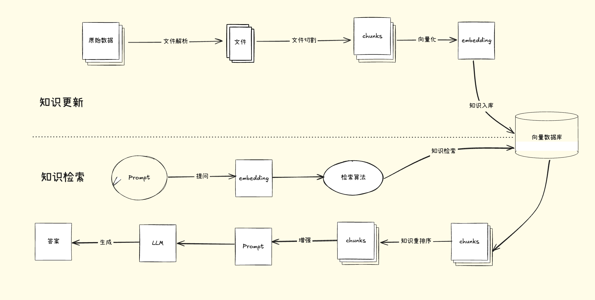

# Langchain使用概述

## 大模型应用开发

### 基于RAG的开发

- 大模型的知识冻结
- 大模型幻觉

RAG解决的就是这两个问题。

RAG（Retrieval-Augmented Generation）

##### 重排序

适合：追求`回答高精度`和`高相关性`的场景中特别适合使用重排序（Reranker）,专业知识库或者是客服系统

不适合：引入重排序会增加召回时间，增加检索延迟。服务对响应时间要求比较高的时候用Reranker不太合适。

- 嵌入模型：EmbeddingModels
- 重排序模型：RerankerModels
- 大语言模型：生成答案

### 基于Agent的开发

充分利用LLM推理能力决策能力，通过增加`规划`、`记忆`、`工具`调用的能力，构造一个能够独立思考、逐步完成给定目标的智能体。

