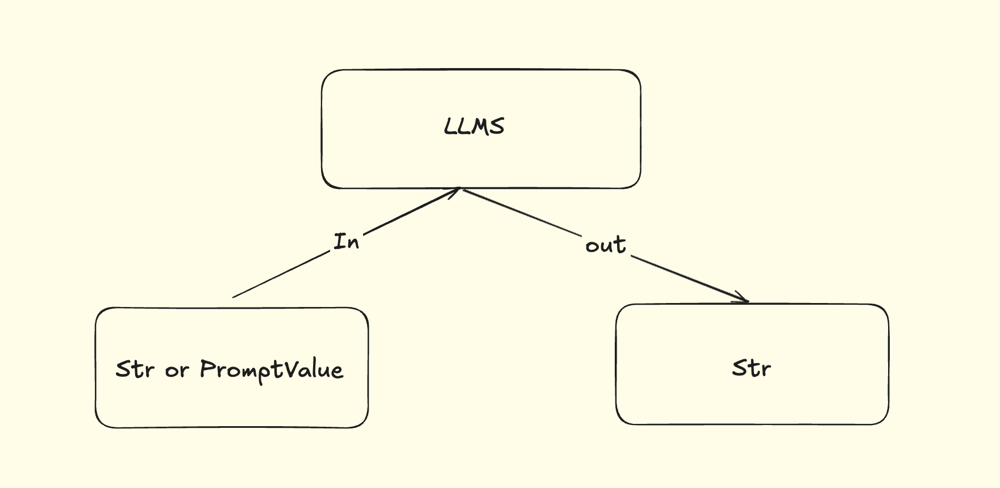

# Model I/O介绍

Model i/O模块是与大模型（LLMS）进行交互的`核心组件`。

所谓的Model I/O，包括输入提示（Format）、调用模型（Predict）、输出解析（Parse）。分别对应着`Prompt Template`、`Model`和`Output Parser`。

> 简而言之，就是输入、模型处理、输出

## Model I/O调用模型

### 模型的不同分类方式

> 简而言之，就是用谁家的API以什么方式调用哪一种类型的大模型

```
# 模型调用的分类
1. 模型功能的不同：

非对话模型（LLMs、Text Model）

对话模型（Chat Model）（推荐）

嵌入模型（Embedding Model）（RAG chapter）

2. 模型调用时，参数书写的位置不同（API Key、base URL、Model-Name）

硬编码（参数写在代码中，不用）

环境变量

配置文件（.env）（推荐）

3. 具体API的调用

使用Langchain 提供的API（推荐方式）

使用OpenAI 官方API 的方式

使用其他平台提供的 API（阿里云百炼等）
```


### 非对话模型的调用方式



- 适用场景：单词文本执行生成（摘要生成、翻译、代码生成、单次问答）
- 不支持多轮上下文。每次调用独立处理输入，无法自动关联历史对话（需手动拼接）
- 局限性：无法处理角色分工或复杂对话逻辑

### 对话模型

ChatModels，聊天模型、对话模型，底层还是LLMs。

特点：

- 输入：接收消息列表`List[BaseMessage]`或者`PromptValue`，每条消息需要指定角色（如SystemMessage、HumanMessage、AIMessage）
- 输出：通常是`BaseMessage`

- 原生支持多轮对话：通过消息列表维护上下文（例如：`[SystemMessage]`、`HumanMessage`、`AIMessage`）
- 适用场景：对话系统（客服机器人、长期交互的AI助手）


