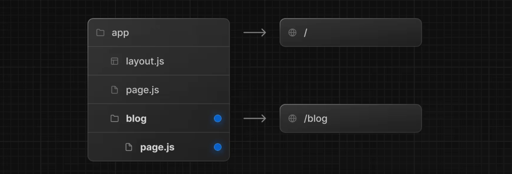

# NextJS

官方文档：https://nextjs.org/docs/app/getting-started

## First - 安装

参照这文档进行安装即可。

Node版本需要大于18.18。

## Second - 路由

### 创建根文件layout.tsx

```tsx
import type { Metadata } from "next";
import { Geist, Geist_Mono } from "next/font/google";
import "./globals.css";

const geistSans = Geist({
  variable: "--font-geist-sans",
  subsets: ["latin"],
});

const geistMono = Geist_Mono({
  variable: "--font-geist-mono",
  subsets: ["latin"],
});

export const metadata: Metadata = {
      title: "Hello NextJS",
  description: "Generated by create next app",
};

export default function RootLayout({
  children,
}: Readonly<{
  children: React.ReactNode;
}>) {
  return (
    <html lang="en">
      <body
        className={`${geistSans.variable} ${geistMono.variable} antialiased`}
      >
        {children}
      </body>
    </html>
  );
}
```

layout是根布局，因为定义在`app`目录下，根布局是必须的，必须包含`html`和`body`标签。

### 创建嵌套路由

嵌套路由是由多个URL段组成的，比如，`/blog/[id]`路由由三个字段组成：

- /（根段）
- blog（片段）
- [id]（叶段）

在NextJS中，文件夹用于定义映射到URL段的短路由。文件（`page`、`layout.tsx`用于创建为某一个片段显示的UI）。

要创建嵌套路由，可以将文件夹嵌套在一起。例如，要为`/blog`添加路由，在`app`文件夹下创建一个名称是`blog`的文件夹。之后加上一个`page.tsx`文件显示文件内容。



```tsx
// Dummy imports
import { getPosts } from '@/lib/posts'
import { Post } from '@/ui/post'
 
export default async function Page() {
  const posts = await getPosts()
 
  return (
    <ul>
      {posts.map((post) => (
        <Post key={post.id} post={post} />
      ))}
    </ul>
  )
}
```

如果要实现一个动态路由，可以在设置文件夹的时候将文件夹的名称设置成`[***]`，用于根据数据生成多个页面。

假设我们存在一个页面：`users/page.tsx`，内容如下：

```tsx
import Link from "next/link";
const Page = () => {
  return (
    <div>
      <h1>DashBoard User</h1>
      <ul>
        <li>
          <Link href="/dashboard/users/1">User 1</Link>
        </li>
        <li>
          <Link href="/dashboard/users/2">User 2</Link>
        </li>
        <li>
          <Link href="/dashboard/users/3">User 3</Link>
        </li>
      </ul>
    </div>
  )
}
```

我们创建一个`[id]`文件夹，其中包含`page.tsx`

```tsx
import React from 'react'
const Page = ({params}: {params: {id: string}}) => {
  const {id} = params;
  return (
    <div>User Profile: {id}</div>
  )
}

export default Page;
```

在点击不同的User内容的时候就会出现动态的显示id 值。

