# CSS3手册

## 布局

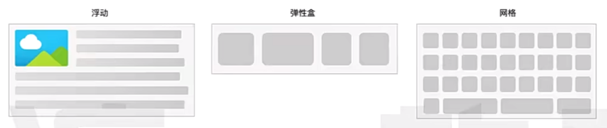

**浮动**：做文字环绕效果

**弹性盒**：单行或单列布局

**网格**：多行多列布局

### 弹性盒

#### 生成弹性容器和弹性项目

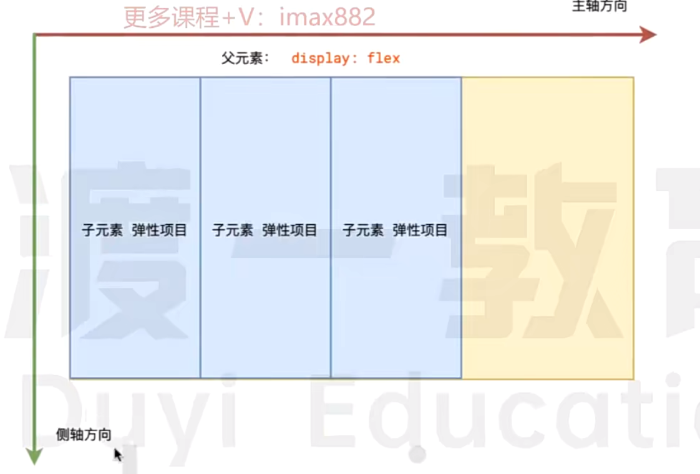

默认情况下，弹性项目沿着主轴一次排列，侧轴拉伸

#### 更改方向

通过`flex-direction`可以更改主轴方向

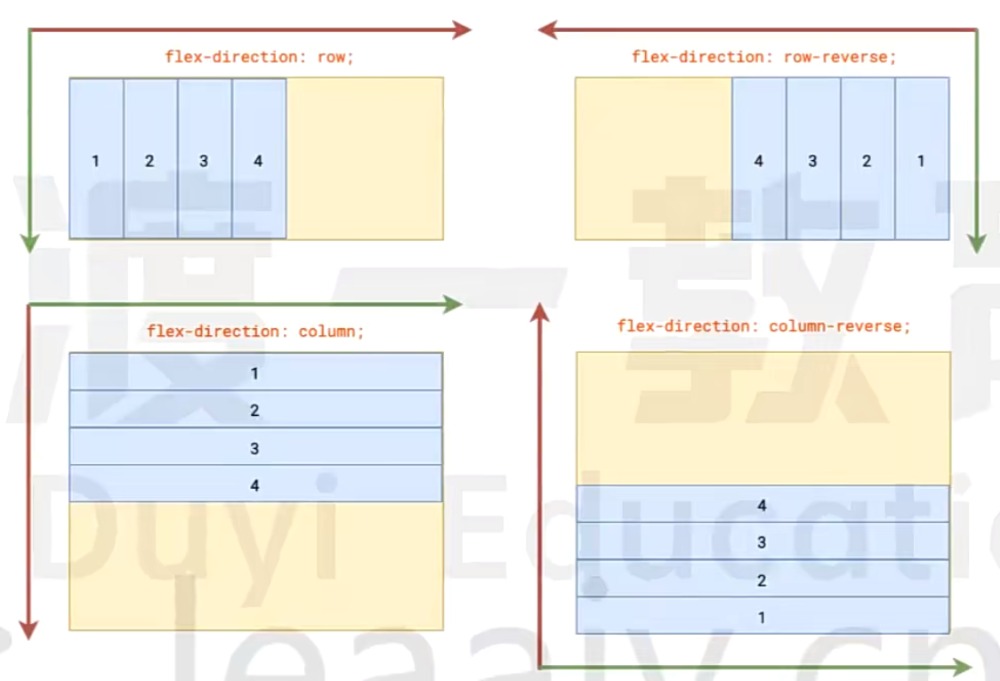

#### 主轴排列

通过`justify-content`属性，可以影响主轴的排列方式

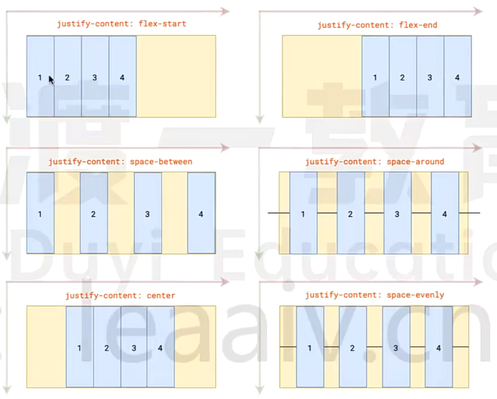

#### 侧轴排列

通过`align-items`属性，可以影响侧轴的排列方式

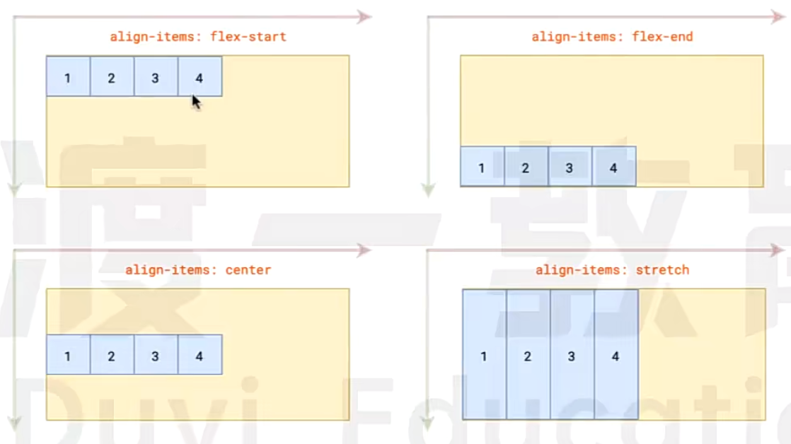

#### 弹性项目伸缩

伸缩，指的是在主轴方向上，当弹性容器有额外空间时，是否需要拉伸，当空间不足时，是否需要压缩

在**弹性项目**上使用`flex`属性，可设置拉伸和压缩比例，`flex: 拉伸比例  压缩比例  初始尺寸`

拉伸实例：

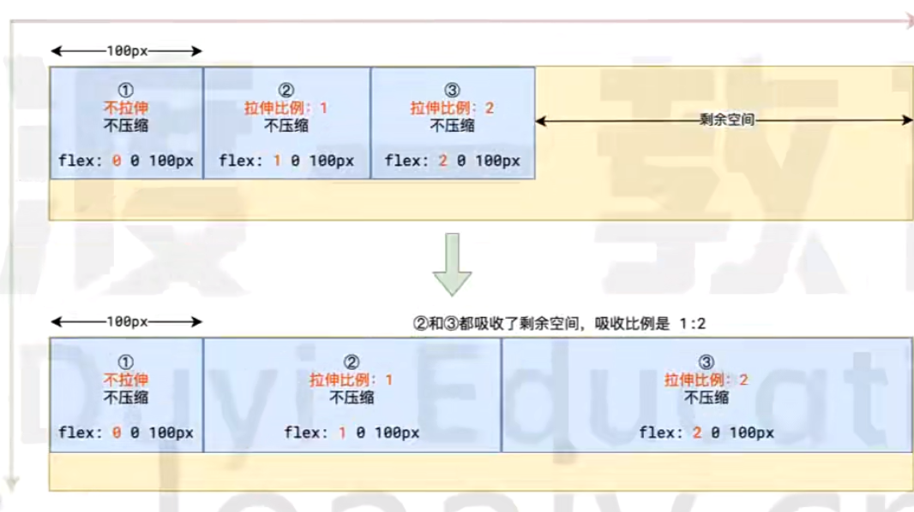

压缩实例：

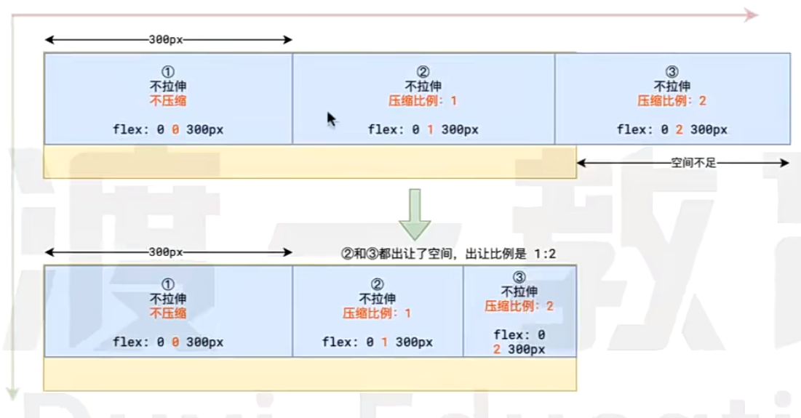

默认情况下，`flex: 0 1 auto`

#### 主轴换行

默认情况下，当主轴剩余空间不足时，按照压缩比例进行压缩，但如果设置了主轴换行，则不会进行压缩，直接换行显示

给弹性容器设置`flex-wrap: wrap`，即可实现主轴换行

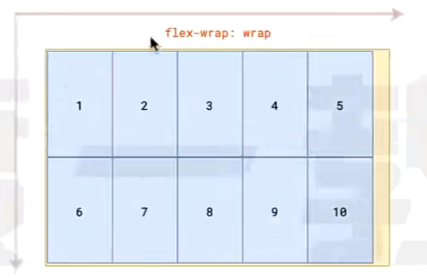

> 尽管主轴换行可以实现多行多列，但是真正的多行多列还是推荐网格布局。

### 网格


## 视觉

> 视觉类样式，指的是不影响盒子位置、尺寸的样式，例如文字颜色、背景颜色、背景图片等

### 阴影

#### 盒子阴影

通过`box-shadow`属性可以设置整个盒子的阴影。

如下是一些实例：

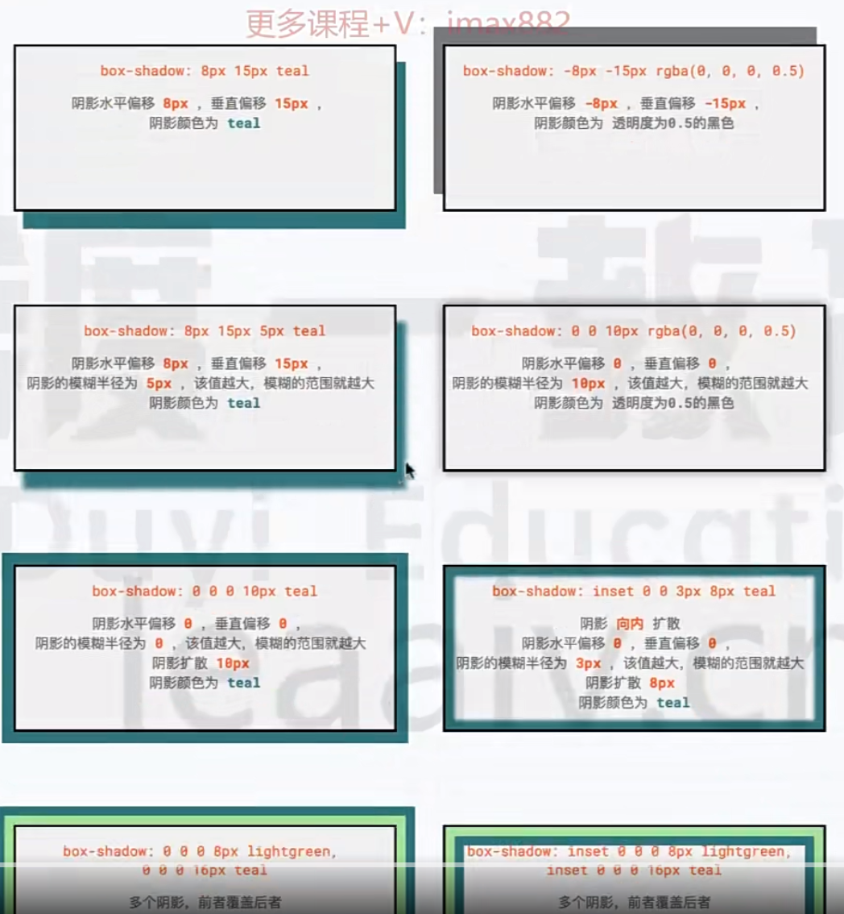

#### 文字阴影

通过`text-shadow`设置文字阴影。

以下是我们的实例：

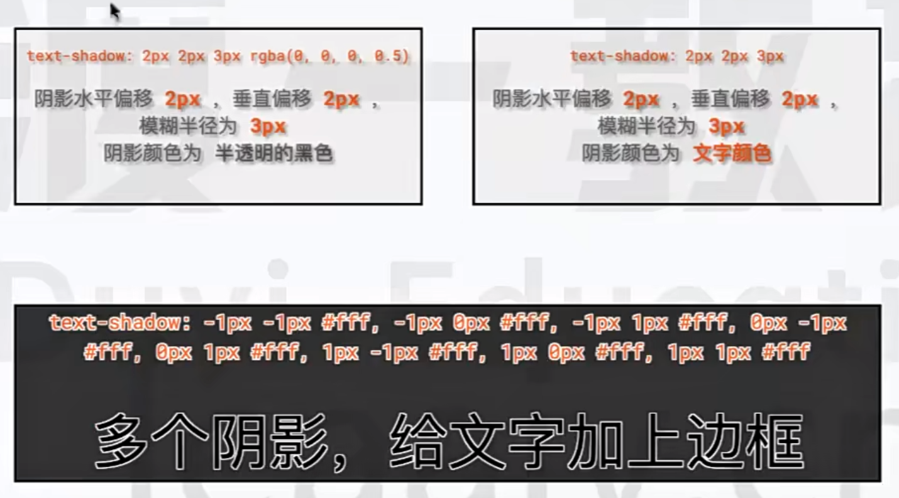

### 圆角

通过设置`border-radius`，设置盒子的圆角。

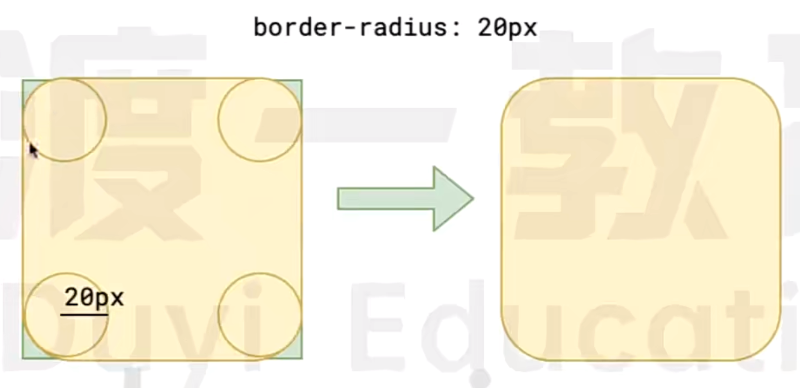

`border-radius`可以有很多灵活的用法：比如以下代码：

```css
border-radius: 10px; /* 同时设置4个角的圆角，半径是10px */
border-radius: 50%; /* 同时设置四个角的圆角，圆的横向半径是宽度一半，纵向半径是高度一半 */
border-radius: 10px 20px 30px 40px; /* 分别设置左上、右上、右下、左下的圆角 */
```

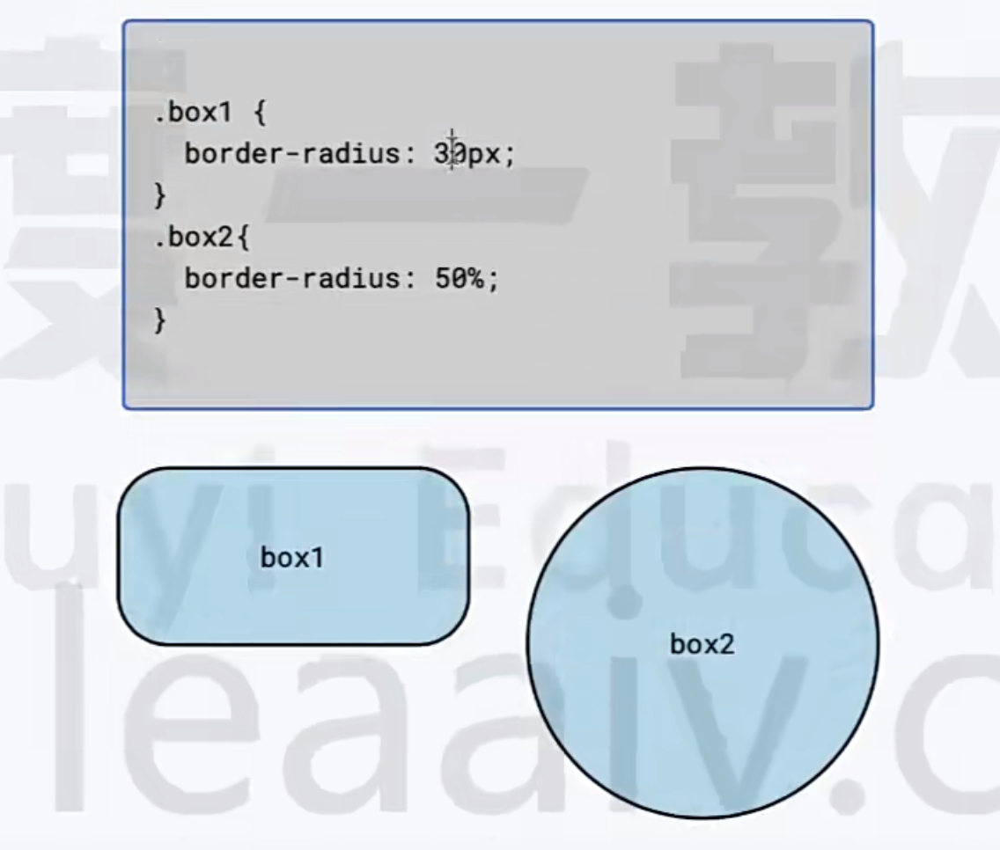

### 背景渐变

在设置背景图片时，除了可以使用`url()`加载一张背景图，还可以使用`linear-gradient()`函数来设置背景渐变。

`linear-gradient`用来创建一张渐变的图片，语法是：

```css
/* 设置渐变背景，方向：从上到下，颜色：从#e66465到#9198e5 */
background: linear-gradient(to bottom, #e66465, #9198e5);
```

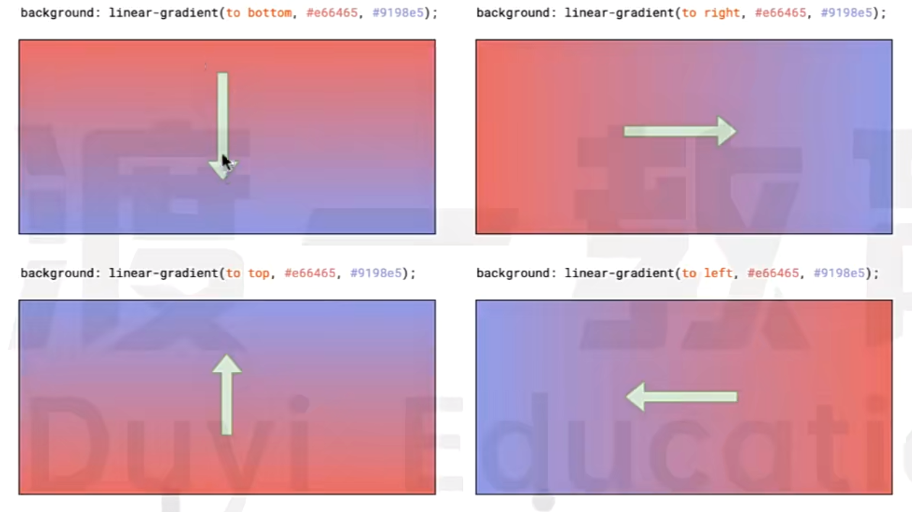

### 变形

通过`transform`属性，可以使得盒子的形态发生变化

该属性支持多种变形方案，常见的有：

- translate，平移
- scale，缩放
- rotate，旋转

无论是哪种**transform**，都只是视觉效果的变化，不会影响到盒子的布局。

`transform`不会导致浏览器reflow和rerender，因此效率很高。

#### translate平移

使用`translate`可以让盒子在原来的位置上产生位移，类似于相对定位。

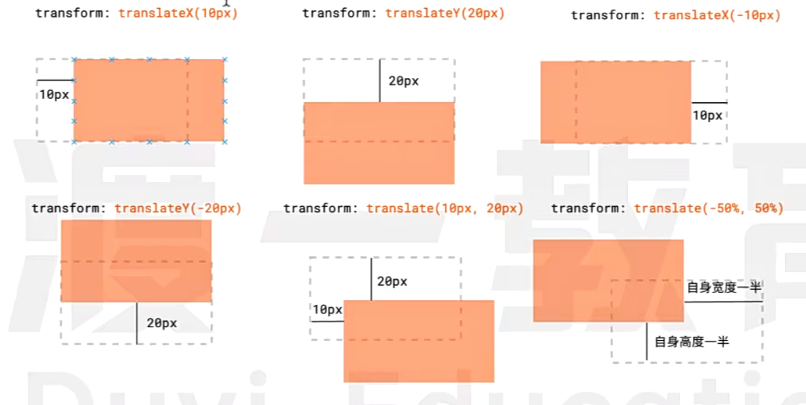

#### scale缩放

使用`scale`可以让盒子在基于原来的尺寸发生缩放。

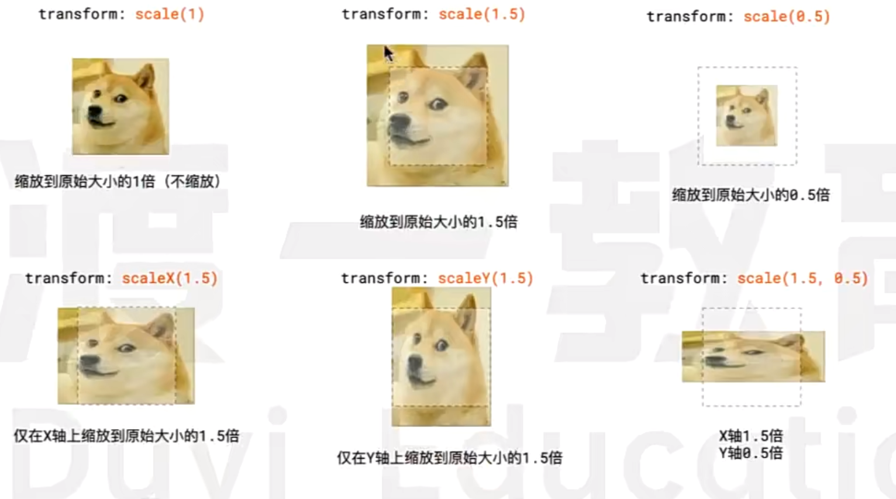

#### rotate旋转

使用`rotate`属性可以在原图的基础上进行旋转。

```css
/* 在原图的基础上，顺时针旋转45度 */
translate: rotate(45deg);
/* 在原图的基础上，顺时针旋转半圈 */
translate: rotate(0.5urn);
```

#### 改变变形圆点

变形圆点的位置，会影响到具体的变形行为

默认情况下，变形的圆点在盒子中心，你可以通过`transform-origin`来改变它。

```css
transform-origin: center; /* 设置圆点在盒子中心 */
transform-origin: left top; /* 设置原点在盒子左上角 */
transform-origin: right bottom; /* 设置圆点在盒子的右下角 */
transform-origin: 30px 60px; /* 设置圆点在盒子坐标的(30, 60)位置 */
```

## 过渡和动画

使用过渡与动画，可以使得CSS属性变得更加丝滑

**过度与动画无法对所有的CSS属性产生影响，能够产生影响的只有数值类属性**，比如宽高、颜色、字体大小等等

### 过渡

```css
transition: 过渡属性  持续时间  过度函数  过度延迟
```

- 过渡属性

​	针对哪一个CSS属性应用过渡。例如填写`transform`，表示仅仅针对**transform**属性使用过渡。如果填写`all`或者不填写，默认是应用于所有的CSS属性。

- 持续时间

​	CSS属性变化所持续的时间，需要带上单位，`3s`表示3秒，`0.5s`或`500ms`表示500毫秒

- 过度函数

​	本质上是CSS属性变化的贝塞尔曲线函数，通常是直接使用预设值：

​	`ease-in-out`：平滑开始，平滑结束。

​	`linear`：线性变化。

​	`ease-in`：仅仅是平滑开始。

​	`ease-out`：仅平滑结束。

- 过渡延迟

​	书写规则和持续时间一样，表示过渡效果延迟多久之后触发，不填没有延迟

**在JS中，可以监听元素的`transitionstart`和`transitionend`事件，从而在过渡开始和过渡结束做一些别的事情。**

### 动画

动画的本质就是预先定义一套CSS变化规则，然后给这个规则起名字

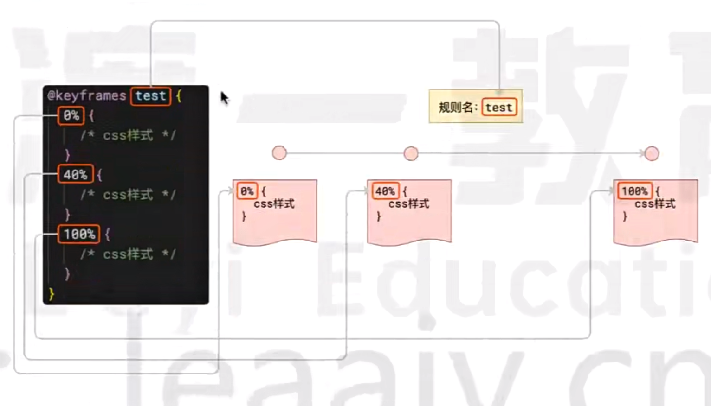

之后，其他元素就可以使用这个规则：

```css
animation: 规则名  持续时间;
```

在应用规则时，还可以指定更多的信息

```css
animation: 规则名  持续时间  重复次数  时间函数  动画方向  延迟时间
```

> 细节：
>
> - 定义规则时，`0%`可以写成`from`
> - 定义规则时，`100%`可以写成`to`
> - 重复次数为`infinite`时，表示无限重复
> - 动画方向为`alternate`时，表示交替方向，第一次正向，第二次反向，第三次正向，第四次反向，以此类推

## 其他


