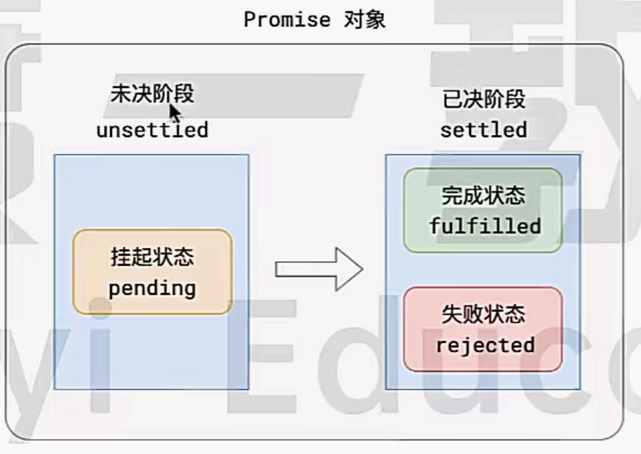
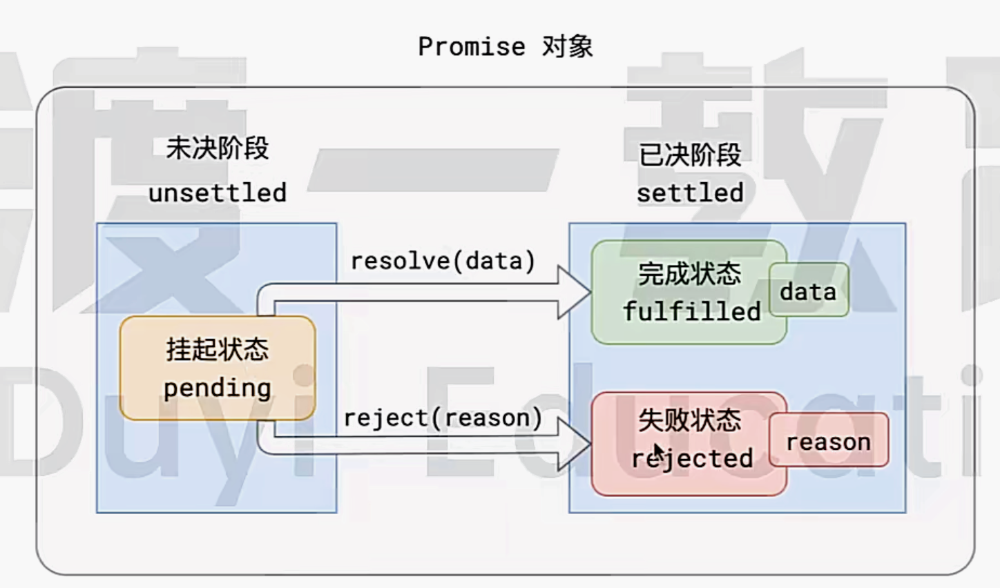

# ES 6

## 简介

### Babel转码器

Babel是一个广泛使用的ES6转码器，可以将ES6转成ES5代码。

```javascript
input.map(item => item + 1);

// 转码后
input.map(function (item) {
    return item + 1;
})
```

项目中安装Babel。

```shell
npm install --save-dev @babel/core
```

#### 配置文件 `.babelrc`

`.babelrc`是Babel配置文件，存放在项目的跟路径中。

该文件用来设置转码规则和插件。

```json
{
    "presets": [],
    "plugins": []
}
```

`presets`设置转码规则，官方提供以下的规则集。

```shell
npm install --save-dev @babel/preset-env # 最新转码规则

npm install --save-dev @babel/preset-react # React转码规则
```

```json
 {
    "presets": [
      "@babel/env",
      "@babel/preset-react"
    ],
    "plugins": []
  }
```

以下所有Babel工具的使用，必须写好`.babelrc`。

#### 命令行转码

Babel提供命令行工具`@babel/cli`，用于命令行转码。

安装如下：

```shell
npm install --save-dev @babel/cli
```

基本用法：

```shell
# 转码结果输出到标准输出
$ npx babel example.js

# 转码结果写入一个文件
# --out-file 或 -o 参数指定输出文件
$ npx babel example.js --out-file compiled.js
# 或者
$ npx babel example.js -o compiled.js

# 整个目录转码
# --out-dir 或 -d 参数指定输出目录
$ npx babel src --out-dir lib
# 或者
$ npx babel src -d lib

# -s 参数生成source map文件
$ npx babel src -d lib -s
```

## Promise

Promise A+ 规定：

1. 所有的异步场景，都可以看成是一个异步任务，每一个异步任务，在JS中应该表现为一个对象，该对象成为Promise对象。


2. 每个任务对象，都应该有两个阶段、三个状态。



根据常理，他们之间存在以下逻辑：

- 任务总是从未决状态变成已决状态，无法逆行，
- 任务总是从挂起状态到完成或者失败状态，不能逆行
- 时间不能倒流，历史不可修改，任务一旦完成或者失败，状态就固定下来，永远无法改变

3. 挂起 --> 完成，成为`resolve`，挂起 --> 失败成为`reject`。任务完成之后，可能有一个相关数据，任务失败时，可能是一个失败原因。



### Promise API

#### Promise.prototype.then()

Promise具有then方法，也就是说，then方法是定义在原型对象Promise.prototype上的。作用是为Promise实例添加状态改变的回调函数。`then`方法第一个参数是`resolved`状态的回调函数，第二个参数是`rejected`状态的回调函数。

`then`方法返回的是一个新的`Promise`实例。因此可以采用链式写法：

```javascript
getJson("/posts.json").then(function(json) {
  return json.post;
}).then(function (post) {
  // 。。。
})
```

第一个回调函数完成之后，会将返回结果作为参数，传入到第二个回调函数。

采用链式的`then`，可以指定一组按照顺序次序调用的回调函数。这时，前有一个回调函数，有可能返回的还是一个`Promise`对象（异步操作），这时后一个回调函数会等待该`Promise`对象的状态发生变化，才会被调用。

```javascript
getJson("/posts.json").then(function (post) {
  return getJson(post.commentURL);
}).then(function (comments) {
  console.log('resolved：', comments);
}, function (error) {
  console.error('rejected: ', error);
})
```

#### Promise.prototype.catch()

Promise处理异步错误拦截的方式。

```javascript
getJson("/posts.json").then(function (posts) {
  // ....
}).catch(function(error) {
  // 处理getJson 和 前一个回调函数运行时发生的错误
  console.log('Error: ', error);
})
```

> 如果then方法指定的回调函数发生错误，也可以catch掉

```javascript
p.then((val) => {console.log('fullfilled:', val)})
	.catch((error) => {console.log('Error:', error)});

// 等价于
p.then((val) => console.log('fullfilled:', val))
	.then(null, (error) => {console.log("rejected:", error)})
```

以下是一个实例：

```javascript
const p = new Promise(function (resolve, reject) {
  throw new Error('test');
})

p.catch(function (error) {
  console.error(error);
})

// Error: test
```

> catch可以捕获前一个catch内容。
>
> ```javascript
> const someAsyncThing = function () {
>   return new Promise(function (resolve, reject) {
>     resolve(x + 1)
>   })
> }
> 
> const someOtherAsyncThing = function () {
>   return new Promise(function (resolve, reject) {
>     resolve(x + 2)
>   })
> }
> 
> someAsyncThing().then(function () {
>   return someOtherAsyncThing()
> }).catch(function (error) {
>   console.log('Error1: ', error)
>   y + 1;
> }).catch(function (error) {
>   console.log('carry on:', error)
> })
> ```

#### Promise.prototype.finaly()

finally()方法用于指定不管Promise最后状态如何，都会执行的操作。

#### Promise.all()

将多个Promise组装成新的Promise实例。

```javascript
const p = Promise.all([p1, p2, p3])
```


