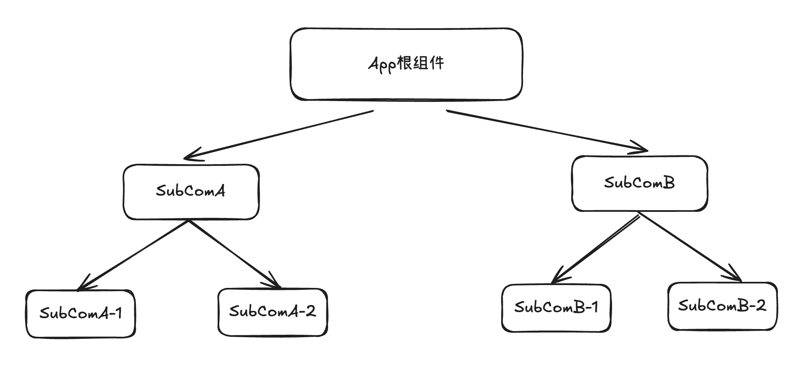
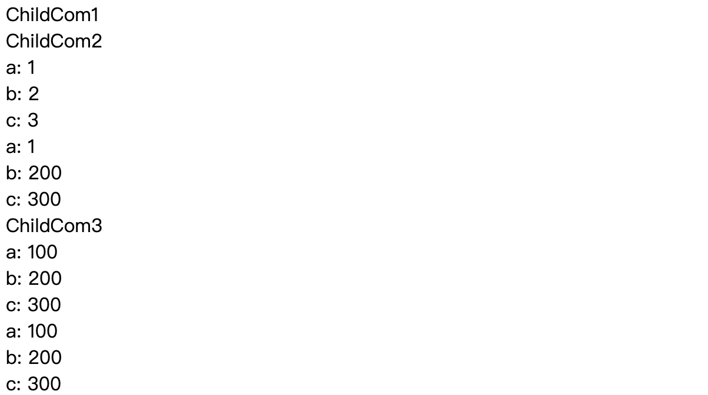
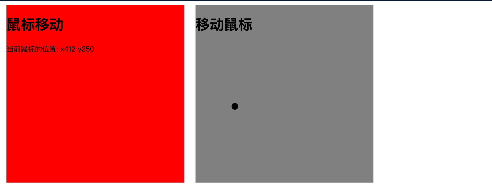
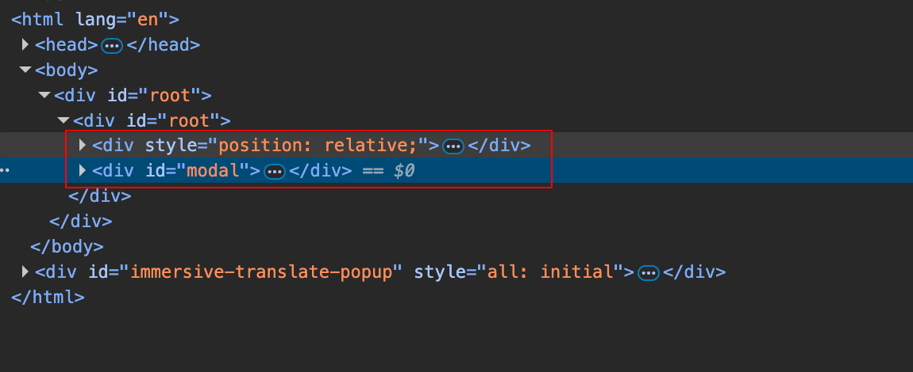
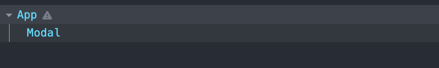

## React 高级

### Ref

包含以下内容：

- 过时API：String类型的Refs
- createRefAPI
- Ref转发
- useRef与useImperativeHandle

#### 过时API：String类型的Refs

```react
export default class App extends Component {
  clickHandle = () => {
    console.log(this);
    console.log(this.refs);
    this.refs.inputRef.focus();
  }
  
  render() {
    return (
    	<div>
      	<input type="text" ref="inputRef"/>
        <button onClick={this.clickHandle}>聚焦</button>
      </div>
    )
  }
}
```

#### useRef 和 useImperativeHandle

##### useRef 和 createRef

虽然useRef和createRef都是创建Ref的，但是还是有一些区别。主要体现在以下方面：

- useRef是hooks的一种，一般用于function组件，而createRef一般用于class组件。
- 由useRef创建的Ref对象在组件的整个生命周期内都不会改变，但是由于createRef创建的ref对象，组件每更新一次，Ref对象都会被重新创建。

正是由于createRef的创建Ref的弊端，组件每次都会更新，出现了useRef Hooks函数来解决这个问题。

useRef还接受一个初始值，用在关联DOM元素中没有卵用，但是在作为存储不需要变化的全局变量中非常方便。


## Context

主要包含以下几点：

- Context要解决的问题
- Context的用法
- Context相关Hook

#### Context要解决的问题

单页应用中的组件会形成一个像组件树一样的结构，当内部组件和组件之间要进行数据传递的时候，就免不了一层一层先传递到公共的父组件，之后再一层一层传递下去。



如果SubComA-1组件的状态数据需要传递到SubComA-2组件，应该怎么做？

根据之前说的单项数据流的规则，数据应该提升到App根组件，之后通过props一层一层传递到下面的子组件，最终subComA-1拿到所需的数据。

官方文档中的在：[何时使用Context](https://zh-hans.legacy.reactjs.org/docs/context.html#when-to-use-context)中解释了这个问题。

简而言之，Context就是解决组件之间数据共享的问题，避免一层一层的传递。

之前的redux已经解决了这个问题，这个Context还有什么用呢？其实redux就是对Context的包装。

#### Context用法

```react
import React from 'react';

const MyContext  =React.createContext();
export default MyContext;
```

首先，使用React.createContext API创建一个上下文对象，该对象中会提供两个组件，分别是Provider和Consumer，表示数据的提供者和消费者。


##### displayName

使用React DevTools的时候需要用到

##### 默认值

```react
const MyContext = React.createContext({
  name: '张三',
  age: 19,
  counter: 1
})
```

##### 多个上下文环境

实例用得到都是单个上下文环境。

创建context创建多个：

```react 
import React from 'react';

export const MyContext1 = React.createContext();
export const MyContext2 = React.createContext();
```

App.jsx

```react
import React, { useEffect, useRef, useState } from 'react';
import { MyContext1, MyContext2 } from './context';
import ChildCom1 from './components/ChildCom1';


function App(props) {

    return (
        <MyContext1.Provider value={{ a: 1, b: 2, c: 3 }}>
            <MyContext2.Provider value={{ a: 100, b: 200, c: 300 }}>
                <div>
                    <ChildCom1 />
                </div>
            </MyContext2.Provider>
        </MyContext1.Provider>
    );
}

export default App;
```

ChildCom1.jsx

```jsx
import React from 'react';
import ChildCom2 from './ChildCom2';
import ChildCom3 from './ChildCom3';

function ChildCom1() {
  return (
    <div>
      ChildCom1
      <ChildCom2 />
      <ChildCom3 />
    </div>
  );
}

export default ChildCom1;
```

ChildCom2.jsx

```jsx
import React from 'react';
import { MyContext1, MyContext2 } from '../context';

function ChildCom2(props) {
  return (
    <MyContext1.Consumer>
      {(context1) => {
        return <MyContext2.Consumer>
          {
            (context2) => (
              <div>
                ChildCom2
                <div>a: {context1.a}</div>
                <div>b: {context1.b}</div>
                <div>c: {context1.c}</div>
                <div>a: {context1.a}</div>
                <div>b: {context2.b}</div>
                <div>c: {context2.c}</div>
              </div>
            )
          }
        </MyContext2.Consumer>
      }}
    </MyContext1.Consumer>
  );
}

export default ChildCom2;
```

ChildCom3.jsx

```jsx
import React from 'react';
import { MyContext1, MyContext2 } from '../context';

function ChildCom3(props) {
  return (
    <MyContext1.Consumer>
      {(context) => {
        return (
          <MyContext2.Consumer>
            {(context) => {
              return (
                <div>
                  ChildCom3
                  <div>a: {context.a}</div>
                  <div>b: {context.b}</div>
                  <div>c: {context.c}</div>
                  <div>a: {context.a}</div>
                  <div>b: {context.b}</div>
                  <div>c: {context.c}</div>
                </div>
              )
            }}
          </MyContext2.Consumer>
        )
      }}
    </MyContext1.Consumer>
  );
}

export default ChildCom3;
```

效果：



> 如果在Consumer中使用的时候使用不同的context，最终的效果是按照每一个上下文环境的内容进行展示的，如果使用的是一样的context，最终展示的最近的，类似于作用域。

### Render Props

在React中，常见的两种方式进行横切面的抽离

- 高阶组件（HOC）
- Render Props

#### Render Props

我们有两个组件：`ChildCom1`、`ChildCom2`。

```jsx
function ChildCom1(props) {
  return (
    <div style={{
      width: '400px',
      height: '400px',
      backgroundColor: 'red'
    }} onMouseMove={props.mouseMoveHandle}>
      <h1>鼠标移动</h1>
      <p>当前鼠标的位置: x{props.points.x}  y{props.points.y}</p>
    </div>
  );
}

export default ChildCom1;


function ChildCom2(props) {
  return (
    <div style={{
      width: '400px',
      height: '400px',
      backgroundColor: 'grey',
      position: 'relative',
      overflow: 'hidden'
    }}
      onMouseMove={props.mouseMoveHandle}
    >
      <h1>移动鼠标</h1>
      <div style={{
        width: '15px',
        height: '15px',
        borderRadius: '50%',
        backgroundColor: 'black',
        position: 'absolute',
        left: props.points.x - 5 - 450,
        top: props.points.y - 5 - 12
      }}>

      </div>
    </div>
  );
}

export default ChildCom2;
```

以下是我们的App组件

```jsx
import ChildCom1 from './components/ChildCom1';
import ChildCom2 from './components/ChildCom2';
import withMouseMove from './HOC/withMouseMove';

function App(props) {

    return (
        <div style={{
            display: 'flex',
            justifyContent: 'space-around',
            width: '850px'
        }}>
            {/* <ChildCom1 /
            <ChildCom2 /> */}
            <MouseMove render={(props) => <ChildCom1 {...props}/>} />
            <MouseMove render={(props) => <ChildCom2 {...props}/>} />
        </div>
    );
}

export default App;
```

效果：

#### HOC 高阶组件

```javascript
import { useState } from "react"

function withMouseMove(Com) {
  return function NewCom() {
    const [points, setPoints] = useState({
      x: 0,
      y: 0
    })

    function mouseMoveHandle(e) {
      setPoints({
        x: e.clientX,
        y: e.clientY
      })

    }

    const mousemove = { points, mouseMoveHandle }

    return <Com {...mousemove} />
  }
}

export default withMouseMove
```

App组件修改：

```jsx
import ChildCom1 from './components/ChildCom1';
import ChildCom2 from './components/ChildCom2';
import withMouseMove from './HOC/withMouseMove';

function App(props) {

    return (
        <div style={{
            display: 'flex',
            justifyContent: 'space-around',
            width: '850px'
        }}>
            {/* <ChildCom1 /
            <ChildCom2 /> */}
            <NewChildCom1 />
            <NewChildCom2 />
        </div>
    );
}

export default App;
```

虽然这个技巧的名字叫做Render Props，但不是说必须叫做render = {...}，**<u>封装公共逻辑的组件只要能得到渲染的视图即可</u>**。

> 什么时候用HOC？什么时候用Render Props?
>
> 一般来说，<u>Render Props应用于组件之间功能逻辑完全相同，仅仅只是渲染的逻辑不同。</u>这个时候可以通过Render Props来处理；
>
> HOC一般是抽取部分公共逻辑，其余组件之间还有一部分逻辑是不同的，这个时候HOC比较合适。

### Portals

Portals成为传送门。官方的意思是：

> Portal提供了一种将子节点渲染到存在与父组件以外的DOM节点优秀方案。

语法为：

```jsx
ReactDom.createPortal(child, contianer);
```

第一个参数是需要渲染的子节点。第二个参数是一个要渲染的位置DOM节点。

#### 什么情况下使用Portals

```jsx
import { useState } from 'react';
import Modal from './components/Modal';

function App(props) {

  const [isShow, setIsShow] = useState(false);


  return (
    <div id='root'>
      <div style={{
        position: 'relative',
      }}>
        <h1>App组件</h1>
        <button onClick={() => setIsShow(!isShow)}>显示/隐藏</button>
        {isShow ? <Modal /> : null}
      </div>

      <div id='modal'></div>
    </div>

  );
}

export default App;
```

Modal.jsx

```jsx
import React from 'react';
import { createPortal } from 'react-dom';
function Modal(props) {
  // 之前是直接返回的JSX。现在我们通过Portals指定JSX渲染的位置

  return createPortal((<div style={{
    width: '450px',
    height: '250px',
    border: '1px solid',
    position: 'absolute',
    left: 'calc(50% - 225px)',
    top: 'calc(50% - 125px)',
    textAlign: 'center',
    lineHeight: '250px'
  }}>
    模态框
  </div>), document.getElementById('modal'));
}

export default Modal;
```

效果如图：



可以发现这个modal和有样式的div在同一个层级。

#### 事件冒泡

尽管Portal被放在DOM树任何位置，但是在React组件树中还是React中。与DOM树中的位置无关，无论子节点是否是portal，像类似于Context这样的功能都是不变的。



### 错误边界

错误边界是一个React组件，这种组件课可以捕获发生在其子组件树任何位置的JavaScript错误，并打印这些错误，同时展示降级UI，并不会显示那些发生崩溃的子组件树。


