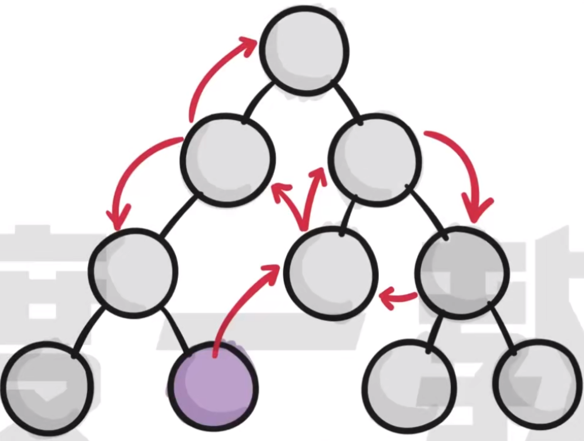
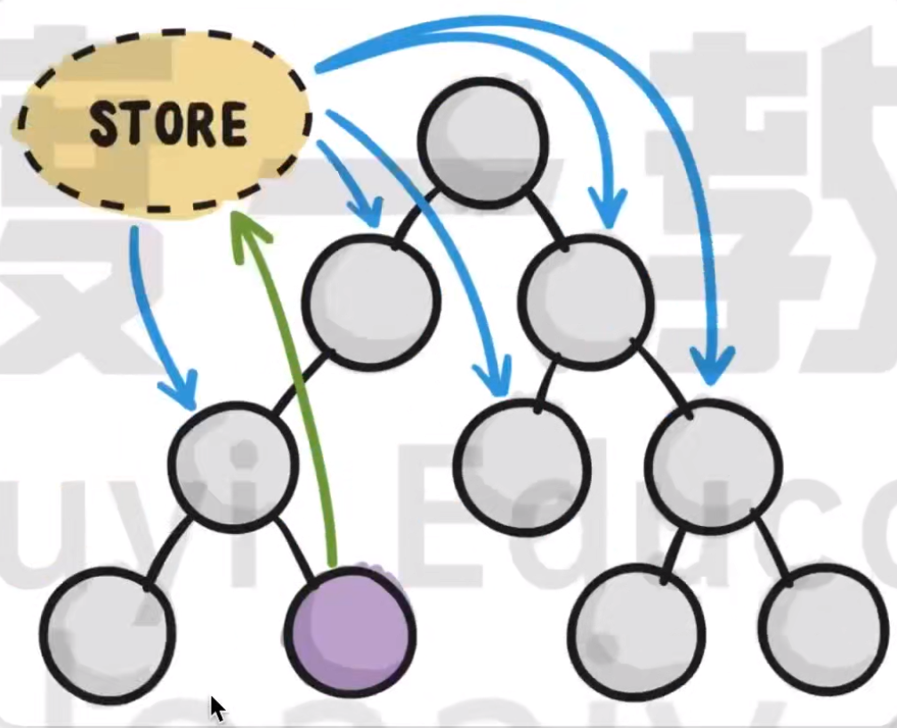
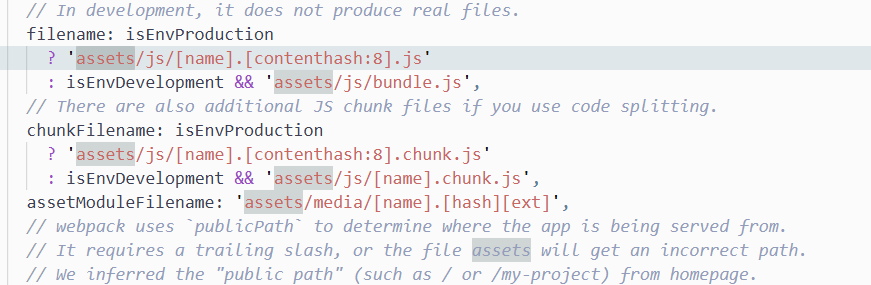

# React 18.2.0

## Hooks

### 基本介绍

> Hook是React16.8新增特性，可以在不编写class的情况下使用state以及其他的React特性。

Hooks的出现，解决了如下的一些问题：

- 告别生命周期

> 以下代码中相同的代码实现了两遍。componentDidMount和componentDidUpdate

```react
import React from 'react'

class App extends React.Component {
  constructor(props) {
    super(props);
    this.state = { 
      count: 0
     };
  }

  componentDidMount() {
    document.title =  `You clicked ${this.state.count} times`
  }

  componentDidUpdate() {
    document.title = `You clicked ${this.state.count} times`
  }

  render() {
    return (
      <div>
        <p>You clicke {this.state.count} times</p>
        <button onClick={() => {this.setState({count: this.state.count + 1})}}>
          Click me
        </button>
      </div>
    );
  }
}

export default App;
```

- 告别class中的this

> 在类组件中，存在this的指向问题，比如在事件处理函数中，不能直接通过this获取组件实例，需要修改this指向。

- 告别繁重的类组件，回归到函数

> 用类组件的话需要继承React.Component。会存在许多多余的冗余内容。

Hooks的出现就整个React思想上的转变，从“面向对象”到“函数式编程”。在学习Hooks的时候，会发现突然多了很多不熟悉的概念，`纯函数`、`副作用`、`柯里化`、`高阶函数`等概念。


Hook就是JavaScript函数，但是使用的话会有两个额外的规则：

- 只能在`函数最外层`调用Hook。不能在循环、条件判断或者子函数中使用。
- 只能在React的函数组件中调用Hook，不要在其他JavaScript函数中调用。

### useState和useEffect

React内置了一些实用的Hook，并且随着React版本的更新，Hook的数量还在持续的增加。

- 基本使用

```react
import {React, useState} from 'react';

function App(props) {

  // 初始值, set初始值
  let [count, setCount] = useState(0);

  function clickHandle() {
    setCount(++count);
  }
  

  return (
    <div>
      <div>{count}</div>
      <button onClick={clickHandle}>+ 1</button>
    </div>
  );
}

export default App;
```

- 声明多个state变量

```react
import {React, useState} from 'react';

function App(props) {

  // 初始值, set初始值
  let [count, setCount] = useState(0);

  // 使用多变量
  let [age, setAge] = useState(42);
  const [fruit, setFruit] = useState('banana');
  const [todos, setTodos] = useState([{ text: '学习 Hook' }]);

  function clickHandle() {
    setCount(++count);
    setAge(++age);
  }
  

  return (
    <div>
      <div>{count}</div>
      <div>年龄：{age}</div>
      <div>水果：{fruit}</div>
      <div>计划：{todos[0].text}</div>
      <button onClick={clickHandle}>+ 1</button>
    </div>
  );
}

export default App;
```

useEffect

- 副作用

  - 纯函数：一个确切的参数在函数中运行之后，一定能够得到一个确切的值，例如下面的例子：

  ```javascript
  function test(x) {
      return x * 2;
  }
  // 输入的如果是：2，得到的一定是4；输入的如果是3，得到的一定是6
  ```

  - 如果一个函数中存在副作用，那么我们就称该函数不是一个纯函数，所谓副作用，就是指的函数的结果不可控，不可预期。
  - 常见的副作用有：发送网络请求、添加一些监听的注册和取消注册、手动修改**DOM**。

- 基本使用

- 执行清理工作

- 副作用的依赖

### 自定义Hook

自定义Hook本质上就是函数，但是和普通函数还是有一些区别，主要体现在以下两个点：

- 自定义Hook能够调用诸如useState、useRef等，普通函数不能调用。由此可以通过内置的Hooks获取到Fiber的访问方式，可以实现在组件级别存储数据的方案等。
- 自定义Hooks需要以`use`开头，普通函数没有这个限制，这并非是一个强制的语法，而更像是一种约定

**App.jsx**

```react
import {React, useState, useEffect} from 'react';
import useMyBook from './useMyBook';

function App() {

  const {bookName, setBookName} = useMyBook();
  const [value, setValue] = useState("");
  function changeHandle(e) {
    setValue(e.target.value);
  }

  function clickHandle() {
    setBookName(value)
  }

  return (
    <div>
        <div>{bookName}</div>
        <input type="text" value={value} onChange={changeHandle}/>
        <button onClick={clickHandle}>确定</button>
    </div>
  );
}

export default App;
```

**useMyBook.jsx**

```react
import { useState } from "react";

// 自定义Hook --> 使用了原有的useState这个Hook，这个也是一个Hook
function useMyBook() {
  const [bookName, setBookName] = useState("React learning...")
  return {
    bookName, setBookName
  }
}

export default useMyBook;
```


## Redux

### 什么是状态管理？

状态管理是**把组件之间需要共享的状态抽离出来，遵循一定的约定，统一来管理，让状态变化可以预测**

- 需要将共享的状态提升到公共的父组件，若没有公共的父组件，往往需要自行构造。
- 状态由父组件自上而下逐层传递，若组件层级很多，数据传递会变得很冗余。



需要将属性公共化。



### Redux核心思想

早期的时候，React官方提供了Flux，Flux的特点：

- 单向数据流。视图事件或者外部测试用例发出Action，经由Dispatcher派发给Store，Store会触发相关的方法更新数据、更新视图
- Store可以有多个
- Store不仅存放数据，还封装了处理数据的方法

2015年的时候，Dan Abramov推出了Redux。Redux本质上就是在Flux上做了一些更新：

- 单向数据流。View发出Action(`store.dispatch(action)`)，store调用了Reducer计算出新的state，若state产生变化，则调用监听函数重新渲染View（`store.subscribe(render)`）
- 单一数据源。只有一个Store
- state是只读的，每一次状态更新只能返回一个新的state
- 没有Dispatcher，而是在Store中集成了dispatch方法，`store.dispatch()`是View发出Action的唯一途径
- 支持使用中间件（Middleware）管理异步数据流

Redux是一个独立的状态管理库，有几个核心概念：

1. Store：存储整个应用的状态
2. State：应用程序的状态
3. Action：一个包含了type属性的普通对象用于描述发生了什么。
4. Reducer：一个函数，接收当前的state和一个Action，返回一个新的state


## 问题记录

1、 请求转发

src目录下新建一个setupProxy文件，在该文件中进行请求转发的配置

在使用的时候还需要安装一个插件`http-proxy-middleware`。

2、 渲染svg图片

在Vue中需要渲染一段HTML或者svg，需要使用v-html。在React中，可以通过如下方式：

```react
<div dangerouslySetInnerHTML={{__html: captcha}}></div>
```

3、 修改打包后的路径

由于我们的静态资源文件以static ，所以我们配置了请求转发，但是create-react-app（基于webpack）默认在打包应用的时候，也会将打包好的资源放在static目录下，导致在加载打包好的资源的时候，也会进行请求转发，从而报错。

我们需要做的是修改打包好的目录。首先运行下面的命令：

```shell
npm run eject # webpack弹出
```

会多出来很多配置文件，可能会出现Babel的错误，最快的解决方案就是在`package.json`中删除：

```json
  "eslintConfig": {
    "extends": [
      "react-app",
      "react-app/jest"
    ]
  },
```

在config/webpack.config.js中修改文件：


