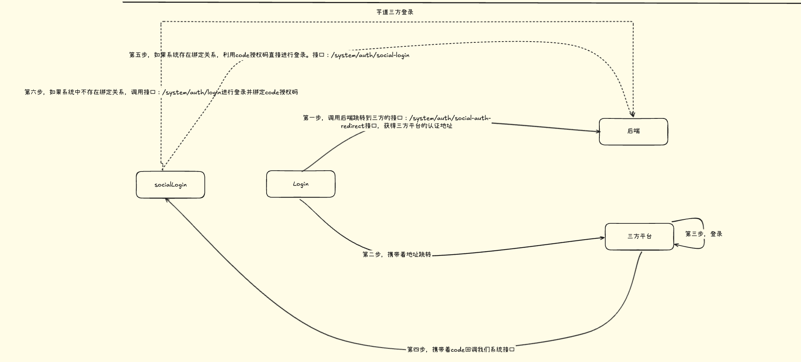
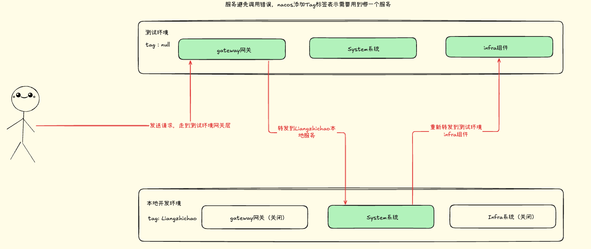
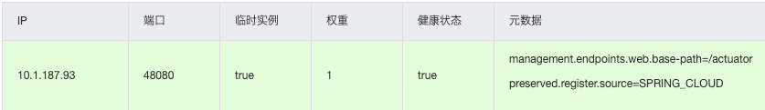
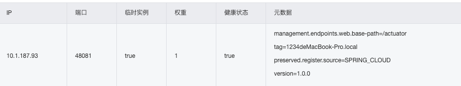
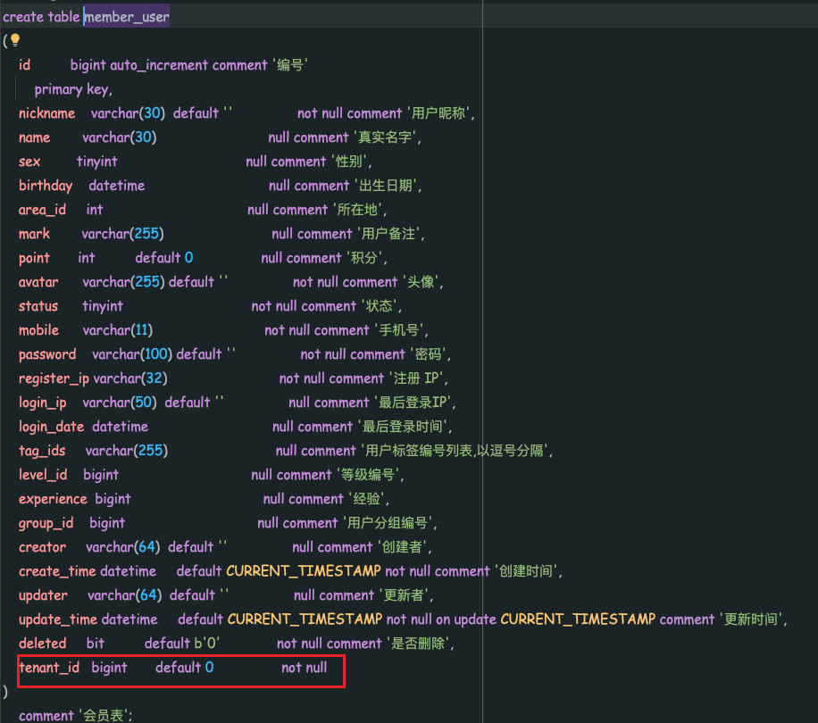
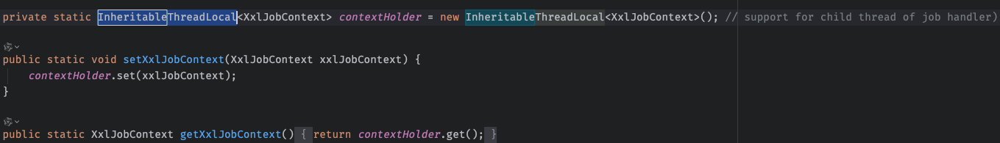

# 芋道

## 模块分布

| 业务系统                                                     | 通用模块              | 框架组件            |
| ------------------------------------------------------------ | --------------------- | ------------------- |
| 商城Mall                                                     | System系统功能        | Web技术组件         |
| OA自动化办公                                                 | Infra基础设施         | Security安全组件    |
| ERP企业资源计划系统（ERP 就是一套把企业里“人、财、物、产、供、销”等所有核心业务统一管理起来的软件系统） | BPM工作流程           | MyBatis数据库组件   |
| CRM客户关系管理系统（CRM 是专门用来“管客户、促成交、提复购”的系统） | Pay支付系统           | Redis缓存组件       |
| CMS内容管理系统（解决的是内容多、更新频繁、非技术人员也可以修改内容的系统，例如公司官网、新闻，产品介绍等） | Member会员中心        | MQ中间件            |
| BBS论坛社区系统（社区系统，贴吧一类）                        | Visualization数据报表 | JOB定时任务         |
|                                                              |                       | Protection组件      |
|                                                              |                       | Monitor监视器组件   |
|                                                              |                       | Test测试            |
|                                                              |                       | Flowable工作流      |
|                                                              |                       | Data Permission组件 |
|                                                              |                       | Tenant 业务组件     |
|                                                              |                       | Pay业务组件         |
|                                                              |                       | SMS业务组件         |
|                                                              |                       | Social 业务组件     |
|                                                              |                       | Operate Log业务组件 |


## 功能权限

### 如何设计一个权限系统

- 目标
- 权限模型
- 选择方案

#### 目标：最基础的解决问题就是校验用户是否可以进行某一个操作

1. 灵活配置权限
2. 多种级别的权限（菜单、按钮、URL）


#### 权限模型

1. RBAC

   全称：基于角色的访问控制

   概念：简而言之，总共有三个类型（用户、角色、权限），用户和权限是通过角色进行交集绑定的，也就是某一个用户有那一些角色，这些角色有哪一些权限。只要用户和角色、角色和权限之间存在交集，就是该用户具有某一个权限。

   好处：简单可复用。

2. ABAC

   全称：基于属性的访问控制

   概念：权限是否被允许，是由以下四个信息共同决定的。

   1. 对象：对象是当前请求访问资源的用户。例如：用户的属性包括ID、个人资源、角色、部门和组织成员身份标识
   2. 资源：资源是当前用户要访问的资产和对象。例如文件、数据、服务器甚至是API
   3. 操作：用户试图对资源进行的操作。常见的操作包括：读取、写入、编辑、删除等
   4. 环境信息：环境是每一个访问请求的上下文。比如：访问的时间和位置，对象的设备、通信协议等

   举例说明：

   以阿里为例。P5（职级）的研发（职位）同学，在公司内网（环境）下，可以查看和下载（操作）代码（资源）。

   部门经理（部门），可以查看、编辑（操作）自己部门下的所有订单（资源）。

   好处：实现非常灵活的权限控制，几乎满足所有类型需求。

   使用场景：用户量很多，授权复杂的场景。

   表结构：


## 用户认证

系统提供了两种类型的用户，分别满足对应的管理后台、用户App 场景。


两种不同类型的用户分别对应两个表：**system_users**、**member_user**表。

> 为什么不使用统一的用户表？
>
> 新增一个type字段表示用户类型，主要是一开始考虑到两个模块是不同的组进行开发，尽量不互相污染数据，采取了多个用户表的方案。

如果之间需要进行关联，可以通过中间表进行处理。**system_oauth2_access_token**。字段：user_type。


### 设计一个双Token系统

双Token机制出现的需求是：

1. Token过期时间不会设计的很长，所以很可能经常需要用户重新登录，影响用户体验。
2. 设置长期的Token安全性降低。

表设计：**访问令牌**和**刷新令牌**


一个是用来存储访问令牌的，另一个是用来存储刷新Token的。

整体步骤：登录接口中有创建Token的方法，在这个方法中需要添加一个方法插入登录日志入库。之后创建访问令牌。创建刷新令牌和访问令牌入库。创建刷新令牌的时候不需要设置到Redis中，原因是这个刷新令牌的过期时间很长30天。之后设置访问令牌，先将访问令牌设置到数据库中，之后设置到Redis中。

如果用户注销登录，删除访问令牌（删除数据库中的和Redis中的），之后删除刷新令牌。之后所有接口进行校验的时候就会出现用户认证失败的问题自动重定向到登录页面。

### 开发测试的时候设置认证Token

在Token过滤器中加上Mock掉数据的操作。设计的要求是：

1. Token开头必须是：test
2. test之后跟一个数字，表示用户编号
3. 需要动态配置Mock开启状态：

```yaml
yudao:
  security:
    mock-enable: true
```

### 实现URL是否需要登录

主要是利用Spring Security中的permitAll()方法。

1. 首先有一些静态资源需要设置成permitAll。之后获取全部接口，观察这些接口中的是否包含@PermitAll。按照请求方式作为Map分别进行处理。

```java
  private Multimap<HttpMethod, String> getPermitAllUrlsFromAnnotations() {
        Multimap<HttpMethod, String> result = HashMultimap.create();
        // 获得接口对应的 HandlerMethod 集合
        RequestMappingHandlerMapping requestMappingHandlerMapping = (RequestMappingHandlerMapping)
                applicationContext.getBean("requestMappingHandlerMapping");
        Map<RequestMappingInfo, HandlerMethod> handlerMethodMap = requestMappingHandlerMapping.getHandlerMethods();
        // 获得有 @PermitAll 注解的接口
        for (Map.Entry<RequestMappingInfo, HandlerMethod> entry : handlerMethodMap.entrySet()) {
            HandlerMethod handlerMethod = entry.getValue();
            if (!handlerMethod.hasMethodAnnotation(PermitAll.class) // 方法级
                    && !handlerMethod.getBeanType().isAnnotationPresent(PermitAll.class)) { // 接口级
                continue;
            }
            Set<String> urls = new HashSet<>();
            if (entry.getKey().getPatternsCondition() != null) {
                urls.addAll(entry.getKey().getPatternsCondition().getPatterns());
            }
            if (entry.getKey().getPathPatternsCondition() != null) {
                urls.addAll(convertList(entry.getKey().getPathPatternsCondition().getPatterns(), PathPattern::getPatternString));
            }
            if (urls.isEmpty()) {
                continue;
            }

            // 特殊：使用 @RequestMapping 注解，并且未写 method 属性，此时认为都需要免登录
            Set<RequestMethod> methods = entry.getKey().getMethodsCondition().getMethods();
            if (CollUtil.isEmpty(methods)) {
                result.putAll(HttpMethod.GET, urls);
                result.putAll(HttpMethod.POST, urls);
                result.putAll(HttpMethod.PUT, urls);
                result.putAll(HttpMethod.DELETE, urls);
                result.putAll(HttpMethod.HEAD, urls);
                result.putAll(HttpMethod.PATCH, urls);
                continue;
            }
            // 根据请求方法，添加到 result 结果
            entry.getKey().getMethodsCondition().getMethods().forEach(requestMethod -> {
                switch (requestMethod) {
                    case GET:
                        result.putAll(HttpMethod.GET, urls);
                        break;
                    case POST:
                        result.putAll(HttpMethod.POST, urls);
                        break;
                    case PUT:
                        result.putAll(HttpMethod.PUT, urls);
                        break;
                    case DELETE:
                        result.putAll(HttpMethod.DELETE, urls);
                        break;
                    case HEAD:
                        result.putAll(HttpMethod.HEAD, urls);
                        break;
                    case PATCH:
                        result.putAll(HttpMethod.PATCH, urls);
                        break;
                }
            });
        }
        return result;
    }
```

2. 之后获取配置文件中的**yudao.security.permit-all-urls**属性获取到数组，可以按照接口位置进行放行，不校验。
3. 由于不同的服务都有不同的接口，如果所有的接口都在同一个位置进行单独处理，会导致代码冲突很多，同时维护起来也很麻烦（屎山）。可以尝试将这个权限控制下放到各个不同的服务，比如System-Server。

> 实现原理如下：
>
> 我们的**YudaoWebSecurityConfigurerAdapter**使用了自动注入，在类中有一个AuthorizeRequestsCustomizer的集合。其中依赖于Spring的自动扫描注入功能，所以我们如果新建了一个服务，可以通过创建一个Bean来创建这个访问规则，比如我们的System-Server模块，
>
> ```java
> @Configuration(proxyBeanMethods = false, value = "systemSecurityConfiguration")
> public class SecurityConfiguration {
>     @Bean("systemAuthorizeRequestsCustomizer")
>     public AuthorizeRequestsCustomizer authorizeRequestsCustomizer() {
>         return new AuthorizeRequestsCustomizer() {
>             @Override
>             public void customize(AuthorizeHttpRequestsConfigurer<HttpSecurity>.AuthorizationManagerRequestMatcherRegistry registry) {
>                 // TODO 芋艿：这个每个项目都需要重复配置，得捉摸有没通用的方案
>                 // Swagger 接口文档
>                 registry.requestMatchers("/v3/api-docs/**").permitAll()
>                         .requestMatchers("/webjars/**").permitAll()
>                         .requestMatchers("/swagger-ui").permitAll()
>                         .requestMatchers("/swagger-ui/**").permitAll();
>                 // Druid 监控
>                 registry.requestMatchers("/druid/**").permitAll();
>                 // Spring Boot Actuator 的安全配置
>                 registry.requestMatchers("/actuator").permitAll()
>                         .requestMatchers("/actuator/**").permitAll();
>                 // RPC 服务的安全配置
>                 registry.requestMatchers(ApiConstants.PREFIX + "/**").permitAll();
>             }
> 
>         };
>     }
> }
> ```
>
> 通过注入Bean：systemAuthorizeRequestsCustomizer，重写customize方法将放行方法通行。
>
> 之后通过在主类（YudaoWebSecurityConfigurerAdapter）中设置自定义规则（**authorizeHttpRequests(c -> authorizeRequestsCustomizers.forEach(customizer -> customizer.customize(c)))**），之后是必须要认证的接口URL。


### 三方登录

流程图如图所示：



## 框架组件

### 操作日志、访问日志、错误日志处理

#### 访问日志

我们定义了一个注解：**@ApiAccesLog**

```java
@Target({ElementType.METHOD})
@Retention(RetentionPolicy.RUNTIME)
public @interface ApiAccessLog {

    // ========== 开关字段 ==========

    /**
     * 是否记录访问日志
     */
    boolean enable() default true;
    /**
     * 是否记录请求参数
     *
     * 默认记录，主要考虑请求数据一般不大。可手动设置为 false 进行关闭
     */
    boolean requestEnable() default true;
    /**
     * 是否记录响应结果
     *
     * 默认不记录，主要考虑响应数据可能比较大。可手动设置为 true 进行打开
     */
    boolean responseEnable() default false;
    /**
     * 敏感参数数组
     *
     * 添加后，请求参数、响应结果不会记录该参数
     */
    String[] sanitizeKeys() default {};

    // ========== 模块字段 ==========

    /**
     * 操作模块
     *
     * 为空时，会尝试读取 {@link io.swagger.v3.oas.annotations.tags.Tag#name()} 属性
     */
    String operateModule() default "";
    /**
     * 操作名
     *
     * 为空时，会尝试读取 {@link io.swagger.v3.oas.annotations.Operation#summary()} 属性
     */
    String operateName() default "";
    /**
     * 操作分类
     *
     * 实际并不是数组，因为枚举不能设置 null 作为默认值
     */
    OperateTypeEnum[] operateType() default {};

}
```

之后我们定义一个过滤器：**ApiAccessLogFilter**，作用是在过滤器中拿到请求和响应进行参数处理。

```java
public class ApiAccessLogFilter extends ApiRequestFilter
```

这个类继承自ApiRequestFilter，下方就是父类实现方式，主要是过滤出只有API的接口。

```java
@RequiredArgsConstructor
public abstract class ApiRequestFilter extends OncePerRequestFilter {

    protected final WebProperties webProperties;

    @Override
    protected boolean shouldNotFilter(HttpServletRequest request) {
        // 只过滤 API 请求的地址
        String apiUri = request.getRequestURI().substring(request.getContextPath().length());
        return !StrUtil.startWithAny(apiUri, webProperties.getAdminApi().getPrefix(), webProperties.getAppApi().getPrefix());
    }
}
```

之后在ApiRequestFilter中重写方法：

```java
    @Override
    @SuppressWarnings("NullableProblems")
    protected void doFilterInternal(HttpServletRequest request, HttpServletResponse response, FilterChain filterChain)
            throws ServletException, IOException {
        // 获得开始时间
        LocalDateTime beginTime = LocalDateTime.now();
        // 提前获得参数，避免 XssFilter 过滤处理
        Map<String, String> queryString = ServletUtils.getParamMap(request);
        String requestBody = ServletUtils.isJsonRequest(request) ? ServletUtils.getBody(request) : null;

        try {
            // 继续过滤器
            filterChain.doFilter(request, response);
            // 正常执行，记录日志
            createApiAccessLog(request, beginTime, queryString, requestBody, null);
        } catch (Exception ex) {
            // 异常执行，记录日志
            createApiAccessLog(request, beginTime, queryString, requestBody, ex);
            throw ex;
        }
    }
```

> 在上述方法中，首先记录开始时间，之后进行`filterChain.doFilter(request, response);`处理，得到响应，正常情况下，在标准的Servlet中，`HttpServletResponse`只能输出流，拿不到Controller的`CommonResult`（统一返回结果类）的，所以需要一个全局返回对象处理类，`GlobalResponseBodyHandler`，代码如下：
>
> ```java
> @ControllerAdvice
> public class GlobalResponseBodyHandler implements ResponseBodyAdvice {
>     @Override
>     @SuppressWarnings("NullableProblems") // 避免 IDEA 警告
>     public boolean supports(MethodParameter returnType, Class converterType) {
>         if (returnType.getMethod() == null) {
>             return false;
>         }
>         // 只拦截返回结果为 CommonResult 类型
>         return returnType.getMethod().getReturnType() == CommonResult.class;
>     }
> 
>     @Override
>     @SuppressWarnings("NullableProblems") // 避免 IDEA 警告
>     public Object beforeBodyWrite(Object body, MethodParameter returnType, MediaType selectedContentType, Class selectedConverterType,
>                                   ServerHttpRequest request, ServerHttpResponse response) {
>         // 记录 Controller 结果
>         WebFrameworkUtils.setCommonResult(((ServletServerHttpRequest) request).getServletRequest(), (CommonResult<?>) body);
>         return body;
>     }
> }
> ```
>
> supports方法作用是：判断返回结果是不是CommonResult类型，如果不是就不需要处理。
>
> beforeBodyWrite方法作用是：向WebFrameworkUtils设置CommonResult结果，之后可以在过滤器中继续使用。
>
> 之后走正常执行的日志记录逻辑。

```java
    private void createApiAccessLog(HttpServletRequest request, LocalDateTime beginTime,
                                    Map<String, String> queryString, String requestBody, Exception ex) {
        ApiAccessLogCreateReqDTO accessLog = new ApiAccessLogCreateReqDTO();
        try {
            boolean enable = buildApiAccessLog(accessLog, request, beginTime, queryString, requestBody, ex);
            if (!enable) {
                return;
            }
            apiAccessLogApi.createApiAccessLogAsync(accessLog);
        } catch (Throwable th) {
            log.error("[createApiAccessLog][url({}) log({}) 发生异常]", request.getRequestURI(), toJsonString(accessLog), th);
        }
    }
```

上述方法就是在判断是否需要记录日志之后进行日志的记录同时需要构建accessLog参数。

下面介绍最重要的**buildApiAccessLog**判断是否记录日志的逻辑。

```java
private boolean buildApiAccessLog(ApiAccessLogCreateReqDTO accessLog, HttpServletRequest request, LocalDateTime beginTime,
                                      Map<String, String> queryString, String requestBody, Exception ex) {
        // 判断：是否要记录操作日志
        HandlerMethod handlerMethod = (HandlerMethod) request.getAttribute(ATTRIBUTE_HANDLER_METHOD);
        ApiAccessLog accessLogAnnotation = null;
        if (handlerMethod != null) {
            accessLogAnnotation = handlerMethod.getMethodAnnotation(ApiAccessLog.class);
            if (accessLogAnnotation != null && BooleanUtil.isFalse(accessLogAnnotation.enable())) {
                return false;
            }
        }

        // 处理用户信息
        accessLog.setUserId(WebFrameworkUtils.getLoginUserId(request))
                .setUserType(WebFrameworkUtils.getLoginUserType(request));
        // 设置访问结果
        CommonResult<?> result = WebFrameworkUtils.getCommonResult(request);
        if (result != null) {
            accessLog.setResultCode(result.getCode()).setResultMsg(result.getMsg());
        } else if (ex != null) {
            accessLog.setResultCode(GlobalErrorCodeConstants.INTERNAL_SERVER_ERROR.getCode())
                    .setResultMsg(ExceptionUtil.getRootCauseMessage(ex));
        } else {
            accessLog.setResultCode(GlobalErrorCodeConstants.SUCCESS.getCode()).setResultMsg("");
        }
        // 设置请求字段
        accessLog.setTraceId(TracerUtils.getTraceId()).setApplicationName(applicationName)
                .setRequestUrl(request.getRequestURI()).setRequestMethod(request.getMethod())
                .setUserAgent(ServletUtils.getUserAgent(request)).setUserIp(ServletUtils.getClientIP(request));
        String[] sanitizeKeys = accessLogAnnotation != null ? accessLogAnnotation.sanitizeKeys() : null;
        Boolean requestEnable = accessLogAnnotation != null ? accessLogAnnotation.requestEnable() : Boolean.TRUE;
        if (!BooleanUtil.isFalse(requestEnable)) { // 默认记录，所以判断 !false
            Map<String, Object> requestParams = MapUtil.<String, Object>builder()
                    .put("query", sanitizeMap(queryString, sanitizeKeys))
                    .put("body", sanitizeJson(requestBody, sanitizeKeys)).build();
            accessLog.setRequestParams(toJsonString(requestParams));
        }
        Boolean responseEnable = accessLogAnnotation != null ? accessLogAnnotation.responseEnable() : Boolean.FALSE;
        if (BooleanUtil.isTrue(responseEnable)) { // 默认不记录，默认强制要求 true
            accessLog.setResponseBody(sanitizeJson(result, sanitizeKeys));
        }
        // 持续时间
        accessLog.setBeginTime(beginTime).setEndTime(LocalDateTime.now())
                .setDuration((int) LocalDateTimeUtil.between(accessLog.getBeginTime(), accessLog.getEndTime(), ChronoUnit.MILLIS));

        // 操作模块
        if (handlerMethod != null) {
            Tag tagAnnotation = handlerMethod.getBeanType().getAnnotation(Tag.class);
            Operation operationAnnotation = handlerMethod.getMethodAnnotation(Operation.class);
            String operateModule = accessLogAnnotation != null && StrUtil.isNotBlank(accessLogAnnotation.operateModule()) ?
                    accessLogAnnotation.operateModule() :
                    tagAnnotation != null ? StrUtil.nullToDefault(tagAnnotation.name(), tagAnnotation.description()) : null;
            String operateName = accessLogAnnotation != null && StrUtil.isNotBlank(accessLogAnnotation.operateName()) ?
                    accessLogAnnotation.operateName() :
                    operationAnnotation != null ? operationAnnotation.summary() : null;
            OperateTypeEnum operateType = accessLogAnnotation != null && accessLogAnnotation.operateType().length > 0 ?
                    accessLogAnnotation.operateType()[0] : parseOperateLogType(request);
            accessLog.setOperateModule(operateModule).setOperateName(operateName).setOperateType(operateType.getType());
        }
        return true;
    }
```

> 如果没有注解的话或者是显式的指定enable = false，会直接返回false。
>
> 如果存在注解并且没有显示的指定false，获取响应的**CommonResult**，如果注解中的**responseEnable**属性设置成true，就需要将这个内容一并设置到数据库中，之后设置一些请求的参数（getTraceId、getRequestURI、getUserAgent等），之后获取接口类和接口方法的swagger注释：
>
> ```java
> Tag tagAnnotation = handlerMethod.getBeanType().getAnnotation(Tag.class);
> Operation operationAnnotation = handlerMethod.getMethodAnnotation(Operation.class);
> ```
>
> 其中的handlerMethod.getBeanType()是获取这个方法的bean类。getAnnotation是获取注解。getMethodAnnotation是获取方法上的注解。之后是在日志中是否处理敏感词一类的操作，个人感觉没有必要处理。如果需要处理的话，DFA算法处理，如果敏感词很多的话最好是使用定制方法，可控。Trie树（前缀树）、AC自动机。


## Spring Cloud 微服务调试

微服务的架构下，多服务的调试是非常大的痛点，大家使用同一个注册中心的时候，如果多个人在本地启动了相同的服务，调试的请求很可能会打到其他人的本地地址，实际上期望的是自己的服务。一般情况下都会在本地起一个注册中心，但是如果服务一旦多的话，本地电脑内存受不了。

项目中实现了一个模块：**spring-boot-starter-env**组件，通过tag给服务打标签，实现在同一个注册中心的情况下，本地只需要正常启动服务，保证自己的请求会打到自己的服务。



启动Gateway服务、System服务、Infra服务。观察nacos中的服务metadata。

gateway如下:



system服务如下：



#### 实现方法

在**application.properties**文件中添加：`liangzhichao.env.tag=${HOSTNAME}`，之后使用`org.springframework.boot.env`包下的内容，定义一个多环境实现类（用来做环境隔离，就是在环境变量中设置tag属性），代码实现如下：

```java
public class EnvEnvironmentPostProcessor implements EnvironmentPostProcessor {
    private static final Set<String> TARGET_TAG_KEYS = SetUtils.asSet(
            "spring.cloud.nacos.discovery.metadata.tag" // Nacos 注册中心
            // MQ TODO
    );
    @Override
    public void postProcessEnvironment(ConfigurableEnvironment environment, SpringApplication application) {
        // 0. 设置 ${HOST_NAME} 兜底的环境变量
        String hostNameKey = StrUtil.subBetween(HOST_NAME_VALUE, "{", "}");
        if (!environment.containsProperty(hostNameKey)) {
            environment.getSystemProperties().put(hostNameKey, EnvUtils.getHostName());
        }

        // 1.1 如果没有 yudao.env.tag 配置项，则不进行配置项的修改
        String tag = EnvUtils.getTag(environment);
        if (StrUtil.isEmpty(tag)) {
            return;
        }
        // 1.2 需要修改的配置项
        for (String targetTagKey : TARGET_TAG_KEYS) {
            String targetTagValue = environment.getProperty(targetTagKey);
            if (StrUtil.isNotEmpty(targetTagValue)) {
                continue;
            }
            environment.getSystemProperties().put(targetTagKey, tag);
        }
    }
}
```

>  EnvironmentPostProcessor是一个用于在Spring环境准备完成之后、应用上下文创建之前，对配置环境进行自定义处理。
>
> 启动流程：
>
> 1. SpringApplication.run()；
> 2. 环境准备时期：创建ConfigurableEnvironment对象。
> 3. 属性加载：加载application.yaml文件配置。
> 4. EnvironmentPostProcessor执行-自定义环境处理。
> 5. 应用上下文创建-创建ApplicationContext。
> 6. Bean加载和初始化-完成应用的启动。

由于这个EnvironmentPostProcessor的执行时机是在nacos执行之前，所以在nacos加载的时候可以做到侵入式的添加metadata = {tag}。

#### 网关转发过程

实现类：`GrayLoadBalancer`。

发现服务：

```java
 @Override
    public Mono<Response<ServiceInstance>> choose(Request request) {
        // 获得 HttpHeaders 属性，实现从 header 中获取 version
        HttpHeaders headers = ((RequestDataContext) request.getContext()).getClientRequest().getHeaders();
        // 选择实例
        ServiceInstanceListSupplier supplier = serviceInstanceListSupplierProvider.getIfAvailable(NoopServiceInstanceListSupplier::new);
        return supplier.get(request).next().map(list -> getInstanceResponse(list, headers));
    }
```

核心通过注册中心的**ServiceInstanceListSupplier**进行服务注册的发现，使用**get(Request)**发现服务。之后获取响应实例：

```java
    private Response<ServiceInstance> getInstanceResponse(List<ServiceInstance> instances, HttpHeaders headers) {
        // 如果服务实例为空，则直接返回
        if (CollUtil.isEmpty(instances)) {
            log.warn("[getInstanceResponse][serviceId({}) 服务实例列表为空]", serviceId);
            return new EmptyResponse();
        }

        // 筛选满足 version 条件的实例列表
        String version = headers.getFirst(VERSION);
        List<ServiceInstance> chooseInstances;
        if (StrUtil.isEmpty(version)) {
            chooseInstances = instances;
        } else {
            chooseInstances = CollectionUtils.filterList(instances, instance -> version.equals(instance.getMetadata().get("version")));
            if (CollUtil.isEmpty(chooseInstances)) {
                log.warn("[getInstanceResponse][serviceId({}) 没有满足版本({})的服务实例列表，直接使用所有服务实例列表]", serviceId, version);
                chooseInstances = instances;
            }
        }

        // 基于 tag 过滤实例列表
        chooseInstances = filterTagServiceInstances(chooseInstances, headers);

        // 随机 + 权重获取实例列表 TODO 芋艿：目前直接使用 Nacos 提供的方法，如果替换注册中心，需要重新失败该方法
        return new DefaultResponse(NacosBalancer.getHostByRandomWeight3(chooseInstances));
    }
```

下面是基于tag请求头，过滤匹配的服务实例列表：

```java
    private List<ServiceInstance> filterTagServiceInstances(List<ServiceInstance> instances, HttpHeaders headers) {
        // 情况一，没有 tag 时，过滤掉有 tag 的节点。目的：避免 test 环境，打到本地有 tag 的实例
        String tag = EnvUtils.getTag(headers);
        if (StrUtil.isEmpty(tag)) {
            List<ServiceInstance> chooseInstances = CollectionUtils.filterList(instances, instance -> StrUtil.isEmpty(EnvUtils.getTag(instance)));
            // 【重要】补充说明：如果希望在 chooseInstances 为空时，不允许打到有 tag 的实例，可以取消注释下面的代码
            if (CollUtil.isEmpty(chooseInstances)) {
                log.warn("[filterTagServiceInstances][serviceId({}) 没有不带 tag 的服务实例列表，直接使用所有服务实例列表]", serviceId);
                chooseInstances = instances;
            }
            return chooseInstances;
        }

        // 情况二，有 tag 时，使用 tag 匹配服务实例
        List<ServiceInstance> chooseInstances = CollectionUtils.filterList(instances, instance -> tag.equals(EnvUtils.getTag(instance)));
        if (CollUtil.isEmpty(chooseInstances)) {
            log.warn("[filterTagServiceInstances][serviceId({}) 没有满足 tag({}) 的服务实例列表，直接使用所有服务实例列表]", serviceId, tag);
            chooseInstances = instances;
        }
        return chooseInstances;
    }
```

最终会在**GrayReactiveLoadBalancerClientFilter**过滤器中将服务的地址进行替换：

```java
return choose(lbRequest, serviceId, supportedLifecycleProcessors).doOnNext(response -> {
                    if (!response.hasServer()) {
                        supportedLifecycleProcessors.forEach(lifecycle -> lifecycle
                                .onComplete(new CompletionContext<>(CompletionContext.Status.DISCARD, lbRequest, response)));
                        throw NotFoundException.create(properties.isUse404(), "Unable to find instance for " + url.getHost());
                    }

                    ServiceInstance retrievedInstance = response.getServer();

                    URI uri = exchange.getRequest().getURI();

                    // if the `lb:<scheme>` mechanism was used, use `<scheme>` as the default,
                    // if the loadbalancer doesn't provide one.
                    String overrideScheme = retrievedInstance.isSecure() ? "https" : "http";
                    if (schemePrefix != null) {
                        overrideScheme = url.getScheme();
                    }

                    DelegatingServiceInstance serviceInstance = new DelegatingServiceInstance(retrievedInstance,
                            overrideScheme);

                    URI requestUrl = reconstructURI(serviceInstance, uri);

                    if (log.isTraceEnabled()) {
                        log.trace("LoadBalancerClientFilter url chosen: " + requestUrl);
                    }
                    exchange.getAttributes().put(GATEWAY_REQUEST_URL_ATTR, requestUrl);
                    exchange.getAttributes().put(GATEWAY_LOADBALANCER_RESPONSE_ATTR, response);
                    supportedLifecycleProcessors.forEach(lifecycle -> lifecycle.onStartRequest(lbRequest, response));
                }).then(chain.filter(exchange))
                .doOnError(throwable -> supportedLifecycleProcessors.forEach(lifecycle -> lifecycle
                        .onComplete(new CompletionContext<ResponseData, ServiceInstance, RequestDataContext>(
                                CompletionContext.Status.FAILED, throwable, lbRequest,
                                exchange.getAttribute(GATEWAY_LOADBALANCER_RESPONSE_ATTR)))))
                .doOnSuccess(aVoid -> supportedLifecycleProcessors.forEach(lifecycle -> lifecycle
                        .onComplete(new CompletionContext<ResponseData, ServiceInstance, RequestDataContext>(
                                CompletionContext.Status.SUCCESS, lbRequest,
                                exchange.getAttribute(GATEWAY_LOADBALANCER_RESPONSE_ATTR),
                                new ResponseData(exchange.getResponse(), new RequestData(exchange.getRequest()))))));
```

## 工作流手册


## SaaS多租户

### 技术组件

#### 如何实现多租户的DB封装？

实现方案：

|           | 方案一：独立数据库（分库） | 方案二：共享数据库，独立的Schema（分表） | 方案三：共享数据库，共享Schema，共享数据表 |
| --------- | -------------------------- | ---------------------------------------- | ------------------------------------------ |
| 维护成本  | 高                         | 中                                       | 低                                         |
| 隔离性    | 高                         | 高                                       | 低                                         |
| 性能      | 强                         | 中                                       | 低                                         |
| 硬件成本  | 高                         | 中                                       | 低                                         |
| 备份/还原 | 简单                       | 中                                       | 困难                                       |

项目选择：为了维护成本低同时兼容性能足够满足机器，我们选择的方案三，基于MyBatis-Plus的**tenant_id**字段，自动进行过滤 **WHERE tenant_id = ?**。

未来扩展：如果是小租户，业务量比较大了之后可以采用Sharding-Sphere分库分表；大租户的话，独立的数据库，甚至是一个大租户多个库 + 数据表（也可以采取分库分表）。

整体实现多租户功能是基于Mybatis-Plus的多租户插件实现的，[Mybatis-plus插件](https://baomidou.com/plugins/tenant/)。

##### 代码实现

首先我们需要用到的是租户ID，在数据库表中需要加上对应的tenant_id，比如member_user表：



由于mybatis-Plus默认使用的字段名就是这个。所以定义的时候最好一致。下面是拓展多租户的实体类：**TenantBaseDO**

```java
@Data
@EqualsAndHashCode(callSuper = true)
public abstract class TenantBaseDO extends BaseDO {
    /**
     * 多租户编号
     */
    private Long tenantId;
}
```

可以先根据MyBatis-Plus看一下如果是一个租户系统的话需要实现哪一个接口，其中有哪一些方法操作。

打开链接，`tenantLineHandler`是核心的接口，用于处理租户逻辑相关的内容。接口中存在如下方法：

1. getTenantId（获取租户ID值的表达式）
2. getTenantIdColumn（获取租户的字段名，默认是：tenant_id）
3. ignoreTable（根据表名判断是否需要忽略拼接多租户条件）
4. ignoreInsert（忽略插入租户字段逻辑）

大概就是两种，一种是关于租户ID值的表达式，另一种是是否忽略掉一些表结构。

我们在**project-server**中加上租户对应的配置：

```yaml
  tenant: # 多租户相关配置项
    enable: true
    ignore-urls:
      - /jmreport/* # 积木报表，无法携带租户编号
    ignore-visit-urls:
      - /admin-api/system/user/profile/**
      - /admin-api/system/auth/**
    ignore-tables:
    ignore-caches:
      - user_role_ids
      - permission_menu_ids
      - oauth_client
      - notify_template
      - mail_account
      - mail_template
      - sms_template
      - iot:device
      - iot:thing_model_list
```

之后创建实体类映射到这个yaml配置中。

```java
@ConfigurationProperties(prefix = "yudao.tenant")
@Data
public class TenantProperties {

    /**
     * 租户是否开启
     */
    private static final Boolean ENABLE_DEFAULT = true;

    /**
     * 是否开启
     */
    private Boolean enable = ENABLE_DEFAULT;

    /**
     * 需要忽略多租户的请求
     *
     * 默认情况下，每个请求需要带上 tenant-id 的请求头。但是，部分请求是无需带上的，例如说短信回调、支付回调等 Open API！
     */
    private Set<String> ignoreUrls = new HashSet<>();

    /**
     * 需要忽略跨（切换）租户访问的请求
     *
     * 原因是：某些接口，访问的是个人信息，在跨租户是获取不到的！
     */
    private Set<String> ignoreVisitUrls = Collections.emptySet();

    /**
     * 需要忽略多租户的表
     *
     * 即默认所有表都开启多租户的功能，所以记得添加对应的 tenant_id 字段哟
     */
    private Set<String> ignoreTables = Collections.emptySet();

    /**
     * 需要忽略多租户的 Spring Cache 缓存
     *
     * 即默认所有缓存都开启多租户的功能，所以记得添加对应的 tenant_id 字段哟
     */
    private Set<String> ignoreCaches = Collections.emptySet();

}
```

自动配置类是：**YudaoTenantAutoConfiguration**

```java
@AutoConfiguration
@ConditionalOnProperty(prefix = "yudao.tenant", value = "enable", matchIfMissing = true) // 允许使用 yudao.tenant.enable=false 禁用多租户
@EnableConfigurationProperties(TenantProperties.class)
public class YudaoTenantAutoConfiguration {
}
```

对应路径：**META-INF/spring/org.springframework.boot.autoconfigure.AutoConfiguration.imports**中加入对应配置类信息：

```shell
cn.iocoder.yudao.framework.tenant.config.YudaoTenantRpcAutoConfiguration
cn.iocoder.yudao.framework.tenant.config.YudaoTenantAutoConfiguration
```

在自动配置类中最主要的是将我们自定义的拦截器添加到MyBatis-Plus的拦截器中。

```java
    @Bean
    public TenantLineInnerInterceptor tenantLineInnerInterceptor(TenantProperties properties,
                                                                 MybatisPlusInterceptor interceptor) {
        TenantLineInnerInterceptor inner = new TenantLineInnerInterceptor(new TenantDatabaseInterceptor(properties));
        // 添加到 interceptor 中
        // 需要加在首个，主要是为了在分页插件前面。这个是 MyBatis Plus 的规定
        MyBatisUtils.addInterceptor(interceptor, inner, 0);
        return inner;
    }
```

接下来是**TenantDatabaseInterceptor**类代码：

```java
public class TenantDatabaseInterceptor implements TenantLineHandler {

    /**
     * 忽略的表
     *
     * KEY：表名
     * VALUE：是否忽略
     */
    private final Map<String, Boolean> ignoreTables = new HashMap<>();

    public TenantDatabaseInterceptor(TenantProperties properties) {
        // 不同 DB 下，大小写的习惯不同，所以需要都添加进去
        properties.getIgnoreTables().forEach(table -> {
            addIgnoreTable(table, true);
        });
        // 在 OracleKeyGenerator 中，生成主键时，会查询这个表，查询这个表后，会自动拼接 TENANT_ID 导致报错
        addIgnoreTable("DUAL", true);
    }

    @Override
    public Expression getTenantId() {
        return new LongValue(TenantContextHolder.getRequiredTenantId());
    }

    @Override
    public boolean ignoreTable(String tableName) {
        // 情况一，全局忽略多租户
        if (TenantContextHolder.isIgnore()) {
            return true;
        }
        // 情况二，忽略多租户的表
        tableName = SqlParserUtils.removeWrapperSymbol(tableName);
        Boolean ignore = ignoreTables.get(tableName.toLowerCase());
        if (ignore == null) {
            ignore = computeIgnoreTable(tableName);
            synchronized (ignoreTables) {
                addIgnoreTable(tableName, ignore);
            }
        }
        return ignore;
    }

    private void addIgnoreTable(String tableName, boolean ignore) {
        ignoreTables.put(tableName.toLowerCase(), ignore);
        ignoreTables.put(tableName.toUpperCase(), ignore);
    }

    private boolean computeIgnoreTable(String tableName) {
        // 找不到的表，说明不是 yudao 项目里的，不进行拦截（忽略租户）
        TableInfo tableInfo = TableInfoHelper.getTableInfo(tableName);
        if (tableInfo == null) {
            return true;
        }
        // 如果继承了 TenantBaseDO 基类，显然不忽略租户
        if (TenantBaseDO.class.isAssignableFrom(tableInfo.getEntityType())) {
            return false;
        }
        // 如果添加了 @TenantIgnore 注解，则忽略租户
        TenantIgnore tenantIgnore = tableInfo.getEntityType().getAnnotation(TenantIgnore.class);
        return tenantIgnore != null;
    }

}
```

通过实现**TenantLineHandler**类重写方法分别获取到租户ID和忽略对应表结构。

这个租户ID是通过ThreadLocal进行存储的，`private static final ThreadLocal<Long> TENANT_ID = new TransmittableThreadLocal<>();`那么这个租户id是在什么时候设置的呢？有拦截器难道没有过滤器？是的，我们是存在这个过滤器的：**TenantContextWebFilter**。代码如下：

```java
public class    TenantContextWebFilter extends OncePerRequestFilter {

    @Override
    protected void doFilterInternal(HttpServletRequest request, HttpServletResponse response, FilterChain chain)
            throws ServletException, IOException {
        // 设置
        Long tenantId = WebFrameworkUtils.getTenantId(request);
        if (tenantId != null) {
            TenantContextHolder.setTenantId(tenantId);
        }
        try {
            chain.doFilter(request, response);
        } finally {
            // 清理
            TenantContextHolder.clear();
        }
    }

}
```

我们的租户ID是放在Header头中的，由于其他位置也会使用到这个租户ID，所以提供了一个统一的获取方法：`WebFrameworkUtils.getTenantId(request)`，之后设置租户ID，finally中clear清楚threadLocal中的数据。防止**线程污染**和**内存泄露**。

在设置表实体类的时候，我们一般需要标识这个类是否需要忽略，怎么做好呢？难道是在yaml文件中加上忽略配置，之后在代码中进行统一判断实体类对应是否是需要忽略的表吗？很明显比较难搞。我们可以通过AOP的形式使用注解在类上标识这个实体类是否需要被忽略。

```java
@Target({ElementType.METHOD, ElementType.TYPE})
@Retention(RetentionPolicy.RUNTIME)
@Inherited
public @interface TenantIgnore {

    /**
     * 是否开启忽略租户，默认为 true 开启
     *
     * 支持 Spring EL 表达式，如果返回 true 则满足条件，进行租户的忽略
     */
    String enable() default "true";
}
```

切面：**TenantIgnoreAspect**

```java
@Aspect
@Slf4j
public class TenantIgnoreAspect {
    @Around("@annotation(tenantIgnore)")
    public Object around(ProceedingJoinPoint joinPoint, TenantIgnore tenantIgnore) throws Throwable {
        Boolean oldIgnore = TenantContextHolder.isIgnore();
        try {
            // 计算条件，满足的情况下，才进行忽略
            Object enable = SpringExpressionUtils.parseExpression(tenantIgnore.enable());
            if (Boolean.TRUE.equals(enable)) {
                TenantContextHolder.setIgnore(true);
            }
            // 执行逻辑
            return joinPoint.proceed();
        } finally {
            TenantContextHolder.setIgnore(oldIgnore);
        }
    }
}
```

```java
    public static Object parseExpression(String expressionString) {
        return parseExpression(expressionString, null);
    }    

		public static Object parseExpression(String expressionString, Map<String, Object> variables) {
        if (StrUtil.isBlank(expressionString)) {
            return null;
        }
        Expression expression = EXPRESSION_PARSER.parseExpression(expressionString);
        StandardEvaluationContext context = new StandardEvaluationContext(); // 创建上下文环境
        context.setBeanResolver(new BeanFactoryResolver(SpringUtil.getApplicationContext())); // 将IOC中的Bean都放入到上下文中
        if (MapUtil.isNotEmpty(variables)) {
            context.setVariables(variables);
        }
        return expression.getValue(context); // 获取到的是Boolean.TRUE，如果是其他类型的话获取到的可能是string类型的字符串
    }
```

在**TenantDatabaseInterceptor**拦截器中的**computeIgnoreTable**方法中，是通过是否添加**@TenantIgnore**注解来判断需要过滤掉的表结构的。

#### 如何实现缓存租户id

先谈论如果要实现缓存租户ID，方案和DB的类似。

- 方案一：独立数据库（分库），每一个租户对应一个Redis。
- **×**方案二：共享数据库，独立的Schema（数据表）(很明显这个不合适，redis中压根没有表的概念)
- 方案三：通过Redis Key做手段。原本Redis Key + ":" + tenantid（**user:1024**），现在的Key变成（**user:1:1024**，表示name + tenantid + id）

使用方式：Spring Cache + Redis。

##### 代码实现

设置**tenantRedisCacheManager**为主要Bean，

```java
    @Bean
    @Primary // 引入租户时，tenantRedisCacheManager 为主 Bean
    public RedisCacheManager tenantRedisCacheManager(RedisTemplate<String, Object> redisTemplate,
                                                     RedisCacheConfiguration redisCacheConfiguration,
                                                     YudaoCacheProperties yudaoCacheProperties,
                                                     TenantProperties tenantProperties) {
        // 创建 RedisCacheWriter 对象
        RedisConnectionFactory connectionFactory = Objects.requireNonNull(redisTemplate.getConnectionFactory());
        RedisCacheWriter cacheWriter = RedisCacheWriter.nonLockingRedisCacheWriter(connectionFactory,
                BatchStrategies.scan(yudaoCacheProperties.getRedisScanBatchSize()));
        // 创建 TenantRedisCacheManager 对象
        return new TenantRedisCacheManager(cacheWriter, redisCacheConfiguration, tenantProperties.getIgnoreCaches());
    }
```

> RedisCacheWriter是缓存写入的组件，设置无锁Redis

**TenantRedisCacheManager**类：

```java
@Slf4j
public class TenantRedisCacheManager extends TimeoutRedisCacheManager {
    private static final String SPLIT = "#";
    private final Set<String> ignoreCaches;
    public TenantRedisCacheManager(RedisCacheWriter cacheWriter,
                                   RedisCacheConfiguration defaultCacheConfiguration,
                                   Set<String> ignoreCaches) {
        super(cacheWriter, defaultCacheConfiguration);
        this.ignoreCaches = ignoreCaches;
    }

    @Override
    public Cache getCache(String name) {
        String[] names = StrUtil.splitToArray(name, SPLIT);
        // 如果开启多租户，则 name 拼接租户后缀
        if (!TenantContextHolder.isIgnore()
                && TenantContextHolder.getTenantId() != null
                && !CollUtil.contains(ignoreCaches, names[0])) {
            name = name + ":" + TenantContextHolder.getTenantId();
        }
        // 继续基于父方法
        return super.getCache(name);
    }
}
```

重写了**getCache**的逻辑，在@Cacheable(cacheNames = "name#过期时间", key = "#id")注解中拿到**name**，之后拼接：**:tenantid**，之后再设置key值即可。

> 使用redis desktop manager的时候，如果使用默认生成的Key策略是两个:，即::，在软件中会存在一个空键，可能是软件问题，但是为了避免掉的话还是在设置Key的时候将::改成:。
>
> ```java
> config = config.computePrefixWith(cacheName -> {
>             String keyPrefix = cacheProperties.getRedis().getKeyPrefix();
>             if (StringUtils.hasText(keyPrefix)) {
>                 keyPrefix = keyPrefix.lastIndexOf(StrUtil.COLON) == -1 ? keyPrefix + StrUtil.COLON : keyPrefix;
>                 return keyPrefix + cacheName + StrUtil.COLON;
>             }
>             return cacheName + StrUtil.COLON ;
>         });
> ```
>
> 重新定义JSON序列化的方式，使用Jackson。
>
> 设置过期时间。
>
> 是否缓存null值。

```java
@AutoConfiguration
@EnableConfigurationProperties({CacheProperties.class, YudaoCacheProperties.class})
@EnableCaching
public class YudaoCacheAutoConfiguration {

    /**
     * RedisCacheConfiguration Bean
     * <p>
     * 参考 org.springframework.boot.autoconfigure.cache.RedisCacheConfiguration 的 createConfiguration 方法
     */
    @Bean
    @Primary
    public RedisCacheConfiguration redisCacheConfiguration(CacheProperties cacheProperties) {
        RedisCacheConfiguration config = RedisCacheConfiguration.defaultCacheConfig();
        // 1. 重定义key的前置策略。
        // 设置使用 : 单冒号，而不是双 :: 冒号，避免 Redis Desktop Manager 多余空格
        // 详细可见 https://blog.csdn.net/chuixue24/article/details/103928965 博客
        // 再次修复单冒号，而不是双 :: 冒号问题，Issues 详情：https://gitee.com/zhijiantianya/yudao-cloud/issues/I86VY2
        config = config.computePrefixWith(cacheName -> {
            String keyPrefix = cacheProperties.getRedis().getKeyPrefix();
            if (StringUtils.hasText(keyPrefix)) {
                keyPrefix = keyPrefix.lastIndexOf(StrUtil.COLON) == -1 ? keyPrefix + StrUtil.COLON : keyPrefix;
                return keyPrefix + cacheName + StrUtil.COLON;
            }
            return cacheName + StrUtil.COLON ;
        });

        // 2. 重定义value的序列化方式。

        // 设置使用 JSON 序列化方式
        config = config.serializeValuesWith(
                RedisSerializationContext.SerializationPair.fromSerializer(buildRedisSerializer()));
        // 设置 CacheProperties.Redis 的属性
        // 3. 重定义全局过期时间
        CacheProperties.Redis redisProperties = cacheProperties.getRedis();
        if (redisProperties.getTimeToLive() != null) {
            config = config.entryTtl(redisProperties.getTimeToLive());
        }

        // 4. 重定义是否缓存 null 值
        if (!redisProperties.isCacheNullValues()) {
            config = config.disableCachingNullValues();
        }
        if (!redisProperties.isUseKeyPrefix()) {
            config = config.disableKeyPrefix();
        }
        return config;
    }

    @Bean
    public RedisCacheManager redisCacheManager(RedisTemplate<String, Object> redisTemplate,
                                               RedisCacheConfiguration redisCacheConfiguration,
                                               YudaoCacheProperties yudaoCacheProperties) {
        // 创建 RedisCacheWriter 对象
        RedisConnectionFactory connectionFactory = Objects.requireNonNull(redisTemplate.getConnectionFactory());
        RedisCacheWriter cacheWriter = RedisCacheWriter.nonLockingRedisCacheWriter(connectionFactory,
                BatchStrategies.scan(yudaoCacheProperties.getRedisScanBatchSize()));
        // 创建 TenantRedisCacheManager 对象
        return new TimeoutRedisCacheManager(cacheWriter, redisCacheConfiguration);
    }
}
```

在设置过期时间的时候，在注解中使用方法是：@Cacheable(cacheNames = "name#**过期时间**", key = "key")。具体的处理方式就是在按照 # 符号分割，按照：**d h m s **来区分**天、小时、分钟、秒**时间单位。

```java
public class TimeoutRedisCacheManager extends RedisCacheManager {
    private static final String SPLIT = "#";
    public TimeoutRedisCacheManager(RedisCacheWriter cacheWriter, RedisCacheConfiguration defaultCacheConfiguration) {
        super(cacheWriter, defaultCacheConfiguration);
    }

    @Override
    protected RedisCache createRedisCache(String name, RedisCacheConfiguration cacheConfig) {
        if (StrUtil.isEmpty(name)) {
            return super.createRedisCache(name, cacheConfig);
        }
        // 如果使用 # 分隔，大小不为 2，则说明不使用自定义过期时间
        String[] names = StrUtil.splitToArray(name, SPLIT);
        if (names.length != 2) {
            return super.createRedisCache(name, cacheConfig);
        }
        // 核心：通过修改 cacheConfig 的过期时间，实现自定义过期时间
        if (cacheConfig != null) {
            // 移除 # 后面的 : 以及后面的内容，避免影响解析
            String ttlStr = StrUtil.subBefore(names[1], StrUtil.COLON, false); // 获得 ttlStr 时间部分
            names[1] = StrUtil.subAfter(names[1], ttlStr, false); // 移除掉 ttlStr 时间部分
            // 解析时间
            Duration duration = parseDuration(ttlStr);
            cacheConfig = cacheConfig.entryTtl(duration);
        }
        // 创建 RedisCache 对象，需要忽略掉 ttlStr
        return super.createRedisCache(names[0] + names[1], cacheConfig);
    }

    /**
     * 解析过期时间 Duration
     *
     * @param ttlStr 过期时间字符串
     * @return 过期时间 Duration
     */
    private Duration parseDuration(String ttlStr) {
        String timeUnit = StrUtil.subSuf(ttlStr, -1);
        switch (timeUnit) {
            case "d":
                return Duration.ofDays(removeDurationSuffix(ttlStr));
            case "h":
                return Duration.ofHours(removeDurationSuffix(ttlStr));
            case "m":
                return Duration.ofMinutes(removeDurationSuffix(ttlStr));
            case "s":
                return Duration.ofSeconds(removeDurationSuffix(ttlStr));
            default:
                return Duration.ofSeconds(Long.parseLong(ttlStr));
        }
    }

    /**
     * 移除多余的后缀，返回具体的时间
     *
     * @param ttlStr 过期时间字符串
     * @return 时间
     */
    private Long removeDurationSuffix(String ttlStr) {
        return NumberUtil.parseLong(StrUtil.sub(ttlStr, 0, ttlStr.length() - 1));
    }
}
```

#### 如何实现租户通用功能的处理

比如如果我们需要记录每一个租户的日志操作，或者是交易订单的自动过期。这种通用操作可以一个租户调用，所有租户都执行一次。因为是通用组件。

我们还是使用AOP，戒奢从简，定义一个注解：**@TenantJob**。

在**YudaoTenantAutoConfiguration**类中，按需导入这个注解的切面类：

```java
    @Bean
    @ConditionalOnClass(name = "com.xxl.job.core.handler.annotation.XxlJob")
    public TenantJobAspect tenantJobAspect(TenantFrameworkService tenantFrameworkService) {
        return new TenantJobAspect(tenantFrameworkService);
    }
```

接下来是切面类：

```java
@Aspect
@RequiredArgsConstructor
@Slf4j
public class TenantJobAspect {
    private final TenantFrameworkService tenantFrameworkService;
    @Around("@annotation(tenantJob)")
    public void around(ProceedingJoinPoint joinPoint, TenantJob tenantJob) {
        // 获得租户列表
        List<Long> tenantIds = tenantFrameworkService.getTenantIds();
        if (CollUtil.isEmpty(tenantIds)) {
            return;
        }
        // 逐个租户，执行 Job
        Map<Long, String> results = new ConcurrentHashMap<>();
        AtomicBoolean success = new AtomicBoolean(true); // 标记，是否存在失败的情况
        XxlJobContext xxlJobContext = XxlJobContext.getXxlJobContext(); // XXL-Job 上下文
        tenantIds.parallelStream().forEach(tenantId -> {
            // TODO 芋艿：先通过 parallel 实现并行；1）多个租户，是一条执行日志；2）异常的情况
            TenantUtils.execute(tenantId, () -> {
                try {
                    // 将父线程的 Context 塞到子线程
                    XxlJobContext.setXxlJobContext(xxlJobContext);
                    // 执行 Job
                    Object result = joinPoint.proceed();
                    results.put(tenantId, StrUtil.toStringOrEmpty(result));
                } catch (Throwable e) {
                    results.put(tenantId, ExceptionUtil.getRootCauseMessage(e));
                    success.set(false);
                    // 打印异常
                    XxlJobHelper.log(StrUtil.format("[多租户({}) 执行任务({})，发生异常：{}]",
                            tenantId, joinPoint.getSignature(), ExceptionUtils.getStackTrace(e)));
                }
            });
        });
        // 记录执行结果
        if (success.get()) {
            XxlJobHelper.handleSuccess(JsonUtils.toJsonString(results));
        } else {
            XxlJobHelper.handleFail(JsonUtils.toJsonString(results));
        }
    }
}
```

> 解释一下这个切面类在做什么？首先其中一个租户执行了一个定时任务，
>
> `List<Long> tenantIds = tenantFrameworkService.getTenantIds();`获取到租户列表，如果没有租户，直接快速返回。
>
> 拿到每一个租户ID之后，使用`parallelStream`来并行执行任务，在这个并行处理的任务中，`TenantUtils.execute`可以将租户id设置到ThreadLocal中，`XxlJobContext.setXxlJobContext(xxlJobContext);`的作用是什么呢？**拿到主线程设置的xxl-job的上下文之后使用XxlJobHelper.log不会报错**。之后执行定时任务的方法，返回结果。如果其中有任何一个租户操作出现问题，我们会记录这个错误，并将这个success属性设置成false。用原子类的原因就是因为不要因为多线程引发错误。

顺便看看**TenantUtils**工具类的`execute`方法:

```java
    public static void execute(Long tenantId, Runnable runnable) {
        Long oldTenantId = TenantContextHolder.getTenantId();
        Boolean oldIgnore = TenantContextHolder.isIgnore();
        try {
            TenantContextHolder.setTenantId(tenantId);
            TenantContextHolder.setIgnore(false);
            // 执行逻辑
            runnable.run();
        } finally {
            TenantContextHolder.setTenantId(oldTenantId);
            TenantContextHolder.setIgnore(oldIgnore);
        }
    }
```

> 扩展：XxlJobContext类
>
> 这个类最主要的就是一个`InheritableThreadLocal`类。
>
> `InheritableThreadLocal`类主要就是处理ThreadLocal中父子线程不能共享数据的问题的。
>
> 这个类主要就是通过一个变量`inheritableThreadLocals`之后将这个变量映射到子线程的inheritableThreadLocals中。


## MyBatis-Plus扩展

我们在整个项目设置是时候设置了多个数据源，需要支持MySQL、Oracle、postgresql、SQLServer等数据库。同时我们项目引入了MyBatis-Plus，但是对于不同的数据源配置项略有不同。

在server配置中我们设置了id-type = NONE，意味着我们需要动态设置对应的数据源类型主键。

我们在配置文件中已经设置了

```yaml
mybatis-plus:
  configuration:
    map-underscore-to-camel-case: true # 虽然默认为 true ，但是还是显示去指定下。
  global-config:
    db-config:
      id-type: NONE # “智能”模式，基于 IdTypeEnvironmentPostProcessor + 数据源的类型，自动适配成 AUTO、INPUT 模式。
      #      id-type: AUTO # 自增 ID，适合 MySQL 等直接自增的数据库
      #      id-type: INPUT # 用户输入 ID，适合 Oracle、PostgreSQL、Kingbase、DB2、H2 数据库
      #      id-type: ASSIGN_ID # 分配 ID，默认使用雪花算法。注意，Oracle、PostgreSQL、Kingbase、DB2、H2 数据库时，需要去除实体类上的 @KeySequence 注解
      logic-delete-value: 1 # 逻辑已删除值(默认为 1)
      logic-not-delete-value: 0 # 逻辑未删除值(默认为 0)
    banner: false # 关闭控制台的 Banner 打印
  type-aliases-package: ${yudao.info.base-package}.dal.dataobject
  encryptor:
    password: XDV71a+xqStEA3WH # 加解密的秘钥，可使用 https://www.imaegoo.com/2020/aes-key-generator/ 网站生成
```

设置的NONE。如果是MySQL的话我们需要设置的是自增主键：**id-type: AUTO**。如果是其他数据库的话我们需要自己设置主键：**id-type: INPUT**。我们希望在项目启动的时候就设置上，还是借助于：**EnvironmentPostProcessor**接口。

我们在配置文件中设置不同的数据源的方式大差不差：

```yaml
      datasource:
        master:
          url: jdbc:mysql://82.156.189.254:3306/ruoyi-vue-pro?useSSL=false&serverTimezone=Asia/Shanghai&allowPublicKeyRetrieval=true&nullCatalogMeansCurrent=true&rewriteBatchedStatements=true # MySQL Connector/J 8.X 连接的示例
          #url: jdbc:postgresql://127.0.0.1:5432/ruoyi-vue-pro # PostgreSQL 连接的示例
          #url: jdbc:oracle:thin:@127.0.0.1:1521:xe # Oracle 连接的示例
          #url: jdbc:sqlserver://127.0.0.1:1433;DatabaseName=ruoyi-vue-pro;SelectMethod=cursor;encrypt=false;rewriteBatchedStatements=true;useUnicode=true;characterEncoding=utf-8 # SQLServer 连接的示例
```

可以通过mybatisplus获取到具体的连接的DBType。`**com.baomidou.mybatisplus.extension.toolkit.JdbcUtils.getDbType(url)**`。根据DBType设置不同的**id-type**属性。代码如下：

```java
public class IdTypeEnvironmentPostProcessor implements EnvironmentPostProcessor {
    private static final String ID_TYPE_KEY = "mybatis-plus.global-config.db-config.id-type";
    private static final String DATASOURCE_DYNAMIC_KEY = "spring.datasource.dynamic";
    private static final String QUARTZ_JOB_STORE_DRIVER_KEY = "spring.quartz.properties.org.quartz.jobStore.driverDelegateClass";
    private static final Set<DbType> INPUT_ID_TYPES = SetUtils.asSet(DbType.ORACLE, DbType.ORACLE_12C,
            DbType.POSTGRE_SQL, DbType.KINGBASE_ES, DbType.DB2, DbType.H2);

    @Override
    public void postProcessEnvironment(ConfigurableEnvironment environment, SpringApplication application) {
        // 如果获取不到 DbType，则不进行处理
        DbType dbType = getDbType(environment);
        if (dbType == null) {
            return;
        }
        // 设置 Quartz JobStore 对应的 Driver
        // TODO 芋艿：暂时没有找到特别合适的地方，先放在这里
        setJobStoreDriverIfPresent(environment, dbType);

        // 如果非 NONE，则不进行处理
        IdType idType = getIdType(environment);
        if (idType != IdType.NONE) {
            return;
        }
        // 情况一，用户输入 ID，适合 Oracle、PostgreSQL、Kingbase、DB2、H2 数据库
        if (INPUT_ID_TYPES.contains(dbType)) {
            setIdType(environment, IdType.INPUT);
            return;
        }
        // 情况二，自增 ID，适合 MySQL、DM 达梦等直接自增的数据库
        setIdType(environment, IdType.AUTO);
    }

    public IdType getIdType(ConfigurableEnvironment environment) {
        String value = environment.getProperty(ID_TYPE_KEY);
        try {
            return StrUtil.isNotBlank(value) ? IdType.valueOf(value) : IdType.NONE;
        } catch (IllegalArgumentException ex) {
            log.error("[getIdType][无法解析 id-type 配置值({})]", value, ex);
            return IdType.NONE;
        }
    }

    public void setIdType(ConfigurableEnvironment environment, IdType idType) {
        Map<String, Object> map = new HashMap<>();
        map.put(ID_TYPE_KEY, idType);
        environment.getPropertySources().addFirst(new MapPropertySource("mybatisPlusIdType", map));
        log.info("[setIdType][修改 MyBatis Plus 的 idType 为({})]", idType);
    }

    public void setJobStoreDriverIfPresent(ConfigurableEnvironment environment, DbType dbType) {
        String driverClass = environment.getProperty(QUARTZ_JOB_STORE_DRIVER_KEY);
        if (StrUtil.isNotEmpty(driverClass)) {
            return;
        }
        // 根据 dbType 类型，获取对应的 driverClass
        switch (dbType) {
            case POSTGRE_SQL:
                driverClass = "org.quartz.impl.jdbcjobstore.PostgreSQLDelegate";
                break;
            case ORACLE:
            case ORACLE_12C:
                driverClass = "org.quartz.impl.jdbcjobstore.oracle.OracleDelegate";
                break;
            case SQL_SERVER:
            case SQL_SERVER2005:
                driverClass = "org.quartz.impl.jdbcjobstore.MSSQLDelegate";
                break;
            case DM:
            case KINGBASE_ES:
                driverClass = "org.quartz.impl.jdbcjobstore.StdJDBCDelegate";
                break;
        }
        // 设置 driverClass 变量
        if (StrUtil.isNotEmpty(driverClass)) {
            environment.getSystemProperties().put(QUARTZ_JOB_STORE_DRIVER_KEY, driverClass);
        }
    }

    public static DbType getDbType(ConfigurableEnvironment environment) {
        String primary = environment.getProperty(DATASOURCE_DYNAMIC_KEY + "." + "primary");
        if (StrUtil.isEmpty(primary)) {
            return null;
        }
        String url = environment.getProperty(DATASOURCE_DYNAMIC_KEY + ".datasource." + primary + ".url");
        if (StrUtil.isEmpty(url)) {
            return null;
        }
        return JdbcUtils.getDbType(url);
    }
}
```

这段代码中还存在了一部分与定时任务相关的代码设置环境变量内容，**setJobStoreDriverIfPresent**方法中首先获取**spring.quartz.properties.org.quartz.jobStore.driverDelegateClass**的内容，如果不为空的话优先设置用户在配置文件设置的内容，但是如果是空的话会根据不同的数据源类型设置不同的配置类。PGSQL设置的是：**org.quartz.impl.jdbcjobstore.PostgreSQLDelegate**，其他的类似。最终在启动完成之后会将正在使用的数据源设置到相应部分。


