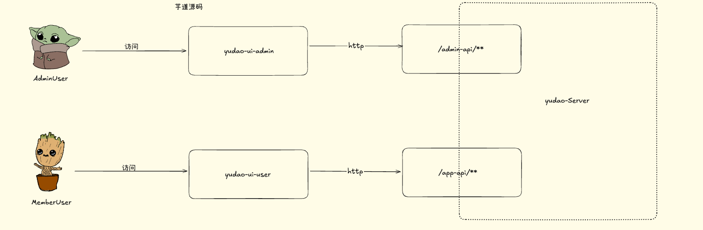
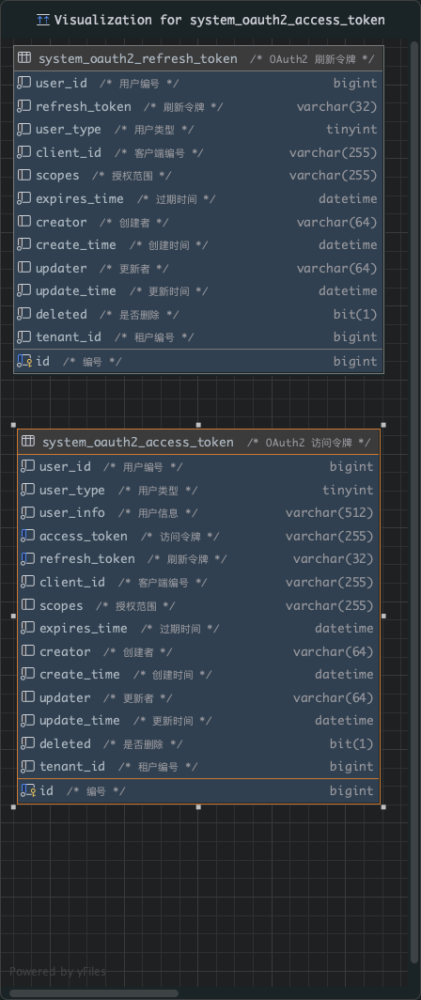

# 芋道

## 模块分布

| 业务系统                                                     | 通用模块              | 框架组件            |
| ------------------------------------------------------------ | --------------------- | ------------------- |
| 商城Mall                                                     | System系统功能        | Web技术组件         |
| OA自动化办公                                                 | Infra基础设施         | Security安全组件    |
| ERP企业资源计划系统（ERP 就是一套把企业里“人、财、物、产、供、销”等所有核心业务统一管理起来的软件系统） | BPM工作流程           | MyBatis数据库组件   |
| CRM客户关系管理系统（CRM 是专门用来“管客户、促成交、提复购”的系统） | Pay支付系统           | Redis缓存组件       |
| CMS内容管理系统（解决的是内容多、更新频繁、非技术人员也可以修改内容的系统，例如公司官网、新闻，产品介绍等） | Member会员中心        | MQ中间件            |
| BBS论坛社区系统（社区系统，贴吧一类）                        | Visualization数据报表 | JOB定时任务         |
|                                                              |                       | Protection组件      |
|                                                              |                       | Monitor监视器组件   |
|                                                              |                       | Test测试            |
|                                                              |                       | Flowable工作流      |
|                                                              |                       | Data Permission组件 |
|                                                              |                       | Tenant 业务组件     |
|                                                              |                       | Pay业务组件         |
|                                                              |                       | SMS业务组件         |
|                                                              |                       | Social 业务组件     |
|                                                              |                       | Operate Log业务组件 |


## 功能权限

### 如何设计一个权限系统

- 目标
- 权限模型
- 选择方案

#### 目标：最基础的解决问题就是校验用户是否可以进行某一个操作

1. 灵活配置权限
2. 多种级别的权限（菜单、按钮、URL）


#### 权限模型

1. RBAC

   全称：基于角色的访问控制

   概念：简而言之，总共有三个类型（用户、角色、权限），用户和权限是通过角色进行交集绑定的，也就是某一个用户有那一些角色，这些角色有哪一些权限。只要用户和角色、角色和权限之间存在交集，就是该用户具有某一个权限。

   好处：简单可复用。

2. ABAC

   全称：基于属性的访问控制

   概念：权限是否被允许，是由以下四个信息共同决定的。

   1. 对象：对象是当前请求访问资源的用户。例如：用户的属性包括ID、个人资源、角色、部门和组织成员身份标识
   2. 资源：资源是当前用户要访问的资产和对象。例如文件、数据、服务器甚至是API
   3. 操作：用户试图对资源进行的操作。常见的操作包括：读取、写入、编辑、删除等
   4. 环境信息：环境是每一个访问请求的上下文。比如：访问的时间和位置，对象的设备、通信协议等

   举例说明：

   以阿里为例。P5（职级）的研发（职位）同学，在公司内网（环境）下，可以查看和下载（操作）代码（资源）。

   部门经理（部门），可以查看、编辑（操作）自己部门下的所有订单（资源）。

   好处：实现非常灵活的权限控制，几乎满足所有类型需求。

   使用场景：用户量很多，授权复杂的场景。

   表结构：


## 用户认证

系统提供了两种类型的用户，分别满足对应的管理后台、用户App 场景。



两种不同类型的用户分别对应两个表：**system_users**、**member_user**表。

> 为什么不使用统一的用户表？
>
> 新增一个type字段表示用户类型，主要是一开始考虑到两个模块是不同的组进行开发，尽量不互相污染数据，采取了多个用户表的方案。

如果之间需要进行关联，可以通过中间表进行处理。**system_oauth2_access_token**。字段：user_type。


### 设计一个双Token系统

双Token机制出现的需求是：

1. Token过期时间不会设计的很长，所以很可能经常需要用户重新登录，影响用户体验。
2. 设置长期的Token安全性降低。

表设计：**访问令牌**和**刷新令牌**



一个是用来存储访问令牌的，另一个是用来存储刷新Token的。

整体步骤：登录接口中有创建Token的方法，在这个方法中需要添加一个方法插入登录日志入库。之后创建访问令牌。创建刷新令牌和访问令牌入库。创建刷新令牌的时候不需要设置到Redis中，原因是这个刷新令牌的过期时间很长30天。之后设置访问令牌，先将访问令牌设置到数据库中，之后设置到Redis中。

如果用户注销登录，删除访问令牌（删除数据库中的和Redis中的），之后删除刷新令牌。之后所有接口进行校验的时候就会出现用户认证失败的问题自动重定向到登录页面。

#### Token校验

前端会携带header中携带的Token的请求发送到后台，在后台中的自定义的 Spring Security 配置适配器实现类中（**YudaoWebSecurityConfigurerAdapter**）添加：

```java
// 添加 Token Filter
httpSecurity.addFilterBefore(authenticationTokenFilter, UsernamePasswordAuthenticationFilter.class);
```

走到我们新增的Token过滤器**TokenAuthenticationFilter**。

1. 拿到前端传到后端的Token，需要去除Bear。
2. 获取用户类型（根据请求路径是**/admin-api/**** 或者 **/app-api/****）来判断是什么类型。
3. 根据Token创建登录用户。
4. 将用户设置到Spring Security上下文中。

```java
    public static void setLoginUser(LoginUser loginUser, HttpServletRequest request) {
        // 创建 Authentication，并设置到上下文
        Authentication authentication = buildAuthentication(loginUser, request);
        SecurityContextHolder.getContext().setAuthentication(authentication);

        // 额外设置到 request 中，用于 ApiAccessLogFilter 可以获取到用户编号；
        // 原因是，Spring Security 的 Filter 在 ApiAccessLogFilter 后面，在它记录访问日志时，线上上下文已经没有用户编号等信息
        if (request != null) {
            WebFrameworkUtils.setLoginUserId(request, loginUser.getId());
            WebFrameworkUtils.setLoginUserType(request, loginUser.getUserType());
        }
    }
```

5. 在业务逻辑中使用这个loginUser的时候直接从Spring Security上下文获取即可。

#### 如何刷新用户令牌

如果修改了accesstoken，后端接口会报错401，前端拿到这个结果需要重新进行刷新接口的请求。也就是：**/system/auth/refresh-token**，后端的步骤：

1. 根据refreshToken获取到表中的数据
2. 移除相关的访问令牌
3. 如果refreshToken过期的话需要删除这个刷新令牌
4. 创建访问令牌（调用之前相同的方法：createOAuth2AccessToken）

代码：

```java
@Override
    @Transactional(rollbackFor = Exception.class)
    public OAuth2AccessTokenDO refreshAccessToken(String refreshToken, String clientId) {
        // 查询访问令牌
        OAuth2RefreshTokenDO refreshTokenDO = oauth2RefreshTokenMapper.selectByRefreshToken(refreshToken);
        if (refreshTokenDO == null) {
            throw exception0(GlobalErrorCodeConstants.BAD_REQUEST.getCode(), "无效的刷新令牌");
        }

        // 校验 Client 匹配
        OAuth2ClientDO clientDO = oauth2ClientService.validOAuthClientFromCache(clientId);
        if (ObjectUtil.notEqual(clientId, refreshTokenDO.getClientId())) {
            throw exception0(GlobalErrorCodeConstants.BAD_REQUEST.getCode(), "刷新令牌的客户端编号不正确");
        }

        // 移除相关的访问令牌
        List<OAuth2AccessTokenDO> accessTokenDOs = oauth2AccessTokenMapper.selectListByRefreshToken(refreshToken);
        if (CollUtil.isNotEmpty(accessTokenDOs)) {
            oauth2AccessTokenMapper.deleteByIds(convertSet(accessTokenDOs, OAuth2AccessTokenDO::getId));
            oauth2AccessTokenRedisDAO.deleteList(convertSet(accessTokenDOs, OAuth2AccessTokenDO::getAccessToken));
        }

        // 已过期的情况下，删除刷新令牌
        if (DateUtils.isExpired(refreshTokenDO.getExpiresTime())) {
            oauth2RefreshTokenMapper.deleteById(refreshTokenDO.getId());
            throw exception0(GlobalErrorCodeConstants.UNAUTHORIZED.getCode(), "刷新令牌已过期");
        }

        // 创建访问令牌
        return createOAuth2AccessToken(refreshTokenDO, clientDO);
    }
```

> 有可能有一个问题：就是已经过期的话这个刷新令牌删除了，但是重新生成的只是accessToken，没有重新生成设置刷新令牌，访问令牌本身时间很短，有可能几天就过期了，这不就又重定向到登录页面了吗？
>
> 对的。这种本身是针对B端使用的场景，需要的就是这种较为安全的策略方式，如果真的想要长时间进行续期，可以考虑两点：
>
> 1. 在请求到这个接口的时候设置重新将refreshToken中的过期时间重新设置成长时间天数，之后请求的话就不会重新设置了。
> 2. 每次执行接口的 时候都需要重新设置refreshToken，但是这种方法很明显不如第一种方案，数据库侵入性比较小。要是说安全的话其实也没有提升多少。


