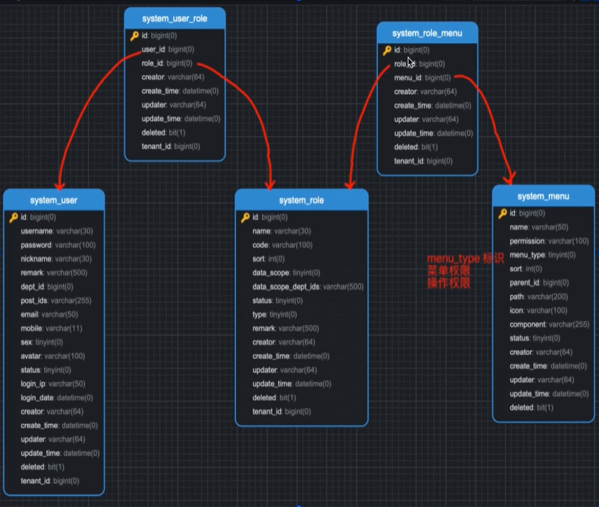

# 芋道

## 模块分布

| 业务系统                                                     | 通用模块              | 框架组件            |
| ------------------------------------------------------------ | --------------------- | ------------------- |
| 商城Mall                                                     | System系统功能        | Web技术组件         |
| OA自动化办公                                                 | Infra基础设施         | Security安全组件    |
| ERP企业资源计划系统（ERP 就是一套把企业里“人、财、物、产、供、销”等所有核心业务统一管理起来的软件系统） | BPM工作流程           | MyBatis数据库组件   |
| CRM客户关系管理系统（CRM 是专门用来“管客户、促成交、提复购”的系统） | Pay支付系统           | Redis缓存组件       |
| CMS内容管理系统（解决的是内容多、更新频繁、非技术人员也可以修改内容的系统，例如公司官网、新闻，产品介绍等） | Member会员中心        | MQ中间件            |
| BBS论坛社区系统（社区系统，贴吧一类）                        | Visualization数据报表 | JOB定时任务         |
|                                                              |                       | Protection组件      |
|                                                              |                       | Monitor监视器组件   |
|                                                              |                       | Test测试            |
|                                                              |                       | Flowable工作流      |
|                                                              |                       | Data Permission组件 |
|                                                              |                       | Tenant 业务组件     |
|                                                              |                       | Pay业务组件         |
|                                                              |                       | SMS业务组件         |
|                                                              |                       | Social 业务组件     |
|                                                              |                       | Operate Log业务组件 |

## 功能权限

### 如何设计一个权限系统

- 目标
- 权限模型
- 选择方案

#### 目标：最基础的解决问题就是校验用户是否可以进行某一个操作

1. 灵活配置权限
2. 多种级别的权限（菜单、按钮、URL）

#### 权限模型

1. RBAC

   全称：基于角色的访问控制

   概念：简而言之，总共有三个类型（用户、角色、权限），用户和权限是通过角色进行交集绑定的，也就是某一个用户有那一些角色，这些角色有哪一些权限。只要用户和角色、角色和权限之间存在交集，就是该用户具有某一个权限。

   好处：简单可复用。

2. ABAC

   全称：基于属性的访问控制

   概念：权限是否被允许，是由以下四个信息共同决定的。

   1. 对象：对象是当前请求访问资源的用户。例如：用户的属性包括ID、个人资源、角色、部门和组织成员身份标识
   2. 资源：资源是当前用户要访问的资产和对象。例如文件、数据、服务器甚至是API
   3. 操作：用户试图对资源进行的操作。常见的操作包括：读取、写入、编辑、删除等
   4. 环境信息：环境是每一个访问请求的上下文。比如：访问的时间和位置，对象的设备、通信协议等

   举例说明：

   以阿里为例。P5（职级）的研发（职位）同学，在公司内网（环境）下，可以查看和下载（操作）代码（资源）。

   部门经理（部门），可以查看、编辑（操作）自己部门下的所有订单（资源）。

   好处：实现非常灵活的权限控制，几乎满足所有类型需求。

   使用场景：用户量很多，授权复杂的场景。

   表结构：

   

