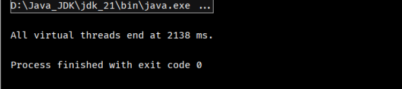
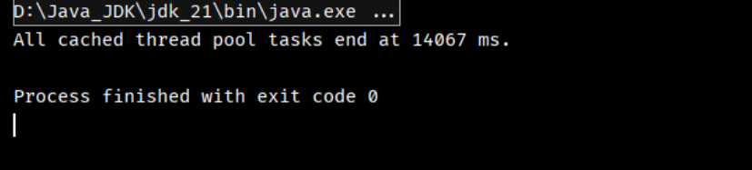
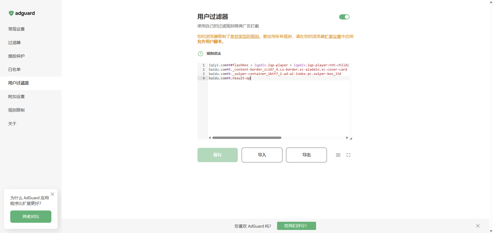
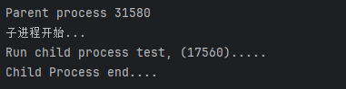
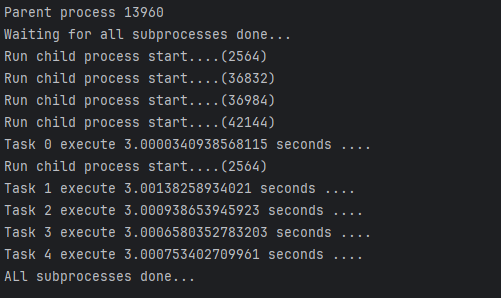

# Java

## 虚拟线程

虚拟线程是Java19引入的一种轻量级线程，在其他语言中被称为协程、纤程、绿色线程、用户态线程等。

线程特点：

- 线程是由操作系统创建并调度的资源
- 线程切换会耗费大量CPU时间
- 一个系统能同时调度的线程数量是有限的，通常在几百到几千之间

线程是一个重量级资源。在服务器端，对用户请求，通常都实现为一个线程处理一个请求。由于用户的请求数往往超过系统所支持的调度的线程数量，所以通常使用线程池来解决这个问题。

对于需要大量处理IO的请求来说，使用线程是很低效的，因为一旦读写 IO，线程必须进入等待状态，直到IO数据返回。常见的IO操作包含：

- 读写文件
- 读写网络，例如HTTP请求
- 读写数据库，JDBC实现的网络调用

一个处理HTTP请求的线程，在读写网络、文件的时候就会进入等待状态：

真正由CPU执行的代码消耗时间非常少，线程大多数是在等待IO。这类任务就是IO密集型任务。

为了可以高效的执行IO密集型，Java19引入了虚拟线程，虚拟线程接口和普通线程是一样的，但是执行方式不同。

> 虚拟线程不是由操作系统调度，而是有普通线程调度，成千上百的虚拟线程由一个线程调度。任何时刻只能执行一个虚拟线程。一旦这个虚拟线程执行一个IO进行等待的时候，他会被立即挂起，之后执行下一个虚拟线程。什么时候虚拟线程返回了，挂起的虚拟线程才会被再次调度。因此，许多的虚拟线程可以在一个普通线程中交替执行。

单独看一个虚拟线程的代码：

```java
void register() {
    config = readConfigFile("./config.json"); // #1
    if (config.useFullName) {
        name = req.firstName + " " + req.lastName;
    }
    insertInto(db, name); // #2
    if (config.cache) {
        redis.set(key, name); // #3
    }
}
```

在1、2、3处，执行到这些地方的时候会自动挂起，并切换到其他虚拟线程执行。等到数据返回之后，当前虚拟线程再次调度并执行，看起来是同步的，但是其实是异步的。

### 使用虚拟线程

方法一：直接创建虚拟线程

```java
// 1 直接创建虚拟线程
        Thread vt = Thread.startVirtualThread(() -> {
            try {
                System.out.println("Start virtual thread1...");
                Thread.sleep(1000);
                System.out.println("End virtual thread1...");
            } catch (InterruptedException e) {
                throw new RuntimeException(e);
            }
        });
```

方法二：创建虚拟线程但是不启动，手动调用start方法启动

```java
        // 2 创建虚拟线程但不自动启动，手动调用start方法启动
        Thread vt2 = Thread.ofVirtual().unstarted(() -> {
            try {
                System.out.println("Start virtual thread2....");
                Thread.sleep(2000);
                System.out.println("End virtual thread2....");
            } catch (InterruptedException e) {
                throw new RuntimeException(e);
            }
        });
        vt2.start();
```

方法三：通过`ThreadFactory`创建虚拟线程，手动调用start方法启动

```java
        // 3 通过虚拟线程的ThreadFactory创建虚拟线程，手动调用start方法启动
        ThreadFactory factory = Thread.ofVirtual().factory();
        // 创建VirtualThread
        Thread vt3 = factory.newThread(() -> {
            try {
                System.out.println("Start virtual thread3....");
                Thread.sleep(3000);
                System.out.println("End virtual thread3....");
            } catch (Exception e) {
                throw new RuntimeException(e);
            }
        });
        vt3.start();
```

方法四：创建调度执行器执行虚拟线程

```java
        // 4 创建调度执行器执行虚拟线程
        ExecutorService executor = Executors.newVirtualThreadPerTaskExecutor();
        // 创建大量线程并调度
        ThreadFactory factory1 = Thread.ofVirtual().factory();
        for (int i = 0; i < 100000; i++) {
            Thread vt4 = factory1.newThread(() -> {
                System.out.println("我是李白");
            });
            executor.submit(vt4);
            // 也可以直接传入Runnable或者Callable
            executor.submit(() -> {
                try {
                    System.out.println("Start virtual thread...");
                    Thread.sleep(4000);
                    System.out.println("End virtual thread...");
                    return true;
                } catch (InterruptedException e) {
                    throw new RuntimeException(e);
                }
            });
        }
```

> 由于虚拟线程是非常轻量级的资源，因此，用时创建，用完就扔，不需要池化虚拟线程。

虚拟线程在Java21正式发布 ，Java19/20是预览功能，默认关闭，需要添加参数启动：

```shell
java --source 19 --enable-preview Main.java
```

### 练习

使用虚拟线程创建100000个任务观察：

```java
        // 虚拟线程
        ExecutorService es_vir = Executors.newVirtualThreadPerTaskExecutor();
        long start_vir = System.currentTimeMillis();
        for (int i = 0; i < 100000; i++) {
            es_vir.submit(() -> {
                Thread.sleep(1000);
                return 0;
            });
        }
        es_vir.close();
        long end_vir = System.currentTimeMillis();
        System.out.println();
        System.out.printf("All virtual threads end at %s ms.\n", end_vir - start_vir);
```

为了比较，我们加上正常使用线程池的代码：（用的是CachedThreadPool）

```java
        int numTasks = 100_000;
        ExecutorService es = Executors.newCachedThreadPool();
        long start = System.currentTimeMillis();
        // 收集任务返回的 Future 以等待所有任务完成
        List<Future<Integer>> futures = new ArrayList<>(numTasks);
        for (int i = 0; i < numTasks; i++) {
            futures.add(es.submit(() -> {
                try {
                    Thread.sleep(1000); // 模拟阻塞操作
                } catch (InterruptedException e) {
                    Thread.currentThread().interrupt();
                }
                return 0;
            }));
        }
        // 等待所有任务执行完毕
        for (Future<Integer> future : futures) {
            try {
                future.get();
            } catch (ExecutionException e) {
                e.printStackTrace();
            }
        }
        es.shutdown();
        long end = System.currentTimeMillis();
        System.out.printf("All cached thread pool tasks end at %d ms.%n", end - start);
```

运行两者：

虚拟线程的运行结果如下：



使用CachedThreadPool运行结果如下：



差距还是十分明显的。


## dify部署大模型

本地使用ollama搭建了一个qwen3的模型。在设置dify的模型供应商的时候会出现127.0.0.1不能访问的情况。

如果本地安装了docket desktop，可以直接使用：

```shell
http://host.docker.internal:11434
```

监听本地ollama模型


## git pull 代码之后出现文件夹只读的问题

Windows解除只读属性的命令：

```shell
attrib -r /s /d *
```

## 百度关闭AI智能搜索

```shell
baidu.com##._content-border_zc167_4.cu-border.sc-aladdin.sc-cover-card
baidu.com##._swiper-container_1ktf7_2.wd-ai-index-pc.swiper-box_33d
baidu.com##.result-op
```

Adguard中用户过滤器加上如上几行即可。



# Python

## multiprocessing（跨平台版本的多进程模块）

- 父子进程

```python
import time
from multiprocessing import Process
import os

# 子进程要执行的代码
def run_proc(name):
    time.sleep(3)
    print(f'Run child process {name}, ({os.getpid()}).....')
if __name__ == '__main__':
    print(f'Parent process {os.getpid()}')
    p = Process(target=run_proc, args=('test',))
    print(f'子进程开始...')

    p.start()
    p.join()
    print('Child Process end....')
```

执行结果：

使用Process启动进程，`target`设置执行方法，`args`设置成方法所需参数。`start`方法开始执行，`join`方法等待子线程执行完成之后父线程执行。

- Pool 进程池

```python
from multiprocessing import Pool
import os
import time
import random

def long_time_task(name):
    print(f'Run child process start....({os.getpid()})')
    startTime = time.time()
    time.sleep(3)
    endTime = time.time()
    print(f'Task {name} execute {endTime - startTime} seconds ....')
if __name__ == '__main__':
    print(f'Parent process {os.getpid()}')
    p = Pool(4)
    for i in range(5):
        p.apply_async(long_time_task, args=(i, ))
    print('Waiting for all subprocesses done...')
    p.close()
    p.join()
    print('ALl subprocesses done...')
```

执行结果：

仔细观察执行过程的话会发现0,1,2,3进程会同时立即执行，4任务需要等到之前的某一个任务完成之后才会执行，原因是设置的Pool大小是4，也就是池子是4，0，1，2,3已经占据了全部，需要等到资源释放才能重新进入4任务。

`close`方法是关闭方法，关闭之后进程不能继续添加。

- 父子进程通信

```python
from multiprocessing import Process, Queue
import os, time, random

def write(q):
    print(f'写进程{os.getpid()}')
    for value in ['A', 'B', 'C']:
        print(f'Put {value} to queue...')
        q.put(value)
        time.sleep(random.random())

def read(q):
    print(f'读进程{os.getpid()}')
    while True:
        # block=True，会一直等到队列中有数据，timeout是设置等待的时长，如果超过的报错
        value = q.get(True, timeout=2)
        print(f'Get {value} from queue')

if __name__ == '__main__':
    q= Queue()
    pw = Process(target=write, args=(q, ))
    pr = Process(target=read, args=(q, ))
    pw.start()
    pr.start()
    pw.join()
    pr.terminate()
```

执行结果：

创建队列，开启进程向队列中写数据和读数据，最后关闭。

## 多线程


