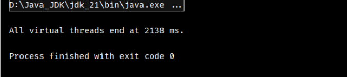
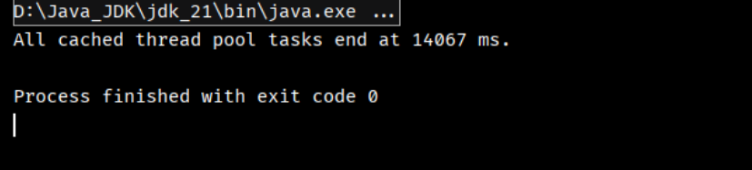
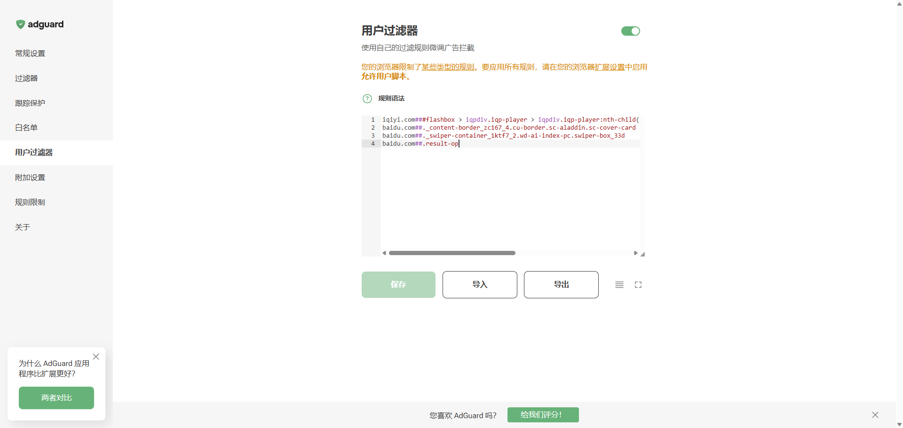
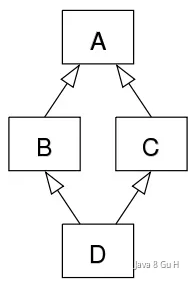
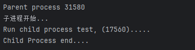
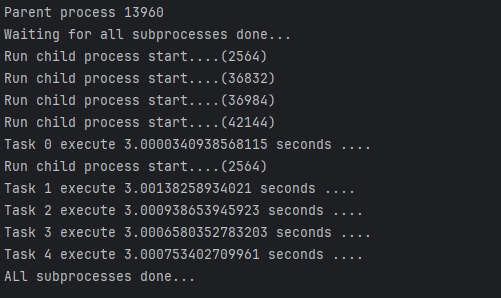
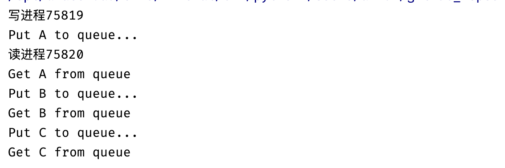
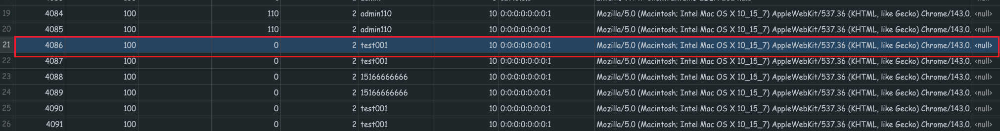
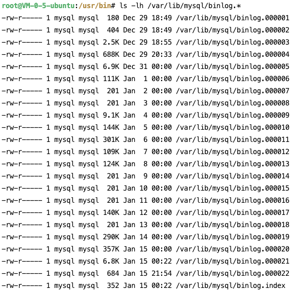
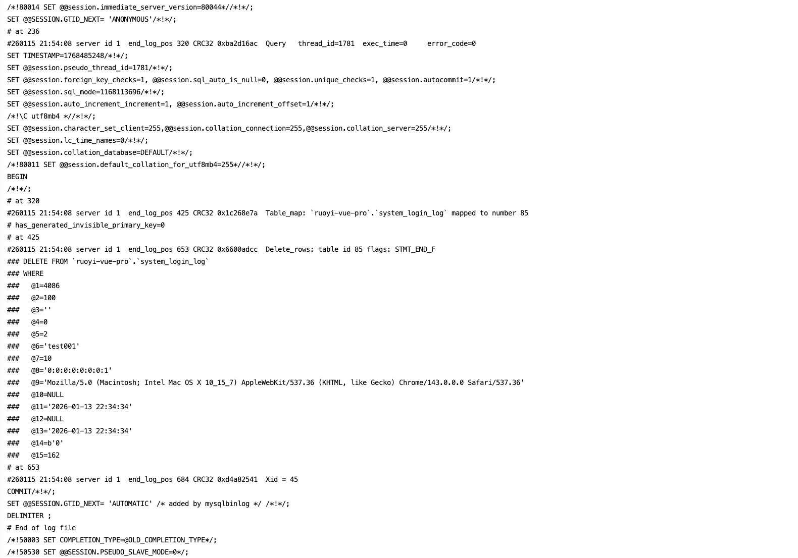

# Java

## 虚拟线程

虚拟线程是Java19引入的一种轻量级线程，在其他语言中被称为协程、纤程、绿色线程、用户态线程等。

线程特点：

- 线程是由操作系统创建并调度的资源
- 线程切换会耗费大量CPU时间
- 一个系统能同时调度的线程数量是有限的，通常在几百到几千之间

线程是一个重量级资源。在服务器端，对用户请求，通常都实现为一个线程处理一个请求。由于用户的请求数往往超过系统所支持的调度的线程数量，所以通常使用线程池来解决这个问题。

对于需要大量处理IO的请求来说，使用线程是很低效的，因为一旦读写 IO，线程必须进入等待状态，直到IO数据返回。常见的IO操作包含：

- 读写文件
- 读写网络，例如HTTP请求
- 读写数据库，JDBC实现的网络调用

一个处理HTTP请求的线程，在读写网络、文件的时候就会进入等待状态：

真正由CPU执行的代码消耗时间非常少，线程大多数是在等待IO。这类任务就是IO密集型任务。

为了可以高效的执行IO密集型，Java19引入了虚拟线程，虚拟线程接口和普通线程是一样的，但是执行方式不同。

> 虚拟线程不是由操作系统调度，而是有普通线程调度，成千上百的虚拟线程由一个线程调度。任何时刻只能执行一个虚拟线程。一旦这个虚拟线程执行一个IO进行等待的时候，他会被立即挂起，之后执行下一个虚拟线程。什么时候虚拟线程返回了，挂起的虚拟线程才会被再次调度。因此，许多的虚拟线程可以在一个普通线程中交替执行。

单独看一个虚拟线程的代码：

```java
void register() {
    config = readConfigFile("./config.json"); // #1
    if (config.useFullName) {
        name = req.firstName + " " + req.lastName;
    }
    insertInto(db, name); // #2
    if (config.cache) {
        redis.set(key, name); // #3
    }
}
```

在1、2、3处，执行到这些地方的时候会自动挂起，并切换到其他虚拟线程执行。等到数据返回之后，当前虚拟线程再次调度并执行，看起来是同步的，但是其实是异步的。

### 使用虚拟线程

方法一：直接创建虚拟线程

```java
// 1 直接创建虚拟线程
        Thread vt = Thread.startVirtualThread(() -> {
            try {
                System.out.println("Start virtual thread1...");
                Thread.sleep(1000);
                System.out.println("End virtual thread1...");
            } catch (InterruptedException e) {
                throw new RuntimeException(e);
            }
        });
```

方法二：创建虚拟线程但是不启动，手动调用start方法启动

```java
        // 2 创建虚拟线程但不自动启动，手动调用start方法启动
        Thread vt2 = Thread.ofVirtual().unstarted(() -> {
            try {
                System.out.println("Start virtual thread2....");
                Thread.sleep(2000);
                System.out.println("End virtual thread2....");
            } catch (InterruptedException e) {
                throw new RuntimeException(e);
            }
        });
        vt2.start();
```

方法三：通过`ThreadFactory`创建虚拟线程，手动调用start方法启动

```java
        // 3 通过虚拟线程的ThreadFactory创建虚拟线程，手动调用start方法启动
        ThreadFactory factory = Thread.ofVirtual().factory();
        // 创建VirtualThread
        Thread vt3 = factory.newThread(() -> {
            try {
                System.out.println("Start virtual thread3....");
                Thread.sleep(3000);
                System.out.println("End virtual thread3....");
            } catch (Exception e) {
                throw new RuntimeException(e);
            }
        });
        vt3.start();
```

方法四：创建调度执行器执行虚拟线程

```java
        // 4 创建调度执行器执行虚拟线程
        ExecutorService executor = Executors.newVirtualThreadPerTaskExecutor();
        // 创建大量线程并调度
        ThreadFactory factory1 = Thread.ofVirtual().factory();
        for (int i = 0; i < 100000; i++) {
            Thread vt4 = factory1.newThread(() -> {
                System.out.println("我是李白");
            });
            executor.submit(vt4);
            // 也可以直接传入Runnable或者Callable
            executor.submit(() -> {
                try {
                    System.out.println("Start virtual thread...");
                    Thread.sleep(4000);
                    System.out.println("End virtual thread...");
                    return true;
                } catch (InterruptedException e) {
                    throw new RuntimeException(e);
                }
            });
        }
```

> 由于虚拟线程是非常轻量级的资源，因此，用时创建，用完就扔，不需要池化虚拟线程。

虚拟线程在Java21正式发布 ，Java19/20是预览功能，默认关闭，需要添加参数启动：

```shell
java --source 19 --enable-preview Main.java
```

### 练习

使用虚拟线程创建100000个任务观察：

```java
        // 虚拟线程
        ExecutorService es_vir = Executors.newVirtualThreadPerTaskExecutor();
        long start_vir = System.currentTimeMillis();
        for (int i = 0; i < 100000; i++) {
            es_vir.submit(() -> {
                Thread.sleep(1000);
                return 0;
            });
        }
        es_vir.close();
        long end_vir = System.currentTimeMillis();
        System.out.println();
        System.out.printf("All virtual threads end at %s ms.\n", end_vir - start_vir);
```

为了比较，我们加上正常使用线程池的代码：（用的是CachedThreadPool）

```java
        int numTasks = 100_000;
        ExecutorService es = Executors.newCachedThreadPool();
        long start = System.currentTimeMillis();
        // 收集任务返回的 Future 以等待所有任务完成
        List<Future<Integer>> futures = new ArrayList<>(numTasks);
        for (int i = 0; i < numTasks; i++) {
            futures.add(es.submit(() -> {
                try {
                    Thread.sleep(1000); // 模拟阻塞操作
                } catch (InterruptedException e) {
                    Thread.currentThread().interrupt();
                }
                return 0;
            }));
        }
        // 等待所有任务执行完毕
        for (Future<Integer> future : futures) {
            try {
                future.get();
            } catch (ExecutionException e) {
                e.printStackTrace();
            }
        }
        es.shutdown();
        long end = System.currentTimeMillis();
        System.out.printf("All cached thread pool tasks end at %d ms.%n", end - start);
```

运行两者：

虚拟线程的运行结果如下：



使用CachedThreadPool运行结果如下：



差距还是十分明显的。


## dify部署大模型

本地使用ollama搭建了一个qwen3的模型。在设置dify的模型供应商的时候会出现127.0.0.1不能访问的情况。

如果本地安装了docket desktop，可以直接使用：

```shell
http://host.docker.internal:11434
```

监听本地ollama模型


## git pull 代码之后出现文件夹只读的问题

Windows解除只读属性的命令：

```shell
attrib -r /s /d *
```

## 百度关闭AI智能搜索

```shell
baidu.com##._content-border_zc167_4.cu-border.sc-aladdin.sc-cover-card
baidu.com##._swiper-container_1ktf7_2.wd-ai-index-pc.swiper-box_33d
baidu.com##.result-op
```

Adguard中用户过滤器加上如上几行即可。



## 阿里TransmittableThreadLocal

如果使用ThreadLocal：

```java
public class ThreadLocalTest {
    private static final ThreadLocal THREAD_LOCAL = new ThreadLocal();

    public static void main(String[] args) {
        THREAD_LOCAL.set(1);

        System.out.println(StrUtil.format("父线程的值是:{}", THREAD_LOCAL.get()));

        // 子线程
        new Thread(new Runnable() {
            @Override
            public void run() {
                System.out.println(StrUtil.format("子线程的值是:{}", THREAD_LOCAL.get()));
            }
        }, "子线程").start();
    }
}
```

运行结果：

子线程获取不到父线程的值。

将ThreadLocal换成TransmittableThreadLocal之后可以看到打印值：


如果在日常业务中使用，如下：

定义**ThreadUtils**工具类：

```java
public class ThreadUtils {
    private static final ThreadLocal<String> THREAD_LOCAL = new ThreadLocal<>();

    public static void set(String value) {
        THREAD_LOCAL.set(value);
    }

    public static String get() {
        return THREAD_LOCAL.get();
    }

    public static void remove(){
        THREAD_LOCAL.remove();
    }
}
```

Controller中先设置ThreadLocal：

```java
    @GetMapping("/threadLocalTest")
    public String threadLocalTest() {
        ThreadUtils.set("zhangsan");
        testService.threadLocalTest();
        return "";
    }
```

实现类中：

```java
    @Override
    public void threadLocalTest() {
        String userName = ThreadUtils.get();
        System.out.println("测试线程用户名称:" + userName);
        logService.recordLog();
    }

    @Override
    @Async
    public void recordLog() {
        System.out.println("记录日志信息：操作人是:" + ThreadUtils.get());
    }
```

结果：


工具类中的**ThreadLocal**换成**TransmittableThreadLocal**之后

结果：


## Java Basic

### Java多态

多态实现的三个条件：

- 有类继承或接口实现
- 子类重写父类方法
- 父类引用指向子类对象

```java
public class Parent {
    public void call() {
        sout("Im Parent");
    }
}

public class Son extends Parent {
    @Overide 
    public void call() {
        sout("Im son");
    }
}

public class Daughter extends Parent {
    @Overide
    public void call() {
        sout("Im Daughter");
    }
}

public class Test {
    main() {
        Parent p = new Son();
        Parent p1 = new Daughter();
    }
}
```

上述就是完整实现了三条规则。

上述代码看来，这种所谓的多态不就是自己声明的吗？p就是SON，p1就是Daughter。但是有的时候像Spring IOC中创建容器的时候并不会让开发人员进行处理，如下代码：

```java
public class PayDomainService {
    @Autowired
    PayServiceFactory payServiceFactory;
    
    public void pay(PayRequest payRequest) {
        String payChannel = payRequest.getPayChannel();
        payServiceFactory.getPayService(payChannel).pay();
    }
}
```

上述代码还能看出来PayService如何声明的吗？看不出来，实际上是通过不同的支付渠道有了不同的Service，如果传递的是WxPayService，那么拿到的就是WxPayService了。

多态是一种运行期的概念。

> 回答：多态是一种运行期的特性，Java中是通过方法重写来实现多态，有人在StackOverFlow中提出了重载应该也是多态的实现，属于静态多态。但是我认为不属于。


### Why Java not support Multiple inheritance?

不支持的原因是担心出现C++中的菱形继承的问题，C++为了解决菱形继承的问题又引入了虚继承。在最初调研的时候发现人们使用多继承的时候并不多，所以也就没有设计多继承，但是可以实现多个接口（Java8以前）。当然Java8以后的话由于接口允许添加方法实现体了，default method，在接口中如果实现了方法，那么如果一个类实现了这个接口同时实现了另一个接口，两个接口中都存在同一个方法名，编译时报错需要手动重写这个方法在类中。

**什么是菱形继承问题呢？**

如图所示：

其中存在父类A，还有继承这个A类的B和C，之后有一个D继承了B和C，那么这个D中关于A的属性就会是双倍的，如果说使用这个D调用A的某一个方法的话就会出现歧义。出现问题。


# Python

## multiprocessing（跨平台版本的多进程模块）

- 父子进程

```python
import time
from multiprocessing import Process
import os

# 子进程要执行的代码
def run_proc(name):
    time.sleep(3)
    print(f'Run child process {name}, ({os.getpid()}).....')
if __name__ == '__main__':
    print(f'Parent process {os.getpid()}')
    p = Process(target=run_proc, args=('test',))
    print(f'子进程开始...')

    p.start()
    p.join()
    print('Child Process end....')
```

执行结果：

使用Process启动进程，`target`设置执行方法，`args`设置成方法所需参数。`start`方法开始执行，`join`方法等待子线程执行完成之后父线程执行。

- Pool 进程池

```python
from multiprocessing import Pool
import os
import time
import random

def long_time_task(name):
    print(f'Run child process start....({os.getpid()})')
    startTime = time.time()
    time.sleep(3)
    endTime = time.time()
    print(f'Task {name} execute {endTime - startTime} seconds ....')
if __name__ == '__main__':
    print(f'Parent process {os.getpid()}')
    p = Pool(4)
    for i in range(5):
        p.apply_async(long_time_task, args=(i, ))
    print('Waiting for all subprocesses done...')
    p.close()
    p.join()
    print('ALl subprocesses done...')
```

执行结果：

仔细观察执行过程的话会发现0,1,2,3进程会同时立即执行，4任务需要等到之前的某一个任务完成之后才会执行，原因是设置的Pool大小是4，也就是池子是4，0，1，2,3已经占据了全部，需要等到资源释放才能重新进入4任务。

`close`方法是关闭方法，关闭之后进程不能继续添加。

- 父子进程通信

```python
from multiprocessing import Process, Queue
import os, time, random

def write(q):
    print(f'写进程{os.getpid()}')
    for value in ['A', 'B', 'C']:
        print(f'Put {value} to queue...')
        q.put(value)
        time.sleep(random.random())

def read(q):
    print(f'读进程{os.getpid()}')
    while True:
        # block=True，会一直等到队列中有数据，timeout是设置等待的时长，如果超过的报错
        value = q.get(True, timeout=2)
        print(f'Get {value} from queue')

if __name__ == '__main__':
    q= Queue()
    pw = Process(target=write, args=(q, ))
    pr = Process(target=read, args=(q, ))
    pw.start()
    pr.start()
    pw.join()
    pr.terminate()
```

执行结果：

创建队列，开启进程向队列中写数据和读数据，最后关闭。

## 多线程


## argparse模块

是一个用于命令行、参数和子命令解析器。

可以轻松编写用户友好的命令行接口。程序定义需要的参数，之后argparse将弄清如何从sys.argv解析出那一些参数。

1. 创建解析器

```python
```


## httpx模块

Httpx是Python3的全功能 HTTP 客户端，提供了同步和异步API，官网API: [https://www.python-httpx.org/](https://link.zhihu.com/?target=https%3A//www.python-httpx.org/)

- 安装

```shell
pip install httpx # 安装库
pip install httpx[http2] # 安装http2的支持
pip install httpx[brotli] # 安装brotli解码器的支持
```

- Get请求

```python
import httpx
from fake_useragent import UserAgent

headers = {
    'user-agent': UserAgent().random,
}
params = {
    'wd': 'python'
}
response = httpx.get('https://www.baidu.com/s', params=params, headers=headers)
response.encoding = response.charset_encoding
print(response.text)
```

会触发百度的反爬虫，其实拿不到结果。

- post请求(表单)

```python
data = {'key1': 'value1', 'key2': 'value2'}
r = httpx.post("https://httpbin.org/post", data=data)
print(r.text)
```

**客户端**

`httpx.Client()`可以代替`reuqests.Session()`。`Client()`使用http连接池。

- 创建Client

```python
with httpx.Client() as client:
    pass

client = httpx.Client()
try:
    pass
finally:
    client.close()
```

- 发送请求

```python
# 共用请求头
url = 'http://httpbin.org/headers'
headers = {'user-agent': 'my-app/0.0.1'}
with httpx.Client(headers=headers) as client:
    r = client.get(url)

print(r.json()['headers']['User-Agent'])

# 公共 + 私有
headers = {'X-Auth': "from-client"}
params = {'client_id': "client1"}
with httpx.Client(headers=headers, params=params) as client:
    headers_ = {'X-Custom': 'from-request'}
    params_ = {'request_id': 'request1'}
    r = client.get('https://example.com', headers=headers_, params=params_)
print(r.request.url) # https://example.com?client_id=client1&request_id=request1，可以看到参数中是结合了公共的 + 私有的值
print(r.request.headers['X-Auth']) # from-client
print(r.request.headers['X-Custom']) # from-request
```


# GIT

## git回退代码（删除提交，重新提交代码）

1. 本地回退（`git reset`）
2. 远程删除（`git push --force-with-lease`）：强制推送
3. 重新提交（`git commit `）

```shell
git reset --soft HEAD^

或者

git reset --soft <A的哈希值>
```

验证本地仓库的文件状态：

```shell
git status
```

删除远程仓库的错误提交

```shell
git push --force-with-lease origin ***
```

重新提交代码

```shell
git commit --author "****" -m "real commit"

git push origin ****
```

## MySQL

### 如何实现误删数据将数据还原

我们有一个数据表：``ruoyi-vue-pro`.`system_login_log``,我们删除了其中的一条记录。



4086的数据已经被删除了，但是我们发现是误操作。这时候需要看看使用binlog恢复了。前提需要开启Binlog（检查命令:`show variables  like 'log_bin'`，如果是`ON`是打开的）

1. 检查Binlog日志文件：

```shell
root@VM-0-5-ubuntu:/usr/bin# ls -lh /var/lib/mysql/binlog.*
```

结果如下：



找到最近删除的日志：是`binlog.000022`。

2. 打开看看日志内容

```shell
mysqlbinlog --no-defaults --base64-output=DECODE-ROWS -v /var/lib/mysql/binlog.000022
```



观察到其中有一个delete日志记录。我们可以根据这个日志内容将删除数据恢复。

3. 我们使用Java实现数据恢复，主要就是将日志文件拿到，之后使用文件读写恢复即可。文件我已经拷贝到了本地。

```java
public class RestoreData {
    // 数据库配置
    private static final String DB_URL = "jdbc:mysql://localhost:3306/ruoyi-vue-pro?useUnicode=true&characterEncoding=utf8&serverTimezone=Asia/Shanghai";
    private static final String DB_USER = "admin";
    private static final String DB_PASS = "Zhang123456.";

    // 日志文件路径
    private static final String LOG_FILE_PATH = "/Users/a1234/github_repository/Test-new-code/src/test/java/com/zxh/test/mysql/test/binlog_decoded.log";

    public static void main(String[] args) {
        restoreData(LOG_FILE_PATH);
    }

    public static void restoreData(String filePath) {
        Connection conn = null;
        Statement stmt = null;
        BufferedReader reader = null;

        try {
            // 1. 建立数据库连接
            conn = DriverManager.getConnection(DB_URL, DB_USER, DB_PASS);
            conn.setAutoCommit(false); // 开启事务，方便批量提交
            stmt = conn.createStatement();

            reader = new BufferedReader(new FileReader(filePath));
            String line;

            // 正则匹配 @1=xxx 这种格式
            // Group 1: 索引号, Group 2: 值
            Pattern columnPattern = Pattern.compile("###\\s+@(\\d+)=(.*)");

            String currentTable = null;
            Map<Integer, String> currentRowValues = new TreeMap<>(); // 使用TreeMap保证字段按顺序排列
            int batchCount = 0;
            int totalRestored = 0;

            System.out.println("开始解析并恢复数据...");

            while ((line = reader.readLine()) != null) {
                line = line.trim();

                // 2. 识别新的一行数据的开始 (DELETE FROM ...)
                if (line.startsWith("### DELETE FROM")) {
                    // 如果上一行数据存在，先保存上一行
                    if (!currentRowValues.isEmpty() && currentTable != null) {
                        String sql = buildInsertSql(currentTable, currentRowValues);
                        stmt.addBatch(sql);
                        batchCount++;
                        totalRestored++;
                    }

                    // 重置状态，准备读取新的一行
                    currentRowValues.clear();
                    // 提取表名: ### DELETE FROM `db`.`table` -> `db`.`table`
                    currentTable = line.substring(line.indexOf("FROM") + 5).trim();
                }
                // 3. 识别字段值 (### @1=...)
                else if (line.startsWith("###") && line.contains("@")) {
                    Matcher matcher = columnPattern.matcher(line);
                    if (matcher.find()) {
                        int colIndex = Integer.parseInt(matcher.group(1));
                        String colValue = matcher.group(2).trim();
                        currentRowValues.put(colIndex, colValue);
                    }
                }

                // 4. 批量执行 (每1000条提交一次)
                if (batchCount >= 1000) {
                    stmt.executeBatch();
                    conn.commit();
                    System.out.println("已恢复 " + totalRestored + " 条记录...");
                    batchCount = 0;
                }
            }

            // 5. 处理最后一条记录
            if (!currentRowValues.isEmpty() && currentTable != null) {
                String sql = buildInsertSql(currentTable, currentRowValues);
                stmt.addBatch(sql);
                stmt.executeBatch();
                conn.commit();
                totalRestored++;
            }

            System.out.println("恢复完成！共恢复数据: " + totalRestored + " 条。");

        } catch (Exception e) {
            e.printStackTrace();
            try { if (conn != null) conn.rollback(); } catch (Exception ex) {}
        } finally {
            try {
                if (reader != null) reader.close();
                if (stmt != null) stmt.close();
                if (conn != null) conn.close();
            } catch (Exception e) {}
        }
    }

    /**
     * 构建 INSERT SQL 语句
     */
    private static String buildInsertSql(String tableName, Map<Integer, String> values) {
        StringBuilder sb = new StringBuilder();
        sb.append("INSERT INTO ").append(tableName).append(" VALUES (");

        boolean first = true;
        for (String val : values.values()) {
            if (!first) {
                sb.append(", ");
            }
            // 这里的 val 是从日志里直接拿出来的，例如 'test001' (带引号) 或 100 (不带引号)
            // MySQL Binlog decode 后的格式通常可以直接用于 SQL，除了 bit 类型可能需要微调
            // 但通常 b'0' 这种格式 MySQL 是支持直接 Insert 的
            sb.append(val);
            first = false;
        }
        sb.append(");");
        return sb.toString();
    }
}
```

# RocketMQ

## RocketMQ重复消费

主要就是三种：

1. Consumer向Broker返回消费失败：只要是Consumer向Broker返回了`RECONSUME_LATER`状态就会出现消息重投
2. Consumer消费超时了：消息消费超时，Broker也会触发回查的操作，导致重复
3. 消息发送重复：有可能出现网络波动，有可能将成功的消息重新发送了一遍，导致重复
4. 广播分发：并非属于重复消费，但是如果所有的消费者的内部逻辑相同，效果类似于重复消费了

如何解决呢？

最主要的解决方式就是做好幂等操作。

对于消息重复消费的问题，比较常见的方式是通过在消息中定义一个幂等号，一般是跟业务相关的幂等号，如果没有的话也可以使用消息发送的msg_id，但是使用msg_id 会出现的 问题就是如果消息提供方重复发送了就会导致msg_id都不相同，幂等的作用就消失了。我们是使用<商品id + 用户id>来实现的幂等号。

对于重复下单的幂等操作怎么做呢？最好的方式就是在真正访问到下单接口之前生成一个幂等号，将这个幂等号存储到Redis中，之后用户在每一次访问订单详情页面或者下单页面的时候都会获取这个Token（幂等号），之后用户真正下单的时候就会将这个Token从Redis中删除。那么会不会出现恶意的刷一批量的Token之后拿着这个Token进行批量下单的操作呢？实际上是不会的，我们是通过：**用户ID + 商品ID**作为Key，UUID的加密结果作为Value进行存储到Redis中的。如果存在重复的获取的话Redis中还是只会存在一个Token，最终下单的时候其余的无效的Token会被拦截，只有最后一次的Token会正常下单成功。

还有一种情况，如果我们是通过RocketMQ中批量进行消费的，使用了线程池进行批量处理。之后按照64条消息一次拉取，如果其中一条消息出现报错，整体都要：`RECONSUME_LATER`重试，是否会出现重复消费的问题呢？正常来说是很可能出现的，但是我们在代码中的业务逻辑处理部分一般都是会加分布式锁注解 + 开头的幂等校验的，比如库存的部分就是在最开始的位置拿到Redis中的stream记录，如果存在的话就不会再扣减库存了，直接返回了。

## rocketMQ 消息不丢失

在三个端：生产者、Broker、消费者端都需要进行处理。

生产者端消息的主要发送方式是有：同步发送、异步发送和单向发送。在同步发送的情况下消息是会阻塞等待Broker返回结果；异步发送的情况下是Broker接收到消息之后直接返回结果，具体执行是否成功，还是取决于Broker自身，需要有方法检测是否执行成功（onSuccess和onException）。

默认的Broker刷盘策略是：先将内容存储到内存中，内存存储成功之后，返回结果成功了。之后通过异步刷盘的方式进行硬盘存储，这时候就会出现如果宕机的话数据丢失的问题。将刷盘策略修改成`SYNC_FLUSH`即可。

```shell
flushDiskType = SYNC_FLUSH
```

为了保证减少宕机的风险，往往采用多机器的方式：一主多从的部署方式，采用主从同步的方式进行数据复制。

默认情况下，Broker在接收到消息之后，写入master成功，就可以返回确认响应给生产者了，接着消息将会异步复制到SLave节点。但是如果这个过程中，Master的磁盘损坏了。就会导致数据丢失。

解决这个问题的方法依旧是异步转成同步处理：

```shell
brokerRole = SYNC_MASTER
```

在消费者端，主要就是在消费者接收到消息并消费完成之后返回给Broker ACK即可，就能保证消息不丢失了，如果Broker一直没有收到ACK，那么就可以重试。所以在消费者端必须在最后的时候`return ConsumeConcurrentlyStatus.CONSUME_SUCCESS`。

只能尽可能避免，无法保证完全不丢失，再出问题只能靠人工核对了。

## RocketMQ消息堆积

MQ本身的作用就是削峰填谷，本身的消息堆积是可以理解的。主要还是看看其中堆积的数量以及业务对时间的实时性的要求，如果业务可以接受一定的延迟的话慢一点也无所谓。

解决方案：总共是分成了两种方案，一种是临时线上的方案，另一种是长期的方案。

临时方案的话就是增加Consumer的数量，扩容的时候需要考虑到下游应用的负载。

长期方案的话就是在代码方面的优化了。

1. 消息的投递速度慢
2. 存在慢SQL执行
3. 单线程存在了瓶颈
4. 下游服务RT变长
5. Consumer中的执行链路太长

1和3可以通过RocketMQ中的批量拉取消息并使用线程池的方式进行批量消费；

2 的话出现慢SQL，一般情况是数据量比较大了，CRUD变慢了，基本上就是需要数据库层面的优化了，索引、数据归档、分库分表等方式；

4 的话就是下游服务需要自己处理了，我们就无能为力了；

5 的话可以采用先收单，之后通过定时任务慢慢处理，这种一般用不到。

## RocketMQ中的pull、push、pop模式

pull 拉模式是主要的方式。主要适合一些实时性场景不高

push 推模式是pull 模式的变种，是基于长连接搭建的一个推的通道，实时性比较高，但是可能出现消息堆积的问题，流量太大的话甚至会崩溃。

pop 模式是MQ 5版本为了取代push 模式的，push 模式主要的问题是：MessageQueue数量是固定的，如果消费者数量达到Queue的大小之后再次增加数量的话负载均衡就会空转。除了负载均衡的问题还有其他的问题，消息拉取、消息的消费点位管理等。是的Consumer的责任很多，出错的概率就会很大。

pop模式中将MessageQueue与消费者进行拆分，pop的消费位点也和Broker保存和控制。消费者直接通过pop API 获取数据即可，消费成功之后 ACK 数据。

# Nacos

## Nacos是CP还是AP的？

可以动态切换，默认是AP。可以通过切换

```properties
nacos.core.support.ephemeral=false
```

来切换CP模式。

具体应该如何选择呢？还是要看业务场景对数据一致性的要求。如果是要求很高就需要切换到CP模式，比如金融场景。如果是可以有时效延迟的话还是推荐默认的AP模式。

AP模式主要用于场景是注册中心，绝对不能牺牲的是可用性，否则会影响到不同服务之间的调用；

CP模式需要用于配置中心，这种 的话保证的就是配置的实时更新，一致性要求相对较高。

CP采用的Raft，AP采用的是Distro。

## Nacos实现配置的修改客户端如何感知到？

客户端和配置中心无非就是两种通知方式：推和拉。

**长连接**和**客户端轮训**。

推的模式就是客户端和服务端建立一个长连接，如果配置发生变化，服务端通过建立的长连接通道通知到客户端，客户端进行相应的修改。

拉的模式就是客户端轮训，通过不断轮询的方式检测，可能会出现一定的延迟。

Nacos 1.0版本的使用的是长轮询，不是长连接也不是轮询。

Nacos 2版本采用的是gRPC长连接。

### 长轮询

长轮询其实是客户端向Nacos发起了一个请求，Nacos不直接响应，而是等到配置发生变化之后将响应返回给客户端，之后客户端重新发送一个请求，如此便可以实时感知配置变化。

### 长连接

是在客户端和服务端建立了一个长期的通道，如果配置发生变化Nacos服务端会通过这个通过将信息发送到客户端，之后客户端就可以根据这个信息处理。

> 两者最主要的区别就是长轮询是主题是客户端，是通过客户端发送消息，之后服务端响应。长连接是服务端为主体。


